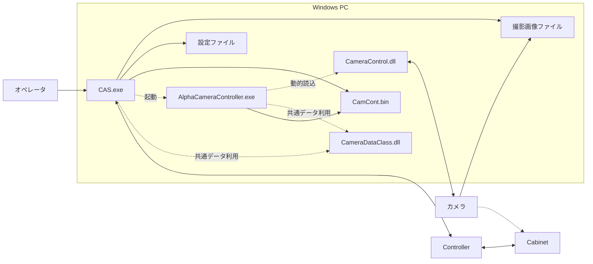
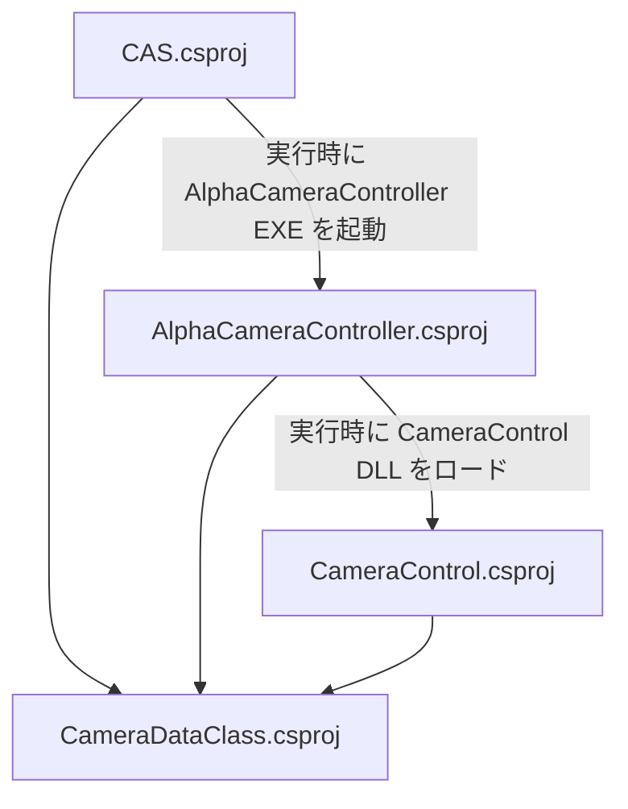
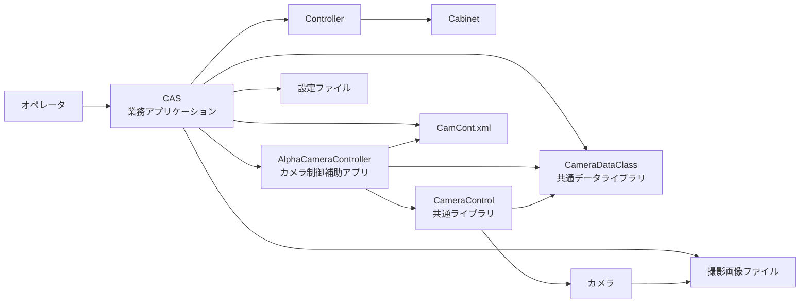
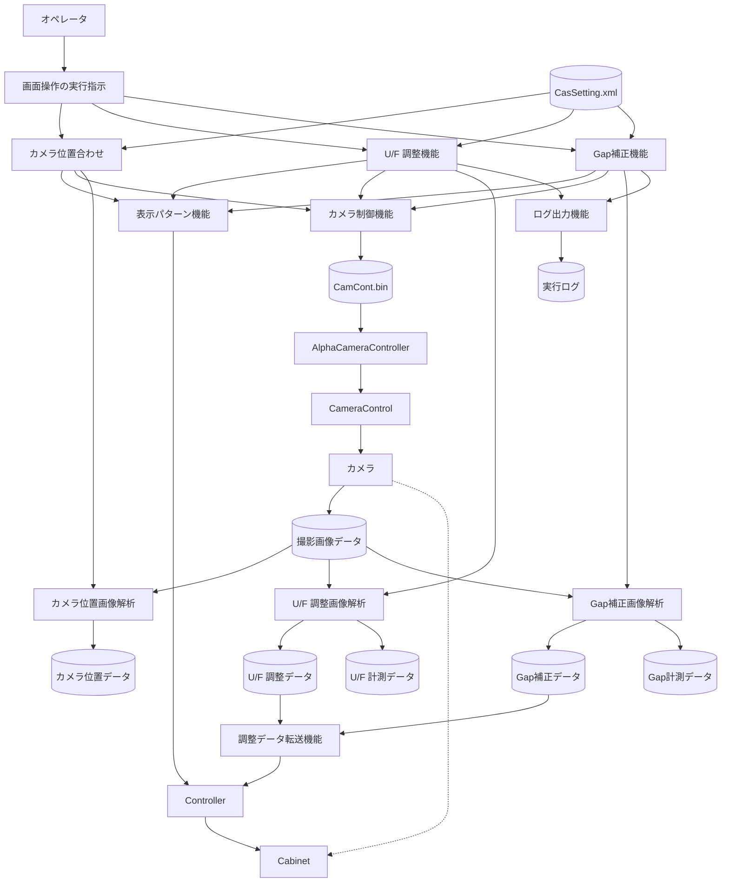
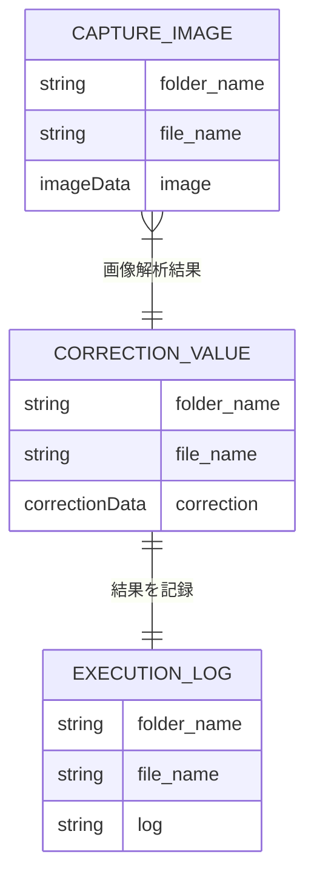

# 基本設計書

| 項目 | 内容 |
|------|------|
| プロジェクト名 | カメラCAS |
| システム名| カメラCAS |
| 作成日 | 2026/4/14 |
| 作成者| SGMO PTC 生産技術1部 技術2課 |
| バージョン | 0.1 |
| 関連資料 | カメラCAS_要件定義書 |

---

## 1. システム概要書

### 1-1. システム全体像

#### システム概要

本システムは、Windows 上で動作する Color Alignment Software（CAS）を中核とし、Controller 連携、カメラ撮影、画像解析、補正値算出、を通じて表示装置の調整作業（U/F調整及びGap補正）を支援するデスクトップアプリケーション群で構成される。

ソリューション上、オペレータが利用する WPF アプリケーション CAS と、カメラ制御補助アプリケーション AlphaCameraController で構成される。

実行時は、CAS Components 配下の AlphaCameraController.exe を別プロセスとして起動し、AlphaCameraController が CameraControl.dll を動的読込してカメラ実機を制御する。CAS と AlphaCameraController の間では、CameraDataClass で定義された制御データ CamCont.bin を XML ファイルとして受け渡す構成である。CAS 本体は OpenCvSharp、AcquisitionARW を利用して画像解析・RAW 画像取扱いを実施し、Controller に対する補正処理を行う。外部連携先として、調整対象となるCabinetを制御するController及びカメラを利用する。

なお、本システムはSaaS/ASP を前提としたWeb システムではなく、.NET Framework 4.5/4.5.1 ベースのオンプレミス型Windows アプリケーションとして構成する。

#### システム構成図

実行時のシステム構成を以下に示す。

補足として、Visual Studio ソリューション上の主な依存関係は以下の通りである。

#### 構成要素一覧

| 構成要素 | 役割 | 備考|
|----------|------|------|
| CAS | システムの主アプリケーション。条件設定、撮影、画像解析、補正値算出、Controller 連携、結果表示を担う。 | WPF、.NET Framework 4.5.1。ソリューションの中核。 |
| AlphaCameraController | CAS から起動されるカメラ制御補助アプリケーション。常駐しながら制御ファイルを監視し、撮影やライブビュー実行を行う。| WPF アプリケーション。通知領域常駐型。|
| CameraControl | カメラ接続、撮影、撮影条件設定、AF 、ライブビュー制御を担う共通ライブラリ。| CameraControllerSharp 、OpenCvSharp を参照し、AlphaCameraController から動的読込される。|
| CameraDataClass | 撮影条件、AF エリア、基準位置、制御データ、座標などの共通データ定義を提供する。| CAS 、AlphaCameraController 、CameraControl の各プロジェクトで参照される。|
| Controller | CAS からの制御対象。パターン表示および補正値転送の対象となる。| 実機との通信仕様は別途定義が必要。|
| Cabinet | 撮影・補正対象となる表示装置。| Controller から表示制御される。|
| カメラ | 調整対象を撮影し、画像を取得するカメラ。α6400(ILCE-6400) + SELP1650/SELP16502。| AlphaCameraController 経由で CameraControl.dll から制御する。|
| 設定ファイル | 各設定値の保存先。 | ファイルベースで管理する前提。|
| 撮影画像ファイル | 撮影画像ファイルの保存先。 | ファイルベースで管理する前提。|
| CamCont.bin 制御ファイル | CAS と AlphaCameraController 間で撮影条件、撮影指示などを受け渡す。| CameraDataClass の XML シリアライズ形式で読み書きする。|

#### ソリューション方針

| 項目 | 内容 |
|------|------|
| 採用方式| Windows デスクトップアプリケーション方式を採用し、主処理 CAS に集約される。|
| 採用製品サービス | .NET Framework 4.5/4.5.1 、WPF 、OpenCvSharp 、CameraControllerSharp を利用する。|
| 選定理由 | カメラ制御、画像解析ローカル装置連携を同一端末上で完結でき、装置制御系の運用に適しているため。|
| 制約 | Windows 前提、x86/x64 構成差異への配慮が必要であり、外部DLL 、実機接続環境依存する。|

---

### 1-2. アプリケーションマップ

#### アプリケーションマップ

本システムのアプリケーションマップを以下に示す。CAS を業務アプリケーションの中心とし、カメラ制御は AlphaCameraController と CameraControl に分類する構成である。共通データは CameraDataClass に集約される。

アプリケーション分類の考え方は以下通りとする。

| 分類| 対象 | 説明|
|------|------|------|
| 業務アプリケーション | CAS | オペレータが直接操作し、調整業務を実行する中核アプリケーション。|
| 補助アプリケーション | AlphaCameraController | CAS から起動され、カメラ制御する実行形式アプリケーション。|
| 共通ライブラリ | CameraControl, CameraDataClass | 直接操作対象ではなく、カメラ制御を支える再利用部品。|

#### アプリケーション一覧

| No. | アプリケーション名 | 区分 | 主な役割 | 利用者/利用部門 | 備考 |
|-----|--------------------|------|----------|------------------|------|
| 1 | CAS | 業務アプリケーション | 撮影条件及び撮影の実行指示、画像解析、補正値算出、Controller 連携、結果表示を行う。 | オペレータ | WPF アプリケーション。システムの中核。 |
| 2 | AlphaCameraController | 補助アプリケーション | カメラ接続、撮影、オートフォーカス、ライブビュー実行を行う。 | CAS から間接利用 | 通知領域常駐型。CAS から別プロセス起動される。 |
| 3 | CameraControl | 共通ライブラリ | CameraControllerSharp を利用した接続、設定変更、撮影、ライブビュー制御を提供する。 | AlphaCameraController から利用 | CameraControllerSharp を参照し、動的読込される。 |
| 4 | CameraDataClass | 共通ライブラリ | 撮影条件、AF エリア、座標、制御データの共通クラスを提供する。 | CAS、AlphaCameraController、CameraControl | XML シリアライズ対象データを保持する。 |

#### アプリケーション間関連 

| 連携元 | 連携先 | 連携概要 | 主なデータ | 連携方式|
|--------|--------|----------|------------|----------|
| CAS | Controller | 内蔵パターン表示実行、補正値送信、装置制御を行う。| 表示制御情報、補正値 | アプリケーション通信機能による連携 |
| Controller | Cabinet | 表示パターン反映、補正値反映を行う。| 表示制御信号、補正パラメータ | 装置間制御 |
| CAS | AlphaCameraController | カメラ制御補助プロセスを起動し、撮影要求を行う。| 起動要求、撮影条件、保存先、制御フラグ | 別プロセス起動+ 制御ファイル連携 |
| AlphaCameraController | CameraControl | カメラ制御機能を呼び出し、カメラを操作する。| 撮影条件、AF 設定、画像保存先 | DLL 動的読込 |
| CAS | CameraDataClass | 共通データ型を利用する。| 撮影条件、座標、制御データ | プロジェクト参照 |
| AlphaCameraController | CameraDataClass | 制御ファイルの読込/書込に共通データ型を利用する。| CameraControlData 、ShootCondition など | プロジェクト参照 |
| CameraControl | CameraDataClass | カメラ設定関連の共通データ型を利用する。| ShootCondition 、AfAreaSetting など | プロジェクト参照 |
| CAS | 設定ファイル | 設定保存を行う。| 設定XML | ファイル入出力 |
| CAS | 撮影画像ファイル | 撮影画像保存を行う。| 画像ファイル | ファイル入出力 |
| CAS | CamCont.bin 制御ファイル | AlphaCameraController 向けの制御指示を書き込む。| CameraControlData | ファイル出力 |
| AlphaCameraController | CamCont.bin 制御ファイル | 制御要求を監視し、実行結果を反映する。| CameraControlData | ファイル読込/更新 |
| CameraControl | カメラ | カメラ接続、設定、撮影、ライブビューを実行する。| 撮影コマンド、撮影画像、 CameraControllerSharp 経由 |

---

### 1-3. アプリケーション機能一覧

各アプリケーションの機能一覧を記載する。

| アプリケーション名 | 機能ID | 機能名 | 機能概要 | 利用者 | 優先度 | 備考 |
|--------------------|--------|--------|----------|--------|--------|------|
| CAS | CAS-01 | 設定管理機能 | 測定条件、対象機種、保存先、各種動作条件を設定・保持する。 | オペレータ | 高 | Functions/Configuration.cs、WindowSetting.xaml などに対応。 |
| CAS | CAS-02 | Controller 接続制御機能 | Controller への接続、対象選択、パターン表示実行、補正値送信を行う。 | オペレータ | 高 | Functions/Control.cs、関連 Window 群に対応。 |
| CAS | CAS-03 | Cabinet/Cabinet 情報管理機能 | Cabinet 構成、Cabinet 情報、対象範囲、関連情報を管理する。 | オペレータ | 高 | WindowCabinetInfo、WindowUnitInfo などを含む。 |
| CAS | CAS-04 | カメラ連携制御機能 | AlphaCameraController と連携し、撮影条件設定、撮影実行、ライブビュー、AF 制御を行う。 | オペレータ | 高 | Functions/UfCamera.cs、Functions/GapCamera.cs に対応。 |
| CAS | CAS-05 | 画像取得機能 | カメラ撮影画像を取得し、解析対象データとして保存・読込する。 | オペレータ | 高 | RAW/JPG 画像の取得・保存を含む。 |
| CAS | CAS-06 | 画像変換・前処理機能 | 画像変換、位置合わせ、解析前の整形処理を行う。 | システム | 高 | Functions/TransformImage.cs、EstimateCameraPos.cs に対応。 |
| CAS | CAS-07 | U/F 調整機能 | Cabinet/Module の明るさ解析を行い、U/F 調整値を算出する。 | オペレータ | 高 | Functions/UfCamera.cs に対応。 |
| CAS | CAS-08 | Gap補正機能 | Module 間のGap輝度比を解析し、Gap補正値を算出する。 | オペレータ | 高 | Functions/GapCamera.cs に対応。 |
| AlphaCameraController | ACC-01 | カメラ常駐監視機能 | 通知領域常駐プロセスとして起動し、制御ファイルを監視する。 | CAS から間接利用 | 高 | NotifyIconWrapper.cs に対応。 |
| AlphaCameraController | ACC-02 | 撮影実行機能 | CAS から渡された条件に基づき撮影を実行し、結果を制御ファイルへ反映する。 | CAS から間接利用 | 高 | ShootFlag を用いた制御。 |
| AlphaCameraController | ACC-03 | オートフォーカス・ライブビュー機能 | AF 実行、ライブビュー開始停止などのカメラ制御補助を行う。 | CAS から間接利用 | 高 | AutoFocusFlag、LiveViewFlag を用いた制御。 |
| CameraControl | CCL-01 | カメラ接続管理機能 | カメラ列挙、接続、切断、接続状態管理を行う。 | AlphaCameraController | 高 | CameraControllerSharp のラッパー機能。 |
| CameraControl | CCL-02 | カメラ設定機能 | F 値、シャッター、ISO、WB、AF エリアなどの撮影条件を設定する。 | AlphaCameraController | 高 | ShootCondition、AfAreaSetting を使用。 |
| CameraControl | CCL-03 | 撮影・画像取得機能 | 静止画撮影、ライブビュー画像取得、画像保存を行う。 | AlphaCameraController | 高 | CaptureImage、LiveView に対応。 |
| CameraDataClass | CDC-01 | 共通データ定義機能 | 撮影条件、座標、基準位置、制御データ等の共通データ構造を提供する。 | CAS、AlphaCameraController、CameraControl | 高 | XML シリアライズ対応クラスを含む。 |

---

## 2. アプリケーション詳細

### 2-1. 機能関連図

#### 対象アプリケーション

CAS

#### 機能関連図

CAS の主要機能関連を以下に示す。オペレータ操作を起点として、設定管理、内蔵パターン表示、Controller 連携、カメラ連携、画像解析、補正値算出が連続して動作する構成である。

#### 補足説明

| 項目 | 内容 |
|------|------|
| 機能間連携の要点 | オペレータは画面操作の実行指示を起点として、カメラ位置合わせ、U/F 調整、Gap補正を実行する。各調整機能は必要に応じて表示パターン機能を介して Controller に表示実行をし、同時にカメラ制御機能から AlphaCameraController 、CameraControl を経由して カメラを制御して撮影画像データを取得する。取得した撮影画像は画像解析で解析され、カメラ位置データ、U/F 調整データ、U/F 計測データ、Gap補正データ、Gap計測データへ変換される。U/F 調整データとGap補正データは調整データ転送機能を通じて Controller に送信され、実行結果はログ・履歴・情報出力に反映される。|
| 前提条件 | CasSetting.bin に必要な設定情報が登録済みであり、CamCont.bin を含む制御ファイルの読み書きが可能であること。Controller 、Cabinet 、カメラが接続済みで、AlphaCameraController と CameraControl を含む関連実行モジュールが利用可能なこと。|
| 制約 | カメラ制御は AlphaCameraController と CamCont.bin を用いたファイル連携に依存するため、別プロセス起動とファイルアクセスが正常に行える必要がある。U/F 調整およびGap補正の解析結果は、内蔵パターン表示状態、撮影位置、設置環境条件、対象 Cabinet の状態に影響を受けるため、運用時には表示条件と撮影条件の標準化が必要である。 |

---

### 2-2. 機能仕様

アプリケーションの機能を、画面構成と実装単位に合わせて機能群として定義する。本節では主要機能を以下の 3 つの機能群に再編して記載する。

| 機能群 | 対応機能ID | 主な対象画面・モジュール |
|------|------|------|
| 設定管理・対象構成管理 | CAS-01, CAS-03 | Configuration、Data、WindowCabinetInfo、WindowUnitInfo |
| カメラ連携・画像取得・画像解析 | CAS-04, CAS-05, CAS-06 | Uniformity(Camera)、Gap Correction(Camera)、Functions/UfCamera.cs、Functions/GapCamera.cs |
| 調整・補正値生成 | CAS-07, CAS-08 | Uniformity(Camera)、Gap Correction(Camera) |

#### 2-2-1. 設定管理・対象構成管理

##### 2-2-1-1. 機能概要

| 項目 | 内容 |
|------|------|
| 機能ID | CAS-01, CAS-03 |
| 機能名 | 設定管理・対象構成管理 |
| 機能概要 | 実行条件、対象機種、保存先、Cabinet/Cabinet 構成など、U/F 調整・Gap補正の前提となる設定情報を管理する。 |
| 利用者 | オペレータ |
| 起動契機 | Configuration / Data / 対象構成編集画面での操作 |
| 入力 | 設定値、対象 Cabinet/Cabinet 情報 |
| 出力 | CasSetting.xml、内部設定データ |
| 前提条件 | 設定ファイル保存先にアクセス可能であること。 |
| 事後条件 | 更新した設定が後続処理で利用可能となること。 |

#### 2-2-2. カメラ連携・画像取得・画像解析

##### 2-2-2-1. 機能概要

| 項目 | 内容 |
|------|------|
| 機能ID | CAS-04, CAS-05, CAS-06 |
| 機能名 | 表示パターン・カメラ連携・画像取得 |
| 機能概要 | Cabinet の表示パターンと同期して、AlphaCameraController と CamCont.bin を介して カメラ を制御し、撮影条件設定、ライブビュー、撮影画像取得を行う。 |
| 利用者 |  |
| 起動契機 | Uniformity(Camera) / Gap Correction(Camera) 画面での操作 |
| 入力 | 対象 Controller および Cabinet 情報、撮影条件 |
| 出力 | 撮影画像データ、進捗情報、ログ情報 |
| 関連機能 | Controller 接続・表示制御機能、調整・補正値生成機能、結果表示・履歴・付帯機能 |
| 前提条件 | AlphaCameraController が起動可能であり、対象カメラが接続済みであること。 |
| 事後条件 | 画像ファイルが取得され、後続処理へ引き渡されること。 |
| 備考 | 自動撮影の進行中は Progress 画面を併用する。 |

##### 2-2-2-2. 画面仕様

###### 画面一覧

| 画面ID | 画面名 | 目的 | 利用者 | 備考 |
|--------|--------|------|--------|------|
| CM-01 | Uniformity(Camera) | U/F 調整向けの撮影・測定操作 | オペレータ | Camera View、Adjustment/Measurement を含む |
| CM-02 | Gap Correction(Camera) | Gap補正向けの撮影・測定操作 | オペレータ | Before/Result/Measurement を含む |

###### 画面入出力項目一覧

| 項目ID | 項目名 | 区分 | 型 | 必須 | 備考 |
|--------|--------|------|----|------|------|
| CM-01-01 | 対象 Cabinet | 入力 | 構造体 | 必須 | U/F調整対象Cabinet |
| CM-01-02 | カメラ画像 | 表示 | 画像 | - | ライブビュー / カメラ位置合わせ |
| CM-01-03 | U/F Adjustment Mode | 入力 | 列挙 | 必須 | 4Points/Cabinet、Each Module |
| CM-02-01 | 対象 Cabinet | 入力 | 構造体 | 必須 | Gap補正対象Cabinet |
| CM-02-02 | カメラ画像 | 表示 | 画像 | - | ライブビュー / カメラ位置合わせ |

###### 画面アクション詳細

| アクション名 | 契機 | 処理内容 | 正常時 | 異常時 |
|--------------|------|----------|--------|--------|
| カメラ位置合わせ | 開始/停止 | CamCont.bin を更新し、AlphaCameraController に撮影を依頼する | 画像保存、画面更新 | 撮影失敗または Controller 制御失敗を通知 |
| U/F 調整 | 開始 | 表示パターンを表示した Cabinet を撮影し、画像を保存する | 画像保存、画面更新 | 撮影失敗または Controller 制御失敗を通知 |
| Gap補正 | 開始 | 表示パターンを表示した Cabinet を撮影し、画像を保存する | 画像保存、画面更新 | 撮影失敗または Controller 制御失敗を通知 |

##### 2-2-2-3. 帳票仕様 / EUC ファイル仕様

帳票出力は対象外とする。画像ファイルおよび CamCont.xml は処理用ファイルであり、EUC ファイル仕様の対象外とする。

##### 2-2-2-4. 関連システムインタフェース仕様

| IF ID | 連携先システム | 方向 | 連携方式 | 概要 | 頻度 |
|-------|----------------|------|----------|------|------|
| IF-CM-01 | AlphaCameraController | 双方向 | 別プロセス + 制御ファイル | カメラ制御要求、実行結果取得 | 撮影時 |
| IF-CM-02 | CameraControl / カメラ | 双方向 | AlphaCameraController 経由 | カメラ接続、撮影、ライブビュー | 撮影時 |
| IF-CM-03 | PC ストレージ | 双方向 | ファイル I/O | 画像ファイル、CamCont.bin、ログファイルの読み書き | カメラ位置合わせ、U/F 調整、Gap補正の撮影ごと、調整処理ごと |

##### 2-2-2-5. 入出力処理仕様

| 項目 | 内容 |
|------|------|
| 処理 | 撮影・画像取得 |
| 処理種別 | オンライン |
| 処理概要 | 撮影条件を CamCont.bin へ反映し、カメラ撮影を実行して画像を保存する。 |
| 実行契機 | カメラ位置合わせ開始、U/F 調整開始、Gap補正開始 |
| 実行タイミング | オペレータ操作時 |

1. カメラ制御または撮影要求を外部連携先へ送信する。
2. 取得した画像を保存し、後続処理へ引き渡す。

#### 2-2-3. 調整・補正値生成機能

##### 2-2-3-1. 機能概要

| 項目 | 内容 |
|------|------|
| 機能ID | CAS-07, CAS-08 |
| 機能名 | 調整・補正機能 |
| 機能概要 | 撮影画像を用いて U/F 調整値、Gap補正値を算出し、Controller へ転送する。 |
| 利用者 |  |
| 起動契機 | Uniformity(Camera) / Gap Correction(Camera) 画面での撮影処理完了 |
| 入力 | 撮影画像データ、対象 Cabinet/Module、調整モード、パラメータ |
| 出力 | U/F 調整値、U/F 計測値、Gap補正値、Gap計測値 |
| 関連機能 | Controller 制御機能、カメラ連携・画像取得機能、結果表示・履歴・付帯機能 |
| 前提条件 | 対象 Cabinet が設定済みであり、撮影画像が取得済みであること。 |
| 事後条件 | 調整結果または計測結果が参照可能となること。 |

##### 2-2-3-2. 画面仕様

###### 画面一覧

| 画面ID | 画面名 | 目的 | 利用者 | 備考 |
|--------|--------|------|--------|------|
| AJ-01 | Uniformity(Camera) | U/F 調整向けの撮影・測定操作 | オペレータ | Camera View、Adjustment/Measurement を含む |
| AJ-02 | Gap Correction(Camera) | Gap補正向けの撮影・測定操作 | オペレータ | Before/Result/Measurement を含む |

###### 画面入出力項目一覧

| 項目ID | 項目名 | 区分 | 型 | 必須 | 備考 |
|--------|--------|------|----|------|------|
| AJ-01-03 | U/F 調整結果 | 表示 | 数値群 | - | Cabinet/Module 単位 |
| AJ-02-01 | Gap補正結果 | 表示 | 数値群 | - | Module 単位 |

###### 画面アクション詳細

| アクション名 | 契機 | 処理内容 | 正常時 | 異常時 |
|--------------|------|----------|--------|--------|
| Controller 転送 | 画像解析終了 | 算出した U/F 調整値または Gap補正値を Controller へ転送する | 補正値書込完了 | 通信異常を通知 |

##### 2-2-3-3. 帳票仕様 / EUC ファイル仕様

対象外とする。

##### 2-2-3-4. 関連システムインタフェース仕様

| IF ID | 連携先システム | 方向 | 連携方式 | 概要 | 頻度 |
|-------|----------------|------|----------|------|------|
| IF-AJ-01 | PC ストレージ | 受信 | ファイル I/O | 画像ファイルの読み出し | U/F 調整、Gap補正の処理ごと |
| IF-AJ-02 | Controller | 送信 | 装置通信 | U/F 調整値、Gap補正値、関連設定値の転送 | 実行時 |

##### 2-2-3-5. 入出力処理仕様

| 項目 | 内容 |
|------|------|
| 処理 | 調整・補正値生成 |
| 処理種別 | オンライン |
| 処理概要 | 撮影画像の処理結果を基に U/F 調整値および Gap補正値を生成し、Controller へ転送する。 |
| 実行契機 | 撮影処理終了 |
| 実行タイミング | オペレータ操作時 |

1. 撮影画像から U/F 調整値または Gap補正値を算出する。
2. 算出した値を Controller へ転送する。

---

### 2-3. データベース仕様

本システムは RDBMS を使用せず、設定ファイル・制御ファイル・画像ファイル・結果ファイル・ログファイルを中心としたファイルベースでデータを管理する。
本節では、実装上は物理テーブルを持たない前提で、保守性確保のため論理データモデルとして整理する。

#### データ概要

| データ名 | 概要 | 保持期間 | 更新主体 | 備考 |
|----------|------|----------|----------|------|
| 設定データ（CasSetting.xml） | 実行条件、対象情報、保存先、動作パラメータを保持する。 | 永続（明示更新まで） | オペレータ、CAS | 起動時読込・保存時更新 |
| カメラ制御データ（CamCont.bin） | CAS と AlphaCameraController 間で撮影条件、実行フラグ、結果状態を連携する。 | 実行中〜次回更新まで | CAS、AlphaCameraController | カメラ制御連携の中核データ |
| 撮影画像データ | カメラから取得した画像（RAW/JPG 等）を保持する。 | 運用規定による | CAS | U/F 調整、Gap補正の入力 |
| U/F 調整値・Gap補正値データ | 画像解析で算出した U/F 調整値、Gap補正値を保持する。 | 実行履歴保持期間に準拠 | CAS | Controller 転送データ |
| 実行ログデータ | 実行結果、処理進捗、異常情報を保持する。 | 運用規定による | CAS | 障害解析トレース用 |

#### ERD

論理 ERD を以下に示す（物理 DB テーブルではなく、ファイル管理データをエンティティとして表現）。

#### テーブル仕様

| テーブル名 | 論理名 | 概要 | 主キー | 備考 |
|------------|--------|------|--------|------|
| CAPTURE_IMAGE | 撮影画像データ | 撮影画像メタ情報と保存パスを保持。 | folder_name + file_name | 実体は画像ファイル |
| CORRECTION_VALUE | 補正データ | U/F 調整値、Gap補正値を保持。 | folder_name + file_name | 実体はバイナリファイル |
| EXECUTION_LOG | 実行ログデータ | 実行履歴とエラー情報を保持。 | folder_name + file_name | 実体はログファイル |

#### カラム仕様

| テーブル名 | カラム名 | 論理名 | 型 | 桁数 | PK | FK | NULL 可 | 初期値 | 説明 |
|------------|----------|--------|----|------|----|----|--------|--------|------|
| CAPTURE_IMAGE | folder_name | 保存パス | string | - | ○ | - | 否 | - | ファイル保存先 |
| CAPTURE_IMAGE | file_name | 保存ファイル名 | string | - | ○ | - | 否 | - | ファイル名 |
| CAPTURE_IMAGE | image | 画像データ | imageData | - | - | - | 否 | - | 画像データ |
| CORRECTION_VALUE | folder_name | 保存パス | string | - | ○ | ○ | 否 | - | ファイル保存先 |
| CORRECTION_VALUE | file_name | 保存ファイル名 | string | - | ○ | - | 否 | - | ファイル名 |
| CORRECTION_VALUE | correction | 補正データ | correctionData | - | - | - | 否 | - | 補正データ |
| EXECUTION_LOG | folder_name | 保存パス | string | - | ○ | ○ | 否 | - | ファイル保存先 |
| EXECUTION_LOG | file_name | 保存ファイル名 | string | - | ○ | - | 否 | - | ファイル名 |
| EXECUTION_LOG | correction | ログ | string | - | - | - | 否 | - | ログ |

※ 複合主キーは各テーブルとも `(folder_name, file_name)` とする。

#### CRUD 一覧

| 機能ID | 機能名 | テーブル名 | Create | Read | Update | Delete |
|--------|--------|------------|--------|------|--------|--------|
| CAS-05 | 画像取得機能 | CAPTURE_IMAGE | ○ | ○ | - | ○ |
| CAS-07 | U/F 調整機能 | CORRECTION_VALUE | ○ | ○ | ○ | ○ |
| CAS-08 | Gap補正機能 | CORRECTION_VALUE | ○ | ○ | ○ | ○ |
| CAS-01/CAS-07/CAS-08 | 実行ログ出力 | EXECUTION_LOG | ○ | ○ | - | ○ |

※ Delete は、設定内容に応じて、自動処理で実施される。

---

### 2-4. メッセージ・コード仕様

メッセージ・コード一覧を記載する。

#### メッセージ一覧

| メッセージID | 区分 | メッセージ内容 | 表示条件 | 対応方針 | 備考 |
|--------------|------|----------------|----------|----------|------|
| MSG-UF-001 | 情報 | Measurement UF Progress | U/F 計測開始時 | 進捗画面を表示して処理継続 | CAS/Functions/UfCamera.cs |
| MSG-UF-002 | 情報 | Adjustment UF Progress | U/F 調整開始時 | 進捗画面を表示して処理継続 | CAS/Functions/UfCamera.cs |
| MSG-GAP-001 | 情報 | Backup Gap Correction Values Progress | Gap 補正値バックアップ開始時 | 進捗画面を表示して処理継続 | CAS/Functions/GapCamera.cs |
| MSG-GAP-002 | 情報 | Restore (bulk) Gap Correction Values Progress | Gap 補正値一括リストア開始時 | 進捗画面を表示して処理継続 | CAS/Functions/GapCamera.cs |
| MSG-GAP-003 | 情報 | Restore Gap Correction Values Progress | Gap 補正値リストア開始時 | 進捗画面を表示して処理継続 | CAS/Functions/GapCamera.cs |
| MSG-GAP-004 | 情報 | Measurement Gap Progress | Gap 計測開始時 | 進捗画面を表示して処理継続 | CAS/Functions/GapCamera.cs |
| MSG-GAP-005 | 情報 | Adjustment Gap Progress | Gap 調整開始時 | 進捗画面を表示して処理継続 | CAS/Functions/GapCamera.cs |
| MSG-GAP-006 | 情報 | Writing Gap correction value to ROM Progress | Gap 補正値 ROM 書込開始時 | 進捗画面を表示して処理継続 | CAS/Functions/GapCamera.cs |
| MSG-CMN-E-001 | エラー | ex.Message | 例外捕捉時 | ダイアログ表示して処理中断または復帰 | CAS/Functions/UfCamera.cs, CAS/Functions/GapCamera.cs |
| MSG-CMN-E-002 | エラー | Camera is not opened. | カメラ未オープンで処理継続不可時 | ダイアログ表示して処理中断 | CAS/Functions/UfCamera.cs |
| MSG-UF-E-001 | エラー | Failed in Measurement UF. | U/F 計測処理失敗時 | エラー表示して処理終了 | CAS/Functions/UfCamera.cs |
| MSG-UF-E-002 | エラー | Failed in Adjustment UF. | U/F 調整処理失敗時 | エラー表示して処理終了 | CAS/Functions/UfCamera.cs |
| MSG-GAP-E-001 | エラー | Failed in Backup Gap Correction Values. | Gap 補正値バックアップ失敗時 | エラー表示して処理終了 | CAS/Functions/GapCamera.cs |
| MSG-GAP-E-002 | エラー | Failed in Restore (bulk) Gap Correction Values. | Gap 補正値一括リストア失敗時 | エラー表示して処理終了 | CAS/Functions/GapCamera.cs |
| MSG-GAP-E-003 | エラー | Failed in Restore Gap Correction Values. | Gap 補正値リストア失敗時 | エラー表示して処理終了 | CAS/Functions/GapCamera.cs |
| MSG-GAP-E-004 | エラー | Failed in Measurement Gap. | Gap 計測失敗時 | エラー表示して処理終了 | CAS/Functions/GapCamera.cs |
| MSG-GAP-E-005 | エラー | Failed in Adjustment Gap. | Gap 調整失敗時 | エラー表示して処理終了 | CAS/Functions/GapCamera.cs |
| MSG-GAP-E-006 | エラー | Failed in writing Gap correction value to ROM. | Gap 補正値 ROM 書込失敗時 | エラー表示して処理終了 | CAS/Functions/GapCamera.cs |
| MSG-GAP-E-007 | エラー | [Wall-Camera Distance] in Configuration is wrong. | 設定値不正検知時 | エラー表示し設定見直しを促す | CAS/Functions/GapCamera.cs |
| MSG-GAP-E-008 | エラー | [Wall Bottom Height] in Configuration is wrong. | 設定値不正検知時 | エラー表示し設定見直しを促す | CAS/Functions/GapCamera.cs |
| MSG-GAP-E-009 | エラー | [Camera Height] in Configuration is wrong. | 設定値不正検知時 | エラー表示し設定見直しを促す | CAS/Functions/GapCamera.cs |
| MSG-CMN-A-001 | 情報 | ex.Message | ユーザ中断例外捕捉時 | Abort ダイアログ表示して安全停止 | CAS/Functions/UfCamera.cs, CAS/Functions/GapCamera.cs |
| MSG-GAP-A-001 | 情報 | Abort to Writing Data. | Gap 補正値書込の中断時 | Abort 通知して安全停止 | CAS/Functions/GapCamera.cs |

#### コード一覧

| コード種別 | コード値 | コード名称 | 説明 | 備考 |
|------------|----------|------------|------|------|
| MESSAGE_GROUP | UF | U/F メッセージ群 | UfCamera.cs で生成される進捗メッセージ群 | Measurement UF / Adjustment UF |
| MESSAGE_GROUP | GAP | Gap メッセージ群 | GapCamera.cs で生成される進捗メッセージ群 | Backup/Restore/Measurement/Adjustment/ROM Write |
| MESSAGE_GROUP | COMMON_ERROR | 共通エラー表示群 | 例外発生時に ex.Message を表示する共通メッセージ群 | CAS Error!/Abort! を伴う |
| DIALOG_CAPTION | CAS Error! | CAS エラー | 一般例外時のダイアログタイトル | UfCamera.cs、GapCamera.cs |
| DIALOG_CAPTION | Abort! | 中断 | ユーザ中断時のダイアログタイトル | UfCamera.cs、GapCamera.cs |
| DIALOG_CAPTION | Error | 処理異常 | 固定エラー表示時のタイトル | Gap/UF 固定失敗メッセージ |
| ABORT_TYPE | Measurement | 計測中断 | WindowProgress の計測処理中断種別 | UfCamera.cs、GapCamera.cs |
| ABORT_TYPE | Adjustment | 調整中断 | WindowProgress の調整処理中断種別 | UfCamera.cs、GapCamera.cs |

---

### 2-5. 機能/データ配置仕様

機能とデータをシステム構成上のどの位置に配置するかを設計する。

#### 配置方針

| 項目 | 内容 |
|------|------|
| 機能配置方針 | オペレータ操作、内蔵パターン表示制御、画像解析、補正値算出、結果表示は CAS（MainWindow + Functions 配下）に集約する。カメラ制御は AlphaCameraController + CameraControl に分離し、CAS とは CamCont.bin を介して連携する。Controller への調整値転送は CAS から装置通信機能を通じて実行する。 |
| データ配置方針 | 設定・制御・結果・ログはローカルファイルとして管理する。設定は CasSetting.xml、カメラ制御連携は CamCont.bin、画像は撮影フォルダ、解析結果・ログは結果保存先に格納する。永続化はファイルベースで行い、実行時データはメモリ保持後に必要項目を保存する。 |
| 配置上制約 | カメラ制御は別プロセス起動とファイル連携に依存するため、実行ユーザ権限で CamCont.bin および画像保存先への読み書き権限が必要である。Controller 連携にはネットワーク到達性が必要であり、実機未接続時は機能が制限される。 |

#### 機能配置一覧

| 機能ID | 機能名 | 配置先 | 理由 | 備考 |
|--------|--------|--------|------|------|
| CAS-07 | U/F 調整 | CAS/MainWindow、Functions/UfCamera.cs | オペレータ操作、画像解析、補正値生成、進捗表示を一体で実行するため。 | カメラ撮影は AlphaCameraController 経由 |
| CAS-08 | Gap補正 | CAS/MainWindow、Functions/GapCamera.cs | Gap計測、補正値算出、ROM 書込制御を統合して実行するため。 | 補正値転送は Controller 通信に依存 |
| CAS-07/CAS-08 | 表示パターン・補正値反映 | CAS/Functions/Control.cs、Controller | 表示制御および補正値適用は装置通信と一体で管理する必要があるため。 | Controller 到達性が前提 |
| ACC-01 | カメラ常駐監視 | AlphaCameraController/NotifyIconWrapper、MainWindow | カメラ接続維持と制御ファイル監視を CAS から分離するため。 | 通知領域常駐プロセス |
| ACC-02 | 撮影実行 | AlphaCameraController + CameraControl | 実機カメラ制御 SDK をアプリ本体から分離し安定性を確保するため。 | CamCont.bin の内容を解釈して撮影 |
| ACC-03 | AF/ライブビュー | AlphaCameraController + CameraControl | AF とライブビューを低遅延で制御するため。 | 実行結果を制御ファイルへ反映 |

#### データ配置一覧

| データ名 | 配置先 | 保存形式 | バックアップ方針 | 備考 |
|----------|--------|----------|------------------|------|
| CasSetting.xml | CAS\Component | XML | なし | 起動時読込、保存時更新 |
| CamCont.bin | CAS\Temp | XML | なし | 撮影・AF・ライブビュー連携に使用 |
| 撮影画像データ（RAW/JPG/MATBIN） | ログ保存先フォルダ | バイナリファイル | 設定内容に応じて、数世代前のものは自動削除される。 | U/F 調整、Gap補正 |
| 実行ログデータ | ログ保存先フォルダ | テキストログ | 設定内容に応じて、数世代前のものは自動削除される。 |  |
| 補正値データ | ログ保存先フォルダ | バイナリファイル | 設定内容に応じて、数世代前のものは自動削除される。 | Controllerに転送するファイル |

---

## 3. 付録

### 3-1. 用語集

| 用語 | 説明 |
|------|------|
| | |

---

### 3-2. 改版履歴

| バージョン | 変更日 | 変更者 | 変更内容 |
|-----------|--------|--------|----------|
| 0.1 | 2026/04/14 | SGMO PTC 生産技術1部 技術2課 堀田 |  |

