# 基本設計書

| 項目 | 内容 |
|------|------|
| プロジェクト名 | ColorAlignmentSoftware |
| システム名 | CAS UfCamera |
| 作成日 | 2026/04/17 |
| 作成者 | システム分析チーム |
| バージョン | 1.0 |
| 関連文書 | 要件定義書：docs/UfCamera_要件定義書.md |

---

## 1. システム概要書

### 1-1. システム全体像

#### システム概要

UfCamera機能はCAS内のU/F調整処理機能であり、カメラ接続、対象Cabinet選択、カメラ位置合わせ、U/F計測、U/F調整、調整後再計測、結果XML読込を提供する。

本機能は CAS/Functions/UfCamera.cs を中心に実装され、以下の外部・内部要素と連携する。

- カメラ制御：CameraControl / CameraControllerSharp
- 外部カメラ制御プロセス：AlphaCameraController
- 画像解析：OpenCvSharp
- 補正値生成：MakeUFData
- 設備制御：ControllerへのSDCPコマンド送信
- 設定・永続化：Settings、CamCont.xml、XML、測定画像ファイル、調整ログ

#### システム構成図

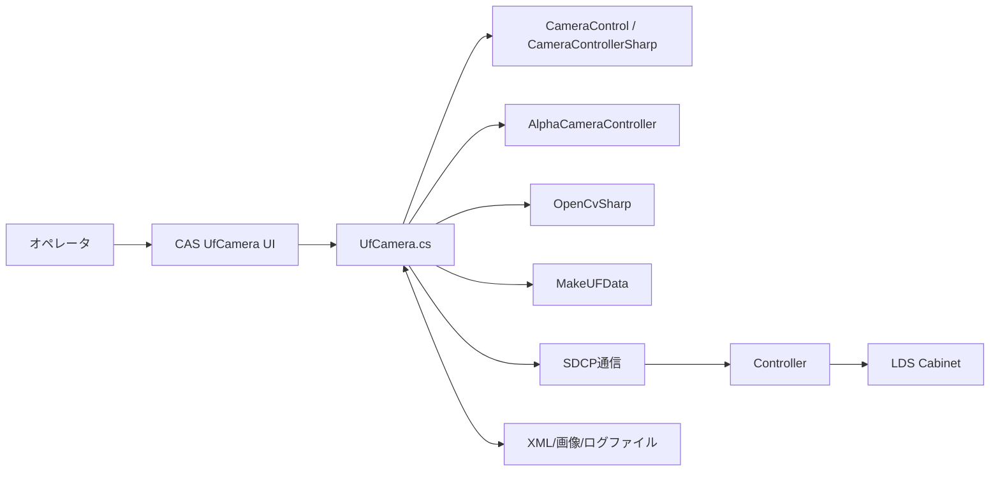

#### 構成要素一覧

| 構成要素 | 種別 | 役割 | 備考 |
|----------|------|------|------|
| UfCamera.cs | CAS機能モジュール | 接続、位置合わせ、計測、調整、結果表示の制御本体 | MainWindow partial class |
| CameraControl | 外部ライブラリ | カメラ接続、撮影、AF、ライブビュー制御 | CameraControllerSharp経由 |
| AlphaCameraController | 外部プロセス | CamCont.xml を介したカメラ実行制御 | Components配下EXE |
| OpenCvSharp | 外部ライブラリ | 画像切出し、Blob抽出、測定領域解析 | 計測・位置合わせで利用 |
| MakeUFData | 外部ライブラリ | U/F補正値生成、FMT変換、統計計算 | Cabinet/9pt/Radiator/EachModule対応 |
| Controller（SDCP） | 外部システム | ThroughMode、Layout制御、内蔵パターン、電源制御 | sendSdcpCommand |
| Settings.Ins.Camera | 設定ストア | 撮影条件、待機時間、距離条件、測定レベル管理 | 機種別設定あり |
| UfMeasResult.xml | ファイル | U/F計測結果保存 | UfCamMeasLog |
| UnitCpInfo.xml | ファイル | U/F調整結果保存 | UfCamAdjLog |

#### ソリューション方針

| 項目 | 内容 |
|------|------|
| UI駆動方針 | ボタンイベントから非同期処理を起動し、長時間処理をUI非ブロッキング化する |
| 安全制御方針 | 実行中は tcMain.IsEnabled=false で操作を抑止し、Abort時も安全復帰を行う |
| 進捗管理方針 | WindowProgress により残時間、進捗、Abort操作を提示する |
| カメラ連携方針 | AlphaCameraController と CamCont.xml のファイル連携を前提とする |
| 装置制御方針 | ThroughMode、Layout情報Off、内蔵パターン出力、電源制御をSDCPで統一実行する |
| 復旧方針 | 例外時は ThroughMode解除、ユーザー設定復元、内部信号停止、メッセージ表示を必須とする |

---

### 1-2. アプリケーションマップ

#### アプリケーションマップ

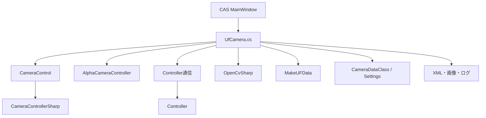

#### アプリケーション一覧

| No. | アプリケーション名 | 区分 | 主な役割 | 利用者・利用部門 | 備考 |
|-----|--------------------|------|----------|------------------|------|
| 1 | CAS（UfCamera） | 業務アプリ機能 | U/F計測・調整・結果確認操作 | オペレータ | 本設計対象 |
| 2 | CameraControl | 共通ライブラリ | カメラ接続、AF、撮影、ライブビュー | CAS内部利用 | DLL参照 |
| 3 | AlphaCameraController | 補助アプリ | CamCont.xmlに基づくカメラ動作実行 | CAS内部利用 | 外部EXE |
| 4 | Controller | 外部制御機器 | Cabinet制御、内蔵パターン、電源制御 | CAS内部利用 | SDCP通信 |
| 5 | MakeUFData | 補正計算ライブラリ | U/F調整データ生成、統計計算 | CAS内部利用 | DLL参照 |

#### アプリケーション間関係

| 連携元 | 連携先 | 連携概要 | 主なデータ | 連携方式 |
|--------|--------|----------|------------|----------|
| UfCamera | CameraControl | カメラ接続、AF、撮影、ライブ画像取得 | ShootCondition、AfAreaSetting、画像 | メソッド呼び出し |
| UfCamera | AlphaCameraController | 撮影設定、AF要求、保存先指示 | CamCont.xml | ファイル連携 |
| UfCamera | Controller | ThroughMode、内蔵パターン、Layout情報Off、電源制御 | SDCPコマンド | TCP/SDCP |
| UfCamera | MakeUFData | FMT読込、XYZ変換、補正値計算 | UnitCpInfo、目標色度、参照点 | メソッド呼び出し |
| UfCamera | ファイルシステム | 計測結果・調整結果・画像・ログ保存 | UfMeasResult.xml、UnitCpInfo.xml、RAW画像 | ファイルI/O |

---

### 1-3. アプリケーション機能一覧

| アプリケーション名 | 機能ID | 機能名 | 機能概要 | 利用者 | 優先度 | 備考 |
|--------------------|--------|--------|----------|--------|--------|------|
| CAS UfCamera | UF-F01 | カメラ接続・初期化 | カメラとレンズ選択状態を反映し、U/F・Gapの関連UIを初期化する | オペレータ | 高 | btnUfCamConnect_Click, btnUfCamDisconnect_Click |
| CAS UfCamera | UF-F02 | カメラ位置合わせ | 対象Cabinetの妥当性確認後、ライブ画像を用いてカメラ位置合わせを支援する | オペレータ | 高 | tbtnUfCamSetPos_Click, timerUfCam_Tick |
| CAS UfCamera | UF-F03 | U/F計測 | 対象Cabinetを撮影・解析し、Cabinet/Module単位の測定結果を生成する | オペレータ | 高 | btnUfCamMeasStart_Click, MeasureUfAsync |
| CAS UfCamera | UF-F04 | U/F調整 | 計測結果、目標Cabinet、調整方式、視聴点条件に基づき調整データを生成・反映する | オペレータ | 高 | btnUfCamAdjustStart_Click, AdjustUfCamAsync |
| CAS UfCamera | UF-F05 | 測定結果読込 | 保存済み計測結果XMLを読込み、結果画面に再表示する | オペレータ | 中 | btnUfCamResultOpen_Click |

---

## 2. アプリケーション詳細

### 2-1. 機能関連図

#### 対象アプリケーション

CAS UfCamera.cs

#### 機能関連図

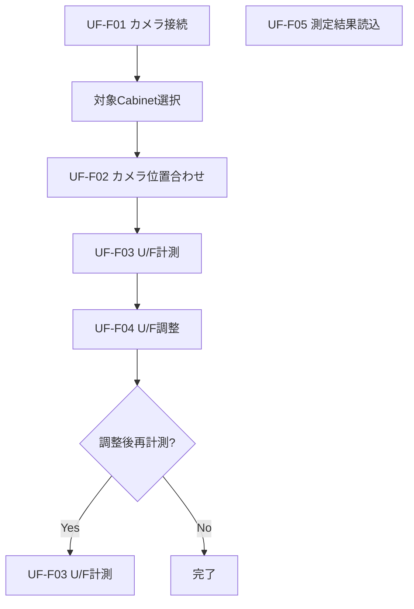

#### 補足説明

| 項目 | 内容 |
|------|------|
| 機能間連携の要点 | 接続後に位置合わせを行い、計測結果を基に調整を実行する。調整後は任意で再計測し、XMLから再表示も可能。 |
| 前提条件 | カメラ接続可能であり、対象Cabinetが選択済みかつ矩形を満たすこと。 |
| 制約事項 | 実行中の位置合わせ、計測、調整は排他。撮影条件、待機時間、視聴点、目標Cabinet設定はUI状態とSettingsに依存。 |

---

### 2-2. 各機能仕様

#### 2-2-1. 機能名：カメラ接続・初期化機能

##### 2-2-1-1. 機能概要

| 項目 | 内容 |
|------|------|
| 機能ID | UF-F01 |
| 機能名 | カメラ接続・初期化機能 |
| 機能概要 | カメラ接続状態を初期化し、U/FとGapの関連UI状態を更新する |
| 利用者 | オペレータ |
| 起動契機 | 接続/切断ボタン押下 |
| 入力 | カメラ選択、レンズCD選択 |
| 出力 | 接続状態、UI有効/無効、Tempフォルダ |
| 関連機能 | UF-F02, UF-F03, UF-F04 |
| 前提条件 | 対応カメラおよびレンズCDが選択可能であること |
| 事後条件 | 接続時は関連ボタンが有効化され、切断時は無効化される |
| 備考 | GapCamera側のカメラ選択状態も同期する |

##### 2-2-1-2. 画面仕様

###### 画面一覧

| 画面ID | 画面名 | 目的 | 利用者 | 備考 |
|--------|--------|------|--------|------|
| UF-S01 | U/F Adjustment(Camera) | カメラ接続、切断、設定状態確認 | オペレータ | CASメイン画面内タブ |

###### 画面遷移

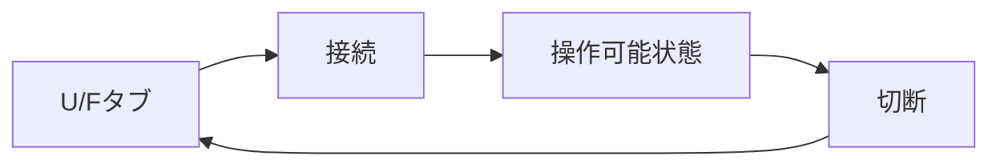

###### 画面共通ルール

| 項目 | 内容 |
|------|------|
| 共通レイアウト | CASメイン画面のU/F関連タブで操作 |
| 操作ルール | 接続中はカメラ/レンズ選択を固定し、切断時に関連機能を無効化する |
| 権限制御 | 本機能では未実装（運用権限前提） |
| エラー表示方針 | ShowMessageWindow で即時通知 |

###### 画面レイアウト

- カメラ選択コンボボックス
- レンズCD選択コンボボックス
- 接続ボタン
- 切断ボタン

###### 画面入出力項目一覧

| 項目ID | 項目名 | 区分（入力/表示） | 型 | 桁数 | 必須 | 初期値 | バリデーション | 備考 |
|--------|--------|-------------------|----|------|------|--------|----------------|------|
| UF-I01 | カメラ選択 | 入力 | enum/string | - | 必須 | 前回設定 | 対応機種一覧 | cmbxUfCamCamera |
| UF-I02 | レンズCD選択 | 入力 | string | - | 必須 | 前回設定 | 対応CD一覧 | cmbxUfCamLensCd |
| UF-O01 | 接続状態 | 表示 | bool | - | - | false | - | ボタン活性状態で表現 |

###### 画面アクション詳細

| アクション名 | 契機 | 処理内容 | 正常時 | 異常時 |
|--------------|------|----------|--------|--------|
| カメラ接続 | ボタン押下 | Temp作成→既存接続解除→接続→UI更新 | 関連機能活性化 | エラー表示 |
| カメラ切断 | ボタン押下 | 位置合わせ停止→切断→UI更新 | 関連機能停止 | エラー表示 |

##### 2-2-1-3. 帳票仕様

対象外

##### 2-2-1-4. EUCファイル（Downloadable File）仕様

対象外

##### 2-2-1-5. 関連システムインタフェース仕様

###### インタフェース一覧

| IF ID | 連携先システム | 方向 | 連携方式 | 概要 | 頻度 | 備考 |
|-------|----------------|------|----------|------|------|------|
| UF-IF-01 | CameraControl | 双方向 | DLL呼び出し | カメラ接続・切断 | 接続要求時 | ConnectCamera/DisconnectCamera |
| UF-IF-02 | GapCamera UI | 双方向 | 画面状態同期 | カメラ/レンズ・ボタン状態同期 | 接続状態変更時 | 同一画面内連動 |

###### 関連システム関連図

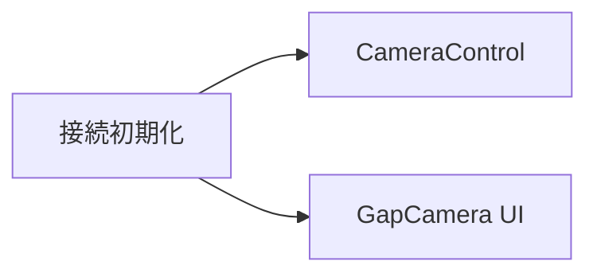

###### インタフェース項目仕様

| 項目名 | 説明 | 型 | 桁数 | 必須 | 変換ルール | 備考 |
|--------|------|----|------|------|------------|------|
| Camera Name | カメラ機種 | string | - | 必須 | UI選択をSettingsへ反映 | CamNames |
| Lens CD | レンズ補正識別 | string | - | 必須 | UI選択を連動反映 | Gap側同期 |

###### 処理内容

| 項目 | 内容 |
|------|------|
| 起動契機 | 接続/切断ボタン |
| 処理タイミング | オペレータ操作時 |
| リトライ方針 | 接続失敗時はオペレータ再試行 |
| 異常時対応 | 例外通知、UI状態維持 |

##### 2-2-1-6. 入出力処理仕様

###### 処理概要

| 項目 | 内容 |
|------|------|
| 処理名 | カメラ接続・初期化処理 |
| 処理種別 | オンライン |
| 処理概要 | 接続状態切替と関連UI初期化を実施 |
| 実行契機 | 接続/切断ボタン |
| 実行タイミング | 任意 |

###### 入出力項目一覧

| 区分 | 項目名 | 説明 | 型 | 桁数 | 必須 | 備考 |
|------|--------|------|----|------|------|------|
| 入力 | カメラ選択 | 接続対象 | string | - | 必須 | 機種別 |
| 入力 | レンズCD | 補正データ選択 | string | - | 必須 | 機種整合 |
| 出力 | UI状態 | ボタン・グループ活性 | bool群 | - | 必須 | U/F・Gap両方 |

###### データ処理内容

1. Tempフォルダ作成
2. 既存カメラ接続解除
3. 新規接続実行
4. U/FとGapの関連UI状態更新

###### IPO図

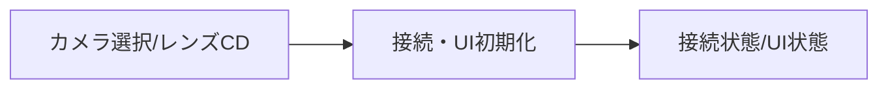

---

#### 2-2-2. 機能名：カメラ位置合わせ機能

##### 2-2-2-1. 機能概要

| 項目 | 内容 |
|------|------|
| 機能ID | UF-F02 |
| 機能名 | カメラ位置合わせ機能 |
| 機能概要 | 対象Cabinetに対し、AF、ガイド表示、タイマ更新を用いてカメラ位置合わせを支援する |
| 利用者 | オペレータ |
| 起動契機 | 位置合わせトグル操作（tbtnUfCamSetPos_Click） |
| 入力 | 対象Cabinet、撮影距離、壁高さ、カメラ高さ |
| 出力 | ライブ画像、カメラ位置、ガイド情報 |
| 関連機能 | UF-F03, UF-F04 |
| 前提条件 | 対象Cabinetが矩形であること |
| 事後条件 | ThroughMode解除、ユーザー設定復帰、内部信号停止 |
| 備考 | timerUfCam_Tick で継続更新する |

##### 2-2-2-2. 画面仕様

###### 画面一覧

| 画面ID | 画面名 | 目的 | 利用者 | 備考 |
|--------|--------|------|--------|------|
| UF-S01 | U/F Adjustment(Camera) | 位置合わせ開始/停止、ライブ確認 | オペレータ | CASメイン画面内タブ |

###### 画面遷移

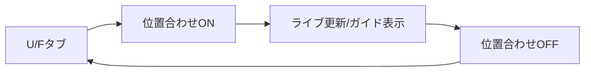

###### 画面共通ルール

| 項目 | 内容 |
|------|------|
| 共通レイアウト | CASメイン画面のU/F関連タブで操作 |
| 操作ルール | 対象Cabinet未選択または矩形不成立時は開始不可 |
| 権限制御 | 本機能では未実装（運用権限前提） |
| エラー表示方針 | ShowMessageWindow で即時通知 |

###### 画面レイアウト

- 位置合わせトグル
- カメラライブ表示エリア
- Cabinet配置選択エリア
- ステータス表示

###### 画面入出力項目一覧

| 項目ID | 項目名 | 区分（入力/表示） | 型 | 桁数 | 必須 | 初期値 | バリデーション | 備考 |
|--------|--------|-------------------|----|------|------|--------|----------------|------|
| UF-I11 | 対象Cabinet選択 | 入力 | Cabinet配列 | - | 必須 | 前回状態 | 矩形チェック | CheckSelectedUnits |
| UF-I12 | 撮影距離 | 入力 | double | - | 必須 | 設定値 | 正数 | CheckShootingDist |
| UF-O11 | カメラビュー | 表示 | image | - | - | 空 | - | imgUfCamCameraView |
| UF-O12 | ステータス | 表示 | string | - | - | Done. | - | txtbStatus |

###### 画面アクション詳細

| アクション名 | 契機 | 処理内容 | 正常時 | 異常時 |
|--------------|------|----------|--------|--------|
| 位置合わせ開始 | トグルON | 対象確認→設定退避→Adjust設定→AF→目標位置設定→タイマ開始 | ライブ更新開始 | エラー表示・復帰 |
| 位置合わせ停止 | トグルOFF | タイマ停止相当の終了処理 | 通常状態復帰 | エラー表示 |

##### 2-2-2-3. 帳票仕様

対象外

##### 2-2-2-4. EUCファイル（Downloadable File）仕様

対象外

##### 2-2-2-5. 関連システムインタフェース仕様

###### インタフェース一覧

| IF ID | 連携先システム | 方向 | 連携方式 | 概要 | 頻度 | 備考 |
|-------|----------------|------|----------|------|------|------|
| UF-IF-11 | CameraControl | 双方向 | DLL呼び出し | AF、ライブ更新、撮影条件反映 | 位置合わせ実行時 | AutoFocus |
| UF-IF-12 | Controller | 双方向 | SDCP | ThroughMode、Layout情報Off、内部信号出力 | 位置合わせ実行時 | CmdDispUnitAddrOff等 |

###### 関連システム関連図

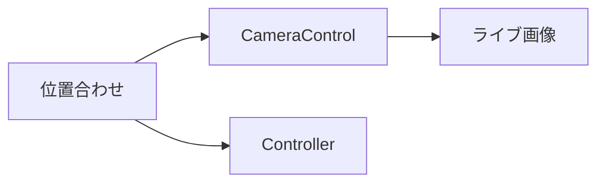

###### インタフェース項目仕様

| 項目名 | 説明 | 型 | 桁数 | 必須 | 変換ルール | 備考 |
|--------|------|----|------|------|------------|------|
| ShootCondition | 撮影設定 | class | - | 必須 | Settingsから取得 | SetPosSetting |
| UserSetting | 表示設定退避値 | class/list | - | 必須 | 実行前に保存し終了時復帰 | ThroughMode含む |

###### 処理内容

| 項目 | 内容 |
|------|------|
| 起動契機 | 位置合わせトグル |
| 処理タイミング | オペレータ操作時およびタイマ周期 |
| リトライ方針 | 再開はオペレータ再操作 |
| 異常時対応 | ThroughMode解除、設定復帰、内部信号停止 |

##### 2-2-2-6. 入出力処理仕様

###### 処理概要

| 項目 | 内容 |
|------|------|
| 処理名 | カメラ位置合わせ処理 |
| 処理種別 | オンライン |
| 処理概要 | 位置合わせ開始、ガイド更新、停止を実施 |
| 実行契機 | 位置合わせトグル |
| 実行タイミング | 任意 |

###### 入出力項目一覧

| 区分 | 項目名 | 説明 | 型 | 桁数 | 必須 | 備考 |
|------|--------|------|----|------|------|------|
| 入力 | 対象Cabinet | 位置合わせ対象 | List<UnitInfo> | - | 必須 | 矩形要件 |
| 入力 | 距離・高さ条件 | カメラ位置算出条件 | double | - | 必須 | Custom時のみ高さ有効 |
| 出力 | カメラ位置 | Pan/Tilt/Roll/X/Y/Z | CameraPosition | - | - | ガイド用 |
| 出力 | ライブ画像 | 位置合わせ確認画像 | image | - | 必須 | UI更新 |

###### データ処理内容

1. 対象Cabinet検証
2. ユーザー設定退避とAdjust設定適用
3. AF実行と目標位置設定
4. Cabinet空間座標設定
5. タイマ駆動でガイド更新

###### IPO図

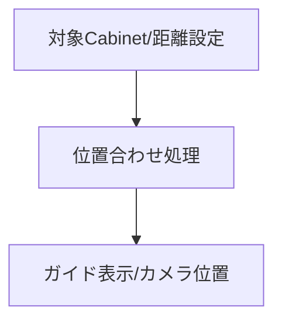

---

#### 2-2-3. 機能名：U/F計測機能

##### 2-2-3-1. 機能概要

| 項目 | 内容 |
|------|------|
| 機能ID | UF-F03 |
| 機能名 | U/F計測機能 |
| 機能概要 | 対象Cabinetを撮影・解析し、Cabinet/Module単位のU/F測定結果を生成して保存する |
| 利用者 | オペレータ |
| 起動契機 | 計測開始ボタン押下（btnUfCamMeasStart_Click） |
| 入力 | 対象Cabinet、撮影距離、壁高さ、カメラ高さ、Target Only設定 |
| 出力 | UfCamMeasLog、UfMeasResult.xml、撮影画像、進捗表示 |
| 関連機能 | UF-F02, UF-F04, UF-F05 |
| 前提条件 | カメラ接続済み、対象Cabinetが矩形であること |
| 事後条件 | 計測結果保存、結果表示更新、設定復帰 |
| 備考 | Abort時は CameraCasUserAbortException を扱う |

##### 2-2-3-2. 画面仕様

###### 画面一覧

| 画面ID | 画面名 | 目的 | 利用者 | 備考 |
|--------|--------|------|--------|------|
| UF-S01 | U/F Adjustment(Camera) | 計測開始、対象選択、結果確認 | オペレータ | CASメイン画面内タブ |
| UF-S02 | WindowProgress | 進捗、残時間、中断操作 | オペレータ | 計測中表示 |

###### 画面遷移

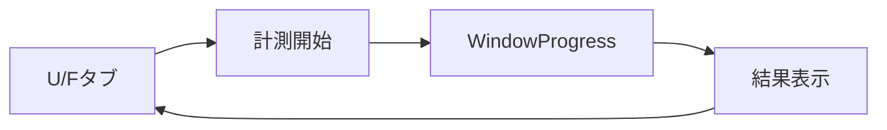

###### 画面共通ルール

| 項目 | 内容 |
|------|------|
| 共通レイアウト | CASメイン画面のU/F関連タブで操作 |
| 操作ルール | 実行中は tcMain.IsEnabled=false とし、他操作を抑止する |
| 権限制御 | 本機能では未実装（運用権限前提） |
| エラー表示方針 | ShowMessageWindow で即時通知 |

###### 画面レイアウト

- 計測開始ボタン
- 対象Cabinet選択エリア
- 結果表示エリア
- 進捗/残時間表示

###### 画面入出力項目一覧

| 項目ID | 項目名 | 区分（入力/表示） | 型 | 桁数 | 必須 | 初期値 | バリデーション | 備考 |
|--------|--------|-------------------|----|------|------|--------|----------------|------|
| UF-I21 | 対象Cabinet選択 | 入力 | Cabinet配列 | - | 必須 | 前回状態 | 矩形チェック | CheckSelectedUnits |
| UF-I22 | Target Only | 入力 | bool | - | 任意 | false | - | cbUfCamMeasTgtOnly |
| UF-O21 | 進捗メッセージ | 表示 | string | - | - | 空 | - | winProgress.ShowMessage |
| UF-O22 | 測定結果 | 表示 | text/grid | - | - | 空 | - | txbUfCamMeasResult |

###### 画面アクション詳細

| アクション名 | 契機 | 処理内容 | 正常時 | 異常時 |
|--------------|------|----------|--------|--------|
| 計測開始 | ボタン押下 | 前提確認→進捗開始→撮影→解析→XML保存 | 完了メッセージ表示 | エラー/中断通知・復帰 |
| 計測中断 | Progress操作 | Abort例外を発生させ停止 | 中断メッセージ表示 | - |

##### 2-2-3-3. 帳票仕様

対象外

##### 2-2-3-4. EUCファイル（Downloadable File）仕様

###### EUCファイル一覧

| ファイルID | ファイル名 | 目的 | 形式 | 文字コード | 備考 |
|------------|------------|------|------|------------|------|
| UF-EUC-01 | UfMeasResult.xml | 計測結果保存 | XML | UTF-8 | UfCamMeasLog |

###### EUCファイルレイアウト

| 項目順 | 項目名 | 型 | 桁数 | 必須 | 説明 |
|--------|--------|----|------|------|------|
| 1 | WallCamDistance | double | - | 必須 | 撮影距離 |
| 2 | StartCamPos/EndCamPos | object | - | 必須 | 開始/終了カメラ位置 |
| 3 | lstUfCamMeas | array | 可変 | 必須 | Cabinet/Module別測定結果 |

##### 2-2-3-5. 関連システムインタフェース仕様

###### インタフェース一覧

| IF ID | 連携先システム | 方向 | 連携方式 | 概要 | 頻度 | 備考 |
|-------|----------------|------|----------|------|------|------|
| UF-IF-21 | CameraControl | 双方向 | DLL呼び出し | AF、画像取得 | 計測実行時 | CaptureImage |
| UF-IF-22 | Controller | 双方向 | SDCP | Cabinet Power On、ThroughMode、内蔵パターン出力 | 計測実行時 | CmdUnitPowerOn等 |
| UF-IF-23 | ファイルシステム | 送信 | XML/画像I/O | 計測結果XML、RAW画像保存 | 実行毎 | UfMeasResult.xml |

###### 関連システム関連図

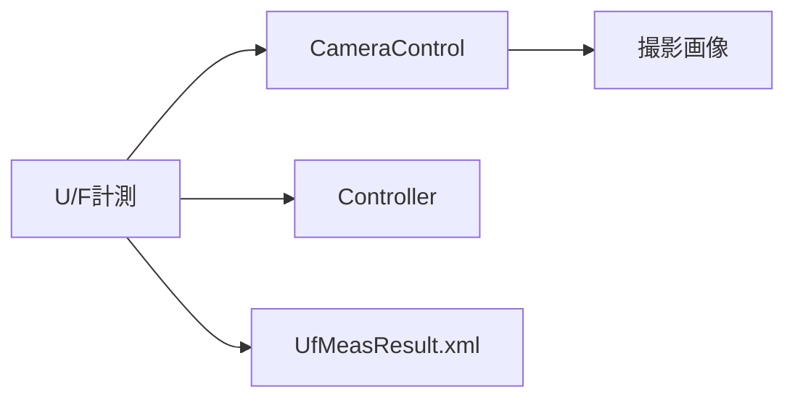

###### インタフェース項目仕様

| 項目名 | 説明 | 型 | 桁数 | 必須 | 変換ルール | 備考 |
|--------|------|----|------|------|------------|------|
| ViewPoint | 視聴点補正条件 | class | - | 必須 | 計測では無効値を使用 | new ViewPoint() |
| CameraPosition | カメラ位置 | class | - | 必須 | 開始/終了時に取得 | CheckCameraPos |
| UfCamMeasLog | 計測結果 | class | - | 必須 | XMLへ保存 | SaveToXmlFile |

###### 処理内容

| 項目 | 内容 |
|------|------|
| 起動契機 | 計測開始ボタン |
| 処理タイミング | オペレータ操作時 |
| リトライ方針 | 失敗時はオペレータ再試行 |
| 異常時対応 | 例外通知、設定復帰、不要画像削除、XML保存 |

##### 2-2-3-6. 入出力処理仕様

###### 処理概要

| 項目 | 内容 |
|------|------|
| 処理名 | U/F計測処理 |
| 処理種別 | オンライン |
| 処理概要 | 撮影、解析、結果保存、表示更新を実施 |
| 実行契機 | 計測開始ボタン |
| 実行タイミング | 任意 |

###### 入出力項目一覧

| 区分 | 項目名 | 説明 | 型 | 桁数 | 必須 | 備考 |
|------|--------|------|----|------|------|------|
| 入力 | 選択Cabinet群 | 計測対象 | List<UnitInfo> | - | 必須 | 矩形要件 |
| 入力 | 撮影条件 | カメラ設定 | ShootCondition | - | 必須 | Settings参照 |
| 出力 | 計測結果 | Cabinet/Module測定結果 | UfCamMeasLog | - | 必須 | XML保存 |
| 出力 | 撮影画像 | Black/Mask/Module/Flat画像 | image files | - | 必須 | 測定フォルダ |

###### データ処理内容

1. 対象Cabinet検証と進捗初期化
2. ユーザー設定退避とAdjust設定適用
3. AF、カメラ位置取得、Cabinet空間座標再設定
4. Black、Mask、Module、Flat画像取得
5. 測定領域解析と結果計算
6. XML保存、不要画像削除、結果表示

###### IPO図

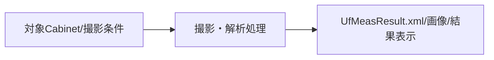

---

#### 2-2-4. 機能名：U/F調整機能

##### 2-2-4-1. 機能概要

| 項目 | 内容 |
|------|------|
| 機能ID | UF-F04 |
| 機能名 | U/F調整機能 |
| 機能概要 | 計測結果と設定条件に基づき調整値を生成し、Controllerへ反映可能な調整データを作成する |
| 利用者 | オペレータ |
| 起動契機 | 調整開始ボタン押下（btnUfCamAdjustStart_Click） |
| 入力 | 対象Cabinet、調整方式、目標Cabinet、視聴点、距離条件 |
| 出力 | UfCamAdjLog、UnitCpInfo.xml、調整済みデータ反映結果 |
| 関連機能 | UF-F02, UF-F03 |
| 前提条件 | カメラ接続済み、対象Cabinetが矩形であり、基準Cabinetが調整範囲内であること |
| 事後条件 | 調整データ書込み完了、設定復帰、必要に応じて再計測可能 |
| 備考 | Cabinet、9pt、Radiator、EachModule方式を切替可能 |

##### 2-2-4-2. 画面仕様

###### 画面一覧

| 画面ID | 画面名 | 目的 | 利用者 | 備考 |
|--------|--------|------|--------|------|
| UF-S01 | U/F Adjustment(Camera) | 調整条件設定、調整開始、結果確認 | オペレータ | CASタブ |
| UF-S02 | WindowProgress | 調整進捗、残時間、中断操作 | オペレータ | 調整中表示 |

###### 画面遷移

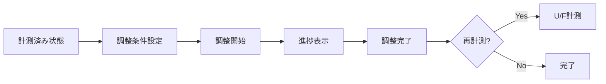

###### 画面共通ルール

| 項目 | 内容 |
|------|------|
| 共通レイアウト | CAS U/Fタブ上で操作 |
| 操作ルール | 実行中は他タブ操作を制限し、調整条件を固定する |
| 権限制御 | 運用権限で実施 |
| エラー表示方針 | 失敗時は詳細メッセージ表示 |

###### 画面レイアウト

- 調整開始ボタン
- 調整方式選択ラジオボタン
- 目標Cabinet指定エリア
- 視聴点設定チェックボックス
- 調整後再計測チェックボックス
- 進捗ウィンドウ

###### 画面入出力項目一覧

| 項目ID | 項目名 | 区分（入力/表示） | 型 | 桁数 | 必須 | 初期値 | バリデーション | 備考 |
|--------|--------|-------------------|----|------|------|--------|----------------|------|
| UF-I31 | 調整方式 | 入力 | enum | - | 必須 | Cabinet | 4方式から選択 | rbUfCamEachMod等 |
| UF-I32 | 目標Cabinet指定 | 入力 | string/list | - | 必須 | 中央 | 範囲内チェック | StoreObjectiveCabinet |
| UF-I33 | 視聴点設定 | 入力 | bool | - | 任意 | false | - | cbUfCamViewPtMode, cbUfCamHViewPt |
| UF-I34 | 調整後再計測 | 入力 | bool | - | 任意 | false | - | cbUfCamMeasResult |
| UF-O31 | 調整進捗 | 表示 | string | - | - | 空 | - | winProgress |

###### 画面アクション詳細

| アクション名 | 契機 | 処理内容 | 正常時 | 異常時 |
|--------------|------|----------|--------|--------|
| 調整開始 | ボタン押下 | 前提確認→基準Cabinet設定→調整計算→データ反映→必要時再計測 | 完了通知 | エラー通知・復帰 |
| 基準Line選択 | チェック変更 | 上下左右の選択整合を検証 | 条件反映 | 注意メッセージ表示 |

##### 2-2-4-3. 帳票仕様

対象外

##### 2-2-4-4. EUCファイル（Downloadable File）仕様

###### EUCファイル一覧

| ファイルID | ファイル名 | 目的 | 形式 | 文字コード | 備考 |
|------------|------------|------|------|------------|------|
| UF-EUC-02 | UnitCpInfo.xml | 調整結果保存 | XML | UTF-8 | UfCamAdjLog |

###### EUCファイルレイアウト

| 項目順 | 項目名 | 型 | 桁数 | 必須 | 説明 |
|--------|--------|----|------|------|------|
| 1 | WallCamDistance | double | - | 必須 | 撮影距離 |
| 2 | StartCamPos/EndCamPos | object | - | 必須 | 開始/終了カメラ位置 |
| 3 | lstUnitCpInfo | array | 可変 | 必須 | Cabinet別補正点情報 |

##### 2-2-4-5. 関連システムインタフェース仕様

###### インタフェース一覧

| IF ID | 連携先システム | 方向 | 連携方式 | 概要 | 頻度 | 備考 |
|-------|----------------|------|----------|------|------|------|
| UF-IF-31 | MakeUFData | 双方向 | DLL呼び出し | FMT抽出、XYZ変換、補正値計算 | 調整実行時 | Cabinet/9pt/Radiator/EachModule |
| UF-IF-32 | Controller | 双方向 | SDCP/FTP | Cabinet電源制御、調整データ反映 | 調整実行時 | writeAdjustedData |
| UF-IF-33 | ファイルシステム | 送受信 | XML/ファイルI/O | UnitCpInfo.xml、調整済みファイル保存 | 実行毎 | ログDir配下 |

###### 関連システム関連図

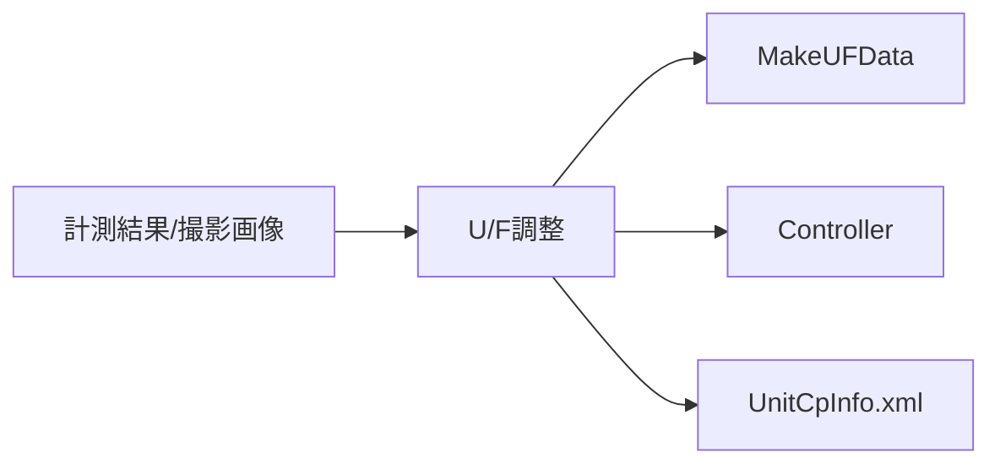

###### インタフェース項目仕様

| 項目名 | 説明 | 型 | 桁数 | 必須 | 変換ルール | 備考 |
|--------|------|----|------|------|------------|------|
| UfCamAdjustType | 調整方式 | enum | - | 必須 | UI選択から変換 | Cabinet/9pt/Radiator/EachModule |
| Objective Cabinet | 基準Cabinet | List<UnitInfo> | - | 必須 | 中央/個別/Line指定から生成 | CheckObjectiveCabinet |
| ViewPoint | 視聴点条件 | class | - | 必須 | 縦横フラグから生成 | Vertical/Horizontal |

###### 処理内容

| 項目 | 内容 |
|------|------|
| 起動契機 | 調整開始ボタン |
| 処理タイミング | オペレータ操作時 |
| リトライ方針 | 基本は条件見直し後の再実行 |
| 異常時対応 | 例外通知、設定復帰、内部信号停止、必要時再計測抑止 |

##### 2-2-4-6. 入出力処理仕様

###### 処理概要

| 項目 | 内容 |
|------|------|
| 処理名 | U/F調整処理 |
| 処理種別 | オンライン |
| 処理概要 | 調整対象計算、補正データ生成、データ反映、ログ保存を実施 |
| 実行契機 | 調整開始ボタン |
| 実行タイミング | 任意 |

###### 入出力項目一覧

| 区分 | 項目名 | 説明 | 型 | 桁数 | 必須 | 備考 |
|------|--------|------|----|------|------|------|
| 入力 | 対象Cabinet群 | 調整対象 | List<UnitInfo> | - | 必須 | 矩形要件 |
| 入力 | 調整条件 | 方式、基準Cabinet、視聴点 | enum/class | - | 必須 | UI選択 |
| 出力 | 調整結果 | Cabinet別補正点情報 | UfCamAdjLog | - | 必須 | XML保存 |
| 出力 | 反映ファイル | 調整済みデータ群 | List<MoveFile> | - | 必須 | writeAdjustedData |

###### データ処理内容

1. 対象Cabinetと基準Cabinetの整合確認
2. ユーザー設定退避とAdjust設定適用
3. AF、カメラ位置取得、Cabinet空間座標再設定
4. 調整方式別の補正点抽出と画像処理
5. MakeUFDataで補正値計算
6. 調整データ反映、XML保存、必要時再計測

###### IPO図

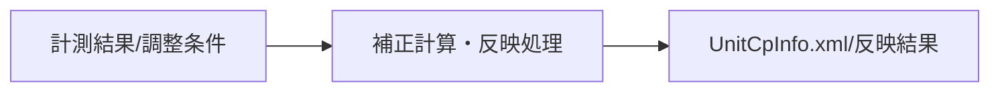

---

#### 2-2-5. 機能名：測定結果読込機能

##### 2-2-5-1. 機能概要

| 項目 | 内容 |
|------|------|
| 機能ID | UF-F05 |
| 機能名 | 測定結果読込機能 |
| 機能概要 | 保存済みのU/F計測結果XMLを読込み、結果表示へ再展開する |
| 利用者 | オペレータ |
| 起動契機 | 結果読込ボタン押下（btnUfCamResultOpen_Click） |
| 入力 | UfMeasResult.xml |
| 出力 | 画面上の測定結果表示 |
| 関連機能 | UF-F03 |
| 前提条件 | 読込対象XMLが存在し、フォーマットが正しいこと |
| 事後条件 | 計測結果表示が更新される |
| 備考 | 読込失敗時は形式不正メッセージを表示する |

##### 2-2-5-2. 画面仕様

###### 画面一覧

| 画面ID | 画面名 | 目的 | 利用者 | 備考 |
|--------|--------|------|--------|------|
| UF-S01 | U/F Adjustment(Camera) | 結果再表示 | オペレータ | CASタブ |
| UF-S03 | Open File Dialog | XML選択 | オペレータ | 標準ダイアログ |

###### 画面遷移

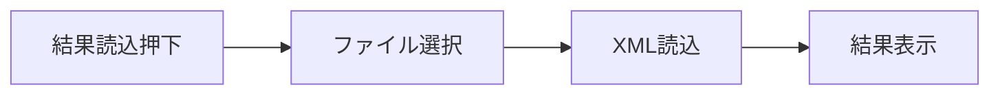

###### 画面共通ルール

| 項目 | 内容 |
|------|------|
| 共通レイアウト | CAS U/Fタブ |
| 操作ルール | XML選択確定後に結果再表示を実施 |
| 権限制御 | OSファイル権限に従う |
| エラー表示方針 | フォーマット不正時は専用メッセージを表示 |

###### 画面レイアウト

- 結果読込ボタン
- ファイル選択ダイアログ
- 結果表示エリア

###### 画面入出力項目一覧

| 項目ID | 項目名 | 区分（入力/表示） | 型 | 桁数 | 必須 | 初期値 | バリデーション | 備考 |
|--------|--------|-------------------|----|------|------|--------|----------------|------|
| UF-I41 | XMLファイルパス | 入力 | string | - | 必須 | 測定Dir | 存在/拡張子 | OpenFileDialog |
| UF-O41 | 測定結果表示 | 表示 | text/grid | - | - | 既存状態 | - | dispUfMeasResult |

###### 画面アクション詳細

| アクション名 | 契機 | 処理内容 | 正常時 | 異常時 |
|--------------|------|----------|--------|--------|
| 結果読込 | ボタン押下 | XML選択→デシリアライズ→結果表示更新 | 結果再表示 | 形式不正エラー表示 |

##### 2-2-5-3. 帳票仕様

対象外

##### 2-2-5-4. EUCファイル（Downloadable File）仕様

対象外

##### 2-2-5-5. 関連システムインタフェース仕様

###### インタフェース一覧

| IF ID | 連携先システム | 方向 | 連携方式 | 概要 | 頻度 | 備考 |
|-------|----------------|------|----------|------|------|------|
| UF-IF-41 | ファイルシステム | 受信 | XML I/O | UfMeasResult.xml 読込 | 要求時 | LoadFromXmlFile |

###### 関連システム関連図

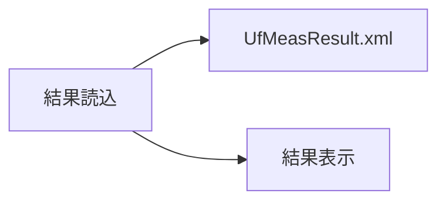

###### インタフェース項目仕様

| 項目名 | 説明 | 型 | 桁数 | 必須 | 変換ルール | 備考 |
|--------|------|----|------|------|------------|------|
| File Path | 読込対象XML | string | - | 必須 | ダイアログ選択 | xmlのみ |
| UfCamMeasLog | 計測結果 | class | - | 必須 | XMLデシリアライズ | 表示用 |

###### 処理内容

| 項目 | 内容 |
|------|------|
| 起動契機 | 結果読込ボタン |
| 処理タイミング | 任意 |
| リトライ方針 | 再選択で再試行 |
| 異常時対応 | フォーマット不正メッセージ表示 |

##### 2-2-5-6. 入出力処理仕様

###### 処理概要

| 項目 | 内容 |
|------|------|
| 処理名 | U/F測定結果読込処理 |
| 処理種別 | オンライン |
| 処理概要 | XMLから計測結果を読込み画面へ反映 |
| 実行契機 | 結果読込ボタン |
| 実行タイミング | 任意 |

###### 入出力項目一覧

| 区分 | 項目名 | 説明 | 型 | 桁数 | 必須 | 備考 |
|------|--------|------|----|------|------|------|
| 入力 | XMLファイル | 読込対象 | string | - | 必須 | ファイル選択 |
| 出力 | 計測結果表示 | 再表示データ | UfCamMeasLog | - | 必須 | UI更新 |

###### データ処理内容

1. OpenFileDialogでXML選択
2. UfCamMeasLogをXMLから読込
3. 結果表示を更新

###### IPO図

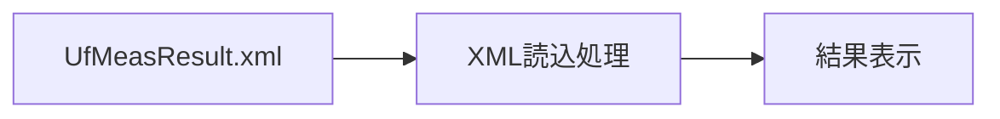

---

### 2-3. データベース仕様

#### データ概要

本機能はRDBを使用せず、ファイルベースでデータを管理する。

| データ名 | 概要 | 保持期間 | 更新主体 | 備考 |
|----------|------|----------|----------|------|
| U/F計測結果XML | U/F測定結果の保存 | 運用保管期間 | 計測処理 | UfMeasResult.xml |
| U/F調整結果XML | U/F補正点情報の保存 | 運用保管期間 | 調整処理 | UnitCpInfo.xml |
| 測定画像ファイル | Black、Mask、Module、Flat画像 | 測定フォルダ世代管理 | 計測処理 | RAW/JPEG |
| 実行ログ | 処理履歴・進捗ログ | 世代管理ポリシーに従う | U/F計測・調整処理 | saveUfLog |
| CamCont.xml | AlphaCameraController連携設定 | 実行時更新 | カメラ制御処理 | 一時更新 |

#### ERD

対象外（RDB未使用）

#### テーブル仕様

対象外

#### カラム仕様

対象外

#### CRUD一覧

| 機能ID | 機能名 | テーブル名 | Create | Read | Update | Delete |
|--------|--------|------------|--------|------|--------|--------|
| UF-F03 | U/F計測 | ファイル(XML/画像) | ○ | - | ○ | - |
| UF-F04 | U/F調整 | ファイル(XML/ログ) | ○ | ○ | ○ | - |
| UF-F05 | 測定結果読込 | ファイル(XML) | - | ○ | - | - |

---

### 2-4. メッセージ・コード仕様

#### メッセージ一覧

| メッセージID | 区分 | メッセージ内容 | 表示条件 | 対応方針 | 備考 |
|--------------|------|----------------|----------|----------|------|
| UF-MSG-001 | 情報 | Measurement UF Complete! | 計測成功 | 完了通知 | ダイアログ表示 |
| UF-MSG-002 | エラー | Failed in Measurement UF. | 計測失敗 | エラー通知 | - |
| UF-MSG-003 | 情報 | UF Camera Adjustment Complete! | 調整成功 | 完了通知 | ダイアログ表示 |
| UF-MSG-004 | エラー | Camera is not opened. | 調整開始前にカメラ未接続 | エラー通知 | - |
| UF-MSG-005 | エラー | Failed in Adjustment UF. | 調整失敗 | エラー通知 | - |
| UF-MSG-006 | エラー | Failed to get the camera position. | カメラ位置取得失敗 | エラー通知 | 計測/調整共通 |
| UF-MSG-007 | エラー | The camera position is inappropriate. | 位置ずれ検出 | 再位置合わせ要求 | 改行付き詳細あり |
| UF-MSG-008 | 注意 | Up to 2 lines can be selected. | 基準Lineを3本以上選択 | 注意通知 | - |
| UF-MSG-009 | エラー | The format of the opened file is incorrect. | 結果XMLの形式不正 | 再選択要求 | UF Measurement fileを案内 |

#### コード一覧

| コード種別 | コード値 | コード名称 | 説明 | 備考 |
|------------|----------|------------|------|------|
| UfCamAdjustType | Cabinet | Cabinet調整 | Cabinet単位のU/F調整 | enum |
| UfCamAdjustType | Cabi_9pt | 9点調整 | 9点基準のU/F調整 | enum |
| UfCamAdjustType | Radiator | Radiator調整 | Radiator基準のU/F調整 | enum |
| UfCamAdjustType | EachModule | Each Module調整 | Module単位のU/F調整 | enum |

---

### 2-5. 機能/データ配置仕様

#### 配置方針

| 項目 | 内容 |
|------|------|
| 機能配置方針 | UIイベントと業務制御は UfCamera.cs、カメラ実行は CameraControl/AlphaCameraController、補正計算は MakeUFData に分離 |
| データ配置方針 | 設定は Settings/CamCont.xml、実行結果はファイル（XML/画像/ログ）で保持 |
| 配置上の制約 | 実機接続、Components配下の実行ファイル、OpenCvSharp DLL、ファイル権限に依存 |

#### 機能配置一覧

| 機能ID | 機能名 | 配置先 | 理由 | 備考 |
|--------|--------|--------|------|------|
| UF-F01 | カメラ接続・初期化 | CAS/Functions/UfCamera.cs | U/F・Gap UI同期を同時制御するため | 接続/切断 |
| UF-F02 | カメラ位置合わせ | CAS/Functions/UfCamera.cs | タイマ駆動のライブ更新と設備設定を統合するため | timerUfCam |
| UF-F03 | U/F計測 | CAS/Functions/UfCamera.cs | 撮影、解析、XML保存、結果表示を統合するため | MeasureUfAsync |
| UF-F04 | U/F調整 | CAS/Functions/UfCamera.cs | 方式別調整制御とMakeUFData連携を統合するため | AdjustUfCamAsync |
| UF-F05 | 測定結果読込 | CAS/Functions/UfCamera.cs | UI操作とXML読込結果表示を一体化するため | btnUfCamResultOpen_Click |

#### データ配置一覧

| データ名 | 配置先 | 保存形式 | バックアップ方針 | 備考 |
|----------|--------|----------|------------------|------|
| U/F計測結果 | ローカルファイル | XML | 測定フォルダ世代管理 | UfMeasResult.xml |
| U/F調整結果 | ローカルファイル | XML | ログフォルダ世代管理 | UnitCpInfo.xml |
| 測定画像 | 測定/ログフォルダ | 画像ファイル | 世代管理 | UF_yyyyMMddHHmm |
| 実行ログ | 測定/ログフォルダ | テキスト | 世代管理 | saveUfLog |
| カメラ連携設定 | Components配下 | XML | 実行都度更新 | CamCont.xml |

---

## 3. 付録

### 3-1. 用語集

| 用語 | 説明 |
|------|------|
| U/F調整 | Cabinet/Moduleの発光強度ばらつきを均一化するための調整 |
| ViewPoint | 視聴点補正条件。垂直・水平の補正モードを含む |
| Objective Cabinet | 調整基準とするCabinet。中央、個別、Line指定に対応 |
| ThroughMode | 計測/位置合わせ時の表示・画質設定モード |
| UfCamMeasLog | U/F計測結果を保持するデータ構造 |
| UfCamAdjLog | U/F調整結果を保持するデータ構造 |
| MakeUFData | U/F補正値生成と統計計算を行うライブラリ |

---

### 3-2. 改版履歴

| バージョン | 日付 | 作成者 | 変更内容 |
|------------|------|--------|----------|
| 1.0 | 2026/04/17 | システム分析チーム | 初版（UfCamera.cs主体で作成） |