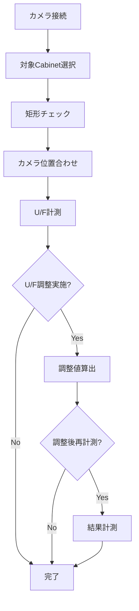
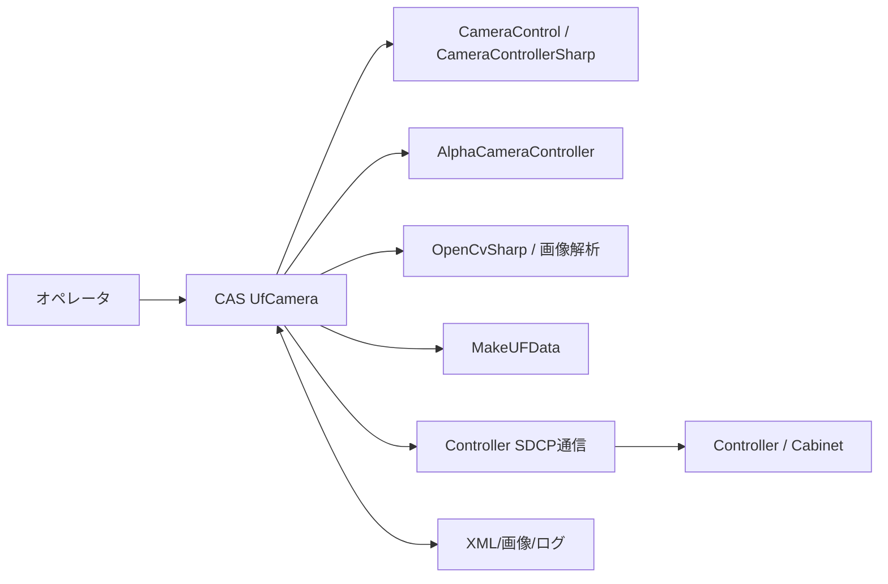

# 要件定義書

| 項目 | 内容 |
|------|------|
| プロジェクト名 | ColorAlignmentSoftware（CAS） |
| 作成日 | 2026/04/17 |
| 作成者 | システム分析チーム |
| バージョン | 1.0 |

---

## 1. ビジネス要件

### 1-1. To-Be業務プロセス概要

U/F調整（カメラ）機能は、LDS の Cabinet/Module 輝度ばらつきを計測し、目標範囲に収まる U/F 調整値を算出して調整作業を効率化することを目的とする。

以下をシステム化し、再現性と作業効率を向上させる。

- カメラ接続とレンズ選択
- 対象Cabinetの矩形チェックと処理対象確定
- カメラ位置合わせ
- 内蔵パターンを表示したCabinetの撮影
- 撮影画像から Cabinet/Module の明るさを計測し、U/F 調整値を算出
- 調整後の再計測と結果確認
- 計測結果・調整結果の XML 保存と再読込

---

### 1-2. 業務内容、業務特性（ルール、制約）

| 業務名 | 業務内容 | ルール・制約 |
|--------|----------|-------------|
| カメラ接続 | カメラ・レンズ情報を選択し、撮影可能状態へ遷移する | AlphaCameraController が起動可能であること |
| 位置合わせ | カメラ位置合わせを実施し、計測可能状態を作る | 対象Cabinetは選択済みかつ矩形であること |
| U/F計測 | 内蔵パターンを表示した Cabinet の撮影画像を取得し、明るさ計測結果を生成する | 計測中は他操作を抑止し、進捗表示を行う |
| U/F調整 | 計測結果から U/F 調整値を算出し、調整データを生成する | 調整方式、目標Cabinet、視聴点設定に従う |
| 結果確認 | 調整後の結果計測、既存 XML の再読込を行う | XML 形式の計測結果を扱う |

---

### 1-3. 組織構成、要員、設備

#### 組織構成

- CASアプリ開発担当
- 画像解析・補正ロジック担当
- 設備評価（カメラ/Controller）担当

#### 要員スキル・規模

- C#（WPF、非同期処理）
- 画像解析（OpenCvSharp）
- カメラ制御（CameraControl/CameraControllerSharp）
- 色度・輝度補正ロジック（MakeUFData）
- Controller通信（SDCPコマンド運用）

#### 必要設備

- Windows PC（CAS実行環境）
- Sony Alphaカメラ（例: ILCE-6400）
- 対応レンズとレンズ補正データ
- Controller接続ネットワーク
- LDS実機（Cabinet）

---

### 1-4. 業務KPIとその目標値

| KPI | 現状値 | 目標値 | 達成期限 |
|-----|--------|--------|---------|
| U/F調整後の Module 間輝度差 | - | ±1.7%以下 | 運用開始時 |
| 調整実行成功率 | - | 99.0%以上 | 運用開始時 |
| 調整処理時間 | - | 30分以内 | 運用開始時 8K4Kサイズ |

---

### 1-5. 概要業務フロー

---

### 1-6. システム化の対象となる業務

| 対象業務 | 実現手段 | 備考 |
|----------|----------|------|
| カメラ接続・切断 | `btnUfCamConnect_Click` / `btnUfCamDisconnect_Click` | GapCamera 側 UI 状態も連動更新 |
| カメラ位置合わせ | `tbtnUfCamSetPos_Click` / `timerUfCam_Tick` | ThroughMode、AF、ライブビュー更新を伴う |
| U/F計測 | `btnUfCamMeasStart_Click` から `MeasureUfAsync` 実行 | 進捗・残時間表示あり |
| U/F調整 | `btnUfCamAdjustStart_Click` から `AdjustUfCamAsync` 実行 | 調整方式、目標Cabinet、視聴点設定あり |
| 調整後再計測 | 調整完了後に `MeasureUfAsync` を任意実行 | `cbUfCamMeasResult` により制御 |
| 計測結果読込 | `btnUfCamResultOpen_Click` | `UfMeasResult.xml` を再表示 |

---

### 1-7. ビジネス制約

| 制約種別 | 内容 |
|----------|------|
| スケジュール |  |
| コスト | 既存CAS基盤・既存カメラ制御構成を前提に追加開発を最小化 |
| その他 | U/F調整は1回あたり最大8K4Kサイズを対象とすること |

---

### 1-8. その他の業務要件

- 作業中断（Abort）時に ThroughMode 解除、ユーザー設定復元、内部信号停止を安全に行えること
- 非Developerモードでは校正テーブル値を結果ファイルへ残さないこと
- 実行ごとに計測結果 XML、調整結果 XML、ログを保存できること

---

## 2. システム要件（機能要件）

### 2-1. システム全体像

UfCamera 機能は CAS 内の U/F 調整サブシステムとして動作し、カメラ画像撮影、画像解析、色度・輝度補正値算出、Controller 連携を統合する。

---

### 2-2. システム化対象領域（適用範囲）と影響範囲

#### 適用範囲

- カメラ接続・切断
- カメラ位置合わせ・プレビュー更新
- U/F計測・進捗管理・中断
- U/F調整・調整後再計測
- 計測結果 XML の保存・再読込
- 調整方式切替、目標Cabinet選択、視聴点設定

#### 影響を受ける周辺システム

| システム名 | 影響内容 |
|-----------|---------|
| AlphaCameraController | 撮影条件設定、AF、撮影実行、結果ファイル更新に依存 |
| CameraControl / CameraControllerSharp | 対応カメラ・レンズ・撮影条件変更の影響を受ける |
| Controller（SDCP） | 内蔵パターン表示、ThroughMode、Layout情報Off、電源制御に依存 |
| MakeUFData | 調整値生成アルゴリズム、補正データ生成に依存 |
| CAS設定データ（Settings） | 撮影距離、カメラ高さ、撮影条件、待機時間、目標色度に影響 |

---

### 2-3. ソリューション方針

- UIイベント起点で非同期処理を実行し、長時間処理中は進捗ウィンドウで残時間と中断操作を提示する
- カメラ制御は AlphaCameraController と CamCont.xml のファイル連携を前提とする
- 計測前後でユーザー設定を退避・復元し、異常時も ThroughMode と内部信号を確実に戻す
- U/F調整は Cabinet、9点、Radiator、Each Module の調整方式を切り替え可能とする
- 結果保存は XML を標準とし、再表示とトレーサビリティに利用する

---

### 2-4. システム機能要件

| No. | 機能名 | 機能概要 | 優先度 |
|-----|--------|----------|--------|
| 2-4-01 | カメラ設定同期 | U/F と Gap のカメラ・レンズ選択状態を同期できること | 中 |
| 2-4-02 | カメラ接続・切断 | カメラ接続状態を初期化し、関連 UI を有効/無効化できること | 高 |
| 2-4-03 | 対象Cabinet妥当性確認 | 選択Cabinetの存在・矩形性を検証できること | 高 |
| 2-4-04 | カメラ位置合わせ | 位置合わせモードの開始/停止、ガイド表示更新を実行できること | 高 |
| 2-4-05 | U/F計測 | Cabinet/Module の明るさ計測結果を生成できること | 高 |
| 2-4-06 | U/F調整方式切替 | Cabinet、9点、Radiator、Each Module の調整方式を選択できること | 高 |
| 2-4-07 | 目標Cabinet設定 | 中央、個別指定、ライン指定で基準Cabinetを設定できること | 高 |
| 2-4-08 | 視聴点設定 | 垂直・水平方向の視聴点補正条件を設定できること | 中 |
| 2-4-09 | U/F調整値算出 | 計測結果から U/F 調整値を自動算出できること | 高 |
| 2-4-10 | 調整後再計測 | 調整後に結果計測を任意実行できること | 中 |
| 2-4-11 | 計測結果保存・再読込 | `UfMeasResult.xml` を保存し、再表示できること | 中 |
| 2-4-12 | エラー通知・中断 | カメラ異常、通信異常、中断操作を安全に処理できること | 高 |

---

### 2-5. データ要件

| データ名 | 主要項目 | 関連データ | 備考 |
|----------|----------|-----------|------|
| UfCamMeasLog | 撮影距離、壁高さ、カメラ高さ、開始/終了カメラ位置、計測結果一覧 | 撮影画像、UfCamMeasValue | 計測結果 XML の中核データ |
| UfCamAdjLog | 撮影距離、壁高さ、カメラ高さ、開始/終了カメラ位置、補正点情報一覧 | UfCamCabinetCpInfo | 調整結果 XML の中核データ |
| UfCamMeasValue | Cabinet 単位の計測結果、Module 情報、補正前後値 | UfCamModule, UfCamMp | U/F計測結果の明細 |
| UfCamCabinetCpInfo | Cabinet 単位の補正点群、補正前後の評価値 | UfCamCorrectionPoint | 調整計算・転送の基礎情報 |
| CameraControlData | 撮影条件、AF条件、保存先、実行フラグ | CamCont.xml | AlphaCameraController との連携ファイル |
| UserSetting | ThroughMode、LightOutput、TempCorrection など | Controller設定 | 実行前後で退避・復元する |

---

### 2-6. 関連システムインタフェース要件

| 連携先システム | インタフェース種別 | データ内容 | 頻度 |
|--------------|-----------------|-----------|------|
| AlphaCameraController | XMLファイル連携 | `CamCont.xml`、撮影条件、AF要求、画像保存先 | 撮影時 |
| CameraControl / CameraControllerSharp | DLL/プロセス連携 | カメラ接続、AF、撮影、ライブビュー | 接続時・撮影時 |
| Controller | SDCPコマンド通信 | 内蔵パターン、ThroughMode、電源制御、Layout情報Off | 位置合わせ・計測・調整時 |
| ファイルシステム | XML/画像/ログ I/O | `UfMeasResult.xml`、`UnitCpInfo.xml`、撮影画像、ログ | 実行毎 |
| CAS UI | 画面イベント/表示更新 | 進捗、結果表示、エラー通知 | 常時 |

---

### 2-7. 要件定義不要機能

| 機能名 | 不要となる理由 |
|--------|--------------|
| DB永続化 | 実行結果は XML/画像/ログで管理するため |
| Web/API公開 | デスクトップアプリ内機能であり外部公開を想定しないため |
| 自動スケジューリング実行 | オペレータ操作起点の実行を前提とするため |

---

### 2-8. システム構築の制約

| 制約種別 | 内容 |
|----------|------|
| 実行基盤 | CAS（WPF、.NET Framework）上で動作すること |
| 通信制約 | Controller とカメラ制御プロセスの両方が利用可能であること |
| 機器制約 | 対応カメラ、レンズ補正データ、LEDモデルに依存 |
| 実装制約 | AlphaCameraController 起動、XMLファイル連携、既存 MakeUFData ロジックを前提とする |

---

## 3. システム要件（非機能要件）

### 3-1. 移行要件

| 移行対象 | 移行方法 | タイミング | 依存関係 |
|----------|----------|-----------|---------|
| CAS設定値 | 既存設定ファイルを引継ぎ | バージョン更新時 | Camera/Configuration 設定定義 |
| レンズ補正データ | Components 配下の既存 XML を利用 | 導入時 | カメラ機種・レンズ識別 |

---

### 3-2. 品質要件

| 品質特性 | 要件内容 | 指標・目標値 |
|----------|----------|------------|
| 信頼性 | 例外時に ThroughMode や内部信号を安全に復帰できること | 異常終了後の復帰成功率 100% |
| 保守性 | 接続、位置合わせ、計測、調整を機能分離すること | 主要処理の責務重複を最小化 |
| 正確性 | U/F調整後の輝度ばらつきが品質要求に適合すること | Module間輝度差 ±1.7%以内 |
| 機能性 | 接続、位置合わせ、計測、調整、再読込を提供すること | 必須機能網羅率 100% |
| 操作性 | 進捗表示、残時間表示、中断操作、結果再表示を提供すること | 作業者手順の標準化 |
| セキュリティ | 校正テーブルの詳細値を通常運用で残さないこと | 非Developerモードで秘匿 |

---

### 3-3. 性能要件

| 項目 | 要件内容 | 目標値 |
|------|----------|--------|
| 応答時間 | UI操作に対する開始応答 | 1秒以内 |
| データ処理時間 | 計測・調整・再計測処理 | 対象Cabinet数に応じた進捗表示で管理 |
| 最大処理対象 | 1実行あたりの対象Cabinet処理 | 8K4Kサイズ相当の対象範囲を完遂できること |
| 同時接続数 | カメラ/Controller接続 | 単一カメラ、複数Controller対応 |

---

### 3-4. システムマネジメント要件

| 項目 | 要件内容 |
|------|----------|
| 監視 | 実行状況は進捗ウィンドウとログで追跡可能であること |
| 結果管理 | 計測結果 XML、調整結果 XML を保存し再利用可能であること |
| 障害対応 | カメラ起動失敗、撮影失敗、通信失敗、設定不正時は処理停止とメッセージ通知を行うこと |
| 自動化（RBA） | 本機能範囲では対象外（将来検討） |

---

### 3-5. インフラストラクチャー要件

| 項目 | 要件内容 |
|------|----------|
| サーバ | 不要（クライアントPC単体実行） |
| ネットワーク | Controller通信可能なLAN環境 |
| セキュリティ | 実行端末のアクセス制御と補正データ保護 |
| 可用性・冗長化 | 中断時は再実行可能であること |

---

## 4. 次工程以降への申し送り事項

| No. | 申し送り内容 | 担当者 | 期限 | 備考 |
|-----|------------|--------|------|------|

---

## 変更履歴

| バージョン | 変更日 | 変更者 | 変更内容 |
|-----------|--------|--------|----------|
| 1.0 | 2026/04/17 | システム分析チーム | 初版作成（UfCamera.cs中心） |