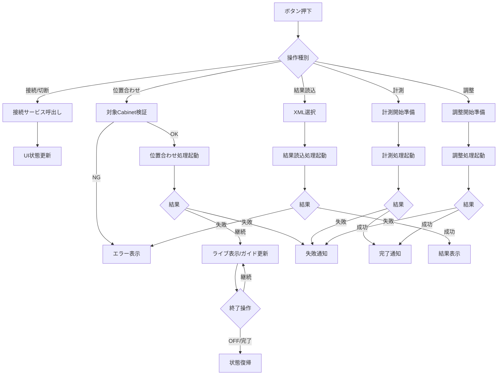
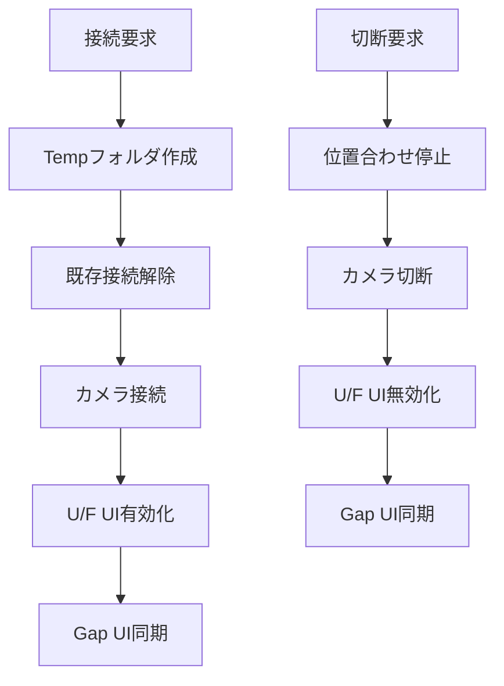
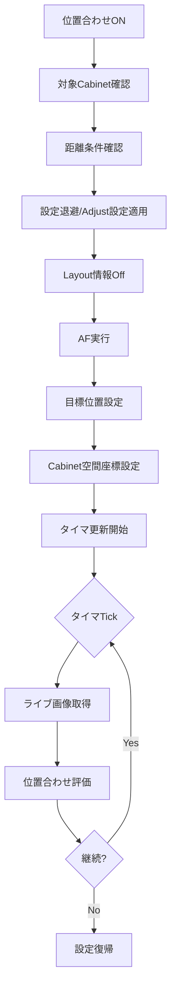
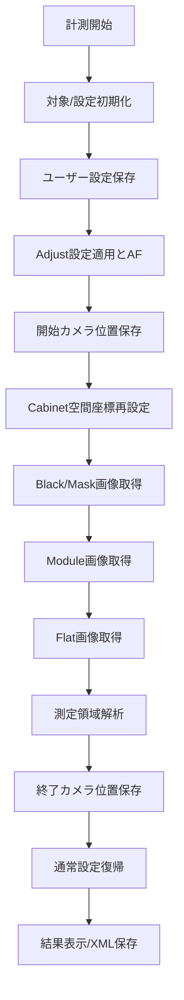
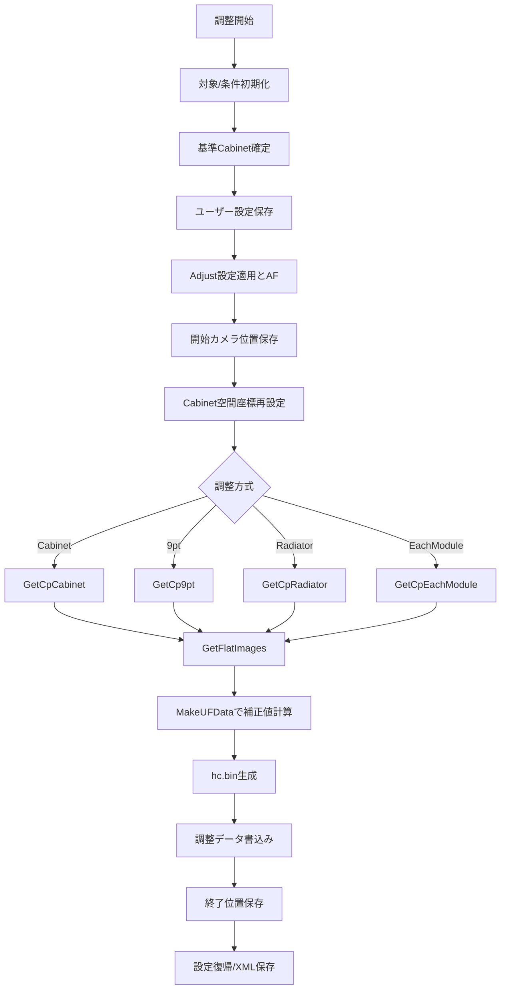
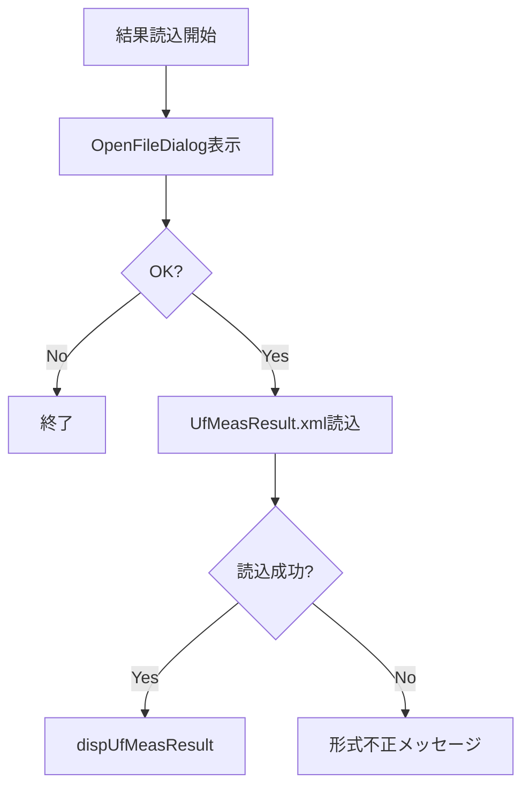

## 4. モジュール仕様（詳細）

### 4-1. MDL-UF-001: UfCameraUIController

#### 4-1-1. 基本情報

| 項目 | 内容 |
|------|------|
| モジュールID | MDL-UF-001 |
| モジュール名 | UfCameraUIController |
| 分類 | 画面/ビジネスロジック |
| 呼出元 | オペレータUI操作 |
| 呼出先 | MDL-UF-002〜006 |
| トランザクション | 無 |
| 再実行性 | 可（処理完了/エラー後に再実行可能） |

#### 4-1-2. 処理フロー

#### 4-1-3. 処理手順

| 手順No. | 処理内容 | 入力 | 出力 | 操作対象 | 備考 |
|---------|----------|------|------|----------|------|
| 1 | 操作種別判定 | 押下ボタン/トグル種別 | 処理分岐 | U/FタブUI | 接続、位置合わせ、計測、調整、結果読込を判定 |
| 2 | 対象Cabinet/入力値チェック | Cabinet選択状態、距離、高さ、基準Cabinet指定 | 実行可否 | 画面選択配列、入力UI | CheckSelectedUnits、CheckShootingDist |
| 3 | 位置合わせ開始/更新 | 対象Cabinet、表示設定 | ライブ表示、ガイド状態 | tbtnUfCamSetPos、画像UI | ON/OFF とタイマ更新を制御 |
| 4 | 計測開始準備 | 対象Cabinet、距離条件 | Progress UI、画面操作禁止 | WindowProgress、tcMain.IsEnabled | 位置合わせ停止と保存先準備を含む |
| 5 | 計測処理起動 | 対象Cabinet、measPath | 計測結果、測定ファイル | UfMeasurementEngine | MeasureUfAsync を Task.Run で起動 |
| 6 | 調整開始準備 | 対象Cabinet、調整方式、基準Cabinet、視聴点 | Progress UI、画面操作禁止 | WindowProgress | 目標色度設定と logDir 作成を含む |
| 7 | 調整処理起動 | 調整条件、logDir | 調整結果、反映対象ファイル | UfAdjustmentEngine | AdjustUfCamAsync を Task.Run で起動 |
| 8 | 結果読込処理起動 | XMLパス | 測定結果表示 | UfResultLoadService | UfCamMeasLog.LoadFromXmlFile |
| 9 | 後処理 | 実行結果 | 通知・状態復帰 | UI/設定 | 完了/失敗通知、ThroughMode解除、表示復帰等 |

#### 4-1-4. 操作対象仕様（画面、テーブル、ファイル）

| 対象種別 | 対象名 | 操作内容 | 操作タイミング | 主キー/識別子 | 備考 |
|----------|--------|----------|----------------|---------------|------|
| 画面 | U/Fタブ | ボタン操作/結果表示 | ユーザー操作時 | コントロール名 | 接続、位置合わせ、計測、調整、結果読込 |
| 画面 | tbtnUfCamSetPos | ON/OFF切替 | 位置合わせ開始/終了時 | ToggleState | 位置合わせトグル |
| 画面 | imgUfCamCameraView | ライブ表示/ガイド更新 | 位置合わせ中 | ImageControl | タイマ更新で反映 |
| 画面 | WindowProgress | 表示/更新/Close | 処理開始〜終了 | ウィンドウインスタンス | 中断操作含む |
| 画面 | ファイルダイアログ | XMLパス選択 | 結果読込時 | ダイアログインスタンス | path確定用 |
| ファイル | UfMeasResult.xml | 読込/書込 | 計測/読込時 | path | 測定結果保存/再表示 |
| ファイル | UnitCpInfo.xml | 書込 | 調整完了時 | path | 調整結果保存 |

#### 4-1-5. インタフェース仕様（引数・返り値）

| 項目 | 内容 |
|------|------|
| インタフェース名 | U/F系イベントハンドラ群 |
| 概要 | 接続、位置合わせ、計測、調整、結果読込のUIイベントを業務処理へ中継する |
| シグネチャ | private async void btnUfCamMeasStart_Click(object sender, RoutedEventArgs e)、private async void btnUfCamAdjustStart_Click(object sender, RoutedEventArgs e)、private void tbtnUfCamSetPos_Click(object sender, RoutedEventArgs e) ほか |
| 呼出条件 | U/Fタブのボタン/トグル操作 |

引数一覧

| No. | 引数名 | 型 | 必須 | 説明 | バリデーション |
|-----|--------|----|------|------|----------------|
| 1 | sender | object | Y | イベント送信元 | null許容 |
| 2 | e | RoutedEventArgs/EventArgs | Y | イベント情報 | 操作元イベント型と整合 |

返り値一覧

| No. | 項目名 | 型 | 説明 | 備考 |
|-----|--------|----|------|------|
| 1 | なし | void | UIイベント処理 | 非同期イベントを含む。例外は内部catch |

#### 4-1-6. 例外処理仕様

| No. | 例外/エラー条件 | 検知方法 | 対応内容 | ユーザー通知 | ログ出力 | リトライ/継続可否 |
|-----|------------------|----------|----------|--------------|----------|------------------|
| 1 | 対象Cabinet不正 | CheckSelectedUnits 例外 | 処理中断/タブ復帰 | CAS Error表示 | saveUfLog | 可 |
| 2 | 入力値不正（距離、高さ、基準Cabinet） | Parse失敗、CheckObjectiveCabinet 例外 | 処理中断 | CAS Error表示 | saveUfLog | 可 |
| 3 | カメラ未接続 | IsCameraOpened 判定 | 調整開始中断 | CAS Error表示 | saveUfLog | 可 |
| 4 | 実処理失敗 | Task例外 | 後処理実施し失敗通知 | CAS Error表示 | saveUfLog | 可 |
| 5 | ユーザー中断 | CameraCasUserAbortException | 中断として終了 | Abort表示 | saveUfLog | 可 |

#### 4-1-7. ログ仕様

| ログ種別 | 出力条件 | 出力項目 | 保持期間 | マスキング方針 |
|----------|----------|----------|----------|----------------|
| 実行ログ | 処理開始/終了/主要ステップ | 時刻、処理名、対象、進捗 | 測定/ログフォルダ世代管理 | 個人情報なし |

### 4-2. MDL-UF-002: UfCameraConnectionService

#### 4-2-1. 基本情報

| 項目 | 内容 |
|------|------|
| モジュールID | MDL-UF-002 |
| モジュール名 | UfCameraConnectionService |
| 分類 | 画面/外部IF |
| 呼出元 | UIController |
| 呼出先 | CameraControl, AlphaCameraController, GapCamera UI |
| トランザクション | 無 |
| 再実行性 | 可 |

#### 4-2-2. 処理フロー

#### 4-2-3. 処理手順

| 手順No. | 処理内容 | 入力 | 出力 | 操作対象 | 備考 |
|---------|----------|------|------|----------|------|
| 1 | カメラ選択同期 | U/Fカメラ選択 | Settings.Ins.Camera.Name | カメラ設定 | Gap側コンボも同期 |
| 2 | レンズCD同期 | U/Fレンズ選択 | 選択済みレンズCD | レンズ設定 | Gap側コンボも同期 |
| 3 | 接続準備 | Tempパス | Tempフォルダ | ファイルシステム | 未存在時のみ作成 |
| 4 | 接続/切断実行 | 接続要求 | カメラ接続状態 | CameraControl | DisconnectCamera/ConnectCamera |
| 5 | UI活性制御 | 接続状態 | 各種ボタン活性状態 | U/F・Gap UI | Developerモード分岐あり |

#### 4-2-4. 操作対象仕様（画面、テーブル、ファイル）

| 対象種別 | 対象名 | 操作内容 | 操作タイミング | 主キー/識別子 | 備考 |
|----------|--------|----------|----------------|---------------|------|
| 画面 | cmbxUfCamCamera | 選択反映 | カメラ選択変更時 | SelectedIndex | Settings同期 |
| 画面 | cmbxUfCamLensCd | 選択反映 | レンズ変更時 | SelectedIndex | Gap側同期 |
| 画面 | btnUfCamConnect/Disconnect | 活性制御 | 接続状態変更時 | IsEnabled | Gap側ボタンも同期 |
| ファイル | tempPath | 作成 | 接続開始時 | path | 一時保存先 |

#### 4-2-5. インタフェース仕様（引数・返り値）

| 項目 | 内容 |
|------|------|
| インタフェース名 | 接続/切断処理 |
| 概要 | カメラ接続状態とU/F・Gap UI状態を同期制御 |
| シグネチャ | private void btnUfCamConnect_Click(object sender, RoutedEventArgs e)、private void btnUfCamDisconnect_Click(object sender, RoutedEventArgs e) |
| 呼出条件 | 接続/切断ボタン押下 |

引数一覧

| No. | 引数名 | 型 | 必須 | 説明 | バリデーション |
|-----|--------|----|------|------|----------------|
| 1 | sender | object | Y | イベント送信元 | - |
| 2 | e | RoutedEventArgs | Y | イベント情報 | - |

返り値一覧

| No. | 項目名 | 型 | 説明 | 備考 |
|-----|--------|----|------|------|
| 1 | なし | void | UI状態更新のみ | 例外は通知 |

#### 4-2-6. 例外処理仕様

| No. | 例外/エラー条件 | 検知方法 | 対応内容 | ユーザー通知 | ログ出力 | リトライ/継続可否 |
|-----|------------------|----------|----------|--------------|----------|------------------|
| 1 | カメラ接続失敗 | ConnectCamera 例外 | 接続中断 | CAS Error表示 | 任意 | 可 |
| 2 | レンズ一覧更新失敗 | ShowLensCdFiles 例外 | UI維持 | CAS Error表示 | 任意 | 可 |

#### 4-2-7. ログ仕様

| ログ種別 | 出力条件 | 出力項目 | 保持期間 | マスキング方針 |
|----------|----------|----------|----------|----------------|
| 実行ログ | 接続/切断、選択変更時 | カメラ名、レンズCD、接続状態 | 実行中 | 個人情報なし |

### 4-3. MDL-UF-003: UfCameraPositioning

#### 4-3-1. 基本情報

| 項目 | 内容 |
|------|------|
| モジュールID | MDL-UF-003 |
| モジュール名 | UfCameraPositioning |
| 分類 | ビジネスロジック |
| 呼出元 | UIController |
| 呼出先 | CameraControl, Controller, 画像表示 |
| トランザクション | 無 |
| 再実行性 | 可 |

#### 4-3-2. 処理フロー

#### 4-3-3. 処理手順

| 手順No. | 処理内容 | 入力 | 出力 | 操作対象 | 備考 |
|---------|----------|------|------|----------|------|
| 1 | 測定レベル設定 | モデル設定 | m_MeasureLevel | 内部状態 | brightness.UF_20pc |
| 2 | 対象抽出 | Cabinet選択 | lstTgtUnits | 画面配列 | 矩形チェックあり |
| 3 | ユーザー設定退避 | 現在設定 | userSetting | Controller設定 | getUserSettingSetPos |
| 4 | 位置合わせ設定適用 | 退避前設定 | Adjust設定 | Controller | setAdjustSettingSetPos |
| 5 | AF/ガイド準備 | ShootCondition | AF完了状態 | CameraControl | outputIntSigChecker, AutoFocus |
| 6 | 空間座標設定 | 対象Cabinet、距離条件 | CabinetCoordinate | 内部配列 | SetCamPosTarget, SetCabinetPos |
| 7 | タイマ更新 | ライブ画像 | ガイド評価結果 | UI画像 | AdjustCameraPosUf |

#### 4-3-4. 操作対象仕様（画面、テーブル、ファイル）

| 対象種別 | 対象名 | 操作内容 | 操作タイミング | 主キー/識別子 | 備考 |
|----------|--------|----------|----------------|---------------|------|
| 画面 | tbtnUfCamSetPos | ON/OFF切替 | ユーザー操作 | ToggleState | 実行中はタイマ連動 |
| 画面 | imgUfCamCameraView | ライブ表示更新 | タイマTick | ImageControl | 位置合わせ用 |
| 画面 | txtbStatus | ステータス表示 | 開始/停止時 | Text | Setting Camera Position... |
| 外部IF | Controller | Layout情報Off、ThroughMode関連 | 位置合わせ開始時 | ControllerID | 複数Controller対応 |

#### 4-3-5. インタフェース仕様（引数・返り値）

| 項目 | 内容 |
|------|------|
| インタフェース名 | 位置合わせ処理 |
| 概要 | 位置合わせ開始・更新・停止を制御 |
| シグネチャ | private void tbtnUfCamSetPos_Click(object sender, RoutedEventArgs e)、private void timerUfCam_Tick(object sender, EventArgs e)、private void SetCabinetPos(List<UnitInfo> lstTgtUnits, double dist, double wallH, double camH) |
| 呼出条件 | トグルON/OFF、タイマ更新、計測/調整の前後 |

引数一覧

| No. | 引数名 | 型 | 必須 | 説明 | バリデーション |
|-----|--------|----|------|------|----------------|
| 1 | lstTgtUnits | List<UnitInfo> | Y | 位置合わせ対象Cabinet群 | 空不可/矩形前提 |
| 2 | dist | double | Y | 撮影距離 | CheckShootingDist |
| 3 | wallH | double | N | Wall下端高さ | Custom時のみ有効 |
| 4 | camH | double | N | カメラ高さ | Custom時のみ有効 |

返り値一覧

| No. | 項目名 | 型 | 説明 | 備考 |
|-----|--------|----|------|------|
| 1 | なし | void | UI制御と内部座標設定 | 例外は通知 |

#### 4-3-6. 例外処理仕様

| No. | 例外/エラー条件 | 検知方法 | 対応内容 | ユーザー通知 | ログ出力 | リトライ/継続可否 |
|-----|------------------|----------|----------|--------------|----------|------------------|
| 1 | 設定値不正（距離/高さ等） | Parse失敗 | 位置合わせ停止 | CAS Error表示 | 任意 | 可 |
| 2 | 位置合わせ準備失敗 | AutoFocus、Layout制御例外 | ThroughMode解除・設定復帰 | CAS Error表示 | 任意 | 可 |
| 3 | タイマ更新例外 | AdjustCameraPosUf 例外 | 内部信号停止、トグルOFF | CAS Error表示 | 任意 | 可 |

#### 4-3-7. ログ仕様

| ログ種別 | 出力条件 | 出力項目 | 保持期間 | マスキング方針 |
|----------|----------|----------|----------|----------------|
| 実行ログ | ON/OFF、主要設定適用時 | 距離条件、対象Cabinet、処理状態 | 測定フォルダ世代管理 | 機密値除外 |

### 4-4. MDL-UF-004: UfMeasurementEngine

#### 4-4-1. 基本情報

| 項目 | 内容 |
|------|------|
| モジュールID | MDL-UF-004 |
| モジュール名 | UfMeasurementEngine |
| 分類 | ビジネスロジック |
| 呼出元 | UIController |
| 呼出先 | CameraControl、OpenCv、Controller、ファイルI/O |
| トランザクション | 無 |
| 再実行性 | 可 |

#### 4-4-2. 処理フロー

#### 4-4-3. 処理手順

| 手順No. | 処理内容 | 入力 | 出力 | 操作対象 | 備考 |
|---------|----------|------|------|----------|------|
| 1 | 測定フォルダ作成 | 実行日時 | measPath | ファイルシステム | UF_yyyyMMddHHmm |
| 2 | 設定保存 | 現在ユーザー設定 | m_lstUserSetting | Controller設定 | 後で復帰 |
| 3 | 撮影準備 | ShootCondition | カメラ設定反映 | CameraControl | setAdjustSetting, AutoFocus |
| 4 | カメラ位置確認 | ライブ画像 | startCamPos | CameraControl | GetCameraPosUf, CheckCameraPos |
| 5 | 画像取得 | 対象Cabinet | 撮影画像 | カメラ/ファイル | Black、Mask、Module、Flat |
| 6 | 解析 | 画像群、ViewPoint | U/F計測結果 | OpenCv処理 | calcMeasAreaPv |
| 7 | 結果保存 | 計測データ | UfMeasResult.xml | ファイル | UfCamMeasLog.SaveToXmlFile |
| 8 | 復帰処理 | 一時設定 | 通常設定 | Controller | ThroughMode解除＋UserSetting復帰 |

#### 4-4-4. 操作対象仕様（画面、テーブル、ファイル）

| 対象種別 | 対象名 | 操作内容 | 操作タイミング | 主キー/識別子 | 備考 |
|----------|--------|----------|----------------|---------------|------|
| ファイル | UfMeasResult.xml | 出力 | 計測完了時 | path | 測定結果保存 |
| ファイル | Black/Mask/Module/Flat画像 | 出力/読込 | 計測実行中 | 連番ファイル名 | fn_BlackFile 等 |
| 外部IF | CameraControl | 撮影/AF | 計測前〜中 | カメラ接続状態 | 失敗時例外 |
| 外部IF | Controller | パターン、電源制御 | 計測前〜中 | ControllerID | CmdUnitPowerOn 等 |

#### 4-4-5. インタフェース仕様（引数・返り値）

| 項目 | 内容 |
|------|------|
| インタフェース名 | MeasureUfAsync |
| 概要 | U/F計測主処理 |
| シグネチャ | private void MeasureUfAsync(List<UnitInfo> lstTgtCabi, string measPath, ViewPoint vp, double dist, double wallH, double camH, bool targetOnly = false) |
| 呼出条件 | 計測開始ボタン、調整後再計測 |

引数一覧

| No. | 引数名 | 型 | 必須 | 説明 | バリデーション |
|-----|--------|----|------|------|----------------|
| 1 | lstTgtCabi | List<UnitInfo> | Y | 計測対象Cabinet群 | 空不可/矩形前提 |
| 2 | measPath | string | Y | 計測ログ保存フォルダ | 書込可能パス |
| 3 | vp | ViewPoint | Y | 視聴点補正条件 | 計測単体では無効値 |
| 4 | dist | double | Y | 撮影距離 | CheckShootingDist |
| 5 | wallH | double | N | Wall下端高さ | Custom時のみ |
| 6 | camH | double | N | カメラ高さ | Custom時のみ |
| 7 | targetOnly | bool | N | Flat画像を対象のみで撮影するか | Debug用途 |

返り値一覧

| No. | 項目名 | 型 | 説明 | 備考 |
|-----|--------|----|------|------|
| 1 | なし | void | 結果は内部状態/ファイルへ出力 | 例外で失敗通知 |

#### 4-4-6. 例外処理仕様

| No. | 例外/エラー条件 | 検知方法 | 対応内容 | ユーザー通知 | ログ出力 | リトライ/継続可否 |
|-----|------------------|----------|----------|--------------|----------|------------------|
| 1 | カメラ位置取得失敗 | GetCameraPosUf 戻り値/例外 | 処理中断 | CAS Error表示 | saveUfLog | 可 |
| 2 | カメラ位置不適切 | CheckCameraPos false | 処理中断 | CAS Error表示 | saveUfLog | 可 |
| 3 | 撮影失敗 | CaptureImage/AutoFocus 例外 | 処理中断 | CAS Error表示 | saveUfLog | 可 |
| 4 | 解析失敗 | calcMeasAreaPv 例外 | 処理中断 | CAS Error表示 | saveUfLog | 可 |
| 5 | 中断操作 | CameraCasUserAbortException | 安全終了 | Abort表示 | saveUfLog | 可 |

#### 4-4-7. ログ仕様

| ログ種別 | 出力条件 | 出力項目 | 保持期間 | マスキング方針 |
|----------|----------|----------|----------|----------------|
| 計測ログ | 主要ステップ進行時 | ステップ名、対象、時刻、保存先 | 測定フォルダ世代管理 | 個人情報なし |

### 4-5. MDL-UF-005: UfAdjustmentEngine

#### 4-5-1. 基本情報

| 項目 | 内容 |
|------|------|
| モジュールID | MDL-UF-005 |
| モジュール名 | UfAdjustmentEngine |
| 分類 | ビジネスロジック |
| 呼出元 | UIController |
| 呼出先 | MakeUFData、Controller、ファイルI/O |
| トランザクション | 無 |
| 再実行性 | 可 |

#### 4-5-2. 処理フロー

#### 4-5-3. 処理手順

| 手順No. | 処理内容 | 入力 | 出力 | 操作対象 | 備考 |
|---------|----------|------|------|----------|------|
| 1 | 調整条件取得 | 調整方式、目標Cabinet、視聴点 | type, lstObjCabi, vp | UI項目 | Cabinet/9pt/Radiator/EachModule |
| 2 | 基準Cabinet検証 | lstObjCabi, lstTgtCabi | 実行可否 | 内部状態 | CheckObjectiveCabinet |
| 3 | 設定保存/準備 | 現在ユーザー設定 | m_lstUserSetting | Controller設定 | setChromTarget 含む |
| 4 | 位置確認 | ライブ画像 | startCamPos | CameraControl | GetCameraPosUf, CheckCameraPos |
| 5 | 補正点抽出 | 調整方式別条件 | lstUnitCpInfo, lstRefPoints | 画像処理 | GetCpCabinet 等 |
| 6 | Flat画像平均値取得 | 調整対象 | 測定値付与済み補正点 | OpenCv処理 | GetFlatImages |
| 7 | FMT読込とXYZ更新 | hc.bin、基準値 | 新補正データ | MakeUFData | ExtractFmt, Fmt2XYZ, ModifyXYZCam |
| 8 | 調整ファイル生成 | 新補正データ | adjusted hc.bin | Tempフォルダ | OverWritePixelData |
| 9 | 調整データ反映 | 移動ファイル一覧 | Controller更新 | SDCP/FTP | writeAdjustedData |
| 10 | 結果保存 | 調整結果 | UnitCpInfo.xml | ファイル | UfCamAdjLog.SaveToXmlFile |

#### 4-5-4. 操作対象仕様（画面、テーブル、ファイル）

| 対象種別 | 対象名 | 操作内容 | 操作タイミング | 主キー/識別子 | 備考 |
|----------|--------|----------|----------------|---------------|------|
| 画面 | 調整条件UI | 読込 | 調整開始時 | 調整方式/基準指定 | rbUfCam9pt ほか |
| 外部IF | MakeUFData | 補正演算 | 調整ループ中 | UnitInfo | FMT抽出、XYZ変換、統計 |
| 外部IF | Controller | Cabinet電源制御、データ反映 | 調整中 | ControllerID | writeAdjustedData |
| ファイル | UnitCpInfo.xml | 出力 | 調整完了時 | path | 調整結果保存 |
| ファイル | Temp hc.bin | 出力 | Cabinet毎 | Unit識別 | MoveFileに登録 |

#### 4-5-5. インタフェース仕様（引数・返り値）

| 項目 | 内容 |
|------|------|
| インタフェース名 | AdjustUfCamAsync |
| 概要 | U/F調整主処理 |
| シグネチャ | private void AdjustUfCamAsync(string logDir, List<UnitInfo> lstTgtCabi, UfCamAdjustType type, List<UnitInfo> lstObjCabi, ObjectiveLine objEdge, ViewPoint vp, double dist, double wallH, double camH) |
| 呼出条件 | 調整開始ボタン |

引数一覧

| No. | 引数名 | 型 | 必須 | 説明 | バリデーション |
|-----|--------|----|------|------|----------------|
| 1 | logDir | string | Y | 調整ログ保存フォルダ | 書込可能パス |
| 2 | lstTgtCabi | List<UnitInfo> | Y | 調整対象Cabinet群 | 空不可/矩形前提 |
| 3 | type | UfCamAdjustType | Y | 調整方式 | enum値 |
| 4 | lstObjCabi | List<UnitInfo> | Y | 基準Cabinet群 | 範囲内必須 |
| 5 | objEdge | ObjectiveLine | N | Line指定情報 | Lineモード時のみ |
| 6 | vp | ViewPoint | Y | 視聴点補正条件 | UI設定反映 |
| 7 | dist | double | Y | 撮影距離 | CheckShootingDist |
| 8 | wallH | double | N | Wall下端高さ | Custom時のみ |
| 9 | camH | double | N | カメラ高さ | Custom時のみ |

返り値一覧

| No. | 項目名 | 型 | 説明 | 備考 |
|-----|--------|----|------|------|
| 1 | なし | void | 内部状態更新とファイル出力 | 例外で失敗通知 |

#### 4-5-6. 例外処理仕様

| No. | 例外/エラー条件 | 検知方法 | 対応内容 | ユーザー通知 | ログ出力 | リトライ/継続可否 |
|-----|------------------|----------|----------|--------------|----------|------------------|
| 1 | 基準Cabinet不正 | CheckObjectiveCabinet 例外 | 処理停止 | CAS Error表示 | saveUfLog | 可 |
| 2 | 補正点抽出失敗 | GetCp系例外 | 処理停止 | CAS Error表示 | saveUfLog | 可 |
| 3 | 補正データ欠損 | checkDataFile false | 処理停止 | CAS Error表示 | saveUfLog | 可 |
| 4 | MakeUFData演算失敗 | false戻り/例外 | 処理停止 | CAS Error表示 | saveUfLog | 可 |
| 5 | 調整データ反映失敗 | writeAdjustedData 失敗 | 処理停止 | CAS Error表示 | saveUfLog | 可 |
| 6 | 中断操作 | CameraCasUserAbortException | 安全停止 | Abort表示 | saveUfLog | 可 |

#### 4-5-7. ログ仕様

| ログ種別 | 出力条件 | 出力項目 | 保持期間 | マスキング方針 |
|----------|----------|----------|----------|----------------|
| 調整ログ | 調整ステップ進行時 | ステップ、対象Cabinet、調整方式、保存先 | ログフォルダ世代管理 | 機密値除外 |

### 4-6. MDL-UF-006: UfResultLoadService

#### 4-6-1. 基本情報

| 項目 | 内容 |
|------|------|
| モジュールID | MDL-UF-006 |
| モジュール名 | UfResultLoadService |
| 分類 | データアクセス/IF |
| 呼出元 | UIController |
| 呼出先 | ファイルシステム、結果表示 |
| トランザクション | 無 |
| 再実行性 | 可 |

#### 4-6-2. 処理フロー

#### 4-6-3. 処理手順

| 手順No. | 処理内容 | 入力 | 出力 | 操作対象 | 備考 |
|---------|----------|------|------|----------|------|
| 1 | ダイアログ初期化 | applicationPath + MeasDir | OpenFileDialog | OSダイアログ | xmlフィルタ指定 |
| 2 | XMLパス確定 | ダイアログ結果 | path | OSダイアログ | Cancel時無処理終了 |
| 3 | XML読込 | path | ufCamMeasLog | ファイルI/O | LoadFromXmlFile |
| 4 | 結果表示更新 | ufCamMeasLog | 画面表示 | UI | dispUfMeasResult |

#### 4-6-4. 操作対象仕様（画面、テーブル、ファイル）

| 対象種別 | 対象名 | 操作内容 | 操作タイミング | 主キー/識別子 | 備考 |
|----------|--------|----------|----------------|---------------|------|
| 画面 | btnUfCamResultOpen | 押下 | ユーザー操作 | Button | 結果読込起点 |
| ファイル | UfMeasResult.xml | 読込 | 結果読込時 | path | XML形式 |
| 画面 | U/F結果表示領域 | 更新 | 読込成功時 | 表示状態 | dispUfMeasResult |

#### 4-6-5. インタフェース仕様（引数・返り値）

| 項目 | 内容 |
|------|------|
| インタフェース名 | btnUfCamResultOpen_Click |
| 概要 | 保存済みU/F計測結果XMLを読込み、結果表示へ再展開する |
| シグネチャ | private void btnUfCamResultOpen_Click(object sender, RoutedEventArgs e) |
| 呼出条件 | 結果読込ボタン押下 |

引数一覧

| No. | 引数名 | 型 | 必須 | 説明 | バリデーション |
|-----|--------|----|------|------|----------------|
| 1 | sender | object | Y | イベント送信元 | - |
| 2 | e | RoutedEventArgs | Y | イベント情報 | - |

返り値一覧

| No. | 項目名 | 型 | 説明 | 備考 |
|-----|--------|----|------|------|
| 1 | なし | void | 読込結果を画面へ反映 | 例外時は通知 |

#### 4-6-6. 例外処理仕様

| No. | 例外/エラー条件 | 検知方法 | 対応内容 | ユーザー通知 | ログ出力 | リトライ/継続可否 |
|-----|------------------|----------|----------|--------------|----------|------------------|
| 1 | XML形式不正 | LoadFromXmlFile 例外 | 読込停止 | CAS Error表示 | 任意 | 可 |
| 2 | ファイル未存在/アクセス不可 | ダイアログまたはLoad例外 | 読込停止 | CAS Error表示 | 任意 | 可 |

#### 4-6-7. ログ仕様

| ログ種別 | 出力条件 | 出力項目 | 保持期間 | マスキング方針 |
|----------|----------|----------|----------|----------------|
| 実行ログ | 結果読込時 | 読込パス、成否 | 実行中 | 個人情報なし |

---

