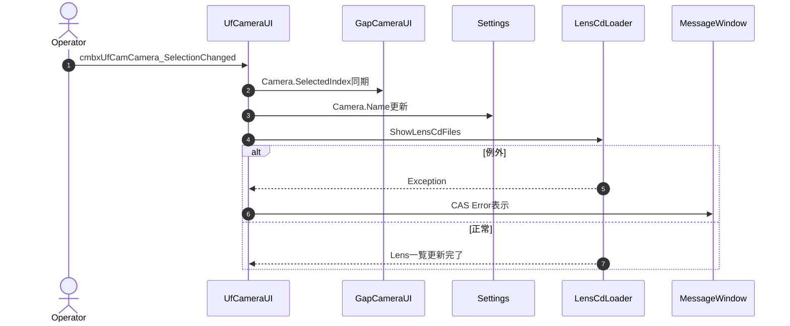
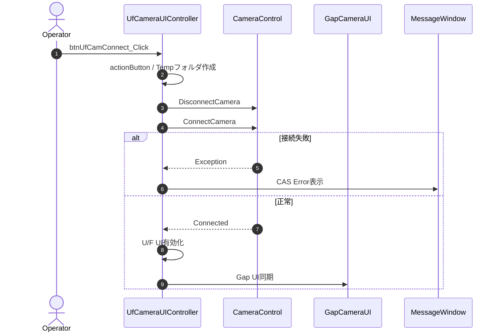
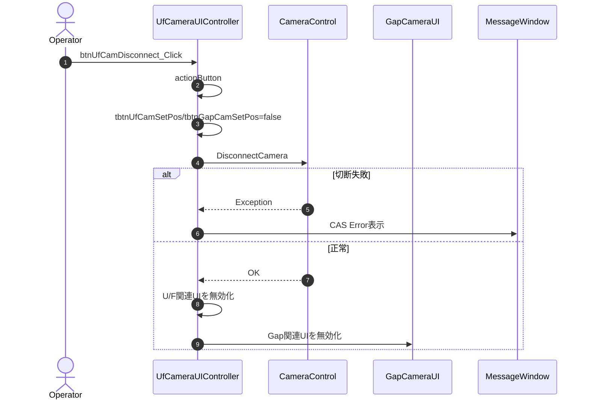
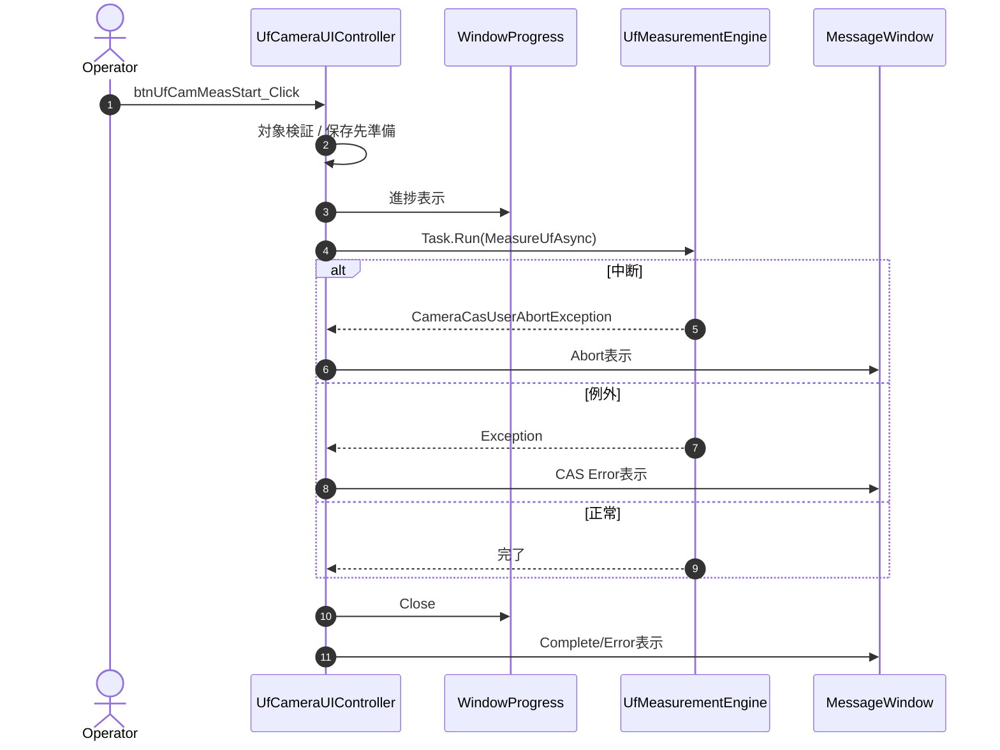
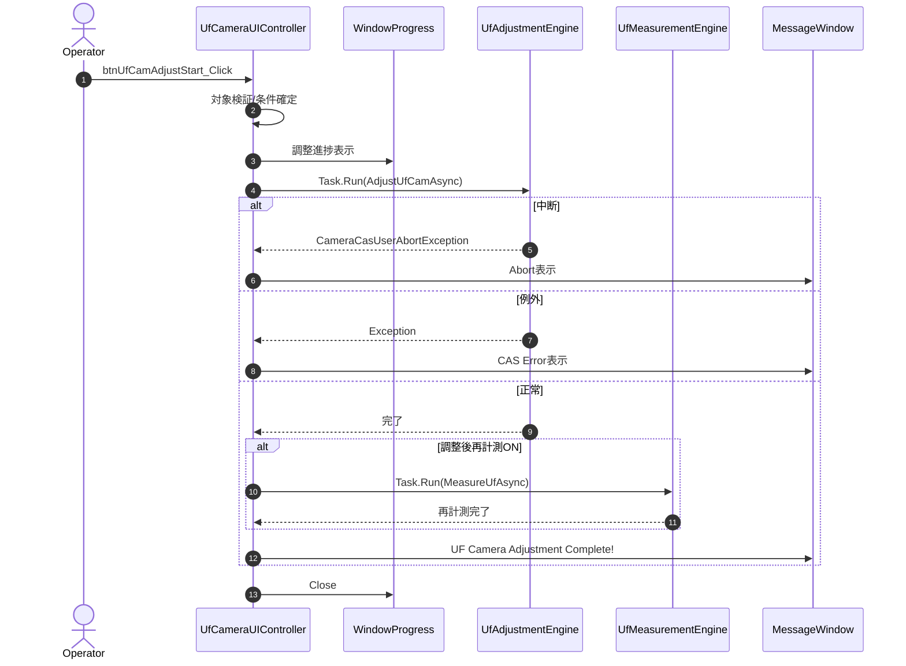
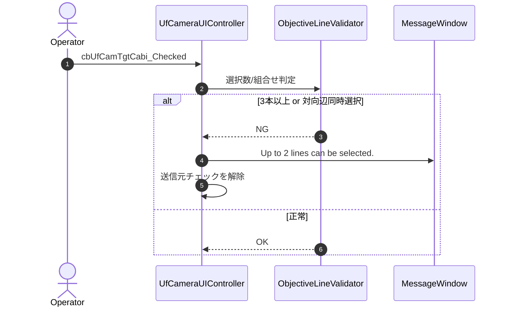
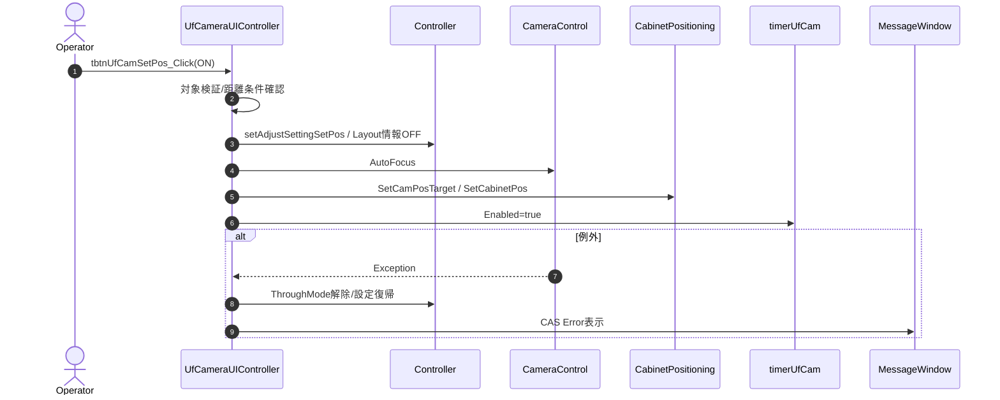
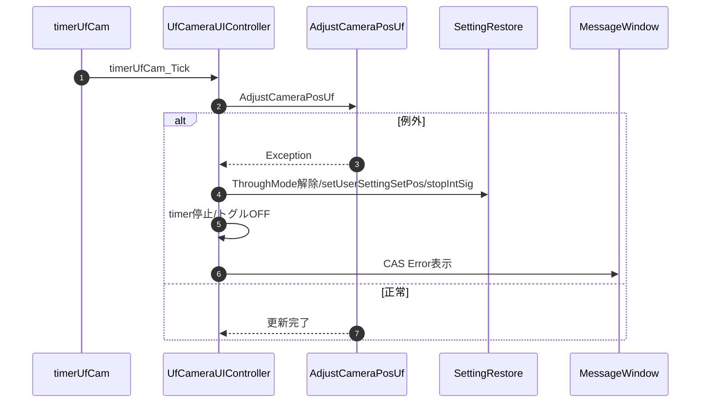
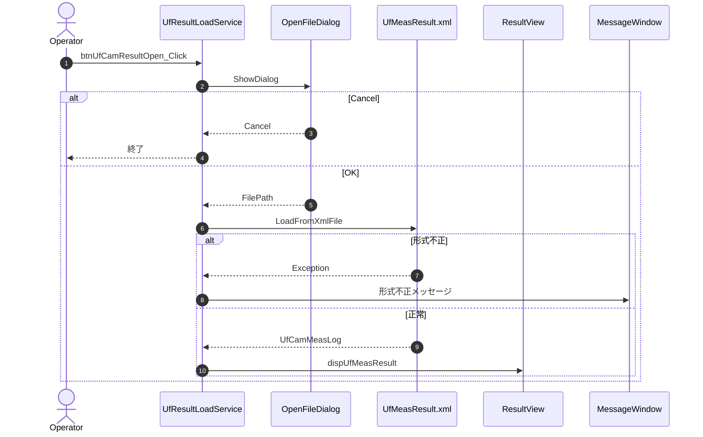
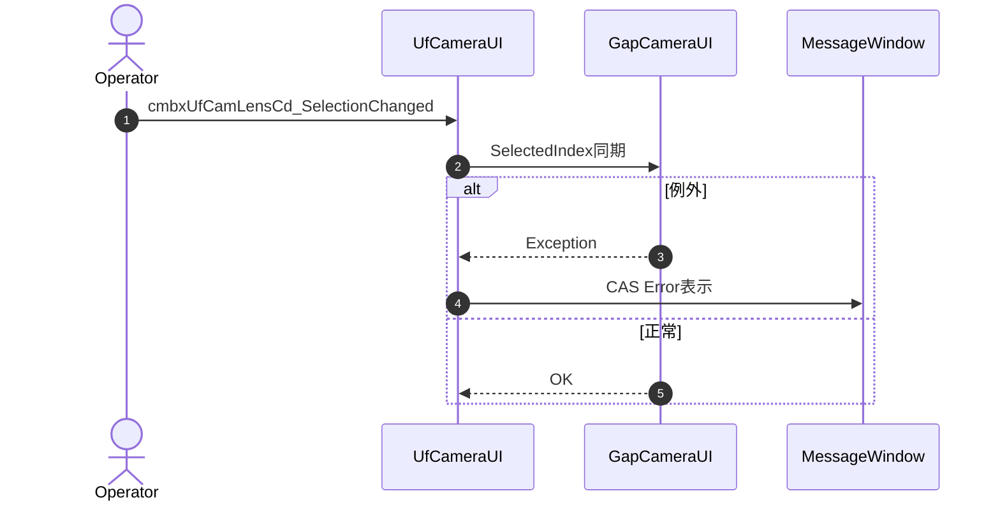

### 8-1. UIイベント・制御メソッド

#### 8-1-1. cmbxUfCamCamera_SelectionChanged

| 項目 | 内容 |
|------|------|
| シグネチャ | private void cmbxUfCamCamera_SelectionChanged(object sender, SelectionChangedEventArgs e) |
| 概要 | U/F側カメラ選択をGap側とSettingsへ同期する |

引数: sender, e
返り値: なし（void）

処理概要（詳細）

| 手順No. | 処理内容 | 詳細 |
|---------|----------|------|
| 1 | Gap側選択同期 | cmbxGapCamCamera.SelectedIndex を U/F選択値へ合わせる。 |
| 2 | 設定反映 | Settings.Ins.Camera.Name へカメラ名を設定する。 |
| 3 | レンズ一覧更新 | ShowLensCdFiles を呼び出して対応レンズCD一覧を更新する。 |

主要呼出し先

| 呼出し先 | 役割 | 同期/非同期 |
|----------|------|--------------|
| `ShowLensCdFiles` | レンズCD一覧を更新する | 同期 |

入力条件・前提条件

| 区分 | 条件 | NG時挙動 |
|------|------|----------|
| 実行前提 | 本節の処理概要に記載した前段処理が完了していること | 例外通知して処理中断 |
| 入力値 | 引数/内部状態が有効範囲であること | 例外通知して処理中断 |

条件分岐仕様

| 条件 | 挙動 |
|------|------|
| `type == UfCamAdjustType.EachModule` | `AdjustUfCamEachModule` を呼び出す。 |
| `type == UfCamAdjustType.Radiator` | `AdjustUfCamRadiator` を呼び出す。 |
| `type == UfCamAdjustType.Cabi_9pt` | `AdjustUfCam9pt` を呼び出す。 |
| 上記以外 | `AdjustUfCamCabinet` を呼び出す。 |
| 方式別調整内 `ExtractFmt` | 各Cabinetループで必ず1回実行し、失敗時は `Failed in ExtractFmt.` 例外を送出して中断する。 |
| 方式別調整内 `Fmt2XYZ*` | `ForCrosstalkCameraUF` 有効時は LEDモデルにより `Fmt2XYZ_Crosstalk` / `Fmt2XYZ` を分岐、無効時は `Fmt2XYZ` 固定。失敗時は `Failed in Fmt2XYZ.` 例外。 |
| 方式別調整内 `ModifyXYZCam*` | `ufCamAdjAlgo == CommonColor` なら `ModifyXYZCam` 系、その他は `ModifyXYZCamCommonLed`。失敗時は `Failed in ModifyXYZCam.` 例外。 |
| 方式別調整内 `Statistics*` | `ForCrosstalkCameraUF` 有効時は `Statistics_CameraUF`、無効時は `Statistics(-1, ...)`。失敗時は `Failed in Statistics.` 例外。 |

例外時仕様

| ケース | 捕捉方法 | 通知 | 後処理 |
|--------|----------|------|--------|
| 同期/設定反映失敗 | Exception | CAS Error表示 | 無処理終了 |

シーケンス図

#### 8-1-2. btnUfCamConnect_Click

| 項目 | 内容 |
|------|------|
| シグネチャ | private void btnUfCamConnect_Click(object sender, RoutedEventArgs e) |
| 概要 | カメラ接続を行い、U/F・Gap両タブの関連UIを有効化する |

引数: sender, e
返り値: なし（void）

処理概要（詳細）

| 手順No. | 処理内容 | 詳細 |
|---------|----------|------|
| 1 | 開始状態遷移 | actionButton で接続開始状態へ遷移する。 |
| 2 | Tempフォルダ作成 | tempPath 未存在時に作成する。 |
| 3 | 接続切替 | 既存接続を DisconnectCamera で解除し、ConnectCamera を実行する。 |
| 4 | U/F UI更新 | 接続済み前提でコンボ固定、切断ボタンと位置合わせグループを有効化する。 |
| 5 | Gap UI同期 | Gap側の接続関連コントロールも同様に有効化する。 |
| 6 | Developerモード分岐 | Developer時のみ計測/調整ボタン群を有効化する。 |

入力条件・前提条件

| 区分 | 条件 | NG時挙動 |
|------|------|----------|
| Tempパス | 作成可能であること | 例外通知して終了 |
| カメラ接続 | ConnectCamera が成功すること | 例外通知して終了 |

主要呼出し先

| 呼出し先 | 役割 | 同期/非同期 |
|----------|------|--------------|
| actionButton | 接続開始時のUI状態遷移 | 同期 |
| DisconnectCamera | 既存接続解除 | 同期 |
| ConnectCamera | カメラ接続 | 同期 |

条件分岐仕様

| 条件 | 挙動 |
|------|------|
| 正常系 | 処理概要（詳細）の手順に従って処理を継続する。 |
| 異常系 | 例外時仕様に従って通知または中断する。 |

例外時仕様

| ケース | 捕捉方法 | 通知 | 後処理 |
|--------|----------|------|--------|
| 接続失敗 | Exception | CAS Error表示 | UIは直前状態のまま |

シーケンス図

#### 8-1-3. btnUfCamDisconnect_Click

| 項目 | 内容 |
|------|------|
| シグネチャ | private void btnUfCamDisconnect_Click(object sender, RoutedEventArgs e) |
| 概要 | カメラ切断と位置合わせ停止を行い、関連UIを無効化する |

引数: sender, e
返り値: なし（void）

処理概要（詳細）

| 手順No. | 処理内容 | 詳細 |
|---------|----------|------|
| 1 | 開始状態遷移 | actionButton を実行する。 |
| 2 | 位置合わせ停止フラグ設定 | tbtnUfCamSetPos と tbtnGapCamSetPos を false にする。 |
| 3 | カメラ切断 | DisconnectCamera を実行する。 |
| 4 | U/F UI無効化 | 接続、計測、調整、位置合わせ関連を無効化する。 |
| 5 | Gap UI無効化 | Gap側の接続、計測、調整、位置合わせ関連を無効化する。 |

入力条件・前提条件

| 区分 | 条件 | NG時挙動 |
|------|------|----------|
| 接続状態 | カメラ接続済み、または切断可能状態であること | 例外通知して処理を中断 |
| 位置合わせ状態 | タイマ停止処理が可能であること | 停止不可時はエラー通知後に強制OFF |

主要呼出し先

| 呼出し先 | 役割 | 同期/非同期 |
|----------|------|--------------|
| DisconnectCamera | カメラ接続解除 | 同期 |
| actionButton | UI状態遷移管理 | 同期 |

条件分岐仕様

| 条件 | 挙動 |
|------|------|
| 正常系 | 処理概要（詳細）の手順に従って処理を継続する。 |
| 異常系 | 例外時仕様に従って通知または中断する。 |

例外時仕様

| ケース | 捕捉方法 | 通知 | 後処理 |
|--------|----------|------|--------|
| 切断失敗 | Exception | CAS Error表示 | UIを安全側(無効)へ寄せる |
| 停止処理失敗 | Exception | CAS Error表示 | tbtnUfCamSetPos=false を維持 |

シーケンス図

#### 8-1-4. btnUfCamMeasStart_Click

| 項目 | 内容 |
|------|------|
| シグネチャ | private async void btnUfCamMeasStart_Click(object sender, RoutedEventArgs e) |
| 概要 | U/F計測処理を開始する |

引数: sender, e
返り値: なし（void）

処理概要（詳細）

| 手順No. | 処理内容 | 詳細 |
|---------|----------|------|
| 1 | 開始処理 | ufCamMeasLog 初期化と actionButton 実行を行う。 |
| 2 | 対象Cabinet検証 | CheckSelectedUnits で選択不備・矩形不成立を検出する。 |
| 3 | 対象Controller初期化 | dicController.Target を対象Cabinetに合わせて更新する。 |
| 4 | Progress初期化 | WindowProgress を Measurement モードで生成し開始メッセージを表示する。 |
| 5 | 位置合わせ停止 | 位置合わせ中ならタイマ停止、トグルOFF、通常設定復帰を実施する。 |
| 6 | 距離条件取得 | dist、wallH、camH をUIから取得し CheckShootingDist を実施する。 |
| 7 | 保存先準備 | measPath を UF_yyyyMMddHHmm 形式で作成し m_CamUfMeasPath へ保持する。 |
| 8 | 非同期計測実行 | Task.Run で MeasureUfAsync を起動する。 |
| 9 | finally処理 | ThroughMode解除、ユーザー設定復帰、不要画像削除、XML保存、ログ世代管理を行う。 |
| 10 | 終了通知 | Measurement UF Complete または Failed in Measurement UF を表示し UIを復帰する。 |

入力条件・前提条件

| 区分 | 条件 | NG時挙動 |
|------|------|----------|
| 対象選択 | 計測対象Cabinetが矩形成立していること | エラー表示後に tcUfCamView=0 へ戻して終了 |
| 距離条件 | dist が取得可能で仕様範囲内であること | 例外通知して終了 |
| 保存先 | measPath 配下へ書込み可能であること | 例外通知して終了 |

主要呼出し先

| 呼出し先 | 役割 | 同期/非同期 |
|----------|------|--------------|
| `actionButton` / `releaseButton` | 開始時と終了時のUI状態を遷移する | 同期 |
| `CheckSelectedUnits` | 対象Cabinetの妥当性を検証する | 同期 |
| `CheckShootingDist` | 撮影距離条件の妥当性を確認する | 同期 |
| `MeasureUfAsync` | U/F計測主処理を実行する | 非同期（`Task.Run`） |
| `SetThroughMode` / `setUserSettingSetPos` | 位置合わせ停止時の画質設定を復帰する | 同期 |
| `DeleteUnwantedImagesMeas` | 不要画像を削除する | 同期 |
| `UfCamMeasLog.SaveToXmlFile` | 計測結果XMLを保存する | 同期 |
| `ManageLogGen` | 測定ログ世代を管理する | 同期 |

条件分岐仕様

| 条件 | 挙動 |
|------|------|
| 正常系 | 処理概要（詳細）の手順に従って処理を継続する。 |
| 異常系 | 例外時仕様に従って通知または中断する。 |

例外時仕様

| ケース | 捕捉方法 | 通知 | 後処理 |
|--------|----------|------|--------|
| 対象検証失敗 | CheckSelectedUnits 例外 | CAS Error表示 | releaseButton 実行 |
| ユーザー中断 | CameraCasUserAbortException | Abort表示 | status=false、Progress操作終了 |
| 計測失敗 | Exception | CAS Error表示 | status=false、UI復帰 |

シーケンス図

#### 8-1-5. btnUfCamAdjustStart_Click

| 項目 | 内容 |
|------|------|
| シグネチャ | private async void btnUfCamAdjustStart_Click(object sender, RoutedEventArgs e) |
| 概要 | U/F調整処理を開始し、必要に応じて調整後再計測を行う |

引数: sender, e
返り値: なし（void）

処理概要（詳細）

| 手順No. | 処理内容 | 詳細 |
|---------|----------|------|
| 1 | 初期化 | ufCamAdjLog 初期化と actionButton 実行を行う。 |
| 2 | 対象Cabinet検証 | CheckSelectedUnits により調整対象を検証する。 |
| 3 | Progress初期化 | Adjustment モードの WindowProgress を表示する。 |
| 4 | 位置合わせ停止 | 実行中の位置合わせを停止し通常設定へ戻す。 |
| 5 | 実行前条件確認 | IsCameraOpened を確認し未接続時は終了する。 |
| 6 | 保存先準備 | logDir を CamUF_yyyyMMddHHmm 形式で作成する。 |
| 7 | 調整条件確定 | 調整方式、視聴点、基準Cabinet、距離条件をUIから取得する。 |
| 8 | 調整主処理起動 | Task.Run で AdjustUfCamAsync を起動する。 |
| 9 | 任意再計測 | cbUfCamMeasResult が true の場合、MeasureUfAsync を再実行する。 |
| 10 | finally処理 | 設定復帰、XML保存、ログ世代管理、メッセージ表示、UI復帰を行う。 |

主要呼出し先

| 呼出し先 | 役割 | 同期/非同期 |
|----------|------|--------------|
| `StoreObjectiveCabinet` | 基準Cabinetを決定する | 同期 |
| `CheckObjectiveCabinet` | 基準Cabinetの妥当性を検証する | 同期 |
| `AdjustUfCamAsync` | U/F調整主処理を実行する | 非同期（`Task.Run`） |
| `MeasureUfAsync` | 調整後の再計測を実行する | 非同期（`Task.Run`） |

入力条件・前提条件

| 区分 | 条件 | NG時挙動 |
|------|------|----------|
| 実行前提 | 本節の処理概要に記載した前段処理が完了していること | 例外通知して処理中断 |
| 入力値 | 引数/内部状態が有効範囲であること | 例外通知して処理中断 |

条件分岐仕様

| 条件 | 挙動 |
|------|------|
| 正常系 | 処理概要（詳細）の手順に従って処理を継続する。 |
| 異常系 | 例外時仕様に従って通知または中断する。 |

例外時仕様

| ケース | 捕捉方法 | 通知 | 後処理 |
|--------|----------|------|--------|
| カメラ未接続 | IsCameraOpened false | CAS Error表示 | tcMain を復帰 |
| 基準Cabinet不正 | CheckObjectiveCabinet 例外 | CAS Error表示 | status=false |
| ユーザー中断 | CameraCasUserAbortException | Abort表示 | status=false |
| 調整失敗 | Exception | CAS Error表示 | status=false、UI復帰 |

シーケンス図

#### 8-1-6. cbUfCamTgtCabi_Checked

| 項目 | 内容 |
|------|------|
| シグネチャ | private void cbUfCamTgtCabi_Checked(object sender, RoutedEventArgs e) |
| 概要 | 基準Line選択数と組合せの妥当性を検証する |

引数: sender, e
返り値: なし（void）

処理概要（詳細）

| 手順No. | 処理内容 | 詳細 |
|---------|----------|------|
| 1 | 選択数集計 | Top/Bottom/Left/Right の選択数を数える。 |
| 2 | 上限判定 | 3本以上選択時はメッセージ表示し当該チェックを戻す。 |
| 3 | 排他判定 | Top+Bottom または Left+Right の同時選択時はメッセージ表示し当該チェックを戻す。 |

入力条件・前提条件

| 区分 | 条件 | NG時挙動 |
|------|------|----------|
| イベント送信元 | CheckBox であること | キャスト失敗時は無処理終了 |
| 選択状態 | 1〜2本選択、かつ対向辺同時選択なし | 警告表示し送信元を false へ戻す |

主要呼出し先

| 呼出し先 | 役割 | 同期/非同期 |
|----------|------|--------------|
| showMessageWindow | 警告メッセージ表示 | 同期 |

条件分岐仕様

| 条件 | 挙動 |
|------|------|
| 正常系 | 処理概要（詳細）の手順に従って処理を継続する。 |
| 異常系 | 例外時仕様に従って通知または中断する。 |

例外時仕様

| ケース | 捕捉方法 | 通知 | 後処理 |
|--------|----------|------|--------|
| 選択規則違反 | 条件分岐 | Up to 2 lines can be selected. | 対象チェックを解除 |

シーケンス図

#### 8-1-7. tbtnUfCamSetPos_Click

| 項目 | 内容 |
|------|------|
| シグネチャ | private void tbtnUfCamSetPos_Click(object sender, RoutedEventArgs e) |
| 概要 | カメラ位置合わせモードの開始/停止を制御する |

引数: sender, e
返り値: なし（void）

処理概要（詳細）

| 手順No. | 処理内容 | 詳細 |
|---------|----------|------|
| 1 | 開始音再生 | playSound を実行しステータス表示を更新する。 |
| 2 | ON時の距離条件確認 | dist、wallH、camH を取得し CheckShootingDist を実施する。 |
| 3 | ON時の対象検証 | CheckSelectedUnits で矩形成立を確認する。 |
| 4 | ON時の設定退避/適用 | getUserSettingSetPos、setAdjustSettingSetPos、Layout情報Off を実施する。 |
| 5 | AFと目標位置設定 | outputIntSigChecker 後に AutoFocus と SetCamPosTarget を実行する。 |
| 6 | Cabinet空間座標設定 | SetCabinetPos を実行する。 |
| 7 | 表示切替/タイマ開始 | tcUfCamView=1 とし timerUfCam.Enabled=true を設定する。 |
| 8 | OFF時処理 | ステータスを Done. に戻す。 |

入力条件・前提条件

| 区分 | 条件 | NG時挙動 |
|------|------|----------|
| 実行前提 | 本節の処理概要に記載した前段処理が完了していること | 例外通知して処理中断 |
| 入力値 | 引数/内部状態が有効範囲であること | 例外通知して処理中断 |

条件分岐仕様

| 条件 | 挙動 |
|------|------|
| 正常系 | 処理概要（詳細）の手順に従って処理を継続する。 |
| 異常系 | 例外時仕様に従って通知または中断する。 |

主要呼出し先

| 呼出し先 | 役割 | 同期/非同期 |
|----------|------|--------------|
| playSound | 開始音再生 | 同期 |
| CheckShootingDist | 距離条件妥当性確認 | 同期 |
| CheckSelectedUnits | 対象Cabinetの矩形成立確認 | 同期 |
| getUserSettingSetPos / setAdjustSettingSetPos | ユーザー設定退避と位置合わせ用設定適用 | 同期 |
| outputIntSigChecker / AutoFocus | 内部信号出力とAF実行 | 同期 |
| SetCamPosTarget / SetCabinetPos | 目標位置算出とCabinet空間座標設定 | 同期 |
| timerUfCam.Enabled 設定 | 位置合わせタイマ開始 | 同期 |

例外時仕様

| ケース | 捕捉方法 | 通知 | 後処理 |
|--------|----------|------|--------|
| 対象検証失敗 | CheckSelectedUnits 例外 | CAS Error表示 | トグルOFF、タブ0へ復帰 |
| 準備処理失敗 | Exception | CAS Error表示 | ThroughMode解除、設定復帰、内部信号OFF |

シーケンス図

#### 8-1-8. timerUfCam_Tick

| 項目 | 内容 |
|------|------|
| シグネチャ | private void timerUfCam_Tick(object sender, EventArgs e) |
| 概要 | 位置合わせ中の周期更新処理を実行する |

引数: sender, e
返り値: なし（void）

処理概要（詳細）

| 手順No. | 処理内容 | 詳細 |
|---------|----------|------|
| 1 | 位置合わせ更新 | AdjustCameraPosUf を呼び出してライブ表示とガイド評価を更新する。 |
| 2 | 例外時の設定復帰 | ThroughMode解除、ユーザー設定復帰、内部信号OFFを実施する。 |
| 3 | 位置合わせ停止 | タイマ停止、トグルOFF、tbtnUfCamSetPos_Click 呼出しで停止遷移を確定する。 |
| 4 | エラー通知 | CAS Errorダイアログを表示する。 |

入力条件・前提条件

| 区分 | 条件 | NG時挙動 |
|------|------|----------|
| 位置合わせ状態 | tbtnUfCamSetPos=true かつ timerUfCam.Enabled=true | 条件不成立時は更新スキップ |
| カメラ状態 | IsCameraOpened=true が維持されること | 例外で停止遷移 |

主要呼出し先

| 呼出し先 | 役割 | 同期/非同期 |
|----------|------|--------------|
| AdjustCameraPosUf | ライブ画像取得と位置合わせ評価 | 同期 |
| SetThroughMode | Through Mode解除 | 同期 |
| setUserSettingSetPos | 位置合わせ用退避設定の復元 | 同期 |
| stopIntSig | 内部信号停止 | 同期 |

条件分岐仕様

| 条件 | 挙動 |
|------|------|
| 正常系 | 処理概要（詳細）の手順に従って処理を継続する。 |
| 異常系 | 例外時仕様に従って通知または中断する。 |

例外時仕様

| ケース | 捕捉方法 | 通知 | 後処理 |
|--------|----------|------|--------|
| ライブ更新失敗 | Exception | CAS Error表示 | タイマ停止、トグルOFF、設定復帰 |

シーケンス図

#### 8-1-9. btnUfCamResultOpen_Click

| 項目 | 内容 |
|------|------|
| シグネチャ | private void btnUfCamResultOpen_Click(object sender, RoutedEventArgs e) |
| 概要 | 保存済みU/F計測結果XMLを読込み、結果表示へ再展開する |

引数: sender, e
返り値: なし（void）

処理概要（詳細）

| 手順No. | 処理内容 | 詳細 |
|---------|----------|------|
| 1 | OpenFileDialog 初期化 | 測定フォルダを初期ディレクトリに設定する。 |
| 2 | XML選択 | OK時のみ後続処理を実行する。 |
| 3 | XML読込 | UfCamMeasLog.LoadFromXmlFile を実行する。 |
| 4 | 結果表示 | dispUfMeasResult を呼び出す。 |
| 5 | 例外時通知 | 形式不正メッセージを表示する。 |

入力条件・前提条件

| 区分 | 条件 | NG時挙動 |
|------|------|----------|
| ファイル選択 | XMLファイルが選択されること | Cancel時は無処理終了 |
| ファイル形式 | UfCamMeasLog 形式と整合すること | 形式不正メッセージ表示 |

主要呼出し先

| 呼出し先 | 役割 | 同期/非同期 |
|----------|------|--------------|
| `OpenFileDialog` | 結果XMLパスを選択する | 同期 |
| `UfCamMeasLog.LoadFromXmlFile` | 計測結果を読み込む | 同期 |
| `dispUfMeasResult` | 計測結果を再表示する | 同期 |

条件分岐仕様

| 条件 | 挙動 |
|------|------|
| 正常系 | 処理概要（詳細）の手順に従って処理を継続する。 |
| 異常系 | 例外時仕様に従って通知または中断する。 |

例外時仕様

| ケース | 捕捉方法 | 通知 | 後処理 |
|--------|----------|------|--------|
| XML形式不正 | Exception | The format of the opened file is incorrect. | 画面状態を維持 |
| 読込失敗 | Exception | CAS Error表示 | 処理中断 |

シーケンス図

#### 8-1-10. cmbxUfCamLensCd_SelectionChanged

| 項目 | 内容 |
|------|------|
| シグネチャ | private void cmbxUfCamLensCd_SelectionChanged(object sender, SelectionChangedEventArgs e) |
| 概要 | U/F側レンズCD選択をGap側へ同期する |

引数: sender, e
返り値: なし（void）

処理概要（詳細）

| 手順No. | 処理内容 | 詳細 |
|---------|----------|------|
| 1 | 選択状態取得 | cmbxUfCamLensCd.SelectedIndex を取得する。 |
| 2 | Gap側同期 | cmbxGapCamLensCd.SelectedIndex へ同値を設定する。 |
| 3 | 終了 | 同期完了後に処理を終了する。 |

入力条件・前提条件

| 区分 | 条件 | NG時挙動 |
|------|------|----------|
| レンズ一覧 | U/FとGapのレンズ候補数が整合していること | 例外通知して終了 |
| 選択値 | SelectedIndex が有効範囲であること | 例外通知して終了 |

主要呼出し先

| 呼出し先 | 役割 | 同期/非同期 |
|----------|------|--------------|
| cmbxGapCamLensCd | Gap側レンズ選択UI | 同期 |

条件分岐仕様

| 条件 | 挙動 |
|------|------|
| 正常系 | 処理概要（詳細）の手順に従って処理を継続する。 |
| 異常系 | 例外時仕様に従って通知または中断する。 |

例外時仕様

| ケース | 捕捉方法 | 通知 | 後処理 |
|--------|----------|------|--------|
| 選択同期失敗 | Exception | CAS Error表示 | 無処理終了 |

シーケンス図

