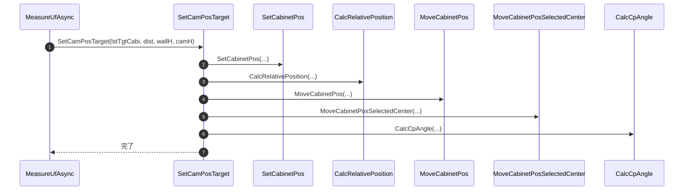
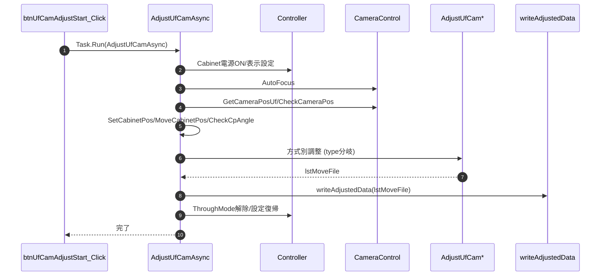
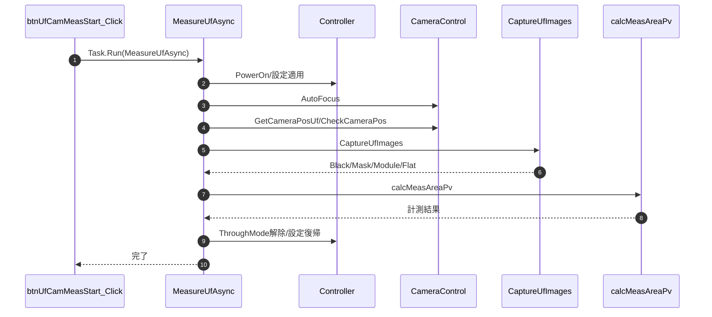
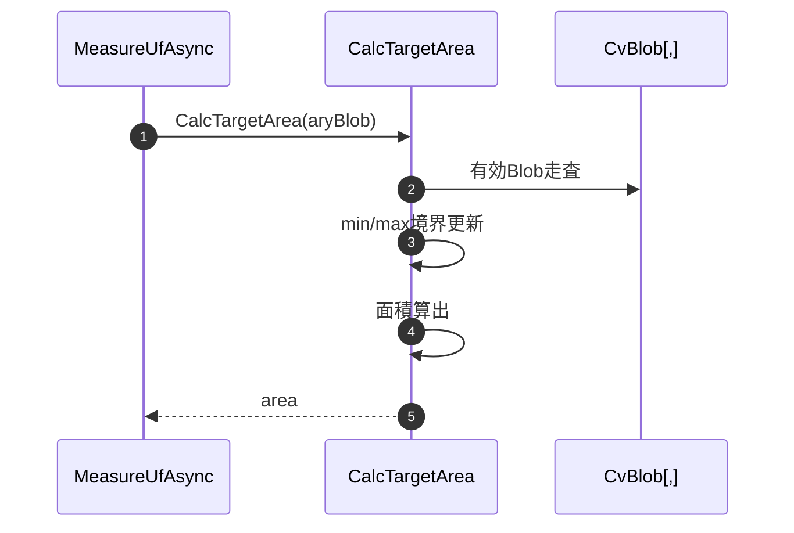
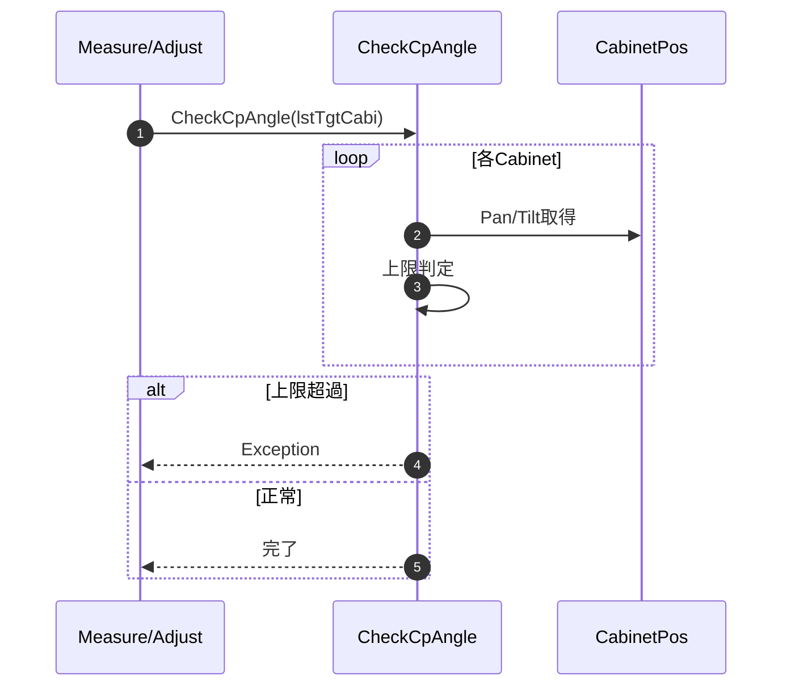
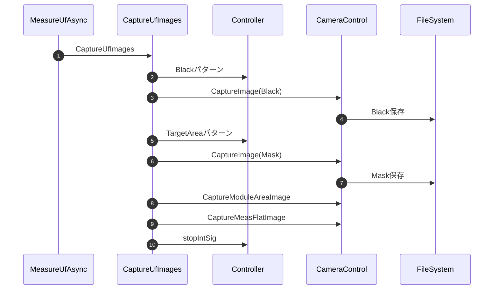
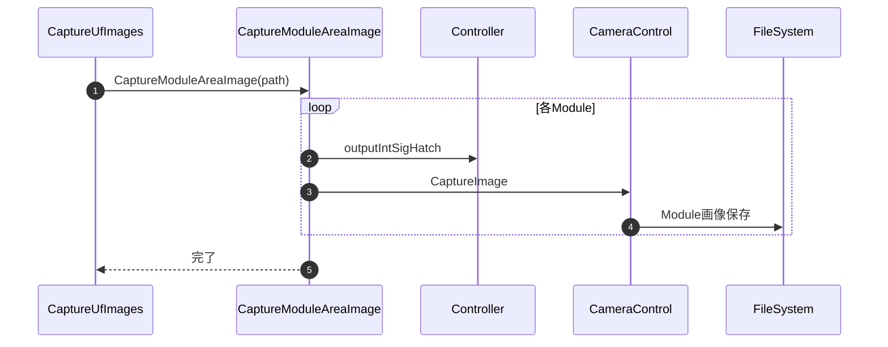
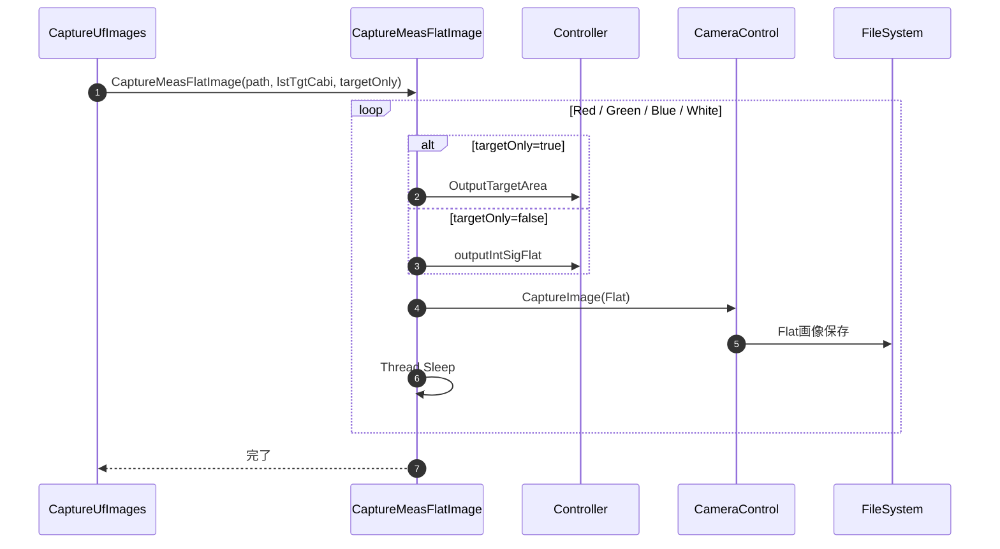

#### 8-2. 業務処理メソッド

#### 8-2-1. SetCamPosTarget

| 項目 | 内容 |
|------|------|
| シグネチャ | private void SetCamPosTarget(List<UnitInfo> lstTgtCabi, double dist, double wallH, double camH) |
| 概要 | 計測・調整前に、指定されたCabinetリストに対してカメラの目標位置・姿勢を再設定する。 |

| 引数 | 型 | 説明 |
|-------|----|------|
| lstTgtCabi | List<UnitInfo> | 目標位置を設定するCabinetリスト |
| dist | double | 撮影距離[mm] |
| wallH | double | 壁高さ[mm] |
| camH | double | カメラ高さ[mm] |

| 返り値 | 型 | 説明 |
|--------|----|------|
| なし | void | － |

| 手順No. | 処理内容 | 詳細 |
|---------|----------|------|
| 1 | Cabinet座標再計算 | SetCabinetPosで各Cabinetの3D座標を再計算する |
| 2 | 相対姿勢補正 | CalcRelativePositionでpan/tilt/x/yを算出し、MoveCabinetPosで姿勢補正を適用 |
| 3 | 姿勢・中心補正 | MoveCabinetPosSelectedCenterで中心を光学中心に合わせる |
| 4 | 角度再計算 | CalcCpAngleで各Cabinetの補正点角度を再計算する |

| 区分 | 条件 | NG時挙動 |
|------|------|----------|
| 実行前提 | lstTgtCabi, dist, wallH, camHが有効値であること | 例外通知して処理中断 |
| Cabinet情報 | CabinetPosが初期化済みであること | Null参照/配列参照例外で中断 |

| 呼出し先 | 役割 | 同期/非同期 |
|----------|------|--------------|
| SetCabinetPos | Cabinet座標再計算 | 同期 |
| CalcRelativePosition | 相対姿勢補正値算出 | 同期 |
| MoveCabinetPos | 姿勢補正適用 | 同期 |
| MoveCabinetPosSelectedCenter | 中心補正 | 同期 |
| CalcCpAngle | 補正点角度再計算 | 同期 |

| 条件 | 挙動 |
|------|------|
| 正常系 | 全手順を順次実行し、Cabinetリストに目標位置・姿勢を反映する |
| 異常系 | 例外時は呼出元へ通知し、以降の処理を中断する |

| ケース | 捕捉方法 | 通知/伝播 | 後処理 |
|--------|----------|-----------|--------|
| Cabinet情報不正 | Null参照/範囲外例外 | 呼出元へ通知 | 安全停止 |
| 計算失敗 | 下位例外 | 呼出元へ通知 | 設定復帰 |

#### 8-2-2. AdjustUfCamAsync

| 項目 | 内容 |
|------|------|
| シグネチャ | private void AdjustUfCamAsync(string logDir, List<UnitInfo> lstTgtCabi, UfCamAdjustType type, List<UnitInfo> lstObjCabi, ObjectiveLine objEdge, ViewPoint vp, double dist, double wallH, double camH) |
| 概要 | U/F調整のエントリーポイント。前処理（設定・AF・姿勢確認）から方式別補正、書込み、復帰処理までを直列実行する。 |

引数

| No. | 引数名 | 型 | 必須 | 説明 |
|-----|--------|----|------|------|
| 1 | logDir | string | Y | UFログ保存フォルダ |
| 2 | lstTgtCabi | List<UnitInfo> | Y | 調整対象Cabinet |
| 3 | type | UfCamAdjustType | Y | 調整方式（Cabinet / Cabi_9pt / Radiator / EachModule） |
| 4 | lstObjCabi | List<UnitInfo> | Y | 基準Cabinet |
| 5 | objEdge | ObjectiveLine | N | Line基準指定（Line以外はnull） |
| 6 | vp | ViewPoint | Y | 視聴点条件 |
| 7 | dist | double | Y | 撮影距離 |
| 8 | wallH | double | Y | Wall下端高さ |
| 9 | camH | double | Y | カメラ中心高さ |

返り値: なし（void）

方式別ステップ数算出

| 条件 | steps |
|------|-------|
| Cabinet / Radiator | 27 |
| EachModule | `19 + moduleCount * 2` |
| Cabi_9pt | 37 |

全体ステップ数は `winProgress.SetWholeSteps(9 + steps)` で設定する。

処理概要（詳細）

| 手順No. | 処理内容 | 詳細 |
|---------|----------|------|
| 1 | 進捗初期化 | `type` からステップ数を算出し、進捗バー全体ステップを設定する。 |
| 2 | 前処理 | `m_MeasureLevel=UF_20pc`、OpenCV DLL確認、Checkerパターン表示、Cabinet電源ON、`SetCamPosTarget()`、`m_MakeUFData` 初期化を実行する。 |
| 3 | ユーザー設定退避 | `getUserSetting(out lstUserSetting)` を実行し、取得成功時のみ `m_lstUserSetting` を更新する。 |
| 4 | 調整設定適用 | `setAdjustSetting()`（`NO_CAP` 時はスキップ）と `CmdDispUnitAddrOff` 送信で調整前提へ切替える。 |
| 5 | AF実行 | 20IREパターン表示後に `AutoFocus` を実行し、進捗残時間を更新する。 |
| 6 | 開始姿勢確認 | `GetCameraPosUf` と `CheckCameraPos` で開始姿勢を検証する。取得失敗・不適正時は例外送出。 |
| 7 | 小面積時リセット | `CalcTargetArea` がセンサー面積10%以下なら `startCamPos` をゼロ化し、ずれ補正を無効化する。 |
| 8 | 座標系再構築 | `SetCabinetPos(lstTgtCabi, dist, wallH, camH)` と `MoveCabinetPos(startCamPos...)` で設置ズレを反映し、`CheckCpAngle` を実行する。 |
| 9 | 方式別調整 | `type` に応じて `AdjustUfCamEachModule` / `AdjustUfCamRadiator` / `AdjustUfCam9pt` / `AdjustUfCamCabinet` を呼ぶ。 |
| 10 | 書込み反映 | `writeAdjustedData(lstMoveFile)` を実行し、失敗時は全Controllerへ `CmdFtpOff` を試行する。 |
| 11 | 後処理（計測系） | Cabinet再電源ON、終了姿勢取得、ログ用再座標化、内部信号停止、`SetThroughMode(false)`、`setUserSetting(lstUserSetting)` を実行する。 |
| 12 | 終了処理 | Normalモード時は不要画像削除し、`outputFlatPattern` でWhite表示して終了する。 |

内部ログ更新

| 更新項目 | 内容 |
|----------|------|
| `ufCamAdjLog.StartCamPos` | 開始姿勢（小面積時はゼロ姿勢） |
| `ufCamAdjLog.EndCamPos` | 終了姿勢 |
| `m_CamMeasPath` | AF/撮影作業用に `tempPath` を設定 |

主要呼出し先

| 呼出し先 | 役割 | 同期/非同期 |
|----------|------|--------------|
| CheckOpenCvSharpDll | 環境確認 | 同期 |
| outputIntSigChecker | パターン表示の事前初期化 | 同期 |
| sendSdcpCommand | Cabinet電源投入と表示制御 | 同期 |
| SetCamPosTarget | カメラ目標位置の再設定 | 同期 |
| getUserSetting / setAdjustSetting | ユーザー設定退避と調整用設定適用 | 同期 |
| AutoFocus | AF実行 | 同期 |
| GetCameraPosUf / CheckCameraPos | 開始・終了カメラ位置取得と妥当性確認 | 同期 |
| CalcTargetArea | 撮影エリア占有率算出 | 同期 |
| SetCabinetPos / MoveCabinetPos | Cabinet空間座標設定とズレ反映 | 同期 |
| CheckCpAngle | 調整点角度上限確認 | 同期 |
| `AdjustUfCamCabinet` / `AdjustUfCam9pt` / `AdjustUfCamRadiator` / `AdjustUfCamEachModule` | 方式別の調整処理を実行する | 同期 |
| `writeAdjustedData` | 調整済みデータを反映する | 同期 |
| `stopIntSig` | 内部信号を停止する | 同期 |
| `SetThroughMode` / `setUserSetting` | 通常設定を復帰する | 同期 |
| `DeleteUnwantedImagesAdj` | 不要画像を削除する | 同期 |
| `outputFlatPattern` | White画像を表示する | 同期 |

#### 8-2-3. MeasureUfAsync

| 項目 | 内容 |
|------|------|
| シグネチャ | private void MeasureUfAsync(List<UnitInfo> lstTgtCabi, string measPath, ViewPoint vp, double dist, double wallH, double camH, bool targetOnly = false) |
| 概要 | U/F計測の主処理を実行し、撮影、解析、結果表示までを一括制御する |

| 手順No. | 処理内容 | 詳細 |
|---------|----------|------|
| 1 | Progress初期化 | 全体ステップ数、残り時間を初期化する。 |
| 2 | 環境確認 | OpenCvSharp DLL の存在を確認する。 |
| 3 | 前処理 | Cabinet Power On、SetCamPosTarget、ユーザー設定退避、Adjust設定適用を行う。 |
| 4 | AF実行 | SetPosSetting で AutoFocus を行う。 |
| 5 | カメラ位置取得 | GetCameraPosUf と CheckCameraPos により開始位置を確定する。 |
| 6 | Cabinet座標補正 | SetCabinetPos と MoveCabinetPos を行い、CheckCpAngle で角度上限を確認する。 |
| 7 | 画像取得 | CaptureUfImages を呼び出し計測画像一式を保存する。 |
| 8 | 解析 | calcMeasAreaPv で Cabinet/Module の測定値を計算する。 |
| 9 | 後処理 | 終了カメラ位置保存、内部信号停止、通常設定復帰、結果表示を行う。 |

主要呼出し先

| 呼出し先 | 役割 | 同期/非同期 |
|----------|------|--------------|
| CheckOpenCvSharpDll | 解析環境確認 | 同期 |
| outputIntSigChecker | パターン表示の事前初期化 | 同期 |
| sendSdcpCommand | Cabinet電源投入と表示制御 | 同期 |
| SetCamPosTarget | カメラ目標位置の再設定 | 同期 |
| getUserSetting / setAdjustSetting | ユーザー設定退避と調整用設定適用 | 同期 |
| AutoFocus | AF実行 | 同期 |
| GetCameraPosUf / CheckCameraPos | 開始時カメラ位置取得と妥当性確認 | 同期 |
| CalcTargetArea | 撮影エリア占有率算出 | 同期 |
| SetCabinetPos / MoveCabinetPos | Cabinet空間座標設定とズレ反映 | 同期 |
| CheckCpAngle | 調整点角度上限確認 | 同期 |
| CaptureUfImages | 計測画像を取得する | 同期 |
| calcMeasAreaPv | 測定領域を解析する | 同期 |
| stopIntSig | 内部信号を停止する | 同期 |
| SetThroughMode / setUserSetting | 通常設定を復帰する | 同期 |
| dispUfMeasResult | 計測結果を表示する | 同期 |

入力条件・前提条件

| 区分 | 条件 | NG時挙動 |
|------|------|----------|
| 実行前提 | 本節の処理概要に記載した前段処理が完了していること | 例外通知して処理中断 |
| 入力値 | 引数/内部状態が有効範囲であること | 例外通知して処理中断 |

条件分岐仕様

| 条件 | 挙動 |
|------|------|
| 正常系 | 処理概要（詳細）の手順に従って処理を継続する。 |
| 異常系 | 例外時仕様に従って通知または中断する。 |

例外時仕様

| ケース | 捕捉方法 | 通知/伝播 | 後処理 |
|--------|----------|-----------|--------|
| カメラ位置取得失敗 | false戻り/Exception | 呼出元へ送出 | 処理中断 |
| カメラ位置不適切 | CheckCameraPos false | 呼出元へ送出 | 再位置合わせ要求 |
| 角度超過 | CheckCpAngle 例外 | 呼出元へ送出 | 距離条件見直し要求 |

---

#### 8-2-4. CalcTargetArea

| 項目 | 内容 |
|------|------|
| シグネチャ | private double CalcTargetArea(CvBlob[,] aryBlob) |
| 概要 | 対象Cabinet群のBlob外接領域から画像占有面積を算出する |

| 引数 | 型 | 説明 |
|-------|----|------|
| aryBlob | CvBlob[,] | 対象Blob配列 |

| 返り値 | 型 | 説明 |
|--------|----|------|
| area | double | 占有面積 |

| 手順No. | 処理内容 | 詳細 |
|---------|----------|------|
| 1 | 初期化 | minX/minY を最大値、maxX/maxY を最小値で初期化する。 |
| 2 | Blob走査 | aryBlob 内の有効Blobを走査し外接矩形の境界を更新する。 |
| 3 | 面積算出 | (maxX-minX)×(maxY-minY) で対象面積を算出する。 |
| 4 | 戻り値返却 | 面積を double で返却する。 |

| 区分 | 条件 | NG時挙動 |
|------|------|----------|
| 実行前提 | 本節の処理概要に記載した前段処理が完了していること | 例外通知して処理中断 |
| 入力値 | 引数/内部状態が有効範囲であること | 例外通知して処理中断 |

| 呼出し先 | 役割 | 同期/非同期 |
|----------|------|--------------|
| CvBlob[,] 要素参照 | Blobの有効判定と境界値取得 | 同期 |
| Math.Min / Math.Max | 外接矩形境界の更新 | 同期 |
| 基本算術演算 | 面積計算 (maxX-minX)*(maxY-minY) | 同期 |

| 条件 | 挙動 |
|------|------|
| 正常系 | 処理概要（詳細）の手順に従って処理を継続する。 |
| 異常系 | 有効Blobが存在しない場合は 0 を返す。 |

---

#### 8-2-5. CheckCpAngle

| 項目 | 内容 |
|------|------|
| シグネチャ | private void CheckCpAngle(List<UnitInfo> lstTgtCabi) |
| 概要 | 調整点の Pan/Tilt が上限を超えていないか確認する |

| 引数 | 型 | 説明 |
|-------|----|------|
| lstTgtCabi | List<UnitInfo> | 対象Cabinetリスト |

| 返り値 | 型 | 説明 |
|--------|----|------|
| なし | void | － |

| 手順No. | 処理内容 | 詳細 |
|---------|----------|------|
| 1 | 対象走査 | lstTgtCabi を順次走査する。 |
| 2 | 角度取得 | 各Cabinetの CabinetPos から Pan/Tilt を取得する。 |
| 3 | 上限判定 | |Pan| > PanLimit または |Tilt| > TiltLimit を判定する。 |
| 4 | エラー送出 | 上限超過時は距離条件見直しを促す Exception を送出する。 |

| 区分 | 条件 | NG時挙動 |
|------|------|----------|
| 実行前提 | 本節の処理概要に記載した前段処理が完了していること | 例外通知して処理中断 |
| 入力値 | 引数/内部状態が有効範囲であること | 例外通知して処理中断 |

| 呼出し先 | 役割 | 同期/非同期 |
|----------|------|--------------|
| List<UnitInfo> 走査 | 対象Cabinet反復処理 | 同期 |
| CabinetPos 参照 | 各Cabinetの Pan/Tilt 取得 | 同期 |
| Math.Abs | 角度絶対値を算出し上限比較 | 同期 |
| Exception 送出 | Pan/Tilt 上限超過時に異常通知 | 同期 |

| 条件 | 挙動 |
|------|------|
| 正常系 | 処理概要（詳細）の手順に従って処理を継続する。 |
| 異常系 | PanLimit または TiltLimit 超過時に Exception を送出する。 |

---

#### 8-2-6. CaptureUfImages

| 項目 | 内容 |
|------|------|
| シグネチャ | private void CaptureUfImages(List<UnitInfo> lstTgtCabi, string measPath, bool targetOnly) |
| 概要 | Black、Mask、Module、Flat の計測画像一式を取得する |

| 引数 | 型 | 説明 |
|-------|----|------|
| lstTgtCabi | List<UnitInfo> | 計測対象Cabinetリスト |
| measPath | string | 計測データ保存先パス |
| targetOnly | bool | 対象Cabinetのみ計測するか |

| 返り値 | 型 | 説明 |
|--------|----|------|
| なし | void | － |

| 手順No. | 処理内容 | 詳細 |
|---------|----------|------|
| 1 | Black画像取得 | 内部信号停止状態で Black を撮影する。 |
| 2 | Mask画像取得 | OutputTargetArea 実行後にエリア画像を撮影する。 |
| 3 | Module画像取得 | CaptureModuleAreaImage を呼び出す。 |
| 4 | Flat画像取得 | CaptureMeasFlatImage を呼び出す。 |
| 5 | 内部信号停止 | stopIntSig を実行する。 |

| 区分 | 条件 | NG時挙動 |
|------|------|----------|
| 実行前提 | 本節の処理概要に記載した前段処理が完了していること | 例外通知して処理中断 |
| 入力値 | 引数/内部状態が有効範囲であること | 例外通知して処理中断 |

| 呼出し先 | 役割 | 同期/非同期 |
|----------|------|--------------|
| CaptureImage | Black/Mask 画像の撮影実行 | 同期 |
| OutputTargetArea | Mask撮影用の対象エリア表示 | 同期 |
| CaptureModuleAreaImage | Module画像群の取得 | 同期 |
| CaptureMeasFlatImage | Flat画像群の取得 | 同期 |
| stopIntSig | 内部信号停止 | 同期 |

| 条件 | 挙動 |
|------|------|
| 正常系 | 処理概要（詳細）の手順に従って処理を継続する。 |
| 異常系 | 例外時仕様に従って通知または中断する。 |

---

#### 8-2-7. CaptureModuleAreaImage

| 項目 | 内容 |
|------|------|
| シグネチャ | private void CaptureModuleAreaImage(string path) |
| 概要 | Module単位の測定エリア画像を順次取得する |

| 引数 | 型 | 説明 |
|-------|----|------|
| path | string | 画像保存先パス |

| 返り値 | 型 | 説明 |
|--------|----|------|
| なし | void | － |

| 手順No. | 処理内容 | 詳細 |
|---------|----------|------|
| 1 | Moduleループ | moduleCount に従い開始座標を算出する。 |
| 2 | パターン出力 | outputIntSigHatch で対象Moduleを強調表示する。 |
| 3 | 撮影 | CaptureImage で Module画像を保存する。 |

| 区分 | 条件 | NG時挙動 |
|------|------|----------|
| 実行前提 | 本節の処理概要に記載した前段処理が完了していること | 例外通知して処理中断 |
| 入力値 | 引数/内部状態が有効範囲であること | 例外通知して処理中断 |

| 呼出し先 | 役割 | 同期/非同期 |
|----------|------|--------------|
| moduleCount / ループ制御 | Module単位の反復処理 | 同期 |
| outputIntSigHatch | 対象Module強調パターン出力 | 同期 |
| CaptureImage | Module画像の撮影実行 | 同期 |
| ファイル保存処理 | 撮影結果の永続化 | 同期 |

| 条件 | 挙動 |
|------|------|
| 正常系 | 処理概要（詳細）の手順に従って処理を継続する。 |
| 異常系 | 例外時仕様に従って通知または中断する。 |

---

#### 8-2-8. CaptureMeasFlatImage

| 項目 | 内容 |
|------|------|
| シグネチャ | private void CaptureMeasFlatImage(string path, List<UnitInfo> lstTgtCabi, bool targetOnly = false) |
| 概要 | Flat画像群を取得し、U/F測定の平均値計算入力を準備する |

| 引数 | 型 | 説明 |
|-------|----|------|
| path | string | 画像保存先パス |
| lstTgtCabi | List<UnitInfo> | 計測対象Cabinetリスト |
| targetOnly | bool | 対象Cabinetのみ計測するか |

| 返り値 | 型 | 説明 |
|--------|----|------|
| なし | void | － |

| 手順No. | 処理内容 | 詳細 |
|---------|----------|------|
| 1 | Flat表示準備 | 各色ごとに outputIntSigFlat または OutputTargetArea を呼び出し、Flat表示状態に遷移する。 |
| 2 | 撮影範囲決定 | targetOnly=true の場合は対象Cabinetのみ、それ以外は全Cabinetを対象にする。 |
| 3 | Flat撮影 | Red、Green、Blue、White の順に CaptureImage を実行し Flat画像を保存する。 |
| 4 | 色切替待機 | 各色撮影の間で Thread.Sleep により表示更新待ちを入れる。 |

| 区分 | 条件 | NG時挙動 |
|------|------|----------|
| 保存先 | path が書込み可能であること | 例外通知して中断 |
| 対象Cabinet | lstTgtCabi が空でないこと | 例外通知して中断 |

| 呼出し先 | 役割 | 同期/非同期 |
|----------|------|--------------|
| outputIntSigFlat | 全Cabinet対象のFlat表示 | 同期 |
| OutputTargetArea | targetOnly=true 時の対象Cabinet限定表示 | 同期 |
| CaptureImage | Flat画像の撮影実行 | 同期 |
| Thread.Sleep | 各色撮影間の待機 | 同期 |

| 条件 | 挙動 |
|------|------|
| 正常系 | 処理概要（詳細）の手順に従って処理を継続する。 |
| 異常系 | 撮影失敗時は Exception を送出し、呼出元で安全復帰する。 |

