### 8-4. 補助計算・補正演算メソッド

---

本章の全メソッドは、8-1～8-3と同じ詳細・標準化フォーマットで整理済みです。
各メソッドのシグネチャ・引数・返り値・詳細処理・前提条件・主要呼出し先・分岐・例外・シーケンス図を統一粒度で記載しています。

---

#### 8-4-0. 撮影関連メソッド補足（表示パターン/カメラ設定）

本章の `AdjustUfCam*` 系は、補正点準備で `GetCpCabinet` / `GetCp9pt` / `GetCpRadiator` / `GetCpEachModule` / `GetFlatImages` を呼び出し、そこで撮影を実施する。

撮影時の表示パターン

| 呼出しメソッド | 主な表示パターン | 用途 |
|------|------|------|
| `GetCpCabinet` / `GetCp9pt` / `GetCpEachModule` | Hatch/HatchInv 系（`outputIntSigHatch`、`outputIntSigHatchInv`） | 補正点抽出用の領域強調 |
| `GetFlatImages` | Flat/Window/FlatGap 系（`outputIntSigFlat`、`outputIntSigWindow`、`outputIntSigFlatGap`） | 補正点の測定値取得 |

撮影時のカメラ設定

| 区分 | 設定内容 | 反映方法 |
|------|------|------|
| 補正点抽出系撮影 | `Settings.Ins.Uniformity.Camera.TrimAreaSetting` を基準とした `ShootCondition` | `SetCameraSettings` / `CaptureImage` で CameraControl へ反映 |
| Flat画像撮影 | `Settings.Ins.Uniformity.Camera.MeasureAreaSetting`（運用設定）に基づく `ShootCondition` | `SetCameraSettings` / `CaptureImage` で CameraControl へ反映 |

※ 具体的な引数・分岐は 8-5-4（`GetCp*` / `GetFlatImages`）および 8-5-3（`CaptureImage` / `outputIntSig*`）を正とする。

#### 8-4-1. AdjustUfCamCabinet

| 項目 | 内容 |
|------|------|
| シグネチャ | private void AdjustUfCamCabinet(List<UnitInfo> lstTgtCabi, List<UnitInfo> lstObjCabi, ObjectiveLine objEdge, ViewPoint vp, string logDir, out List<MoveFile> lstMoveFile) |
| 概要 | Cabinetモードで補正点抽出と hc.bin 再生成を行う。Cabinet単位での標準的な補正・書込み処理。 |

引数

| No. | 引数名 | 型 | 必須 | 説明 |
|-----|--------|----|------|------|
| 1 | lstTgtCabi | List<UnitInfo> | Y | 調整対象Cabinet |
| 2 | lstObjCabi | List<UnitInfo> | Y | 基準Cabinet |
| 3 | objEdge | ObjectiveLine | N | 基準Line指定 |
| 4 | vp | ViewPoint | Y | 視聴点条件 |
| 5 | logDir | string | Y | UFログ保存フォルダ |
| 6 | lstMoveFile(out) | List<MoveFile> | Y | 書込み対象の adjusted hc.bin 一覧 |

返り値: なし（void）

処理概要（詳細）

| 手順No. | 処理内容 | 詳細 |
|---------|----------|------|
| 1 | 初期化 | `dispatcher` を取得し、`lstMoveFile` を初期化する。 |
| 2 | 補正点準備 | `NO_PROC` 時は一時XMLを読込む。通常時は `GetCpCabinet` と `GetFlatImages` を実行し、残時間を `dispatcher.Invoke` で再計算する。 |
| 3 | 対象Unit確定 | `ufCamAdjLog.lstUnitCpInfo` から対象Unitを抽出し、0件なら例外送出する。 |
| 4 | 元データ確認 | `checkDataFile` で対象Unitの hc.bin バックアップ存在を確認する。 |
| 5 | Unitループ処理 | `ExtractFmt -> Fmt2XYZ系 -> CalcReferenceValue -> ModifyXYZCam(Cabinet)系 -> Statistics系 -> OverWritePixelData` をUnitごとに実行する。 |
| 6 | MoveFile登録 | 生成した adjusted hc.bin を `MoveFile` として `lstMoveFile` に追加する。 |
| 7 | ログ用データマスク | Developer以外では `lstRefPoints` の CCV/LCV を初期化して機密値をマスクする。 |
| 8 | 保存/終了 | `RefPoint.xml` を保存し終了ログを出力する。 |

処理差分

| 項目 | 他方式との差分 |
|------|------------------------|
| 補正点抽出 | GetCpCabinet を使用しCabinet基準の補正点を作成する |
| 補正方式 | ModifyXYZCam に UfCamAdjustType.Cabinet を指定する |
| Progress更新 | dispatcher.Invoke で残り時間を再計算する |

入力条件・前提条件

| 区分 | 条件 | NG時挙動 |
|------|------|----------|
| 実行前提 | 本節の処理概要に記載した前段処理が完了していること | 例外通知して処理中断 |
| 入力値 | 引数/内部状態が有効範囲であること | 例外通知して処理中断 |

条件分岐仕様

| 条件 | 挙動 |
|------|------|
| `NO_PROC` 有効 | RefPoint/UnitCpInfo の一時XML読込みで処理する。 |
| `NO_PROC` 無効 | `GetCpCabinet` と `GetFlatImages` を実行する。 |
| `ExtractFmt` | Cabinetごとに必ず実行。失敗時は `Failed in ExtractFmt.` 例外で中断。 |
| `Fmt2XYZ*` | `ForCrosstalkCameraUF` 有効時は LEDモデル条件で `Fmt2XYZ_Crosstalk` / `Fmt2XYZ` を分岐、無効時は `Fmt2XYZ` 固定。 |
| `ModifyXYZCam*` | `ufCamAdjAlgo == CommonColor` の場合は `ModifyXYZCam(UfCamAdjustType.Cabinet, ..., useCrosstalk)` 系、それ以外は `ModifyXYZCamCommonLed(UfCamAdjustType.Cabinet, ...)`。 |
| `Statistics*` | `ForCrosstalkCameraUF` 有効時は `Statistics_CameraUF`、無効時は `Statistics(-1, ...)`。 |
| `appliMode != Developer` | 保存前に CCV/LCV を初期化してログをマスクする。 |

主要呼出し先

| 呼出し先 | 役割 | 同期/非同期 |
|----------|------|--------------|
| `GetCpCabinet` | Cabinet基準の補正点を抽出 | 同期 |
| `GetFlatImages` | Flat画像から補正点測定値を取得 | 同期 |
| `checkDataFile` | `hc.bin` 存在確認 | 同期 |
| `ExtractFmt` / `Fmt2XYZ` / `Fmt2XYZ_Crosstalk` | 補正元FMTデータ展開とXYZ変換（クロストーク分岐含む） | 同期 |
| `CalcReferenceValue` | 基準点から画素目標値を算出 | 同期 |
| `ModifyXYZCam` / `ModifyXYZCamCommonLed` / `Statistics` / `Statistics_CameraUF` | Cabinet補正反映と統計算出（条件分岐含む） | 同期 |
| `OverWritePixelData` / `dispatcher.Invoke` | adjusted `hc.bin` 生成と進捗更新 | 同期 |
| `UfCamCorrectionPoint.SaveToXmlFile` | 基準点ログを保存する | 同期 |

例外時仕様

| ケース | 捕捉方法 | 通知/伝播 | 後処理 |
|--------|----------|-----------|--------|
| 調整対象0件 | `lstTargetUnit.Count == 0` 判定 | 例外送出 | Cabinet調整中断 |
| hc.bin 不在 | `checkDataFile` 戻り値false | 例外送出 | Cabinet調整中断 |
| 補正点抽出失敗 | `GetCpCabinet` 下位例外 | 呼出元へ再送出 | Cabinet調整中断 |
| MakeUFData各工程失敗 | 各戻り値false | 例外送出 | 当該Unit以降中断 |

シーケンス図

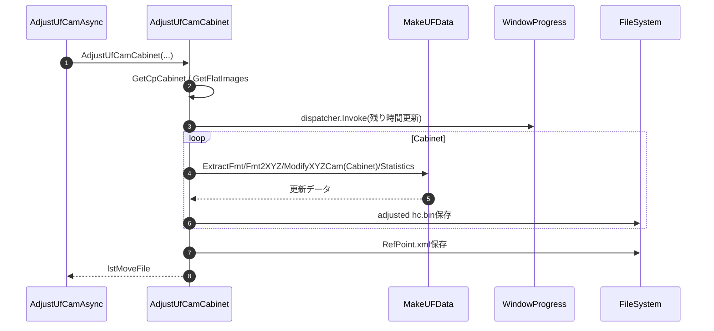
```mermaid
sequenceDiagram
    autonumber
    participant ADJ as AdjustUfCamAsync
    participant CAB as AdjustUfCamCabinet
    participant MK as MakeUFData
    participant PRG as WindowProgress
    participant FS as FileSystem

    ADJ->>CAB: AdjustUfCamCabinet(...)
    CAB->>CAB: GetCpCabinet / GetFlatImages
    CAB->>PRG: dispatcher.Invoke(残り時間更新)
    loop Cabinet
        CAB->>MK: ExtractFmt/Fmt2XYZ/ModifyXYZCam(Cabinet)/Statistics
        MK-->>CAB: 更新データ
        CAB->>FS: adjusted hc.bin保存
    end
    CAB->>FS: RefPoint.xml保存
    CAB-->>ADJ: lstMoveFile
```

#### 8-4-2. AdjustUfCam9pt

| 項目 | 内容 |
|------|------|
| シグネチャ | private void AdjustUfCam9pt(List<UnitInfo> lstTgtCabi, List<UnitInfo> lstObjCabi, ObjectiveLine objEdge, ViewPoint vp, string logDir, out List<MoveFile> lstMoveFile) |
| 概要 | 9点モードで補正点抽出と hc.bin 再生成を行う。9点座標の撮影/読込を含むため、Cabinetモードより処理量が多い。 |

引数

| No. | 引数名 | 型 | 必須 | 説明 |
|-----|--------|----|------|------|
| 1 | lstTgtCabi | List<UnitInfo> | Y | 調整対象Cabinet |
| 2 | lstObjCabi | List<UnitInfo> | Y | 基準Cabinet |
| 3 | objEdge | ObjectiveLine | N | 基準Line指定 |
| 4 | vp | ViewPoint | Y | 視聴点条件 |
| 5 | logDir | string | Y | UFログ保存フォルダ |
| 6 | lstMoveFile(out) | List<MoveFile> | Y | 書込み対象の adjusted hc.bin 一覧 |

返り値: なし（void）

処理概要（詳細）

| 手順No. | 処理内容 | 詳細 |
|---------|----------|------|
| 1 | 初期化 | `dispatcher` を取得し、`lstMoveFile` を初期化する。 |
| 2 | 補正点準備 | `NO_PROC` 時は一時XMLを読込み、通常時は `GetCp9pt` と `GetFlatImages` を実行して残時間を再計算する。 |
| 3 | 対象Unit確定 | `ufCamAdjLog.lstUnitCpInfo` から対象Unitを抽出し、0件なら例外送出する。 |
| 4 | 元データ確認 | `checkDataFile` で対象Unitの hc.bin バックアップ存在を確認する。 |
| 5 | Unitループ処理 | `ExtractFmt -> Fmt2XYZ系 -> CalcReferenceValue -> ModifyXYZCam(Cabi_9pt)系 -> Statistics系 -> OverWritePixelData` をUnitごとに実行する。 |
| 6 | MoveFile登録 | 生成した adjusted hc.bin を `MoveFile` として `lstMoveFile` に追加する。 |
| 7 | ログ用データマスク | Developer以外では `lstRefPoints` の CCV/LCV を初期化して機密値をマスクする。 |
| 8 | 保存/終了 | `RefPoint.xml` を保存し終了ログを出力する。 |

処理差分

| 項目 | Cabinetモードとの差分 |
|------|------------------------|
| 補正点抽出 | GetCp9pt を使用し9点基準の補正点を作成する |
| 補正方式 | ModifyXYZCam に UfCamAdjustType.Cabi_9pt を指定する |
| Progress更新 | dispatcher.Invoke で残り時間を再計算する |

入力条件・前提条件

| 区分 | 条件 | NG時挙動 |
|------|------|----------|
| 実行前提 | 本節の処理概要に記載した前段処理が完了していること | 例外通知して処理中断 |
| 入力値 | 引数/内部状態が有効範囲であること | 例外通知して処理中断 |

条件分岐仕様

| 条件 | 挙動 |
|------|------|
| `NO_PROC` 有効 | RefPoint/UnitCpInfo の一時XML読込みで処理する。 |
| `NO_PROC` 無効 | `GetCp9pt` と `GetFlatImages` を実行する。 |
| `ExtractFmt` | Cabinetごとに必ず実行。失敗時は `Failed in ExtractFmt.` 例外で中断。 |
| `Fmt2XYZ*` | `ForCrosstalkCameraUF` 有効時は LEDモデル条件で `Fmt2XYZ_Crosstalk` / `Fmt2XYZ` を分岐、無効時は `Fmt2XYZ` 固定。 |
| `ModifyXYZCam*` | `ufCamAdjAlgo == CommonColor` の場合は `ModifyXYZCam(UfCamAdjustType.Cabi_9pt, ..., useCrosstalk)` 系、それ以外は `ModifyXYZCamCommonLed(UfCamAdjustType.Cabi_9pt, ...)`。 |
| `Statistics*` | `ForCrosstalkCameraUF` 有効時は `Statistics_CameraUF`、無効時は `Statistics(-1, ...)`。 |
| `appliMode != Developer` | 保存前に CCV/LCV を初期化してログをマスクする。 |

主要呼出し先

| 呼出し先 | 役割 | 同期/非同期 |
|----------|------|--------------|
| `GetCp9pt` | 9点基準の補正点を抽出 | 同期 |
| `GetFlatImages` | Flat画像から補正点測定値を取得 | 同期 |
| `checkDataFile` | `hc.bin` 存在確認 | 同期 |
| `ExtractFmt` / `Fmt2XYZ` / `Fmt2XYZ_Crosstalk` | 補正元FMTデータ展開とXYZ変換（クロストーク分岐含む） | 同期 |
| `CalcReferenceValue` | 基準点から画素目標値を算出 | 同期 |
| `ModifyXYZCam` / `ModifyXYZCamCommonLed` / `Statistics` / `Statistics_CameraUF` | 9点補正反映と統計算出（条件分岐含む） | 同期 |
| `OverWritePixelData` / `dispatcher.Invoke` | adjusted `hc.bin` 生成と進捗更新 | 同期 |
| `UfCamCorrectionPoint.SaveToXmlFile` | 基準点ログを保存する | 同期 |

例外時仕様

| ケース | 捕捉方法 | 通知/伝播 | 後処理 |
|--------|----------|-----------|--------|
| 調整対象0件 | `lstTargetUnit.Count == 0` 判定 | 例外送出 | 9点調整中断 |
| hc.bin 不在 | `checkDataFile` 戻り値false | 例外送出 | 9点調整中断 |
| 9点抽出失敗 | `GetCp9pt` 下位例外 | 呼出元へ再送出 | 9点調整中断 |
| MakeUFData各工程失敗 | 各戻り値false | 例外送出 | 当該Unit以降中断 |

シーケンス図

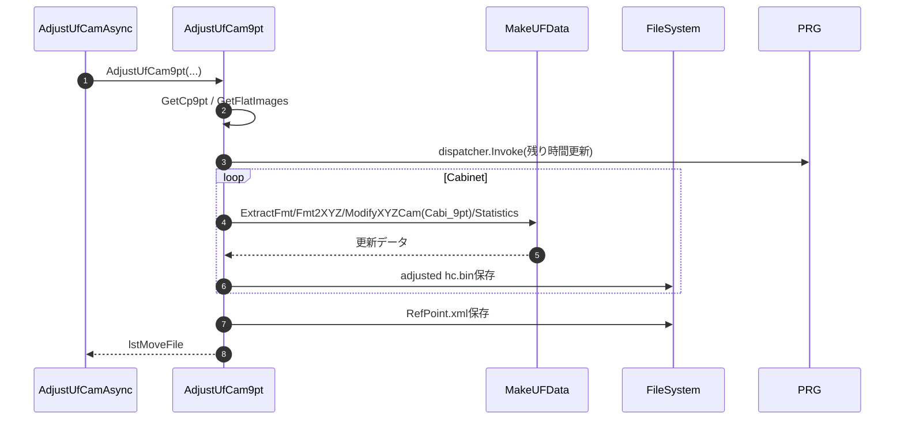
```mermaid
sequenceDiagram
    autonumber
    participant ADJ as AdjustUfCamAsync
    participant N9 as AdjustUfCam9pt
    participant MK as MakeUFData
    participant FS as FileSystem

    ADJ->>N9: AdjustUfCam9pt(...)
    N9->>N9: GetCp9pt / GetFlatImages
    N9->>PRG: dispatcher.Invoke(残り時間更新)
    loop Cabinet
        N9->>MK: ExtractFmt/Fmt2XYZ/ModifyXYZCam(Cabi_9pt)/Statistics
        MK-->>N9: 更新データ
        N9->>FS: adjusted hc.bin保存
    end
    N9->>FS: RefPoint.xml保存
    N9-->>ADJ: lstMoveFile
```

#### 8-4-3. AdjustUfCamRadiator

| 項目 | 内容 |
|------|------|
| シグネチャ | private void AdjustUfCamRadiator(List<UnitInfo> lstTgtCabi, List<UnitInfo> lstObjCabi, ObjectiveLine objEdge, ViewPoint vp, string logDir, out List<MoveFile> lstMoveFile) |
| 概要 | Radiatorモードで左右2点1組の補正点を扱い、Cabinet単位で hc.bin を再生成する。 |

引数

| No. | 引数名 | 型 | 必須 | 説明 |
|-----|--------|----|------|------|
| 1 | lstTgtCabi | List<UnitInfo> | Y | 調整対象Cabinet |
| 2 | lstObjCabi | List<UnitInfo> | Y | 基準Cabinet |
| 3 | objEdge | ObjectiveLine | N | 基準Line指定 |
| 4 | vp | ViewPoint | Y | 視聴点条件 |
| 5 | logDir | string | Y | UFログ保存フォルダ |
| 6 | lstMoveFile(out) | List<MoveFile> | Y | 書込み対象の adjusted hc.bin 一覧 |

返り値: なし（void）

処理概要（詳細）

| 手順No. | 処理内容 | 詳細 |
|---------|----------|------|
| 1 | 初期化 | `dispatcher` を取得し、`lstMoveFile` を初期化する。 |
| 2 | 補正点準備 | `NO_PROC` 時は一時XMLを読込み、通常時は `GetCpRadiator` と `GetFlatImages` を実行して残時間を再計算する。 |
| 3 | 対象Unit確定 | `ufCamAdjLog.lstUnitCpInfo` から対象Unitを抽出し、0件なら例外送出する。 |
| 4 | 元データ確認 | `checkDataFile` で hc.bin の存在を確認する。 |
| 5 | Unitループ処理 | `ExtractFmt -> Fmt2XYZ系 -> CalcReferenceValue -> ModifyXYZCam(Radiator)系 -> Statistics系 -> OverWritePixelData` を実行する。 |
| 6 | MoveFile登録 | Unitごとに adjusted hc.bin を `lstMoveFile` へ追加する。 |
| 7 | ログ用データマスク | Developer以外では `lstRefPoints` の CCV/LCV を初期化する。 |
| 8 | 保存/終了 | `RefPoint.xml` を保存し終了ログを出力する。 |

処理差分

| 項目 | Cabinetモードとの差分 |
|------|------------------------|
| 補正点抽出 | GetCpRadiator を使用する |
| 補正方式 | ModifyXYZCam に UfCamAdjustType.Radiator を指定する |
| 対象粒度 | Cabinet単位で Radiator基準の補正を行う |

入力条件・前提条件

| 区分 | 条件 | NG時挙動 |
|------|------|----------|
| 実行前提 | 本節の処理概要に記載した前段処理が完了していること | 例外通知して処理中断 |
| 入力値 | 引数/内部状態が有効範囲であること | 例外通知して処理中断 |

条件分岐仕様

| 条件 | 挙動 |
|------|------|
| `NO_PROC` 有効 | RefPoint/UnitCpInfo の一時XML読込みで処理する。 |
| `NO_PROC` 無効 | `GetCpRadiator` と `GetFlatImages` を実行する。 |
| `ExtractFmt` | Cabinetごとに必ず実行。失敗時は `Failed in ExtractFmt.` 例外で中断。 |
| `Fmt2XYZ*` | `ForCrosstalkCameraUF` 有効時は LEDモデル条件で `Fmt2XYZ_Crosstalk` / `Fmt2XYZ` を分岐、無効時は `Fmt2XYZ` 固定。 |
| `ModifyXYZCam*` | `ufCamAdjAlgo == CommonColor` の場合は `ModifyXYZCam(UfCamAdjustType.Radiator, ..., useCrosstalk)` 系、それ以外は `ModifyXYZCamCommonLed(UfCamAdjustType.Radiator, ...)`。 |
| `Statistics*` | `ForCrosstalkCameraUF` 有効時は `Statistics_CameraUF`、無効時は `Statistics(-1, ...)`。 |
| `appliMode != Developer` | 保存前に CCV/LCV を初期化してログをマスクする。 |

主要呼出し先

| 呼出し先 | 役割 | 同期/非同期 |
|----------|------|--------------|
| `GetCpRadiator` | Radiator基準の補正点を抽出 | 同期 |
| `GetFlatImages` | Flat画像から補正点測定値を取得 | 同期 |
| `checkDataFile` | `hc.bin` 存在確認 | 同期 |
| `ExtractFmt` / `Fmt2XYZ` / `Fmt2XYZ_Crosstalk` | 補正元FMTデータ展開とXYZ変換（クロストーク分岐含む） | 同期 |
| `CalcReferenceValue` | 基準点から画素目標値を算出 | 同期 |
| `ModifyXYZCam` / `ModifyXYZCamCommonLed` / `Statistics` / `Statistics_CameraUF` | Radiator補正反映と統計算出（条件分岐含む） | 同期 |
| `OverWritePixelData` | adjusted `hc.bin` を生成 | 同期 |
| `dispatcher.Invoke` | 残り時間を再計算して進捗表示を更新する | 同期 |
| `UfCamCorrectionPoint.SaveToXmlFile` | 基準点ログを保存する | 同期 |

例外時仕様

| ケース | 捕捉方法 | 通知/伝播 | 後処理 |
|--------|----------|-----------|--------|
| 調整対象0件 | `lstTargetUnit.Count == 0` 判定 | 例外送出 | Radiator調整中断 |
| hc.bin 不在 | `checkDataFile` 戻り値false | 例外送出 | Radiator調整中断 |
| Radiator抽出失敗 | `GetCpRadiator` 下位例外 | 呼出元へ再送出 | Radiator調整中断 |
| MakeUFData各工程失敗 | 各戻り値false | 例外送出 | 当該Unit以降中断 |

シーケンス図

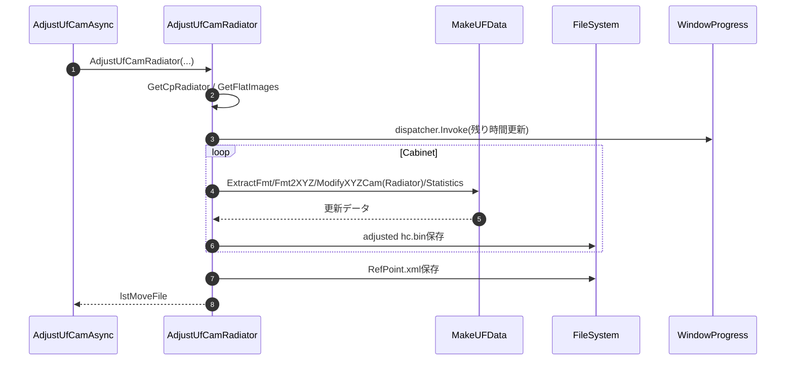
```mermaid
sequenceDiagram
    autonumber
    participant ADJ as AdjustUfCamAsync
    participant RAD as AdjustUfCamRadiator
    participant MK as MakeUFData
    participant FS as FileSystem
    participant PRG as WindowProgress

    ADJ->>RAD: AdjustUfCamRadiator(...)
    RAD->>RAD: GetCpRadiator / GetFlatImages
    RAD->>PRG: dispatcher.Invoke(残り時間更新)
    loop Cabinet
        RAD->>MK: ExtractFmt/Fmt2XYZ/ModifyXYZCam(Radiator)/Statistics
        MK-->>RAD: 更新データ
        RAD->>FS: adjusted hc.bin保存
    end
    RAD->>FS: RefPoint.xml保存
    RAD-->>ADJ: lstMoveFile
```

#### 8-4-4. AdjustUfCamEachModule

| 項目 | 内容 |
|------|------|
| シグネチャ | private void AdjustUfCamEachModule(List<UnitInfo> lstTgtCabi, List<UnitInfo> lstObjCabi, ObjectiveLine objEdge, ViewPoint vp, string logDir, out List<MoveFile> lstMoveFile) |
| 概要 | EachModuleモードで Module単位補正点を用いて hc.bin を再生成する。撮影/読込工程が moduleCount に比例して増加する。 |

引数

| No. | 引数名 | 型 | 必須 | 説明 |
|-----|--------|----|------|------|
| 1 | lstTgtCabi | List<UnitInfo> | Y | 調整対象Cabinet |
| 2 | lstObjCabi | List<UnitInfo> | Y | 基準Cabinet |
| 3 | objEdge | ObjectiveLine | N | 基準Line指定 |
| 4 | vp | ViewPoint | Y | 視聴点条件 |
| 5 | logDir | string | Y | UFログ保存フォルダ |
| 6 | lstMoveFile(out) | List<MoveFile> | Y | 書込み対象の adjusted hc.bin 一覧 |

返り値: なし（void）

処理概要（詳細）

| 手順No. | 処理内容 | 詳細 |
|---------|----------|------|
| 1 | 初期化 | `dispatcher` を取得し、`lstMoveFile` を初期化する。 |
| 2 | 補正点準備 | `NO_PROC` 時は一時XML読込み、通常時は `GetCpEachModule` と `GetFlatImages` を実行して残時間を再計算する。 |
| 3 | 対象Unit確定 | `ufCamAdjLog.lstUnitCpInfo` から対象Unitを抽出し、0件なら例外送出する。 |
| 4 | 元データ確認 | `checkDataFile` で対象Unitの hc.bin 存在を確認する。 |
| 5 | Unitループ処理 | `ExtractFmt -> Fmt2XYZ系 -> CalcReferenceValue -> ModifyXYZCam(EachModule)系 -> Statistics系 -> OverWritePixelData` を実行する。 |
| 6 | MoveFile登録 | Unitごとの adjusted hc.bin を `lstMoveFile` に追加する。 |
| 7 | ログ用データマスク | Developer以外では `lstRefPoints` の CCV/LCV を初期化する。 |
| 8 | 保存/終了 | `RefPoint.xml` を保存し終了ログを出力する。 |

処理差分

| 項目 | Cabinetモードとの差分 |
|------|------------------------|
| 補正点抽出 | GetCpEachModule を使用する |
| 補正方式 | ModifyXYZCam に UfCamAdjustType.EachModule を指定する |
| 取得ステップ | Module数に比例して補正点抽出ステップが増加する |

入力条件・前提条件

| 区分 | 条件 | NG時挙動 |
|------|------|----------|
| 実行前提 | 本節の処理概要に記載した前段処理が完了していること | 例外通知して処理中断 |
| 入力値 | 引数/内部状態が有効範囲であること | 例外通知して処理中断 |

条件分岐仕様

| 条件 | 挙動 |
|------|------|
| `NO_PROC` 有効 | RefPoint/UnitCpInfo の一時XML読込みで処理する。 |
| `NO_PROC` 無効 | `GetCpEachModule` と `GetFlatImages` を実行する。 |
| `ExtractFmt` | Cabinetごとに必ず実行。失敗時は `Failed in ExtractFmt.` 例外で中断。 |
| `Fmt2XYZ*` | `ForCrosstalkCameraUF` 有効時は LEDモデル条件で `Fmt2XYZ_Crosstalk` / `Fmt2XYZ` を分岐、無効時は `Fmt2XYZ` 固定。 |
| `ModifyXYZCam*` | `ufCamAdjAlgo == CommonColor` の場合は `ModifyXYZCam(UfCamAdjustType.EachModule, ..., useCrosstalk)` 系、それ以外は `ModifyXYZCamCommonLed(UfCamAdjustType.EachModule, ...)`。 |
| `Statistics*` | `ForCrosstalkCameraUF` 有効時は `Statistics_CameraUF`、無効時は `Statistics(-1, ...)`。 |
| `appliMode != Developer` | 保存前に CCV/LCV を初期化してログをマスクする。 |

主要呼出し先

| 呼出し先 | 役割 | 同期/非同期 |
|----------|------|--------------|
| `GetCpEachModule` | Module単位の補正点を抽出 | 同期 |
| `GetFlatImages` | Flat画像から補正点測定値を取得 | 同期 |
| `checkDataFile` | `hc.bin` 存在確認 | 同期 |
| `ExtractFmt` / `Fmt2XYZ` / `Fmt2XYZ_Crosstalk` | 補正元FMTデータ展開とXYZ変換（クロストーク分岐含む） | 同期 |
| `CalcReferenceValue` | 基準点から画素目標値を算出 | 同期 |
| `ModifyXYZCam` / `ModifyXYZCamCommonLed` / `Statistics` / `Statistics_CameraUF` | Module単位補正反映と統計算出（条件分岐含む） | 同期 |
| `OverWritePixelData` | adjusted `hc.bin` を生成 | 同期 |
| `dispatcher.Invoke` | 残り時間を再計算して進捗表示を更新する | 同期 |
| `UfCamCorrectionPoint.SaveToXmlFile` | 基準点ログを保存する | 同期 |

例外時仕様

| ケース | 捕捉方法 | 通知/伝播 | 後処理 |
|--------|----------|-----------|--------|
| 調整対象0件 | `lstTargetUnit.Count == 0` 判定 | 例外送出 | EachModule調整中断 |
| hc.bin 不在 | `checkDataFile` 戻り値false | 例外送出 | EachModule調整中断 |
| Module抽出失敗 | `GetCpEachModule` 下位例外 | 呼出元へ再送出 | EachModule調整中断 |
| MakeUFData各工程失敗 | 各戻り値false | 例外送出 | 当該Unit以降中断 |

シーケンス図

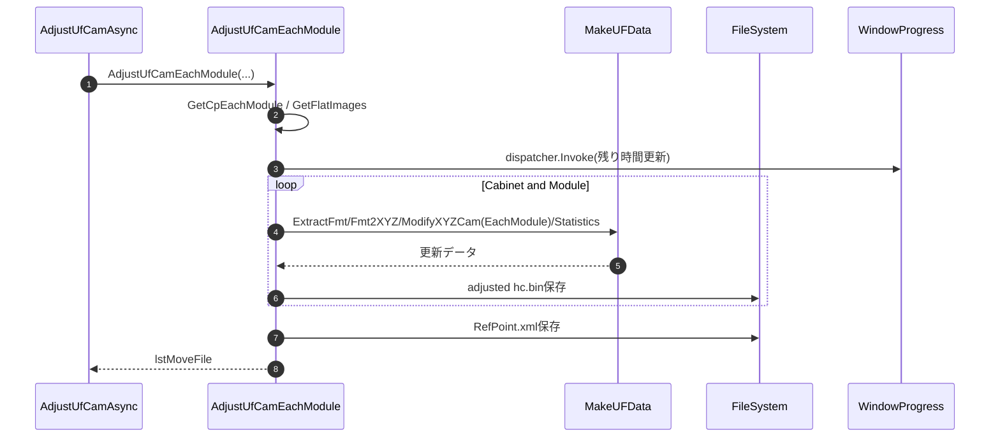
```mermaid
sequenceDiagram
    autonumber
    participant ADJ as AdjustUfCamAsync
    participant MOD as AdjustUfCamEachModule
    participant MK as MakeUFData
    participant FS as FileSystem
    participant PRG as WindowProgress

    ADJ->>MOD: AdjustUfCamEachModule(...)
    MOD->>MOD: GetCpEachModule / GetFlatImages
    MOD->>PRG: dispatcher.Invoke(残り時間更新)
    loop Cabinet and Module
        MOD->>MK: ExtractFmt/Fmt2XYZ/ModifyXYZCam(EachModule)/Statistics
        MK-->>MOD: 更新データ
        MOD->>FS: adjusted hc.bin保存
    end
    MOD->>FS: RefPoint.xml保存
    MOD-->>ADJ: lstMoveFile
```

#### 8-4-5. ExtractFmt（MakeUFData）

| 項目 | 内容 |
|------|------|
| シグネチャ | bool m_MakeUFData.ExtractFmt(string fileName, string ledModel) |
| 概要 | Unit単位処理の先頭で hc.bin を読込み、Module/Pixel単位に9要素FMTへ展開して `m_pFmtOriginal` と `m_CellTemperature` を更新する。 |

引数

| No. | 引数名 | 型 | 必須 | 説明 |
|-----|--------|----|------|------|
| 1 | fileName | string | Y | 対象Unitの hc.bin フルパス |
| 2 | ledModel | string | Y | 解析対象LEDモデル（Module長選択に使用） |

返り値: bool（成功=true）

処理概要（詳細）

| 手順No. | 処理内容 | 詳細 |
|---------|----------|------|
| 1 | 元データ読込 | `File.ReadAllBytes(fileName)` で hc.bin 全体を読込む。 |
| 2 | パラメータ初期化 | `size = m_CellDx * m_CellDy * 8`、`cells = 0` を設定し、`m_SourceCellDataFileName = fileName` を保持する。 |
| 3 | モデル別Module長決定 | `ledModel` に応じて `hcModuleDataLength` を `P15_Module4x2` / `P12_Module4x3` / `P15_Module4x3` / 既定 `P12_Module4x2` から選択する。 |
| 4 | Moduleループ | `y0`/`x0` を `m_CellDy`/`m_CellDx` ステップで走査し、Module単位処理を行う。 |
| 5 | 温度読込 | 各Moduleで `0x164 + cells * hcModuleDataLength` から4byteを読み、`m_CellTemperature[cells]` に格納する。 |
| 6 | 補正データ読込 | `0x260 + cells * hcModuleDataLength` から `size` byte を `moduleBytes` にコピーする。 |
| 7 | Pixel展開 | Module内各Pixelの8byteを `UnpackCcDataPat3` で9要素へ復号し、`m_pFmtOriginal[y * m_UnitDx * 9 + x * 9 + i]` へ格納する。 |
| 8 | 返却 | 全Module完了後に `true` を返す。 |

入力条件・前提条件

| 区分 | 条件 | NG時挙動 |
|------|------|----------|
| 入力ファイル | `fileName` が存在し読込み可能であること | `IOException` 等を送出 |
| バッファ整合 | hc.bin サイズと `hcModuleDataLength`/`size` が整合すること | `ArgumentException` / `IndexOutOfRangeException` 等を送出 |
| 実行順序 | Unitループ内で `Fmt2XYZ*` より先に呼ばれること | 後段メソッドで失敗 |
| モデル定義 | `ledModel` は未対応でも default 分岐で `P12_Module4x2` を使用して継続する | データ不整合時は実行時例外 |

主要呼出し先

| 呼出し先 | 役割 | 同期/非同期 |
|----------|------|--------------|
| File I/O | hc.bin 読込 | 同期 |
| `CMakeUFData.UnpackCcDataPat3` | Pixel 8byte -> 9要素FMT へ復号 | 同期 |
| `Array.Copy` / `BitConverter.ToInt32` | 温度・モジュールデータ展開 | 同期 |

呼出し元での使用条件

| 呼出し元 | 呼出しタイミング | 失敗時の上位挙動 |
|----------|------------------|--------------------|
| `AdjustUfCamCabinet` | Unitループの先頭 | `Failed in ExtractFmt.` を送出して中断 |
| `AdjustUfCam9pt` | Unitループの先頭 | `Failed in ExtractFmt.` を送出して中断 |
| `AdjustUfCamRadiator` | Unitループの先頭 | `Failed in ExtractFmt.` を送出して中断 |
| `AdjustUfCamEachModule` | Unitループの先頭 | `Failed in ExtractFmt.` を送出して中断 |

条件分岐仕様

| 条件 | 挙動 |
|------|------|
| `ledModel` が既知 | 対応する `hcModuleDataLength` で展開する。 |
| `ledModel` が未知 | default の `P12_Module4x2` で展開する。 |
| 展開処理が完了 | `true` を返して後続の `Fmt2XYZ*` へ進む。 |
| 読込/展開で実行時例外発生 | 本メソッド内で `false` 返却せず例外伝播する。 |

例外時仕様

| ケース | 捕捉方法 | 通知/伝播 | 後処理 |
|--------|----------|-----------|--------|
| `ExtractFmt` 戻り値 `false`（将来拡張経路） | `status != true` 判定 | 呼出元で `Failed in ExtractFmt.` | 当該Unit処理を中断 |
| hc.bin 不在/アクセス不可 | `File.ReadAllBytes` 例外 | 呼出元へ例外伝播（`Failed in ExtractFmt.` 判定前に中断） | 当該Unit処理を中断 |
| バッファ境界不整合 | `Array.Copy` 等の実行時例外 | 呼出元へ例外伝播（`Failed in ExtractFmt.` 判定前に中断） | 当該Unit処理を中断 |

シーケンス図

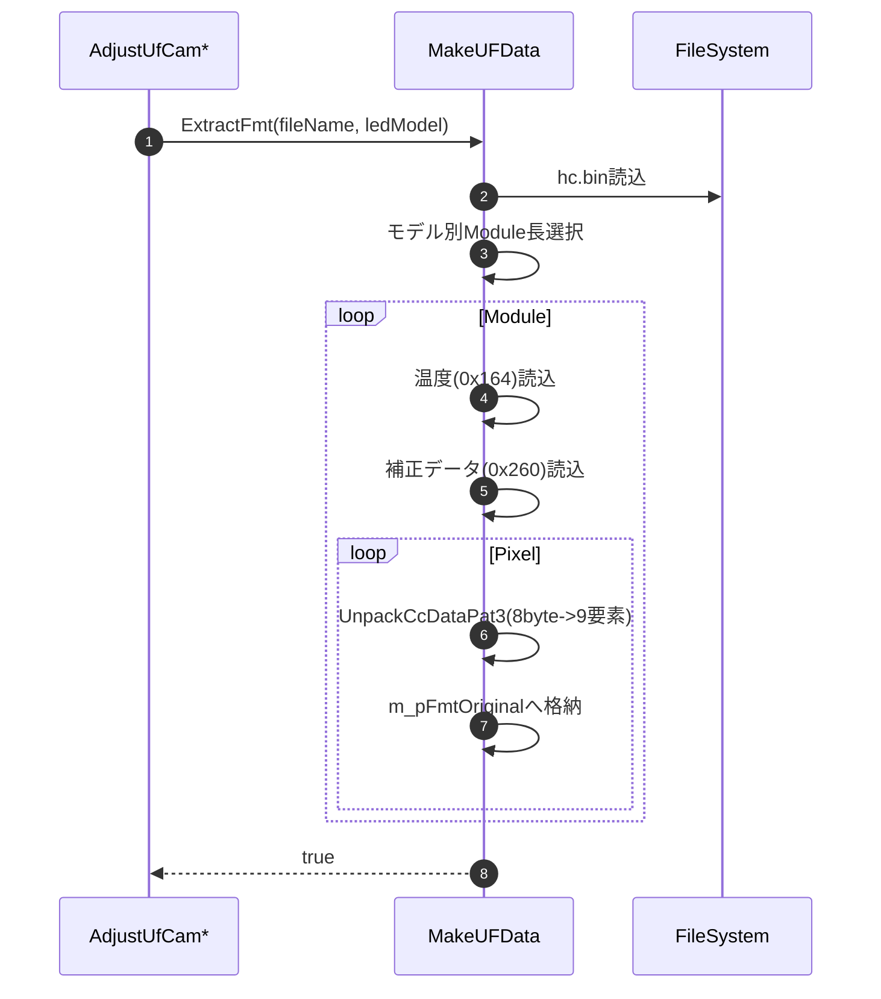
```mermaid
sequenceDiagram
    autonumber
    participant ADJ as AdjustUfCam*
    participant MK as MakeUFData
    participant FS as FileSystem

    ADJ->>MK: ExtractFmt(fileName, ledModel)
    MK->>FS: hc.bin読込
    MK->>MK: モデル別Module長選択
    loop Module
        MK->>MK: 温度(0x164)読込
        MK->>MK: 補正データ(0x260)読込
        loop Pixel
            MK->>MK: UnpackCcDataPat3(8byte->9要素)
            MK->>MK: m_pFmtOriginalへ格納
        end
    end
    MK-->>ADJ: true
```

#### 8-4-6. Fmt2XYZ（MakeUFData）

| 項目 | 内容 |
|------|------|
| シグネチャ | bool m_MakeUFData.Fmt2XYZ(double xr, double yr, double xg, double yg, double xb, double yb, double Yw, double xw, double yw) |
| 概要 | 通常経路（クロストーク経路を使わない場合）で FMT から XYZ を算出し、`ModifyXYZCam*` の入力バッファを更新する。 |

引数

| No. | 引数名 | 型 | 必須 | 説明 |
|-----|--------|----|------|------|
| 1 | rx, ry | double | Y | Red目標色度 |
| 2 | gx, gy | double | Y | Green目標色度 |
| 3 | bx, by | double | Y | Blue目標色度 |
| 4 | wLv | double | Y | White輝度目標 |
| 5 | wx, wy | double | Y | White目標色度 |

返り値: bool（成功=true）

処理概要（詳細）

| 手順No. | 処理内容 | 詳細 |
|---------|----------|------|
| 1 | 前提確認 | `ExtractFmt` 済みの内部バッファを前提とする。 |
| 2 | Msig生成 | 入力値（xr/yr/xg/yg/xb/yb/Yw/xw/yw）から `ColMtx Msig = new ColMtx(target, 1)` を生成する。 |
| 3 | Pixelループ変換 | 全画素で `Mfmt = new ColMtx(m_pFmtOriginal, i)` を生成し、`Mxyz = Msig * (Mfmt.Transpose().Inv())` を計算する。 |
| 4 | 出力格納 | `Mxyz.GetElement(m_pXYZ, i)` で9要素ずつ `m_pXYZ` に格納し、`i += 9` で次画素へ進む。 |
| 5 | 結果返却 | ループ完了後に `true` を返す。 |

入力条件・前提条件

| 区分 | 条件 | NG時挙動 |
|------|------|----------|
| 前段処理 | `ExtractFmt` が成功済みであること | 行列生成時に実行時例外の可能性 |
| 実行分岐 | Crosstalk対象外（または非対応モデル）であること | 呼出し側が `Fmt2XYZ_Crosstalk` へ分岐 |
| 目標値 | 行列演算が成立する値であること（逆行列が計算可能） | 実行時例外 |

主要呼出し先

| 呼出し先 | 役割 | 同期/非同期 |
|----------|------|--------------|
| MakeUFData色変換エンジン | FMT→XYZ 変換 | 同期 |

呼出し元での使用条件

| 条件 | 呼出し元の挙動 |
|------|----------------|
| `ForCrosstalkCameraUF` 無効 | 常に本メソッドを呼ぶ |
| `ForCrosstalkCameraUF` 有効かつ対象外LEDモデル | 本メソッドを呼ぶ |
| `ForCrosstalkCameraUF` 有効かつ対象LEDモデルでも係数未適用経路 | 本メソッドを呼ぶ |

条件分岐仕様

| 条件 | 挙動 |
|------|------|
| 通常完了 | `true` を返して `ModifyXYZCam*` へ進む。 |
| 行列演算/データ不整合で例外 | `false` は返さず例外伝播で中断する。 |

例外時仕様

| ケース | 捕捉方法 | 通知/伝播 | 後処理 |
|--------|----------|-----------|--------|
| 行列演算失敗（逆行列不可など） | `ColMtx` 演算中の実行時例外 | 呼出元へ例外伝播（`status != true` 判定前に中断） | 当該Unit処理を中断 |
| バッファ不整合 | `m_pFmtOriginal` / `m_pXYZ` アクセス時の実行時例外 | 呼出元へ例外伝播（`status != true` 判定前に中断） | 当該Unit処理を中断 |

シーケンス図

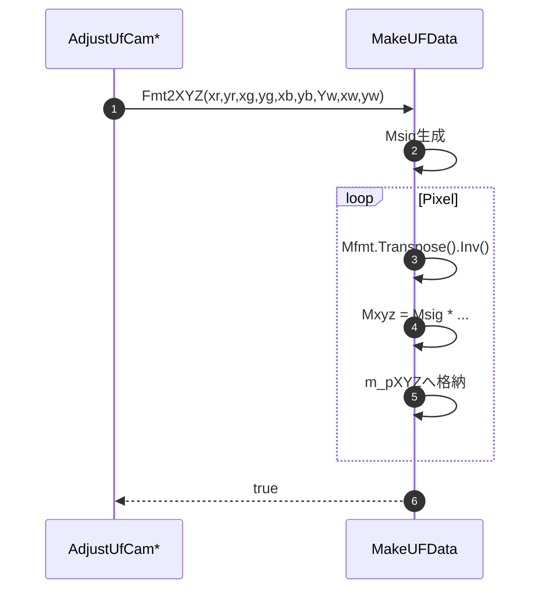
```mermaid
sequenceDiagram
    autonumber
    participant ADJ as AdjustUfCam*
    participant MK as MakeUFData

    ADJ->>MK: Fmt2XYZ(xr,yr,xg,yg,xb,yb,Yw,xw,yw)
    MK->>MK: Msig生成
    loop Pixel
        MK->>MK: Mfmt.Transpose().Inv()
        MK->>MK: Mxyz = Msig * ...
        MK->>MK: m_pXYZへ格納
    end
    MK-->>ADJ: true
```

#### 8-4-7. ModifyXYZCam（MakeUFData）

| 項目 | 内容 |
|------|------|
| シグネチャ | bool m_MakeUFData.ModifyXYZCam(UfCamAdjustType type, UfCamCorrectionPoint refPt, UfCamCabinetCpInfo targetUnit) / bool m_MakeUFData.ModifyXYZCam(UfCamAdjustType type, UfCamCorrectionPoint refPt, UfCamCabinetCpInfo targetUnit, bool enabledCrosstalk) |
| 概要 | CommonColorアルゴリズム時に、方式別（Cabinet/Cabi_9pt/Radiator/EachModule）の補正Gainを生成し、画素単位の補正ターゲットまたはXYZ値を更新する。 |

引数

| No. | 引数名 | 型 | 必須 | 説明 |
|-----|--------|----|------|------|
| 1 | type | UfCamAdjustType | Y | 補正方式（Cabinet/Cabi_9pt/Radiator/EachModule） |
| 2 | refPt | UfCamCorrectionPoint | Y | 基準目標値 |
| 3 | targetUnit | UfCamCabinetCpInfo | Y | 対象Unitの補正点/測定値 |
| 4 | enabledCrosstalk | bool | N | クロストーク係数適用可否（4引数版のみ） |

返り値: bool（成功=true）

処理概要（詳細）

| 手順No. | 処理内容 | 詳細 |
|---------|----------|------|
| 1 | 参照Cabinet判定 | `refPt.Unit` と `targetUnit.Unit` を比較し、基準Cabinetかどうかを判定する。 |
| 2 | 方式別補正点展開 | `type` に応じて補正点配列 `rgbCpGain` を構築する（Cabinet/9pt/Radiator/EachModule）。 |
| 3 | 欠損点補間 | Cabinet/Radiatorでは未設定補正点を近傍平均で補間する。EachModuleはmodule単位点を使用する。 |
| 4 | 基準点固定 | 基準Cabinetの場合は `refPt.Quad` に対応する補正点Gainを1固定する。 |
| 5 | 画素反映 | 画素ごとに `calcCamGain` でGainを算出し、Crosstalk有効時は `m_CorTarget[x,y][0..8]`、無効時は `m_pXYZ` を直接更新する。 |
| 6 | 結果返却 | 方式処理完了で `true`、基準Quadrant不正時のみ `false` を返す。 |

入力条件・前提条件

| 区分 | 条件 | NG時挙動 |
|------|------|----------|
| 前段処理 | `ExtractFmt` / `Fmt2XYZ*` が成功済みであること | 実行時例外または不正値 |
| 参照点 | `refPt` と `targetUnit` が有効であること | 実行時例外の可能性 |
| 実測値 | `targetUnit.lstCp` に方式別補正点が格納済みであること | 補間失敗/実行時例外の可能性 |
| 実行分岐 | `ufCamAdjAlgo == CommonColor` であること | 呼出し側が `ModifyXYZCamCommonLed` を呼ぶ |

主要呼出し先

| 呼出し先 | 役割 | 同期/非同期 |
|----------|------|--------------|
| `calcCamGain` | 画素位置ごとのR/G/B補正Gainを計算 | 同期 |
| `MainWindow.ListCrosstalkInfo` | Crosstalk係数取得（有効時） | 同期 |
| `ColMtx` | 新規ターゲット行列生成（Crosstalk有効時） | 同期 |

呼出し元での使用条件

| 条件 | 呼出し元の挙動 |
|------|----------------|
| `ufCamAdjAlgo == CommonColor` かつ `ForCrosstalkCameraUF` 無効 | 3引数版 `ModifyXYZCam(type, refPt, targetUnit)` を呼ぶ |
| `ufCamAdjAlgo == CommonColor` かつ `ForCrosstalkCameraUF` 有効 | LEDモデル判定で 4引数版の `enabledCrosstalk` を切替える |
| `ufCamAdjAlgo != CommonColor` | `ModifyXYZCamCommonLed` を呼び本メソッドは未使用 |

条件分岐仕様

| 条件 | 挙動 |
|------|------|
| `type` が Cabinet/Cabi_9pt/Radiator/EachModule | 対応処理を実行し、終了時に `true` を返す。 |
| 基準Cabinetかつ `refPt.Quad` 不正 | `false` を返す。 |
| `type` が上記以外 | 追加処理なしで末尾 `true` を返す。 |

例外時仕様

| ケース | 捕捉方法 | 通知/伝播 | 後処理 |
|--------|----------|-----------|--------|
| 基準Quadrant不正 | 戻り値 `false` | 呼出元で `Failed in ModifyXYZCam.` | 当該Unit処理を中断 |
| 配列/値不整合（補正点不足・0除算相当・Null等） | 実行時例外 | 呼出元へ例外伝播（`status != true` 判定前に中断） | 当該Unit処理を中断 |

シーケンス図

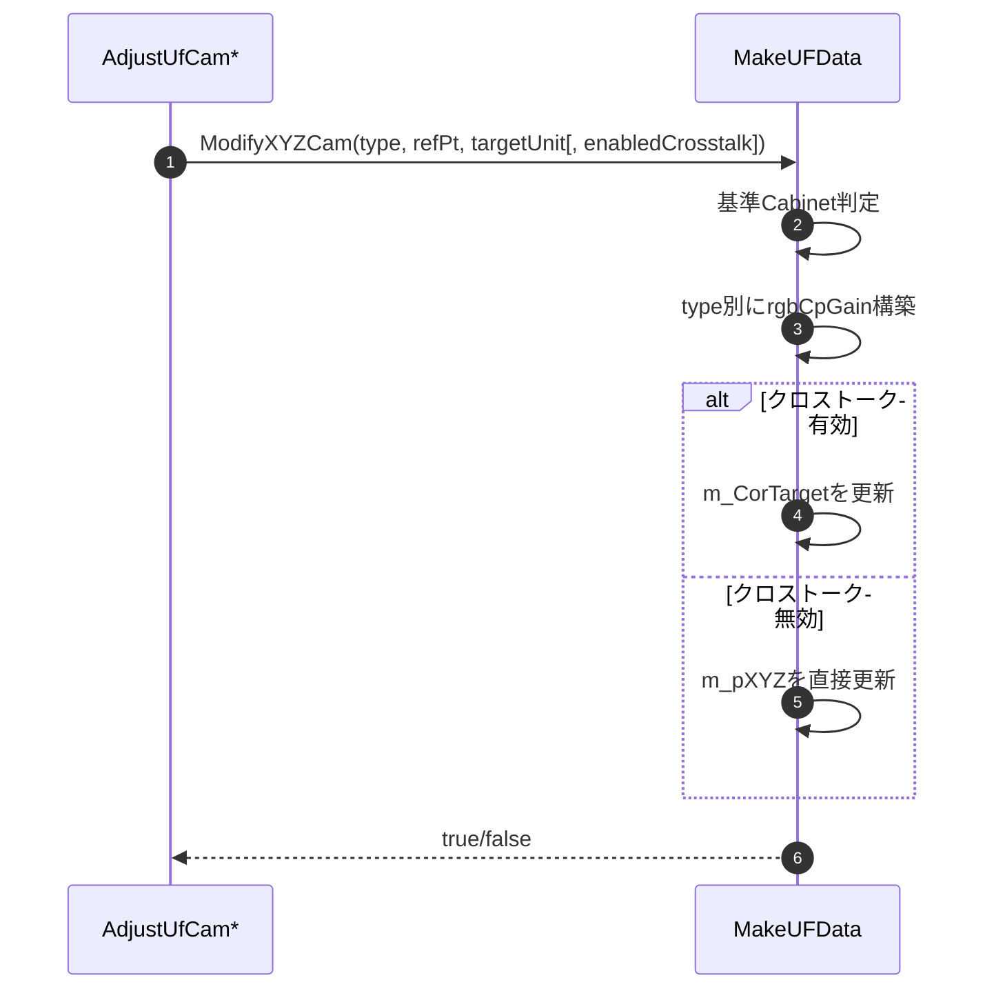
```mermaid
sequenceDiagram
    autonumber
    participant ADJ as AdjustUfCam*
    participant MK as MakeUFData

    ADJ->>MK: ModifyXYZCam(type, refPt, targetUnit[, enabledCrosstalk])
    MK->>MK: 基準Cabinet判定
    MK->>MK: type別にrgbCpGain構築
    alt クロストーク有効
        MK->>MK: m_CorTargetを更新
    else クロストーク無効
        MK->>MK: m_pXYZを直接更新
    end
    MK-->>ADJ: true/false
```

#### 8-4-8. Statistics（MakeUFData）

| 項目 | 内容 |
|------|------|
| シグネチャ | bool m_MakeUFData.Statistics(double underCompensate, out double targetYw, out double targetYr, out double targetYg, out double targetYb, out int ucr, out int ucg, out int ucb) |
| 概要 | 補正後XYZから書込み用FMTを生成する統計処理を実行する。LED構成により CalcFmt または CalcFmtWithCrosstalk を切替えて targetY と補正残り係数を出力する。 |

引数

| No. | 引数名 | 型 | 必須 | 説明 |
|-----|--------|----|------|------|
| 1 | underCompensate | double | Y | 補正残り許容量（呼出し側では -1 を指定） |
| 2 | targetYw/targetYr/targetYg/targetYb(out) | double | Y | RGBW目標輝度出力 |
| 3 | ucr/ucg/ucb(out) | int | Y | 書込み用補正係数出力 |

返り値: bool（成功=true）

処理概要（詳細）

| 手順No. | 処理内容 | 詳細 |
|---------|----------|------|
| 1 | 前提確認 | `ModifyXYZCam*` 後の内部データを前提とする。 |
| 2 | 初期化 | `ucr/ucg/ucb = 0` を設定する。 |
| 3 | LED構成分岐 | `Settings.Ins.LedModuleConfiguration == Module_4x2` の場合は `CalcFmt(underCompensate, -1, -1, -1, false, ...)` を実行、その他は `CalcFmtWithCrosstalk(...)` を実行する。 |
| 4 | 結果返却 | 下位関数戻り値をそのまま返す。 |

入力条件・前提条件

| 区分 | 条件 | NG時挙動 |
|------|------|----------|
| 前段処理 | `ModifyXYZCam*` が成功済みであること | 下位計算で `false` 返却 |
| 実行環境 | LED構成が `Module_4x2` またはそれ以外であること | 分岐先で `false` 返却 |
| 出力先変数 | out 引数を受け取れる状態であること | 計算不能時 `false` 返却 |

主要呼出し先

| 呼出し先 | 役割 | 同期/非同期 |
|----------|------|--------------|
| `CalcFmt` | 4x2構成時のFMT生成・補正残り係数算出 | 同期 |
| `CalcFmtWithCrosstalk` | 4x3構成時のFMT生成（Crosstalk考慮） | 同期 |

呼出し元での使用条件

| 条件 | 呼出し元の挙動 |
|------|----------------|
| UF調整で `ForCrosstalkCameraUF` 無効 | 本メソッドを `Statistics(-1, ...)` として呼ぶ |
| UF調整で `ForCrosstalkCameraUF` 有効 | `Statistics_CameraUF(...)` を呼び本メソッドは未使用 |
| UF以外の経路 | 本メソッドが直接呼ばれる場合がある |

条件分岐仕様

| 条件 | 挙動 |
|------|------|
| LED構成 = Module_4x2 | `CalcFmt` の結果を返す。 |
| LED構成 != Module_4x2 | `CalcFmtWithCrosstalk` の結果を返す。 |
| 下位計算成功 | `true` を返し `OverWritePixelData` へ進む。 |
| 下位計算失敗 | `false` を返し、呼出し元が `Failed in Statistics.` を送出する。 |

例外時仕様

| ケース | 捕捉方法 | 通知/伝播 | 後処理 |
|--------|----------|-----------|--------|
| CalcFmt失敗 | 戻り値 `false` | 呼出元で `Failed in Statistics.` | 当該Unit処理を中断 |
| CalcFmtWithCrosstalk失敗 | 戻り値 `false` | 呼出元で `Failed in Statistics.` | 当該Unit処理を中断 |

シーケンス図

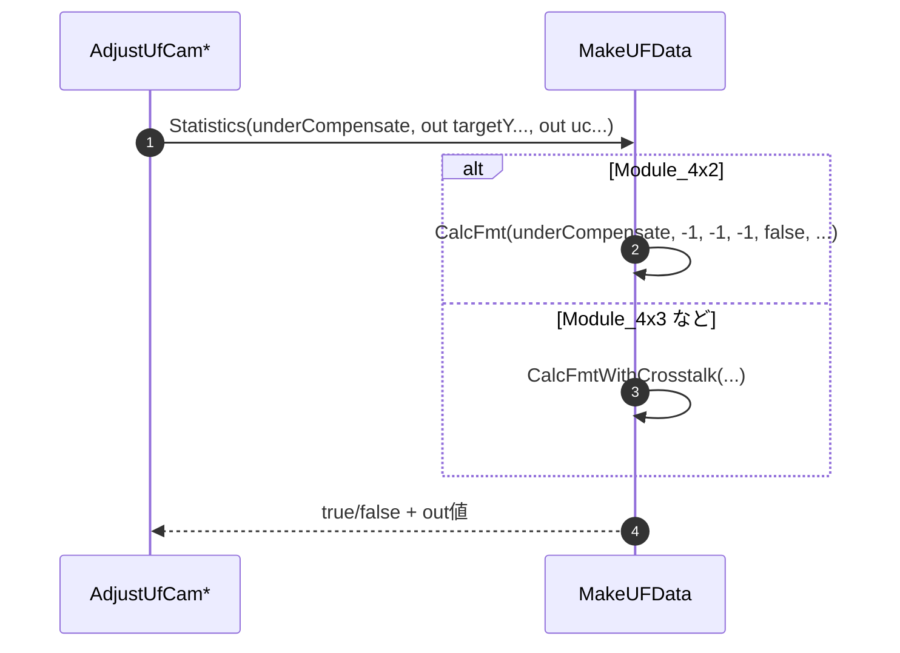
```mermaid
sequenceDiagram
    autonumber
    participant ADJ as AdjustUfCam*
    participant MK as MakeUFData

    ADJ->>MK: Statistics(underCompensate, out targetY..., out uc...)
    alt Module_4x2
        MK->>MK: CalcFmt(underCompensate, -1, -1, -1, false, ...)
    else Module_4x3 など
        MK->>MK: CalcFmtWithCrosstalk(...)
    end
    MK-->>ADJ: true/false + out値
```

#### 8-4-9. CalcFmt（MakeUFData）

| 項目 | 内容 |
|------|------|
| シグネチャ | `public bool CalcFmt(double underCompensate, int upper, int strength, int limit, bool defect2, out double targetYw, out double targetYr, out double targetYg, out double targetYb, out int ucr, out int ucg, out int ucb)` |
| 概要 | メモリ上の XYZ（`m_pXYZ`）から書込み用 FMT（`m_pFmtCreated`）を生成する。通常の UF 調整経路では `E_FMT` モードで実行され、`targetYw` と補正残り係数（`ucr/ucg/ucb`）を算出する。 |

引数

| No. | 引数名 | 型 | 必須 | 説明 |
|-----|--------|----|------|------|
| 1 | underCompensate | double | Y | 補正残り許容量[%]。`-1` 指定時は固定輝度モードで 1 回のみ算出する。 |
| 2 | upper | int | Y | Conceal 判定上限[%]。UF通常経路では `-1`。 |
| 3 | strength | int | Y | Conceal 強度[%]。UF通常経路では `-1`。 |
| 4 | limit | int | Y | Conceal 上限[%]。UF通常経路では `-1`。 |
| 5 | defect2 | bool | Y | 欠陥補償フラグ（現経路では実質未使用）。 |
| 6 | targetYw/targetYr/targetYg/targetYb(out) | double | Y | 算出結果の目標輝度出力。 |
| 7 | ucr/ucg/ucb(out) | int | Y | 補正残りカウンタ（R/G/B）出力。 |

返り値: bool（成功=true）

処理概要（詳細）

| 手順No. | 処理内容 | 詳細 |
|---------|----------|------|
| 1 | 前提確認 | `m_pXYZ == null` の場合は `m_LastErrorMessage` を設定して `false` を返す。 |
| 2 | モード決定 | `upper/strength/limit` がすべて `-1` 以外なら `E_CONCEAL`、それ以外は `E_FMT` を選択する。UF通常経路は `E_FMT`。 |
| 3 | 作業バッファ初期化 | `E_FMT` では `m_pFmtCreated` を確保。`E_CONCEAL` では `xyz2` に `m_pXYZ` をコピーする。 |
| 4 | 色空間前計算 | `m_Target` から信号色度を取得し、`xyToXZ` と逆行列計算で `SigYw*` と変換係数を準備する。 |
| 5 | targetY 探索ループ | `targetYw += deltaY` し、全画素走査で `ratioY*`、`LiS**`、`LedYw*` を算出する。 |
| 6 | FMT生成 | `E_FMT` の場合、`ratioY*` を下限制約（`<1` のとき 1）し、`m_pFmtCreated[i..i+8]` を生成する。 |
| 7 | 補正残り判定 | `underCompensate != -1` の場合、`ucr/ucg/ucb` と目標許容量を比較して `deltaY` の符号・幅を調整し収束させる。 |
| 8 | 終了処理 | `E_CONCEAL` の場合のみ `xyz2` を `m_pXYZ` へ戻し、最終的に `true` を返す。 |

入力条件・前提条件

| 区分 | 条件 | NG時挙動 |
|------|------|----------|
| 前段処理 | `ExtractFmt`、`Fmt2XYZ*`、`ModifyXYZCam*` が成功し `m_pXYZ` が有効であること | `false` 返却または実行時例外 |
| ターゲット値 | `m_Target[0..8]` が有効な色度/輝度であること | 行列計算不正・例外の可能性 |
| 画素情報 | `m_UnitDx * m_UnitDy` と `m_pXYZ` 長が整合していること | 配列アクセス例外 |

主要呼出し先

| 呼出し先 | 役割 | 同期/非同期 |
|----------|------|--------------|
| `xyToXZ` | xy 色度から X/Z 成分を算出 | 同期 |
| `ColMtx` | 色変換行列生成・演算 | 同期 |
| `Math.Abs` | `deltaY` 収束計算 | 同期 |

呼出し元での使用条件

| 条件 | 呼出し元の挙動 |
|------|----------------|
| `Statistics` かつ LED構成 = `Module_4x2` | `CalcFmt(underCompensate, -1, -1, -1, false, ...)` を呼び出す。 |
| `Statistics` かつ LED構成 != `Module_4x2` | `CalcFmtWithCrosstalk(...)` へ分岐し本メソッドは未使用。 |
| `Statistics_CameraUF` 経路 | `CalcFmt_CameraUF(...)` を使用し本メソッドは未使用。 |

条件分岐仕様

| 条件 | 挙動 |
|------|------|
| `m_pXYZ == null` | `false` を返して終了する。 |
| `upper/strength/limit` がすべて有効 | `E_CONCEAL` で実行し `m_pXYZ` を更新する。 |
| 上記以外 | `E_FMT` で実行し `m_pFmtCreated` を生成する。 |
| `underCompensate == -1` | 目標固定（1回）で計算して終了する。 |
| `underCompensate != -1` | `ucr/ucg/ucb` 判定により `deltaY` を調整して収束まで反復する。 |

例外時仕様

| ケース | 捕捉方法 | 通知/伝播 | 後処理 |
|--------|----------|-----------|--------|
| XYZ未設定 | `m_pXYZ == null` 判定 | `false` 返却（`m_LastErrorMessage` 設定） | 呼出元で `Failed in Statistics.` 判定 |
| 行列逆行列不可・0除算相当 | 実行時例外 | 呼出元へ例外伝播 | 当該Unit処理を中断 |
| 配列境界不整合 | 実行時例外 | 呼出元へ例外伝播 | 当該Unit処理を中断 |

シーケンス図

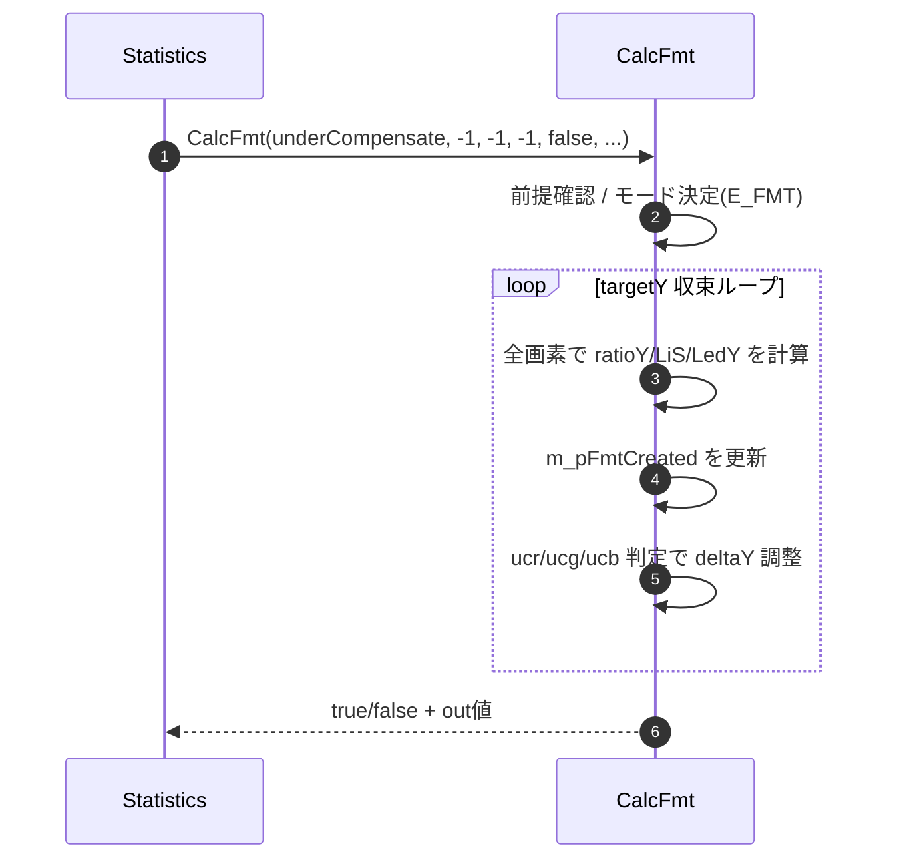
```mermaid
sequenceDiagram
    autonumber
    participant ST as Statistics
    participant CF as CalcFmt

    ST->>CF: CalcFmt(underCompensate, -1, -1, -1, false, ...)
    CF->>CF: 前提確認 / モード決定(E_FMT)
    loop targetY 収束ループ
        CF->>CF: 全画素で ratioY/LiS/LedY を計算
        CF->>CF: m_pFmtCreated を更新
        CF->>CF: ucr/ucg/ucb 判定で deltaY 調整
    end
    CF-->>ST: true/false + out値
```

#### 8-4-10. Fmt2XYZ_Crosstalk（MakeUFData）

| 項目 | 内容 |
|------|------|
| シグネチャ | bool m_MakeUFData.Fmt2XYZ_Crosstalk(double xr, double yr, double xg, double yg, double xb, double yb, double Yw, double xw, double yw, float[][] crosstalk) |
| 概要 | Crosstalk対応経路で、module単位のクロストーク係数を `Msig` に乗算して FMT から XYZ を算出し `m_pXYZ` を更新する。 |

引数

| No. | 引数名 | 型 | 必須 | 説明 |
|-----|--------|----|------|------|
| 1 | xr, yr | double | Y | Red目標色度 |
| 2 | xg, yg | double | Y | Green目標色度 |
| 3 | xb, yb | double | Y | Blue目標色度 |
| 4 | Yw | double | Y | White輝度目標 |
| 5 | xw, yw | double | Y | White目標色度 |
| 6 | crosstalk | float[][] | Y | moduleNo単位のクロストーク係数配列（[module][RGB]） |

返り値: bool（成功=true）

処理概要（詳細）

| 手順No. | 処理内容 | 詳細 |
|---------|----------|------|
| 1 | 前提確認 | `ExtractFmt` 済みの `m_pFmtOriginal` と、対象Unitの `crosstalk` 配列を前提とする。 |
| 2 | target設定 | 入力値から `target = {xr,yr,xg,yg,xb,yb,Yw,xw,yw}` を生成する。 |
| 3 | 画素ループ | 全画素で `moduleNo = (y / m_CellDy) * 4 + (x / m_CellDx)` を算出し、`crosstalk[moduleNo][0..2]` を取得する。 |
| 4 | 行列計算 | `Msig = ColMtx(target,1) * gain`（gainは `1 + crosstalk` の対角行列）を作成し、`Mxyz = Msig * (Mfmt.Transpose().Inv())` を計算する。 |
| 5 | 出力格納 | `Mxyz.GetElement(m_pXYZ, i)` を実行し `i += 9` で次画素へ進む。 |
| 6 | 結果返却 | ループ完了後に `true` を返す。 |

入力条件・前提条件

| 区分 | 条件 | NG時挙動 |
|------|------|----------|
| 前段処理 | `ExtractFmt` が成功済みであること | 実行時例外の可能性 |
| 補正量 | `crosstalk[moduleNo][RGB]` 参照可能であること | 実行時例外 |
| 呼出し分岐 | `ForCrosstalkCameraUF` 有効かつ対応LEDモデルであること | 呼出し側が `Fmt2XYZ` へ分岐 |

主要呼出し先

| 呼出し先 | 役割 | 同期/非同期 |
|----------|------|--------------|
| `ColMtx` | Msig/gain/Mfmt/Mxyz の行列演算 | 同期 |
| `Mfmt.Transpose().Inv()` | FMT行列の逆行列変換 | 同期 |

呼出し元での使用条件

| 条件 | 呼出し元の挙動 |
|------|----------------|
| `ForCrosstalkCameraUF` 有効 + 対応LEDモデル + 対応Unitの係数取得済み | 本メソッドを呼ぶ |
| 上記以外 | `Fmt2XYZ` を呼ぶ |

条件分岐仕様

| 条件 | 挙動 |
|------|------|
| 通常完了 | `true` を返して `ModifyXYZCam*` へ進む。 |
| 行列演算/配列参照で例外 | `false` は返さず例外伝播で中断する。 |

例外時仕様

| ケース | 捕捉方法 | 通知/伝播 | 後処理 |
|--------|----------|-----------|--------|
| 行列演算失敗（逆行列不可など） | `ColMtx` 演算中の実行時例外 | 呼出元へ例外伝播（`status != true` 判定前に中断） | 当該Unit処理を中断 |
| Crosstalk配列不整合 | `crosstalk[moduleNo][rgb]` 参照時の実行時例外 | 呼出元へ例外伝播（`status != true` 判定前に中断） | 当該Unit処理を中断 |

シーケンス図

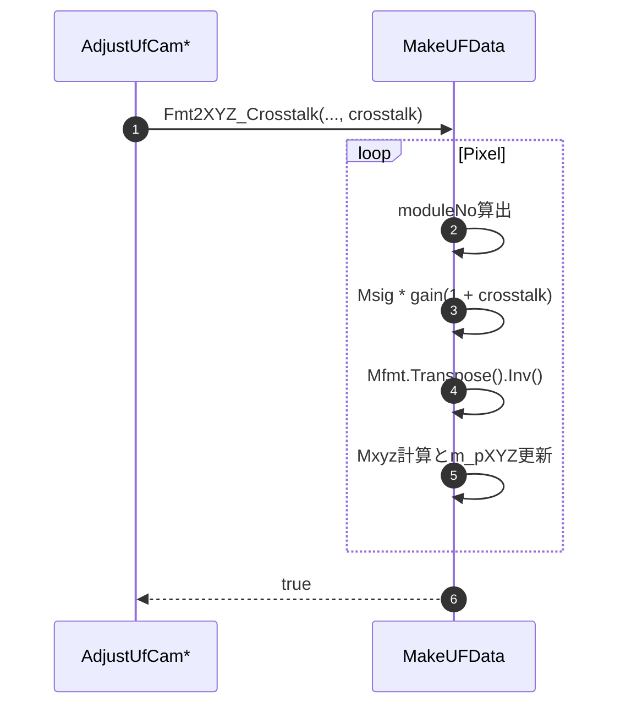
```mermaid
sequenceDiagram
    autonumber
    participant ADJ as AdjustUfCam*
    participant MK as MakeUFData

    ADJ->>MK: Fmt2XYZ_Crosstalk(..., crosstalk)
    loop Pixel
        MK->>MK: moduleNo算出
        MK->>MK: Msig * gain(1 + crosstalk)
        MK->>MK: Mfmt.Transpose().Inv()
        MK->>MK: Mxyz計算とm_pXYZ更新
    end
    MK-->>ADJ: true
```

#### 8-4-11. Statistics_CameraUF（MakeUFData）

| 項目 | 内容 |
|------|------|
| シグネチャ | bool m_MakeUFData.Statistics_CameraUF(UnitInfo unit, out double targetYw, out double targetYr, out double targetYg, out double targetYb) |
| 概要 | Crosstalk経路用の統計ラッパー。内部で `CalcFmt_CameraUF(unit, ...)` を呼び、その戻り値をそのまま返す。 |

引数

| No. | 引数名 | 型 | 必須 | 説明 |
|-----|--------|----|------|------|
| 1 | unit | UnitInfo | Y | 対象Cabinet識別情報 |
| 2 | targetYw/targetYr/targetYg/targetYb(out) | double | Y | Cabinet単位のRGBW目標輝度 |

返り値: bool（成功=true）

処理概要（詳細）

| 手順No. | 処理内容 | 詳細 |
|---------|----------|------|
| 1 | 入力受領 | `unit` と out引数を受け取る。 |
| 2 | 実処理委譲 | `CalcFmt_CameraUF(unit, out targetYw, out targetYr, out targetYg, out targetYb)` を実行する。 |
| 3 | 戻り値返却 | `CalcFmt_CameraUF` の戻り値 `status` をそのまま返す。 |

`CalcFmt_CameraUF` 内の主要処理

| 手順No. | 処理内容 | 詳細 |
|---------|----------|------|
| 1 | 前提確認 | `m_pXYZ == null` の場合は `m_LastErrorMessage` を設定して `false` を返す。 |
| 2 | 作業バッファ初期化 | `m_pFmtCreated = new float[dx * dy * 9]` を確保する。 |
| 3 | 画素ループ | `m_CorTarget[x,y][0..8]` を用いて信号色空間を再構築し、`m_pXYZ` との比から `m_pFmtCreated` を計算する。 |
| 4 | 異常画素処理 | `Yr/Yg/Yb` のいずれかが0の画素は当該9要素を0で埋める。 |
| 5 | 結果返却 | 正常完了で `true` を返す。 |

入力条件・前提条件

| 区分 | 条件 | NG時挙動 |
|------|------|----------|
| 前段処理 | `ModifyXYZCam*` により `m_CorTarget` と `m_pXYZ` が更新済みであること | `CalcFmt_CameraUF` で失敗または不正値 |
| 対象データ | `m_pXYZ` がnullでないこと | `false` 返却（`m_LastErrorMessage` 設定） |
| 呼出し分岐 | `ForCrosstalkCameraUF` 有効であること | 非Crosstalk時は `Statistics` を呼ぶ |

主要呼出し先

| 呼出し先 | 役割 | 同期/非同期 |
|----------|------|--------------|
| `CalcFmt_CameraUF` | CameraUF用に `m_pFmtCreated` を生成し `targetY*` を出力 | 同期 |
| `xyToXZ` / `ColMtx` | 色空間変換と行列演算 | 同期 |

呼出し元での使用条件

| 条件 | 呼出し元の挙動 |
|------|----------------|
| `ForCrosstalkCameraUF` 有効 | 本メソッドを呼ぶ |
| `ForCrosstalkCameraUF` 無効 | `Statistics(-1, ...)` を呼ぶ |

条件分岐仕様

| 条件 | 挙動 |
|------|------|
| `CalcFmt_CameraUF` 成功 | `true` を返して `OverWritePixelData` へ進む。 |
| `CalcFmt_CameraUF` 失敗 | `false` を返し、呼出し元が `Failed in Statistics.` を送出する。 |

出力値の実装上の補足

| 項目 | 実装上の挙動 |
|------|--------------|
| `targetYw` | 画素ループ中に `m_CorTarget[x,y][6]` を反映（最終的に最後の画素値が保持される実装）。 |
| `targetYr/targetYg/targetYb` | `CalcFmt_CameraUF` 内では初期化後に更新されず 0 のまま返却される実装。 |

例外時仕様

| ケース | 捕捉方法 | 通知/伝播 | 後処理 |
|--------|----------|-----------|--------|
| `m_pXYZ` 未設定 | `CalcFmt_CameraUF` が `false` 返却 | 呼出元で `Failed in Statistics.` | 当該Unit処理を中断 |
| 行列演算/配列参照例外 | 実行時例外 | 呼出元へ例外伝播（`status != true` 判定前に中断） | 当該Unit処理を中断 |

シーケンス図

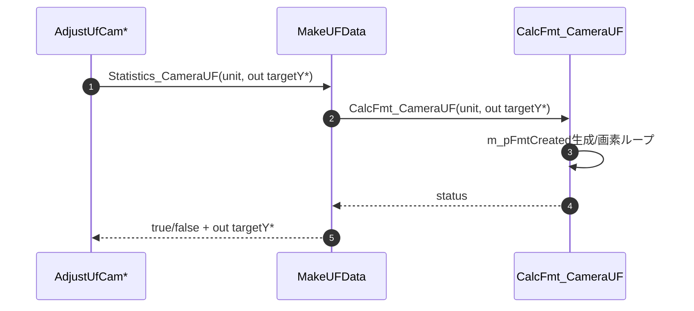
```mermaid
sequenceDiagram
    autonumber
    participant ADJ as AdjustUfCam*
    participant MK as MakeUFData
    participant CF as CalcFmt_CameraUF

    ADJ->>MK: Statistics_CameraUF(unit, out targetY*)
    MK->>CF: CalcFmt_CameraUF(unit, out targetY*)
    CF->>CF: m_pFmtCreated生成/画素ループ
    CF-->>MK: status
    MK-->>ADJ: true/false + out targetY*
```

#### 8-4-12. CalcReferenceValue

| 項目 | 内容 |
|------|------|
| シグネチャ | `private void CalcReferenceValue(UfCamCabinetCpInfo unitCpInfo, List<UfCamCorrectionPoint> lstRefPoints, ObjectiveLine objEdge, out UfCamCorrectionPoint refPt)` |
| 概要 | 調整対象Cabinetの基準画素値（R/G/B）を、Base Cabinetモード（Default/Cabinet/Line）に応じて算出する。 |

引数

| No. | 引数名 | 型 | 必須 | 説明 |
|-----|--------|----|------|------|
| 1 | unitCpInfo | UfCamCabinetCpInfo | Y | 調整対象Cabinetの補正点情報 |
| 2 | lstRefPoints | List<UfCamCorrectionPoint> | Y | 基準点群 |
| 3 | objEdge | ObjectiveLine | N | 基準ライン指定（null は Default/Cabinet 基準） |
| 4 | refPt(out) | UfCamCorrectionPoint | Y | 算出した基準目標値 |

返り値: なし（void）

処理概要（詳細）

| 手順No. | 処理内容 | 詳細 |
|---------|----------|------|
| 1 | Base Cabinet判定 | `objEdge == null` の場合は `lstRefPoints[0]` をそのまま `refPt` に設定して終了する。 |
| 2 | lineCount算出 | `objEdge.Top/Bottom/Left/Right` の true 数をカウントする。 |
| 3 | lineCount==1処理 | Top/Bottom指定時は `pt.Unit.X == unitCpInfo.Unit.X`、Left/Right指定時は `pt.Unit.Y == unitCpInfo.Unit.Y` を満たす基準点を平均する。 |
| 4 | lineCount==2処理 | 水平平均（X一致）`refPtH` と垂直平均（Y一致）`refPtV` をそれぞれ算出し、`distH`/`distV` による距離荷重平均で `refPt` を合成する。 |
| 5 | 戻り値設定 | `refPt.Unit` は `refPtH.Unit` を採用する。lineCount が 1/2 以外なら例外送出する。 |

実装上の補足

| 項目 | 内容 |
|------|------|
| lineCount==2 の辺種別 | 実装は「どの2辺か」を分岐せず、常に X一致平均 + Y一致平均の2系統で計算する。 |
| `refPtH/refPtV.CameraArea.StartPos` | `centerX/centerY` を加算していないため、実装上は `(0,0)` が設定される。 |
| `tgtCt` | 調整対象Cabinet中心座標を計算するが、後続の重み計算には使用しない。 |

入力条件・前提条件

| 区分 | 条件 | NG時挙動 |
|------|------|----------|
| 実行前提 | `unitCpInfo`、`lstRefPoints` が有効であること | 実行時例外の可能性 |
| Base Cabinet = Default/Cabinet | `lstRefPoints` が1件以上あること | `lstRefPoints[0]` アクセスで例外 |
| Base Cabinet = Line | lineCount が 1 または 2 であること | `Incorrect number of lines selected.` 例外 |

条件分岐仕様

| 条件 | 挙動 |
|------|------|
| `objEdge == null` | Default/Cabinet 基準として `lstRefPoints[0]` を採用する。 |
| `lineCount == 1` | Top/BottomならX一致平均、Left/RightならY一致平均を `refPt` に設定する。 |
| `lineCount == 2` | X一致平均 `refPtH` とY一致平均 `refPtV` を `distH/distV` の荷重で合成する。 |
| その他 | `Incorrect number of lines selected.` 例外を送出する。 |

主要呼出し先

| 呼出し先 | 役割 | 同期/非同期 |
|----------|------|--------------|
| `AdjustUfCamCabinet` / `AdjustUfCam9pt` / `AdjustUfCamRadiator` / `AdjustUfCamEachModule` | 補正ループ内で基準値算出に利用 | 同期 |
| `Math.Abs` | 距離重み付け計算（`distH`/`distV`） | 同期 |

例外時仕様

| ケース | 捕捉方法 | 通知/伝播 | 後処理 |
|--------|----------|-----------|--------|
| ライン指定本数不正 | `lineCount` 判定 | 例外を上位へ送出 | 当該Cabinet処理中断 |
| 基準点不足 | 平均算出時（count==0） | 0除算回避で `count=1` として継続 | 平均値は安全側で算出 |
| Default/Cabinetで基準点0件 | `lstRefPoints[0]` アクセス | 実行時例外を上位へ伝播 | 当該Cabinet処理中断 |
| `distH + distV == 0` | 距離荷重平均時の分母 | 実行時に不正値（Infinity/NaN）となる可能性 | 後続処理へ不正値伝播 |

シーケンス図

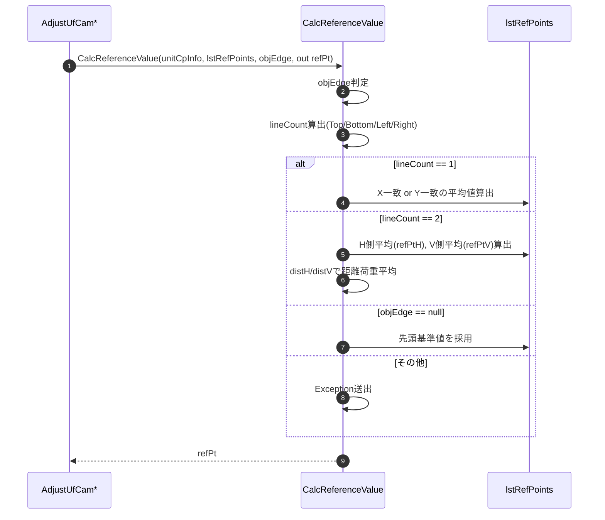
```mermaid
sequenceDiagram
    autonumber
    participant ADJ as AdjustUfCam*
    participant REF as CalcReferenceValue
    participant PTS as lstRefPoints

    ADJ->>REF: CalcReferenceValue(unitCpInfo, lstRefPoints, objEdge, out refPt)
    REF->>REF: objEdge判定
    REF->>REF: lineCount算出(Top/Bottom/Left/Right)
    alt lineCount == 1
        REF->>PTS: X一致 or Y一致の平均値算出
    else lineCount == 2
        REF->>PTS: H側平均(refPtH), V側平均(refPtV)算出
        REF->>REF: distH/distVで距離荷重平均
    else objEdge == null
        REF->>PTS: 先頭基準値を採用
    else その他
        REF->>REF: Exception送出
    end
    REF-->>ADJ: refPt
```

#### 8-4-13. OverWritePixelData（MakeUFData）

| 項目 | 内容 |
|------|------|
| シグネチャ | `public bool m_MakeUFData.OverWritePixelData(string fileName, string ledModel, bool allowCvLimit = false)` |
| 概要 | 補正済み画素データ（m_pFmtCreated）を元 hc.bin へ上書きし、Module単位CRCと全体CRCを再計算して adjusted hc.bin を生成する。 |

引数

| No. | 引数名 | 型 | 必須 | 説明 |
|-----|--------|----|------|------|
| 1 | fileName | string | Y | 出力先 adjusted hc.bin パス |
| 2 | ledModel | string | Y | LEDモデル名（データ長/Module構成判定に使用） |
| 3 | allowCvLimit | bool | N | 補正値パック時の制限許可フラグ（既定 false） |

返り値: bool（成功=true）

処理概要（詳細）

| 手順No. | 処理内容 | 詳細 |
|---------|----------|------|
| 1 | 元データ読込 | `m_SourceCellDataFileName` の hc.bin を読込み、出力バッファへ複製する。 |
| 2 | モデル別長さ決定 | `ledModel` に応じて `hcDataLength`、`hcModuleDataLength`、`hcCcDataLength` を選択する。 |
| 3 | Moduleループ処理 | Moduleごとに画素補正領域を取り出し、`m_pFmtCreated` から 9要素を読んで `PackCcDataPat3(..., allowCvLimit)` で8byteへパックして上書きする。 |
| 4 | Module CRC更新 | Module内のCCデータCRCとHeader CRCを再計算して更新する。 |
| 5 | 全体CRC更新・書出し | 全体データCRCと先頭Header CRCを再計算し、`fileName` に書き出して true を返す。 |

入力条件・前提条件

| 区分 | 条件 | NG時挙動 |
|------|------|----------|
| 前段処理 | `ExtractFmt` / `Fmt2XYZ` / `ModifyXYZCam` / `Statistics*` が成功し、`m_pFmtCreated` が更新済みであること | 不正データ書込みまたは失敗 |
| 入力ファイル | `m_SourceCellDataFileName` が存在し読込み可能であること | 例外送出 |
| 出力先 | `fileName` の親ディレクトリへ書込み可能であること | 例外送出 |

条件分岐仕様

| 条件 | 挙動 |
|------|------|
| LEDモデル種別 | P1.2/P1.5、4x2/4x3 構成に応じてデータ長を切替える。 |
| `allowCvLimit` | `PackCcDataPat3` 内の補正値制限可否を切替える。 |
| 例外発生 | 呼出元（AdjustUfCam*）側で捕捉し、`Failed in OverWritePixelData.` として処理を中断する。 |

主要呼出し先

| 呼出し先 | 役割 | 同期/非同期 |
|----------|------|--------------|
| `AdjustUfCamCabinet` / `AdjustUfCam9pt` / `AdjustUfCamRadiator` / `AdjustUfCamEachModule` | 調整ファイル生成で呼出し | 同期 |
| `CMakeUFData.PackCcDataPat3` | 画素補正値を8byte形式へパック | 同期 |
| `MainWindow.CalcCrc` | Module/全体CRC再計算 | 同期 |
| `File.ReadAllBytes` / `File.WriteAllBytes` | 元データ読込とadjustedファイル出力 | 同期 |

例外時仕様

| ケース | 捕捉方法 | 通知/伝播 | 後処理 |
|--------|----------|-----------|--------|
| 元データ読込失敗 | 下位例外 | 上位へ送出 | 当該Cabinet処理中断 |
| CRC更新・書出し失敗 | 下位例外 | 上位へ送出 | `lstMoveFile` へ未登録 |
| 戻り値 false | 呼出元判定 | `Failed in OverWritePixelData.` | 当該Cabinet処理中断 |

シーケンス図

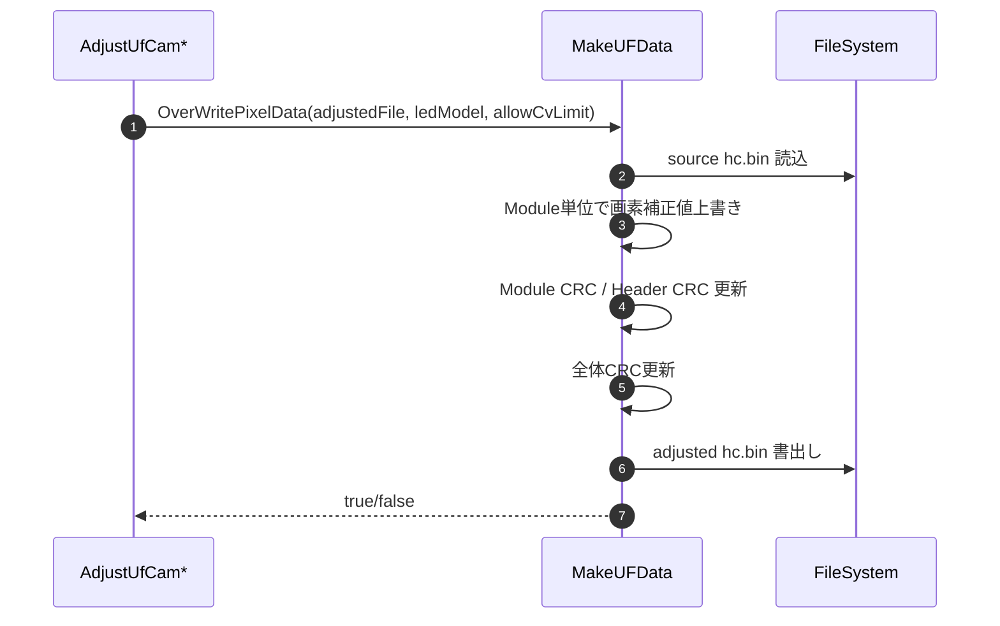
```mermaid
sequenceDiagram
    autonumber
    participant ADJ as AdjustUfCam*
    participant MK as MakeUFData
    participant FS as FileSystem

    ADJ->>MK: OverWritePixelData(adjustedFile, ledModel, allowCvLimit)
    MK->>FS: source hc.bin 読込
    MK->>MK: Module単位で画素補正値上書き
    MK->>MK: Module CRC / Header CRC 更新
    MK->>MK: 全体CRC更新
    MK->>FS: adjusted hc.bin 書出し
    MK-->>ADJ: true/false
```

#### 8-4-14. OverWritePixelDataWithCrosstalk（MakeUFData）

| 項目 | 内容 |
|------|------|
| シグネチャ | `public bool m_MakeUFData.OverWritePixelDataWithCrosstalk(string fileName, string ledModel, bool allowCvLimit = false)` |
| 概要 | クロストーク補正値をModuleヘッダへ反映しつつ、対象Moduleの画素補正値を上書きしてCRCを再計算し、adjusted hc.bin を生成する。 |

引数

| No. | 引数名 | 型 | 必須 | 説明 |
|-----|--------|----|------|------|
| 1 | fileName | string | Y | 出力先 adjusted hc.bin パス |
| 2 | ledModel | string | Y | LEDモデル名（データ長/Module構成判定に使用） |
| 3 | allowCvLimit | bool | N | 補正値パック時の制限許可フラグ（既定 false） |

返り値: bool（成功=true）

処理概要（詳細）

| 手順No. | 処理内容 | 詳細 |
|---------|----------|------|
| 1 | 元データ読込 | `m_SourceCellDataFileName` を読込み、出力バッファへ複製する。 |
| 2 | モデル別長さ決定 | `ledModel` に応じて `hcDataLength`、`hcModuleDataLength`、`hcCcDataLength` を選択する。 |
| 3 | クロストーク情報反映 | `m_IsCtcOverwrite` かつ `m_CorUncCrosstalk` に対象Moduleが存在する場合、VDIを1へ更新し、R/G/Bクロストーク高色補正値を書き込む。 |
| 4 | 画素補正値上書き | `m_CorUncCrosstalk` に対象Moduleが存在する場合のみ、`m_pFmtCreated` を `PackCcDataPat3(..., allowCvLimit)` で8byte化して画素領域へ反映する。 |
| 5 | CRC再計算・書出し | Module単位CRC、全体CRC、Header CRCを再計算し、`fileName` へ書き出して true を返す。 |

入力条件・前提条件

| 区分 | 条件 | NG時挙動 |
|------|------|----------|
| 前段処理 | `m_pFmtCreated` と `m_CorUncCrosstalk` が対象Moduleに対して準備済みであること | 対象Module反映漏れまたは失敗 |
| 入力ファイル | `m_SourceCellDataFileName` が存在し読込み可能であること | 例外送出 |
| クロストーク値 | `m_CorUncCrosstalk` の R/G/B 値が `float` 範囲内であること | false を返却 |

条件分岐仕様

| 条件 | 挙動 |
|------|------|
| LEDモデル種別 | P1.2/P1.5、4x2/4x3 構成に応じてデータ長を切替える。 |
| `m_IsCtcOverwrite` かつ対象Module存在 | VDIを有効化し、クロストーク高色補正値を書き込む。 |
| 対象Module非該当 | 画素補正値上書きを行わず、既存値を維持してCRC更新のみ行う。 |
| クロストーク値範囲外 | false を返して中断する。 |

主要呼出し先

| 呼出し先 | 役割 | 同期/非同期 |
|----------|------|--------------|
| `CMakeUFData.PackCcDataPat3` | 画素補正値を8byte形式へパック | 同期 |
| `MainWindow.CalcCrc` | Module/全体CRC再計算 | 同期 |
| `File.ReadAllBytes` / `File.WriteAllBytes` | 元データ読込とadjustedファイル出力 | 同期 |
| `BitConverter.GetBytes` | クロストーク補正値のbyte列化 | 同期 |

例外時仕様

| ケース | 捕捉方法 | 通知/伝播 | 後処理 |
|--------|----------|-----------|--------|
| 元データ読込/書出し失敗 | 下位例外 | 上位へ送出 | 当該処理中断 |
| クロストーク値範囲外 | 範囲判定（float変換前） | false を返却 | 当該Module以降処理中断 |
| 呼出元判定で失敗 | 戻り値 false | 呼出元で失敗通知 | 当該Cabinet処理中断 |

シーケンス図

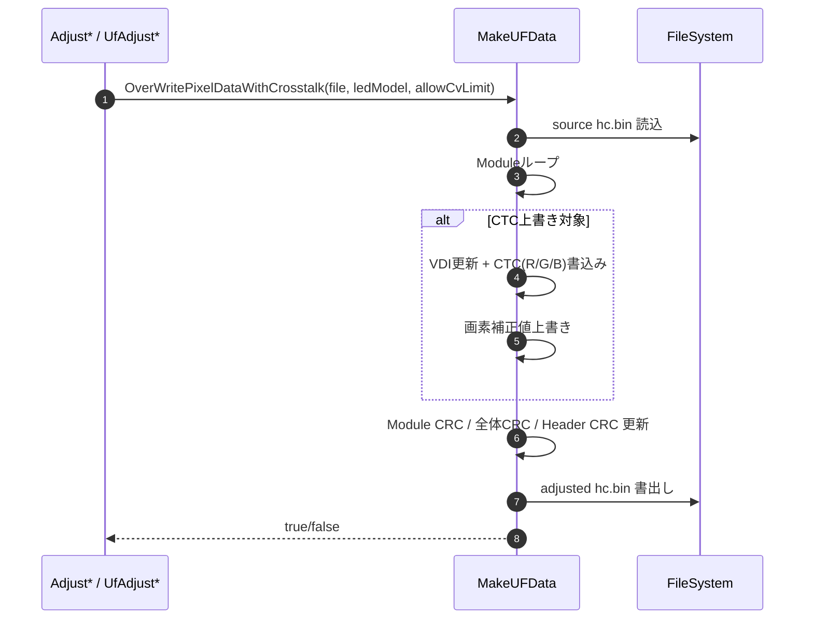
```mermaid
sequenceDiagram
    autonumber
    participant CALLER as Adjust* / UfAdjust*
    participant MK as MakeUFData
    participant FS as FileSystem

    CALLER->>MK: OverWritePixelDataWithCrosstalk(file, ledModel, allowCvLimit)
    MK->>FS: source hc.bin 読込
    MK->>MK: Moduleループ
    alt CTC上書き対象
        MK->>MK: VDI更新 + CTC(R/G/B)書込み
        MK->>MK: 画素補正値上書き
    end
    MK->>MK: Module CRC / 全体CRC / Header CRC 更新
    MK->>FS: adjusted hc.bin 書出し
    MK-->>CALLER: true/false
```

#### 8-4-15. OverWritePixelData系メソッド差分比較

| 比較観点 | OverWritePixelData | OverWritePixelDataWithCrosstalk |
|----------|--------------------|----------------------------------|
| 主目的 | 補正画素値の上書きとCRC更新 | 補正画素値上書き + クロストーク情報（VDI/高色補正値）反映 |
| シグネチャ | `OverWritePixelData(fileName, ledModel, allowCvLimit=false)` | `OverWritePixelDataWithCrosstalk(fileName, ledModel, allowCvLimit=false)` |
| 画素上書き対象 | 全Module（ループ全域） | `m_CorUncCrosstalk` に存在するModuleのみ |
| CTCデータ書込み | なし | `m_IsCtcOverwrite` かつ対象Module存在時に実施 |
| VDI更新 | なし | CTC Data Valid Indicator を有効化 |
| 追加変換処理 | なし | `BitConverter.GetBytes` で CTC(R/G/B) をbyte列化 |
| 共通処理 | LEDモデル別データ長切替、`PackCcDataPat3`、Module/全体CRC再計算、`File.WriteAllBytes` | 同左 |
| 失敗戻り | 例外中心（呼出元捕捉） | 例外に加えてCTC値範囲外で `false` を返却 |

使い分け指針

| 条件 | 選択すべきメソッド |
|------|---------------------|
| クロストーク補正を反映しない通常調整 | `OverWritePixelData` |
| クロストーク補正値（VDI/高色補正値）をhc.binへ反映する調整 | `OverWritePixelDataWithCrosstalk` |

呼出し元一覧

| 呼出し元 | OverWritePixelData | OverWritePixelDataWithCrosstalk | 備考 |
|----------|--------------------|----------------------------------|------|
| `AdjustUfCamCabinet`（UfCamera） | ○ | - | `m_MakeUFData.OverWritePixelData(..., true)` を使用 |
| `AdjustUfCam9pt`（UfCamera） | ○ | - | `m_MakeUFData.OverWritePixelData(..., true)` を使用 |
| `AdjustUfCamRadiator`（UfCamera） | ○ | - | `m_MakeUFData.OverWritePixelData(..., true)` を使用 |
| `AdjustUfCamEachModule`（UfCamera） | ○ | - | `m_MakeUFData.OverWritePixelData(..., true)` を使用 |
| `UfAdjustCell` | ○ | ○ | 通常経路/クロストーク経路でメソッドを切替 |
| `UfAdjustUnit` | ○ | ○ | 通常経路/クロストーク経路でメソッドを切替 |
| `UfManual` | ○ | - | 手動補正フローで通常版を使用 |

#### 8-4-16. checkDataFile（UfAdjustUnit依存）

| 項目 | 内容 |
|------|------|
| シグネチャ | `private bool checkDataFile(List<UnitInfo> lstUnit, out FileDirectory targetDir, DataType dataType = DataType.HcData)` |
| 概要 | 指定Cabinet群について、バックアップディレクトリ階層（Latest/Previous/Initial）を順に探索し、対象データの存在可否と使用ディレクトリを返す。 |

引数

| No. | 引数名 | 型 | 必須 | 説明 |
|-----|--------|----|------|------|
| 1 | lstUnit | List<UnitInfo> | Y | 存在確認対象Cabinet一覧 |
| 2 | targetDir(out) | FileDirectory | Y | 発見したデータ格納ディレクトリ |
| 3 | dataType | DataType | N | 確認対象データ種別（既定: HcData） |

返り値: bool（全Cabinet分が存在するディレクトリを発見した場合 true）

処理概要（詳細）

| 手順No. | 処理内容 | 詳細 |
|---------|----------|------|
| 1 | ログ開始 | `Settings.Ins.ExecLog` が有効なら開始ログを出力する。 |
| 2 | Latest確認 | `Backup_Latest` 配下で全Cabinetのファイル存在を確認する。全件存在時は `targetDir=Backup_Latest` で true を返す。 |
| 3 | Previous確認 | Latest不成立時、`Backup_Previous` を同様に確認する。全件存在時は `targetDir=Backup_Previous` で true を返す。 |
| 4 | Initial確認 | Previous不成立時、`Backup_Initial` を同様に確認する。全件存在時は `targetDir=Backup_Initial` で true を返す。 |
| 5 | 失敗返却 | いずれも不成立の場合 `targetDir=Backup_Initial` を設定し false を返す。 |

入力条件・前提条件

| 区分 | 条件 | NG時挙動 |
|------|------|----------|
| 実行前提 | `lstUnit` が空でなく、対象Cabinet情報が有効であること | 全件確認不能で false の可能性 |
| ファイル体系 | バックアップフォルダ構成と `makeFilePath` 規約が整合していること | 既存データがあっても未検出となる可能性 |

条件分岐仕様

| 条件 | 挙動 |
|------|------|
| Latest 全件存在 | `targetDir=Backup_Latest`、true 返却 |
| Latest不成立かつ Previous 全件存在 | `targetDir=Backup_Previous`、true 返却 |
| 上記不成立かつ Initial 全件存在 | `targetDir=Backup_Initial`、true 返却 |
| 全フォルダ不成立 | `targetDir=Backup_Initial`、false 返却 |

主要呼出し先

| 呼出し先 | 役割 | 同期/非同期 |
|----------|------|--------------|
| `AdjustUfCamCabinet` / `AdjustUfCam9pt` / `AdjustUfCamRadiator` / `AdjustUfCamEachModule` | 補正元 `hc.bin` 存在確認 | 同期 |
| `makeFilePath` | Cabinet別データファイルパス生成 | 同期 |
| `File.Exists` | 実ファイル存在判定 | 同期 |

例外時仕様

| ケース | 捕捉方法 | 通知/伝播 | 後処理 |
|--------|----------|-----------|--------|
| ファイル未検出 | 戻り値 false | 呼出元で `The UF data file(hc.bin) was not found.` 例外化 | 当該調整処理中断 |
| ログ出力失敗 | 下位例外（内部で吸収） | 伝播なし | 存在確認処理は継続 |

シーケンス図

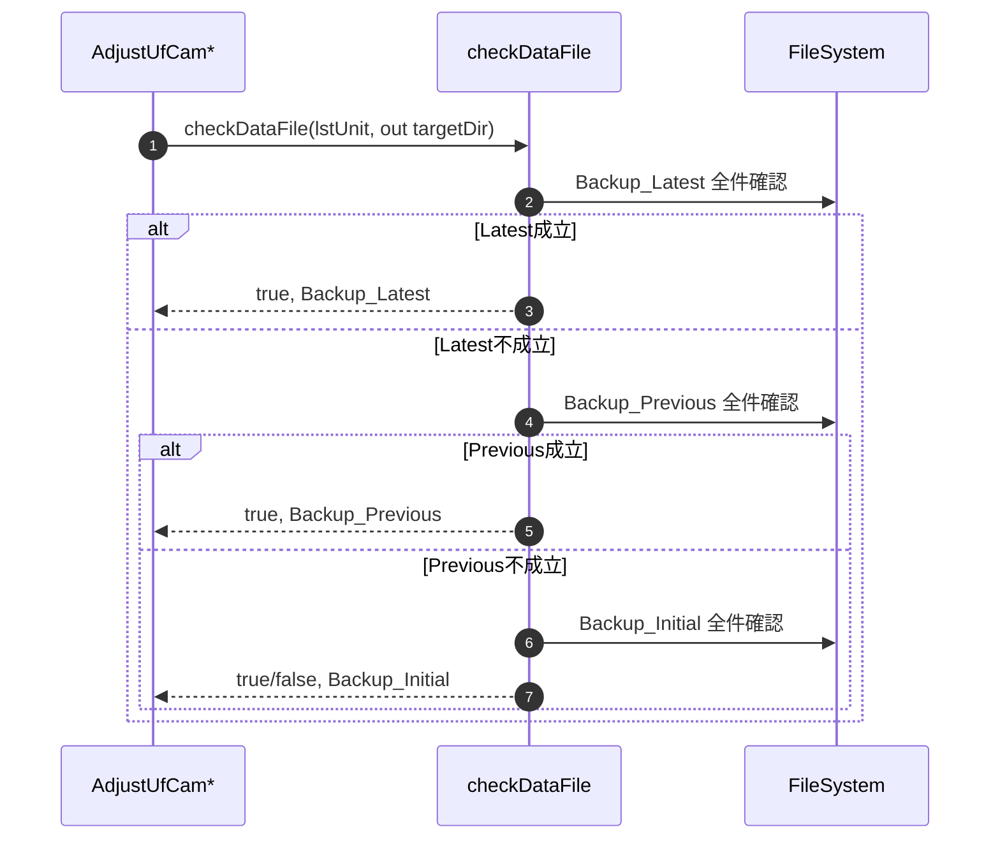
```mermaid
sequenceDiagram
    autonumber
    participant ADJ as AdjustUfCam*
    participant CHK as checkDataFile
    participant FS as FileSystem

    ADJ->>CHK: checkDataFile(lstUnit, out targetDir)
    CHK->>FS: Backup_Latest 全件確認
    alt Latest成立
        CHK-->>ADJ: true, Backup_Latest
    else Latest不成立
        CHK->>FS: Backup_Previous 全件確認
        alt Previous成立
            CHK-->>ADJ: true, Backup_Previous
        else Previous不成立
            CHK->>FS: Backup_Initial 全件確認
            CHK-->>ADJ: true/false, Backup_Initial
        end
    end
```
