---
#### 8-5-1-1. ShowLensCdFiles

| 項目 | 内容 |
|------|------|
| シグネチャ | `public void ShowLensCdFiles(int CameraSelection)` |
| 概要 | 選択カメラに応じてレンズCD候補をUIへ反映する。 |

引数

| No. | 引数名 | 型 | 必須 | 説明 |
|-----|--------|----|------|------|
| 1 | CameraSelection | int | Y | カメラ選択インデックス |

返り値: なし（void）

処理概要（詳細）

| 手順No. | 処理内容 | 詳細 |
|---------|----------|------|
| 1 | 前提確認 | 入力値・内部状態・依存リソースを確認する |
| 2 | 主処理実行 | 選択カメラに応じてレンズCD候補をUIへ反映する |
| 3 | 結果反映 | 呼出元へ成否を返し、必要な内部状態を更新する |

入力条件・前提条件

| 区分 | 条件 | NG時挙動 |
|------|------|----------|
| 実行前提 | 関連モジュール、設定、入出力パスが初期化済みであること | 例外送出または処理中断 |
| 入力値 | 引数値が仕様範囲内であること | 異常通知して処理中断 |

条件分岐仕様

| 条件 | 挙動 |
|------|------|
| 正常系 | 主処理を完了し結果を返却する |
| 異常系 | 例外時仕様に従って通知・復帰する |

主要呼出し先

| 呼出し先 | 役割 | 同期/非同期 |
|----------|------|--------------|
| `Directory.GetFiles` | レンズCDファイル一覧を取得する | 同期 |
| `cmbxUfCamLensCd.Items.Add` | U/Fカメラ用レンズ候補をUIへ追加する | 同期 |
| `cmbxGapCamLensCd.Items.Add` | Gapカメラ用レンズ候補をUIへ追加する | 同期 |

例外時仕様

| ケース | 捕捉方法 | 通知/伝播 | 後処理 |
|--------|----------|-----------|--------|
| 下位処理失敗 | 下位例外または戻り値異常 | 呼出元へ通知 | 安全停止または設定復帰 |

シーケンス図

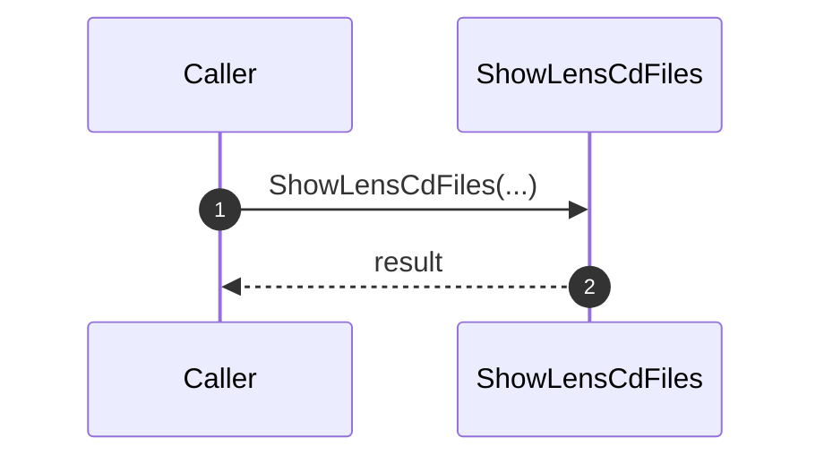

---

#### 8-5-1-2. ConnectCamera

| 項目 | 内容 |
|------|------|
| シグネチャ | `private void ConnectCamera()` |
| 概要 | U/Fカメラ接続と関連初期化を実行する。 |

引数: なし

返り値: なし（void）

処理概要（詳細）

| 手順No. | 処理内容 | 詳細 |
|---------|----------|------|
| 1 | 前提確認 | 入力値・内部状態・依存リソースを確認する |
| 2 | 主処理実行 | U/Fカメラ接続と関連初期化を実行する |
| 3 | 結果反映 | 呼出元へ成否を返し、必要な内部状態を更新する |

入力条件・前提条件

| 区分 | 条件 | NG時挙動 |
|------|------|----------|
| 実行前提 | 関連モジュール、設定、入出力パスが初期化済みであること | 例外送出または処理中断 |
| 入力値 | 引数値が仕様範囲内であること | 異常通知して処理中断 |

条件分岐仕様

| 条件 | 挙動 |
|------|------|
| 正常系 | 主処理を完了し結果を返却する |
| 異常系 | 例外時仕様に従って通知・復帰する |

主要呼出し先

| 呼出し先 | 役割 | 同期/非同期 |
|----------|------|--------------|
| Camera初期化 | カメラ接続・初期化 | 同期 |

例外時仕様

| ケース | 捕捉方法 | 通知/伝播 | 後処理 |
|--------|----------|-----------|--------|
| 下位処理失敗 | 下位例外または戻り値異常 | 呼出元へ通知 | 安全停止または設定復帰 |

シーケンス図

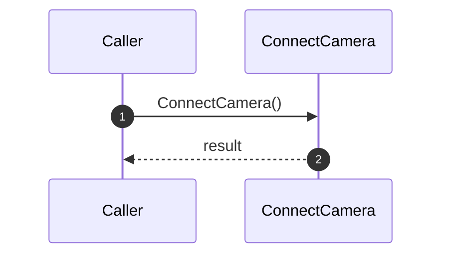

#### 8-5-1-3. DisconnectCamera

| 項目 | 内容 |
|------|------|
| シグネチャ | `private void DisconnectCamera()` |
| 概要 | U/Fカメラ切断と停止処理を実行する。 |

引数

引数: なし

返り値: なし（void）

処理概要（詳細）

| 手順No. | 処理内容 | 詳細 |
|---------|----------|------|
| 1 | 前提確認 | 入力値・内部状態・依存リソースを確認する。 |
| 2 | 主処理実行 | U/Fカメラ切断と停止処理を実行する。 |
| 3 | 結果反映 | 呼出元へ成否を返し、必要な内部状態を更新する。 |

入力条件・前提条件

| 区分 | 条件 | NG時挙動 |
|------|------|----------|
| 実行前提 | 関連モジュール、設定、入出力パスが初期化済みであること | 例外送出または処理中断 |
| 入力値 | 引数値が仕様範囲内であること | 異常通知して処理中断 |

条件分岐仕様

| 条件 | 挙動 |
|------|------|
| 正常系 | 主処理を完了し結果を返却する。 |
| 異常系 | 例外時仕様に従って通知・復帰する。 |

主要呼出し先

| 呼出し先 | 役割 | 同期/非同期 |
|----------|------|--------------|
| `CloseCamera` | カメラ接続を閉じる | 同期 |
| `KillCcProcess` | AlphaCameraController プロセスを終了する | 同期 |

例外時仕様

| ケース | 捕捉方法 | 通知/伝播 | 後処理 |
|--------|----------|-----------|--------|
| 下位処理失敗 | 下位例外または戻り値異常 | 呼出元へ通知 | 安全停止または設定復帰 |

シーケンス図

#### 8-5-1-4. CheckSelectedUnits

| 項目 | 内容 |
|------|------|
| シグネチャ | `private void CheckSelectedUnits(UnitToggleButton[,] aryUnit, out List<UnitInfo> lstTgtUnit)` |
| 概要 | 選択Cabinetの存在/矩形性/サイズ上限を検証し、調整対象一覧を確定する。内部では拡張オーバーロードへ委譲する。 |

引数

| No. | 引数名 | 型 | 必須 | 説明 |
|-----|--------|----|------|------|
| 1 | aryUnit | UnitToggleButton[,] | Y | UI上のCabinetトグル配列（`allocInfo.MaxX × allocInfo.MaxY`） |
| 2 | lstTgtUnit(out) | List<UnitInfo> | Y | 選択済みかつ妥当と判定された対象Cabinet一覧 |

返り値: なし（void）

内部実処理シグネチャ（委譲先）

`private void CheckSelectedUnits(UnitToggleButton[,] aryUnit, out List<UnitInfo> lstTgtUnit, bool cameraPos, out List<UnitInfo> lstCamPosUnit, bool standardSize = false)`

- 本メソッド（8-5-1-4）は `cameraPos=false` 固定で呼び出す。
- そのため、UfCamera経路では「カメラ位置合わせ用領域の拡張ロジック」には入らず、`lstCamPosUnit = lstTgtUnit` で終了する。

処理概要（詳細）

| 手順No. | 処理内容 | 詳細 |
|---------|----------|------|
| 1 | 委譲呼出し | `CheckSelectedUnits(aryUnit, out lstTgtUnit, false, out m_lstCamPosUnits)` を実行する。 |
| 2 | 選択一覧抽出 | 内部実処理で `aryUnit[x,y].IsChecked==true` を走査し、`lstTgtUnit` を構築。あわせて `minX/minY/maxX/maxY` を更新する。 |
| 3 | 矩形性検証 | `area=(maxX-minX+1)*(maxY-minY+1)` を計算し、`lstTgtUnit.Count==0` または `area!=Count` なら例外。 |
| 4 | サイズ上限決定 | `standardSize` と `allocInfo.LEDModel` から `lenMax` を決定する。通常は 8K4K相当（`CabinetLength_P12*2+1` または `CabinetLength_P15*2+1`）。 |
| 5 | 調整範囲検証 | `lenX/lenY/Count` が `lenMax` を超える場合は範囲外例外を送出する。 |
| 6 | UfCamera経路で終了 | `cameraPos!=true` のため `lstCamPosUnit=lstTgtUnit` を設定して return。 |

入力条件・前提条件

| 区分 | 条件 | NG時挙動 |
|------|------|----------|
| 配列整合性 | `aryUnit` が `allocInfo.MaxX/MaxY` と整合し、参照位置が有効であること | 実行時例外（Index/Null） |
| Unit情報 | 判定対象セルの `UnitInfo` が有効であること | 実行時例外、または範囲判定失敗 |
| 選択状態 | 少なくとも1Cabinet以上が選択され、かつ選択領域が矩形であること | 仕様例外を送出 |

条件分岐仕様

| 条件 | 挙動 |
|------|------|
| `lstTgtUnit.Count==0` または `area!=Count` | `"The target cabinet area is not selected, or  The selected area is not rectangular."` を送出する。 |
| `standardSize==false` | 上限を 8K4K相当で判定する。 |
| `standardSize==true` | 上限を 4K2K相当で判定する。 |
| `lenX>lenMax` または `lenY>lenMax` または `Count>lenMax^2` | 4K2K/8K4Kいずれかの範囲外例外を送出する。 |
| `cameraPos!=true`（UfCameraの実呼出し） | `lstCamPosUnit = lstTgtUnit` を設定して内部実処理を終了する。 |

参考: `cameraPos==true` 分岐（UfCamera経路では未使用）

- 連結成分（4近傍）で選択群を含む物理連続領域を抽出し、カメラ位置合わせ用に使用する `lstCamPosUnit` を決定する。
- 必要に応じて左右上下端を縮退し、`UnitInfo==null` を端から排除して最大矩形を確保する。
- 左端/右端Cabinetを見つけられない場合は専用例外を送出する。

主要呼出し先

| 呼出し先 | 役割 | 同期/非同期 |
|----------|------|--------------|
| `CheckSelectedUnits(..., cameraPos, out lstCamPosUnit, standardSize)` | 本メソッドの委譲先 | 同期 |
| `Cv2.ConnectedComponentsEx(..., Connectivity4)` | `cameraPos==true` 時の連続領域抽出 | 同期 |

主要呼出し元（UfCamera）

| 呼出し元 | 用途 |
|----------|------|
| `btnUfCamMeasExec_Click` 相当処理 | 計測開始前の対象妥当性確認 |
| `btnUfCamAdjustExec_Click` 相当処理 | 調整開始前の対象妥当性確認 |
| `AdjustCameraPosUf` 起動前処理 | カメラ位置合わせ開始前の対象妥当性確認 |

例外時仕様

| ケース | 捕捉方法 | 通知/伝播 | 後処理 |
|--------|----------|-----------|--------|
| 未選択/非矩形選択 | 明示 `throw new Exception(...)` | 呼出元へ伝播（UI側でメッセージ表示） | 当該処理中断 |
| 調整可能範囲超過 | 明示 `throw new Exception(...)` | 呼出元へ伝播（UI側でメッセージ表示） | 当該処理中断 |
| `cameraPos==true` で境界検出失敗 | 明示 `throw new Exception(...)` | 呼出元へ伝播 | 当該処理中断 |
| 配列/要素不整合 | 実行時例外（Null/Index） | 呼出元へ伝播 | 当該処理中断 |

シーケンス図

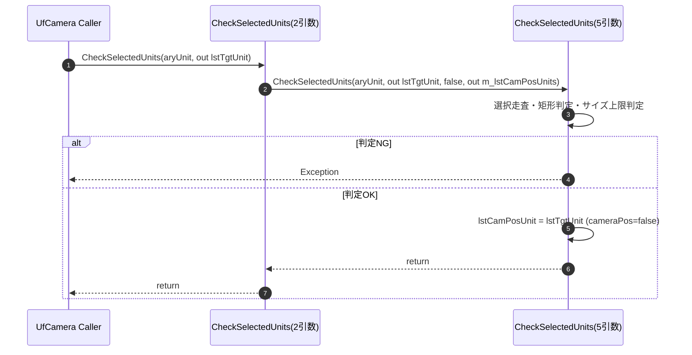

#### 8-5-1-5. CheckShootingDist

| 項目 | 内容 |
|------|------|
| シグネチャ | `private void CheckShootingDist(double dist)` |
| 概要 | 入力撮影距離 `dist` が LEDモデル別の許容範囲内かを判定し、範囲外なら例外で処理を停止する。 |

引数

| No. | 引数名 | 型 | 必須 | 説明 |
|-----|--------|----|------|------|
| 1 | dist | double | Y | 撮影距離[mm] |

返り値: なし（void）

処理概要（詳細）

| 手順No. | 処理内容 | 詳細 |
|---------|----------|------|
| 1 | LEDモデル分類 | `allocInfo.LEDModel` が P1.2系か否かを判定する。 |
| 2 | 閾値設定 | P1.2系なら `distNearLimit=3600`、`distFarLimit=8800`。それ以外なら `distNearLimit=4500`、`distFarLimit=11000` を設定する。 |
| 3 | 範囲判定 | `dist < distNearLimit` または `distFarLimit < dist` のとき例外を送出する。 |
| 4 | 正常終了 | 範囲内なら何もせず return する。 |

モデル別閾値一覧

| 分類 | 近距離閾値[mm] | 遠距離閾値[mm] |
|------|----------------|----------------|
| P1.2系 | 3600 | 8800 |
| P1.5系（上記以外） | 4500 | 11000 |

入力条件・前提条件

| 区分 | 条件 | NG時挙動 |
|------|------|----------|
| 実行前提 | `allocInfo` および `allocInfo.LEDModel` が初期化済みであること | 実行時例外 |
| 入力値 | `dist` が数値として有効であること | 呼出し元で `double.Parse` 失敗時に例外 |

条件分岐仕様

| 条件 | 挙動 |
|------|------|
| `allocInfo.LEDModel` が `ZRD_C12A / ZRD_B12A / ZRD_CH12D / ZRD_BH12D / ZRD_CH12D_S3 / ZRD_BH12D_S3` | P1.2系閾値を使用 |
| 上記以外 | P1.5系閾値を使用 |
| `dist < near` または `far < dist` | `"The shooting distance exceeds the UF adjustable distance."` を送出 |
| `near <= dist <= far` | 例外なしで正常終了 |

主要呼出し先

| 呼出し先 | 役割 | 同期/非同期 |
|----------|------|--------------|
| なし | 本メソッド内で判定のみ実施する | 同期 |

主要呼出し元（UfCamera）

| 呼出し元 | 用途 |
|----------|------|
| `btnUfCamMeasExec_Click` 相当処理 | 計測開始時の撮影距離検証 |
| `btnUfCamAdjustExec_Click` 相当処理 | 調整開始時の撮影距離検証 |
| `AdjustCameraPosUf` 起動前処理 | カメラ位置合わせ開始時の撮影距離検証 |

例外時仕様

| ケース | 捕捉方法 | 通知/伝播 | 後処理 |
|--------|----------|-----------|--------|
| 許容範囲外距離 | 明示 `throw new Exception(...)` | 呼出元へ伝播（UI側でエラーダイアログ表示） | 当該フロー中断 |
| `dist` の数値変換失敗 | 呼出し元 `double.Parse` 例外 | 呼出元へ伝播 | 当該フロー中断 |
| `allocInfo` 未初期化等 | 実行時例外 | 呼出元へ伝播 | 当該フロー中断 |

シーケンス図

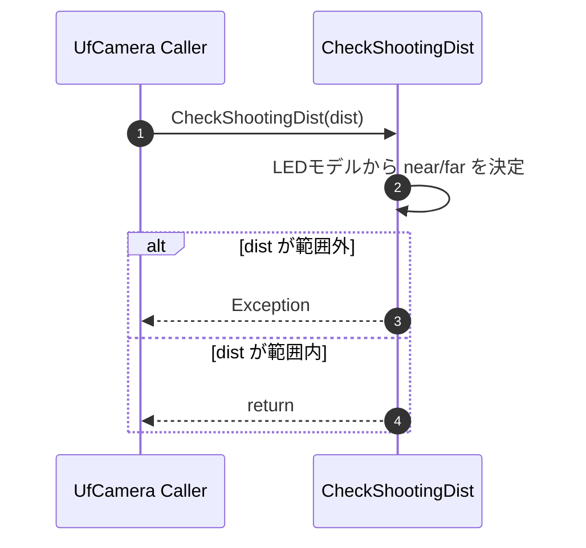

#### 8-5-1-6. ManageLogGen

| 項目 | 内容 |
|------|------|
| シグネチャ | `private void ManageLogGen(string dir, string key)` |
| 概要 | ログ世代を上限管理して古い世代を削除する。 |

引数

| No. | 引数名 | 型 | 必須 | 説明 |
|-----|--------|----|------|------|
| 1 | dir | string | Y | ログ格納ディレクトリ |`n| 2 | key | string | Y | 世代管理キー |

返り値: なし（void）

処理概要（詳細）

| 手順No. | 処理内容 | 詳細 |
|---------|----------|------|
| 1 | 前提確認 | 入力値・内部状態・依存リソースを確認する。 |
| 2 | 主処理実行 | ログ世代を上限管理して古い世代を削除する。 |
| 3 | 結果反映 | 呼出元へ成否を返し、必要な内部状態を更新する。 |

入力条件・前提条件

| 区分 | 条件 | NG時挙動 |
|------|------|----------|
| 実行前提 | 関連モジュール、設定、入出力パスが初期化済みであること | 例外送出または処理中断 |
| 入力値 | 引数値が仕様範囲内であること | 異常通知して処理中断 |

条件分岐仕様

| 条件 | 挙動 |
|------|------|
| 正常系 | 主処理を完了し結果を返却する。 |
| 異常系 | 例外時仕様に従って通知・復帰する。 |

主要呼出し先

| 呼出し先 | 役割 | 同期/非同期 |
|----------|------|--------------|
| `Directory.GetDirectories` | 対象ログ世代のディレクトリ一覧を取得する | 同期 |
| `DateTime.ParseExact` | 世代キーの日付文字列を解析する | 同期 |
| `Directory.Delete` | 上限超過した旧世代ログを削除する | 同期 |

例外時仕様

| ケース | 捕捉方法 | 通知/伝播 | 後処理 |
|--------|----------|-----------|--------|
| 下位処理失敗 | 下位例外または戻り値異常 | 呼出元へ通知 | 安全停止または設定復帰 |

シーケンス図

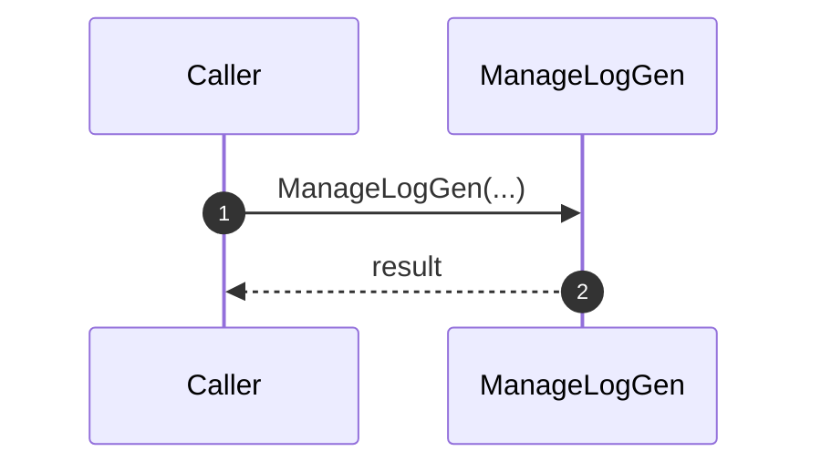

#### 8-5-1-7. SetThroughMode

| 項目 | 内容 |
|------|------|
| シグネチャ | `private bool SetThroughMode(bool flag)` |
| 概要 | 全ControllerへThroughModeを反映する。 |

引数

| No. | 引数名 | 型 | 必須 | 説明 |
|-----|--------|----|------|------|
| 1 | flag | bool | Y | ThroughMode設定値 |

返り値: bool

処理概要（詳細）

| 手順No. | 処理内容 | 詳細 |
|---------|----------|------|
| 1 | 前提確認 | 入力値・内部状態・依存リソースを確認する。 |
| 2 | 主処理実行 | 全ControllerへThroughModeを反映する。 |
| 3 | 結果反映 | 呼出元へ成否を返し、必要な内部状態を更新する。 |

入力条件・前提条件

| 区分 | 条件 | NG時挙動 |
|------|------|----------|
| 実行前提 | 関連モジュール、設定、入出力パスが初期化済みであること | 例外送出または処理中断 |
| 入力値 | 引数値が仕様範囲内であること | 異常通知して処理中断 |

条件分岐仕様

| 条件 | 挙動 |
|------|------|
| 正常系 | 主処理を完了し結果を返却する。 |
| 異常系 | 例外時仕様に従って通知・復帰する。 |

主要呼出し先

| 呼出し先 | 役割 | 同期/非同期 |
|----------|------|--------------|
| `sendSdcpCommand` | ThroughMode ON/OFF コマンドを全Controllerへ送信する | 同期 |

例外時仕様

| ケース | 捕捉方法 | 通知/伝播 | 後処理 |
|--------|----------|-----------|--------|
| 下位処理失敗 | 下位例外または戻り値異常 | 呼出元へ通知 | 安全停止または設定復帰 |

シーケンス図

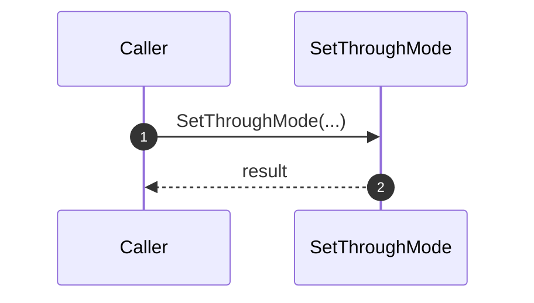

#### 8-5-1-8. dispUfMeasResult

| 項目 | 内容 |
|------|------|
| シグネチャ | `private void dispUfMeasResult()` |
| 概要 | 計測結果を集計してUIへ表示する。 |

引数

引数: なし

返り値: なし（void）

処理概要（詳細）

| 手順No. | 処理内容 | 詳細 |
|---------|----------|------|
| 1 | 前提確認 | 入力値・内部状態・依存リソースを確認する。 |
| 2 | 主処理実行 | 計測結果を集計してUIへ表示する。 |
| 3 | 結果反映 | 呼出元へ成否を返し、必要な内部状態を更新する。 |

入力条件・前提条件

| 区分 | 条件 | NG時挙動 |
|------|------|----------|
| 実行前提 | 関連モジュール、設定、入出力パスが初期化済みであること | 例外送出または処理中断 |
| 入力値 | 引数値が仕様範囲内であること | 異常通知して処理中断 |

条件分岐仕様

| 条件 | 挙動 |
|------|------|
| 正常系 | 主処理を完了し結果を返却する。 |
| 異常系 | 例外時仕様に従って通知・復帰する。 |

主要呼出し先

| 呼出し先 | 役割 | 同期/非同期 |
|----------|------|--------------|
| 測定結果集計ループ | Cabinet/Module ごとの Min/Max/Ave を算出する | 同期 |
| UI表示更新 | 集計結果を画面項目へ反映する | 同期 |

例外時仕様

| ケース | 捕捉方法 | 通知/伝播 | 後処理 |
|--------|----------|-----------|--------|
| 下位処理失敗 | 下位例外または戻り値異常 | 呼出元へ通知 | 安全停止または設定復帰 |

シーケンス図

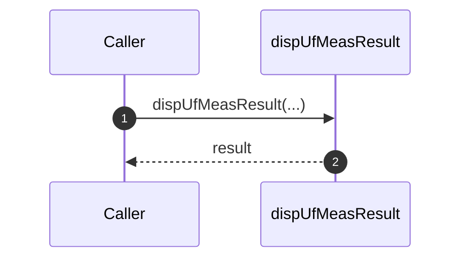

#### 8-5-1-9. StartCameraController

| 項目 | 内容 |
|------|------|
| シグネチャ | `private void StartCameraController()` |
| 概要 | AlphaCameraController プロセスの起動状態を確認し、未起動時のみ実行ファイルを起動する。 |

引数

引数: なし

返り値: なし（void）

処理概要（詳細）

| 手順No. | 処理内容 | 詳細 |
|---------|----------|------|
| 1 | 起動状態確認 | `ChechCcProcess()` を呼び出し、`AlphaCameraController` プロセスの存在を確認する。 |
| 2 | 起動情報構築 | 未起動時は `ProcessStartInfo` を生成し、`applicationPath\\Components\\AlphaCameraController.exe` を実行対象に設定する。 |
| 3 | プロセス起動 | `Process.Start(...)` でカメラ制御プロセスを起動する。 |

入力条件・前提条件

| 区分 | 条件 | NG時挙動 |
|------|------|----------|
| 実行前提 | `applicationPath` が有効で、コンポーネント実行ファイルが配置済みであること | 起動失敗で下位例外 |
| 依存処理 | 呼出し元が撮影/AF/接続処理の開始前に呼び出すこと | カメラ制御ファイル反映失敗の可能性 |

条件分岐仕様

| 条件 | 挙動 |
|------|------|
| `ChechCcProcess() == true` | 既存プロセスを再利用し、起動処理を行わない。 |
| `ChechCcProcess() == false` | `AlphaCameraController.exe` を新規起動する。 |

主要呼出し先

| 呼出し先 | 役割 | 同期/非同期 |
|----------|------|--------------|
| `ConnectCamera` | 接続処理開始前の制御プロセス起動保証 | 同期 |
| `CaptureImage`（2オーバーロード） | 撮影前の制御プロセス起動保証 | 同期 |
| `AutoFocus` | AF実行前の制御プロセス起動保証 | 同期 |
| `ChechCcProcess` / `Process.Start` | 起動状態判定とプロセス生成 | 同期 |

例外時仕様

| ケース | 捕捉方法 | 通知/伝播 | 後処理 |
|--------|----------|-----------|--------|
| 実行ファイル不在/起動失敗 | 下位例外 | 呼出元へ伝播 | 呼出元側で接続/撮影処理を中断 |

シーケンス図

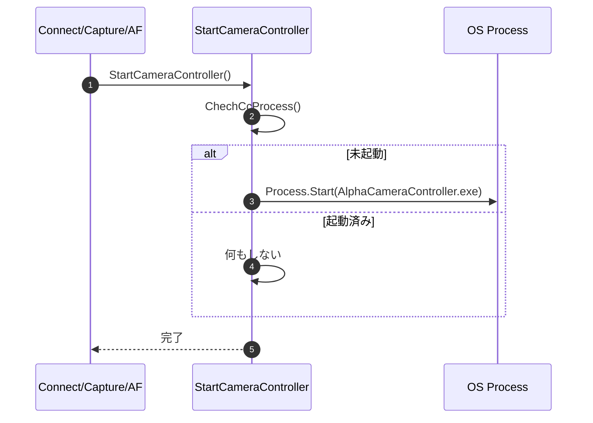

#### 8-5-1-10. Wait4Capturing

| 項目 | 内容 |
|------|------|
| シグネチャ | `private void Wait4Capturing(string imgPath)` |
| 概要 | 撮影完了ファイル（jpg/arw）の生成をポーリング監視し、タイムアウト時に例外を送出する。 |

引数

| No. | 引数名 | 型 | 必須 | 説明 |
|-----|--------|----|------|------|
| 1 | imgPath | string | Y | 拡張子なしの撮影結果ファイルベースパス |

返り値: なし（void）

処理概要（詳細）

| 手順No. | 処理内容 | 詳細 |
|---------|----------|------|
| 1 | 監視開始時刻記録 | `startTime = DateTime.Now` を保持し、監視ループを開始する。 |
| 2 | 生成ファイル確認 | `imgPath + ".jpg"` または `imgPath + ".arw"` の存在を確認し、存在すれば即時 return する。 |
| 3 | 制御プロセス健全性維持 | ループ内で `StartCameraController()` を呼び、制御プロセス停止時の再起動を試みる。 |
| 4 | タイムアウト判定 | 経過時間が `Settings.Ins.Camera.CaptureTimeout` を超えた場合、`Faild to save Picture data.` 例外を送出する。 |
| 5 | 再試行待機 | `Thread.Sleep(1)` 後に再チェックを継続する。 |

入力条件・前提条件

| 区分 | 条件 | NG時挙動 |
|------|------|----------|
| 実行前提 | 呼出し元で撮影要求（ShootFlag設定・制御ファイル保存）が実施済みであること | 監視継続後タイムアウト例外 |
| 入力値 | `imgPath` が有効な保存先を指すこと | 監視継続後タイムアウト例外 |
| 設定値 | `CaptureTimeout` が適切な監視時間として設定済みであること | 早期/過剰待機の可能性 |

条件分岐仕様

| 条件 | 挙動 |
|------|------|
| `.jpg` または `.arw` 存在 | 撮影完了とみなし正常終了する。 |
| 制御プロセス停止 | `StartCameraController()` により再起動を試みる。 |
| タイムアウト超過 | 例外を送出して呼出元へ失敗を通知する。 |

主要呼出し先

| 呼出し先 | 役割 | 同期/非同期 |
|----------|------|--------------|
| `CaptureImage(string)` | 撮影完了待機 | 同期 |
| `CaptureImage(string, ShootCondition)` | 撮影完了待機 | 同期 |
| `AutoFocus` | AF用撮影完了待機 | 同期 |
| `StartCameraController` | 監視中の制御プロセス再起動保証 | 同期 |
| `File.Exists` / `Thread.Sleep` | ファイル監視と再試行待機 | 同期 |

例外時仕様

| ケース | 捕捉方法 | 通知/伝播 | 後処理 |
|--------|----------|-----------|--------|
| 保存完了タイムアウト | 経過時間判定 | 例外を呼出元へ送出 | 呼出元で再接続/再試行処理へ遷移 |

シーケンス図

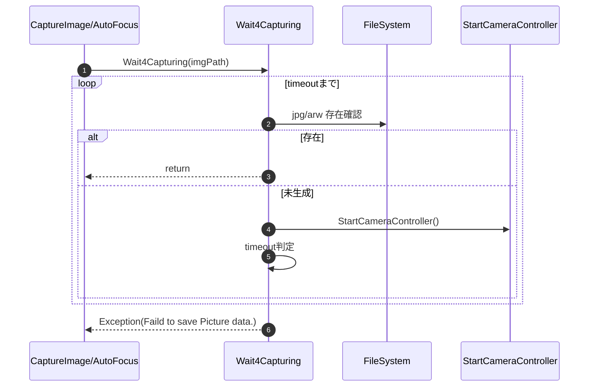

#### 8-5-1-11. UpdateAccSettings

| 項目 | 内容 |
|------|------|
| シグネチャ | `private void UpdateAccSettings()` |
| 概要 | AlphaCameraController 用の設定XMLへ現在のカメラ設定と制御ファイルパスを反映する。 |

引数

引数: なし

返り値: なし（void）

処理概要（詳細）

| 手順No. | 処理内容 | 詳細 |
|---------|----------|------|
| 1 | 設定読込 | `AccSettings.xml` を読込み現在設定を取得する。 |
| 2 | 値反映 | カメラ名、待機時間、制御ファイルパスを `AccSettings` へ反映する。 |
| 3 | 保存/掃除 | XMLを保存し、既存の制御ファイルがあれば削除する。 |

入力条件・前提条件

| 区分 | 条件 | NG時挙動 |
|------|------|----------|
| 設定ファイル | `Components\AccSettings.xml` へアクセス可能であること | catch で吸収し処理継続 |
| 一時領域 | `tempPath` が有効であること | 制御ファイル削除をスキップ |

条件分岐仕様

| 条件 | 挙動 |
|------|------|
| 既存制御ファイルあり | 旧制御ファイルを削除する。 |
| 例外発生 | 例外は内部で吸収し、呼出元へは返さない。 |

主要呼出し先

| 呼出し先 | 役割 | 同期/非同期 |
|----------|------|--------------|
| `AccSettings.LoadFromXmlFile` | 既存設定を読み込む | 同期 |
| `AccSettings.SaveToXmlFile` | 更新後設定を書き戻す | 同期 |
| `File.Exists` / `File.Delete` | 旧制御ファイルの有無確認と削除を行う | 同期 |

例外時仕様

| ケース | 捕捉方法 | 通知/伝播 | 後処理 |
|--------|----------|-----------|--------|
| 設定ファイルアクセス失敗 | `catch` | 通知なし | 無処理継続 |

シーケンス図

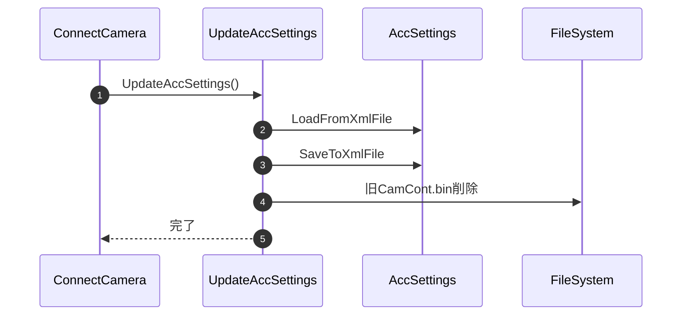

#### 8-5-1-12. ChechCcProcess

| 項目 | 内容 |
|------|------|
| シグネチャ | `private bool ChechCcProcess()` |
| 概要 | AlphaCameraController プロセスが起動済みかを判定する。 |

引数

引数: なし

返り値: bool（起動中=true）

処理概要（詳細）

| 手順No. | 処理内容 | 詳細 |
|---------|----------|------|
| 1 | プロセス列挙 | `AlphaCameraController` 名でプロセス一覧を取得する。 |
| 2 | 件数判定 | 取得結果が `null` でなく1件以上あるか確認する。 |
| 3 | 戻り値返却 | 起動中なら true、それ以外は false を返す。 |

入力条件・前提条件

| 区分 | 条件 | NG時挙動 |
|------|------|----------|
| OS状態 | プロセス列挙 API が利用可能であること | 下位例外を上位へ伝播 |

条件分岐仕様

| 条件 | 挙動 |
|------|------|
| `ps != null && ps.Length > 0` | true を返す。 |
| 上記以外 | false を返す。 |

主要呼出し先

| 呼出し先 | 役割 | 同期/非同期 |
|----------|------|--------------|
| `Process.GetProcessesByName` | 対象プロセスを列挙する | 同期 |

例外時仕様

| ケース | 捕捉方法 | 通知/伝播 | 後処理 |
|--------|----------|-----------|--------|
| プロセス列挙失敗 | 下位例外 | 呼出元へ送出 | 起動判定中断 |

シーケンス図

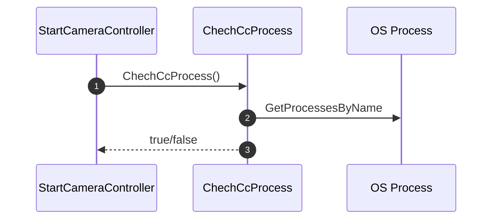

#### 8-5-1-13. CloseCamera

| 項目 | 内容 |
|------|------|
| シグネチャ | `private void CloseCamera()` |
| 概要 | カメラ制御XMLへ `CloseFlag` を反映し、制御アプリの終了を待機する。 |

引数

引数: なし

返り値: なし（void）

処理概要（詳細）

| 手順No. | 処理内容 | 詳細 |
|---------|----------|------|
| 1 | 既存制御読込 | 制御XMLが存在すれば現行 `CameraControlData` を読込む。 |
| 2 | Close設定 | `CloseFlag = true` を設定する。 |
| 3 | 保存/待機 | 制御XMLを書き戻し、終了反映待ちで2秒待機する。 |

入力条件・前提条件

| 区分 | 条件 | NG時挙動 |
|------|------|----------|
| 制御ファイル | `CamContFile` が書込み可能であること | 下位例外を上位へ伝播 |

条件分岐仕様

| 条件 | 挙動 |
|------|------|
| 制御XMLあり | 既存条件を引き継いで `CloseFlag` を更新する。 |
| 制御XMLなし | 新規 `CameraControlData` を生成して `CloseFlag` を設定する。 |

主要呼出し先

| 呼出し先 | 役割 | 同期/非同期 |
|----------|------|--------------|
| `CameraControlData.LoadFromXmlFile` | 既存制御条件を読み込む | 同期 |
| `CameraControlData.SaveToXmlFile` | `CloseFlag` 付き制御条件を書き込む | 同期 |
| `Thread.Sleep` | 制御アプリ終了反映を待機する | 同期 |

例外時仕様

| ケース | 捕捉方法 | 通知/伝播 | 後処理 |
|--------|----------|-----------|--------|
| 制御XML読書込失敗 | 下位例外 | 呼出元へ送出 | 切断処理中断 |

シーケンス図

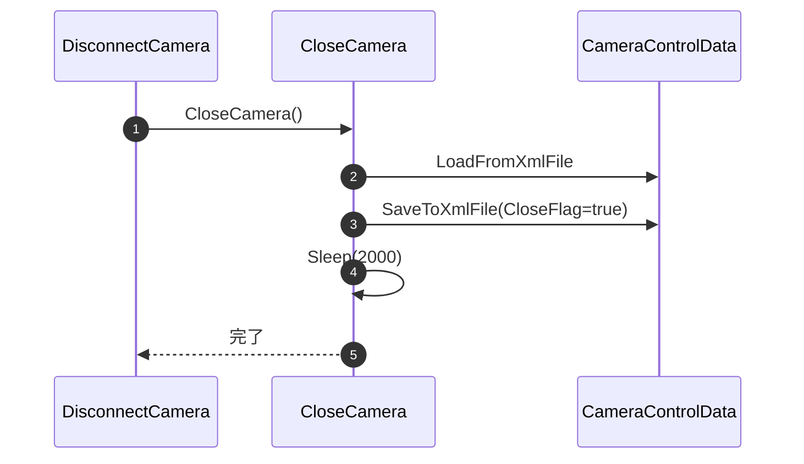
