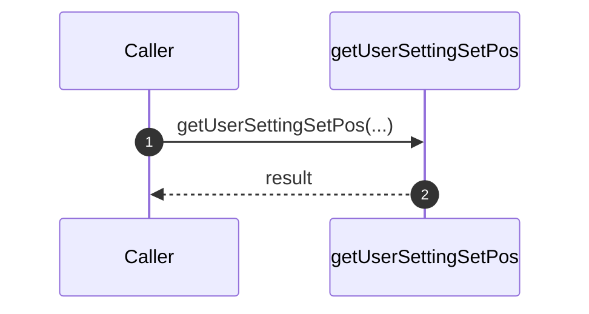
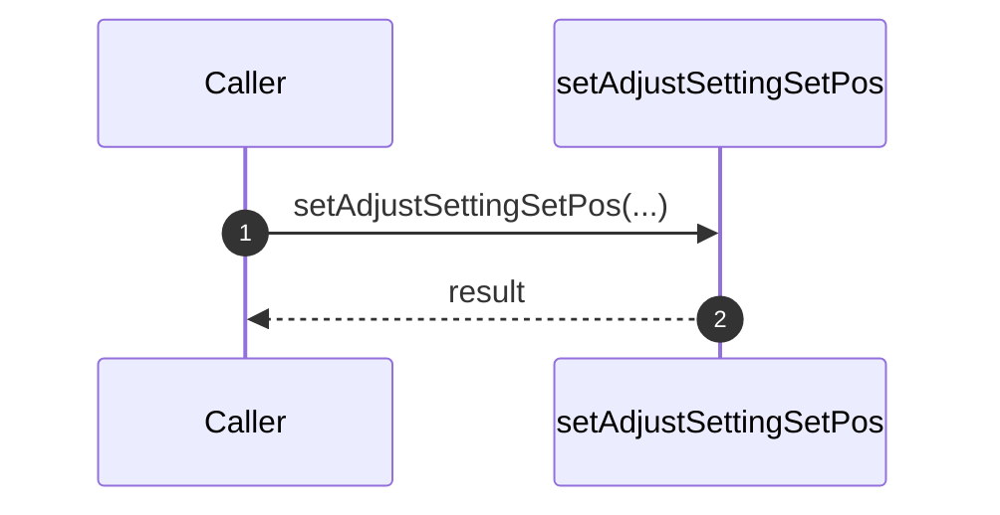
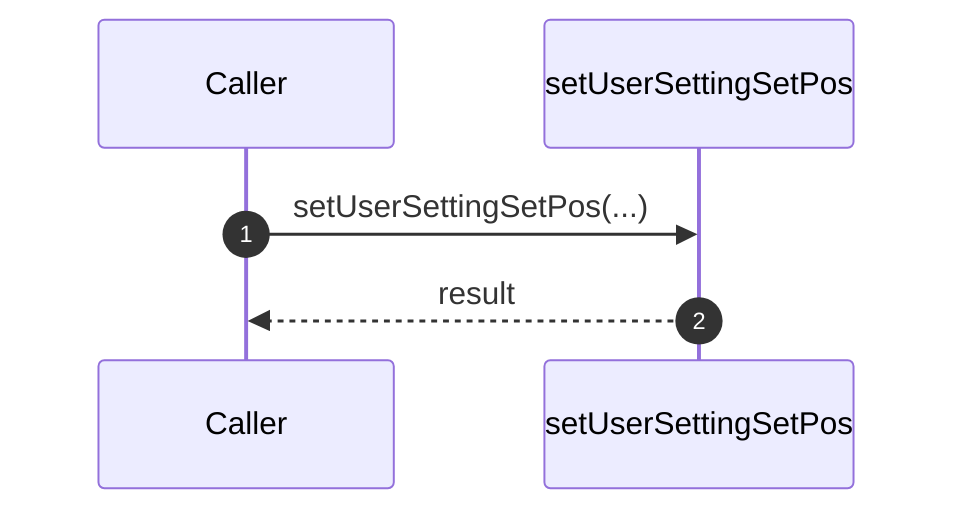
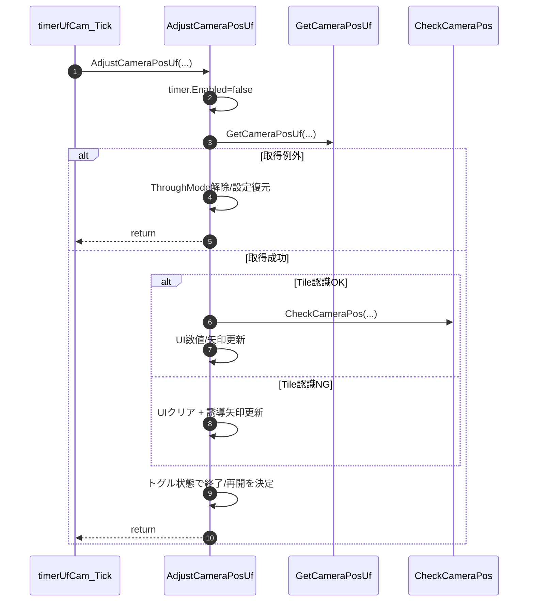
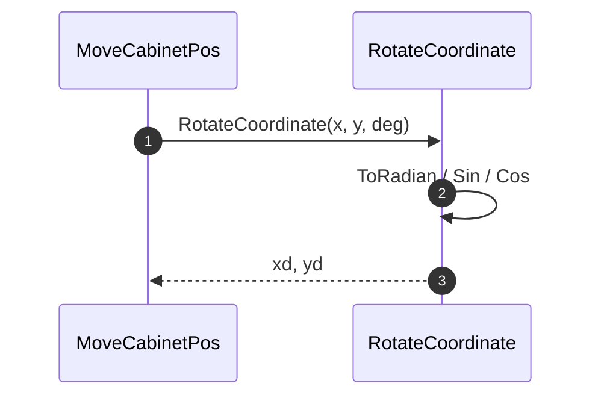
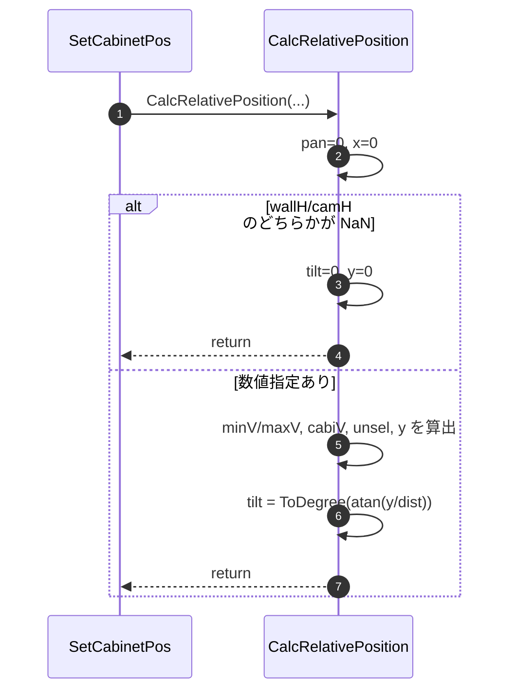
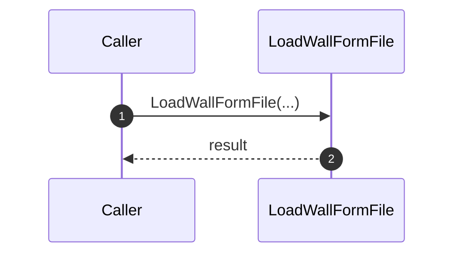
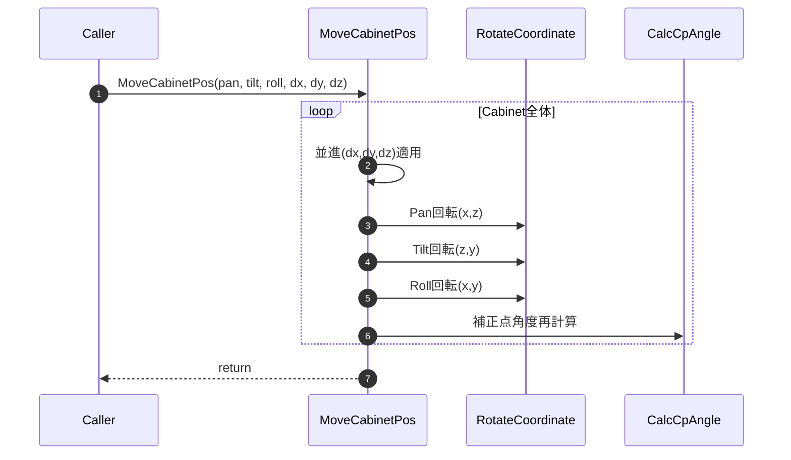
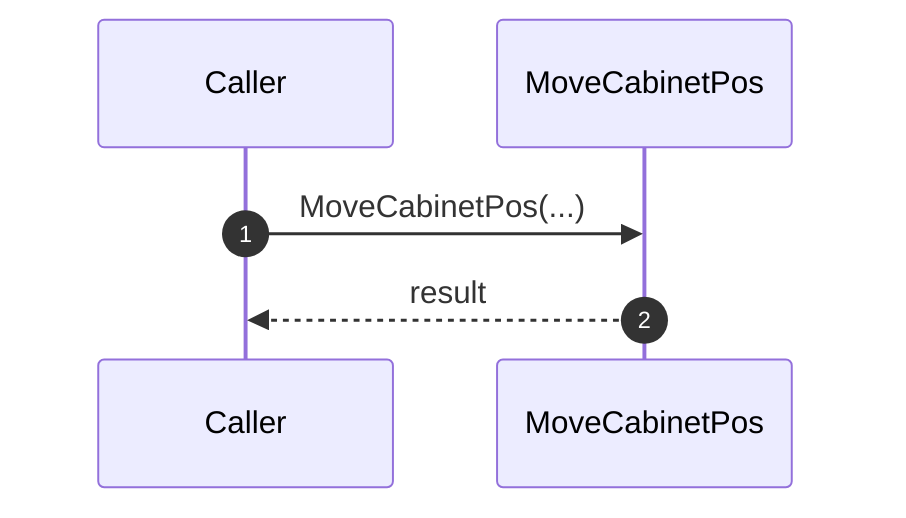
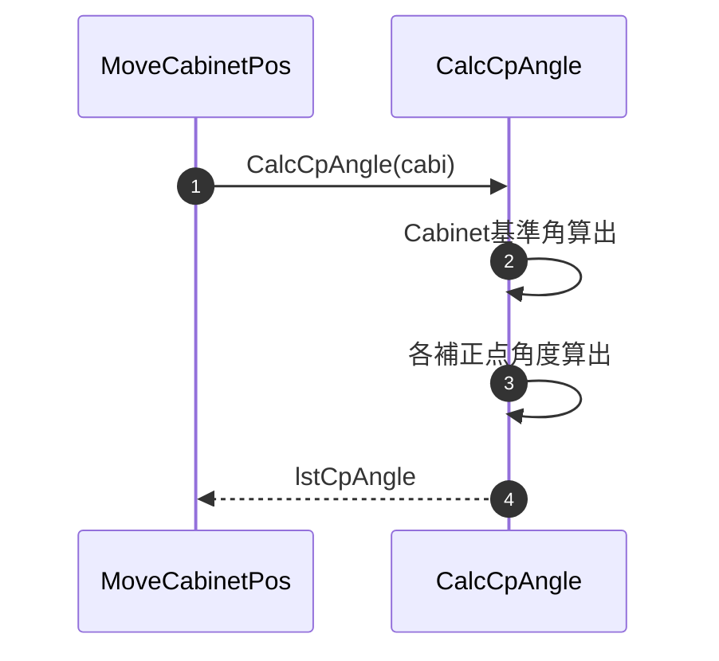


---
#### 8-5-2-1. getUserSettingSetPos

| 項目 | 内容 |
|------|------|
| シグネチャ | `private bool getUserSettingSetPos(out UserSetting userSetting)` |
| 概要 | 位置合わせ前のユーザー設定を退避する。 |

引数

| No. | 引数名 | 型 | 必須 | 説明 |
|-----|--------|----|------|------|
| 1 | userSetting(out) | UserSetting | Y | 退避対象ユーザー設定 |

返り値: bool（成功時true、失敗時false）

処理概要（詳細）

| 手順No. | 処理内容 | 詳細 |
|---------|----------|------|
| 1 | 前提確認 | 入力値・内部状態・依存リソースを確認する |
| 2 | 主処理実行 | 位置合わせ前のユーザー設定を退避する |
| 3 | 結果反映 | 呼出元へ成否を返し、必要な内部状態を更新する |

入力条件・前提条件

| 区分 | 条件 | NG時挙動 |
|------|------|----------|
| 実行前提 | 関連モジュール、設定、入出力パスが初期化済みであること | 例外送出または処理中断 |
| 入力値 | 引数値が仕様範囲内であること | 異常通知して処理中断 |

条件分岐仕様

| 条件 | 挙動 |
|------|------|
| 正常系 | 主処理を完了し結果を返却する |
| 異常系 | 例外時仕様に従って通知・復帰する |

主要呼出し先

| 呼出し先 | 役割 | 同期/非同期 |
|----------|------|--------------|
| `sendSdcpCommand` | 温度補正値・低輝度モード設定を読み出す | 同期 |

例外時仕様

| ケース | 捕捉方法 | 通知/伝播 | 後処理 |
|--------|----------|-----------|--------|
| 下位処理失敗 | 下位例外または戻り値異常 | 呼出元へ通知 | 安全停止または設定復帰 |

シーケンス図

---
...existing code...

#### 8-5-2-2. setAdjustSettingSetPos

| 項目 | 内容 |
|------|------|
| シグネチャ | `private void setAdjustSettingSetPos()` |
| 概要 | 位置合わせ用の調整設定へ切り替える。 |

引数

引数: なし

返り値: なし（void）

処理概要（詳細）

| 手順No. | 処理内容 | 詳細 |
|---------|----------|------|
| 1 | 前提確認 | 入力値・内部状態・依存リソースを確認する。 |
| 2 | 主処理実行 | 位置合わせ用の調整設定へ切り替える。 |
| 3 | 結果反映 | 呼出元へ成否を返し、必要な内部状態を更新する。 |

入力条件・前提条件

| 区分 | 条件 | NG時挙動 |
|------|------|----------|
| 実行前提 | 関連モジュール、設定、入出力パスが初期化済みであること | 例外送出または処理中断 |
| 入力値 | 引数値が仕様範囲内であること | 異常通知して処理中断 |

条件分岐仕様

| 条件 | 挙動 |
|------|------|
| 正常系 | 主処理を完了し結果を返却する。 |
| 異常系 | 例外時仕様に従って通知・復帰する。 |

主要呼出し先

| 呼出し先 | 役割 | 同期/非同期 |
|----------|------|--------------|
| `sendSdcpCommand` | ThroughMode・温度補正・低輝度モードを調整用設定へ切替える | 同期 |

例外時仕様

| ケース | 捕捉方法 | 通知/伝播 | 後処理 |
|--------|----------|-----------|--------|
| 下位処理失敗 | 下位例外または戻り値異常 | 呼出元へ通知 | 安全停止または設定復帰 |

シーケンス図

#### 8-5-2-3. setUserSettingSetPos

| 項目 | 内容 |
|------|------|
| シグネチャ | `private void setUserSettingSetPos(UserSetting userSetting)` |
| 概要 | 退避していたユーザー設定を復元する。 |

引数

| No. | 引数名 | 型 | 必須 | 説明 |
|-----|--------|----|------|------|
| 1 | userSetting | UserSetting | Y | 復元対象ユーザー設定 |

返り値: なし（void）

処理概要（詳細）

| 手順No. | 処理内容 | 詳細 |
|---------|----------|------|
| 1 | 前提確認 | 入力値・内部状態・依存リソースを確認する。 |
| 2 | 主処理実行 | 退避していたユーザー設定を復元する。 |
| 3 | 結果反映 | 呼出元へ成否を返し、必要な内部状態を更新する。 |

入力条件・前提条件

| 区分 | 条件 | NG時挙動 |
|------|------|----------|
| 実行前提 | 関連モジュール、設定、入出力パスが初期化済みであること | 例外送出または処理中断 |
| 入力値 | 引数値が仕様範囲内であること | 異常通知して処理中断 |

条件分岐仕様

| 条件 | 挙動 |
|------|------|
| 正常系 | 主処理を完了し結果を返却する。 |
| 異常系 | 例外時仕様に従って通知・復帰する。 |

主要呼出し先

| 呼出し先 | 役割 | 同期/非同期 |
|----------|------|--------------|
| `sendSdcpCommand` | 退避済みの温度補正・低輝度モード設定を復元する | 同期 |

例外時仕様

| ケース | 捕捉方法 | 通知/伝播 | 後処理 |
|--------|----------|-----------|--------|
| 下位処理失敗 | 下位例外または戻り値異常 | 呼出元へ通知 | 安全停止または設定復帰 |

シーケンス図

#### 8-5-2-4. AdjustCameraPosUf

| 項目 | 内容 |
|------|------|
| シグネチャ | `private void AdjustCameraPosUf(System.Windows.Forms.Timer timer, System.Windows.Controls.Image img, ToggleButton tbtn)` |
| 概要 | カメラ位置合わせ周期処理。Tile検出と姿勢判定を行い、UIガイド更新・次工程可否更新・終了時の復帰処理を実施する。 |

引数

| No. | 引数名 | 型 | 必須 | 説明 |
|-----|--------|----|------|------|
| 1 | timer | System.Windows.Forms.Timer | Y | 位置合わせ周期実行タイマ |
| 2 | img | System.Windows.Controls.Image | Y | 処理画像（Tile+補助線）の表示先 |
| 3 | tbtn | ToggleButton | Y | 位置合わせ継続/停止の状態を持つトグル |

返り値: なし（void）

処理概要（詳細）

| 手順No. | 処理内容 | 詳細 |
|---------|----------|------|
| 1 | 周期停止 | 多重実行防止のため `timer.Enabled=false` を先に設定する。 |
| 2 | カメラ姿勢取得 | `GetCameraPosUf(img, out aryBlob, out camPos)` を実行し、Tile認識成否 `status` を受け取る。 |
| 3 | 取得失敗時復帰 | 例外時は `SetThroughMode(false)` と `setUserSettingSetPos(userSetting)` を実施し、エラーダイアログ表示後にトグルOFF/タブ切替して終了する。 |
| 4 | 押下競合対策 | 取得中にトグル解除された場合は復帰処理のみ行って即 return する。 |
| 5 | Tile認識成功分岐 | 補助線を描画した画像を生成・表示し、`CheckCameraPos` でOK/NG判定、Pan/Tilt/Roll/X/Y/Zの数値・矢印・色を更新する。 |
| 6 | Tile認識失敗分岐 | 各表示値/矢印をクリアし、輪郭外れ方向（上下左右）を判定して誘導矢印を表示する。`m_Enable_Capture_MaskImage=true` を設定する。 |
| 7 | 次工程可否更新 | `appliMode==Developer` または `canProgress==true` のときのみ計測/調整開始ボタンを有効化する。 |
| 8 | 周期再開/終了 | トグル状態を Dispatcher 経由で再確認し、OFFなら ThroughMode解除・設定復元・内部信号停止してタイマ停止、ONならタイマ再開する。 |

入力条件・前提条件

| 区分 | 条件 | NG時挙動 |
|------|------|----------|
| 実行前提 | `tgtCamPos_canUse`、`m_Max_contours`、各UI部品、`userSetting` が有効であること | 例外時は catch で周期継続または復帰終了 |
| 依存処理 | `GetCameraPosUf` が撮像/解析可能な状態であること | 例外復帰（設定戻し + エラー表示） |
| 入力値 | `timer`/`img`/`tbtn` が null でないこと | 実行時例外 |

条件分岐仕様

| 条件 | 挙動 |
|------|------|
| `GetCameraPosUf` 例外 | 復帰処理（ThroughMode解除 + 設定復元）後、エラー表示して終了 |
| `tbtnUfCamSetPos.IsChecked != true`（取得直後） | 復帰処理を行って終了 |
| `status == true` | Tile格子線描画、`CheckCameraPos` 判定、UI数値/矢印更新 |
| `status == false` | 表示クリア、輪郭のはみ出し方向に応じた誘導矢印表示、`NG` 表示 |
| `appliMode == Developer || canProgress == true` | `btnUfCamMeasStart`/`btnUfCamAdjustStart` を有効化 |
| トグル最終状態が OFF | ThroughMode解除・設定復元・`stopIntSig()`・タイマ停止 |
| トグル最終状態が ON | `timer.Enabled=true` で次周期へ |

UI強調ロジック（主要閾値）

| 条件 | 強調対象 |
|------|----------|
| `|Tz| > 200.0` | Zを最優先で赤強調 |
| `|Pan| > 3.0` または `|Tilt| > 3.0` または `|Roll| > 3.0` | Pan/Tilt/Rollのうちワーストを赤強調（Rollは感度低減で `|Roll/2|` 比較） |
| `|Tx| > 20.0` または `|Ty| > 20.0` | X/Yを含むワーストを赤強調（X/Yは `|Tx/3|`,`|Ty/3|` で比較） |

主要呼出し先

| 呼出し先 | 役割 | 同期/非同期 |
|----------|------|--------------|
| `GetCameraPosUf` | 現在のカメラ姿勢を推定する | 同期 |
| `CheckCameraPos` | 推定姿勢が許容範囲内か判定する | 同期 |
| `SetThroughMode` | 必要に応じて ThroughMode を切替える | 同期 |
| `setUserSettingSetPos` | 位置合わせ終了時にユーザー設定を復元する | 同期 |
| `stopIntSig` / `DispImageFileUnlock` / `setText` | 表示停止とUI更新を行う | 同期 |

主要呼出し元

| 呼出し元 | 用途 |
|----------|------|
| `timerUfCam_Tick` | 位置合わせ周期処理として呼び出す |

例外時仕様

| ケース | 捕捉方法 | 通知/伝播 | 後処理 |
|--------|----------|-----------|--------|
| `GetCameraPosUf` 失敗 | `catch (Exception ex)` | `ShowMessageWindow(ex.Message, "CAS Error!", ...)` | ThroughMode解除・設定復元・トグルOFF・タブ切替で終了 |
| UI更新ブロック内例外 | `catch`（握りつぶし） | 伝播なし | `timer.Enabled=true` で次周期継続 |
| トグルOFF検出 | 状態判定 | 通知なし | ThroughMode解除・設定復元・内部信号OFF・タイマ停止 |

シーケンス図

#### 8-5-2-5. CalcRelativePosition

| 項目 | 内容 |
|------|------|
| シグネチャ | `private void RotateCoordinate(double x, double y, double deg, out double xd, out double yd)` |
| 概要 | 2次元座標(x, y)を指定角度(deg)だけ回転させた結果(xd, yd)を返す。 |

引数

| No. | 引数名 | 型 | 必須 | 説明 |
|-----|--------|----|------|------|
| 1 | x | double | Y | 入力X座標 |
| 2 | y | double | Y | 入力Y座標 |
| 3 | deg | double | Y | 回転角度（度） |
| 4 | xd(out) | double | Y | 回転後X座標 |
| 5 | yd(out) | double | Y | 回転後Y座標 |

返り値: なし（void）

処理概要（詳細）

| 手順No. | 処理内容 | 詳細 |
|---------|----------|------|
| 1 | 角度変換 | `deg` をラジアンへ変換（`ToRadian(deg)`）する。 |
| 2 | 回転計算 | 回転行列で `xd = x*cos(θ) - y*sin(θ)`, `yd = x*sin(θ) + y*cos(θ)` を算出。 |
| 3 | 出力反映 | `xd`, `yd` へ結果を格納する。 |

数式

$$
\begin{aligned}
	heta &= \mathrm{ToRadian}(deg) \\
xd &= x \cos\theta - y \sin\theta \\
yd &= x \sin\theta + y \cos\theta
\end{aligned}
$$

入力条件・前提条件

| 区分 | 条件 | NG時挙動 |
|------|------|----------|
| 入力値 | x, y, degが数値演算可能な有限値であること | 不正値は下位演算結果に従う |

条件分岐仕様

| 条件 | 挙動 |
|------|------|
| 正常系 | 回転後座標を計算して返す。 |
| 異常系 | 数値異常は呼出元で判定する。 |

主要呼出し先

| 呼出し先 | 役割 | 同期/非同期 |
|----------|------|--------------|
| `ToRadian` | 度をラジアンへ変換する | 同期 |
| `Math.Cos` / `Math.Sin` | 回転行列の係数を算出する | 同期 |

主要呼出し元

| 呼出し元 | 用途 |
|----------|------|
| `MoveCabinetPos` | Cabinet座標の回転適用 |

例外時仕様

| ケース | 捕捉方法 | 通知/伝播 | 後処理 |
|--------|----------|-----------|--------|
| 数値演算異常 | 下位演算 | 呼出元で結果確認 | 無処理 |

シーケンス図

| 距離 | `dist` が0でないことが望ましい | 0でも例外は出ず、`Atan(±∞)` 相当の角度になる |
| 壁/カメラ高さ | 高さ自動計算を使う場合は `wallH/camH` が数値であること | いずれか `NaN` なら `tilt=0`,`y=0` で早期終了 |

条件分岐仕様

| 条件 | 挙動 |
|------|------|
| `double.IsNaN(wallH) == true` または `double.IsNaN(camH) == true` | `tilt=0`, `y=0` を設定して即終了 |
| それ以外 | 選択範囲・壁高さに基づく `y` と `tilt` を算出して終了 |

主要呼出し先

| 呼出し先 | 役割 | 同期/非同期 |
|----------|------|--------------|
| `Math.Atan` | Pan/Tilt の角度成分を算出する | 同期 |
| `ToDegree` | ラジアンを度へ変換する | 同期 |

主要呼出し元

| 呼出し元 | 用途 |
|----------|------|
| `SetCabinetPos(List<UnitInfo> lstTgtUnits, double dist, double wallH, double camH)` | Cabinet配置前の相対姿勢計算 |

例外時仕様

| ケース | 捕捉方法 | 通知/伝播 | 後処理 |
|--------|----------|-----------|--------|
| 明示例外送出 | なし | なし | 本メソッドでは `throw` しない |
| 不正入力由来の実行時例外 | 下位ランタイム | 呼出元へ伝播 | 呼出元側の例外処理へ委譲 |

シーケンス図

#### 8-5-2-6. LoadWallFormFile

| 項目 | 内容 |
|------|------|
| シグネチャ | `private void LoadWallFormFile(out double[] rotateAngle)` |
| 概要 | 壁形状ファイルから回転角配列を読み込む。 |

引数

| No. | 引数名 | 型 | 必須 | 説明 |
|-----|--------|----|------|------|
| 1 | rotateAngle(out) | double[] | Y | 壁形状回転角配列 |

返り値: なし（void）

処理概要（詳細）

| 手順No. | 処理内容 | 詳細 |
|---------|----------|------|
| 1 | 前提確認 | 入力値・内部状態・依存リソースを確認する。 |
| 2 | 主処理実行 | 壁形状ファイルから回転角配列を読み込む。 |
| 3 | 結果反映 | 呼出元へ成否を返し、必要な内部状態を更新する。 |

入力条件・前提条件

| 区分 | 条件 | NG時挙動 |
|------|------|----------|
| 実行前提 | 関連モジュール、設定、入出力パスが初期化済みであること | 例外送出または処理中断 |
| 入力値 | 引数値が仕様範囲内であること | 異常通知して処理中断 |

条件分岐仕様

| 条件 | 挙動 |
|------|------|
| 正常系 | 主処理を完了し結果を返却する。 |
| 異常系 | 例外時仕様に従って通知・復帰する。 |

主要呼出し先

| 呼出し先 | 役割 | 同期/非同期 |
|----------|------|--------------|
| `StreamReader.ReadToEnd` | 壁形状ファイル内容を読込む | 同期 |
| `double.Parse` | 読込値を角度配列へ変換する | 同期 |

例外時仕様

| ケース | 捕捉方法 | 通知/伝播 | 後処理 |
|--------|----------|-----------|--------|
| 下位処理失敗 | 下位例外または戻り値異常 | 呼出元へ通知 | 安全停止または設定復帰 |

シーケンス図

#### 8-5-2-7. MoveCabinetPos

| 項目 | 内容 |
|------|------|
| シグネチャ | `private void MoveCabinetPos(double pan, double tilt, double roll, double dx, double dy, double dz)` |
| 概要 | Cabinet座標群に対し、指定された回転（pan/tilt/roll）および並進（dx/dy/dz）を適用し、全補正点角度を再計算する。 |

引数

| No. | 引数名 | 型 | 必須 | 説明 |
|-----|--------|----|------|------|
| 1 | pan | double | Y | xz平面での回転角度（Pan）[deg] |
| 2 | tilt | double | Y | yz平面での回転角度（Tilt）[deg] |
| 3 | roll | double | Y | xy平面での回転角度（Roll）[deg] |
| 4 | dx | double | Y | x方向の並進量[mm] |
| 5 | dy | double | Y | y方向の並進量[mm] |
| 6 | dz | double | Y | z方向の並進量[mm] |

返り値: なし（void）

処理概要（詳細）

| 手順No. | 処理内容 | 詳細 |
|---------|----------|------|
| 1 | Cabinet全体ループ | `allocInfo.lstUnits` の全要素（2次元配列）を走査し、nullでなければ処理を行う。 |
| 2 | 並進適用 | BottomLeft, TopLeft, BottomRight 各頂点の x, y, z に dx, dy, dz を加算。 |
| 3 | Pan回転 | 各頂点の x, z を基準に `RotateCoordinate(x, z, pan, out xd, out zd)` で回転し、x, z を更新。 |
| 4 | Tilt回転 | 各頂点の z, y を基準に `RotateCoordinate(z, y, tilt, out zd, out yd)` で回転し、y, z を更新。 |
| 5 | Roll回転 | 各頂点の x, y を基準に `RotateCoordinate(x, y, roll, out xd, out yd)` で回転し、x, y を更新。 |
| 6 | 補正点角度再計算 | `CalcCpAngle` を呼び出し、各Cabinetの補正点角度リストを再計算・格納。 |

入力条件・前提条件

| 区分 | 条件 | NG時挙動 |
|------|------|----------|
| 実行前提 | `allocInfo.lstUnits` が初期化済みであること | 例外送出または処理中断 |
| 入力値 | 各引数が数値であること | 異常通知して処理中断 |

条件分岐仕様

| 条件 | 挙動 |
|------|------|
| Cabinetがnull | その要素はスキップ |
| 正常系 | 全要素に回転・並進を適用し、補正点角度を再計算 |
| 異常系 | 例外時はcatch元で通知・復帰 |

主要呼出し先

| 呼出し先 | 役割 | 同期/非同期 |
|----------|------|--------------|
| `RotateCoordinate` | 指定平面での座標回転を実施 | 同期 |
| `CalcCpAngle` | Cabinetの補正点角度を再計算 | 同期 |

主要呼出し元

| 呼出し元 | 用途 |
|----------|------|
| Cabinet配置・姿勢補正処理 | Cabinet群の一括座標変換 |

例外時仕様

| ケース | 捕捉方法 | 通知/伝播 | 後処理 |
|--------|----------|-----------|--------|
| 配列未初期化・添字異常 | 下位例外 | 呼出元へ通知 | 安全停止または設定復帰 |

シーケンス図

| 異常系 | 例外時仕様に従って通知・復帰する。 |

主要呼出し先

| 呼出し先 | 役割 | 同期/非同期 |
|----------|------|--------------|
| `RotateCoordinate` | Cabinet 座標へ Pan/Tilt/Roll 回転を適用する | 同期 |
| `CalcCpAngle` | 座標更新後の補正点角度を再計算する | 同期 |

例外時仕様

| ケース | 捕捉方法 | 通知/伝播 | 後処理 |
|--------|----------|-----------|--------|
| 下位処理失敗 | 下位例外または戻り値異常 | 呼出元へ通知 | 安全停止または設定復帰 |

シーケンス図

#### 8-5-2-8. RotateCoordinate

| 項目 | 内容 |
|------|------|
| シグネチャ | `private void RotateCoordinate(double x, double y, double deg, out double xd, out double yd)` |
| 概要 | 2次元座標(x, y)を指定角度(deg)だけ回転させた結果(xd, yd)を返す。 |

引数

| No. | 引数名 | 型 | 必須 | 説明 |
|-----|--------|----|------|------|
| 1 | x | double | Y | 入力X座標 |
| 2 | y | double | Y | 入力Y座標 |
| 3 | deg | double | Y | 回転角度（度） |
| 4 | xd(out) | double | Y | 回転後X座標 |
| 5 | yd(out) | double | Y | 回転後Y座標 |

返り値: なし（void）

処理概要（詳細）

| 手順No. | 処理内容 | 詳細 |
|---------|----------|------|
| 1 | 角度変換 | `deg` をラジアンへ変換（`ToRadian(deg)`）する。 |
| 2 | 回転計算 | 回転行列で `xd = x*cos(θ) - y*sin(θ)`, `yd = x*sin(θ) + y*cos(θ)` を算出。 |
| 3 | 出力反映 | `xd`, `yd` へ結果を格納する。 |

数式

$$
\begin{aligned}
\theta &= \mathrm{ToRadian}(deg) \\
xd &= x \cos\theta - y \sin\theta \\
yd &= x \sin\theta + y \cos\theta
\end{aligned}
$$

入力条件・前提条件

| 区分 | 条件 | NG時挙動 |
|------|------|----------|
| 入力値 | x, y, degが数値演算可能な有限値であること | 不正値は下位演算結果に従う |

条件分岐仕様

| 条件 | 挙動 |
|------|------|
| 正常系 | 回転後座標を計算して返す。 |
| 異常系 | 数値異常は呼出元で判定する。 |

主要呼出し先

| 呼出し先 | 役割 | 同期/非同期 |
|----------|------|--------------|
| `ToRadian` | 度をラジアンへ変換する | 同期 |
| `Math.Cos` / `Math.Sin` | 回転行列の係数を算出する | 同期 |

主要呼出し元

| 呼出し元 | 用途 |
|----------|------|
| `MoveCabinetPos` | Cabinet座標の回転適用 |

例外時仕様

| ケース | 捕捉方法 | 通知/伝播 | 後処理 |
|--------|----------|-----------|--------|
| 数値演算異常 | 下位演算 | 呼出元で結果確認 | 無処理 |

シーケンス図

#### 8-5-2-9. CalcCpAngle

| 項目 | 内容 |
|------|------|
| シグネチャ | `private List<UfCamCpAngle> CalcCpAngle(UnitInfo cabi)` |
| 概要 | Cabinet の空間座標から各補正点の Pan/Tilt 角を再計算する。 |

引数

| No. | 引数名 | 型 | 必須 | 説明 |
|-----|--------|----|------|------|
| 1 | cabi | UnitInfo | Y | 補正点角度を再計算する Cabinet |

返り値: List<UfCamCpAngle>

処理概要（詳細）

| 手順No. | 処理内容 | 詳細 |
|---------|----------|------|
| 1 | 基準ベクトル算出 | Cabinet の BottomLeft, BottomRight, TopLeft 座標から水平方向ベクトル $H$、垂直方向ベクトル $V$ を算出する。  $H = (x_{BR} - x_{BL},\ y_{BR} - y_{BL},\ z_{BR} - z_{BL})$  $V = (x_{TL} - x_{BL},\ y_{TL} - y_{BL},\ z_{TL} - z_{BL})$ |
| 2 | Cabinet基準角算出 | Cabinet の Pan/Tilt を算出する。  $\mathrm{Pan}_{cab} = \mathrm{ToDegree}(\arctan((z_{BR} - z_{BL}) / (x_{BR} - x_{BL})))$  $\mathrm{Tilt}_{cab} = \mathrm{ToDegree}(\arctan((z_{TL} - z_{BL}) / (y_{TL} - y_{BL})))$ |
| 3 | 補正点走査 | 各補正点（例：Top-Left, Top-Centerなど）について、BottomLeft座標を基準に $H$,$V$ベクトルを重み付きで加算し、補正点の空間座標 $(x, y, z)$ を算出。  例：$cp.x = x_{BL} + H_x \cdot h + V_x \cdot v$（$h,v$は補正点ごとの重み） |
| 4 | 角度格納 | 各補正点の Pan/Tilt/r を計算し、`UfCamCpAngle` としてリストに格納して返却する。  Pan: $\mathrm{Pan} = -\mathrm{ToDegree}(\arctan(x/z)) - \mathrm{Pan}_{cab}$  Tilt: $\mathrm{Tilt} = \mathrm{ToDegree}(\arctan(y/z)) + \mathrm{Tilt}_{cab}$  r: $r = \sqrt{x^2 + y^2 + z^2}$  Pan, Tiltが90度超過の場合は180度補正 |

入力条件・前提条件

| 区分 | 条件 | NG時挙動 |
|------|------|----------|
| Cabinet座標 | `CabinetPos` が設定済みであること | 不正角度となる可能性 |

条件分岐仕様

| 条件 | 挙動 |
|------|------|
| Cabinet種別共通 | Cabinet形状から補正点群を列挙して角度を計算する。 |
| 角度が90度超過 | 実装どおり180度補正して正規化する。 |

主要呼出し先

| 呼出し先 | 役割 | 同期/非同期 |
|----------|------|--------------|
| `ToDegree` | 角度を度へ変換する | 同期 |
| `Math.Atan` / `Math.Sqrt` | Pan/Tilt と距離を算出する | 同期 |

主要呼出し元

| 呼出し元 | 用途 |
|----------|------|
| `MoveCabinetPos` | Cabinet群の一括座標変換後の補正点角度再計算 |

例外時仕様

| ケース | 捕捉方法 | 通知/伝播 | 後処理 |
|--------|----------|-----------|--------|
| 座標異常 | 数値演算結果 | 呼出元で利用時に評価 | 無処理 |

シーケンス図

##### 8-5-3-A. UfCamera.cs（計測・撮影・解析補助）
