
---
#### 8-5-3-1. CheckOpenCvSharpDll

| 項目 | 内容 |
|------|------|
| シグネチャ | `private void CheckOpenCvSharpDll()` |
| 概要 | OpenCvSharp関連DLLの存在を確認し不足を補完する。 |

引数: なし

返り値: なし（void）

処理概要（詳細）

| 手順No. | 処理内容 | 詳細 |
|---------|----------|------|
| 1 | 前提確認 | 入力値・内部状態・依存リソースを確認する |
| 2 | 主処理実行 | OpenCvSharp関連DLLの存在を確認し不足を補完する |
| 3 | 結果反映 | 呼出元へ成否を返し、必要な内部状態を更新する |

入力条件・前提条件

| 区分 | 条件 | NG時挙動 |
|------|------|----------|
| 実行前提 | 関連モジュール、設定、入出力パスが初期化済みであること | 例外送出または処理中断 |
| 入力値 | 引数値が仕様範囲内であること | 異常通知して処理中断 |

条件分岐仕様

| 条件 | 挙動 |
|------|------|
| 正常系 | 主処理を完了し結果を返却する |
| 異常系 | 例外時仕様に従って通知・復帰する |

主要呼出し先

| 呼出し先 | 役割 | 同期/非同期 |
|----------|------|--------------|
| ファイル存在確認 | OpenCvSharp 関連 DLL の配置有無を検証する | 同期 |

例外時仕様

| ケース | 捕捉方法 | 通知/伝播 | 後処理 |
|--------|----------|-----------|--------|
| 下位処理失敗 | 下位例外または戻り値異常 | 呼出元へ通知 | 安全停止または設定復帰 |

シーケンス図

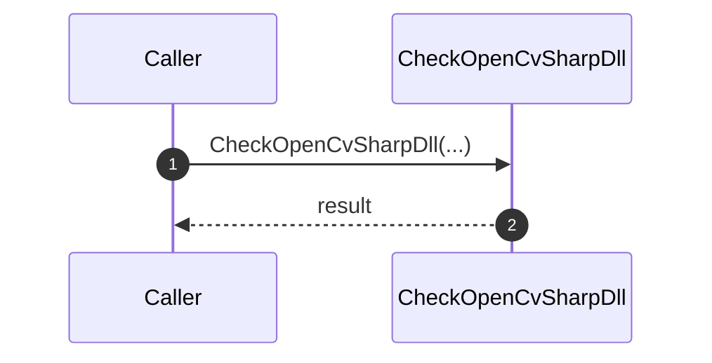
```mermaid
sequenceDiagram
    autonumber
    participant CALLER as Caller
    participant M as CheckOpenCvSharpDll
    CALLER->>M: CheckOpenCvSharpDll(...)
    M-->>CALLER: result
```

---

#### 8-5-3-2. AutoFocus

| 項目 | 内容 |
|------|------|
| シグネチャ | `private bool AutoFocus(ShootCondition condition, AfAreaSetting afArea = null)` |
| 概要 | 撮影条件・AFエリア設定に基づき、カメラのオートフォーカス（AF）を実行する。制御XMLの生成・保存、AF完了待機、状態確認、リトライ、完了通知までを一連で行う。 |

引数

| No. | 引数名 | 型 | 必須 | 説明 |
|-----|--------|----|------|------|
| 1 | condition | ShootCondition | Y | 撮影条件（ISO,露光,絞り,圧縮形式など） |
| 2 | afArea | AfAreaSetting | N | AFエリア設定（型・座標）。省略時はデフォルトエリア |

返り値: bool（AFが正常完了した場合true、失敗時false）

処理概要（詳細）

| 手順No. | 処理内容 | 詳細 |
|---------|----------|------|
| 1 | 前提確認 | カメラ制御プロセスが起動済みか確認し、未起動なら`StartCameraController`で起動。 |
| 2 | 制御XML生成 | `CameraControlData`に撮影条件・AFエリア等をセットし、`SaveToXmlFile`でXMLファイルとして保存。 |
| 3 | AF実行 | カメラ制御プロセスがXMLを監視し、AF処理を実行。 |
| 4 | 完了待機 | `Wait4Capturing`でAF完了まで待機。タイムアウト・異常時は`DisconnectCamera`/`ConnectCamera`で再接続しリトライ。 |
| 5 | 状態確認 | `LoadFromXmlFile`でAF完了・成功可否を確認。 |
| 6 | 結果反映 | AF成功時は`playSound`で通知音を再生し、trueを返す。失敗時はfalseを返し、必要に応じて安全停止や復帰処理を行う。 |

入力条件・前提条件

| 区分 | 条件 | NG時挙動 |
|------|------|----------|
| 実行前提 | カメラ制御プロセス、関連モジュール、設定、入出力パスが初期化済み | 例外送出または処理中断 |
| 入力値 | condition, afAreaが仕様範囲内であること | 異常通知して処理中断 |

条件分岐仕様

| 条件 | 挙動 |
|------|------|
| AF成功 | 完了通知音を再生し、trueを返却 |
| AF失敗・タイムアウト | 再接続・リトライ後も失敗時はfalseを返却し、異常通知・安全停止 |

主要呼出し先

| 呼出し先 | 役割 | 同期/非同期 |
|----------|------|--------------|
| `StartCameraController` | AF実行前に制御プロセス起動を保証 | 同期 |
| `CameraControlData.SaveToXmlFile` | AF条件を制御XMLへ保存 | 同期 |
| `CameraControlData.LoadFromXmlFile` | AF実行後の制御状態を確認 | 同期 |
| `Wait4Capturing` | AF用撮影完了を待機 | 同期 |
| `DisconnectCamera` / `ConnectCamera` | リトライ時に接続を再初期化 | 同期 |
| `playSound` | AF完了通知音を再生 | 同期 |

例外時仕様

| ケース | 捕捉方法 | 通知/伝播 | 後処理 |
|--------|----------|-----------|--------|
| 下位処理失敗 | 下位例外または戻り値異常 | 呼出元へ通知 | 安全停止または設定復帰 |

シーケンス図

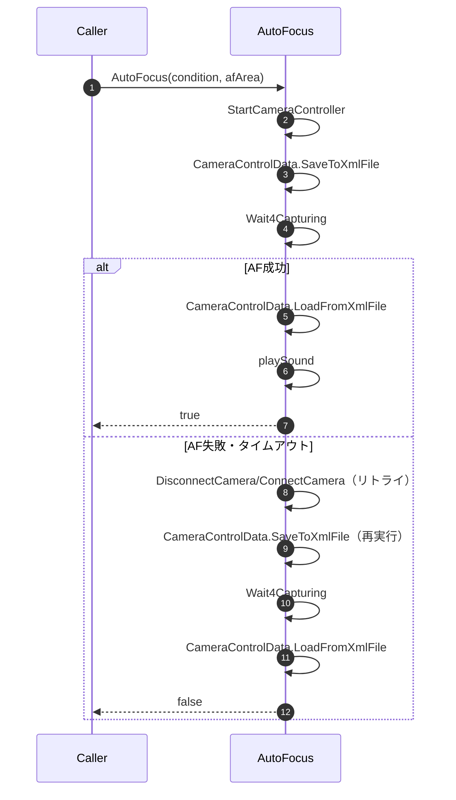
```mermaid
sequenceDiagram
    autonumber
    participant CALLER as Caller
    participant M as AutoFocus

    CALLER->>M: AutoFocus(condition, afArea)
    M->>M: StartCameraController
    M->>M: CameraControlData.SaveToXmlFile
    M->>M: Wait4Capturing
    alt AF成功
        M->>M: CameraControlData.LoadFromXmlFile
        M->>M: playSound
        M-->>CALLER: true
    else AF失敗・タイムアウト
        M->>M: DisconnectCamera/ConnectCamera（リトライ）
        M->>M: CameraControlData.SaveToXmlFile（再実行）
        M->>M: Wait4Capturing
        M->>M: CameraControlData.LoadFromXmlFile
        M-->>CALLER: false
    end
```

#### 8-5-3-3. GetCameraPosUf

| 項目 | 内容 |
|------|------|
| シグネチャ | `private bool GetCameraPosUf(System.Windows.Controls.Image img, out CvBlob[,] aryBlob, out CameraPosition camPos)` |
| 概要 | 指定画像からタイルパターンを検出し、検出結果をもとにカメラの位置・姿勢（Tx, Ty, Tz, Pan, Tilt, Roll）を推定する。検出Blob配列・推定姿勢を出力し、工程の自動化・ガイドに利用する。 |

引数

| No. | 引数名 | 型 | 必須 | 説明 |
|-----|--------|----|------|------|
| 1 | img | System.Windows.Controls.Image | Y | 処理画像表示先（撮像・描画用） |
| 2 | aryBlob(out) | CvBlob[,] | Y | 検出Blob配列（タイル候補） |
| 3 | camPos(out) | CameraPosition | Y | 推定されたカメラ位置・姿勢 |

返り値: bool（Tile検出・姿勢推定が正常ならtrue、失敗時false）

処理概要（詳細）

| 手順No. | 処理内容 | 詳細 |
|---------|----------|------|
| 1 | 画像取得 | `captureCamPos(img, true)`でカメラ姿勢推定用の画像（Black, Raster, Tile）を取得する。 |
| 2 | タイル検出 | `detectTileCamPos(out blobs)`で画像からタイル候補Blobを抽出する。 |
| 3 | Blob整列 | `getTilePosition(blobs, ...)`でBlobをX-Y順に並べ、`aryBlob`へ格納する。 |
| 4 | 姿勢推定 | `estimateCamPos(aryBlob, ...)`でBlob配列からカメラのTx,Ty,Tz,Pan,Tilt,Rollを推定し、`camPos`へ格納する。 |
| 5 | 結果反映 | 推定結果を呼出元へ返却し、必要な内部状態を更新する。失敗時は異常通知・安全停止を行う。 |

入力条件・前提条件

| 区分 | 条件 | NG時挙動 |
|------|------|----------|
| 実行前提 | カメラ制御プロセス、関連モジュール、設定、入出力パスが初期化済み | 例外送出または処理中断 |
| 入力値 | imgが有効、出力引数がnullでない | 異常通知して処理中断 |

条件分岐仕様

| 条件 | 挙動 |
|------|------|
| タイル検出・姿勢推定成功 | 結果を返却し、UIや次工程に反映 |
| タイル検出失敗・推定不能 | falseを返却し、異常通知・安全停止 |

主要呼出し先

| 呼出し先 | 役割 | 同期/非同期 |
|----------|------|--------------|
| `captureCamPos` | カメラ姿勢推定用画像を取得する | 同期 |
| `detectTileCamPos` | タイル候補を検出する | 同期 |
| `getTilePosition` | タイル座標を整形・配列化する | 同期 |
| `estimateCamPos` | Blob配列からカメラ姿勢を推定する | 同期 |

例外時仕様

| ケース | 捕捉方法 | 通知/伝播 | 後処理 |
|--------|----------|-----------|--------|
| 下位処理失敗 | 下位例外または戻り値異常 | 呼出元へ通知 | 安全停止または設定復帰 |

シーケンス図

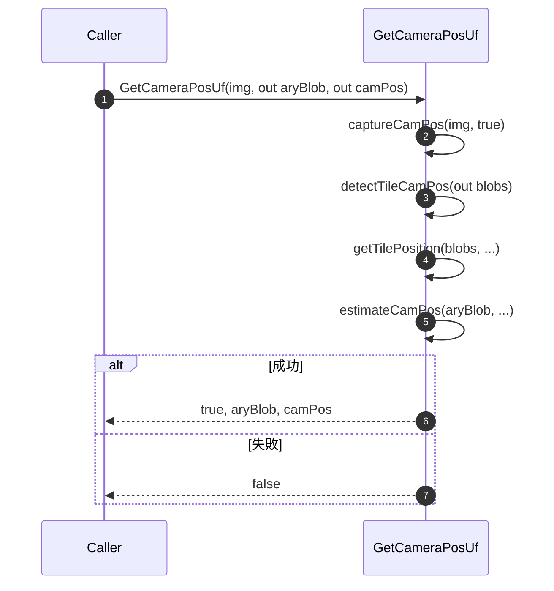
```mermaid
sequenceDiagram
    autonumber
    participant CALLER as Caller
    participant M as GetCameraPosUf

    CALLER->>M: GetCameraPosUf(img, out aryBlob, out camPos)
    M->>M: captureCamPos(img, true)
    M->>M: detectTileCamPos(out blobs)
    M->>M: getTilePosition(blobs, ...)
    M->>M: estimateCamPos(aryBlob, ...)
    alt 成功
        M-->>CALLER: true, aryBlob, camPos
    else 失敗
        M-->>CALLER: false
    end
```

#### 8-5-3-4. CheckCameraPos

| 項目 | 内容 |
|------|------|
| シグネチャ | `private bool CheckCameraPos(CvBlob[,] aryBlob, CameraPosition camPos)` |
| 概要 | タイル検出結果（aryBlob）と推定カメラ姿勢（camPos）をもとに、カメラの位置・姿勢が規格（許容範囲）内かを判定する。判定結果を返却し、異常時は通知・安全停止を行う。 |

引数

| No. | 引数名 | 型 | 必須 | 説明 |
|-----|--------|----|------|------|
| 1 | aryBlob | CvBlob[,] | Y | 検出Blob配列（タイル候補） |
| 2 | camPos | CameraPosition | Y | 推定姿勢（Tx,Ty,Tz,Pan,Tilt,Roll） |

返り値: bool（規格内ならtrue、規格外・異常時はfalse）

処理概要（詳細）

| 手順No. | 処理内容 | 詳細 |
|---------|----------|------|
| 1 | 前提確認 | 入力値（aryBlob, camPos）、内部状態、依存リソースを確認。 |
| 2 | 姿勢判定 | 設定値比較ロジックでcamPosの各値（Tx,Ty,Tz,Pan,Tilt,Roll）が許容範囲内か判定。 |
| 3 | 結果反映 | 判定結果を呼出元へ返却。規格外の場合は異常通知・安全停止を行う。 |

入力条件・前提条件

| 区分 | 条件 | NG時挙動 |
|------|------|----------|
| 実行前提 | 関連モジュール、設定、入出力パスが初期化済み | 例外送出または処理中断 |
| 入力値 | aryBlob, camPosが有効・仕様範囲内 | 異常通知して処理中断 |

条件分岐仕様

| 条件 | 挙動 |
|------|------|
| 全項目が許容範囲内 | trueを返却し、次工程へ進む |
| いずれかが範囲外 | falseを返却し、異常通知・安全停止 |

主要呼出し先

| 呼出し先 | 役割 | 同期/非同期 |
|----------|------|--------------|
| 設定値比較 | 推定姿勢を許容範囲と比較して妥当性判定 | 同期 |

例外時仕様

| ケース | 捕捉方法 | 通知/伝播 | 後処理 |
|--------|----------|-----------|--------|
| 下位処理失敗 | 下位例外または戻り値異常 | 呼出元へ通知 | 安全停止または設定復帰 |

シーケンス図

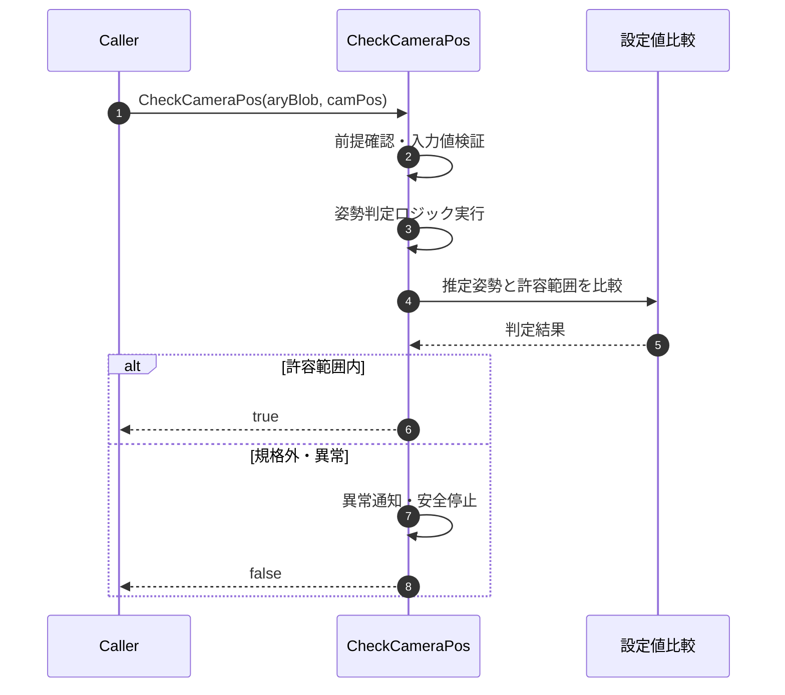
```mermaid
sequenceDiagram
    autonumber
    participant CALLER as Caller
    participant M as CheckCameraPos

    CALLER->>M: CheckCameraPos(aryBlob, camPos)
    M->>M: 前提確認・入力値検証
    M->>M: 姿勢判定ロジック実行
    M->>設定値比較: 推定姿勢と許容範囲を比較
    設定値比較-->>M: 判定結果
    alt 許容範囲内
        M-->>CALLER: true
    else 規格外・異常
        M->>M: 異常通知・安全停止
        M-->>CALLER: false
    end
```

#### 8-5-3-5. CaptureImage

| 項目 | 内容 |
|------|------|
| シグネチャ | `private void CaptureImage(string imgPath) / private void CaptureImage(string imgPath, ShootCondition condition)` |
| 概要 | 指定パスにカメラ画像を保存する。必要に応じて撮影条件を上書きし、制御XMLの生成・保存、撮影完了待機、状態確認、リトライ、完了通知までを一連で行う。 |

引数

| No. | 引数名 | 型 | 必須 | 説明 |
|-----|--------|----|------|------|
| 1 | imgPath | string | Y | 保存先画像パス |
| 2 | condition | ShootCondition | N | 撮影条件上書き（省略時は既定条件） |

返り値: なし（void）

処理概要（詳細）

| 手順No. | 処理内容 | 詳細 |
|---------|----------|------|
| 1 | 前提確認 | カメラ制御プロセスが起動済みか確認し、未起動なら`StartCameraController`で起動。 |
| 2 | 制御XML生成 | `CameraControlData.LoadFromXmlFile`で既存制御条件を読込む。必要に応じて`condition`で撮影条件を上書きし、`ShootFlag`をtrueに設定。`SaveToXmlFile`でXMLファイルとして保存。 |
| 3 | 撮影実行 | カメラ制御プロセスがXMLを監視し、撮影処理を実行。 |
| 4 | 完了待機 | `Wait4Capturing`で画像保存完了まで待機。タイムアウト・異常時は`DisconnectCamera`/`ConnectCamera`で再接続しリトライ。 |
| 5 | 結果反映 | 撮影完了時は`playSound`で通知音を再生。失敗時は異常通知・安全停止を行う。 |

入力条件・前提条件

| 区分 | 条件 | NG時挙動 |
|------|------|----------|
| 実行前提 | カメラ制御プロセス、関連モジュール、設定、入出力パスが初期化済み | 例外送出または処理中断 |
| 入力値 | imgPath, conditionが仕様範囲内であること | 異常通知して処理中断 |

条件分岐仕様

| 条件 | 挙動 |
|------|------|
| 撮影成功 | 完了通知音を再生し、正常終了 |
| 撮影失敗・タイムアウト | 再接続・リトライ後も失敗時は異常通知・安全停止 |

主要呼出し先

| 呼出し先 | 役割 | 同期/非同期 |
|----------|------|--------------|
| `StartCameraController` | 撮影前に制御プロセス起動を保証 | 同期 |
| `CameraControlData.LoadFromXmlFile` | 既存制御条件を読込む | 同期 |
| `CameraControlData.SaveToXmlFile` | ShootFlag 付き制御条件を書込む | 同期 |
| `Wait4Capturing` | 画像保存完了を待機 | 同期 |
| `DisconnectCamera` / `ConnectCamera` | 撮影失敗時に再接続・リトライ | 同期 |
| `playSound` | 撮影完了通知音を再生 | 同期 |

例外時仕様

| ケース | 捕捉方法 | 通知/伝播 | 後処理 |
|--------|----------|-----------|--------|
| 下位処理失敗 | 下位例外または戻り値異常 | 呼出元へ通知 | 安全停止または設定復帰 |

シーケンス図

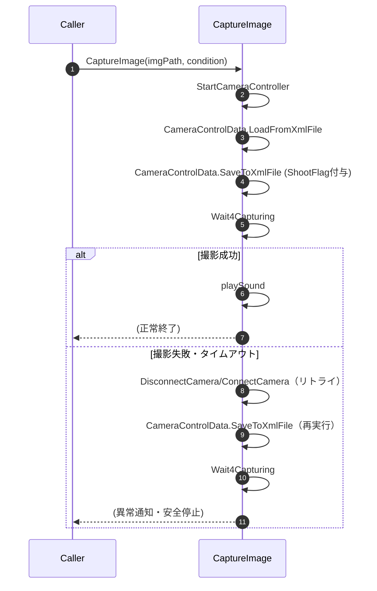
```mermaid
sequenceDiagram
    autonumber
    participant CALLER as Caller
    participant M as CaptureImage

    CALLER->>M: CaptureImage(imgPath, condition)
    M->>M: StartCameraController
    M->>M: CameraControlData.LoadFromXmlFile
    M->>M: CameraControlData.SaveToXmlFile (ShootFlag付与)
    M->>M: Wait4Capturing
    alt 撮影成功
        M->>M: playSound
        M-->>CALLER: (正常終了)
    else 撮影失敗・タイムアウト
        M->>M: DisconnectCamera/ConnectCamera（リトライ）
        M->>M: CameraControlData.SaveToXmlFile（再実行）
        M->>M: Wait4Capturing
        M-->>CALLER: (異常通知・安全停止)
    end
```

#### 8-5-3-6. OutputTargetArea

| 項目 | 内容 |
|------|------|
| シグネチャ | `private void OutputTargetArea(List<UnitInfo> lstTgtUnits, bool isGreen = false) / private void OutputTargetArea(List<UnitInfo> lstTgtUnits, int r, int g, int b)` |
| 概要 | 指定したCabinet群の領域のみ、指定色で点灯パターンを出力する。制御コマンドの生成・送信、色指定、エラー時の通知・復帰までを一連で行う。 |

引数

| No. | 引数名 | 型 | 必須 | 説明 |
|-----|--------|----|------|------|
| 1 | lstTgtUnits | List<UnitInfo> | Y | 表示対象Cabinet |
| 2 | isGreen / r,g,b | bool / int | N | 点灯色指定（緑またはRGB値） |

返り値: なし（void）

処理概要（詳細）

| 手順No. | 処理内容 | 詳細 |
|---------|----------|------|
| 1 | 前提確認 | 入力値（lstTgtUnits, 色指定）、内部状態、依存リソースを確認。 |
| 2 | コマンド生成 | `setIntSigWindowCommand`または`setFlatCommand`で、対象Cabinet・色に応じた表示コマンド電文を生成。 |
| 3 | コマンド送信 | `sendSdcpCommand`で生成コマンドを送信し、Cabinet領域のみ点灯パターンを出力。 |
| 4 | 結果反映 | 呼出元へ成否を返却し、必要な内部状態を更新。失敗時は異常通知・安全停止を行う。 |

入力条件・前提条件

| 区分 | 条件 | NG時挙動 |
|------|------|----------|
| 実行前提 | 関連モジュール、設定、入出力パスが初期化済み | 例外送出または処理中断 |
| 入力値 | lstTgtUnits, 色指定が仕様範囲内であること | 異常通知して処理中断 |

条件分岐仕様

| 条件 | 挙動 |
|------|------|
| コマンド生成・送信成功 | 点灯パターンを出力し、正常終了 |
| コマンド生成・送信失敗 | 異常通知・安全停止 |

主要呼出し先

| 呼出し先 | 役割 | 同期/非同期 |
|----------|------|--------------|
| `sendSdcpCommand` | 対象 Cabinet の内部信号表示コマンドを送信 | 同期 |
| `setIntSigWindowCommand` / `setFlatCommand` | 表示コマンド電文を組み立てる | 同期 |

例外時仕様

| ケース | 捕捉方法 | 通知/伝播 | 後処理 |
|--------|----------|-----------|--------|
| 下位処理失敗 | 下位例外または戻り値異常 | 呼出元へ通知 | 安全停止または設定復帰 |

シーケンス図

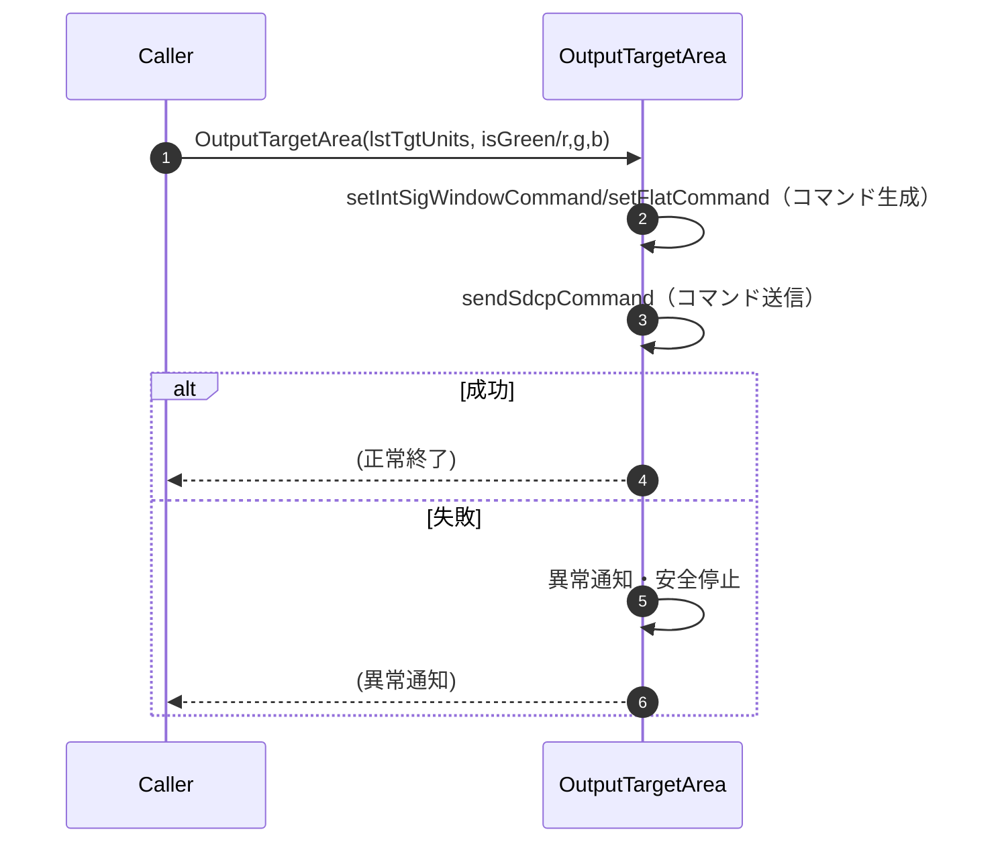
```mermaid
sequenceDiagram
    autonumber
    participant CALLER as Caller
    participant M as OutputTargetArea

    CALLER->>M: OutputTargetArea(lstTgtUnits, isGreen/r,g,b)
    M->>M: setIntSigWindowCommand/setFlatCommand（コマンド生成）
    M->>M: sendSdcpCommand（コマンド送信）
    alt 成功
        M-->>CALLER: (正常終了)
    else 失敗
        M->>M: 異常通知・安全停止
        M-->>CALLER: (異常通知)
    end
```

#### 8-5-3-7. calcMeasAreaPv

| 項目 | 内容 |
|------|------|
| シグネチャ | `private void calcMeasAreaPv(List<UnitInfo> lstTgtCabi, string path, ViewPoint vp)` |
| 概要 | 指定Cabinet群・パス・視点情報に基づき、測定エリアのマスク画像生成・領域解析・画素値算出を一連で実行する。工程自動化や校正・検証用途に利用される。 |

引数

| No. | 引数名 | 型 | 必須 | 説明 |
|-----|--------|----|------|------|
| 1 | lstTgtCabi | List<UnitInfo> | Y | 対象Cabinet群 |
| 2 | path | string | Y | 解析対象パス（画像・RAW格納先） |
| 3 | vp | ViewPoint | Y | 視点情報（カメラ位置・姿勢） |

返り値: なし（void）

処理概要（詳細）

| 手順No. | 処理内容 | 詳細 |
|---------|----------|------|
| 1 | 前提確認 | 入力値（lstTgtCabi, path, vp）、内部状態、依存リソースを確認。 |
| 2 | マスク画像生成 | `MakeMaskImageArw`でエリア画像・Black画像から測定用マスク画像を生成。 |
| 3 | 測定領域解析 | `storeUfMeasArea`でTrimmingArea抽出、Cabinet/Module/9分割座標・校正テーブル値を格納。領域不正や検出数不一致時は例外送出。 |
| 4 | 画素値算出 | `storeUfCamPv`でR/G/B/Black RAW画像を読込み、各測定点の補正済み画素値を格納。RAW読込失敗時は例外送出。 |
| 5 | 結果反映 | 呼出元へ完了通知。失敗時は異常通知・計測中断・エラーメッセージ表示。 |

入力条件・前提条件

| 区分 | 条件 | NG時挙動 |
|------|------|----------|
| 実行前提 | 関連モジュール、設定、入出力パスが初期化済み | 例外送出または処理中断 |
| 入力値 | lstTgtCabi, path, vpが仕様範囲内であること | 異常通知して処理中断 |

条件分岐仕様

| 条件 | 挙動 |
|------|------|
| 全工程成功 | 測定点座標・画素値を格納し正常終了 |
| 領域不正・検出数不一致・RAW読込失敗 | 例外送出・計測中断・エラー表示 |

主要呼出し先

| 呼出し先 | 役割 | 同期/非同期 |
|----------|------|--------------|
| `MakeMaskImageArw` | エリア画像とBlack画像からマスク画像を生成 | 同期 |
| `storeUfMeasArea` | 測定点の座標・校正テーブル値を格納 | 同期 |
| `storeUfCamPv` | R/G/B/Black RAW画像を読込み各測定点の画素値を格納 | 同期 |

例外時仕様

| ケース | 捕捉方法 | 通知/伝播 | 後処理 |
|--------|----------|-----------|--------|
| マスク画像生成失敗 | 下位例外 | 呼出元へ送出 | 処理中断 |
| モジュール検出数不一致 | `storeUfMeasArea` 内の条件判定 | `Exception` 送出 | 計測中断、エラーメッセージ表示 |
| 測定領域不正（幅/高さ≦0） | `storeUfMeasArea` 内の条件判定 | `Exception` 送出 | 計測中断、座標情報付きエラー表示 |
| RAW読込失敗 | `storeUfCamPv` 内の `loadArwFile` 例外 | 呼出元へ送出 | 処理中断 |

シーケンス図

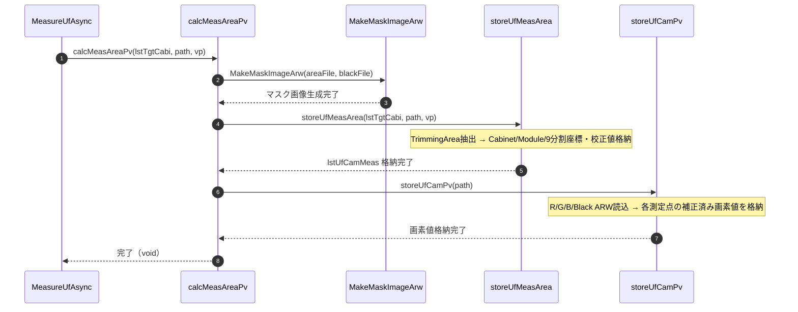
```mermaid
sequenceDiagram
    autonumber
    participant CALLER as MeasureUfAsync
    participant M as calcMeasAreaPv
    participant MASK as MakeMaskImageArw
    participant STORE as storeUfMeasArea
    participant PV as storeUfCamPv

    CALLER->>M: calcMeasAreaPv(lstTgtCabi, path, vp)
    M->>MASK: MakeMaskImageArw(areaFile, blackFile)
    MASK-->>M: マスク画像生成完了
    M->>STORE: storeUfMeasArea(lstTgtCabi, path, vp)
    Note over STORE: TrimmingArea抽出 → Cabinet/Module/9分割座標・校正値格納
    STORE-->>M: lstUfCamMeas 格納完了
    M->>PV: storeUfCamPv(path)
    Note over PV: R/G/B/Black ARW読込 → 各測定点の補正済み画素値を格納
    PV-->>M: 画素値格納完了
    M-->>CALLER: 完了（void）
```

#### 8-5-3-8. DeleteUnwantedImagesMeas

| 項目 | 内容 |
|------|------|
| シグネチャ | `private void DeleteUnwantedImagesMeas(string path)` |
| 概要 | 計測中間画像を削除して後片付けする。 |

引数

| No. | 引数名 | 型 | 必須 | 説明 |
|-----|--------|----|------|------|
| 1 | path | string | Y | 削除対象ディレクトリ |

返り値: なし（void）

処理概要（詳細）

| 手順No. | 処理内容 | 詳細 |
|---------|----------|------|
| 1 | 前提確認 | 入力値・内部状態・依存リソースを確認する。 |
| 2 | 主処理実行 | 計測中間画像を削除して後片付けする。 |
| 3 | 結果反映 | 呼出元へ成否を返し、必要な内部状態を更新する。 |

入力条件・前提条件

| 区分 | 条件 | NG時挙動 |
|------|------|----------|
| 実行前提 | 関連モジュール、設定、入出力パスが初期化済みであること | 例外送出または処理中断 |
| 入力値 | 引数値が仕様範囲内であること | 異常通知して処理中断 |

条件分岐仕様

| 条件 | 挙動 |
|------|------|
| 正常系 | 主処理を完了し結果を返却する。 |
| 異常系 | 例外時仕様に従って通知・復帰する。 |

主要呼出し先

| 呼出し先 | 役割 | 同期/非同期 |
|----------|------|--------------|
| `File.Delete` | 計測中間画像と一時画像を削除する | 同期 |

例外時仕様

| ケース | 捕捉方法 | 通知/伝播 | 後処理 |
|--------|----------|-----------|--------|
| 下位処理失敗 | 下位例外または戻り値異常 | 呼出元へ通知 | 安全停止または設定復帰 |

シーケンス図

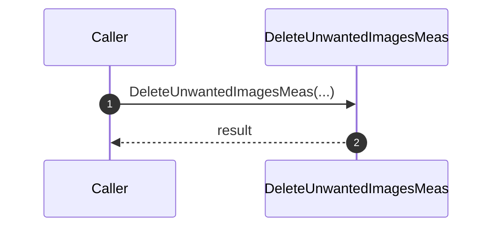
```mermaid
sequenceDiagram
    autonumber
    participant CALLER as Caller
    participant M as DeleteUnwantedImagesMeas

    CALLER->>M: DeleteUnwantedImagesMeas(...)
    M-->>CALLER: result
```

#### 8-5-3-9. loadArwFile

| 項目 | 内容 |
|------|------|
| シグネチャ | `private void loadArwFile(string file, out AcqARW arwHelper, bool loadLedCt = false)` |
| 概要 | ARWファイルを読込み、ヘッダ/IFD展開、カメラ・レンズ・ズーム妥当性を検証し、必要時にLED校正テーブルを読込む。 |

引数

| No. | 引数名 | 型 | 必須 | 説明 |
|-----|--------|----|------|------|
| 1 | file | string | Y | 読込み対象ARWファイルパス |
| 2 | arwHelper(out) | AcqARW | Y | 展開結果格納先 |
| 3 | loadLedCt | bool | N | LED校正テーブル読込有無（既定 false） |

返り値: なし（void）

処理概要（詳細）

| 手順No. | 処理内容 | 詳細 |
|---------|----------|------|
| 1 | 中断確認 | `CheckUserAbort()` でユーザー中断要求を確認する。 |
| 2 | ARW読込 | 指定ファイルを `FileStream` で読込み、`buffer` を生成する。 |
| 3 | ARW展開 | `AcqARW` の `SetARW` / `SetTiffHeader` / `Set*IFD` を順次実行し、失敗時は `LastErrorMessage` で例外化する。 |
| 4 | 機種/レンズ/ズーム検証 | 設定カメラ（ILCE-6400/ILCE-7RM3）に対して Model、LensModel、FocalLength（ワイド端）を検証する。 |
| 5 | LED校正読込（任意） | `loadLedCt == true` の場合、LEDモデル補正名を正規化して `LedCorrectionData` を読込み、SHA256を更新する。 |

入力条件・前提条件

| 区分 | 条件 | NG時挙動 |
|------|------|----------|
| 入力ファイル | `file` が存在し、ARW形式として読込可能であること | 下位例外または展開例外 |
| 設定整合 | `Settings.Ins.Camera.Name` と撮影データの機種・レンズ・ズームが整合すること | 例外送出 |
| 校正データ | `loadLedCt=true` 時に対応XMLが存在すること | 読込例外送出 |

条件分岐仕様

| 条件 | 挙動 |
|------|------|
| カメラ設定が ILCE-6400 | 登録レンズ（LensNames[0]/[2]）かつズーム16mmを検証する。 |
| カメラ設定が ILCE-7RM3 | 登録レンズ（LensNames[1]）かつズーム24mmを検証する。 |
| `loadLedCt == true` | LEDモデル（S3派生含む）を正規化して `LedCorrectionData` を読込む。 |
| それ以外の機種 | `An unregistered camera is being used.` 例外を送出する。 |

主要呼出し先

| 呼出し先 | 役割 | 同期/非同期 |
|----------|------|--------------|
| `calcMeasAreaPv` | 計測画像解析前のARW読込 | 同期 |
| `GetFlatImages` | Flat画像群の読込 | 同期 |
| 調整ログ生成系処理 | Black/Flat ARW読込 | 同期 |
| `AcqARW.Set*` / `LedCorrectionData.LoadFromXmlFile` | ARW展開と校正テーブル読込 | 同期 |

例外時仕様

| ケース | 捕捉方法 | 通知/伝播 | 後処理 |
|--------|----------|-----------|--------|
| ARW展開失敗 | `Set*` 戻り値 false | `LastErrorMessage` 付きで上位へ送出 | 当該画像処理中断 |
| 機種/レンズ/ズーム不一致 | 条件判定 | 例外を上位へ送出 | 計測/調整処理中断 |
| 校正XML読込失敗 | 下位例外 | 上位へ送出 | 校正反映を中断 |

シーケンス図

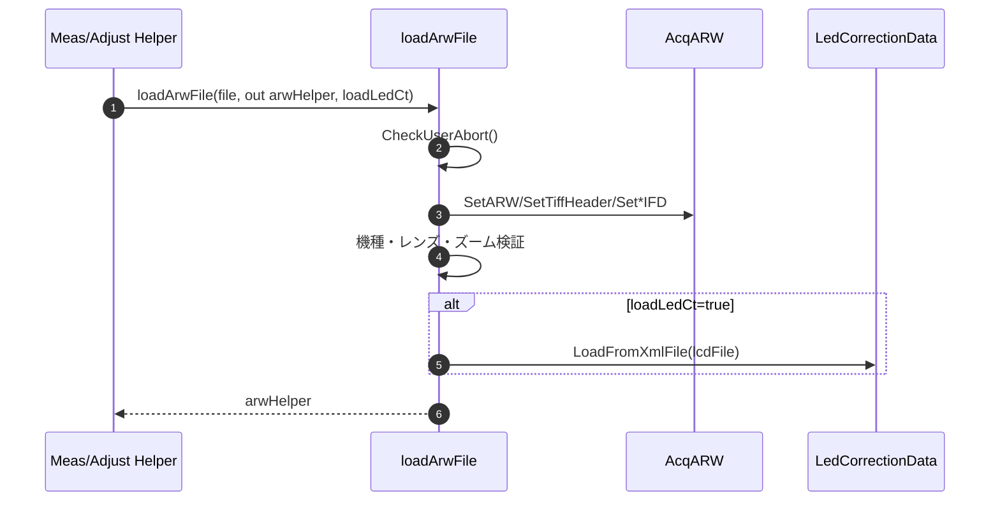
```mermaid
sequenceDiagram
    autonumber
    participant CALLER as Meas/Adjust Helper
    participant L as loadArwFile
    participant ARW as AcqARW
    participant LCD as LedCorrectionData

    CALLER->>L: loadArwFile(file, out arwHelper, loadLedCt)
    L->>L: CheckUserAbort()
    L->>ARW: SetARW/SetTiffHeader/Set*IFD
    L->>L: 機種・レンズ・ズーム検証
    alt loadLedCt=true
        L->>LCD: LoadFromXmlFile(lcdFile)
    end
    L-->>CALLER: arwHelper
```

##### 8-5-3-B. CameraDataClass.cs（制御条件XML入出力）

#### 8-5-3-10. CameraControlData.LoadFromXmlFile

| 項目 | 内容 |
|------|------|
| シグネチャ | `public static bool CameraControlData.LoadFromXmlFile(string path, out CameraControlData data)` |
| 概要 | カメラ制御XMLを逆シリアル化して `CameraControlData` を復元する。ファイルアクセス競合時は再試行する。 |

引数

| No. | 引数名 | 型 | 必須 | 説明 |
|-----|--------|----|------|------|
| 1 | path | string | Y | 読込み対象XMLファイルパス |
| 2 | data(out) | CameraControlData | Y | 復元結果格納先 |

返り値: bool（成功=true）

処理概要（詳細）

| 手順No. | 処理内容 | 詳細 |
|---------|----------|------|
| 1 | 初期化 | `count=0`、`data=null` で開始する。 |
| 2 | 読込試行 | `StreamReader` + `XmlSerializer(typeof(CameraControlData))` で逆シリアル化する。 |
| 3 | 成功判定 | 逆シリアル化成功時に true を返す。 |
| 4 | 再試行 | 失敗時は `count` を増加し、上限超過まで `Thread.Sleep(100)` 後に再試行する。 |
| 5 | 失敗終了 | `count > 10` の場合は例外を再送出する。 |

入力条件・前提条件

| 区分 | 条件 | NG時挙動 |
|------|------|----------|
| 入力ファイル | `path` に有効なCameraControlData XMLが存在すること | 再試行後に例外送出 |
| 書式整合 | XML構造が `CameraControlData` と整合すること | 逆シリアル化失敗 |

条件分岐仕様

| 条件 | 挙動 |
|------|------|
| 読込成功 | `data` を復元して true を返す。 |
| 読込失敗かつ `count <= 10` | 100ms待機後に再試行する。 |
| 読込失敗かつ `count > 10` | 例外を送出して終了する。 |

主要呼出し先

| 呼出し先 | 役割 | 同期/非同期 |
|----------|------|--------------|
| `CaptureImage(string)` | 前回制御条件の読込 | 同期 |
| `CloseCamera` | CloseFlag更新前の既存条件読込 | 同期 |
| `XmlSerializer.Deserialize` | CameraControlData復元 | 同期 |

例外時仕様

| ケース | 捕捉方法 | 通知/伝播 | 後処理 |
|--------|----------|-----------|--------|
| ファイルアクセス拒否・ロック | catchで再試行 | 11回超過時に例外送出 | 呼出元で撮影/接続処理を中断または復旧 |
| XML不正 | 逆シリアル化例外 | 11回超過時に例外送出 | 呼出元側で新規データ生成等へ分岐 |

シーケンス図

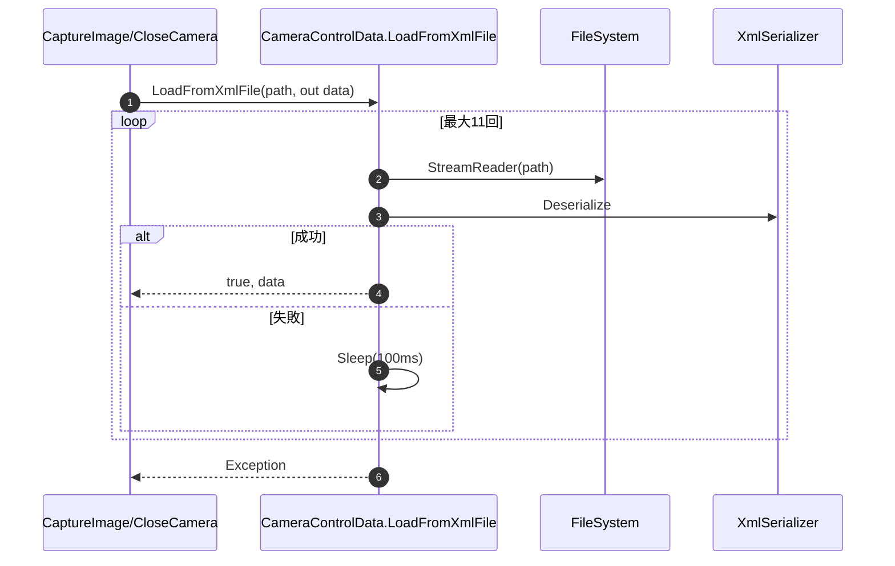
```mermaid
sequenceDiagram
    autonumber
    participant CALLER as CaptureImage/CloseCamera
    participant L as CameraControlData.LoadFromXmlFile
    participant FS as FileSystem
    participant XS as XmlSerializer

    CALLER->>L: LoadFromXmlFile(path, out data)
    loop 最大11回
        L->>FS: StreamReader(path)
        L->>XS: Deserialize
        alt 成功
            L-->>CALLER: true, data
        else 失敗
            L->>L: Sleep(100ms)
        end
    end
    L-->>CALLER: Exception
```

#### 8-5-3-11. CameraControlData.SaveToXmlFile

| 項目 | 内容 |
|------|------|
| シグネチャ | `public static bool CameraControlData.SaveToXmlFile(string path, CameraControlData data)` |
| 概要 | `CameraControlData` をXMLへシリアル化保存する。アクセス競合時は再試行し、上限超過時は例外送出する。 |

引数

| No. | 引数名 | 型 | 必須 | 説明 |
|-----|--------|----|------|------|
| 1 | path | string | Y | 保存先XMLファイルパス |
| 2 | data | CameraControlData | Y | 保存対象データ |

返り値: bool（成功=true）

処理概要（詳細）

| 手順No. | 処理内容 | 詳細 |
|---------|----------|------|
| 1 | 初期化 | `count=0` で保存ループを開始する。 |
| 2 | Writer設定 | `XmlWriterSettings`（Indent/Tab/NewLineOnAttributes）を設定する。 |
| 3 | 保存試行 | `XmlWriter.Create(path, settings)` と `XmlSerializer.Serialize(writer, data)` で保存する。 |
| 4 | 成功判定 | 保存成功時に true を返す。 |
| 5 | 再試行/失敗終了 | 失敗時は `count` 増加、`Thread.Sleep(100)` して再試行し、`count > 10` で例外送出する。 |

入力条件・前提条件

| 区分 | 条件 | NG時挙動 |
|------|------|----------|
| 出力先 | `path` の親ディレクトリへ書込み可能であること | 再試行後に例外送出 |
| 保存対象 | `data` がシリアル化可能状態であること | 保存失敗 |

条件分岐仕様

| 条件 | 挙動 |
|------|------|
| 保存成功 | true を返す。 |
| 保存失敗かつ `count <= 10` | 100ms待機後に再試行する。 |
| 保存失敗かつ `count > 10` | 例外を送出して終了する。 |

主要呼出し先

| 呼出し先 | 役割 | 同期/非同期 |
|----------|------|--------------|
| `CaptureImage`（2オーバーロード） | ShootFlag付き制御条件保存 | 同期 |
| `AutoFocus` | AF条件保存 | 同期 |
| `CloseCamera` | CloseFlag保存 | 同期 |
| `XmlSerializer.Serialize` | CameraControlDataのXML保存 | 同期 |

例外時仕様

| ケース | 捕捉方法 | 通知/伝播 | 後処理 |
|--------|----------|-----------|--------|
| 書込み競合・アクセス拒否 | catchで再試行 | 11回超過時に例外送出 | 呼出元で再接続/再試行へ分岐 |
| 保存先不正 | 下位例外 | 11回超過時に例外送出 | 当該撮影/AF処理中断 |

シーケンス図

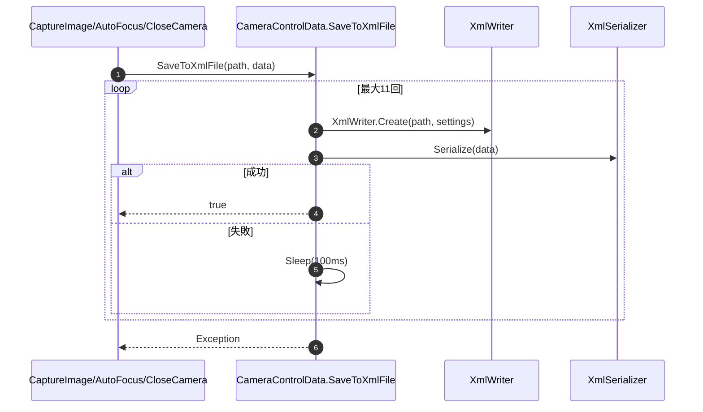
```mermaid
sequenceDiagram
    autonumber
    participant CALLER as CaptureImage/AutoFocus/CloseCamera
    participant S as CameraControlData.SaveToXmlFile
    participant XW as XmlWriter
    participant XS as XmlSerializer

    CALLER->>S: SaveToXmlFile(path, data)
    loop 最大11回
        S->>XW: XmlWriter.Create(path, settings)
        S->>XS: Serialize(data)
        alt 成功
            S-->>CALLER: true
        else 失敗
            S->>S: Sleep(100ms)
        end
    end
    S-->>CALLER: Exception
```

##### 8-5-3-C. MainWindow.xaml.cs（内部信号パターン出力）

#### 8-5-3-12. outputIntSigFlat

| 項目 | 内容 |
|------|------|
| シグネチャ | `private void outputIntSigFlat(int r = 492, int g = 492, int b = 492)` |
| 概要 | 画面全体へ単色フラット内部信号を出力する。 |

引数

| No. | 引数名 | 型 | 必須 | 説明 |
|-----|--------|----|------|------|
| 1 | r | int | N | Redレベル（既定492） |
| 2 | g | int | N | Greenレベル（既定492） |
| 3 | b | int | N | Blueレベル（既定492） |

返り値: なし（void）

処理概要（詳細）

| 手順No. | 処理内容 | 詳細 |
|---------|----------|------|
| 1 | コマンド生成 | Flat出力用内部信号コマンドを生成する。 |
| 2 | 色設定 | RGBレベルをコマンドへ設定する。 |
| 3 | 送信 | 全Controllerへ送信し表示を更新する。 |

入力条件・前提条件

| 区分 | 条件 | NG時挙動 |
|------|------|----------|
| 実行前提 | Controller通信が有効であること | 送信失敗時は上位で例外処理 |

条件分岐仕様

| 条件 | 挙動 |
|------|------|
| `NO_CONTROLLER` | 実送信を省略し内部状態更新のみ行う。 |

主要呼出し先

| 呼出し先 | 役割 | 同期/非同期 |
|----------|------|--------------|
| `GapCamera` / `UfCamera` | パターン表示（Flat） | 同期 |

例外時仕様

| ケース | 捕捉方法 | 通知/伝播 | 後処理 |
|--------|----------|-----------|--------|
| 送信失敗 | 下位例外 | 呼出元へ送出 | 当該表示処理中断 |

シーケンス図

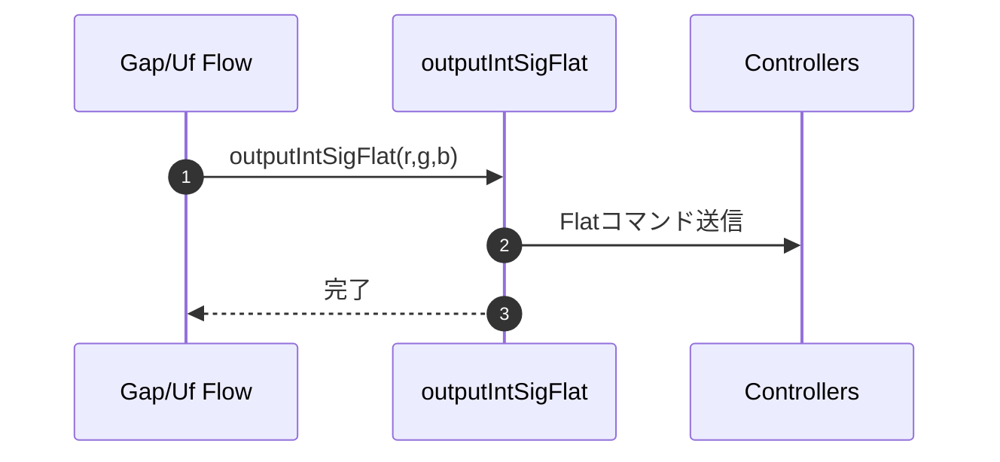
```mermaid
sequenceDiagram
    autonumber
    participant CALLER as Gap/Uf Flow
    participant SIG as outputIntSigFlat
    participant CTRL as Controllers

    CALLER->>SIG: outputIntSigFlat(r,g,b)
    SIG->>CTRL: Flatコマンド送信
    SIG-->>CALLER: 完了
```

#### 8-5-3-13. outputIntSigWindow

| 項目 | 内容 |
|------|------|
| シグネチャ | `private void outputIntSigWindow(int startX, int startY, int height, int width, int R = 492, int G = 492, int B = 492)` |
| 概要 | 指定矩形領域へ内部信号ウィンドウを出力する。 |

引数

| No. | 引数名 | 型 | 必須 | 説明 |
|-----|--------|----|------|------|
| 1 | startX/startY | int | Y | 表示開始座標 |
| 2 | height/width | int | Y | 表示サイズ |
| 3 | R/G/B | int | N | 色レベル（既定492） |

返り値: なし（void）

処理概要（詳細）

| 手順No. | 処理内容 | 詳細 |
|---------|----------|------|
| 1 | パラメータ設定 | 開始座標、サイズ、色をコマンドへ設定する。 |
| 2 | 出力 | 対象Controllerへウィンドウ信号を送信する。 |
| 3 | 表示反映 | 指定領域のみ点灯状態に更新する。 |

入力条件・前提条件

| 区分 | 条件 | NG時挙動 |
|------|------|----------|
| 領域条件 | 座標/サイズが画面範囲内であること | 範囲外は表示不正または例外 |

条件分岐仕様

| 条件 | 挙動 |
|------|------|
| `NO_CONTROLLER` | 実送信を省略する。 |

主要呼出し先

| 呼出し先 | 役割 | 同期/非同期 |
|----------|------|--------------|
| `GapCamera` / `UfCamera` | 対象領域表示 | 同期 |

例外時仕様

| ケース | 捕捉方法 | 通知/伝播 | 後処理 |
|--------|----------|-----------|--------|
| 領域設定不正/送信失敗 | 下位例外 | 呼出元へ送出 | 当該表示処理中断 |

シーケンス図

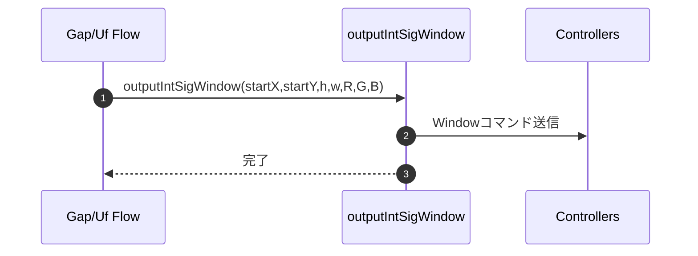
```mermaid
sequenceDiagram
    autonumber
    participant CALLER as Gap/Uf Flow
    participant SIG as outputIntSigWindow
    participant CTRL as Controllers

    CALLER->>SIG: outputIntSigWindow(startX,startY,h,w,R,G,B)
    SIG->>CTRL: Windowコマンド送信
    SIG-->>CALLER: 完了
```

#### 8-5-3-14. outputIntSigHatch

| 項目 | 内容 |
|------|------|
| シグネチャ | `private void outputIntSigHatch(int startX, int startY, int height, int width, int pitchH, int pitchV, int R = 492, int G = 492, int B = 492)` |
| 概要 | 指定領域へハッチパターン内部信号を出力する。 |

引数

| No. | 引数名 | 型 | 必須 | 説明 |
|-----|--------|----|------|------|
| 1 | startX/startY | int | Y | 表示開始座標 |
| 2 | height/width | int | Y | 表示サイズ |
| 3 | pitchH/pitchV | int | Y | ハッチピッチ |
| 4 | R/G/B | int | N | 色レベル（既定492） |

返り値: なし（void）

処理概要（詳細）

| 手順No. | 処理内容 | 詳細 |
|---------|----------|------|
| 1 | パターン設定 | 座標、サイズ、ピッチ、色をコマンドへ設定する。 |
| 2 | 送信 | ハッチコマンドをControllerへ送信する。 |
| 3 | 表示更新 | 対象領域へハッチ表示を反映する。 |

入力条件・前提条件

| 区分 | 条件 | NG時挙動 |
|------|------|----------|
| ピッチ条件 | `pitchH`/`pitchV` が有効な正値であること | 表示不正または例外 |

条件分岐仕様

| 条件 | 挙動 |
|------|------|
| `NO_CONTROLLER` | 実送信を省略する。 |

主要呼出し先

| 呼出し先 | 役割 | 同期/非同期 |
|----------|------|--------------|
| `GapCamera` / `UfCamera` | モジュール強調表示 | 同期 |

例外時仕様

| ケース | 捕捉方法 | 通知/伝播 | 後処理 |
|--------|----------|-----------|--------|
| パラメータ不正/送信失敗 | 下位例外 | 呼出元へ送出 | 当該表示処理中断 |

シーケンス図

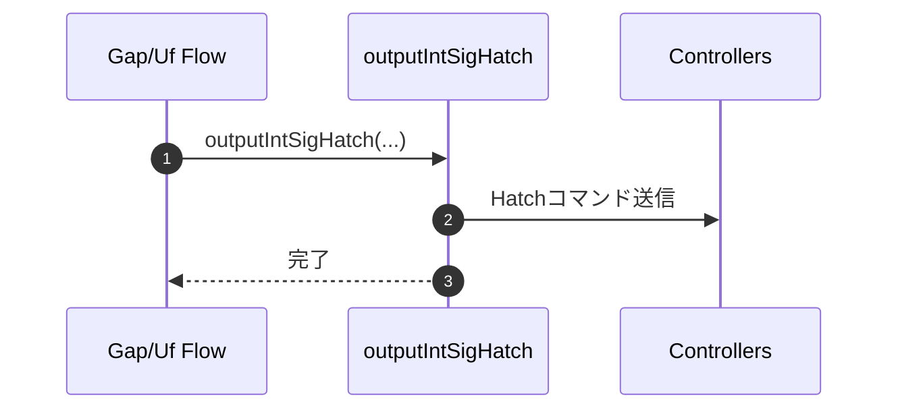
```mermaid
sequenceDiagram
    autonumber
    participant CALLER as Gap/Uf Flow
    participant SIG as outputIntSigHatch
    participant CTRL as Controllers

    CALLER->>SIG: outputIntSigHatch(...)
    SIG->>CTRL: Hatchコマンド送信
    SIG-->>CALLER: 完了
```

#### 8-5-3-15. outputIntSigHatchInv

| 項目 | 内容 |
|------|------|
| シグネチャ | `private void outputIntSigHatchInv(int startX, int startY, int height, int width, int pitchH, int pitchV, int R = 492, int G = 492, int B = 492)` |
| 概要 | 指定領域へ反転ハッチパターン内部信号を出力する。 |

引数

| No. | 引数名 | 型 | 必須 | 説明 |
|-----|--------|----|------|------|
| 1 | startX/startY | int | Y | 表示開始座標 |
| 2 | height/width | int | Y | 表示サイズ |
| 3 | pitchH/pitchV | int | Y | ハッチピッチ |
| 4 | R/G/B | int | N | 色レベル（既定492） |

返り値: なし（void）

処理概要（詳細）

| 手順No. | 処理内容 | 詳細 |
|---------|----------|------|
| 1 | パターン設定 | 反転ハッチ用の座標/サイズ/ピッチ/色を設定する。 |
| 2 | 送信 | 反転ハッチコマンドをControllerへ送信する。 |
| 3 | 表示更新 | 対象領域へ反転ハッチ表示を反映する。 |

入力条件・前提条件

| 区分 | 条件 | NG時挙動 |
|------|------|----------|
| ピッチ条件 | `pitchH`/`pitchV` が有効な正値であること | 表示不正または例外 |

条件分岐仕様

| 条件 | 挙動 |
|------|------|
| `NO_CONTROLLER` | 実送信を省略する。 |

主要呼出し先

| 呼出し先 | 役割 | 同期/非同期 |
|----------|------|--------------|
| `GapCamera` | Gap測定/補正時の反転ハッチ表示 | 同期 |

例外時仕様

| ケース | 捕捉方法 | 通知/伝播 | 後処理 |
|--------|----------|-----------|--------|
| パラメータ不正/送信失敗 | 下位例外 | 呼出元へ送出 | 当該表示処理中断 |

シーケンス図

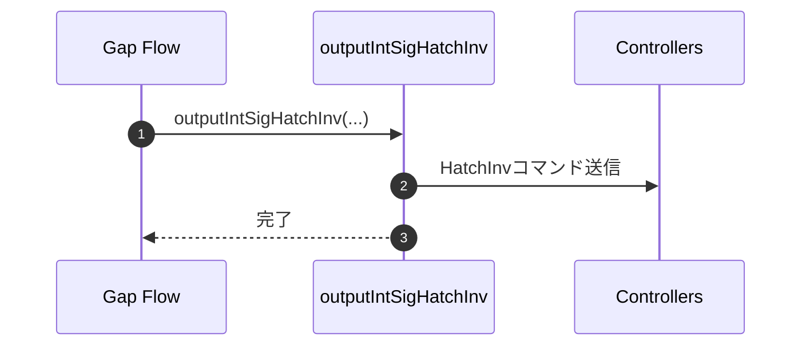
```mermaid
sequenceDiagram
    autonumber
    participant CALLER as Gap Flow
    participant SIG as outputIntSigHatchInv
    participant CTRL as Controllers

    CALLER->>SIG: outputIntSigHatchInv(...)
    SIG->>CTRL: HatchInvコマンド送信
    SIG-->>CALLER: 完了
```

#### 8-5-3-16. outputIntSigFlatGap

| 項目 | 内容 |
|------|------|
| シグネチャ | `private void outputIntSigFlatGap(int startX, int startY, int height, int width, int pitchH, int pitchV, int FlatR, int FlatG, int FlatB, int GapR, int GapG, int GapB)` |
| 概要 | Flat色とGap色を組み合わせたGap補正用パターンを指定領域へ出力する。 |

引数

| No. | 引数名 | 型 | 必須 | 説明 |
|-----|--------|----|------|------|
| 1 | startX/startY | int | Y | 表示開始座標 |
| 2 | height/width | int | Y | 表示サイズ |
| 3 | pitchH/pitchV | int | Y | Gapパターンピッチ |
| 4 | FlatR/FlatG/FlatB | int | Y | Flat色レベル |
| 5 | GapR/GapG/GapB | int | Y | Gap色レベル |

返り値: なし（void）

処理概要（詳細）

| 手順No. | 処理内容 | 詳細 |
|---------|----------|------|
| 1 | パラメータ設定 | Flat色・Gap色と領域情報をコマンドへ設定する。 |
| 2 | 送信 | GapパターンコマンドをControllerへ送信する。 |
| 3 | 表示更新 | Gap補正用表示へ切替える。 |

入力条件・前提条件

| 区分 | 条件 | NG時挙動 |
|------|------|----------|
| 色条件 | Flat/Gap色が機器許容範囲内であること | 表示不正または例外 |

条件分岐仕様

| 条件 | 挙動 |
|------|------|
| `NO_CONTROLLER` | 実送信を省略する。 |

主要呼出し先

| 呼出し先 | 役割 | 同期/非同期 |
|----------|------|--------------|
| `GapCamera` | Gap補正表示 | 同期 |

例外時仕様

| ケース | 捕捉方法 | 通知/伝播 | 後処理 |
|--------|----------|-----------|--------|
| パラメータ不正/送信失敗 | 下位例外 | 呼出元へ送出 | 当該表示処理中断 |

シーケンス図

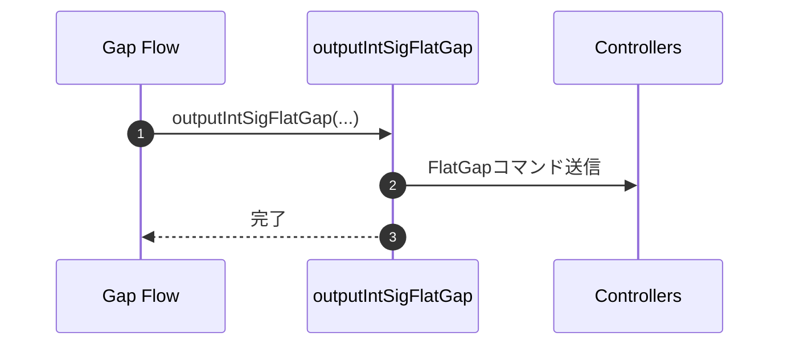
```mermaid
sequenceDiagram
    autonumber
    participant CALLER as Gap Flow
    participant SIG as outputIntSigFlatGap
    participant CTRL as Controllers

    CALLER->>SIG: outputIntSigFlatGap(...)
    SIG->>CTRL: FlatGapコマンド送信
    SIG-->>CALLER: 完了
```

#### 8-5-3-17. outputIntSigChecker

| 項目 | 内容 |
|------|------|
| シグネチャ | `private void outputIntSigChecker(int startX, int startY, int height, int width, int pitchH, int pitchV, int R = 492, int G = 492, int B = 492)` |
| 概要 | 指定領域へチェッカーパターン内部信号を出力する。 |

引数

| No. | 引数名 | 型 | 必須 | 説明 |
|-----|--------|----|------|------|
| 1 | startX/startY | int | Y | 表示開始座標 |
| 2 | height/width | int | Y | 表示サイズ |
| 3 | pitchH/pitchV | int | Y | チェッカーピッチ |
| 4 | R/G/B | int | N | 色レベル（既定492） |

返り値: なし（void）

処理概要（詳細）

| 手順No. | 処理内容 | 詳細 |
|---------|----------|------|
| 1 | パターン設定 | チェッカー出力用の領域・ピッチ・色を設定する。 |
| 2 | 送信 | チェッカーコマンドをControllerへ送信する。 |
| 3 | 表示更新 | 指定領域をチェッカーパターン表示へ更新する。 |

入力条件・前提条件

| 区分 | 条件 | NG時挙動 |
|------|------|----------|
| 領域/ピッチ条件 | 座標・サイズ・ピッチが有効範囲内であること | 表示不正または例外 |

条件分岐仕様

| 条件 | 挙動 |
|------|------|
| `NO_CONTROLLER` | 実送信を省略する。 |

主要呼出し先

| 呼出し先 | 役割 | 同期/非同期 |
|----------|------|--------------|
| `GapCamera` / `UfCamera` | 位置合わせ・AF前表示・解析補助表示 | 同期 |

例外時仕様

| ケース | 捕捉方法 | 通知/伝播 | 後処理 |
|--------|----------|-----------|--------|
| 送信失敗 | 下位例外 | 呼出元へ送出 | 当該表示処理中断 |

シーケンス図

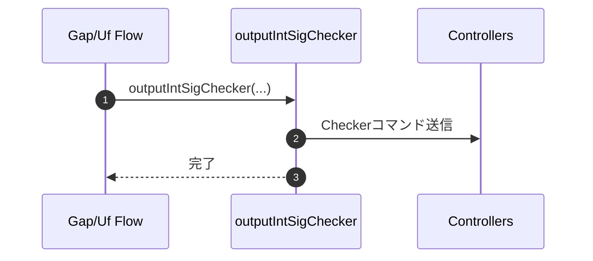
```mermaid
sequenceDiagram
    autonumber
    participant CALLER as Gap/Uf Flow
    participant SIG as outputIntSigChecker
    participant CTRL as Controllers

    CALLER->>SIG: outputIntSigChecker(...)
    SIG->>CTRL: Checkerコマンド送信
    SIG-->>CALLER: 完了
```

##### 8-5-3-D. GapCamera.cs（Controller単位表示制御）

#### 8-5-3-18. outputIntSigWindowByController

| 項目 | 内容 |
|------|------|
| シグネチャ | `private void outputIntSigWindowByController(int startX, int startY, int height, int width, ControllerInfo cont, int R = 492, int G = 492, int B = 492)` |
| 概要 | 指定したController 1台に対して、指定矩形領域へ内部信号ウィンドウを出力する。 |

引数

| No. | 引数名 | 型 | 必須 | 説明 |
|-----|--------|----|------|------|
| 1 | startX/startY | int | Y | 表示開始座標 |
| 2 | height/width | int | Y | 表示サイズ |
| 3 | cont | ControllerInfo | Y | 出力対象Controller |
| 4 | R/G/B | int | N | 色レベル（既定492） |

返り値: なし（void）

処理概要（詳細）

| 手順No. | 処理内容 | 詳細 |
|---------|----------|------|
| 1 | コマンド設定 | 対象領域、対象Controller、RGBレベルを設定する。 |
| 2 | 単体送信 | 指定した `cont` にのみWindowコマンドを送信する。 |
| 3 | 表示反映 | 対象Controllerの表示を更新する。 |

入力条件・前提条件

| 区分 | 条件 | NG時挙動 |
|------|------|----------|
| 対象Controller | `cont` が有効な接続情報を保持していること | 送信失敗または例外 |
| 領域条件 | 座標/サイズがパネル仕様範囲内であること | 表示不正または例外 |

条件分岐仕様

| 条件 | 挙動 |
|------|------|
| `cont == null` または通信不可 | コマンド送信失敗として上位へ伝播する。 |
| 送信成功 | 対象Controllerのみ表示が更新される。 |

主要呼出し先

| 呼出し先 | 役割 | 同期/非同期 |
|----------|------|--------------|
| `GapCamera` | Controller単位の測定領域表示制御 | 同期 |

例外時仕様

| ケース | 捕捉方法 | 通知/伝播 | 後処理 |
|--------|----------|-----------|--------|
| 通信失敗/Controller情報不正 | 下位例外 | 呼出元へ送出 | 当該表示処理中断 |

シーケンス図

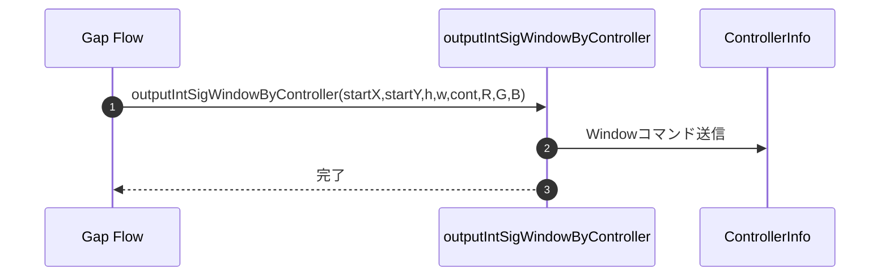
```mermaid
sequenceDiagram
    autonumber
    participant CALLER as Gap Flow
    participant SIG as outputIntSigWindowByController
    participant CONT as ControllerInfo

    CALLER->>SIG: outputIntSigWindowByController(startX,startY,h,w,cont,R,G,B)
    SIG->>CONT: Windowコマンド送信
    SIG-->>CALLER: 完了
```

#### 8-5-3-19. MakeMaskImageArw

| 項目 | 内容 |
|------|------|
| シグネチャ | `unsafe private void MakeMaskImageArw(string file, string blackFile, string newMaskFile = "", int dilateSize = 1)` |
| 概要 | ARW画像とBlack画像の差分から測定領域マスクJPEGを生成する。 |

引数

| No. | 引数名 | 型 | 必須 | 説明 |
|-----|--------|----|------|------|
| 1 | file | string | Y | マスク元ARW |
| 2 | blackFile | string | Y | Black画像ARW |
| 3 | newMaskFile | string | N | 出力マスクJPEGパス |
| 4 | dilateSize | int | N | 膨張回数 |

返り値: なし（void）

処理概要（詳細）

| 手順No. | 処理内容 | 詳細 |
|---------|----------|------|
| 1 | RAW読込 | 元画像とBlack画像を読込み差分元を準備する。 |
| 2 | 2値化 | Green差分画像を8bit化し Otsu で2値化する。 |
| 3 | 最大領域抽出 | Blob 面積で最大測定領域を選択する。 |
| 4 | マスク生成 | 矩形塗りつぶしと膨張処理でマスク画像を作成し JPEG 保存する。 |

入力条件・前提条件

| 区分 | 条件 | NG時挙動 |
|------|------|----------|
| 入力画像 | `file` と `blackFile` が ARW として読込可能であること | 下位例外を上位へ伝播 |
| 出力先 | マスク画像保存先へ書込み可能であること | 例外送出 |

条件分岐仕様

| 条件 | 挙動 |
|------|------|
| `newMaskFile` 未指定 | 既定名 `Mask.jpg` を出力する。 |
| `SaveIntImage=true` | 中間画像を Temp へ保存する。 |

主要呼出し先

| 呼出し先 | 役割 | 同期/非同期 |
|----------|------|--------------|
| `loadArwFile` | 元画像とBlack画像を読み込む | 同期 |
| `CvBlobs.FilterByArea` / `Cv2.Dilate` | 測定領域抽出と膨張処理を行う | 同期 |
| `Cv2.ImWrite` | マスク画像と中間画像を書き出す | 同期 |

例外時仕様

| ケース | 捕捉方法 | 通知/伝播 | 後処理 |
|--------|----------|-----------|--------|
| ARW読込失敗 | 下位例外 | 呼出元へ送出 | マスク生成中断 |
| 領域抽出失敗 | Blob未抽出/画像処理例外 | 呼出元へ送出 | マスク生成中断 |

シーケンス図

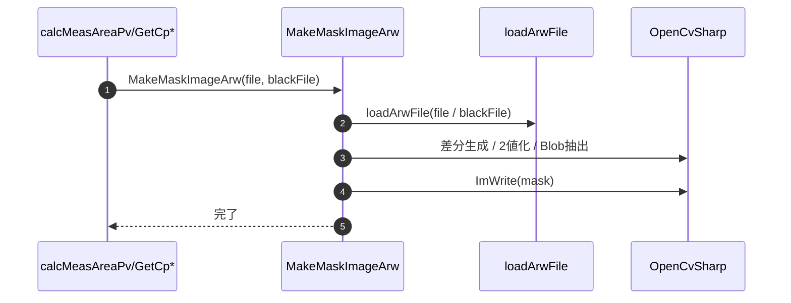
```mermaid
sequenceDiagram
    autonumber
    participant CALLER as calcMeasAreaPv/GetCp*
    participant M as MakeMaskImageArw
    participant RAW as loadArwFile
    participant CV as OpenCvSharp

    CALLER->>M: MakeMaskImageArw(file, blackFile)
    M->>RAW: loadArwFile(file / blackFile)
    M->>CV: 差分生成 / 2値化 / Blob抽出
    M->>CV: ImWrite(mask)
    M-->>CALLER: 完了
```

#### 8-5-3-20. storeUfMeasArea

| 項目 | 内容 |
|------|------|
| シグネチャ | `private void storeUfMeasArea(List<UnitInfo> lstTgtCabi, string path, ViewPoint vp)` |
| 概要 | Module画像から各Cabinet・各測定点の座標と校正テーブル値を `ufCamMeasLog` へ格納する。 |

引数

| No. | 引数名 | 型 | 必須 | 説明 |
|-----|--------|----|------|------|
| 1 | lstTgtCabi | List<UnitInfo> | Y | 測定対象Cabinet一覧 |
| 2 | path | string | Y | 計測ログ保存フォルダ |
| 3 | vp | ViewPoint | Y | 視聴点補正条件 |

返り値: なし（void）

処理概要（詳細）

| 手順No. | 処理内容 | 詳細 |
|---------|----------|------|
| 1 | Module領域抽出 | 各Module画像から TrimmingArea を抽出する。 |
| 2 | 対象範囲確定 | 対象Cabinetの矩形範囲と中心Tilt角を算出する。 |
| 3 | 領域整列 | TrimmingArea を Cabinet 順へ並べ替える。 |
| 4 | 測定点生成 | 各Cabinet・各Module を3x3分割し `UfCamMp` を作成する。 |
| 5 | 校正値付与 | 各測定点に Camera/Led 補正値を付与してログへ登録する。 |

入力条件・前提条件

| 区分 | 条件 | NG時挙動 |
|------|------|----------|
| 対象範囲 | `lstTgtCabi` が矩形成立していること | 例外送出 |
| Module画像 | 全Module画像が保存済みであること | 下位例外を上位へ伝播 |

条件分岐仕様

| 条件 | 挙動 |
|------|------|
| 視聴点縦補正あり | 中心Cabinetの Tilt を算出して利用する。 |
| 検出Module数不一致 | 例外を送出して処理を中断する。 |
| 分割領域幅/高さ不正 | 例外を送出して処理を中断する。 |

主要呼出し先

| 呼出し先 | 役割 | 同期/非同期 |
|----------|------|--------------|
| Module領域抽出処理 | Module画像から TrimmingArea を抽出する | 同期 |
| `searchUnit` | Cabinet座標から対象Unitを解決する | 同期 |
| 交点算出処理 | 3x3分割用の交点を算出する | 同期 |
| 校正値検索処理 | 各測定点の Camera/Led 補正値を取得する | 同期 |

例外時仕様

| ケース | 捕捉方法 | 通知/伝播 | 後処理 |
|--------|----------|-----------|--------|
| Module検出数不一致 | 件数判定 | 呼出元へ送出 | 解析中断 |
| 測定領域不正 | 幅/高さ判定 | 呼出元へ送出 | 解析中断 |

シーケンス図

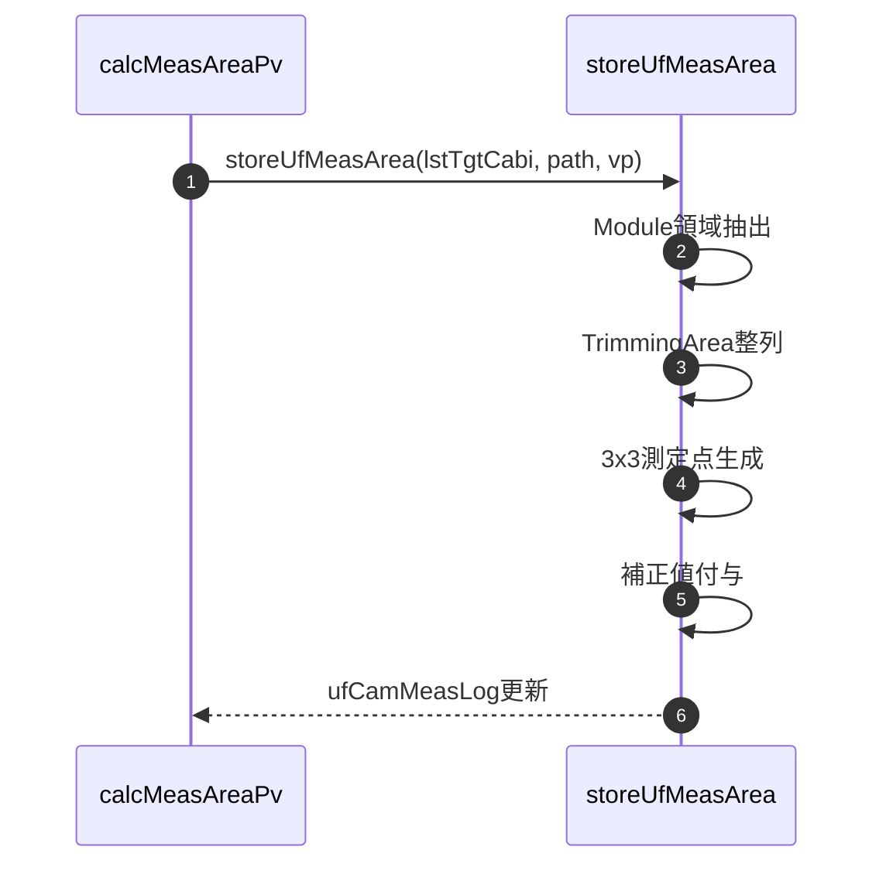
```mermaid
sequenceDiagram
    autonumber
    participant CALLER as calcMeasAreaPv
    participant M as storeUfMeasArea

    CALLER->>M: storeUfMeasArea(lstTgtCabi, path, vp)
    M->>M: Module領域抽出
    M->>M: TrimmingArea整列
    M->>M: 3x3測定点生成
    M->>M: 補正値付与
    M-->>CALLER: ufCamMeasLog更新
```

#### 8-5-3-21. storeUfCamPv

| 項目 | 内容 |
|------|------|
| シグネチャ | `private void storeUfCamPv(string path)` |
| 概要 | R/G/B/Black RAW画像から各測定点の補正済み画素値と色度バランスを算出する。 |

引数

| No. | 引数名 | 型 | 必須 | 説明 |
|-----|--------|----|------|------|
| 1 | path | string | Y | 計測ログ保存フォルダ |

返り値: なし（void）

処理概要（詳細）

| 手順No. | 処理内容 | 詳細 |
|---------|----------|------|
| 1 | RAW読込 | Red/Green/Blue/Black の ARW を順に読込む。 |
| 2 | 平均値算出 | 各測定点領域で RGB と White の平均画素値を算出する。 |
| 3 | 補正値反映 | Camera/Led 補正ゲインで正規化した画素値を格納する。 |
| 4 | バランス算出 | White に対する RGB 比で色度バランスを算出する。 |

入力条件・前提条件

| 区分 | 条件 | NG時挙動 |
|------|------|----------|
| RAW画像 | `Red/Green/Blue/Black.arw` が存在すること | 下位例外を上位へ伝播 |
| 測定点 | `ufCamMeasLog.lstUfCamMeas` が事前に格納済みであること | 値格納不可 |

条件分岐仕様

| 条件 | 挙動 |
|------|------|
| 正常系 | 全測定点へ補正済み RGBW 値を格納する。 |
| 異常系 | RAW読込失敗時は例外で中断する。 |

主要呼出し先

| 呼出し先 | 役割 | 同期/非同期 |
|----------|------|--------------|
| `loadArwFile` | 各色の RAW画像を読み込む | 同期 |
| 平均値算出処理 | 各測定点領域の RGBW 平均値を算出する | 同期 |
| White合成処理 | RGB から White 値を算出する | 同期 |

例外時仕様

| ケース | 捕捉方法 | 通知/伝播 | 後処理 |
|--------|----------|-----------|--------|
| RAW読込失敗 | 下位例外 | 呼出元へ送出 | 画素値格納中断 |
| 補正値不整合 | 下位演算 | 呼出元で異常扱い | 当該計測中断 |

シーケンス図

```mermaid
sequenceDiagram
    autonumber
    participant CALLER as calcMeasAreaPv
    participant M as storeUfCamPv
    participant RAW as loadArwFile

    CALLER->>M: storeUfCamPv(path)
    M->>RAW: RGB/Black ARW読込
    M->>M: 測定点平均値算出
    M->>M: 補正値・色度バランス格納
    M-->>CALLER: 完了
```
