#### 8-5-4-1. GetCpCabinet

| 項目 | 内容 |
|------|------|
| シグネチャ | `private void GetCpCabinet(List<UnitInfo> lstTgtCabi, List<UnitInfo> lstObjCabi, ObjectiveLine objEdge, ViewPoint vp, string logDir, out List<UfCamCabinetCpInfo> lstCabiCpInfo, out List<UfCamCorrectionPoint> lstRefPoints)` |
| 概要 | Cabinet方式の補正点と基準点を抽出し、出力リストへ格納する。 |

**引数**

| No. | 引数名 | 型 | 必須 | 説明 |
|-----|--------|----|------|------|
| 1 | lstTgtCabi | List<UnitInfo> | Y | 補正点抽出対象Cabinetリスト |
| 2 | lstObjCabi | List<UnitInfo> | Y | 基準Cabinetリスト |
| 3 | objEdge | ObjectiveLine | Y | Cabinet抽出用エッジ情報 |
| 4 | vp | ViewPoint | Y | 視点情報 |
| 5 | logDir | string | Y | ログ・一時ファイル出力先ディレクトリ |
| 6 | lstCabiCpInfo (out) | List<UfCamCabinetCpInfo> | Y | Cabinet補正点出力リスト |
| 7 | lstRefPoints (out) | List<UfCamCorrectionPoint> | Y | Cabinet基準点出力リスト |

**返り値**: なし（void）

**処理詳細**

| 手順No. | 処理内容 | 詳細 |
|---------|----------|------|
| 1 | 前処理 | 入力引数・内部状態・依存リソース（lstTgtCabi, lstObjCabi, objEdge, vp, logDir）を検証。未初期化・不正時は例外送出。 |
| 2 | 画像取得 | `CaptureImage`でCabinet全体画像を取得。失敗時はエラー通知し中断。 |
| 3 | 対象領域表示 | `OutputTargetArea`/`outputTrimArea`でCabinet領域・トリミング範囲をUI/ログへ出力。 |
| 4 | マスク生成 | `CalcTrimmingAreaMask`/`MakeMaskImageArw`でCabinet領域マスク画像を生成。 |
| 5 | 補正点抽出 | `StoreCp`/`CaptureRefPoint`/`ProcRefPoint`でCabinet補正点・基準点を抽出し、lstCabiCpInfo/lstRefPointsへ格納。 |
| 6 | マスク統合・表示停止 | `MergeTrimMask`でマスク統合、`stopIntSig`で表示停止。 |
| 7 | 結果反映 | 呼出元へ成否を返し、必要な内部状態・出力リストを更新。 |

**入力条件・前提条件**

| 区分 | 条件 | NG時挙動 |
|------|------|----------|
| 実行前提 | 関連モジュール、設定、入出力パスが初期化済みであること | 例外送出または処理中断 |
| 入力値 | 引数値が仕様範囲内であること | 異常通知して処理中断 |

**条件分岐仕様**

| 条件 | 挙動 |
|------|------|
| 画像取得失敗 | エラー通知し処理中断 |
| マスク生成失敗 | エラー通知し処理中断 |
| 補正点抽出失敗 | エラー通知し処理中断 |
| 正常系 | 全工程正常終了時、出力リストを返却 |
| 異常系 | 例外時仕様に従って通知・復帰 |

**主要呼出し先**

| 呼出し先 | 役割 | 同期/非同期 |
|----------|------|--------------|
| `CaptureImage` | Cabinet全体画像を撮影 | 同期 |
| `OutputTargetArea` / `outputTrimArea` | Cabinet領域・トリミング範囲を表示 | 同期 |
| `CalcTrimmingAreaMask` / `MakeMaskImageArw` | Cabinet領域マスク画像を生成 | 同期 |
| `StoreCp` / `CaptureRefPoint` / `ProcRefPoint` | Cabinet補正点・基準点を抽出・整形 | 同期 |
| `MergeTrimMask` / `stopIntSig` | マスク統合・表示停止 | 同期 |

**例外時仕様**

| ケース | 捕捉方法 | 通知/伝播 | 後処理 |
|--------|----------|-----------|--------|
| 入力値不正 | 引数検証で検出 | 呼出元へ通知 | 異常終了 |
| 画像取得失敗 | 戻り値・例外 | 呼出元へ通知 | 異常終了 |
| マスク生成失敗 | 戻り値・例外 | 呼出元へ通知 | 異常終了 |
| 補正点抽出失敗 | 戻り値・例外 | 呼出元へ通知 | 異常終了 |
| 下位処理失敗 | 下位例外または戻り値異常 | 呼出元へ通知 | 安全停止または設定復帰 |

**シーケンス図**

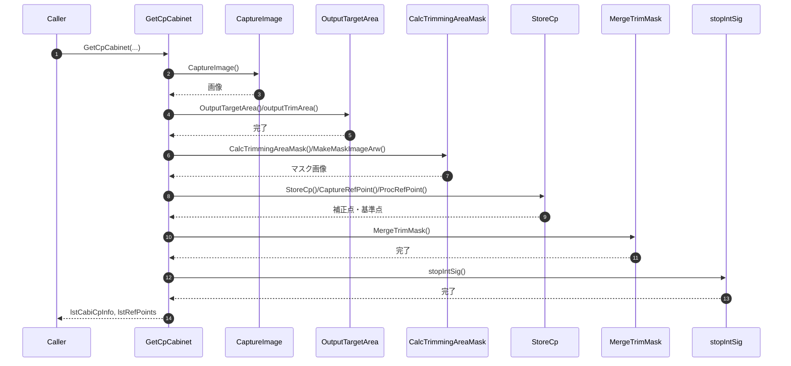

#### 8-5-4-2. GetCp9pt

| 項目 | 内容 |
|------|------|
| シグネチャ | `private void GetCp9pt(List<UnitInfo> lstTgtCabi, List<UnitInfo> lstObjCabi, ObjectiveLine objEdge, ViewPoint vp, string logDir, out List<UfCamCabinetCpInfo> lstUnitCpInfo, out List<UfCamCorrectionPoint> lstRefPoints)` |
| 概要 | 9点方式の補正点と基準点を抽出し、出力リストへ格納する。 |

**引数**

| No. | 引数名 | 型 | 必須 | 説明 |
|-----|--------|----|------|------|
| 1 | lstTgtCabi | List<UnitInfo> | Y | 補正点抽出対象Cabinetリスト |
| 2 | lstObjCabi | List<UnitInfo> | Y | 基準Cabinetリスト |
| 3 | objEdge | ObjectiveLine | Y | Cabinet抽出用エッジ情報 |
| 4 | vp | ViewPoint | Y | 視点情報 |
| 5 | logDir | string | Y | ログ・一時ファイル出力先ディレクトリ |
| 6 | lstUnitCpInfo (out) | List<UfCamCabinetCpInfo> | Y | Cabinet補正点出力リスト |
| 7 | lstRefPoints (out) | List<UfCamCorrectionPoint> | Y | Cabinet基準点出力リスト |

**返り値**: なし（void）

**処理詳細**

| 手順No. | 処理内容 | 詳細 |
|---------|----------|------|
| 1 | 前処理 | 入力引数・内部状態・依存リソース（lstTgtCabi, lstObjCabi, objEdge, vp, logDir）を検証。未初期化・不正時は例外送出。 |
| 2 | 画像取得 | `CaptureImage`でCabinet全体画像を取得。失敗時はエラー通知し中断。 |
| 3 | 対象領域表示 | `OutputTargetArea`/`outputTrimArea`でCabinet領域・トリミング範囲をUI/ログへ出力。 |
| 4 | マスク生成 | `CalcTrimmingAreaMask`/`MakeMaskImageArw`でCabinet領域マスク画像を生成。 |
| 5 | 補正点抽出 | `StoreCp`/`CaptureRefPoint`/`ProcRefPoint`でCabinet補正点・基準点を抽出し、lstCabiCpInfo/lstRefPointsへ格納。 |
| 6 | マスク統合・表示停止 | `MergeTrimMask`でマスク統合、`stopIntSig`で表示停止。 |
| 7 | 結果反映 | 呼出元へ成否を返し、必要な内部状態・出力リストを更新。 |

**入力条件・前提条件**

| 区分 | 条件 | NG時挙動 |
|------|------|----------|
| 実行前提 | 関連モジュール、設定、入出力パスが初期化済みであること | 例外送出または処理中断 |
| 入力値 | 引数値が仕様範囲内であること | 異常通知して処理中断 |

**条件分岐仕様**

| 条件 | 挙動 |
|------|------|
| 画像取得失敗 | エラー通知し処理中断 |
| マスク生成失敗 | エラー通知し処理中断 |
| 補正点抽出失敗 | エラー通知し処理中断 |
| 正常系 | 全工程正常終了時、出力リストを返却 |
| 異常系 | 例外時仕様に従って通知・復帰 |

**主要呼出し先**

| 呼出し先 | 役割 | 同期/非同期 |
|----------|------|--------------|
| `CaptureImage` | 9点補正用画像を順次撮影する | 同期 |
| `OutputTargetArea` / `outputTrimArea` | 9位置の対象領域を表示する | 同期 |
| `CalcTrimmingAreaMask` / `MakeMaskImageArw` | 各位置のマスク画像を生成する | 同期 |
| `StoreCp` / `CaptureRefPoint` / `ProcRefPoint` | 補正点と基準点を抽出・整形する | 同期 |
| `MergeTrimMask` / `stopIntSig` | マスク統合と表示停止を行う | 同期 |

**例外時仕様**

| ケース | 捕捉方法 | 通知/伝播 | 後処理 |
|--------|----------|-----------|--------|
| 入力値不正 | 引数検証で検出 | 呼出元へ通知 | 異常終了 |
| 画像取得失敗 | 戻り値・例外 | 呼出元へ通知 | 異常終了 |
| マスク生成失敗 | 戻り値・例外 | 呼出元へ通知 | 異常終了 |
| 補正点抽出失敗 | 戻り値・例外 | 呼出元へ通知 | 異常終了 |
| 下位処理失敗 | 下位例外または戻り値異常 | 呼出元へ通知 | 安全停止または設定復帰 |

**シーケンス図**

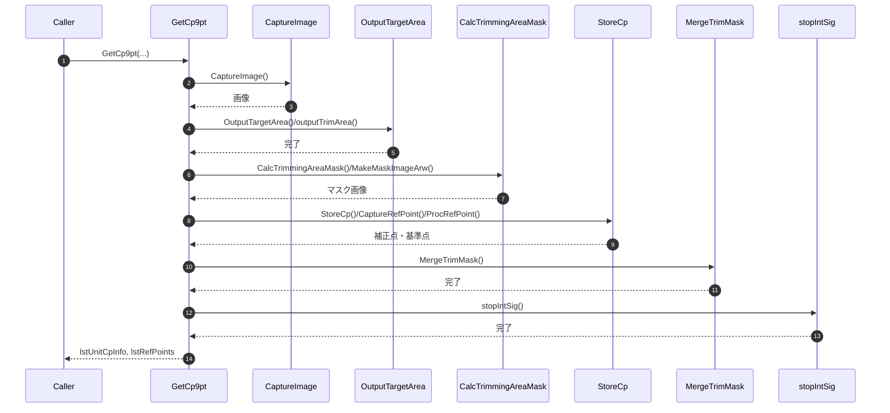

#### 8-5-4-4. GetCpEachModule

| 項目 | 内容 |
|------|------|
| シグネチャ | `private void GetCpEachModule(List<UnitInfo> lstTgtCabi, List<UnitInfo> lstObjCabi, ObjectiveLine objEdge, ViewPoint vp, string logDir, out List<UfCamCabinetCpInfo> lstUnitCpInfo, out List<UfCamCorrectionPoint> lstRefPoints)` |
| 概要 | EachModule方式の補正点と基準点を抽出し、出力リストへ格納する。 |

**引数**

| No. | 引数名 | 型 | 必須 | 説明 |
|-----|--------|----|------|------|
| 1 | lstTgtCabi | List<UnitInfo> | Y | 補正点抽出対象Cabinetリスト |
| 2 | lstObjCabi | List<UnitInfo> | Y | 基準Cabinetリスト |
| 3 | objEdge | ObjectiveLine | Y | Cabinet抽出用エッジ情報 |
| 4 | vp | ViewPoint | Y | 視点情報 |
| 5 | logDir | string | Y | ログ・一時ファイル出力先ディレクトリ |
| 6 | lstUnitCpInfo (out) | List<UfCamCabinetCpInfo> | Y | Cabinet補正点出力リスト |
| 7 | lstRefPoints (out) | List<UfCamCorrectionPoint> | Y | Cabinet基準点出力リスト |

**返り値**: なし（void）

**処理詳細**

| 手順No. | 処理内容 | 詳細 |
|---------|----------|------|
| 1 | 前処理 | 入力引数・内部状態・依存リソース（lstTgtCabi, lstObjCabi, objEdge, vp, logDir）を検証。未初期化・不正時は例外送出。 |
| 2 | 画像取得 | `CaptureImage`でCabinet全体画像を取得。失敗時はエラー通知し中断。 |
| 3 | 対象領域表示 | `OutputTargetArea`/`outputTrimArea`でCabinet領域・トリミング範囲をUI/ログへ出力。 |
| 4 | マスク生成 | `CalcTrimmingAreaMask`/`MakeMaskImageArw`でCabinet領域マスク画像を生成。 |
| 5 | 補正点抽出 | `StoreCp`/`CaptureRefPoint`/`ProcRefPoint`でCabinet補正点・基準点を抽出し、lstCabiCpInfo/lstRefPointsへ格納。 |
| 6 | マスク統合・表示停止 | `MergeTrimMask`でマスク統合、`stopIntSig`で表示停止。 |
| 7 | 結果反映 | 呼出元へ成否を返し、必要な内部状態・出力リストを更新。 |

**入力条件・前提条件**

| 区分 | 条件 | NG時挙動 |
|------|------|----------|
| 実行前提 | 関連モジュール、設定、入出力パスが初期化済みであること | 例外送出または処理中断 |
| 入力値 | 引数値が仕様範囲内であること | 異常通知して処理中断 |

**条件分岐仕様**

| 条件 | 挙動 |
|------|------|
| 画像取得失敗 | エラー通知し処理中断 |
| マスク生成失敗 | エラー通知し処理中断 |
| 補正点抽出失敗 | エラー通知し処理中断 |
| 正常系 | 全工程正常終了時、出力リストを返却 |
| 異常系 | 例外時仕様に従って通知・復帰 |

**主要呼出し先**

| 呼出し先 | 役割 | 同期/非同期 |
|----------|------|--------------|
| `CaptureImage` | Module 単位補正用画像を順次撮影する | 同期 |
| `OutputTargetArea` / `outputTrimArea` | 各 Module の対象領域を表示する | 同期 |
| `CalcTrimmingAreaMask` / `MakeMaskImageArw` | 各 Module のマスク画像を生成する | 同期 |
| `StoreCp` / `CaptureRefPoint` / `ProcRefPoint` | 補正点と基準点を抽出・整形する | 同期 |
| `MergeTrimMask` / `stopIntSig` | マスク統合と表示停止を行う | 同期 |

**例外時仕様**

| ケース | 捕捉方法 | 通知/伝播 | 後処理 |
|--------|----------|-----------|--------|
| 入力値不正 | 引数検証で検出 | 呼出元へ通知 | 異常終了 |
| 画像取得失敗 | 戻り値・例外 | 呼出元へ通知 | 異常終了 |
| マスク生成失敗 | 戻り値・例外 | 呼出元へ通知 | 異常終了 |
| 補正点抽出失敗 | 戻り値・例外 | 呼出元へ通知 | 異常終了 |
| 下位処理失敗 | 下位例外または戻り値異常 | 呼出元へ通知 | 安全停止または設定復帰 |

**シーケンス図**

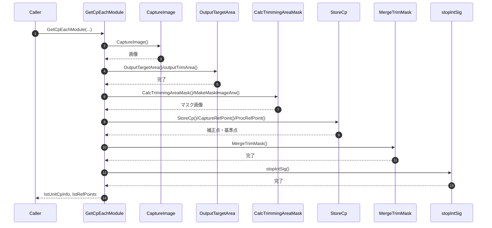

#### 8-5-4-5. GetFlatImages

| 項目 | 内容 |
|------|------|
| シグネチャ | `private void GetFlatImages(ref List<UfCamCorrectionPoint> lstRefPoints, ref List<UfCamCabinetCpInfo> lstUnitCpInfo, string logDir)` |
| 概要 | 調整用Flat画像を取得して補正点へ測定値を付与する。 |

**引数**

| No. | 引数名 | 型 | 必須 | 説明 |
|-----|--------|----|------|------|
| 1 | lstRefPoints(ref) | List<UfCamCorrectionPoint> | Y | 基準点群 |
| 2 | lstUnitCpInfo(ref) | List<UfCamCabinetCpInfo> | Y | 補正点群 |
| 3 | logDir | string | Y | ログディレクトリ |

**返り値**: なし（void）

**処理詳細**

| 手順No. | 処理内容 | 詳細 |
|---------|----------|------|
| 1 | 前処理 | 入力引数・内部状態・依存リソース（lstRefPoints, lstUnitCpInfo, logDir）を検証。未初期化・不正時は例外送出。 |
| 2 | 画像取得 | `outputFlatPattern`でR/G/B/BlackのFlatパターンを順次出力。失敗時はエラー通知し中断。 |
| 3 | 補正点へ測定値付与 | `CaptureImage`で各Flat画像を撮影し、補正点へ測定値を付与。 |
| 4 | 結果反映 | 呼出元へ成否を返し、必要な内部状態・出力リストを更新。 |

**入力条件・前提条件**

| 区分 | 条件 | NG時挙動 |
|------|------|----------|
| 実行前提 | 関連モジュール、設定、入出力パスが初期化済みであること | 例外送出または処理中断 |
| 入力値 | 引数値が仕様範囲内であること | 異常通知して処理中断 |

**条件分岐仕様**

| 条件 | 挙動 |
|------|------|
| 画像取得失敗 | エラー通知し処理中断 |
| 補正点へ測定値付与失敗 | エラー通知し処理中断 |
| 正常系 | 全工程正常終了時、出力リストを返却 |
| 異常系 | 例外時仕様に従って通知・復帰 |

**主要呼出し先**

| 呼出し先 | 役割 | 同期/非同期 |
|----------|------|--------------|
| `outputFlatPattern` | R/G/B/Black の Flat パターンを順次出力する | 同期 |
| `CaptureImage` | 各 Flat 画像を撮影する | 同期 |
| `loadArwFile` | 取得した ARW を読込む | 同期 |
| 画像処理ループ | 補正点へ Flat 測定値を付与する | 同期 |

**例外時仕様**

| ケース | 捕捉方法 | 通知/伝播 | 後処理 |
|--------|----------|-----------|--------|
| 入力値不正 | 引数検証で検出 | 呼出元へ通知 | 異常終了 |
| 画像取得失敗 | 戻り値・例外 | 呼出元へ通知 | 異常終了 |
| 補正点へ測定値付与失敗 | 戻り値・例外 | 呼出元へ通知 | 異常終了 |
| 下位処理失敗 | 下位例外または戻り値異常 | 呼出元へ通知 | 安全停止または設定復帰 |

**シーケンス図**

#### 8-5-4-6. writeAdjustedData

| 項目 | 内容 |
|------|------|
| シグネチャ | `private bool writeAdjustedData(List<MoveFile> lstMoveFiles)` |
| 概要 | 生成済み調整データをControllerへ転送する。 |

**引数**

| No. | 引数名 | 型 | 必須 | 説明 |
|-----|--------|----|------|------|
| 1 | lstMoveFiles | List<MoveFile> | Y | 転送対象ファイル一覧 |

**返り値**: bool

**処理詳細**

| 手順No. | 処理内容 | 詳細 |
|---------|----------|------|
| 1 | 前処理 | 入力引数・内部状態・依存リソース（lstMoveFiles）を検証。未初期化・不正時は例外送出。 |
| 2 | 主処理実行 | 生成済み調整データをControllerへ転送する。 |
| 3 | 結果反映 | 呼出元へ成否を返し、必要な内部状態・出力リストを更新。 |

**入力条件・前提条件**

| 区分 | 条件 | NG時挙動 |
|------|------|----------|
| 実行前提 | 関連モジュール、設定、入出力パスが初期化済みであること | 例外送出または処理中断 |
| 入力値 | 引数値が仕様範囲内であること | 異常通知して処理中断 |

**条件分岐仕様**

| 条件 | 挙動 |
|------|------|
| 正常系 | 主処理を完了し結果を返却 |
| 異常系 | 例外時仕様に従って通知・復帰 |

**主要呼出し先**

| 呼出し先 | 役割 | 同期/非同期 |
|----------|------|--------------|
| `sendSdcpCommand` | 転送前後の Controller 制御コマンドを送信する | 同期 |
| `getModelName` / `getSerialNo` | 転送先 Controller 情報を取得する | 同期 |
| `deleteFtpFile` / `putFileFtpRetry` | FTP 経由で調整データを転送する | 同期 |
| `System.IO.File.Copy` | NFS 経由で調整データを配置する | 同期 |

**例外時仕様**

| ケース | 捕捉方法 | 通知/伝播 | 後処理 |
|--------|----------|-----------|--------|
| 下位処理失敗 | 下位例外または戻り値異常 | 呼出元へ通知 | 安全停止または設定復帰 |

**シーケンス図**

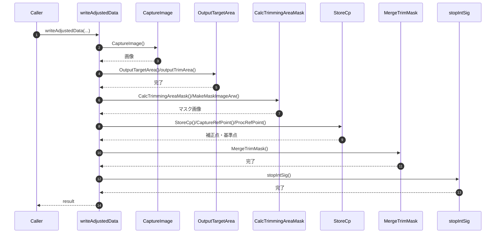

#### 8-5-4-7. DeleteUnwantedImagesAdj

| 項目 | 内容 |
|------|------|
| シグネチャ | `private void DeleteUnwantedImagesAdj(string path)` |
| 概要 | 調整中間画像を削除して後片付けする。 |

**引数**

| No. | 引数名 | 型 | 必須 | 説明 |
|-----|--------|----|------|------|
| 1 | path | string | Y | 削除対象ディレクトリ |

**返り値**: なし（void）

**処理詳細**

| 手順No. | 処理内容 | 詳細 |
|---------|----------|------|
| 1 | 前処理 | 入力引数・内部状態・依存リソース（path）を検証。未初期化・不正時は例外送出。 |
| 2 | 主処理実行 | 調整中間画像を削除して後片付けする。 |
| 3 | 結果反映 | 呼出元へ成否を返し、必要な内部状態・出力リストを更新。 |

**入力条件・前提条件**

| 区分 | 条件 | NG時挙動 |
|------|------|----------|
| 実行前提 | 関連モジュール、設定、入出力パスが初期化済みであること | 例外送出または処理中断 |
| 入力値 | 引数値が仕様範囲内であること | 異常通知して処理中断 |

**条件分岐仕様**

| 条件 | 挙動 |
|------|------|
| 画像削除失敗 | エラー通知し処理中断 |
| 正常系 | 全工程正常終了時、出力リストを返却 |
| 異常系 | 例外時仕様に従って通知・復帰 |

**主要呼出し先**

| 呼出し先 | 役割 | 同期/非同期 |
|----------|------|--------------|
| `File.Delete` | 調整中間画像と一時画像を削除する | 同期 |

**例外時仕様**

| ケース | 捕捉方法 | 通知/伝播 | 後処理 |
|--------|----------|-----------|--------|
| 入力値不正 | 引数検証で検出 | 呼出元へ通知 | 異常終了 |
| 画像削除失敗 | 戻り値・例外 | 呼出元へ通知 | 異常終了 |
| 下位処理失敗 | 下位例外または戻り値異常 | 呼出元へ通知 | 安全停止または設定復帰 |

**シーケンス図**

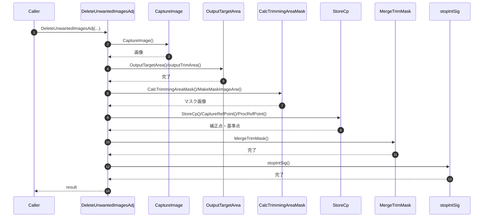

#### 8-5-4-8. outputFlatPattern

| 項目 | 内容 |
|------|------|
| シグネチャ | `private void outputFlatPattern(int r, int g, int b)` |
| 概要 | 調整後の表示復帰としてFlatパターンを出力する。 |

**引数**

| No. | 引数名 | 型 | 必須 | 説明 |
|-----|--------|----|------|------|
| 1 | r | int | Y | 赤レベル |`n| 2 | g | int | Y | 緑レベル |`n| 3 | b | int | Y | 青レベル |

**返り値**: なし（void）

**処理詳細**

| 手順No. | 処理内容 | 詳細 |
|---------|----------|------|
| 1 | 前処理 | 入力引数・内部状態・依存リソース（r, g, b）を検証。未初期化・不正時は例外送出。 |
| 2 | 主処理実行 | 調整後の表示復帰としてFlatパターンを出力する。 |
| 3 | 結果反映 | 呼出元へ成否を返し、必要な内部状態・出力リストを更新。 |

**入力条件・前提条件**

| 区分 | 条件 | NG時挙動 |
|------|------|----------|
| 実行前提 | 関連モジュール、設定、入出力パスが初期化済みであること | 例外送出または処理中断 |
| 入力値 | 引数値が仕様範囲内であること | 異常通知して処理中断 |

**条件分岐仕様**

| 条件 | 挙動 |
|------|------|
| 正常系 | 全工程正常終了時、出力リストを返却 |
| 異常系 | 例外時仕様に従って通知・復帰 |

**主要呼出し先**

| 呼出し先 | 役割 | 同期/非同期 |
|----------|------|--------------|
| `sendSdcpCommand` | Flat パターン表示コマンドを送信する | 同期 |
| `setFlatCommand` | Flat パターン用電文を組み立てる | 同期 |

**例外時仕様**

| ケース | 捕捉方法 | 通知/伝播 | 後処理 |
|--------|----------|-----------|--------|
| 入力値不正 | 引数検証で検出 | 呼出元へ通知 | 異常終了 |
| 画像取得失敗 | 戻り値・例外 | 呼出元へ通知 | 異常終了 |
| 補正点へ測定値付与失敗 | 戻り値・例外 | 呼出元へ通知 | 異常終了 |
| 下位処理失敗 | 下位例外または戻り値異常 | 呼出元へ通知 | 安全停止または設定復帰 |

**シーケンス図**

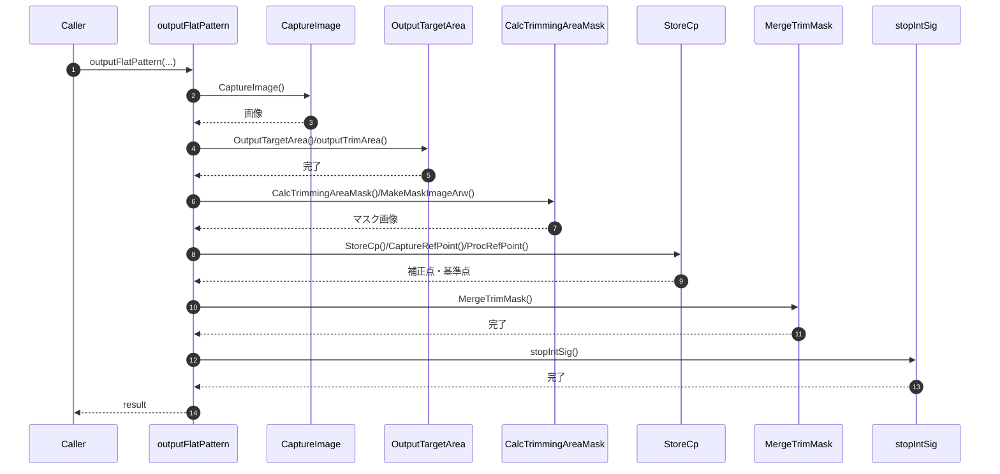

#### 8-5-4-9. outputTrimArea

| 項目 | 内容 |
|------|------|
| シグネチャ | `private void outputTrimArea(UfCamCorrectPos pos)` |
| 概要 | 指定した補正位置に対応するトリミング領域パターンを全Controllerへ出力する。 |

**引数**

| No. | 引数名 | 型 | 必須 | 説明 |
|-----|--------|----|------|------|
| 1 | pos | UfCamCorrectPos | Y | 表示する補正位置 |

**返り値**: なし（void）

**処理詳細**

| 手順No. | 処理内容 | 詳細 |
|---------|----------|------|
| 1 | コマンド初期化 | SDCP の内部信号ONコマンドを複製する。 |
| 2 | 領域設定 | `pos` に応じた開始座標、サイズ、ピッチを設定する。 |
| 3 | 一括送信 | 全Controllerへ送信し、表示反映待ちを入れる。 |

**入力条件・前提条件**

| 区分 | 条件 | NG時挙動 |
|------|------|----------|
| 補正位置 | `pos` が有効な `UfCamCorrectPos` であること | 不正表示または下位例外 |
| Controller通信 | `dicController` が初期化済みであること | 送信失敗 |

**条件分岐仕様**

| 条件 | 挙動 |
|------|------|
| 正常系 | 指定位置のトリミングパターンを表示する。 |
| 異常系 | コマンド生成/送信失敗時は上位へ伝播する。 |

**主要呼出し先**

| 呼出し先 | 役割 | 同期/非同期 |
|----------|------|--------------|
| トリミングコマンド生成処理 | 補正位置に対応する電文を組み立てる | 同期 |
| `sendSdcpCommand` | 全Controllerへ内部信号コマンドを送信する | 同期 |
| `Thread.Sleep` | パターン表示反映待ちを行う | 同期 |

**例外時仕様**

| ケース | 捕捉方法 | 通知/伝播 | 後処理 |
|--------|----------|-----------|--------|
| コマンド送信失敗 | 下位例外 | 呼出元へ送出 | 当該表示中断 |

**シーケンス図**

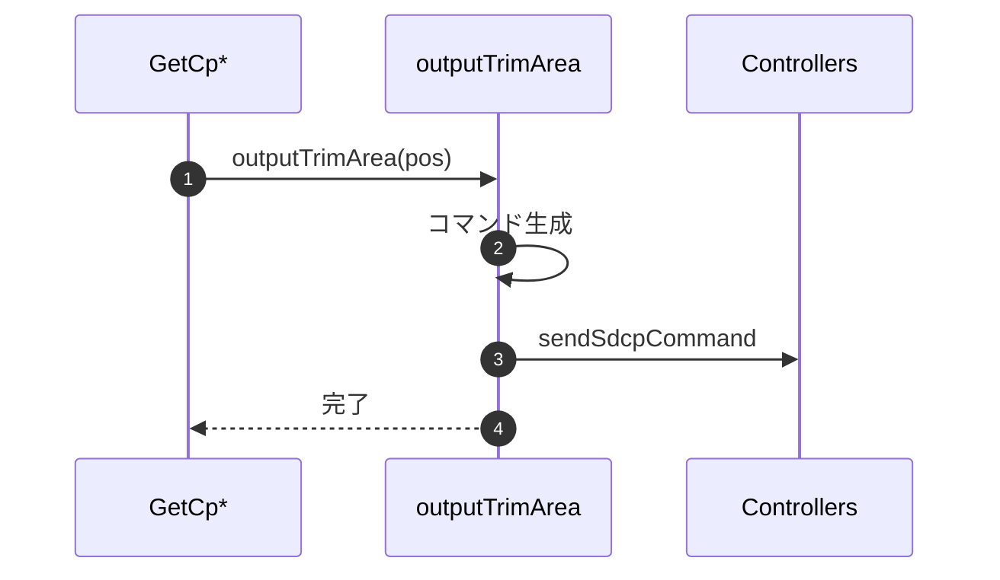

#### 8-5-4-10. CalcTrimmingAreaMask

| 項目 | 内容 |
|------|------|
| シグネチャ | `unsafe private void CalcTrimmingAreaMask(string file, string blackFile, string trimMaskedFile, out List<Area> lstArea, out CvBlobs trimBlobs, string trimMaskFile = "")` |
| 概要 | Black減算とマスク適用後の画像から TrimmingArea を抽出する。 |

**引数**

| No. | 引数名 | 型 | 必須 | 説明 |
|-----|--------|----|------|------|
| 1 | file | string | Y | 対象ARW画像 |
| 2 | blackFile | string | Y | Black画像 |
| 3 | trimMaskedFile | string | Y | 中間マスク画像出力先 |
| 4 | lstArea(out) | List<Area> | Y | 抽出領域一覧 |
| 5 | trimBlobs(out) | CvBlobs | Y | 抽出Blob群 |
| 6 | trimMaskFile | string | N | 使用するマスクJPEG |

**返り値**: なし（void）

**処理詳細**

| 手順No. | 処理内容 | 詳細 |
|---------|----------|------|
| 1 | RAW読込 | 対象画像とBlack画像を読込む。 |
| 2 | マスク適用 | 差分画像へマスクJPEGを適用して2値化する。 |
| 3 | Blob抽出 | Morphology Close 後の Blob を抽出し面積で絞り込む。 |
| 4 | 領域化 | 各Blobを `Area` へ変換し `lstArea` と `trimBlobs` へ返す。 |

**入力条件・前提条件**

| 区分 | 条件 | NG時挙動 |
|------|------|----------|
| 入力画像 | `file` / `blackFile` / `trimMaskFile` が読込可能であること | 下位例外を上位へ伝播 |
| 出力先 | `trimMaskedFile` へ書込み可能であること | 例外送出 |

**条件分岐仕様**

| 条件 | 挙動 |
|------|------|
| `trimMaskFile` 未指定 | 既定の `Mask.jpg` を使用する。 |
| `SaveIntImage=true` | 中間画像を Temp へ保存する。 |

**主要呼出し先**

| 呼出し先 | 役割 | 同期/非同期 |
|----------|------|--------------|
| `loadArwFile` | 対象画像とBlack画像を読み込む | 同期 |
| `Cv2.MorphologyEx` / `CvBlobs.FilterByArea` | TrimmingArea 候補を抽出する | 同期 |
| `Cv2.ImWrite` | 中間画像を書き出す | 同期 |

**例外時仕様**

| ケース | 捕捉方法 | 通知/伝播 | 後処理 |
|--------|----------|-----------|--------|
| 画像読込失敗 | 下位例外 | 呼出元へ送出 | 抽出処理中断 |
| マスク適用失敗 | 下位例外 | 呼出元へ送出 | 抽出処理中断 |

**シーケンス図**

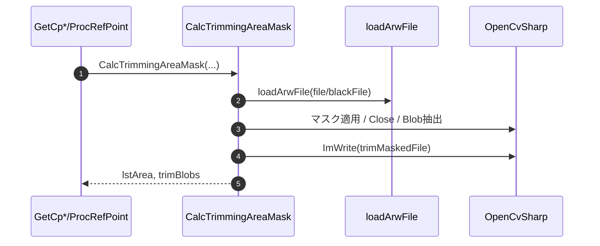

#### 8-5-4-11. CaptureRefPoint

| 項目 | 内容 |
|------|------|
| シグネチャ | `private void CaptureRefPoint(List<UnitInfo> lstTgtCabi, List<UnitInfo> lstObjCabi, ObjectiveLine objEdge, string logDir, out List<UnitInfo> lstAdjCabi, out UfCamCorrectionPoint refPoint)` |
| 概要 | 基準Cabinetまたは基準Lineに応じた参照画像と参照マスク画像を撮影する。 |

**引数**

| No. | 引数名 | 型 | 必須 | 説明 |
|-----|--------|----|------|------|
| 1 | lstTgtCabi | List<UnitInfo> | Y | 調整対象Cabinet |
| 2 | lstObjCabi | List<UnitInfo> | Y | 基準Cabinet |
| 3 | objEdge | ObjectiveLine | N | 基準Line指定 |
| 4 | logDir | string | Y | 画像保存先 |
| 5 | lstAdjCabi(out) | List<UnitInfo> | Y | 実調整対象 |
| 6 | refPoint(out) | UfCamCorrectionPoint | Y | 基準点 |

**返り値**: なし（void）

**処理詳細**

| 手順No. | 処理内容 | 詳細 |
|---------|----------|------|
| 1 | 基準点初期化 | 先頭基準Cabinetから `refPoint` を初期化する。 |
| 2 | Default/Cabinet分岐 | 基準Cabinet単体なら参照位置だけを撮影する。 |
| 3 | Line分岐 | 各辺の参照マスク、全体参照画像、全体マスク画像を順次撮影する。 |
| 4 | 調整対象確定 | Line基準時は基準Cabinetを調整対象から除外する。 |

**入力条件・前提条件**

| 区分 | 条件 | NG時挙動 |
|------|------|----------|
| 基準Cabinet | `lstObjCabi[0]` が存在すること | 下位例外または不正参照 |
| 保存先 | `logDir` が書込み可能であること | 撮影失敗 |

**条件分岐仕様**

| 条件 | 挙動 |
|------|------|
| `objEdge == null` | 基準Cabinet単体の参照位置を撮影する。 |
| `objEdge != null` | Top/Bottom/Left/Right の選択辺ごとにマスク撮影を行う。 |

**主要呼出し先**

| 呼出し先 | 役割 | 同期/非同期 |
|----------|------|--------------|
| 参照パターン表示補助 | 基準点/基準Line の表示を切り替える | 同期 |
| `CaptureImage` | 参照画像と参照マスク画像を撮影する | 同期 |
| `OutputTargetArea` | 全体マスク画像用の対象領域を表示する | 同期 |
| 調整対象除外処理 | Line基準時の実調整対象を確定する | 同期 |

**例外時仕様**

| ケース | 捕捉方法 | 通知/伝播 | 後処理 |
|--------|----------|-----------|--------|
| 撮影失敗 | 下位例外 | 呼出元へ送出 | 基準点抽出中断 |
| 基準指定不正 | 引数不整合 | 呼出元へ送出 | 調整開始中断 |

**シーケンス図**

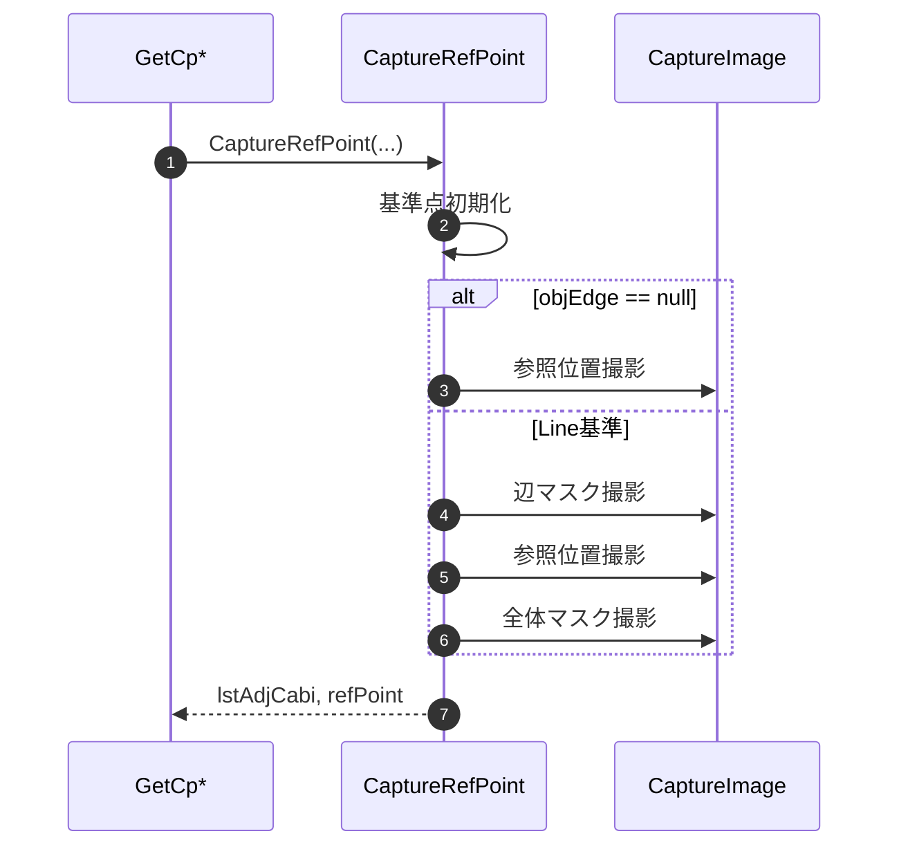

#### 8-5-4-12. ProcRefPoint

| 項目 | 内容 |
|------|------|
| シグネチャ | `private void ProcRefPoint(List<UnitInfo> lstTgtCabi, List<UnitInfo> lstAdjCabi, UfCamCorrectionPoint refPoint, out List<UfCamCorrectionPoint> lstRefPoints, ObjectiveLine objEdge, string logDir,string blackFile, ref ViewPoint vp)` |
| 概要 | 参照画像から基準点群を抽出し、視聴点補正用の基準 Pan/Tilt も更新する。 |

**引数**

| No. | 引数名 | 型 | 必須 | 説明 |
|-----|--------|----|------|------|
| 1 | lstTgtCabi | List<UnitInfo> | Y | 調整対象Cabinet |
| 2 | lstAdjCabi | List<UnitInfo> | Y | 実調整対象 |
| 3 | refPoint | UfCamCorrectionPoint | Y | 基準点 |
| 4 | lstRefPoints(out) | List<UfCamCorrectionPoint> | Y | 基準点群出力 |
| 5 | objEdge | ObjectiveLine | N | 基準Line指定 |
| 6 | logDir | string | Y | 画像保存先 |
| 7 | blackFile | string | Y | Black画像 |
| 8 | vp(ref) | ViewPoint | Y | 視聴点条件 |

**返り値**: なし（void）

**処理詳細**

| 手順No. | 処理内容 | 詳細 |
|---------|----------|------|
| 1 | 初期化 | `lstRefPoints` を初期化し `vp.RefTilt` を未設定化する。 |
| 2 | Cabinet基準処理 | 参照画像から単一點を抽出し補正値を付与する。 |
| 3 | Line基準処理 | 辺ごとのマスク生成、TrimmingArea抽出、基準点群生成を行う。 |
| 4 | 視聴点更新 | 中心Tilt または基準点の Pan/Tilt を `vp` へ反映する。 |

**入力条件・前提条件**

| 区分 | 条件 | NG時挙動 |
|------|------|----------|
| 参照画像 | `CaptureRefPoint` により必要画像が保存済みであること | 下位例外を上位へ伝播 |
| Black画像 | `blackFile` が読込可能であること | 処理中断 |

**条件分岐仕様**

| 条件 | 挙動 |
|------|------|
| `objEdge == null` | 単一参照点を抽出して `lstRefPoints` へ登録する。 |
| `objEdge != null` | 各選択辺ごとに参照マスク生成と基準点群格納を行う。 |
| `vp.Vertical == true` | 基準Tilt または中心Tilt を再設定する。 |
| `vp.Horizontal == true` | 基準Pan を再設定する。 |

**主要呼出し先**

| 呼出し先 | 役割 | 同期/非同期 |
|----------|------|--------------|
| `MakeMaskImageArw` | 辺ごとの参照マスク画像を生成する | 同期 |
| `CalcTrimmingAreaMask` | 参照点候補領域を抽出する | 同期 |
| 基準点格納処理 | 辺ごとの基準点群を `lstRefPoints` へ追加する | 同期 |

**例外時仕様**

| ケース | 捕捉方法 | 通知/伝播 | 後処理 |
|--------|----------|-----------|--------|
| 参照点未検出 | 件数判定 | 呼出元へ送出 | 調整中断 |
| マスク生成/抽出失敗 | 下位例外 | 呼出元へ送出 | 調整中断 |

**シーケンス図**

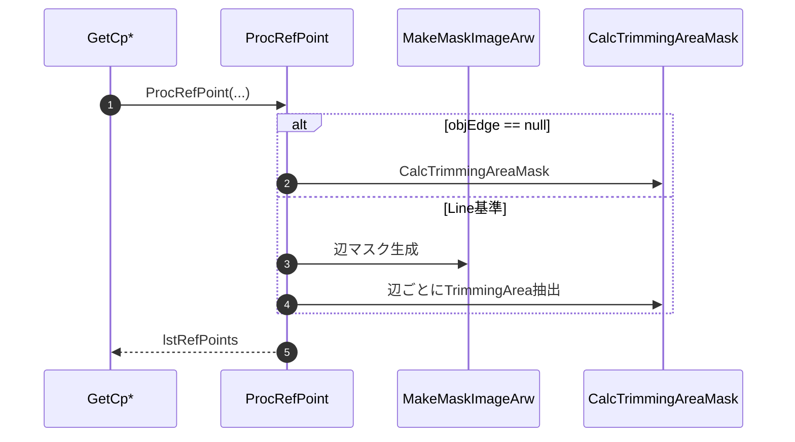

#### 8-5-4-13. MergeTrimMask

| 項目 | 内容 |
|------|------|
| シグネチャ | `private void MergeTrimMask(string logDir)` |
| 概要 | 複数のトリミングマスク画像を加算合成して統合マスクを生成する。 |

**引数**

| No. | 引数名 | 型 | 必須 | 説明 |
|-----|--------|----|------|------|
| 1 | logDir | string | Y | マスク画像格納ディレクトリ |

**返り値**: なし（void）

**処理詳細**

| 手順No. | 処理内容 | 詳細 |
|---------|----------|------|
| 1 | 入力列挙 | `MaskTrim_*.jpg` を列挙する。 |
| 2 | 合成元確定 | 先頭画像を統合先の初期画像にする。 |
| 3 | 加算合成 | 残り画像を順に加算して統合する。 |
| 4 | 保存 | `MaskTrim.jpg` として保存する。 |

**入力条件・前提条件**

| 区分 | 条件 | NG時挙動 |
|------|------|----------|
| 入力画像 | `MaskTrim_*.jpg` が1件以上存在すること | 例外送出 |

**条件分岐仕様**

| 条件 | 挙動 |
|------|------|
| 入力画像なし | 例外を送出する。 |
| 加算中例外 | 実装どおり catch で吸収し finally で破棄する。 |

**主要呼出し先**

| 呼出し先 | 役割 | 同期/非同期 |
|----------|------|--------------|
| `Directory.GetFiles` | 統合対象マスクを列挙する | 同期 |
| `Cv2.ImWrite` | 統合済みマスクを保存する | 同期 |

**例外時仕様**

| ケース | 捕捉方法 | 通知/伝播 | 後処理 |
|--------|----------|-----------|--------|
| マスク画像未出力 | 件数判定 | 呼出元へ送出 | 補正点抽出中断 |

**シーケンス図**

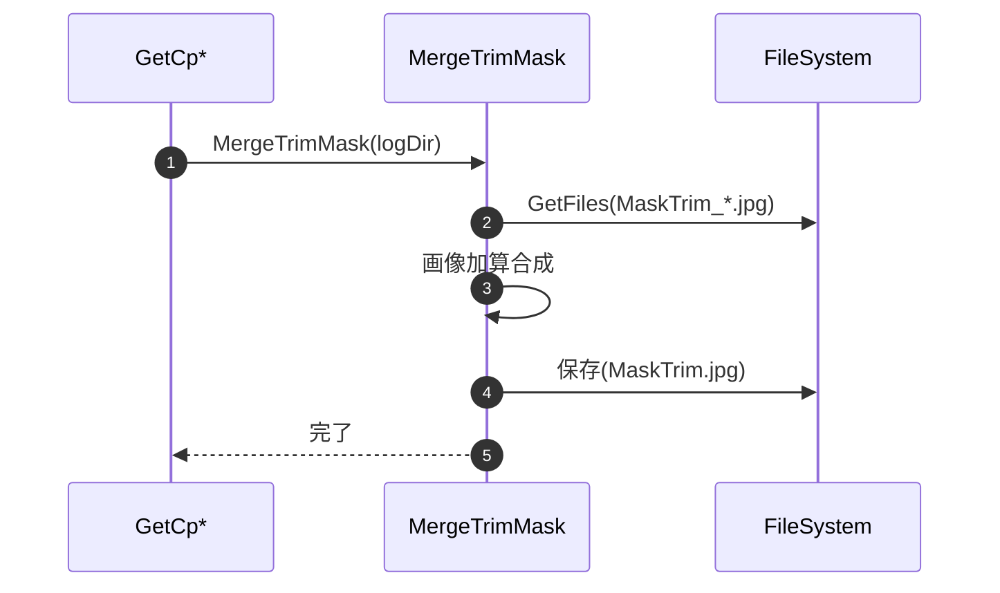

#### 8-5-4-14. StoreCp

| 項目 | 内容 |
|------|------|
| シグネチャ | `private void StoreCp(ref List<UfCamCabinetCpInfo> lstUnitCpInfo, UfCamCorrectPos pos, CvBlobs trimBlobs, ViewPoint vp)` |
| 概要 | Cabinet/9pt/EachModule 系の補正点候補 Blob を Cabinet ごとの補正点へ変換して格納する。 |

**引数**

| No. | 引数名 | 型 | 必須 | 説明 |
|-----|--------|----|------|------|
| 1 | lstUnitCpInfo(ref) | List<UfCamCabinetCpInfo> | Y | 格納先補正点情報 |
| 2 | pos | UfCamCorrectPos | Y | 補正位置 |
| 3 | trimBlobs | CvBlobs | Y | 抽出済みBlob |
| 4 | vp | ViewPoint | Y | 視聴点条件 |

**返り値**: なし（void）

**処理詳細**

| 手順No. | 処理内容 | 詳細 |
|---------|----------|------|
| 1 | 範囲算出 | `lstUnitCpInfo` から対象矩形の最小/最大 X,Y を求める。 |
| 2 | Blob整列 | Blob を Cabinet 配置順へ整列する。 |
| 3 | 補正点生成 | Blob矩形を `UfCamCorrectionPoint` に変換する。 |
| 4 | 補正値付与/格納 | 補正値を付与し一致する Cabinet へ登録する。 |

**入力条件・前提条件**

| 区分 | 条件 | NG時挙動 |
|------|------|----------|
| 補正点情報 | `lstUnitCpInfo` が空でないこと | 不正範囲となる可能性 |
| Blob数 | Cabinet数と整合すること | 下位整列処理で例外 |

**条件分岐仕様**

| 条件 | 挙動 |
|------|------|
| Cabinet一致 | 一致する `UfCamCabinetCpInfo` に補正点を追加する。 |
| 不一致 | 該当 Cabinet が見つからなければ未登録で終了する。 |

**主要呼出し先**

| 呼出し先 | 役割 | 同期/非同期 |
|----------|------|--------------|
| タイル位置整列処理 | Blob を Cabinet 配置順へ並べ替える | 同期 |
| 補正値検索処理 | 各補正点の Camera/Led 補正値を取得する | 同期 |

**例外時仕様**

| ケース | 捕捉方法 | 通知/伝播 | 後処理 |
|--------|----------|-----------|--------|
| Blob整列失敗 | 下位例外 | 呼出元へ送出 | 補正点抽出中断 |

**シーケンス図**

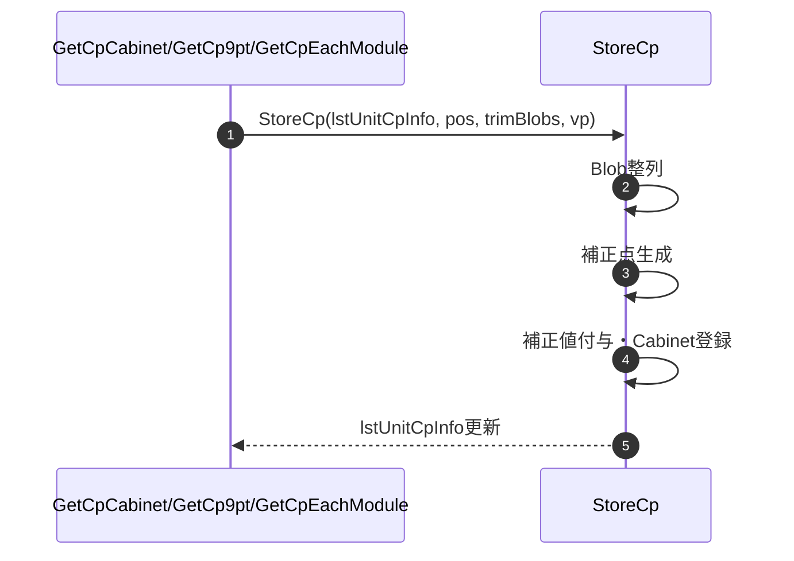

#### 8-5-4-15. storeCpRadiator

| 項目 | 内容 |
|------|------|
| シグネチャ | `private void storeCpRadiator(ref List<UfCamCabinetCpInfo> lstUnitCpInfo, UfCamCorrectPos pos, CvBlobs trimBlobs, ViewPoint vp)` |
| 概要 | Radiator 用に左右2点1組の補正点を生成して Cabinet ごとへ格納する。 |

**引数**

| No. | 引数名 | 型 | 必須 | 説明 |
|-----|--------|----|------|------|
| 1 | lstUnitCpInfo(ref) | List<UfCamCabinetCpInfo> | Y | 格納先補正点情報 |
| 2 | pos | UfCamCorrectPos | Y | 左側基準の Radiator 補正位置 |
| 3 | trimBlobs | CvBlobs | Y | 抽出済みBlob |
| 4 | vp | ViewPoint | Y | 視聴点条件 |

**返り値**: なし（void）

**処理詳細**

| 手順No. | 処理内容 | 詳細 |
|---------|----------|------|
| 1 | 範囲算出 | 対象Cabinet矩形を算出する。 |
| 2 | Blob整列 | Radiator 用に横2倍のBlob配置へ整列する。 |
| 3 | 左右補正点生成 | 各Cabinetにつき Left/Right 2点を生成する。 |
| 4 | 補正値付与/格納 | 補正値を付与して該当 Cabinet へ順に追加する。 |

**入力条件・前提条件**

| 区分 | 条件 | NG時挙動 |
|------|------|----------|
| Blob数 | Cabinet数の2倍で整合すること | 下位整列処理で例外 |
| 補正位置 | `pos` が Radiator 左側位置であること | 実装例外を送出 |

**条件分岐仕様**

| 条件 | 挙動 |
|------|------|
| `pos == Radiator_L_*` | 対応する右側補正位置へ自動変換して左右2点を格納する。 |
| 上記以外 | `The position is specified incorrectly.` を送出する。 |

**主要呼出し先**

| 呼出し先 | 役割 | 同期/非同期 |
|----------|------|--------------|
| タイル位置整列処理 | Radiator 用の左右ペア Blob を整列する | 同期 |
| 補正値検索処理 | 左右補正点の Camera/Led 補正値を取得する | 同期 |

**例外時仕様**

| ケース | 捕捉方法 | 通知/伝播 | 後処理 |
|--------|----------|-----------|--------|
| 補正位置不正 | `pos` 判定 | 呼出元へ送出 | Radiator抽出中断 |
| Blob整列失敗 | 下位例外 | 呼出元へ送出 | Radiator抽出中断 |

**シーケンス図**

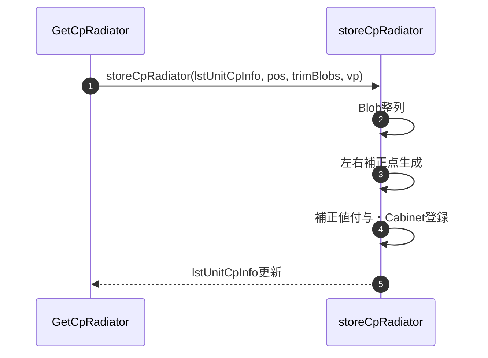

