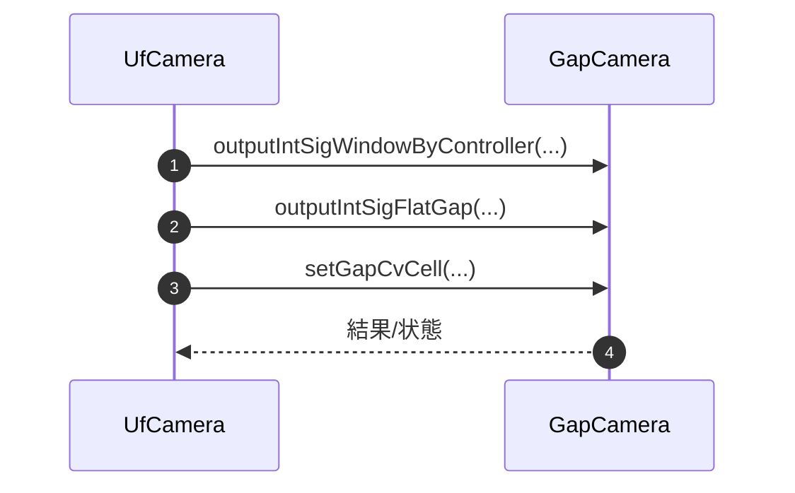


### 8-7. 相互参照メソッド

本章はGapCamera_詳細設計書 8-7（UfCamera参照メソッド）と対になる参照節です。
UfCameraからGapCamera側処理を参照する箇所を、標準化フォーマットで整理します。

---

#### 8-7-1. 参照方針

| 項目 | 内容 |
|------|------|
| 参照目的 | 共通表示信号や補正前提条件の整合を、Gap/Uf間で仕様同期する |
| 運用方針 | 実装責務は保持し、重複実装は行わず参照リンクで追跡する |

---

#### 8-7-2. 参照対象メソッド詳細

| No. | Gap側メソッド | シグネチャ | 引数 | 返り値 | 参照理由 | Uf側での利用箇所 |
|-----|---------------|-----------|------|--------|----------|------------------|
| 1 | outputIntSigWindowByController | void outputIntSigWindowByController(...) | Controller情報 | なし | Controller単位表示仕様の整合 | 8-5-3-18（Gap側実装参照） |
| 2 | outputIntSigFlatGap | void outputIntSigFlatGap(...) | Gap補正情報 | なし | Gap補正表示ロジック整合 | 8-5-3-16 連携仕様 |
| 3 | setGapCvCell 系 | void setGapCvCell(...) | SDCPデータ | なし | SDCP書込み整合 | 8-4 調整仕様比較時の参照 |

---

#### 8-7-3. 参照先・運用規則

| 参照先 | 参照粒度 | Uf側反映規則 |
|--------|----------|--------------|
| GapCamera_詳細設計書 8-5/8-6 | メソッド単位 | 署名変更・分岐追加時は本書8-5-3および本節を同時更新する |
| GapCamera_詳細設計書 8-3 | 処理群単位 | SDCP/ROM書込み仕様変更時は本書8-4の前提条件へ反映する |

---

#### 8-7-4. 参照シーケンス例

---

