# 基本設計書

| 項目 | 内容 |
|------|------|
| プロジェクト名 | ColorAlignmentSoftware |
| システム名 | CAS GapCamera |
| 作成日 | 2026/04/16 |
| 作成者 | システム分析チーム |
| バージョン | 1.0 |
| 関連文書 | 要件定義書：docs/GapCamera_要件定義書.md |

---

## 1. システム概要書

### 1-1. システム全体像

#### システム概要

GapCamera機能はCAS内のGap補正処理機能であり、対象Cabinetの選択、カメラ位置合わせ、計測、計測結果に基づく補正、ROM書込み、補正値バックアップ/リストアを提供する。

本機能は `CAS/Functions/GapCamera.cs` を中心に実装され、以下の外部・内部要素と連携する。

- カメラ制御：CameraControl / CameraControllerSharp
- 画像解析：OpenCvSharp
- 設備制御：ControllerへのSDCPコマンド送信
- 設定・永続化：Settings、XML、測定画像ファイル

#### システム構成図

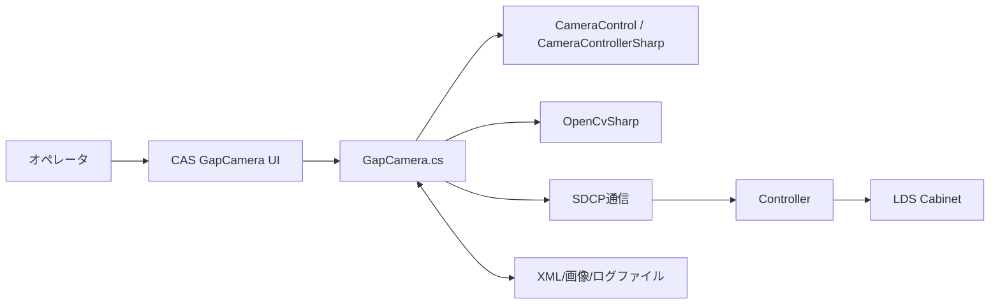

#### 構成要素一覧

| 構成要素 | 種別 | 役割 | 備考 |
|----------|------|------|------|
| GapCamera.cs | CAS機能モジュール | 計測/補正/書込み/復元の制御本体 | MainWindow partial class |
| CameraControl | 外部ライブラリ | カメラ接続・撮影・AF・ライブビュー制御 | CameraControllerSharp経由 |
| OpenCvSharp | 外部ライブラリ | 画像トリミング、領域抽出、解析処理 | 計測アルゴリズムで利用 |
| Controller（SDCP） | 外部システム | 補正値の設定・書込み・再構成 | sendSdcpCommand / sendReconfig |
| Settings.Ins.GapCam | 設定ストア | 撮影条件、測定レベル、待機時間など管理 | 機種別設定あり |
| GapCamCorrectionValue XML | ファイル | 補正値バックアップ/リストアデータ | SaveToXmlFile/LoadFromXmlFile |

#### ソリューション方針

| 項目 | 内容 |
|------|------|
| UI駆動方針 | ボタンイベントから非同期処理（Task.Run）を起動し、長時間処理をUI非ブロッキング化する |
| 安全制御方針 | 実行中は `tcMain.IsEnabled=false` で操作を抑止し、競合操作を防止する |
| 進捗管理方針 | `WindowProgress` により残時間・ステップ・メッセージを表示する |
| 装置反映方針 | 補正値書込みは Panel OFF → Write → Reconfig → Panel ON を標準手順とする |
| 復旧方針 | 例外時は ThroughMode解除・ユーザー設定復帰・メッセージ表示を必須とする |

---

### 1-2. アプリケーションマップ

#### アプリケーションマップ

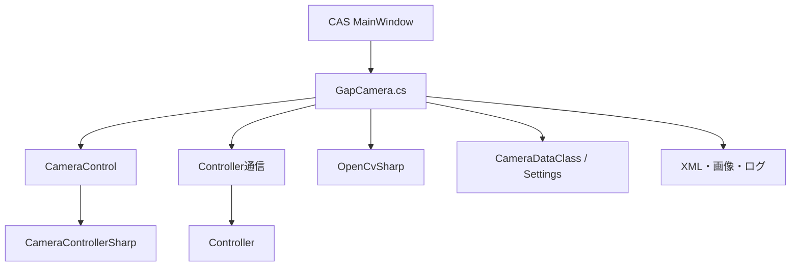

#### アプリケーション一覧

| No. | アプリケーション名 | 区分 | 主な役割 | 利用者・利用部門 | 備考 |
|-----|--------------------|------|----------|------------------|------|
| 1 | CAS（GapCamera） | 業務アプリ機能 | Gap補正の計測・補正・書込み操作 | オペレータ | 本設計対象 |
| 2 | CameraControl | 共通ライブラリ | カメラの撮影/AF設定 | CAS内部利用 | DLL参照 |
| 3 | Controller | 外部制御機器 | 補正値の反映・再構成 | CAS内部利用 | SDCP通信 |

#### アプリケーション間関係

| 連携元 | 連携先 | 連携概要 | 主なデータ | 連携方式 |
|--------|--------|----------|------------|----------|
| GapCamera | CameraControl | 撮影条件適用、AF、撮影実行 | ShootCondition, AfAreaSetting, 画像 | メソッド呼び出し |
| GapCamera | Controller | 内蔵パターン表示、補正値設定、書込み、電源制御 | SDCPコマンド、補正値 | TCP/SDCP |
| GapCamera | ファイルシステム | バックアップ・計測結果保存 | GapCamCorrectionValue(XML), 画像, ログ | ファイルI/O |

---

### 1-3. アプリケーション機能一覧

| アプリケーション名 | 機能ID | 機能名 | 機能概要 | 利用者 | 優先度 | 備考 |
|--------------------|--------|--------|----------|--------|--------|------|
| CAS GapCamera | GAP-F01 | カメラ位置合わせ | 対象Cabinetの妥当性検証後、内蔵パターンを表示・撮影して、カメラ位置合わせを実行 | オペレータ | 高 | `tbtnGapCamSetPos_Click`, `timerGapCam_Tick` |
| CAS GapCamera | GAP-F02 | Gap輝度比計測 | 対象Cabinetを撮影・解析しGap輝度比を算出 | オペレータ | 高 | `btnGapCamMeasStart_Click`, `measureGapAsync` |
| CAS GapCamera | GAP-F03 | Gap補正 | GAP-F02で生成した計測結果を用いて補正計算用データを作成 | オペレータ | 高 | 計測完了後に `btnGapCamAdjStart_Click`, `adjustGapRegAsync` |
| CAS GapCamera | GAP-F04 | ROM書込み | 補正値をControllerへ反映し再構成 | オペレータ | 高 | `btnGapCamRomStart_Click`, `romSaveAsync` |
| CAS GapCamera | GAP-F05 | バックアップ | 補正値をXML保存 | オペレータ | 中 | `btnGapCamBackup_Click`, `backupGapRegAsync` |
| CAS GapCamera | GAP-F06 | リストア | XML補正値を読み込み反映（通常/一括） | オペレータ | 高 | `restoreGapRegAsync`, `restoreBulkGapRegAsync` |
| CAS GapCamera | GAP-F07 | パターン出力補助 | 内蔵パターン表示を実行 | オペレータ | 中 | `cmbxPatternGapCam_DropDownClosed`, `outputGapCamTargetArea*` |

---

## 2. アプリケーション詳細

### 2-1. 機能関連図

#### 対象アプリケーション

CAS GapCamera.cs

#### 機能関連図

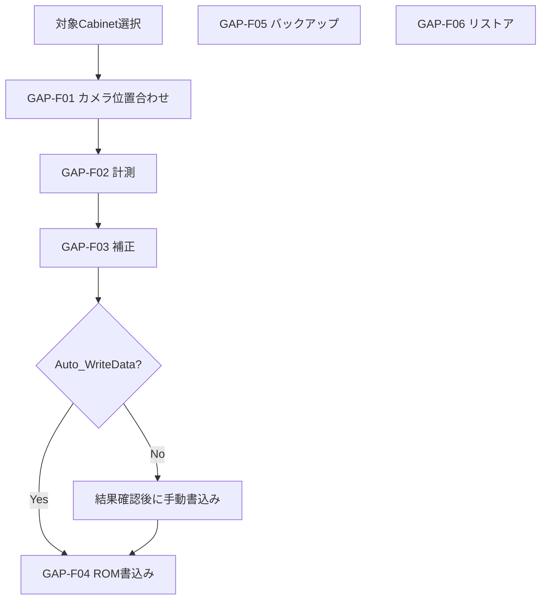

#### 補足説明

| 項目 | 内容 |
|------|------|
| 機能間連携の要点 | 計測結果をもとに補正値を算出し、必要に応じてROM書込みへ連結する。補正値はXMLで退避・復元可能。 |
| 前提条件 | 対象Cabinetが選択済みで矩形を満たすこと、カメラ/Controllerが接続可能であること。 |
| 制約事項 | 実行中の位置合わせ/計測/補正は排他。設定・機種差分は `Settings.Ins.GapCam` に依存。 |

---

### 2-2. 各機能仕様

#### 2-2-1. 機能名：カメラ位置合わせ機能

##### 2-2-1-1. 機能概要

| 項目 | 内容 |
|------|------|
| 機能ID | GAP-F01 |
| 機能名 | カメラ位置合わせ機能 |
| 機能概要 | 対象Cabinetに対して、カメラが適切な位置になるよう、ライブ画像を解析して支援する |
| 利用者 | オペレータ |
| 起動契機 | 位置合わせトグル操作（`tbtnGapCamSetPos_Click`） |
| 入力 | 選択Cabinet、撮影条件 |
| 出力 | 位置合わせ表示、ガイド情報、ログ |
| 関連機能 | GAP-F02, GAP-F07 |
| 前提条件 | 対象Cabinetが矩形であること |
| 事後条件 | 位置合わせモード停止、通常設定復帰 |
| 備考 | 位置合わせ中はタイマ更新（`timerGapCam_Tick`）で表示を更新する |

##### 2-2-1-2. 画面仕様

###### 画面一覧

| 画面ID | 画面名 | 目的 | 利用者 | 備考 |
|--------|--------|------|--------|------|
| GAP-S01 | Gap Correction(Camera) | 位置合わせ開始/停止、状態確認 | オペレータ | CASメイン画面内タブ |

###### 画面遷移

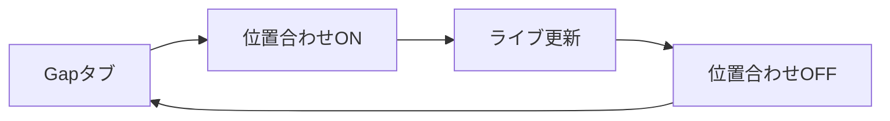

###### 画面共通ルール

| 項目 | 内容 |
|------|------|
| 共通レイアウト | CASメイン画面のGap関連タブで操作 |
| 操作ルール | 位置合わせ中は重複操作を抑止し、状態をトグルで明示する |
| 権限制御 | 本機能では未実装（運用権限前提） |
| エラー表示方針 | `ShowMessageWindow` で即時通知 |

###### 画面レイアウト

- 位置合わせトグル
- カメラライブ表示エリア
- ターゲットガイド表示

###### 画面入出力項目一覧

| 項目ID | 項目名 | 区分（入力/表示） | 型 | 桁数 | 必須 | 初期値 | バリデーション | 備考 |
|--------|--------|-------------------|----|------|------|--------|----------------|------|
| GAP-I00 | 対象Cabinet選択 | 入力 | Cabinet配列 | - | 必須 | 前回状態 | 矩形チェック | `CheckSelectedUnits` |
| GAP-O00 | 位置合わせ表示 | 表示 | 画像/ガイド | - | - | 空 | - | `timerGapCam_Tick` |

###### 画面アクション詳細

| アクション名 | 契機 | 処理内容 | 正常時 | 異常時 |
|--------------|------|----------|--------|--------|
| 位置合わせ開始 | トグルON | 対象Cabinet確認→Controller設定→タイマ開始 | ライブ更新開始 | エラー表示・復帰処理 |
| 位置合わせ停止 | トグルOFF | タイマ停止→Controller設定復帰 | 通常状態復帰 | エラー表示 |

##### 2-2-1-3. 帳票仕様

対象外

##### 2-2-1-4. EUCファイル（Downloadable File）仕様

対象外

##### 2-2-1-5. 関連システムインタフェース仕様

###### インタフェース一覧

| IF ID | 連携先システム | 方向 | 連携方式 | 概要 | 頻度 | 備考 |
|-------|----------------|------|----------|------|------|------|
| GAP-IF-00 | CameraControl | 双方向 | DLL呼び出し | ライブ表示、AF、撮影条件適用 | 位置合わせ実行時 | `SetCameraSettings`,`AutoFocus` |
| GAP-IF-02 | Controller | 双方向 | SDCP | 内蔵パターン表示 | 位置合わせ実行時 | `sendSdcpCommand` |

###### 関連システム関連図

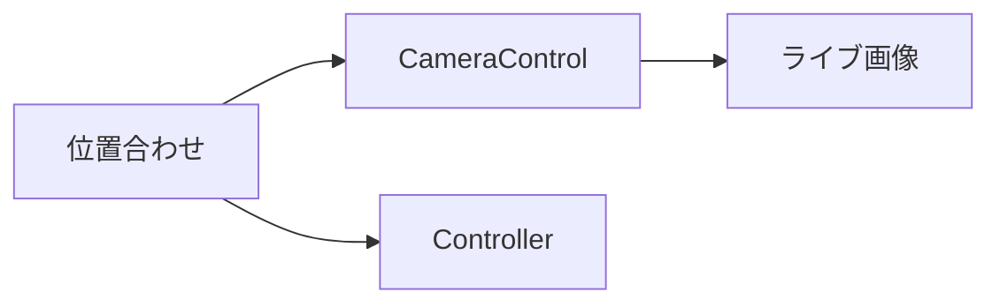

###### インタフェース項目仕様

| 項目名 | 説明 | 型 | 桁数 | 必須 | 変換ルール | 備考 |
|--------|------|----|------|------|------------|------|
| ShootCondition | 撮影設定 | クラス | - | 必須 | 設定値を機種別適用 | A6400/A7 |
| UnitInfo | 対象Cabinet | クラス | - | 必須 | UI選択→処理対象化 | 矩形前提 |

###### 処理内容

| 項目 | 内容 |
|------|------|
| 起動契機 | 位置合わせトグル |
| 処理タイミング | オペレータ操作時 |
| リトライ方針 | 失敗時は位置合わせ再開始 |
| 異常時対応 | 例外通知、設定復帰、処理停止 |

##### 2-2-1-6. 入出力処理仕様

###### 処理概要

| 項目 | 内容 |
|------|------|
| 処理名 | カメラ位置合わせ処理 |
| 処理種別 | オンライン |
| 処理概要 | 位置合わせ表示の開始/更新/停止を実施 |
| 実行契機 | 位置合わせトグル操作 |
| 実行タイミング | 任意 |

###### 入出力項目一覧

| 区分 | 項目名 | 説明 | 型 | 桁数 | 必須 | 備考 |
|------|--------|------|----|------|------|------|
| 入力 | 対象Cabinet | 位置合わせ対象 | List<UnitInfo> | - | 必須 | 矩形要件 |
| 入力 | 撮影設定 | カメラ設定 | ShootCondition | - | 必須 | 機種別 |
| 出力 | ライブ画像 | 撮影画像 | image | - | 必須 | UI更新 |
| 出力 | カメラ位置 | Cabinetに対するカメラ位置 | double | - | - | X/Y/Z/Pan/Tilt/Roll |

###### データ処理内容

1. 対象Cabinet選択
2. Controller設定適用
3. タイマ駆動で撮影・表示更新
4. 停止時のController設定復帰

###### IPO図

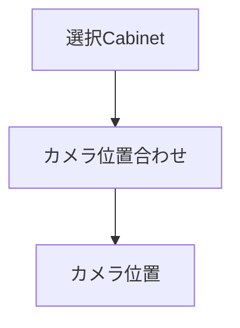

---

#### 2-2-2. 機能名：Gap輝度比計測機能

##### 2-2-2-1. 機能概要

| 項目 | 内容 |
|------|------|
| 機能ID | GAP-F02 |
| 機能名 | Gap輝度比計測機能 |
| 機能概要 | 対象Cabinetの撮影と画像解析を実行し、Gap輝度比を算出する |
| 利用者 | オペレータ |
| 起動契機 | 計測開始ボタン押下（`btnGapCamMeasStart_Click`） |
| 入力 | 選択Cabinet、GapCam設定、撮影条件、中断指示 |
| 出力 | 計測結果データ、撮影画像、ログ |
| 関連機能 | GAP-F01, GAP-F03, GAP-F07 |
| 前提条件 | 対象Cabinetが矩形であること |
| 事後条件 | 結果表示更新、通常設定復帰、進捗終了 |
| 備考 | 中断時は `CameraCasUserAbortException` を扱う |

##### 2-2-2-2. 画面仕様

###### 画面一覧

| 画面ID | 画面名 | 目的 | 利用者 | 備考 |
|--------|--------|------|--------|------|
| GAP-S01 | Gap Correction(Camera) | 計測開始、進捗確認、結果確認 | オペレータ | CASメイン画面内タブ |
| GAP-S02 | WindowProgress | 進捗・残時間・中断操作 | オペレータ | 計測中表示 |

###### 画面遷移

###### 画面共通ルール

| 項目 | 内容 |
|------|------|
| 共通レイアウト | CASメイン画面のGap関連タブで操作 |
| 操作ルール | 実行中は `tcMain.IsEnabled=false` |
| 権限制御 | 本機能では未実装（運用権限前提） |
| エラー表示方針 | `ShowMessageWindow` で即時通知 |

###### 画面レイアウト

- 計測開始ボタン
- 対象Cabinet選択エリア
- 計測結果表示エリア
- 進捗/残時間表示（WindowProgress）

###### 画面入出力項目一覧

| 項目ID | 項目名 | 区分（入力/表示） | 型 | 桁数 | 必須 | 初期値 | バリデーション | 備考 |
|--------|--------|-------------------|----|------|------|--------|----------------|------|
| GAP-I01 | 対象Cabinet選択 | 入力 | Cabinet配列 | - | 必須 | 前回状態 | 矩形チェック | `CheckSelectedUnits` |
| GAP-I02 | 撮影条件 | 入力 | ShootCondition | - | 必須 | 設定値 | 機種整合 | A6400/A7切替 |
| GAP-O01 | 進捗メッセージ | 表示 | string | - | - | 空 | - | `winProgress.ShowMessage` |
| GAP-O02 | 残時間 | 表示 | int(sec) | - | - | 0 | - | 概算値 |

###### 画面アクション詳細

| アクション名 | 契機 | 処理内容 | 正常時 | 異常時 |
|--------------|------|----------|--------|--------|
| 計測開始 | ボタン押下 | 前提確認→計測実行→設定復帰 | 完了メッセージ表示 | エラー表示・復帰処理 |
| 計測中断 | Progress操作 | 中断例外を発生させ停止 | 中断メッセージ表示 | - |

##### 2-2-2-3. 帳票仕様

対象外

##### 2-2-2-4. EUCファイル（Downloadable File）仕様

対象外

##### 2-2-2-5. 関連システムインタフェース仕様

###### インタフェース一覧

| IF ID | 連携先システム | 方向 | 連携方式 | 概要 | 頻度 | 備考 |
|-------|----------------|------|----------|------|------|------|
| GAP-IF-01 | CameraControl | 双方向 | DLL呼び出し | 撮影条件設定・AF・撮影 | 計測実行時 | `SetCameraSettings`,`AutoFocus` |
| GAP-IF-02 | Controller | 双方向 | SDCP | パターン表示/補正系制御 | 計測実行時 | `sendSdcpCommand` |

###### 関連システム関連図

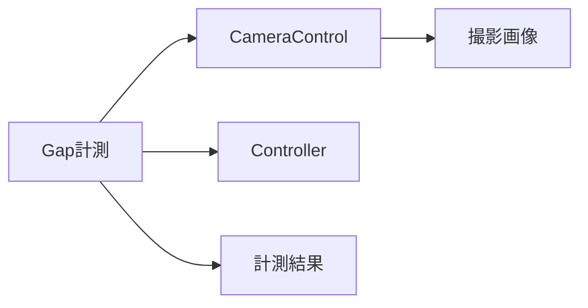

###### インタフェース項目仕様

| 項目名 | 説明 | 型 | 桁数 | 必須 | 変換ルール | 備考 |
|--------|------|----|------|------|------------|------|
| ShootCondition | 撮影設定 | クラス | - | 必須 | 設定値を機種別適用 | A6400/A7 |
| UnitInfo | 対象Cabinet | クラス | - | 必須 | UI選択→処理対象化 | 矩形前提 |
| SDCPコマンド | Controller制御 | byte[] | 可変 | 必須 | 定義済みコマンドをコピーして送信 | 待機時間あり |

###### 処理内容

| 項目 | 内容 |
|------|------|
| 起動契機 | 計測開始ボタン |
| 処理タイミング | オペレータ操作時 |
| リトライ方針 | 一部処理は再実行、全体はオペレータ再試行 |
| 異常時対応 | 例外通知、設定復帰、処理停止 |

##### 2-2-2-6. 入出力処理仕様

###### 処理概要

| 項目 | 内容 |
|------|------|
| 処理名 | Gap輝度比計測処理 |
| 処理種別 | オンライン |
| 処理概要 | 撮影・解析・結果保存を実施 |
| 実行契機 | 計測開始ボタン |
| 実行タイミング | 任意 |

###### 入出力項目一覧

| 区分 | 項目名 | 説明 | 型 | 桁数 | 必須 | 備考 |
|------|--------|------|----|------|------|------|
| 入力 | 選択Cabinet群 | 計測対象 | List<UnitInfo> | - | 必須 | 矩形要件 |
| 入力 | 撮影設定 | カメラ設定 | ShootCondition | - | 必須 | 機種別 |
| 出力 | 計測結果 | 補正計算用データ | GapCamCorrectionValue | - | 必須 | XML保存可 |
| 出力 | ログ | 実行ログ | text | - | - | 測定フォルダ |

###### データ処理内容

1. 対象Cabinet検証と進捗初期化
2. カメラ/Controller設定適用と撮影
3. 画像解析と計測結果格納
4. 設定復帰と結果表示

###### IPO図

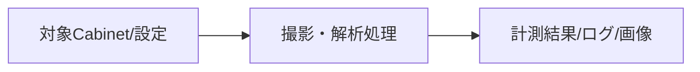

---

#### 2-2-3. 機能名：Gap補正・ROM書込み機能

##### 2-2-3-1. 機能概要

| 項目 | 内容 |
|------|------|
| 機能ID | GAP-F03, GAP-F04 |
| 機能名 | Gap補正・ROM書込み機能 |
| 機能概要 | 計測結果から補正値を算出し、Controllerへ反映してROM書込みする |
| 利用者 | オペレータ |
| 起動契機 | 計測完了後の補正開始 / Write Data押下 |
| 入力 | 計測結果、選択Cabinet、GapCam設定、中断指示、補正回数、評価設定 |
| 出力 | 補正結果表示、ROM反映結果 |
| 関連機能 | GAP-F02, GAP-F06 |
| 前提条件 | 対象Cabinetが矩形であり、計測結果が生成済みであること |
| 事後条件 | 補正値が更新され、必要に応じて再構成済みとなる |
| 備考 | `Auto_WriteData` 定義時は補正後に書込み確認を行う |

##### 2-2-3-2. 画面仕様

###### 画面一覧

| 画面ID | 画面名 | 目的 | 利用者 | 備考 |
|--------|--------|------|--------|------|
| GAP-S01 | Gap Correction(Camera) | 補正開始・ROM書込み操作 | オペレータ | CASタブ |
| GAP-S02 | WindowProgress | 書込み進捗表示 | オペレータ | 書込み中表示 |

###### 画面遷移

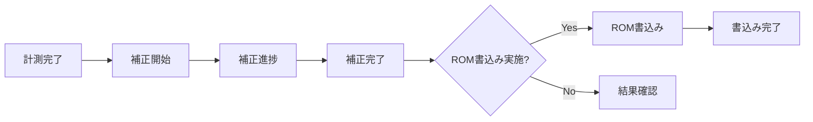

###### 画面共通ルール

| 項目 | 内容 |
|------|------|
| 共通レイアウト | CAS Gapタブ上で操作 |
| 操作ルール | 実行中は画面操作制限 |
| 権限制御 | 運用権限で実施 |
| エラー表示方針 | 失敗時は詳細メッセージ表示 |

###### 画面レイアウト

- 補正開始ボタン
- ROM書込みボタン
- 補正結果表示エリア
- 進捗ウィンドウ

###### 画面入出力項目一覧

| 項目ID | 項目名 | 区分（入力/表示） | 型 | 桁数 | 必須 | 初期値 | バリデーション | 備考 |
|--------|--------|-------------------|----|------|------|--------|----------------|------|
| GAP-I11 | 補正回数上限 | 入力 | int | - | 必須 | UI選択値 | 正整数 | `comboBoxGapCameraNumOfAdjustment` |
| GAP-I12 | 結果評価有効 | 入力 | bool | - | 任意 | false | - | `checkEnableAdjustmentResult` |
| GAP-O11 | 書込み進捗 | 表示 | string | - | - | 空 | - | `winProgress` |

###### 画面アクション詳細

| アクション名 | 契機 | 処理内容 | 正常時 | 異常時 |
|--------------|------|----------|--------|--------|
| 補正開始 | ボタン押下 | 計測結果確認後に補正値算出処理実行 | 補正完了通知 | エラー通知・結果表示 |
| ROM書込み | ボタン押下 | Write/Reconfig/Panel復帰 | 完了通知 | エラー通知 |

##### 2-2-3-3. 帳票仕様

対象外

##### 2-2-3-4. EUCファイル（Downloadable File）仕様

対象外

##### 2-2-3-5. 関連システムインタフェース仕様

###### インタフェース一覧

| IF ID | 連携先システム | 方向 | 連携方式 | 概要 | 頻度 | 備考 |
|-------|----------------|------|----------|------|------|------|
| GAP-IF-11 | Controller | 送信 | SDCP | 補正値設定/書込み/Panel制御/Reconfig | 補正・書込み時 | `writeGapCellCorrectionValueWithReconfig` |

###### 関連システム関連図

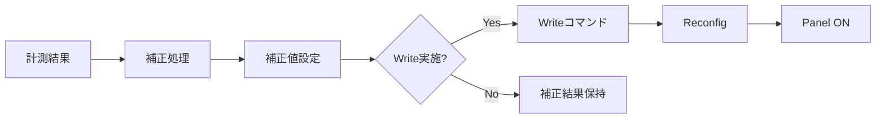

###### インタフェース項目仕様

| 項目名 | 説明 | 型 | 桁数 | 必須 | 変換ルール | 備考 |
|--------|------|----|------|------|------------|------|
| Cabinet識別 | Port/Cabinet/Controller | byte/ID | - | 必須 | UnitInfoから変換 | cmd[9]等 |
| Edge補正値 | 4辺×2ケ 補正値 | byte | 0-255 | 必須 | int→byte | Min/Max制限 |
| 書込みコマンド | ROM反映指示 | byte[] | 固定 | 必須 | 定義コマンド使用 | CmdGapCellCorrectWrite |

###### 処理内容

| 項目 | 内容 |
|------|------|
| 起動契機 | 計測完了後の補正開始、書込みボタン |
| 処理タイミング | オペレータ操作時 |
| リトライ方針 | 基本は再実行運用 |
| 異常時対応 | 計測結果未生成時または書込み失敗時はエラー表示と結果保持 |

##### 2-2-3-6. 入出力処理仕様

###### 処理概要

| 項目 | 内容 |
|------|------|
| 処理名 | Gap補正/ROM書込み処理 |
| 処理種別 | オンライン |
| 処理概要 | 計測結果読込、補正値算出、Controller反映、再構成 |
| 実行契機 | 計測完了後の補正開始/Write Data |
| 実行タイミング | 任意 |

###### 入出力項目一覧

| 区分 | 項目名 | 説明 | 型 | 桁数 | 必須 | 備考 |
|------|--------|------|----|------|------|------|
| 入力 | Gap輝度比計測結果 | 補正値の計算元 | List<GapCamCorrectionValue> | - | 必須 | 計測後 |
| 入力 | 補正回数 | 補正ループ上限 | int | - | 必須 | UI選択 |
| 出力 | 補正値 | Cell補正値 | GapCellCorrectValue | - | 必須 | 設備反映 |
| 出力 | 書込み結果 | 成否情報 | bool | - | 必須 | メッセージ表示 |

###### データ処理内容

1. 計測結果と補正条件の読込
2. 補正対象の現レジスタ値読込
3. 新補正値計算（Cell: `calcNewRegCell`）
4. Cellへ補正値設定
5. 必要時にWrite/Reconfig/Panel復帰

###### IPO図

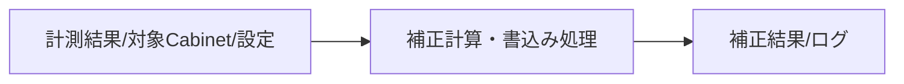

---

#### 2-2-4. 機能名：バックアップ/リストア機能

##### 2-2-4-1. 機能概要

| 項目 | 内容 |
|------|------|
| 機能ID | GAP-F05, GAP-F06 |
| 機能名 | バックアップ/リストア機能 |
| 機能概要 | 補正値をXMLで保存・復元し、装置へ再適用する |
| 利用者 | オペレータ |
| 起動契機 | Backup/Restoreボタン |
| 入力 | XMLファイルパス、対象Cabinet |
| 出力 | XMLファイル、補正値反映結果 |
| 関連機能 | GAP-F04 |
| 前提条件 | ファイルアクセス可能、対象設備接続済み |
| 事後条件 | 補正値が保存または復元される |
| 備考 | 通常/一括（Bulk）リストアを提供 |

##### 2-2-4-2. 画面仕様

###### 画面一覧

| 画面ID | 画面名 | 目的 | 利用者 | 備考 |
|--------|--------|------|--------|------|
| GAP-S01 | Gap Correction(Camera) | Backup/Restore操作 | オペレータ | CASタブ |
| GAP-S03 | Open/Save File Dialog | XMLファイル選択 | オペレータ | 標準ダイアログ |

###### 画面遷移

###### 画面共通ルール

| 項目 | 内容 |
|------|------|
| 共通レイアウト | CAS Gapタブ |
| 操作ルール | ダイアログでファイル確定後に処理開始 |
| 権限制御 | OSファイル権限に従う |
| エラー表示方針 | 例外内容をダイアログ表示 |

###### 画面レイアウト

- Backupボタン
- Restoreボタン
- Restore(Bulk)ボタン
- 処理進捗表示

###### 画面入出力項目一覧

| 項目ID | 項目名 | 区分（入力/表示） | 型 | 桁数 | 必須 | 初期値 | バリデーション | 備考 |
|--------|--------|-------------------|----|------|------|--------|----------------|------|
| GAP-I21 | XMLパス | 入力 | string | - | 必須 | 前回パス | 存在/拡張子 | LastBackupFile |
| GAP-O21 | 完了メッセージ | 表示 | string | - | - | 空 | - | 成功/失敗表示 |

###### 画面アクション詳細

| アクション名 | 契機 | 処理内容 | 正常時 | 異常時 |
|--------------|------|----------|--------|--------|
| Backup実行 | ボタン押下 | 現補正値読込→XML保存 | 完了通知 | エラー通知 |
| Restore実行 | ボタン押下 | XML読込→Cabinet/Cell反映→Write | 完了通知 | エラー通知 |
| Restore(Bulk)実行 | ボタン押下 | XML読込→Bulk反映→Write | 完了通知 | エラー通知 |

##### 2-2-4-3. 帳票仕様

対象外

##### 2-2-4-4. EUCファイル（Downloadable File）仕様

###### EUCファイル一覧

| ファイルID | ファイル名 | 目的 | 形式 | 文字コード | 備考 |
|------------|------------|------|------|------------|------|
| GAP-EUC-01 | GapCorrectionBackup.xml | 補正値バックアップ | XML | UTF-8 | `GapCamCorrectionValue` 配列 |

###### EUCファイルレイアウト

| 項目順 | 項目名 | 型 | 桁数 | 必須 | 説明 |
|--------|--------|----|------|------|------|
| 1 | Cabinet | object | - | 必須 | ControllerID/Port/Cabinet識別 |
| 2 | AryCvCell | array | moduleCount | 必須 | Cell補正値（4辺×2） |

##### 2-2-4-5. 関連システムインタフェース仕様

###### インタフェース一覧

| IF ID | 連携先システム | 方向 | 連携方式 | 概要 | 頻度 | 備考 |
|-------|----------------|------|----------|------|------|------|
| GAP-IF-21 | ファイルシステム | 送受信 | XML I/O | 補正値保存/読込 | 要求時 | Save/Load |
| GAP-IF-22 | Controller | 送信 | SDCP | 復元後の書込み確定 | 要求時 | Reconfig含む |

###### 関連システム関連図

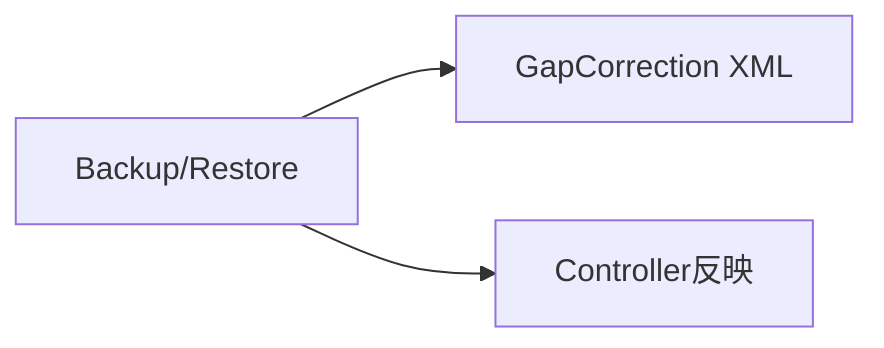

###### インタフェース項目仕様

| 項目名 | 説明 | 型 | 桁数 | 必須 | 変換ルール | 備考 |
|--------|------|----|------|------|------------|------|
| XML Path | 読込/保存先 | string | - | 必須 | ダイアログ選択 | 拡張子xml |
| GapCamCorrectionValue | 補正値実体 | class | - | 必須 | シリアライズ/デシリアライズ | 配列 |

###### 処理内容

| 項目 | 内容 |
|------|------|
| 起動契機 | Backup/Restoreボタン |
| 処理タイミング | 任意 |
| リトライ方針 | 再実行 |
| 異常時対応 | エラー表示、設定復帰 |

##### 2-2-4-6. 入出力処理仕様

###### 処理概要

| 項目 | 内容 |
|------|------|
| 処理名 | Gap補正値バックアップ/リストア |
| 処理種別 | オンライン |
| 処理概要 | 補正値の外部保存/復元 |
| 実行契機 | ユーザー操作 |
| 実行タイミング | 任意 |

###### 入出力項目一覧

| 区分 | 項目名 | 説明 | 型 | 桁数 | 必須 | 備考 |
|------|--------|------|----|------|------|------|
| 入力 | XMLファイル | バックアップ元/先 | string | - | 必須 | ファイル選択 |
| 出力 | XMLデータ | 補正値データ | xml | - | 必須 | UTF-8 |
| 出力 | 書込み結果 | 反映成否 | bool | - | 必須 | 進捗通知 |

###### データ処理内容

1. Gap補正値の収集またはXML読込
2. GapCamCorrectionValueへ変換
3. 保存またはController反映
4. 必要時にWrite/Reconfig

###### IPO図

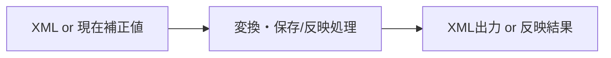

---

### 2-3. データベース仕様

#### データ概要

本機能はRDBを使用せず、ファイルベースでデータを管理する。

| データ名 | 概要 | 保持期間 | 更新主体 | 備考 |
|----------|------|----------|----------|------|
| Gap補正値XML | Gap補正値の保存 | 運用保管期間 | オペレータ操作 | XML |
| 計測画像ファイル | 計測時撮影画像 | 測定フォルダ世代管理 | 計測処理 | RAW等 |
| 実行ログ | 処理履歴・進捕ログ | 世代管理ポリシーに従う | Gap計測・Gap補正処理 | `saveLog` |

#### ERD

対象外（RDB未使用）

#### テーブル仕様

対象外

#### カラム仕様

対象外

#### CRUD一覧

| 機能ID | 機能名 | テーブル名 | Create | Read | Update | Delete |
|--------|--------|------------|--------|------|--------|--------|
| GAP-F05 | バックアップ | ファイル(XML) | ○ | - | ○ | - |
| GAP-F06 | リストア | ファイル(XML) | - | ○ | - | - |

---

### 2-4. メッセージ・コード仕様

#### メッセージ一覧

| メッセージID | 区分 | メッセージ内容 | 表示条件 | 対応方針 | 備考 |
|--------------|------|----------------|----------|----------|------|
| GAP-MSG-001 | 情報 | Measurement Gap Complete! | 計測成功 | 完了通知 | ダイアログ表示 |
| GAP-MSG-002 | エラー | Failed in Measurement Gap. | 計測失敗 | エラー通知 | 結果表示更新 |
| GAP-MSG-003 | 情報 | Adjustment Gap Complete! | 補正成功 | 完了通知 | 条件付き書込み確認 |
| GAP-MSG-004 | エラー | Failed in Adjustment Gap. | 補正失敗 | エラー通知 | - |
| GAP-MSG-005 | 情報 | Writing Gap correction value to ROM Complete! | 書込み成功 | 完了通知 | - |
| GAP-MSG-006 | エラー | Failed in writing Gap corection value to ROM. | 書込み失敗 | エラー通知 | スペルは既存実装準拠 |
| GAP-MSG-007 | 情報 | Backup/Restore Gap Correction Values Complete! | バックアップ/復元成功 | 完了通知 | - |

#### コード一覧

| コード種別 | コード値 | コード名称 | 説明 | 備考 |
|------------|----------|------------|------|------|
| GapStatus | Before | 補正前 | 補正前表示状態 | enum |
| GapStatus | Result | 補正後 | 補正結果表示状態 | enum |
| GapStatus | Measure | 計測のみ | 計測結果表示状態 | enum |

---

### 2-5. 機能/データ配置仕様

#### 配置方針

| 項目 | 内容 |
|------|------|
| 機能配置方針 | UIイベント・業務制御は `GapCamera.cs`、カメラ制御は外部ライブラリ、装置制御はSDCP通信に分離 |
| データ配置方針 | 設定はSettings、実行結果はファイル（XML/画像/ログ）で保持 |
| 配置上の制約 | 実機接続とファイル権限に依存。条件付きコンパイルの分岐差分あり |

#### 機能配置一覧

| 機能ID | 機能名 | 配置先 | 理由 | 備考 |
|--------|--------|--------|------|------|
| GAP-F01 | カメラ位置合わせ | CAS/Functions/GapCamera.cs | UI連携と測定前処理を一体化 | タイマ駆動 |
| GAP-F02 | 計測実行 | CAS/Functions/GapCamera.cs | 画像取得・解析・進捗管理の統合が必要 | 非同期処理 |
| GAP-F03 | 補正実行 | CAS/Functions/GapCamera.cs | 補正アルゴリズムと結果表示を統合 | - |
| GAP-F04 | ROM書込み | CAS/Functions/GapCamera.cs | 書込み手順を一元管理 | Reconfig含む |
| GAP-F05/F06 | Backup/Restore | CAS/Functions/GapCamera.cs | UI操作とXMLI/Oを統合 | 通常/一括対応 |

#### データ配置一覧

| データ名 | 配置先 | 保存形式 | バックアップ方針 | 備考 |
|----------|--------|----------|------------------|------|
| Gap補正値 | ローカルファイル | XML | 手動バックアップ機能提供 | GapCamCorrectionValue |
| 計測画像 | 測定フォルダ | 画像ファイル | 世代管理 | Gap_yyyyMMddHHmm |
| 実行ログ | 測定フォルダ | テキスト | 世代管理 | saveLog |
| 運用設定 | CAS設定 | 設定ファイル | 設定管理で保全 | Settings.Ins |

---

## 3. 付録

### 3-1. 用語集

| 用語 | 説明 |
|------|------|
| Gap輝度比 | Module間の距離に応じて見える明線/暗線と、その周囲の明るさ比 |
| Gap補正 | Module間Gapの見え方を改善するための補正 |
| ROM書込み | 補正値を装置側へ確定反映する処理 |
| Reconfig | Controllerへ再構成要求を送信する処理 |
| ThroughMode | 計測/位置合わせ時の表示・画質設定モード |
| GapCamCorrectionValue | Gap補正値を保持するデータ構造 |
| SDCP | Controller制御に使用する通信コマンド体系 |

---

### 3-2. 改版履歴

| バージョン | 日付 | 作成者 | 変更内容 |
|------------|------|--------|----------|
| 1.0 | 2026/04/16 | システム分析チーム | 初版（GapCamera.cs主体で作成） |
| 1.1 | 2026/04/16 | システム分析チーム | 2-2章を再編（2-2-1へカメラ位置合わせ機能を追加、既存機能を2-2-2以降へ繰り下げ） |
