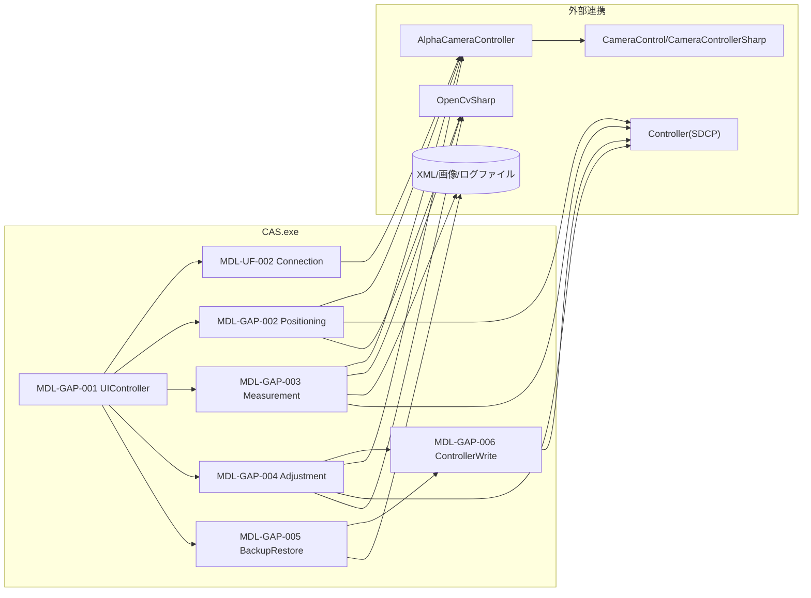

<!-- NiceDiffStart -->
## 差分サマリ（モデル分類）

| 区分 | 対象モデル |
|------|------------|
| 既存ファイル基準 | Chiron/Cancun |
| ColorAlignmentSoftware_Nice基準 | Verona/Capri |

### 参照ソース（Verona/Capri）
- ..\\ColorAlignmentSoftware_Nice\\CAS\\Functions\\GapCamera.cs
- ..\\ColorAlignmentSoftware_Nice\\CAS\\Functions\\TransformImage.cs
- ..\\ColorAlignmentSoftware_Nice\\CAS\\Functions\\EstimateCameraPos.cs
- ..\\ColorAlignmentSoftware_Nice\\CAS\\SDCPClass.cs

### このファイルの差分要点
- 配置差分: Controller連携にADCP(JSON)の経路を追加。
- 外部依存差分: Verona/Capriではgamma取得とモデル設定依存を配置理由へ反映。

### 更新時の注意
- 既存記述を維持したまま、上記差分観点を各章の手順・IF・例外仕様へ反映する。
- モデル表記は Chiron/Cancun と Verona/Capri を分離して記載する。
<!-- NiceDiffEnd -->

## 2. モジュール配置図（モジュールの物理配置設計）

### 2-1. 物理配置図

## 2-2. 配置一覧

| 配置区分 | 配置先パス/ノード | 配置モジュール | 配置理由 |
|----------|-------------------|----------------|----------|
| 実行モジュール | CAS/Functions/GapCamera.cs | MDL-GAP-001〜006 | Gap輝度比計測・Gap補正処理を単一機能ファイルに集約しているため |
| 外部カメラ連携 | CameraControl.dll | Positioning/Measurement | 撮影・AF・ライブビューのため |
| 外部カメラ実行 | Components/AlphaCameraController.exe | Connection/Measurement | CamCont.xml を介した撮影制御のため |
| 外部制御連携 | Controller (SDCP) | ControllerWrite/BackupRestore | 補正値設定・Write・Reconfigのため |
| ファイル永続化 | 計測フォルダ/任意XMLパス | Measurement/BackupRestore | 計測結果・補正値の保存/読込のため |

