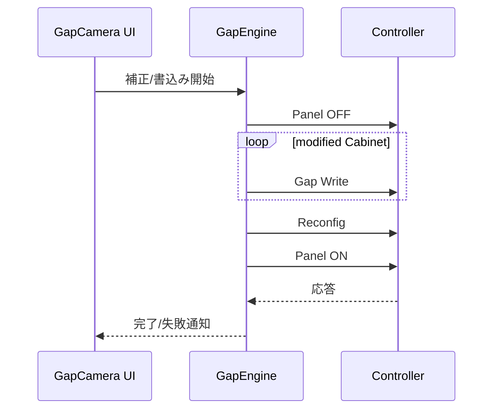
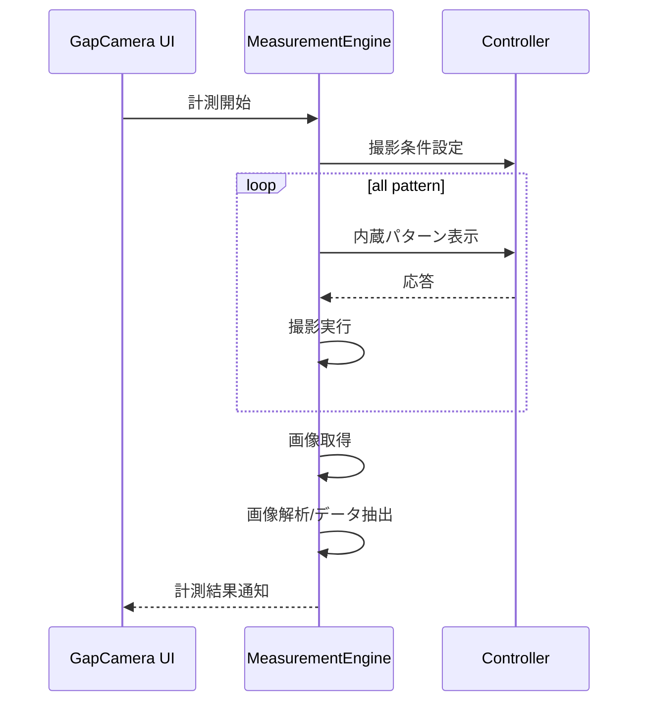
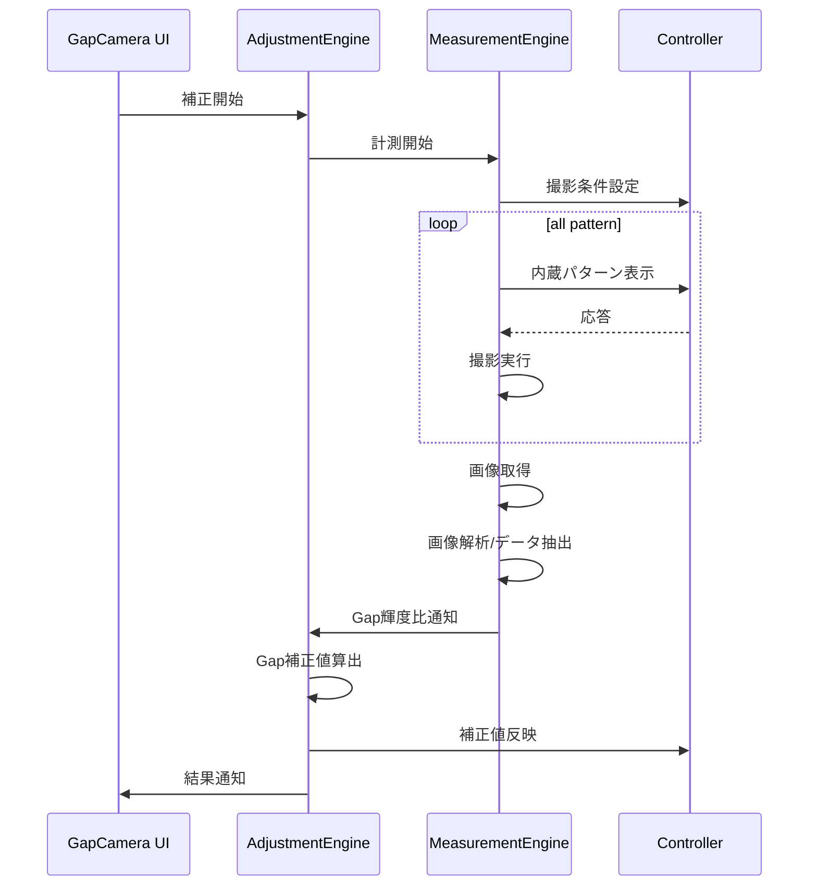
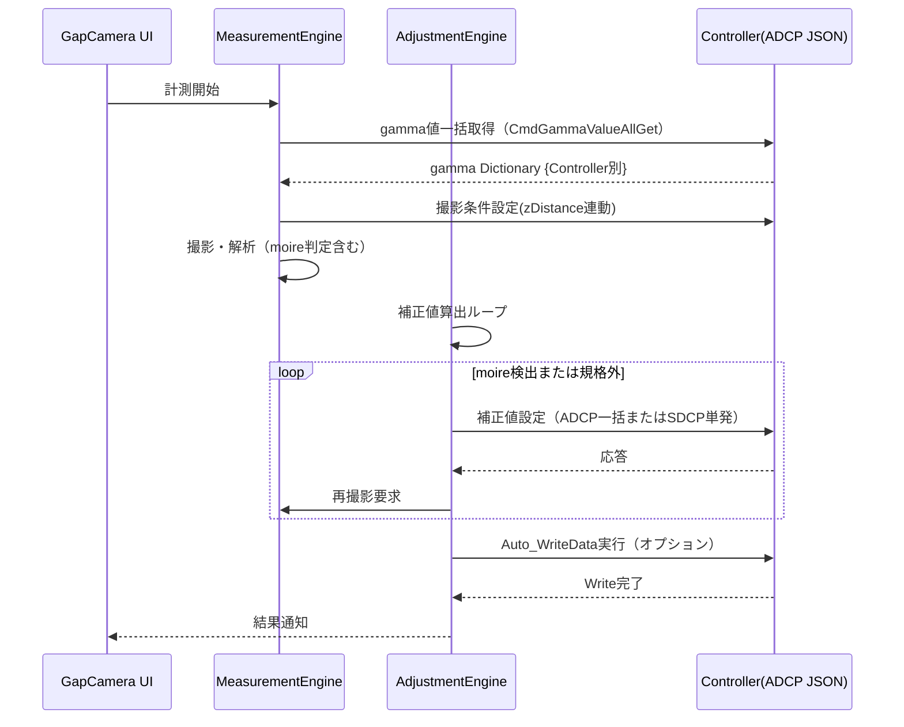

<!-- NiceDiffStart -->
## 差分サマリ（モデル分類）

| 区分 | 対象モデル |
|------|------------|
| 既存ファイル基準 | Chiron/Cancun |
| ColorAlignmentSoftware_Nice基準 | Verona/Capri |

### 参照ソース（Verona/Capri）
- ..\\ColorAlignmentSoftware_Nice\\CAS\\Functions\\GapCamera.cs
- ..\\ColorAlignmentSoftware_Nice\\CAS\\Functions\\TransformImage.cs
- ..\\ColorAlignmentSoftware_Nice\\CAS\\Functions\\EstimateCameraPos.cs
- ..\\ColorAlignmentSoftware_Nice\\CAS\\SDCPClass.cs

### このファイルの差分要点
- IF差分: SDCPに加えてADCP(JSON)の取得/設定IFを追加。
- 通信差分: ControllerIDごとの複数宛先(127.0.0.x)を明記。

### 更新時の注意
- 既存記述を維持したまま、上記差分観点を各章の手順・IF・例外仕様へ反映する。
- モデル表記は Chiron/Cancun と Verona/Capri を分離して記載する。
<!-- NiceDiffEnd -->

## 7. 関連システムインタフェース仕様

### 7-1. インタフェース一覧

| IF ID | I/O | インタフェースシステム名 | インタフェースファイル名 | インタフェースタイミング | インタフェース方法 | インタフェースエラー処理方法 | インタフェース処理のリラン定義 | インタフェース処理のロギング |
|------|-----|--------------------------|--------------------------|--------------------------|--------------------|------------------------------|--------------------------------|------------------------------------------|
| IF-GAP-001 | OUT | AlphaCameraController | CamCont.xml | 撮影設定/撮影時 | ファイル連携 | 例外捕捉・処理停止 | オペレータ再実行 | saveLog |
| IF-GAP-002 | OUT | Controller（SDCP） | SDCPコマンド | 補正/書込み/表示時 | TCP送信 | 例外捕捉・処理停止 | オペレータ再実行 | saveLog |
| IF-GAP-003 | IN/OUT | ファイルシステム | XML/画像/ログ | 計測/Backup/Restore時 | ファイルI/O | 例外捕捉・処理停止 | パス修正後再実行 | saveLog |
| IF-GAP-004 | OUT | Controller（ADCP JSON）| ADCPコマンド（Verona/Capri） | gamma値取得/補正値一括設定時 | JSON形式TCP送信 | 例外捕捉・処理停止 | オペレータ再実行 | saveLog |

### 7-2. インタフェースデータ項目定義

| IF ID | データ項目名 | データ項目の説明 | データ項目の位置 | 書式 | 必須 | エラー時の代替値 | 備考 |
|------|--------------|------------------|------------------|------|------|------------------|------|
| IF-GAP-001 | CamCont.xml | AlphaCameraController 連携設定 | XMLファイル | UTF-8 XML | Y | なし | 保存先、AF条件等 |
| IF-GAP-002 | SDCPコマンド | 内蔵パターン、ThroughMode、電源制御 | byte配列 | binary | Y | なし | CmdUnitPowerOn 等 |
| IF-GAP-002 | CmdGapCellCorrectValueSet | Cell補正設定コマンド | byte配列 | binary | Y | なし | Edge毎設定 |
| IF-GAP-002 | CmdGapCellCorrectWrite | ROM書込みコマンド | byte配列 | binary | Y | なし | Cabinet毎送信 |
| IF-GAP-003 | GapCamCorrectionValue[] | 補正バックアップデータ | XML要素 | UTF-8 XML | Y | なし | Save/Load対象 |
| IF-GAP-004 | CmdGammaValueAllGet | gamma値一括取得（Verona/Capri） | JSON形式 | JSON | Y（VP/Ver以上） | デフォルト値 | Controller別辞書生成 |
| IF-GAP-004 | CmdGapCorrectionValueAllSet | 補正値一括設定（Verona/Capri） | JSON形式 | JSON | Y（VP/Ver以上） | なし | ADCP一括書込み分岐 |
| IF-GAP-004 | CmdGapCorrectionValueAllGet | 補正値一括取得（Verona/Capri） | JSON形式 | JSON | 条件付き | なし | Backup時BulkCorrectValueWall=true |
| IF-GAP-004 | Auto_WriteData | 自動ROM書込み（Verona/Capri） | コマンド引数 | boolean | 条件付き | false | 補正ループ後に自動実行可能 |

### 7-3. インタフェース処理シーケンス

#### 7-3-1. 補正値書込み処理シーケンス

#### 7-3-2. 計測処理シーケンス

#### 7-3-3. 補正処理シーケンス

### 7-4. Verona/Capri対応のインタフェース（IF-GAP-004）

#### 7-4-1. ADCP JSON形式の特徴

| 項目 | 説明 |
|------|------|
| 通信方式 | SDCP同様、TCP/IPベース、ただしデータ形式がJSON |
| gamma値取得 | `CmdGammaValueAllGet`: 複数Controller分のgamma値を一括取得、JSON形式で応答 |
| 補正値設定 | `CmdGapCorrectionValueAllSet`: 複数Cabinet分の補正値をJSON形式で一括設定 |
| 補正値取得 | `CmdGapCorrectionValueAllGet`: バックアップ時に JSON形式で全補正値一括取得 |
| 自動書込み | `Auto_WriteData`: 補正ループ終了後、自動的に ROM書込みを実行可能 |

#### 7-4-2. 複数宛先（127.0.0.x）の構成

| 宛先 | 対象 | 説明 |
|------|------|------|
| 127.0.0.1 | 主制御Controller | デフォルト通信先（単発I/F用） |
| 127.0.0.2～127.0.0.8 | 複数従属Controller | マルチユニット配置時の複数コントローラ対応（ADCP JSON一括I/F用） |

#### 7-4-3. Verona/Capri対応シーケンス

