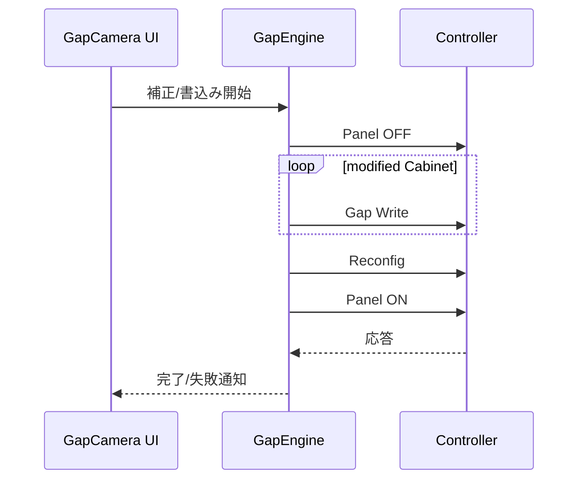
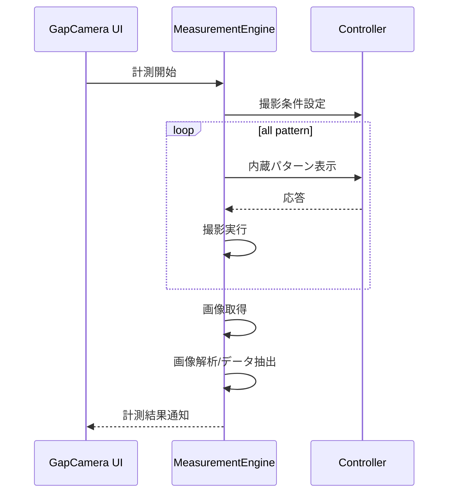
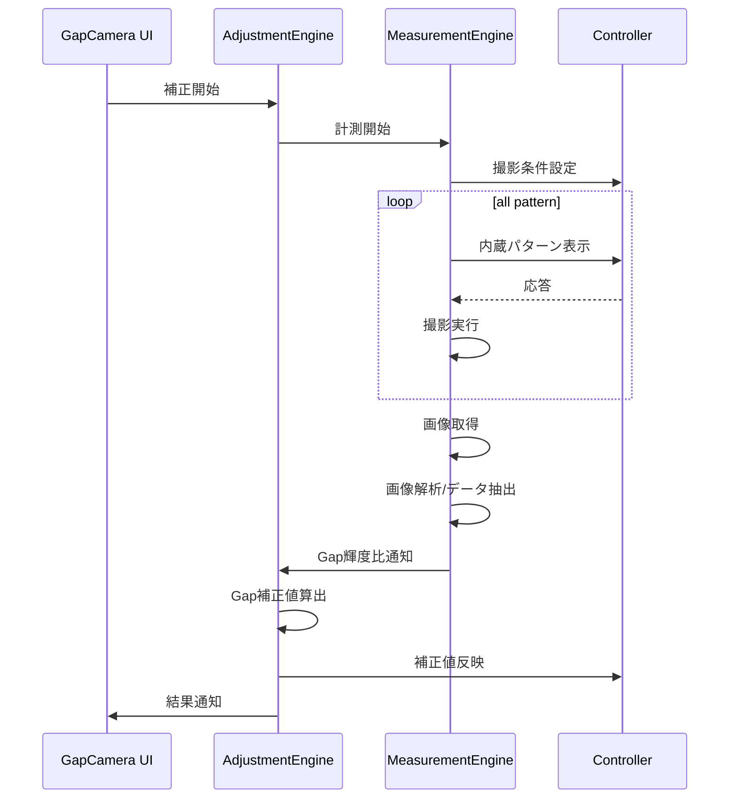

## 7. 関連システムインタフェース仕様

### 7-1. インタフェース一覧

| IF ID | I/O | インタフェースシステム名 | インタフェースファイル名 | インタフェースタイミング | インタフェース方法 | インタフェースエラー処理方法 | インタフェース処理のリラン定義 | インタフェース処理のロギングインタフェース |
|------|-----|--------------------------|--------------------------|--------------------------|--------------------|------------------------------|--------------------------------|------------------------------------------|
| IF-GAP-001 | OUT | AlphaCameraController | CamCont.xml | 撮影設定/撮影時 | ファイル連携 | 例外捕捉・処理停止 | オペレータ再実行 | saveLog |
| IF-GAP-002 | OUT | Controller | SDCPコマンド | 補正/書込み/表示時 | TCP送信 | 例外捕捉・処理停止 | オペレータ再実行 | saveLog |
| IF-GAP-003 | IN/OUT | ファイルシステム | XML/画像/ログ | 計測/Backup/Restore時 | ファイルI/O | 例外捕捉・処理停止 | パス修正後再実行 | saveLog |

### 7-2. インタフェースデータ項目定義

| IF ID | データ項目名 | データ項目の説明 | データ項目の位置 | 書式 | 必須 | エラー時の代替値 | 備考 |
|------|--------------|------------------|------------------|------|------|------------------|------|
| IF-GAP-001 | CamCont.xml | AlphaCameraController 連携設定 | XMLファイル | UTF-8 XML | Y | なし | 保存先、AF条件等 |
| IF-GAP-002 | SDCPコマンド | 内蔵パターン、ThroughMode、電源制御 | byte配列 | binary | Y | なし | CmdUnitPowerOn 等 |
| IF-GAP-002 | CmdGapCellCorrectValueSet | Cell補正設定コマンド | byte配列 | binary | Y | なし | Edge毎設定 |
| IF-GAP-002 | CmdGapCellCorrectWrite | ROM書込みコマンド | byte配列 | binary | Y | なし | Cabinet毎送信 |
| IF-GAP-003 | GapCamCorrectionValue[] | 補正バックアップデータ | XML要素 | UTF-8 XML | Y | なし | Save/Load対象 |

### 7-3. インタフェース処理シーケンス

#### 7-3-1. 補正値書込み処理シーケンス

#### 7-3-2. 計測処理シーケンス

#### 7-3-3. 補正処理シーケンス

