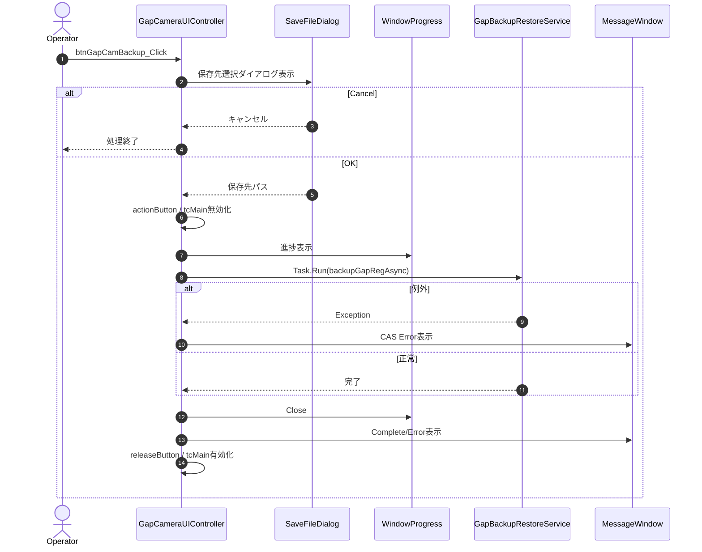
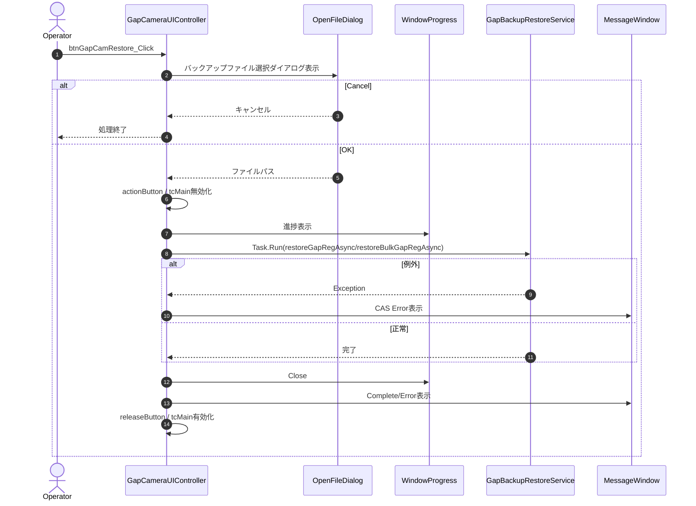
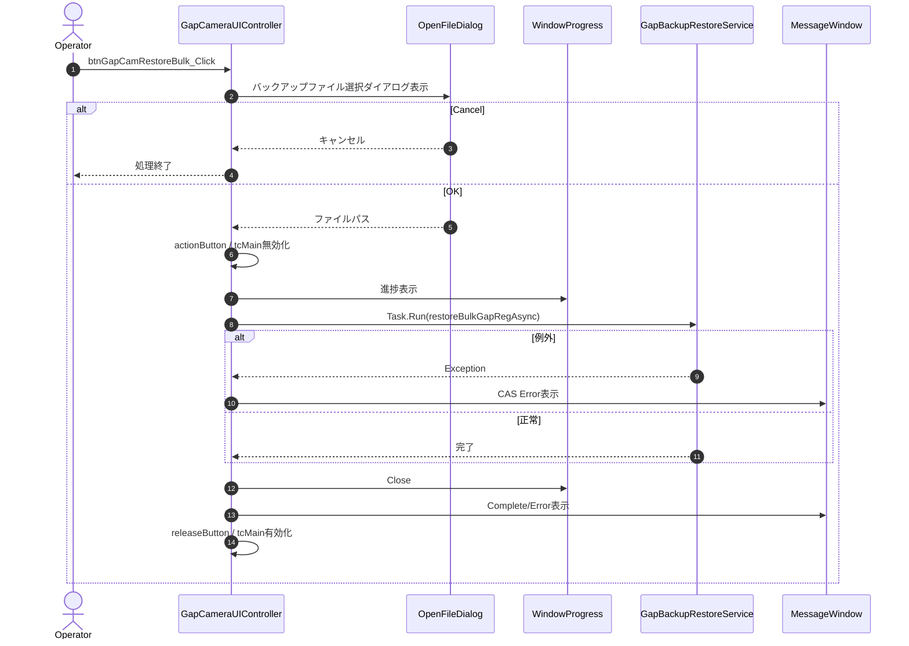
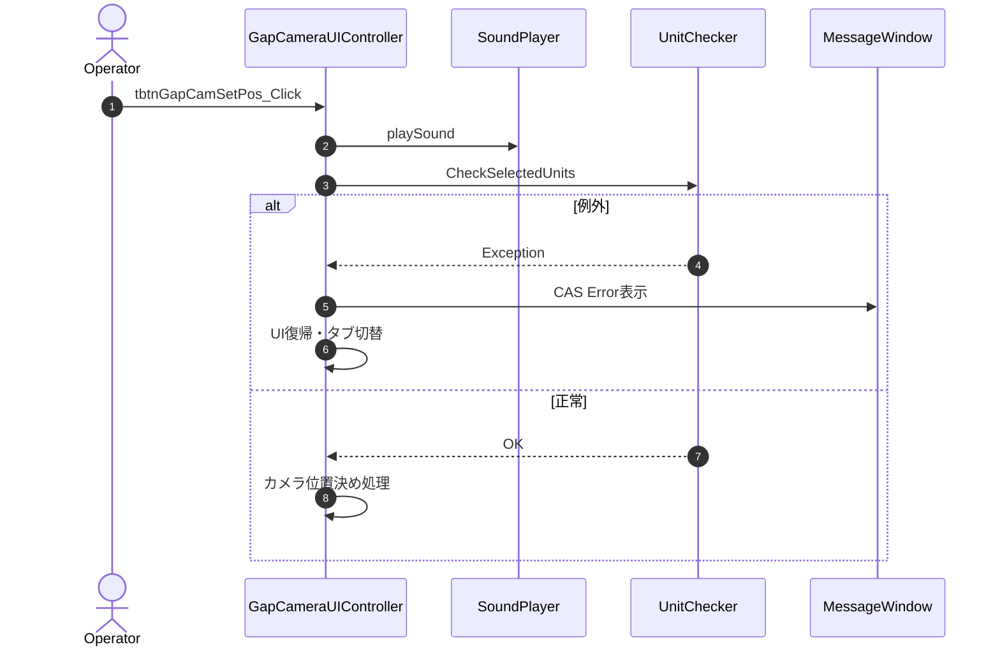
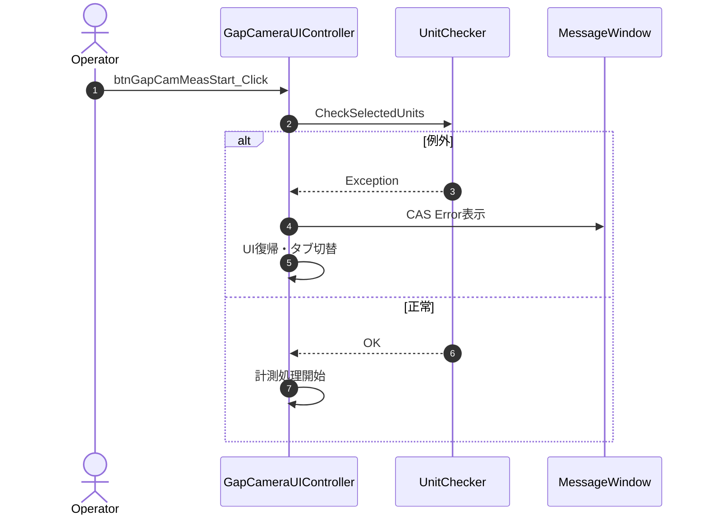
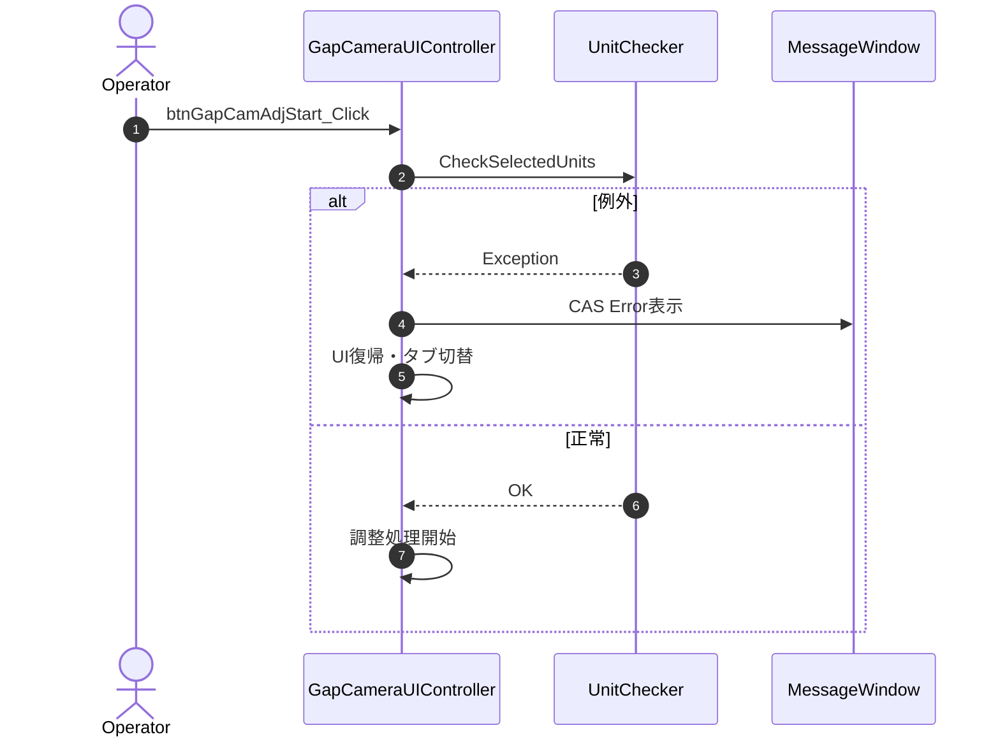
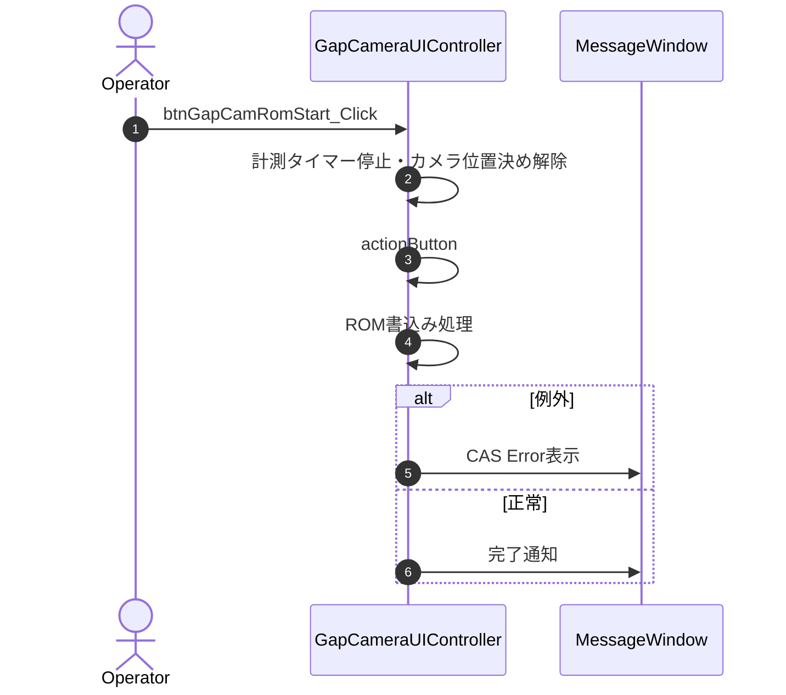

# 08-1. UIイベント・制御メソッド

---

## 8-1-1. btnGapCamBackup_Click

| 項目 | 内容 |
|------|------|
| シグネチャ | `private async void btnGapCamBackup_Click(object sender, RoutedEventArgs e)` |
| 概要 | Gap補正値のバックアップ処理を開始する |
| 引数 | sender, e |
| 返り値 | なし（void） |

### 処理概要
1. 保存先選択ダイアログ表示（前回保存先を優先）
2. OK時のみ後続処理、Cancel時は無処理終了
3. UI無効化・進捗ウィンドウ表示
4. 非同期でXMLバックアップ実行
5. 終了時にメッセージ表示・UI復帰

### 主要呼出し先
| 呼出し先 | 役割 | 同期/非同期 |
|----------|------|--------------|
| backupGapRegAsync | Gap補正値のXMLバックアップ | 非同期（Task.Run） |
| WindowProgress | 進捗表示 | 同期 |
| ShowMessageWindow/WindowMessage | 異常・完了通知 | 同期 |

### 入力条件
| 区分 | 条件 | NG時挙動 |
|------|------|----------|
| ファイルパス | 保存先パスが選択されている | ダイアログ閉じて終了 |
| 保存先 | 書込み可能 | 例外捕捉しエラー通知 |

### 条件分岐
- ダイアログCancel時は何もせず終了
- バックアップ失敗時はエラー通知

### 例外時
| ケース | 捕捉方法 | 通知 | 後処理 |
|--------|----------|------|--------|
| バックアップ失敗 | Exception | CAS Error!ダイアログ | UI復帰・エラー表示 |

### シーケンス図

---

## 8-1-2. btnGapCamRestore_Click

| 項目 | 内容 |
|------|------|
| シグネチャ | `private async void btnGapCamRestore_Click(object sender, RoutedEventArgs e)` |
| 概要 | Gap補正値のリストア処理を開始する |
| 引数 | sender, e |
| 返り値 | なし（void） |

### 処理概要
1. バックアップファイル選択ダイアログ表示（前回保存先を優先）
2. OK時のみ後続処理、Cancel時は無処理終了
3. UI無効化・進捗ウィンドウ表示
4. 非同期でXMLリストア実行（restoreGapRegAsyncまたはrestoreBulkGapRegAsync）
5. 終了時にメッセージ表示・UI復帰

### 主要呼出し先
| 呼出し先 | 役割 | 同期/非同期 |
|----------|------|--------------|
| restoreGapRegAsync/restoreBulkGapRegAsync | Gap補正値のXMLリストア | 非同期（Task.Run） |
| WindowProgress | 進捗表示 | 同期 |
| ShowMessageWindow/WindowMessage | 異常・完了通知 | 同期 |

### 入力条件
| 区分 | 条件 | NG時挙動 |
|------|------|----------|
| ファイルパス | バックアップファイルが選択されている | ダイアログ閉じて終了 |
| 読込先 | 読込可能 | 例外捕捉しエラー通知 |

### 条件分岐
- ダイアログCancel時は何もせず終了
- リストア失敗時はエラー通知

### 例外時
| ケース | 捕捉方法 | 通知 | 後処理 |
|--------|----------|------|--------|
| リストア失敗 | Exception | CAS Error!ダイアログ | UI復帰・エラー表示 |

### シーケンス図

---

## 8-1-3. btnGapCamRestoreBulk_Click

| 項目 | 内容 |
|------|------|
| シグネチャ | `private async void btnGapCamRestoreBulk_Click(object sender, RoutedEventArgs e)` |
| 概要 | Gap補正値の一括リストア処理を開始する |
| 引数 | sender, e |
| 返り値 | なし（void） |

### 処理概要
1. バックアップファイル選択ダイアログ表示（前回保存先を優先）
2. OK時のみ後続処理、Cancel時は無処理終了
3. UI無効化・進捗ウィンドウ表示
4. 非同期で一括XMLリストア実行（restoreBulkGapRegAsync）
5. 終了時にメッセージ表示・UI復帰

### 主要呼出し先
| 呼出し先 | 役割 | 同期/非同期 |
|----------|------|--------------|
| restoreBulkGapRegAsync | Gap補正値の一括XMLリストア | 非同期（Task.Run） |
| WindowProgress | 進捗表示 | 同期 |
| ShowMessageWindow/WindowMessage | 異常・完了通知 | 同期 |

### 入力条件
| 区分 | 条件 | NG時挙動 |
|------|------|----------|
| ファイルパス | バックアップファイルが選択されている | ダイアログ閉じて終了 |
| 読込先 | 読込可能 | 例外捕捉しエラー通知 |

### 条件分岐
- ダイアログCancel時は何もせず終了
- リストア失敗時はエラー通知

### 例外時
| ケース | 捕捉方法 | 通知 | 後処理 |
|--------|----------|------|--------|
| リストア失敗 | Exception | CAS Error!ダイアログ | UI復帰・エラー表示 |

### シーケンス図

---

## 8-1-4. tbtnGapCamSetPos_Click

| 項目 | 内容 |
|------|------|
| シグネチャ | `unsafe private void tbtnGapCamSetPos_Click(object sender, RoutedEventArgs e)` |
| 概要 | Gapカメラ位置決めトグルボタン押下時の処理 |
| 引数 | sender, e |
| 返り値 | なし（void） |

### 処理概要
1. LEDモデル・カメラパラメータ設定
2. トグルON時、選択ユニットの検証・カメラ位置決め処理
3. 例外時はエラー通知・UI復帰

### 主要呼出し先
| 呼出し先 | 役割 | 同期/非同期 |
|----------|------|--------------|
| playSound | 効果音再生 | 同期 |
| CheckSelectedUnits | 選択ユニット検証 | 同期 |
| ShowMessageWindow | 異常通知 | 同期 |

### 入力条件
| 区分 | 条件 | NG時挙動 |
|------|------|----------|
| ユニット選択 | 有効なユニットが選択されている | エラー通知・UI復帰 |

### 条件分岐
- トグルOFF時は何もしない
- 選択ユニット不正時はエラー通知

### 例外時
| ケース | 捕捉方法 | 通知 | 後処理 |
|--------|----------|------|--------|
| ユニット選択不正 | Exception | CAS Error!ダイアログ | UI復帰・タブ切替 |

### シーケンス図

---

## 8-1-5. btnGapCamMeasStart_Click

| 項目 | 内容 |
|------|------|
| シグネチャ | `private async void btnGapCamMeasStart_Click(object sender, RoutedEventArgs e)` |
| 概要 | Gapカメラ計測開始ボタン押下時の処理 |
| 引数 | sender, e |
| 返り値 | なし（void） |

### 処理概要
1. 計測対象ユニットの検証
2. 計測処理開始（非同期）
3. 終了時にUI復帰・メッセージ表示

### 主要呼出し先
| 呼出し先 | 役割 | 同期/非同期 |
|----------|------|--------------|
| CheckSelectedUnits | 計測対象ユニット検証 | 同期 |
| actionButton | 計測開始通知 | 同期 |
| ShowMessageWindow | 異常通知 | 同期 |

### 入力条件
| 区分 | 条件 | NG時挙動 |
|------|------|----------|
| ユニット選択 | 有効なユニットが選択されている | エラー通知・UI復帰 |

### 条件分岐
- 選択ユニット不正時はエラー通知

### 例外時
| ケース | 捕捉方法 | 通知 | 後処理 |
|--------|----------|------|--------|
| ユニット選択不正 | Exception | CAS Error!ダイアログ | UI復帰・タブ切替 |

### シーケンス図

---

## 8-1-6. btnGapCamAdjStart_Click

| 項目 | 内容 |
|------|------|
| シグネチャ | `private async void btnGapCamAdjStart_Click(object sender, RoutedEventArgs e)` |
| 概要 | Gapカメラ調整開始ボタン押下時の処理 |
| 引数 | sender, e |
| 返り値 | なし（void） |

### 処理概要
1. 調整対象ユニットの検証
2. 調整処理開始（非同期）
3. 終了時にUI復帰・メッセージ表示

### 主要呼出し先
| 呼出し先 | 役割 | 同期/非同期 |
|----------|------|--------------|
| CheckSelectedUnits | 調整対象ユニット検証 | 同期 |
| actionButton | 調整開始通知 | 同期 |
| ShowMessageWindow | 異常通知 | 同期 |

### 入力条件
| 区分 | 条件 | NG時挙動 |
|------|------|----------|
| ユニット選択 | 有効なユニットが選択されている | エラー通知・UI復帰 |

### 条件分岐
- 選択ユニット不正時はエラー通知

### 例外時
| ケース | 捕捉方法 | 通知 | 後処理 |
|--------|----------|------|--------|
| ユニット選択不正 | Exception | CAS Error!ダイアログ | UI復帰・タブ切替 |

### シーケンス図

---

## 8-1-7. btnGapCamRomStart_Click

| 項目 | 内容 |
|------|------|
| シグネチャ | `private async void btnGapCamRomStart_Click(object sender, RoutedEventArgs e)` |
| 概要 | Gap補正値のROM書込み開始ボタン押下時の処理 |
| 引数 | sender, e |
| 返り値 | なし（void） |

### 処理概要
1. 必要に応じて計測タイマー停止・カメラ位置決め解除
2. ROM書込み処理開始（非同期）
3. 終了時にUI復帰・メッセージ表示

### 主要呼出し先
| 呼出し先 | 役割 | 同期/非同期 |
|----------|------|--------------|
| actionButton | 書込み開始通知 | 同期 |
| ShowMessageWindow | 異常通知 | 同期 |

### 入力条件
| 区分 | 条件 | NG時挙動 |
|------|------|----------|
| 計測タイマー | 停止済み | 必要に応じて停止処理 |

### 条件分岐
- 計測タイマー動作中は停止処理

### 例外時
| ケース | 捕捉方法 | 通知 | 後処理 |
|--------|----------|------|--------|
| 書込み失敗 | Exception | CAS Error!ダイアログ | UI復帰・エラー表示 |

### シーケンス図

---

## 8-1-8. その他のUIイベント

### btnSelectAllGapCam_Click / btnDeselectAllGapCam_Click
| 項目 | 内容 |
|------|------|
| シグネチャ | `private void btnSelectAllGapCam_Click(object sender, RoutedEventArgs e)` `private void btnDeselectAllGapCam_Click(object sender, RoutedEventArgs e)` |
| 概要 | 全ユニット選択／全解除ボタン押下時の処理 |
| 引数 | sender, e |
| 返り値 | なし（void） |

### 処理概要
1. 全ユニットのIsCheckedをtrue/falseに設定
2. UI更新・releaseButton呼出し

### 主要呼出し先
| 呼出し先 | 役割 | 同期/非同期 |
|----------|------|--------------|
| actionButton | 操作通知 | 同期 |
| releaseButton | 操作完了通知 | 同期 |

---

### btnGapCamMeasResultOpen_Click / btnGapCamAdjResultOpen_Click
| 項目 | 内容 |
|------|------|
| シグネチャ | `private void btnGapCamMeasResultOpen_Click(object sender, RoutedEventArgs e)` `private void btnGapCamAdjResultOpen_Click(object sender, RoutedEventArgs e)` |
| 概要 | 計測／調整結果画像の読込・表示ボタン押下時の処理 |
| 引数 | sender, e |
| 返り値 | なし（void） |

### 処理概要
1. OpenFileDialogで画像ファイル選択
2. Bitmapとして読込・UIに表示

---

### utbGapCam_PreviewMouseDown/Up/Move, imgGapCamBefore_MouseLeftButtonDown/Up/Leave/Move
| 項目 | 内容 |
|------|------|
| シグネチャ | `private void utbGapCam_PreviewMouseDown(object sender, MouseButtonEventArgs e)` 他 |
| 概要 | ユニット選択・ドラッグ・画像操作系イベント |
| 引数 | sender, e |
| 返り値 | なし（void） |

---
