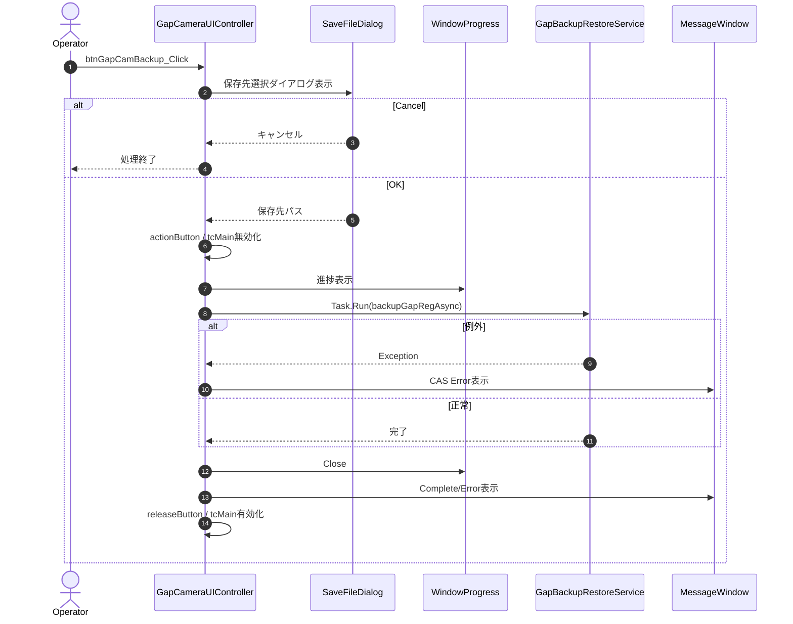
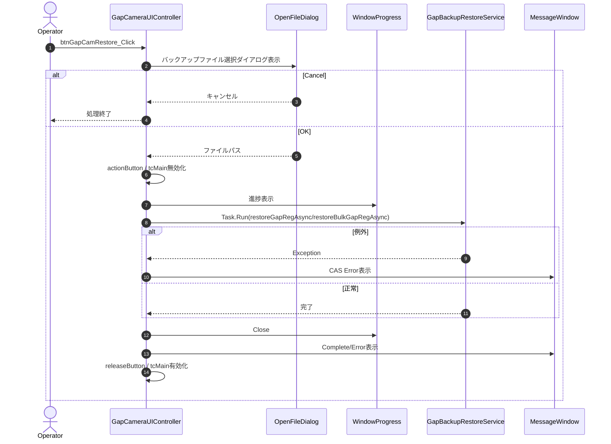
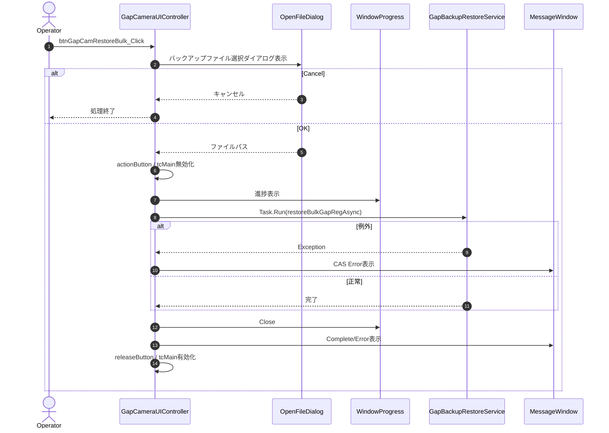
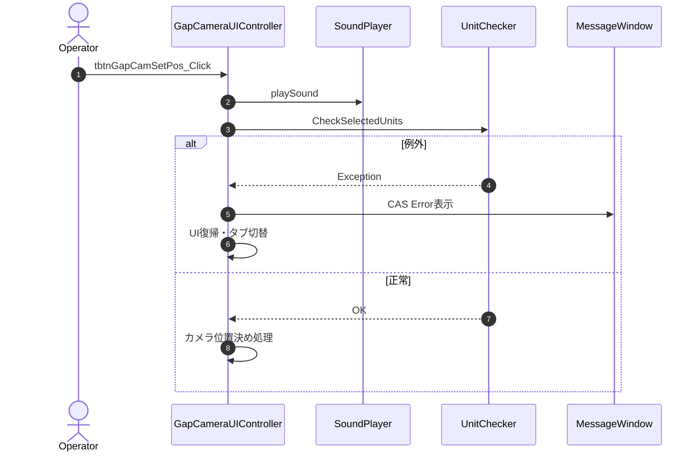
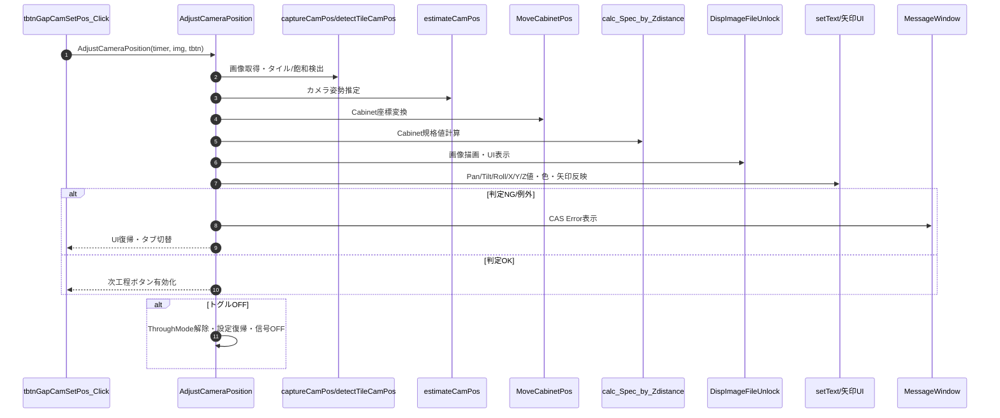
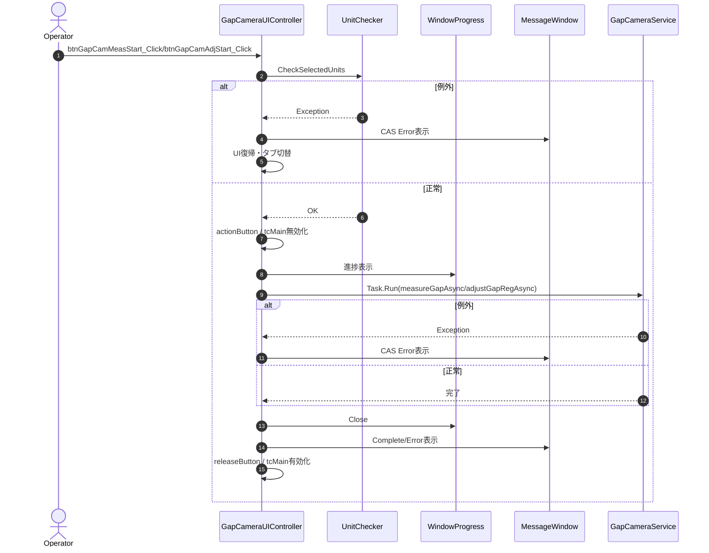
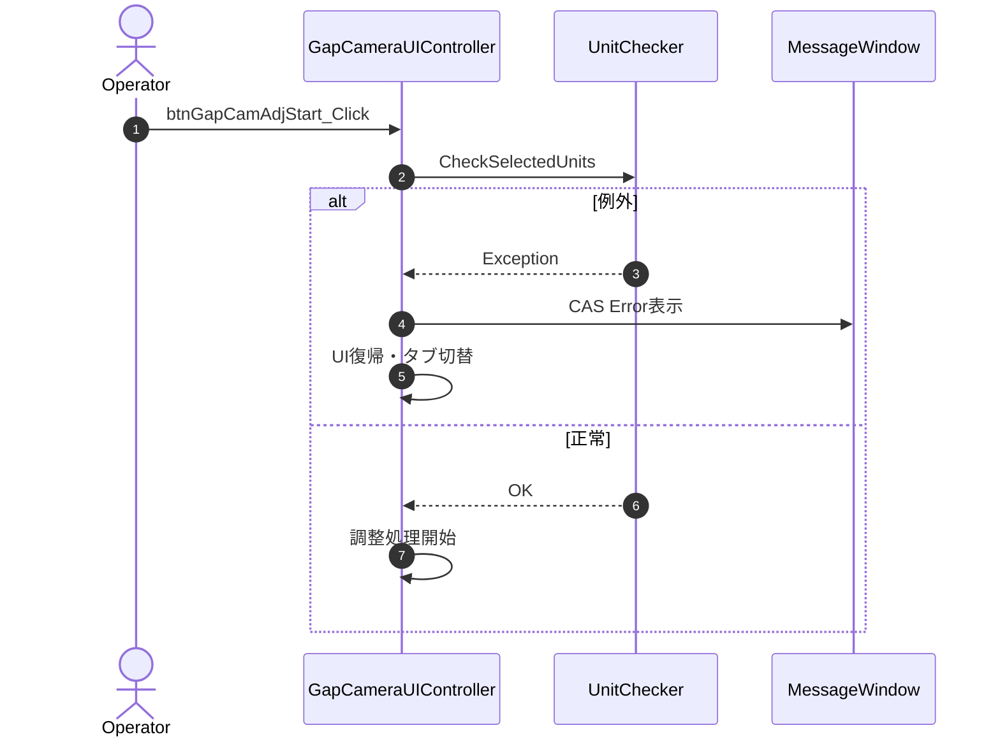
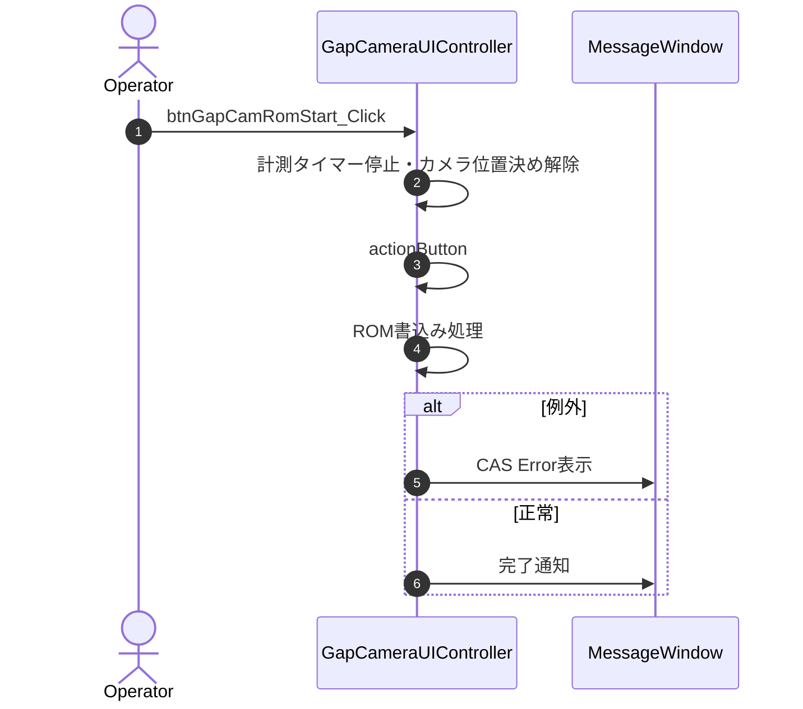

### 8-1. UIイベント・制御メソッド

#### 8-1-1. btnGapCamBackup_Click

| 項目 | 内容 |
|------|------|
| シグネチャ | `private async void btnGapCamBackup_Click(object sender, RoutedEventArgs e)` |
| 概要 | Gap補正値のバックアップ処理を開始する |
引数: sender, e
返り値: なし（void）

処理概要（詳細）
1. 保存先選択ダイアログ表示（前回保存先を優先）
2. OK時のみ後続処理、Cancel時は無処理終了
3. UI無効化・進捗ウィンドウ表示
4. 非同期でXMLバックアップ実行
5. 終了時にメッセージ表示・UI復帰

主要呼出し先
| 呼出し先 | 役割 | 同期/非同期 |
|----------|------|--------------|
| backupGapRegAsync | Gap補正値のXMLバックアップ | 非同期（Task.Run） |
| WindowProgress | 進捗表示 | 同期 |
| ShowMessageWindow/WindowMessage | 異常・完了通知 | 同期 |

入力条件・前提条件
| 区分 | 条件 | NG時挙動 |
|------|------|----------|
| ファイルパス | 保存先パスが選択されている | ダイアログ閉じて終了 |
| 保存先 | 書込み可能 | 例外捕捉しエラー通知 |

条件分岐仕様
- ダイアログCancel時は何もせず終了
- バックアップ失敗時はエラー通知

例外時仕様
| ケース | 捕捉方法 | 通知 | 後処理 |
|--------|----------|------|--------|
| バックアップ失敗 | Exception | CAS Error!ダイアログ | UI復帰・エラー表示 |

### シーケンス図

---

#### 8-1-2. btnGapCamRestore_Click

| 項目 | 内容 |
|------|------|
| シグネチャ | `private async void btnGapCamRestore_Click(object sender, RoutedEventArgs e)` |
| 概要 | Gap補正値のリストア処理を開始する |
引数: sender, e
返り値: なし（void）

処理概要（詳細）
1. バックアップファイル選択ダイアログ表示（前回保存先を優先）
2. OK時のみ後続処理、Cancel時は無処理終了
3. UI無効化・進捗ウィンドウ表示
4. 非同期でXMLリストア実行（restoreGapRegAsyncまたはrestoreBulkGapRegAsync）
5. 終了時にメッセージ表示・UI復帰

主要呼出し先
| 呼出し先 | 役割 | 同期/非同期 |
|----------|------|--------------|
| restoreGapRegAsync/restoreBulkGapRegAsync | Gap補正値のXMLリストア | 非同期（Task.Run） |
| WindowProgress | 進捗表示 | 同期 |
| ShowMessageWindow/WindowMessage | 異常・完了通知 | 同期 |

入力条件・前提条件
| 区分 | 条件 | NG時挙動 |
|------|------|----------|
| ファイルパス | バックアップファイルが選択されている | ダイアログ閉じて終了 |
| 読込先 | 読込可能 | 例外捕捉しエラー通知 |

条件分岐仕様
- ダイアログCancel時は何もせず終了
- リストア失敗時はエラー通知

例外時仕様
| ケース | 捕捉方法 | 通知 | 後処理 |
|--------|----------|------|--------|
| リストア失敗 | Exception | CAS Error!ダイアログ | UI復帰・エラー表示 |

### シーケンス図

---

#### 8-1-3. btnGapCamRestoreBulk_Click

| 項目 | 内容 |
|------|------|
| シグネチャ | `private async void btnGapCamRestoreBulk_Click(object sender, RoutedEventArgs e)` |
| 概要 | Gap補正値の一括リストア処理を開始する |
引数: sender, e
返り値: なし（void）

処理概要（詳細）
1. バックアップファイル選択ダイアログ表示（前回保存先を優先）
2. OK時のみ後続処理、Cancel時は無処理終了
3. UI無効化・進捗ウィンドウ表示
4. 非同期で一括XMLリストア実行（restoreBulkGapRegAsync）
5. 終了時にメッセージ表示・UI復帰

主要呼出し先
| 呼出し先 | 役割 | 同期/非同期 |
|----------|------|--------------|
| restoreBulkGapRegAsync | Gap補正値の一括XMLリストア | 非同期（Task.Run） |
| WindowProgress | 進捗表示 | 同期 |
| ShowMessageWindow/WindowMessage | 異常・完了通知 | 同期 |

入力条件・前提条件
| 区分 | 条件 | NG時挙動 |
|------|------|----------|
| ファイルパス | バックアップファイルが選択されている | ダイアログ閉じて終了 |
| 読込先 | 読込可能 | 例外捕捉しエラー通知 |

条件分岐仕様
- ダイアログCancel時は何もせず終了
- リストア失敗時はエラー通知

例外時仕様
| ケース | 捕捉方法 | 通知 | 後処理 |
|--------|----------|------|--------|
| リストア失敗 | Exception | CAS Error!ダイアログ | UI復帰・エラー表示 |

### シーケンス図

---

#### 8-1-4. tbtnGapCamSetPos_Click

| 項目 | 内容 |
|------|------|
| シグネチャ | `unsafe private void tbtnGapCamSetPos_Click(object sender, RoutedEventArgs e)` |
| 概要 | Gapカメラ位置決めトグルボタン押下時の処理 |
引数: sender, e
返り値: なし（void）

処理概要（詳細）
1. LEDモデル・カメラパラメータ設定
2. トグルON時、選択ユニットの検証・カメラ位置決め処理
3. 例外時はエラー通知・UI復帰

主要呼出し先
| 呼出し先 | 役割 | 同期/非同期 |
|----------|------|--------------|
| playSound | 効果音再生 | 同期 |
| CheckSelectedUnits | 選択ユニット検証 | 同期 |
| ShowMessageWindow | 異常通知 | 同期 |

入力条件・前提条件
| 区分 | 条件 | NG時挙動 |
|------|------|----------|
| ユニット選択 | 有効なユニットが選択されている | エラー通知・UI復帰 |

条件分岐仕様
- トグルOFF時は何もしない
- 選択ユニット不正時はエラー通知

例外時仕様
| ケース | 捕捉方法 | 通知 | 後処理 |
|--------|----------|------|--------|
| ユニット選択不正 | Exception | CAS Error!ダイアログ | UI復帰・タブ切替 |

### シーケンス図

#### 8-1-4a. AdjustCameraPosition（詳細仕様）

| 項目 | 内容 |
|------|------|
| シグネチャ | `private void AdjustCameraPosition(System.Windows.Forms.Timer timer, System.Windows.Controls.Image img, ToggleButton tbtn)` |
| 概要 | Gapカメラ位置決めトグルON時に、画像取得・タイル検出・Cabinet座標再計算・規格判定・UI復帰までを一括実行する主要処理。 |
引数: timer, img, tbtn
返り値: なし（void）

### 詳細処理フロー
1. **タイマー停止・パス初期化**
   - timer.Enabled = false。
   - 画像保存パス（黒/ラスター/タイル）を初期化。
2. **カメラ画像取得・タイル/飽和領域検出**
   - `captureCamPos(img, false)`で画像取得。
   - `detectTileCamPos(out blobs)`でタイル検出。
   - `detectSatAreaCamPos(out blobSatArea)`で飽和領域検出。
   - 例外時はエラーダイアログ表示・UI復帰・信号OFF・設定復帰。
3. **タイル検出後の分岐**
   - tbtnGapCamSetPosがOFFならThroughMode解除・設定復帰・信号OFF。
   - ON時は続行。
4. **タイル位置配列化・Cabinet座標再計算**
   - `getTilePosition(blobs, ...)`でタイル配列化。
   - `estimateCamPos(aryBlob)`でカメラ姿勢推定。
   - `MoveCabinetPos`で座標変換（あおり・回転・移動）。
   - `calc_Spec_by_Zdistance()`で規格値計算。
5. **画像描画・UI表示**
   - タイル検出結果・飽和領域を画像上に描画。
   - `DispImageFileUnlock`でUIに表示。
6. **Cabinet規格判定・配置範囲チェック**
   - Cabinet辺長・配置範囲・ラスターはみ出しを判定。
   - 判定NG時は赤字・NG表示、各種UIをリセット。
   - 判定OK時は緑字・OK表示、次工程ボタン有効化。
7. **各軸・姿勢の数値・矢印UI反映**
   - Pan/Tilt/Roll/X/Y/Zごとに値・色・矢印を更新。
   - ハンチング防止ロジックで色分岐。
8. **状態保存・再計測判定**
   - 前回値と大きく異なる場合は再計測フラグON。
   - タイル検出失敗時は全UIリセット・再計測フラグON。
9. **トグルOFF時の後処理**
   - ThroughMode解除・設定復帰・信号OFF。
   - timer.Enabled = false。

主要呼出し先
| 呼出し先 | 役割 | 同期/非同期 |
|----------|------|--------------|
| captureCamPos | カメラ画像取得 | 同期 |
| detectTileCamPos | タイル検出 | 同期 |
| detectSatAreaCamPos | 飽和領域検出 | 同期 |
| getTilePosition | タイル位置配列化 | 同期 |
| estimateCamPos | カメラ姿勢推定 | 同期 |
| MoveCabinetPos | Cabinet座標変換 | 同期 |
| calc_Spec_by_Zdistance | Cabinet規格値計算 | 同期 |
| DispImageFileUnlock | 画像表示 | 同期 |
| setText | 数値・色UI反映 | 同期 |
| ShowMessageWindow | エラー通知 | 同期 |
| setUserSettingSetPos | ユーザー設定復帰 | 同期 |
| stopIntSig | 内部信号OFF | 同期 |

### 入力条件・前提
| 区分 | 条件 | NG時挙動 |
|------|------|----------|
| ユニット選択 | 有効なユニットが選択されている | エラー通知・UI復帰 |
| 画像取得 | カメラ画像が正常取得できる | エラー通知・UI復帰 |
| タイル検出 | 必要なタイルが検出できる | エラー通知・UI復帰 |

条件分岐仕様
- Cabinet辺長・配置範囲・ラスターはみ出し判定でNGならエラー通知・UI復帰
- トグルOFF時はThroughMode解除・ユーザー設定復帰・内部信号OFF
- ハンチング防止時は色分岐・値補正

例外時仕様
| ケース | 捕捉方法 | 通知 | 後処理 |
|--------|----------|------|--------|
| 画像取得・検出失敗 | Exception | CAS Error!ダイアログ | UI復帰・タブ切替 |
| 判定NG | 判定分岐 | CAS Error!ダイアログ | UI復帰・タブ切替 |

### シーケンス図（詳細）

---

#### 8-1-5. btnGapCamMeasStart_Click

| 項目 | 内容 |
|------|------|
| シグネチャ | `private async void btnGapCamMeasStart_Click(object sender, RoutedEventArgs e)` |
| 概要 | Gapカメラ計測開始ボタン押下時の処理 |
引数: sender, e
返り値: なし（void）

処理概要（詳細）
1. 計測対象ユニットの検証
2. 計測処理開始（非同期）
3. 終了時にUI復帰・メッセージ表示

主要呼出し先
| 呼出し先 | 役割 | 同期/非同期 |
|----------|------|--------------|
| CheckSelectedUnits | 計測対象ユニット検証 | 同期 |
| actionButton | 計測開始通知 | 同期 |
| ShowMessageWindow | 異常通知 | 同期 |

入力条件・前提条件
| 区分 | 条件 | NG時挙動 |
|------|------|----------|
| ユニット選択 | 有効なユニットが選択されている | エラー通知・UI復帰 |

条件分岐仕様
- 選択ユニット不正時はエラー通知

例外時仕様
| ケース | 捕捉方法 | 通知 | 後処理 |
|--------|----------|------|--------|
| ユニット選択不正 | Exception | CAS Error!ダイアログ | UI復帰・タブ切替 |

---

### 【詳細】btnGapCamMeasStart_Click / btnGapCamAdjStart_Click のコードベース処理フロー

#### 概要
UIイベントから非同期で業務処理メソッド（measureGapAsync/adjustGapRegAsync）を呼び出し、進捗・例外・設定復帰・ログ管理まで一連の流れを制御。

#### 主な処理ステップ
1. **選択ユニット検証**: `CheckSelectedUnits`で対象ユニットの有効性を確認。不正時は例外→エラーダイアログ→UI復帰。
2. **UI制御**: 計測/調整中はボタン・タブ等を無効化、進捗ウィンドウ表示。
3. **非同期処理開始**: `measureGapAsync`または`adjustGapRegAsync`を`Task.Run`で実行。
4. **進捗・残り時間管理**: `winProgress.SetWholeSteps`で進捗バー設定、残り時間推定。
5. **OpenCV DLL存在確認**: 解析ライブラリの存在チェック。
6. **計測条件決定**: LEDモデルやカメラ機種に応じて撮影条件・信号レベルを決定。
7. **コントローラ準備**: Cabinet電源ON、ユーザー設定退避、調整設定適用、レイアウト情報OFF。
8. **AF実行**: チェッカ信号出力後、AF（オートフォーカス）を実行。
9. **カメラ姿勢取得**: `SetCamPosTarget`後、`GetCameraPosition`を最大3回試行。不適合時は例外。
10. **撮影/解析**: `captureGapImages`で画像取得、`calcGapGain`で解析・補正値算出。
11. **補正ループ（調整時）**: 最大回数まで補正値計算・書込み・再撮影・再解析を繰り返し、規格内なら早期終了。
12. **設定復帰**: ThroughMode解除、ユーザー設定復帰、信号出力復帰。
13. **例外処理**: 途中で例外発生時はエラーダイアログ表示、UI復帰、Abort時は専用メッセージ。

#### 例外・分岐・ログ
- 例外発生時はすべてダイアログ表示＋UI復帰。
- `NO_CONTROLLER`や`NO_CAP`等のビルドフラグでコントローラ制御や撮影処理をスキップする分岐あり。
- 進捗・残り時間・主要ステップはログ出力。

#### シーケンス図（詳細版）

---

---

#### 8-1-6. btnGapCamAdjStart_Click

| 項目 | 内容 |
|------|------|
| シグネチャ | `private async void btnGapCamAdjStart_Click(object sender, RoutedEventArgs e)` |
| 概要 | Gapカメラ調整開始ボタン押下時の処理 |
引数: sender, e
返り値: なし（void）

処理概要（詳細）
1. 調整対象ユニットの検証
2. 調整処理開始（非同期）
3. 終了時にUI復帰・メッセージ表示

主要呼出し先
| 呼出し先 | 役割 | 同期/非同期 |
|----------|------|--------------|
| CheckSelectedUnits | 調整対象ユニット検証 | 同期 |
| actionButton | 調整開始通知 | 同期 |
| ShowMessageWindow | 異常通知 | 同期 |

入力条件・前提条件
| 区分 | 条件 | NG時挙動 |
|------|------|----------|
| ユニット選択 | 有効なユニットが選択されている | エラー通知・UI復帰 |

条件分岐仕様
- 選択ユニット不正時はエラー通知

例外時仕様
| ケース | 捕捉方法 | 通知 | 後処理 |
|--------|----------|------|--------|
| ユニット選択不正 | Exception | CAS Error!ダイアログ | UI復帰・タブ切替 |

### シーケンス図

---

#### 8-1-7. btnGapCamRomStart_Click

| 項目 | 内容 |
|------|------|
| シグネチャ | `private async void btnGapCamRomStart_Click(object sender, RoutedEventArgs e)` |
| 概要 | Gap補正値のROM書込み開始ボタン押下時の処理 |
引数: sender, e
返り値: なし（void）

処理概要（詳細）
1. 必要に応じて計測タイマー停止・カメラ位置決め解除
2. ROM書込み処理開始（非同期）
3. 終了時にUI復帰・メッセージ表示

主要呼出し先
| 呼出し先 | 役割 | 同期/非同期 |
|----------|------|--------------|
| actionButton | 書込み開始通知 | 同期 |
| ShowMessageWindow | 異常通知 | 同期 |

入力条件・前提条件
| 区分 | 条件 | NG時挙動 |
|------|------|----------|
| 計測タイマー | 停止済み | 必要に応じて停止処理 |

条件分岐仕様
- 計測タイマー動作中は停止処理

例外時仕様
| ケース | 捕捉方法 | 通知 | 後処理 |
|--------|----------|------|--------|
| 書込み失敗 | Exception | CAS Error!ダイアログ | UI復帰・エラー表示 |

### シーケンス図

---

#### 8-1-8. その他のUIイベント

### btnSelectAllGapCam_Click / btnDeselectAllGapCam_Click
| 項目 | 内容 |
|------|------|
| シグネチャ | `private void btnSelectAllGapCam_Click(object sender, RoutedEventArgs e)` `private void btnDeselectAllGapCam_Click(object sender, RoutedEventArgs e)` |
| 概要 | 全ユニット選択／全解除ボタン押下時の処理 |
引数: sender, e
返り値: なし（void）

処理概要（詳細）
1. 全ユニットのIsCheckedをtrue/falseに設定
2. UI更新・releaseButton呼出し

主要呼出し先
| 呼出し先 | 役割 | 同期/非同期 |
|----------|------|--------------|
| actionButton | 操作通知 | 同期 |
| releaseButton | 操作完了通知 | 同期 |

---

### btnGapCamMeasResultOpen_Click / btnGapCamAdjResultOpen_Click
| 項目 | 内容 |
|------|------|
| シグネチャ | `private void btnGapCamMeasResultOpen_Click(object sender, RoutedEventArgs e)` `private void btnGapCamAdjResultOpen_Click(object sender, RoutedEventArgs e)` |
| 概要 | 計測／調整結果画像の読込・表示ボタン押下時の処理 |
引数: sender, e
返り値: なし（void）

処理概要（詳細）
1. OpenFileDialogで画像ファイル選択
2. Bitmapとして読込・UIに表示

---

### utbGapCam_PreviewMouseDown/Up/Move, imgGapCamBefore_MouseLeftButtonDown/Up/Leave/Move
| 項目 | 内容 |
|------|------|
| シグネチャ | `private void utbGapCam_PreviewMouseDown(object sender, MouseButtonEventArgs e)` 他 |
| 概要 | ユニット選択・ドラッグ・画像操作系イベント |
引数: sender, e
返り値: なし（void）

---
