### 8-2. 業務処理メソッド

#### 8-2-1. measureGapAsync

| 項目 | 内容 |
|------|------|
| シグネチャ | `unsafe private void measureGapAsync(List<UnitInfo> lstTgtUnit)` |
| 概要 | Gap計測の主処理（撮影・解析・結果保存）を実行する |

引数

| No. | 引数名 | 型 | 必須 | 説明 |
|-----|--------|----|------|------|
| 1 | lstTgtUnit | List<UnitInfo> | Y | 計測対象Cabinet一覧 |

返り値: なし（void）

処理概要（詳細）

| 手順No. | 処理内容 | 詳細 |
|---------|----------|------|
| 1 | 計測状態初期化 | `m_GapStatus = GapStatus.Measure`、`m_AdjustCount = 0`、`clearGapResult(DispType.Measure)` を実行する。 |
| 2 | 対象範囲算出・ログ出力 | `lstTgtUnit` からX/Y最小最大を算出し、対象Cabinet範囲をログ出力する。 |
| 3 | 進捗・ワーク領域初期化 | `winProgress.SetWholeSteps(66)`、`lstGapCamCp` 初期化、OpenCvSharp DLL存在確認を行う。 |
| 4 | 計測条件決定 | LEDモデルに応じて `m_MeasureLevel` を決定し、カメラ機種に応じて `m_ShootCondition` を設定する。 |
| 5 | レイアウト幾何情報算出 | 対象Cabinetの行列数、Cabinet/Module寸法、Panel寸法を算出し、対象モデル外の場合は処理を終了する。 |
| 6 | コントローラ準備 | 対象コントローラ抽出、Cabinet ON、ユーザー設定退避、調整設定適用、Layout情報OFFを実施する。 |
| 7 | オートフォーカス実行 | 進捗更新後、チェッカ信号出力とAFを実行し、必要時はAF画像（ARW/バイナリ）を保存する。 |
| 8 | 開始時カメラ姿勢取得 | `SetCamPosTarget` 後に `GetCameraPosition` を最大3回試行し、不適切姿勢時はエラーとする。 |
| 9 | 撮影処理 | `captureGapImages(m_CamMeasPath)` を実行して必要画像を取得する。 |
| 10 | 解析処理 | 中断不可状態へ遷移後、`calcGapGain(lstTgtUnit, m_CamMeasPath)` で補正計算用データを生成する。 |
| 11 | 終了時カメラ姿勢取得 | 終了時姿勢を最大3回試行で取得し、不適切姿勢時はエラー扱いとする。 |
| 12 | 設定復帰・表示更新 | ThroughMode解除、ユーザー設定復元、`dispGapResult()`、基準信号出力、ログ世代管理、完了ログ出力を実施する。 |

入力条件・前提条件

| 区分 | 条件 | NG時挙動 |
|------|------|----------|
| 対象一覧 | `lstTgtUnit` が有効で対象矩形が成立していること | 下位処理例外として呼出元へ送出 |
| 実行環境 | OpenCvSharp DLL、カメラ、コントローラ通信が利用可能であること | 例外を送出し上位で異常終了 |
| モデル定義 | LEDモデルがP12/P15系の想定モデルであること | 条件分岐で処理中断（早期return） |

主要状態更新

| 状態変数 | 更新内容 | 更新タイミング |
|----------|----------|----------------|
| `m_GapStatus` | `Measure` に設定 | 処理開始時 |
| `m_AdjustCount` | `0` に初期化 | 処理開始時 |
| `m_MeasureLevel` | LEDモデル別レベル値 | 計測条件決定時 |
| `m_ShootCondition` | カメラ機種別撮影条件 | 計測条件決定時 |
| `m_lstUserSetting` | 退避設定の一時保持/復帰後null化 | 設定退避時/復帰完了時 |

主要呼出し先

| 呼出し先 | 役割 | 同期/非同期 |
|----------|------|--------------|
| `CheckOpenCvSharpDll` | 解析ライブラリ事前検証 | 同期 |
| `outputGapCamTargetArea_EdgeExpand` | 対象コントローラ抽出 | 同期 |
| `getUserSetting` / `setAdjustSetting` / `setUserSetting` | 画質設定を退避・適用・復元する | 同期 |
| `AutoFocus` | AFを実行する | 同期 |
| `SetCamPosTarget` / `GetCameraPosition` | カメラ位置基準を設定し姿勢を取得する | 同期 |
| `captureGapImages` | 計測画像を取得する | 同期 |
| `calcGapGain` | 画像解析と補正値算出用データを生成する | 同期 |
| `dispGapResult` | 計測結果表示を更新する | 同期 |

条件分岐仕様

| 条件 | 挙動 |
|------|------|
| `NO_CONTROLLER` | コントローラ設定変更・内部信号制御をスキップする。 |
| `NO_CAP` | 実撮影/AF画像保存をスキップし、擬似待機中心の流れで進行する。 |
| `appliMode == Developer` | カメラ位置不適合時も一部例外送出を抑止して継続可能。 |

例外時仕様

| ケース | 捕捉方法 | 通知/伝播 | 後処理 |
|--------|----------|-----------|--------|
| OpenCV・I/O・通信失敗 | 下位処理から `Exception` | 呼出元へ再送出 | 呼出元のcatch/finallyでUI復帰 |
| ユーザー中断 | `CameraCasUserAbortException`（下位処理由来） | 呼出元へ再送出 | 呼出元でAbort通知 |
| カメラ位置不適合 | 姿勢取得結果判定 | `Exception` 送出（Developerモード除く） | 計測中断 |

シーケンス図

```mermaid
sequenceDiagram
    autonumber
    participant UI as btnGapCamMeasStart_Click
    participant MEAS as measureGapAsync
    participant CTRL as Controller/SDCP
    participant CAM as CameraControl
    participant ANA as calcGapGain
    participant DISP as GapResultView

    UI->>MEAS: Task.Run(measureGapAsync(lstTgtUnit))
    MEAS->>MEAS: 状態初期化・条件決定
    MEAS->>CTRL: 対象抽出/電源ON/調整設定
    MEAS->>CAM: AutoFocus
    MEAS->>CAM: 開始時カメラ姿勢取得(最大3回)
    alt 姿勢不適合(非Developer)
        CAM-->>MEAS: NG
        MEAS-->>UI: Exception
    else 姿勢OK
        CAM-->>MEAS: OK
        MEAS->>CAM: captureGapImages
        MEAS->>ANA: calcGapGain
        MEAS->>CAM: 終了時カメラ姿勢取得(最大3回)
        MEAS->>CTRL: ThroughMode解除/設定復帰
        MEAS->>DISP: dispGapResult
        MEAS-->>UI: 完了
```

#### 8-2-2. adjustGapRegAsync

| 項目 | 内容 |
|------|------|
| シグネチャ | `unsafe private void adjustGapRegAsync(List<UnitInfo> lstTgtUnit)` |
| 概要 | Gap計測結果に基づく補正の主処理（補正値算出・反映）を実行する |

引数

| No. | 引数名 | 型 | 必須 | 説明 |
|-----|--------|----|------|------|
| 1 | lstTgtUnit | List<UnitInfo> | Y | 計測済みの補正対象Cabinet一覧 |

返り値: なし（void）

処理概要（詳細）

| 手順No. | 処理内容 | 詳細 |
|---------|----------|------|
| 1 | 補正状態初期化 | `m_GapStatus = GapStatus.Before`、`m_AdjustCount = 0`、表示クリア（Before/Result）を実行する。 |
| 2 | 対象範囲算出・進捗初期化 | 対象Cabinet範囲をログ出力し、`winProgress.SetWholeSteps(64)` を設定する。 |
| 3 | 補正条件決定 | OpenCV DLL確認、LEDモデル別 `m_MeasureLevel`、カメラ別 `m_ShootCondition`、レイアウト幾何情報を設定する。 |
| 4 | コントローラ準備 | 対象コントローラ抽出、Cabinet ON、ユーザー設定退避、調整設定適用、Layout情報OFFを行う。 |
| 5 | AF・開始姿勢取得 | AF実行後、`SetCamPosTarget` と `GetCameraPosition`（最大3回）で開始姿勢を検証する。 |
| 6 | 初期撮影・初期解析 | 補正無効状態で基準画像撮影（`captureGapImages`）し、`calcGapGain` で初期偏差を算出する。 |
| 7 | 初期結果保存 | `GapBeforeResult.xml` を保存し、結果表示へ切替える。 |
| 8 | 補正ループ実行 | 最大 `m_MaxNumOfAdjustment` 回で、補正値計算・書込み・再撮影・再解析・CSV結果保存を実施する。 |
| 9 | 規格判定 | 各辺の `GapGain` を `AdjustSpec`（またはZ距離仕様）で判定し、全点規格内で早期終了する。 |
| 10 | 仕上げ撮影・最終保存 | 必要時に白画像を撮影し、`GapAdjustResult.xml` を保存する。 |
| 11 | 設定復帰 | ThroughMode解除、ユーザー設定復元、信号出力復帰、ログ世代管理を実施する。 |
| 12 | 結果確定 | `btnGapCamRomStart` を有効化し、評価結果をUIへ反映する。 |

入力条件・前提条件

| 区分 | 条件 | NG時挙動 |
|------|------|----------|
| 対象一覧 | `lstTgtUnit` が有効で対象矩形が成立していること | 下位例外として呼出元へ送出 |
| 実行環境 | カメラ撮影・SDCP通信・OpenCV解析が可能であること | 例外送出で補正中断 |
| 調整設定 | `m_MaxNumOfAdjustment`、`m_EvaluateAdjustmentResult` が事前設定済みであること | 呼出元側で失敗扱い |

主要状態更新

| 状態変数 | 更新内容 | 更新タイミング |
|----------|----------|----------------|
| `m_GapStatus` | `Before` → `Result` へ遷移 | 補正前初期化時/各ループ終了時 |
| `m_AdjustCount` | 0からループ回数を加算 | 補正ループ中 |
| `lstGapCamCp` | 補正対象・計測結果・補正値を保持 | 初期解析後〜ループ終了 |
| `lstModifiedUnits` | 書込み対象Unit一覧を保持 | 補正値反映時 |
| `m_lstUserSetting` | 設定退避・復帰後null化 | 設定退避時/復帰完了時 |

主要呼出し先

| 呼出し先 | 役割 | 同期/非同期 |
|----------|------|--------------|
| `captureGapImages` | 補正前/補正後の撮影 | 同期 |
| `calcGapGain` | Gap輝度比解析 | 同期 |
| `calcNewRegCell` | 新規補正値算出 | 同期 |
| `setGapCellCorrectValue` / `setGapCvCellBulk` | 補正値反映（単発/一括） | 同期 |
| `setGapCellCorrectValueForXML` | XML保存用値反映 | 同期 |
| `GapCamCorrectionValue.SaveToXmlFile` | `GapBeforeResult.xml` / `GapAdjustResult.xml` 保存 | 同期 |

条件分岐仕様

| 条件 | 挙動 |
|------|------|
| `m_EvaluateAdjustmentResult == false` | 補正値反映後の再測定を省略し、ループを早期終了する。 |
| `BulkSetCorrectValue` | 初回補正時にModule単位一括書込みを優先する。 |
| `Spec_by_Zdistance` | 判定閾値をCabinet位置別スペックに切替える。 |
| `NO_CONTROLLER` / `NO_CAP` | 制御・撮影処理を一部スキップし、擬似処理中心で進行する。 |

例外時仕様（中断含む）

| ケース | 捕捉方法 | 通知/伝播 | 後処理 |
|--------|----------|-----------|--------|
| 撮影/解析/通信失敗 | 下位処理 `Exception` | 呼出元へ再送出 | 呼出元で失敗通知とUI復帰 |
| ユーザー中断 | `CameraCasUserAbortException` | 呼出元へ再送出 | 呼出元でAbort通知 |
| カメラ位置不適合 | 姿勢取得判定 | 例外送出（Developerモード除く） | 補正中断 |

シーケンス図

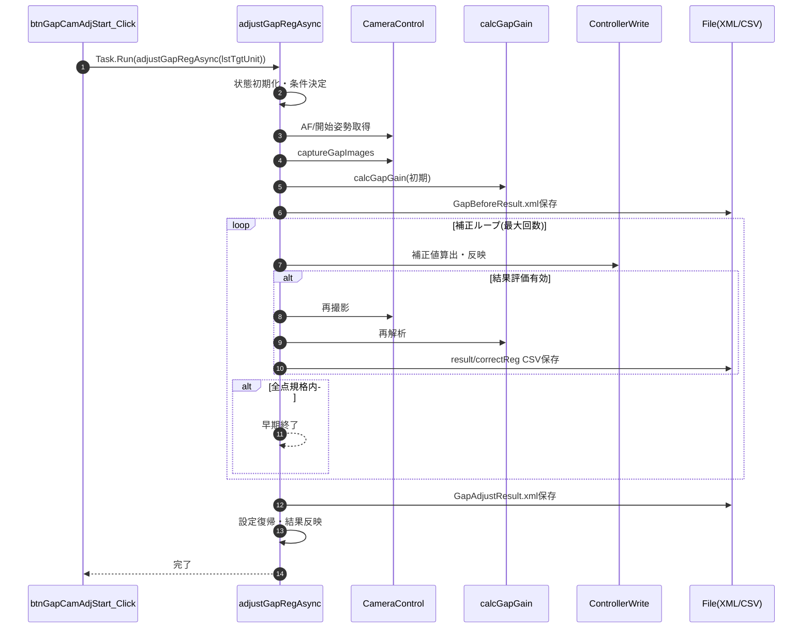

#### 8-2-3. romSaveAsync

| 項目 | 内容 |
|------|------|
| シグネチャ | `private void romSaveAsync(List<UnitInfo> lstTgtUnit)` |
| 概要 | 補正値のROM書込みを実行する |

引数

| No. | 引数名 | 型 | 必須 | 説明 |
|-----|--------|----|------|------|
| 1 | lstTgtUnit | List<UnitInfo> | Y | 書込み対象Cabinet一覧 |

返り値: なし（void）

処理概要（詳細）

| 手順No. | 処理内容 | 詳細 |
|---------|----------|------|
| 1 | 開始ログ出力 | `saveLog("Start ROM writing.")` を出力する。 |
| 2 | ROM書込み実行 | `writeGapCellCorrectionValueWithReconfig()` でPanel OFF→Write→Reconfig→Panel ONを実施する。 |
| 3 | 信号表示復帰 | `outputIntSigFlat` と `cmbxPatternGapCam` 更新で表示状態を補正後基準へ戻す。 |
| 4 | 終了ログ出力 | `saveLog("Finish ROM writing.")` を出力する。 |

入力条件・前提条件

| 区分 | 条件 | NG時挙動 |
|------|------|----------|
| 書込み対象 | `lstModifiedUnits` へ対象Unitが格納済みであること | Write実施数が不足し、結果不整合の可能性 |
| 通信環境 | SDCP通信とReconfig実行が可能であること | 例外送出で呼出元へ失敗通知 |

主要状態更新

| 状態変数 | 更新内容 | 更新タイミング |
|----------|----------|----------------|
| `winProgress` | 書込み進捗表示を更新 | `writeGapCellCorrectionValueWithReconfig` 内 |
| `cmbxPatternGapCam.SelectedIndex` | 測定レベルに応じて更新 | 書込み後 |

主要呼出し先

| 呼出し先 | 役割 | 同期/非同期 |
|----------|------|--------------|
| `writeGapCellCorrectionValueWithReconfig` | 実ROM書込み（Write+Reconfig） | 同期 |
| `outputIntSigFlat` | 補正後表示信号へ復帰 | 同期 |

例外時仕様

| ケース | 捕捉方法 | 通知/伝播 | 後処理 |
|--------|----------|-----------|--------|
| Write/Reconfig失敗 | 下位処理 `Exception` | 呼出元へ再送出 | 呼出元で失敗表示・UI復帰 |

シーケンス図

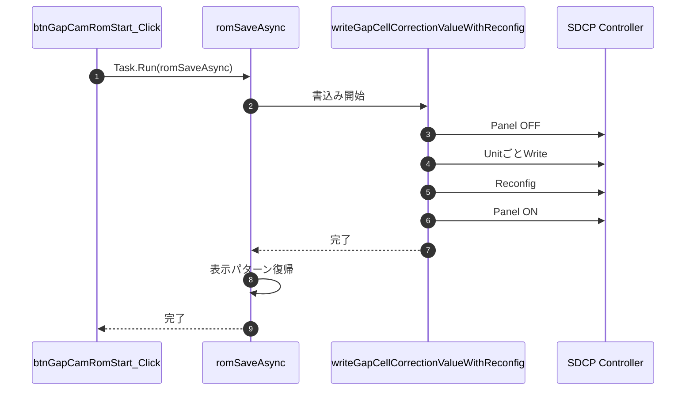

#### 8-2-4. backupGapRegAsync

| 項目 | 内容 |
|------|------|
| シグネチャ | `unsafe private void backupGapRegAsync(string path)` |
| 概要 | 補正値をXMLへバックアップする |

引数

| No. | 引数名 | 型 | 必須 | 説明 |
|-----|--------|----|------|------|
| 1 | path | string | Y | 保存先XMLパス |

返り値: なし（void）

処理概要（詳細）

| 手順No. | 処理内容 | 詳細 |
|---------|----------|------|
| 1 | 出力リスト初期化 | `List<GapCamCorrectionValue>` を初期化する。 |
| 2 | Step数設定 | LEDモデルに応じて進捗Stepを算出し、`winProgress.SetWholeSteps(step)` を設定する。 |
| 3 | モデル依存寸法設定 | Cabinet/Module寸法とモジュール数をモデル別に決定する。 |
| 4 | Unit走査 | 全Unitを走査し、有効Unitごとに `GapCamCorrectionValue` を生成する。 |
| 5 | 補正値読出し | Cabinet補正値（条件付き）と全Module補正値を `getGapCvUnit` / `getGapCvCell` で取得する。 |
| 6 | XML保存 | `GapCamCorrectionValue.SaveToXmlFile(path, lstGapCv)` で永続化する。 |

入力条件・前提条件

| 区分 | 条件 | NG時挙動 |
|------|------|----------|
| 保存先 | `path` が有効な保存可能パスであること | 例外送出で呼出元へ失敗通知 |
| 通信環境 | SDCP読出しコマンドが利用可能であること | 例外または不完全値でバックアップ失敗 |

主要状態更新

| 状態変数 | 更新内容 | 更新タイミング |
|----------|----------|----------------|
| `m_ModuleXNum` / `m_ModuleYNum` | モジュール構成数を設定 | モデル依存寸法設定時 |
| `winProgress` | 読出し進捗を更新 | Unit/Module読出し時 |

主要呼出し先

| 呼出し先 | 役割 | 同期/非同期 |
|----------|------|--------------|
| `getGapCvUnit` | Cabinet補正値取得 | 同期 |
| `getGapCvCell` | Module補正値取得 | 同期 |
| `GapCamCorrectionValue.SaveToXmlFile` | XML保存 | 同期 |

条件分岐仕様

| 条件 | 挙動 |
|------|------|
| `No_CabinetCorrectionValue` | Cabinet補正値取得をスキップする。 |
| LEDモデル種別 | Step数およびモジュール構成数を切替える。 |

例外時仕様

| ケース | 捕捉方法 | 通知/伝播 | 後処理 |
|--------|----------|-----------|--------|
| SDCP読出し失敗 | 下位処理 `Exception` | 呼出元へ再送出 | 呼出元でエラー通知 |
| XML保存失敗 | ファイルI/O例外 | 呼出元へ再送出 | 部分データは破棄 |

シーケンス図

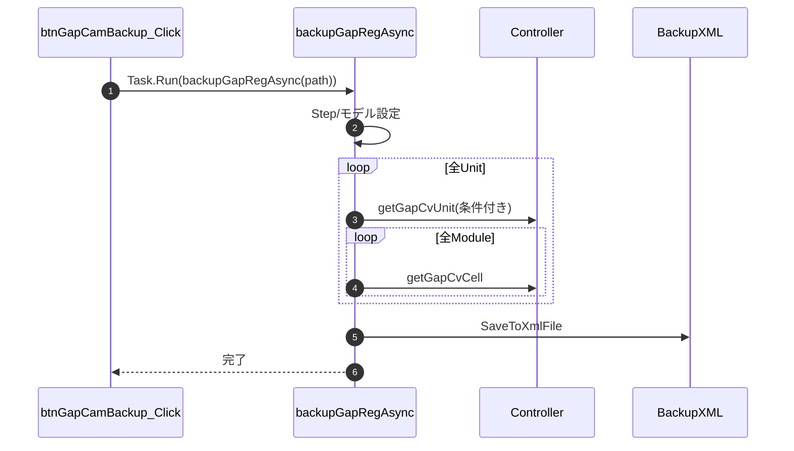

#### 8-2-5. restoreGapRegAsync

| 項目 | 内容 |
|------|------|
| シグネチャ | `private void restoreGapRegAsync(string path)` |
| 概要 | XML補正値を復元（通常設定）する |

引数

| No. | 引数名 | 型 | 必須 | 説明 |
|-----|--------|----|------|------|
| 1 | path | string | Y | 読込元XMLパス |

返り値: なし（void）

処理概要（詳細）

| 手順No. | 処理内容 | 詳細 |
|---------|----------|------|
| 1 | XML読込 | `GapCamCorrectionValue.LoadFromXmlFile(path, out lstGapCv)` を実行する。 |
| 2 | Step数設定 | `countUnits()*13` で進捗Stepを設定する。 |
| 3 | Unit反映 | Unit補正値（条件付き）と全Module補正値を `setGapCvUnit` / `setGapCvCell` で反映する。 |
| 4 | 変更Unit記録 | 書込み対象を `lstModifiedUnits` へ蓄積する。 |
| 5 | 書込み確定 | `writeGapCellCorrectionValueWithReconfig()` を実行してWrite/Reconfigを確定する。 |

入力条件・前提条件

| 区分 | 条件 | NG時挙動 |
|------|------|----------|
| 入力ファイル | `path` に有効なGap補正XMLが存在すること | 読込例外で処理中断 |
| 通信環境 | SDCP設定・Write/Reconfigが可能であること | 例外送出で呼出元へ失敗通知 |

主要状態更新

| 状態変数 | 更新内容 | 更新タイミング |
|----------|----------|----------------|
| `lstModifiedUnits` | 書込み対象Unit一覧を保持 | Unit反映時 |
| `winProgress` | 復元進捗を更新 | Unit/Module反映時 |

主要呼出し先

| 呼出し先 | 役割 | 同期/非同期 |
|----------|------|--------------|
| `LoadFromXmlFile` | 補正値読込 | 同期 |
| `setGapCvUnit` / `setGapCvCell` | Unit/Module補正値設定 | 同期 |
| `writeGapCellCorrectionValueWithReconfig` | 書込み確定 | 同期 |

条件分岐仕様

| 条件 | 挙動 |
|------|------|
| `No_CabinetCorrectionValue` | Unit補正値設定をスキップし、Cellのみ復元する。 |

例外時仕様

| ケース | 捕捉方法 | 通知/伝播 | 後処理 |
|--------|----------|-----------|--------|
| XML読込失敗 | `LoadFromXmlFile` 例外 | 呼出元へ再送出 | 処理中断 |
| 設定/書込み失敗 | SDCP関連例外 | 呼出元へ再送出 | 一部反映の可能性あり |

シーケンス図

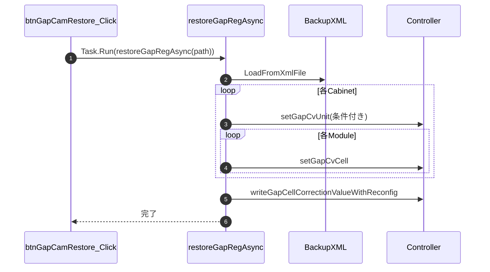

#### 8-2-6. restoreBulkGapRegAsync

| 項目 | 内容 |
|------|------|
| シグネチャ | `private void restoreBulkGapRegAsync(string path)` |
| 概要 | XML補正値を復元（一括設定）する |

引数

| No. | 引数名 | 型 | 必須 | 説明 |
|-----|--------|----|------|------|
| 1 | path | string | Y | 読込元XMLパス |

返り値: なし（void）

処理概要（詳細）

| 手順No. | 処理内容 | 詳細 |
|---------|----------|------|
| 1 | XML読込 | `GapCamCorrectionValue.LoadFromXmlFile(path, out lstGapCv)` を実行する。 |
| 2 | Step数設定 | LEDモデルに応じたStep数を設定する（8または12系）。 |
| 3 | 一括復元 | Unit補正値（条件付き）と全Module補正値を `setGapCvCellBulk` で反映する。 |
| 4 | 変更Unit記録 | `lstModifiedUnits` へ対象Unitを蓄積する。 |
| 5 | 書込み確定 | `writeGapCellCorrectionValueWithReconfig()` を実行して確定する。 |

入力条件・前提条件

| 区分 | 条件 | NG時挙動 |
|------|------|----------|
| 入力ファイル | `path` に有効なGap補正XMLが存在すること | 読込例外で処理中断 |
| 通信環境 | Bulk設定コマンドおよびWrite/Reconfigが可能であること | 例外送出で呼出元へ失敗通知 |

主要状態更新

| 状態変数 | 更新内容 | 更新タイミング |
|----------|----------|----------------|
| `lstModifiedUnits` | 書込み対象Unit一覧を保持 | Unit反映時 |
| `winProgress` | 一括復元進捗を更新 | Module反映時 |

主要呼出し先

| 呼出し先 | 役割 | 同期/非同期 |
|----------|------|--------------|
| `LoadFromXmlFile` | 補正値読込 | 同期 |
| `setGapCvCellBulk` | Module補正値一括設定 | 同期 |
| `writeGapCellCorrectionValueWithReconfig` | 書込み確定 | 同期 |

条件分岐仕様

| 条件 | 挙動 |
|------|------|
| `No_CabinetCorrectionValue` | Unit補正値設定をスキップする。 |
| LEDモデル種別 | Step数計算とモジュール想定を切替える。 |

例外時仕様

| ケース | 捕捉方法 | 通知/伝播 | 後処理 |
|--------|----------|-----------|--------|
| XML読込失敗 | `LoadFromXmlFile` 例外 | 呼出元へ再送出 | 処理中断 |
| 一括設定/書込み失敗 | SDCP関連例外 | 呼出元へ再送出 | 一部反映の可能性あり |

シーケンス図

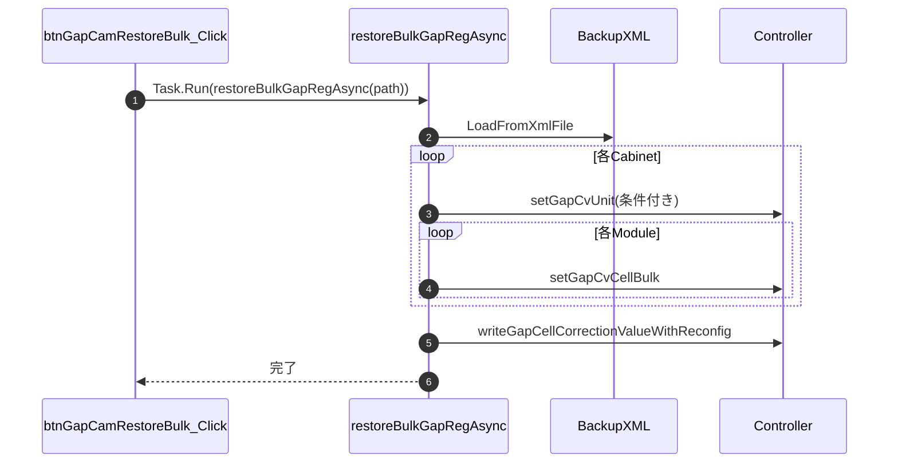

#### 8-2-7. captureGapImages

| 項目 | 内容 |
|------|------|
| シグネチャ | `unsafe private void captureGapImages(string measPath)` |
| 概要 | Gap計測用の撮影シーケンスを実行し、解析用画像群を保存する |
| カメラ設定条件 | 実際の設定値は `Settings.Ins.GapCam.SettingA6400` の内容が反映される。<br>（例：<br>・F値（FNumber）：（例）F11<br>・シャッタースピード（Shutter）：（例）1/8秒<br>・ISO感度（ISO）：（例）100<br>・ホワイトバランス（WB）：（例）6500K<br>・画像サイズ（ImageSize）：（例）1（Lサイズ）<br>・圧縮形式（CompressionType）：（例）16（RAW）<br>）<br>※実際の値は運用時の設定ファイルまたは現場指示に従う。<br>（設定はSetCameraSettings/ShootCondition経由でCameraControlへ反映。F値・シャッタースピードは段階的に変更し安定化を図る。詳細はCameraControl設計書4-1-3参照） |

引数

| No. | 引数名 | 型 | 必須 | 説明 |
|-----|--------|----|------|------|
| 1 | measPath | string | Y | 画像保存先ディレクトリパス |

返り値: なし（void）

責務分担（パターン表示と撮影）

| 項目 | 内容 |
|------|------|
| 本メソッドの責務 | 内蔵パターン表示（`outputIntSig*`、`outputGapCamTargetArea*`）、表示後待機、撮影シーケンス制御 |
| `CaptureImage` の責務 | 撮影要求投入、保存完了待機、再試行（再接続） |
| 呼出し順序 | 「パターン表示」→「`Thread.Sleep(PatternWait)`」→「`CaptureImage(...)`」 |
| 備考 | パターン表示は撮影直前に都度実行し、画像ごとに表示条件を切り替える |

処理概要（詳細）

| 手順No. | 処理内容 | 詳細 |
|---------|----------|------|
| 1 | 対象Cabinet再取得 | `CheckSelectedUnits` をDispatcher経由で実行し、対象矩形を確定する。 |
| 2 | 初期状態調整 | `MultiController` 条件時は半分タイル用フラグ（`m_bottomHalfTile`、`m_rightHalfTile`）を初期化する。 |
| 3 | 映り込み事前検査 | 計測/補正前状態では `CheckLightingReflection` を実行し、照明反射リスクを確認する。 |
| 4 | 黒画像取得 | 全黒信号を出力して `Black` 系画像を撮影し、ARW読込後にMAT形式で保存する。 |
| 5 | フラット画像取得 | 対象領域出力後に `Flat` 画像を撮影し、MAT形式へ変換保存する。 |
| 6 | 白画像取得 | 全白（または対象白）を撮影し、`WhiteBefore`/`WhiteMeasure` を状態別に保存する。 |
| 7 | 対象エリア画像取得 | `MultiController` ではTop/Rightを分離、単一系ではArea画像を取得して保存する。 |
| 8 | モアレ検査画像取得 | モアレ領域特定用画像と確認画像を撮影し、`checkMoire` で判定する。 |
| 9 | Trimming画像取得 | `captureGapTrimmingAreaImage(measPath)` を呼び出してTop/Right分割領域画像を取得する。 |
| 10 | Gapスイング撮影 | `captureGapFlatImageSwing(measPath, lstTgtUnit)` を実行し、複数信号レベルのGap画像群を保存する。 |
| 11 | 出力復帰 | 処理終端で対象エリア信号を復帰出力し、次工程の解析入力状態を整える。 |

入力条件・前提条件

| 区分 | 条件 | NG時挙動 |
|------|------|----------|
| 保存先 | `measPath` が有効で書込み可能であること | ファイル保存例外で処理中断 |
| 対象選択 | Gap対象Cabinetが矩形選択されていること | `CheckSelectedUnits` 例外を上位へ送出 |
| カメラ制御 | `CaptureImage`、ARW読込、MAT保存が利用可能であること | 例外送出で処理中断 |
| 信号制御 | 内部信号出力コマンドが利用可能であること | 例外送出または画像不足で後続失敗 |

主要状態更新

| 状態変数 | 更新内容 | 更新タイミング |
|----------|----------|----------------|
| `m_bottomHalfTile` / `m_rightHalfTile` | 複数コントローラ境界用フラグ初期化/利用 | 処理開始時〜Trimming撮影時 |
| `TrimAreaTopPos` / `TrimAreaRightPos` | Trimming中心位置を計算・保持 | `captureGapTrimmingAreaImage` 実行時 |
| `winProgress` | 進捗メッセージ・ステップ更新 | 各撮影ステップ |

主要呼出し先

| 呼出し先 | 役割 | 同期/非同期 |
|----------|------|--------------|
| `CheckSelectedUnits` | 対象Cabinet妥当性確認 | 同期 |
| `CheckLightingReflection` | 映り込み検査 | 同期 |
| `CaptureImage` | ARW撮影 | 同期 |
| `loadArwFile` / `SaveMatBinary` | ARW読込・MAT保存 | 同期 |
| `calcMoireCheckArea` / `checkMoire` | モアレ領域計算・判定 | 同期 |
| `captureGapTrimmingAreaImage` | Trimming画像撮影 | 同期 |
| `captureGapFlatImageSwing` | Gapスイング画像撮影 | 同期 |

条件分岐仕様

| 条件 | 挙動 |
|------|------|
| `NO_CONTROLLER` | 信号出力系をスキップし、撮影/保存中心で進行する。 |
| `NO_CAP` | 実カメラ撮影をスキップし、既存ファイル前提で進行する。 |
| `MultiController` | Top/Right分離撮影、半分タイル撮影、境界拡張ロジックを有効化する。 |
| `Reflection` | 黒画像の複数枚撮影と反射考慮ロジックを有効化する。 |
| `CorrectTargetEdge` | 対象エッジ拡張出力を利用する。 |

例外時仕様（中断含む）

| ケース | 捕捉方法 | 通知/伝播 | 後処理 |
|--------|----------|-----------|--------|
| ARW保存未完了 | `checkFileSize` 判定 | `Exception` を上位へ送出 | 当該ステップで中断 |
| ARW読込失敗 | `loadArwFile` 例外 | 一部箇所は再試行後、それでも失敗時は送出 | 処理中断 |
| ユーザー中断 | `CameraCasUserAbortException` | 上位へ再送出 | 呼出元で中断通知 |
| 対象選択不正 | `CheckSelectedUnits` 例外 | 上位へ再送出 | 呼出元で失敗処理 |

シーケンス図

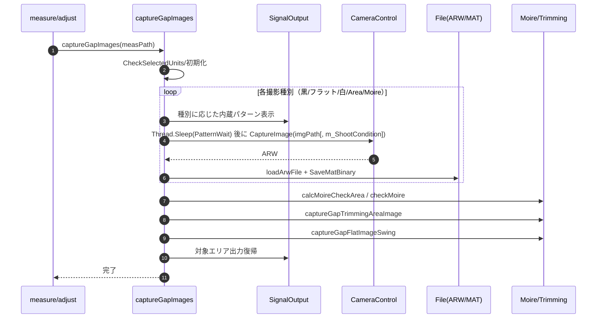

#### 8-2-8. CaptureImage

| 項目 | 内容 |
|------|------|
| シグネチャ | `private void CaptureImage(string imgPath)` / `private void CaptureImage(string imgPath, ShootCondition condition)` |
| 概要 | カメラ制御プロセスへ撮影要求を渡し、画像保存完了まで待機する共通撮影メソッド |

責務境界（内蔵パターン表示）

| 項目 | 内容 |
|------|------|
| 本メソッドの責務 | 撮影要求の投入、完了待機、再試行（再接続） |
| 呼出側の責務 | 内蔵パターン表示（`outputIntSig*`、`outputGapCamTargetArea*`）と表示後の待機 |
| 代表呼出元 | `captureGapImages`、`captureGapTrimmingAreaImage`、`captureGapFlatImageSwing` |
| 備考 | 実装上、`CaptureImage` 内ではパターン出力APIを呼び出していない |

引数

| No. | 引数名 | 型 | 必須 | 説明 |
|-----|--------|----|------|------|
| 1 | imgPath | string | Y | 保存先の拡張子なしファイルパス |
| 2 | condition | ShootCondition | N | 撮影条件（F値、SS、ISO等）。指定時はこの条件で撮影 |

返り値: なし（void）

処理概要（詳細）

| 手順No. | 処理内容 | 詳細 |
|---------|----------|------|
| 1 | 中断チェック | `CheckUserAbort()` を実行し、ユーザー中断要求があれば例外で終了する。 |
| 2 | 旧ファイル削除 | `imgPath + .arw/.jpg` が存在する場合は削除し、待機判定の誤検知を防ぐ。 |
| 3 | 制御プロセス確認 | `StartCameraController()` で `AlphaCameraController` 起動状態を保証する。 |
| 4 | 撮影指示データ作成 | `CameraControlData` を構成し、`ImgPath`、`ShootFlag=true`、`LiveViewFlag=0` を設定する。 |
| 5 | 条件設定分岐 | 引数なし版は既存 `CamCont.xml` から前回条件を読込、引数あり版は `condition` を明示設定する。 |
| 6 | 指示保存 | `CameraControlData.SaveToXmlFile(CamContFile, cont)` で撮影要求を永続化する。 |
| 7 | 撮影完了待機 | `Wait4Capturing(imgPath)` で完了待ちを行う。失敗時は再接続後に1回再試行する。 |
| 8 | 完了処理 | シャッター音再生後、`CameraWait` 分だけ待機し、次撮影に備える。 |

入力条件・前提条件

| 区分 | 条件 | NG時挙動 |
|------|------|----------|
| 保存先 | `imgPath` の親ディレクトリに書込み可能であること | 保存/待機失敗として例外またはreturn |
| 制御ファイル | `CamContFile` へ読み書き可能であること | XMLアクセス失敗時はreturn |
| カメラ状態 | カメラ接続・制御プロセスが利用可能であること | 再接続を試み、失敗時は例外送出 |
| 撮影条件 | 引数あり版では `condition` が妥当であること | 不正値時はカメラ制御側で失敗 |

主要状態更新

| 状態変数 | 更新内容 | 更新タイミング |
|----------|----------|----------------|
| `CamContFile` | 撮影要求（条件/保存先/フラグ）を保存 | 手順6 |
| 画像ファイル（`.arw`/`.jpg`） | 既存削除後に新規出力 | 手順2〜7 |
| カメラ接続状態 | 待機失敗時に `DisconnectCamera`→`ConnectCamera` で再確立 | 手順7（例外時） |

主要呼出し先

| 呼出し先 | 役割 | 同期/非同期 |
|----------|------|--------------|
| `CheckUserAbort` | ユーザー中断要求の検出 | 同期 |
| `StartCameraController` | 撮影制御プロセス起動確認 | 同期 |
| `CameraControlData.LoadFromXmlFile` | 既存撮影条件の読込（引数なし版） | 同期 |
| `CameraControlData.SaveToXmlFile` | 撮影要求保存 | 同期 |
| `Wait4Capturing` | 撮影完了待機 | 同期 |
| `DisconnectCamera` / `ConnectCamera` | 失敗時の再接続 | 同期 |

条件分岐仕様

| 条件 | 挙動 |
|------|------|
| `CaptureImage(imgPath)` | 既存の撮影条件を引き継いで撮影する。 |
| `CaptureImage(imgPath, condition)` | 呼出し時に指定された条件で撮影する。 |
| `CamContFile` 読込不可（引数なし版） | `catch { return; }` で処理終了する。 |
| `Wait4Capturing` 失敗 | カメラ再接続後に同一要求を再送し、再待機する。 |

例外時仕様（中断含む）

| ケース | 捕捉方法 | 通知/伝播 | 後処理 |
|--------|----------|-----------|--------|
| ユーザー中断 | `CheckUserAbort` 例外 | 呼出元へ伝播 | 以降撮影を中断 |
| 制御XML書込失敗 | `SaveToXmlFile` 例外 | 当該メソッド内で `return` | 無音で終了 |
| 撮影待機失敗 | `Wait4Capturing` 例外 | 再接続後に再試行、再失敗時は例外伝播 | 接続再初期化 |
| 旧ファイル削除失敗 | `File.Delete` 例外（環境依存） | 呼出元へ例外伝播 | 処理中断 |

シーケンス図

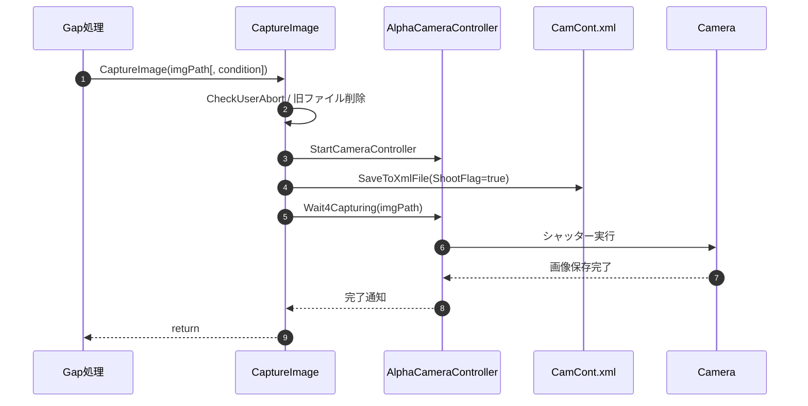

#### 8-2-9. captureGapTrimmingAreaImage

| 項目 | 内容 |
|------|------|
| シグネチャ | `unsafe private void captureGapTrimmingAreaImage(string measPath)` |
| 概要 | Gap補正点抽出用のGapPos/Top/Right画像群を撮影し、Trimming中心座標を更新する |

引数

| No. | 引数名 | 型 | 必須 | 説明 |
|-----|--------|----|------|------|
| 1 | measPath | string | Y | Trimming系画像の保存先ディレクトリパス |

返り値: なし（void）

責務分担（パターン表示と撮影）

| 項目 | 内容 |
|------|------|
| 本メソッドの責務 | Trimmingパターン表示、撮影シーケンス制御、MAT保存、中心位置配列更新 |
| `CaptureImage` の責務 | 撮影要求投入、保存完了待機、再試行（再接続） |
| 呼出し順序 | 「パターン表示」→「`Thread.Sleep(PatternWait)`」→「`CaptureImage(...)`」 |

処理概要（詳細）

| 手順No. | 処理内容 | 詳細 |
|---------|----------|------|
| 1 | 初期パターン表示 | Cell位置抽出用に `outputIntSigHatchInv` を表示し、`PatternWait` 待機する。 |
| 2 | GapPos画像取得 | `CaptureNum` 回ループで `GapPos{n}` を撮影し、ARW読込後にMAT保存する。 |
| 3 | Top/Bottom走査条件算出 | `TrimAreaNum` と `TrimmingOffset/Size` から `step` を算出し、`TrimAreaTopPos` 配列を準備する。 |
| 4 | Top画像群取得 | 各 `n` でTop/Bottomパターン表示後に `Top{n}` を撮影・保存し、中心座標を `TrimAreaTopPos[n]` へ反映する。 |
| 5 | Top HalfTile取得 | `MultiController && m_bottomHalfTile` の場合は `Top{n}_Half` も追加撮影・保存する。 |
| 6 | Right/Left走査条件算出 | 高さ方向 `step` を再算出し、`TrimAreaRightPos` 配列を準備する。 |
| 7 | Right画像群取得 | 各 `n` でRight/Leftパターン表示後に `Right{n}` を撮影・保存し、中心座標を `TrimAreaRightPos[n]` へ反映する。 |
| 8 | Right HalfTile取得 | `MultiController && m_rightHalfTile` の場合は `Right{n}_Half` も追加撮影・保存する。 |

入力条件・前提条件

| 区分 | 条件 | NG時挙動 |
|------|------|----------|
| 保存先 | `measPath` が有効で書込み可能であること | 保存失敗例外で中断 |
| カメラ制御 | `CaptureImage` / ARW読込 / MAT保存が利用可能であること | 例外送出で中断 |
| 設定値 | `TrimmingOffset`、`TrimmingSize`、`TrimAreaNum` が妥当であること | タイル縮退・座標不整合の可能性 |
| 表示制御 | パターン出力APIが利用可能であること | 後続撮影品質低下または失敗 |

主要状態更新

| 状態変数 | 更新内容 | 更新タイミング |
|----------|----------|----------------|
| `TrimAreaTopPos` | Top系列の中心座標を格納 | 手順4 |
| `TrimAreaRightPos` | Right系列の中心座標を格納 | 手順7 |
| `winProgress` | GapPos/Top/Rightの進捗を更新 | 各撮影ステップ |

条件分岐仕様

| 条件 | 挙動 |
|------|------|
| `NO_CONTROLLER` | パターン出力をスキップし、撮影/保存中心で進行する。 |
| `NO_CAP` | 実撮影をスキップし、既存ファイル前提で進行する。 |
| `OutputOnlyGreen` | R/Bを0にした緑系パターンで表示する。 |
| `MultiController` | `Top/Right` のHalfTile撮影分岐を有効化する。 |
| `Coverity` | `step` 計算時にfloat経由の安全側キャストを行う。 |

主要呼出し先

| 呼出し先 | 役割 | 同期/非同期 |
|----------|------|--------------|
| `outputIntSigHatchInv` / `outputIntSigHatch` | Trimming用パターン表示 | 同期 |
| `CaptureImage` | ARW撮影 | 同期 |
| `loadArwFile` / `SaveMatBinary` | ARW読込・MAT保存 | 同期 |
| `checkFileSize` | 保存完了判定 | 同期 |

例外時仕様（中断含む）

| ケース | 捕捉方法 | 通知/伝播 | 後処理 |
|--------|----------|-----------|--------|
| ARW保存未完了 | `checkFileSize` 判定 | `Exception` を上位へ送出 | 当該ステップで中断 |
| ARW読込失敗 | `loadArwFile` 例外 | 一部箇所は1秒待機後に再試行、失敗時は送出 | 処理中断 |
| MAT保存失敗 | `SaveMatBinary` 例外 | 1秒待機後に再試行、失敗時は送出 | 処理中断 |
| ユーザー中断 | `CameraCasUserAbortException` | 上位へ再送出 | 呼出元で中断通知 |

シーケンス図

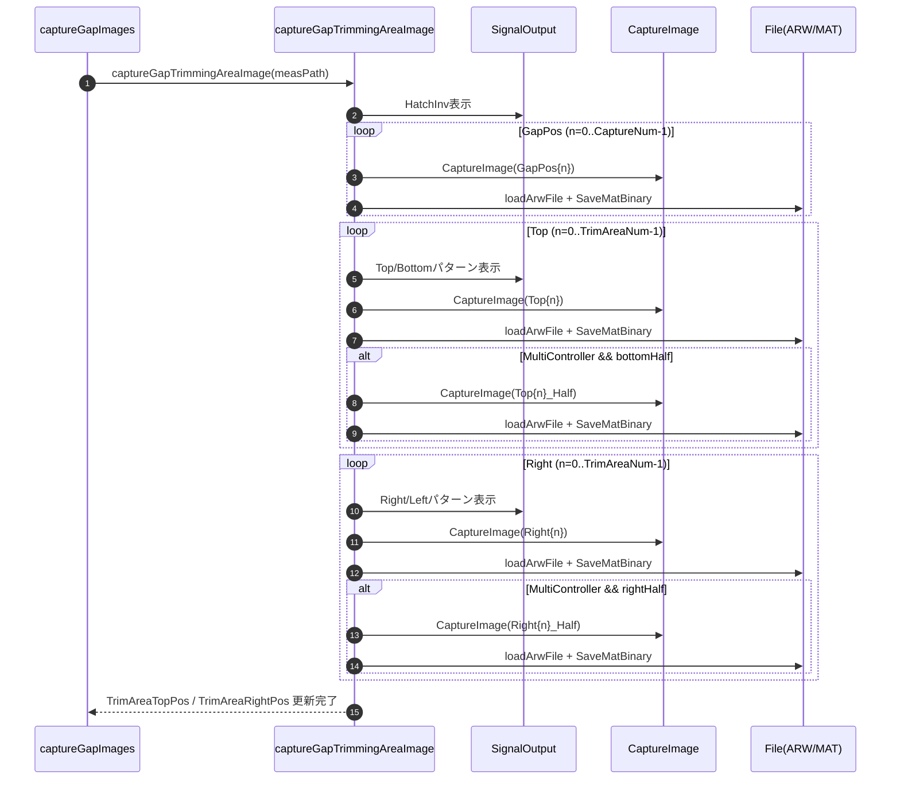

#### 8-2-10. captureGapFlatImageSwing

| 項目 | 内容 |
|------|------|
| シグネチャ | `unsafe private void captureGapFlatImageSwing(string measPath, List<UnitInfo> lstTgtUnit)` |
| 概要 | 複数信号レベルでGap画像群を撮影し、後段のゲイン推定用データを生成する |

引数

| No. | 引数名 | 型 | 必須 | 説明 |
|-----|--------|----|------|------|
| 1 | measPath | string | Y | Gapスイング画像の保存先ディレクトリパス |
| 2 | lstTgtUnit | List<UnitInfo> | Y | 対象Cabinet一覧（パターン表示範囲決定に使用） |

返り値: なし（void）

責務分担（パターン表示と撮影）

| 項目 | 内容 |
|------|------|
| 本メソッドの責務 | 信号レベル列生成、FlatGapパターン表示、レベル別画像撮影制御、MAT保存 |
| `CaptureImage` の責務 | 撮影要求投入、保存完了待機、再試行（再接続） |
| 呼出し順序 | 「（必要時）黒表示撮影」→「FlatGap表示」→「`Thread.Sleep(PatternWait)`」→「`CaptureImage(...)`」 |

処理概要（詳細）

| 手順No. | 処理内容 | 詳細 |
|---------|----------|------|
| 1 | レベル比率決定 | `m_GapStatus` に応じて比率配列を選択する（Before/Measure: 0.80〜1.20、その他: 0.96〜1.04）。 |
| 2 | 信号レベル生成 | `m_MeasureLevel` をガンマ空間で換算し、比率適用後に `gapLevel[]` を算出する。 |
| 3 | レベル単位進捗更新 | 各 `gapLevel[n]` ごとに進捗メッセージ更新とログ出力を行う。 |
| 4 | 反射用黒撮影（条件付き） | `Reflection` 有効時は各レベルごとに全黒表示で `CaptureNum` 回撮影し、`*_Black_*` を保存する。 |
| 5 | FlatGap表示 | `outputIntSigFlatGap` で対象領域のGap信号を表示し、`PatternWait` 待機する。 |
| 6 | Gap画像撮影 | 各レベルで `CaptureNum` 回撮影し、`GapBefore_*` / `GapResult_*` / `GapMeasure_*` を状態別命名で保存する。 |
| 7 | ARW→MAT変換 | 各撮影ファイルについて保存完了確認、ARW読込、1ch MAT変換、`SaveMatBinary` を実施する。 |

入力条件・前提条件

| 区分 | 条件 | NG時挙動 |
|------|------|----------|
| 保存先 | `measPath` が有効で書込み可能であること | 保存失敗例外で中断 |
| 状態値 | `m_GapStatus` が Before/Result/Measure 等の想定値であること | ファイル命名が不定になる可能性 |
| カメラ制御 | `CaptureImage` / ARW読込 / MAT保存が利用可能であること | 例外送出で中断 |
| 測定設定 | `m_MeasureLevel` が有効範囲内であること | レベル算出・露光結果が不正化 |

主要状態更新

| 状態変数 | 更新内容 | 更新タイミング |
|----------|----------|----------------|
| `winProgress` | レベル単位の進捗更新 | 手順3 |
| 出力ファイル群 | `Gap*_{level}_{cap}` と `*_Black_*` を生成 | 手順4/6 |
| MATファイル群 | ARWを変換した解析入力ファイルを生成 | 手順7 |

条件分岐仕様

| 条件 | 挙動 |
|------|------|
| `m_GapStatus == Before or Measure` | レベル比率を9点（5%刻み）で生成する。 |
| それ以外の状態 | レベル比率を5点（2%刻み）で生成する。 |
| `Reflection` | 各レベルで黒撮影ループ（`*_Black_*`）を追加実行する。 |
| `NO_CONTROLLER` | パターン表示をスキップし、撮影/保存中心で進行する。 |
| `NO_CAP` | 実撮影をスキップし、既存ファイル前提で進行する。 |
| `OutputOnlyGreen` | FlatGap表示時にG成分中心で出力する。 |

主要呼出し先

| 呼出し先 | 役割 | 同期/非同期 |
|----------|------|--------------|
| `outputIntSigFlat` | 反射判定用の全黒表示 | 同期 |
| `outputIntSigFlatGap` | レベル別Gapパターン表示 | 同期 |
| `CaptureImage` | ARW撮影 | 同期 |
| `checkFileSize` | 保存完了判定 | 同期 |
| `loadArwFile` / `SaveMatBinary` | ARW読込・MAT保存 | 同期 |

例外時仕様（中断含む）

| ケース | 捕捉方法 | 通知/伝播 | 後処理 |
|--------|----------|-----------|--------|
| ARW保存未完了 | `checkFileSize` 判定 | `Exception` を上位へ送出 | 当該レベルで中断 |
| ARW読込失敗 | `loadArwFile` 例外 | 一部箇所は1秒待機後に再試行、失敗時は送出 | 処理中断 |
| MAT保存失敗 | `SaveMatBinary` 例外 | 1秒待機後に再試行、失敗時は送出 | 処理中断 |
| ユーザー中断 | `CameraCasUserAbortException` | 上位へ再送出 | 呼出元で中断通知 |

シーケンス図

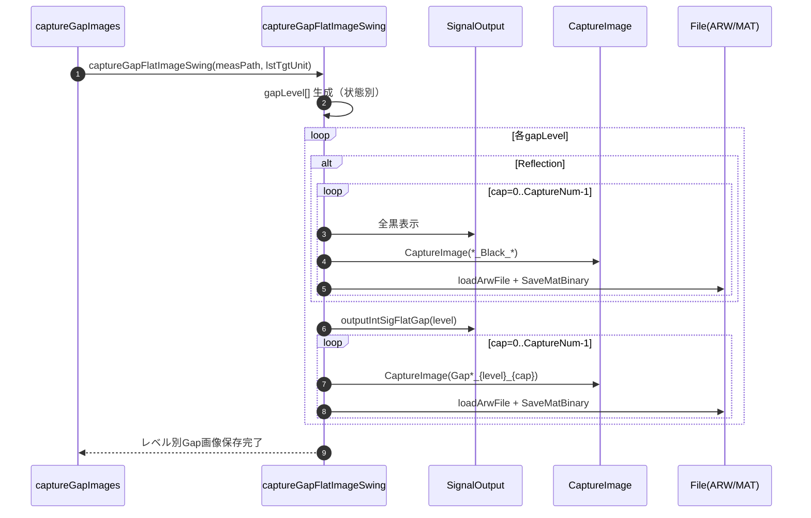

#### 8-2-11. GetCameraPosition

| 項目 | 内容 |
|------|------|
| シグネチャ | `private bool GetCameraPosition(System.Windows.Controls.Image img)` |
| 概要 | 計測開始前にカメラ姿勢を1回取得し、規格判定用の内部状態を更新する |

引数

| No. | 引数名 | 型 | 必須 | 説明 |
|-----|--------|----|------|------|
| 1 | img | System.Windows.Controls.Image | Y | 撮影画像や処理結果を表示するImageコントロール |

返り値: 姿勢取得結果（bool）

処理概要（詳細）

| 手順No. | 処理内容 | 詳細 |
|---------|----------|------|
| 1 | 作業パス初期化 | `black/raster/tile` の一時パスを設定し、`m_Enable_Capture_MaskImage = true` にする。 |
| 2 | 撮影/タイル検出 | `captureCamPos` と `detectTileCamPos(..., true)` を実行して姿勢推定用データを取得する。 |
| 3 | タイル整列 | `getTilePosition` で `m_CabinetXNum_CamPos*2` × `m_CabinetYNum_CamPos*2` の格子へ整列する。 |
| 4 | 姿勢反映 | `estimateCamPos`、`MoveCabinetPos`、`calc_Spec_by_Zdistance` を実行し、姿勢関連の内部値を更新する。 |
| 5 | 判定結果返却 | 規格判定に基づき `true/false` を返す。下位例外は上位へ送出する。 |

入力条件・前提条件

| 区分 | 条件 | NG時挙動 |
|------|------|----------|
| 表示先 | `img` が有効であること | 撮影処理または表示処理例外 |
| カメラ位置基準 | `SetCamPosTarget` 実行済みで、対象Cabinetと規格が設定済みであること | 判定不能または姿勢不適合 |
| 撮影環境 | タイル検出可能な画像が取得できること | 下位例外を上位へ送出 |

主要状態更新

| 状態変数 | 更新内容 | 更新タイミング |
|----------|----------|----------------|
| `m_CamPos_BlackImagePath` など | 一時画像パス | 手順1 |
| `m_Enable_Capture_MaskImage` | 強制再取得フラグ | 手順1 |
| `m_CamPos_*` | 姿勢・辺長・座標系関連値 | 手順4 |

条件分岐仕様

| 条件 | 挙動 |
|------|------|
| `NO_CAP` | 実撮影をスキップし既存ファイル前提で進行する。 |
| タイル整列失敗 | 例外を送出し、呼出元で再試行/失敗判断する。 |
| 規格判定NG | `false` を返し、呼出元に姿勢不適合を通知する。 |

主要呼出し先

| 呼出し先 | 役割 | 同期/非同期 |
|----------|------|--------------|
| `captureCamPos` | 姿勢推定用画像取得 | 同期 |
| `detectTileCamPos` | タイル領域抽出 | 同期 |
| `getTilePosition` | タイル整列 | 同期 |
| `estimateCamPos` | Pan/Tilt/Roll・XYZ推定 | 同期 |
| `MoveCabinetPos` / `calc_Spec_by_Zdistance` | Cabinet位置反映・規格再計算 | 同期 |

例外時仕様

| ケース | 捕捉方法 | 通知/伝播 | 後処理 |
|--------|----------|-----------|--------|
| 撮影失敗 | 下位 `Exception` | 上位へ再送出 | 呼出元で失敗処理 |
| タイル整列失敗 | 下位 `Exception` | 上位へ再送出 | 呼出元で再試行/中断判断 |

シーケンス図

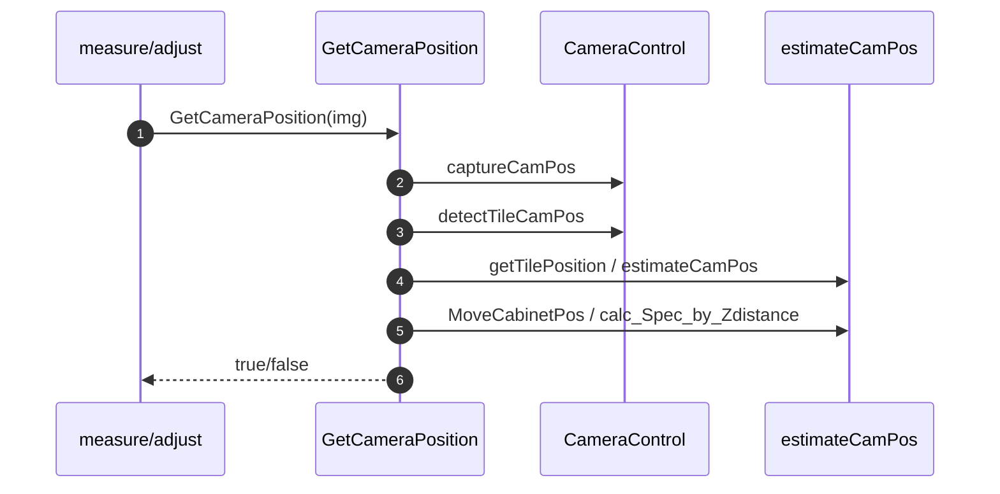

#### 8-2-12. SaveMatBinary

| 項目 | 内容 |
|------|------|
| シグネチャ | `unsafe bool SaveMatBinary(Mat mat, string filename)` |
| 概要 | OpenCV `Mat` を独自バイナリ形式で保存し、必要に応じて暗号化してARW元ファイルを削除する |

引数

| No. | 引数名 | 型 | 必須 | 説明 |
|-----|--------|----|------|------|
| 1 | mat | Mat | Y | 保存対象のOpenCV画像データ |
| 2 | filename | string | Y | 拡張子なしの保存先ベースパス |

返り値: 保存結果（bool）

処理概要（詳細）

| 手順No. | 処理内容 | 詳細 |
|---------|----------|------|
| 1 | 出力パス決定 | `filename` に `.matbin` を付与して保存先を決定する。 |
| 2 | 出力用Mat準備 | `Coverity` 有効時は `using`、無効時は通常生成で `destMat` を作成し、`mat.ConvertTo(destMat, mat.Type())` を実行する。 |
| 3 | ヘッダ書込 | `type`、`width`、`height`、`channels` を `BinaryWriter` で順に書き出す。 |
| 4 | 画素列書込 | 1行ずつ `Marshal.Copy` で `byte[]` へコピーし、行単位で順次出力する。 |
| 5 | 暗号化/平文削除 | `NoEncript` 無効時は `EncryptFile(filename, filename + "x", ...)` を実行し、平文 `.matbin` を削除する。 |
| 6 | 関連ファイル整理 | 同名 `.arw` が存在する場合は削除し、`true` を返す。 |

入力条件・前提条件

| 区分 | 条件 | NG時挙動 |
|------|------|----------|
| 入力画像 | `mat` が有効な `Mat` であること | 下位例外で保存失敗 |
| 保存先 | `filename` の親フォルダへ書込み可能であること | ファイル作成例外 |
| 暗号化設定 | `NoEncript` 無効時は暗号化キー/IVが有効であること | 暗号化例外 |

条件分岐仕様

| 条件 | 挙動 |
|------|------|
| `Coverity` | `destMat` を `using` スコープで扱い、明示 `Dispose` を省略する。 |
| `NoEncript` | 暗号化せず平文 `.matbin` を残す。 |
| 同名 `.arw` 存在 | `.matbin` 保存後に削除してストレージを整理する。 |

主要呼出し先

| 呼出し先 | 役割 | 同期/非同期 |
|----------|------|--------------|
| `Mat.ConvertTo` | 出力用 `Mat` へ型変換 | 同期 |
| `BinaryWriter` / `FileStream` | ヘッダ・画素データ書込 | 同期 |
| `Marshal.Copy` | 行単位のメモリコピー | 同期 |
| `EncryptFile` | 保存ファイルの暗号化 | 同期 |
| `File.Delete` | 平文 `.matbin` / 元 `.arw` の削除 | 同期 |

例外時仕様

| ケース | 捕捉方法 | 通知/伝播 | 後処理 |
|--------|----------|-----------|--------|
| ファイル作成失敗 | 下位 `Exception` | 呼出元へ再送出 | 保存中断 |
| 暗号化失敗 | 下位 `Exception` | 呼出元へ再送出 | 中間ファイルが残る可能性あり |

シーケンス図

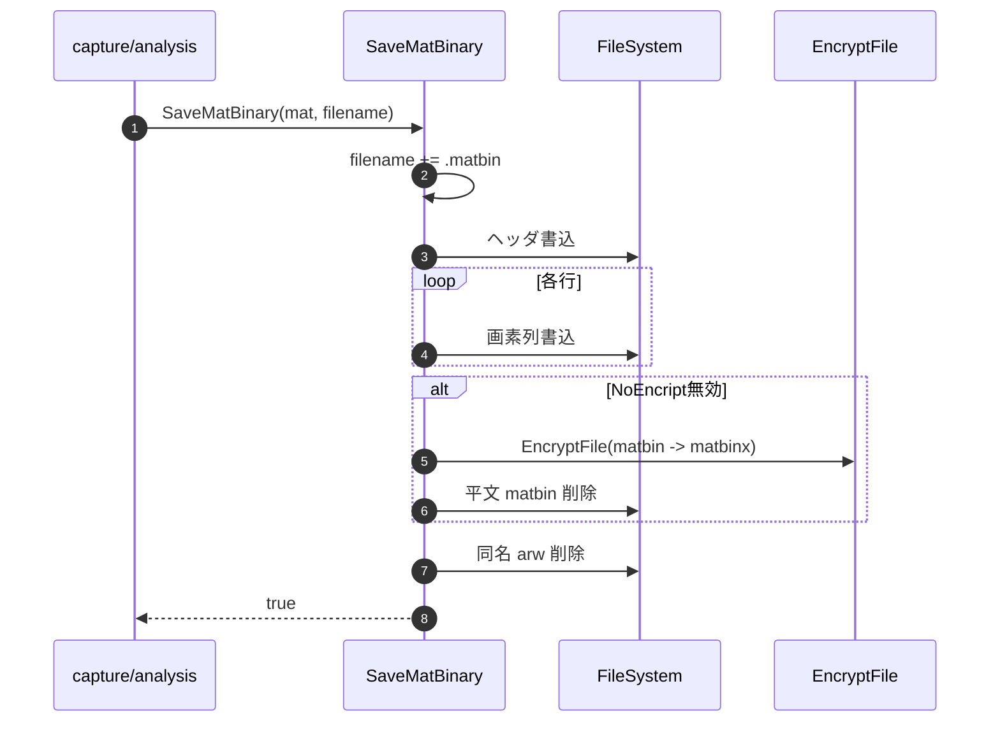

#### 8-2-13. LoadMatBinary

| 項目 | 内容 |
|------|------|
| シグネチャ | `unsafe bool LoadMatBinary(string filename, out Mat mat)` |
| 概要 | 独自バイナリ形式の `Mat` を復号・読込して OpenCV `Mat` を再構成する |

引数

| No. | 引数名 | 型 | 必須 | 説明 |
|-----|--------|----|------|------|
| 1 | filename | string | Y | 拡張子なしの入力ベースパス |
| 2 | mat(out) | Mat | Y | 復元後のOpenCV画像データ格納先 |

返り値: 読込結果（bool）

処理概要（詳細）

| 手順No. | 処理内容 | 詳細 |
|---------|----------|------|
| 1 | 中断確認 | 冒頭で `CheckUserAbort()` を呼び、ユーザー中断を確認する。 |
| 2 | 入力パス決定 | `filename` に `.matbin` を付与し、`NoEncript` 無効時は `.matbinx` から復号する。 |
| 3 | ヘッダ読込 | `type`、`width`、`height`、`channels` を順次読込み、出力 `Mat` を生成する。 |
| 4 | 画素列復元 | 1行ずつ `byte[]` を読込み、`Marshal.Copy` で `mat.Data` へコピーする。 |
| 5 | 後処理 | `NoEncript` 無効時は復号した平文 `.matbin` を削除し、`true` を返す。 |

入力条件・前提条件

| 区分 | 条件 | NG時挙動 |
|------|------|----------|
| 入力ファイル | `filename.matbin` または `filename.matbinx` が存在すること | FileOpen例外 |
| 中断状態 | ユーザー中断要求が未発生であること | `CameraCasUserAbortException` 等で中断 |
| ヘッダ整合性 | 先頭32byteが type/width/height/ch として読めること | `Mat` 生成失敗または復元不正 |

条件分岐仕様

| 条件 | 挙動 |
|------|------|
| `NoEncript` | 復号を行わず平文 `.matbin` を直接読込む。 |
| `NoEncript` 無効 | `.matbinx` を一時平文 `.matbin` へ復号してから読込む。 |
| ユーザー中断 | 冒頭 `CheckUserAbort()` で即時中断する。 |

主要呼出し先

| 呼出し先 | 役割 | 同期/非同期 |
|----------|------|--------------|
| `CheckUserAbort` | ユーザー中断確認 | 同期 |
| `DecryptFile` | 暗号化 `.matbinx` の復号 | 同期 |
| `FileStream` / `BitConverter.ToInt64` | ヘッダ情報読込 | 同期 |
| `Marshal.Copy` | 行単位の画素データ復元 | 同期 |
| `File.Delete` | 復号平文 `.matbin` の削除 | 同期 |

例外時仕様

| ケース | 捕捉方法 | 通知/伝播 | 後処理 |
|--------|----------|-----------|--------|
| ユーザー中断 | `CheckUserAbort` 例外 | 呼出元へ再送出 | 読込中断 |
| 復号失敗 | 下位 `Exception` | 呼出元へ再送出 | 平文ファイル未生成 |
| 読込失敗 | 下位 `Exception` | 呼出元へ再送出 | `mat` は未初期化または途中状態 |

シーケンス図

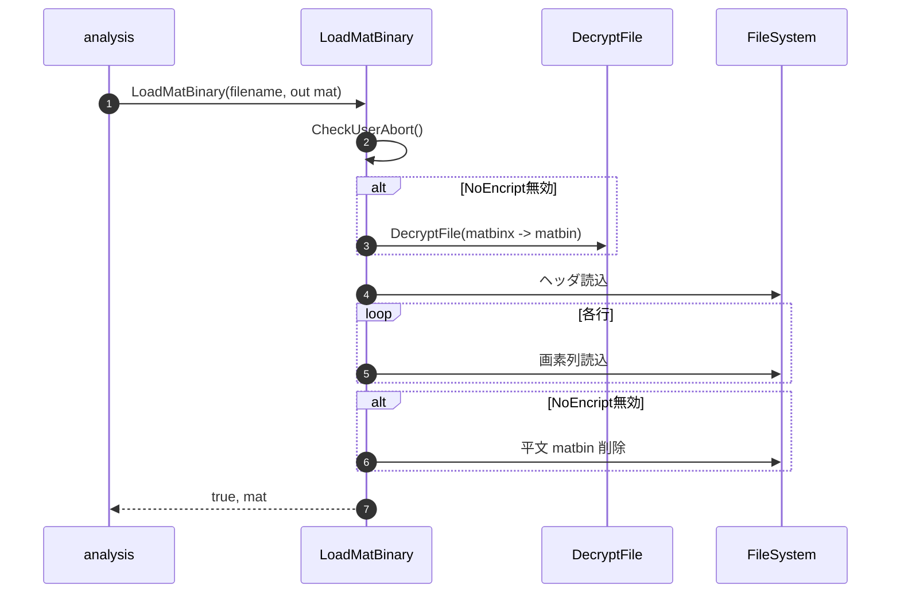

#### 8-2-14. checkFileSize

| 項目 | 内容 |
|------|------|
| シグネチャ | `bool checkFileSize(string path)` |
| 概要 | 画像保存ファイルのサイズ安定と排他オープン可否を確認し、保存完了を判定する |

引数

| No. | 引数名 | 型 | 必須 | 説明 |
|-----|--------|----|------|------|
| 1 | path | string | Y | 保存完了判定対象のファイルパス |

返り値: 判定結果（bool）

処理概要（詳細）

| 手順No. | 処理内容 | 詳細 |
|---------|----------|------|
| 1 | サイズ安定監視開始 | `Stopwatch` を起動し、対象ファイルのサイズを100ms間隔で2回取得する。 |
| 2 | サイズ変動判定 | サイズが一致すれば安定とみなし、10秒超過なら失敗として終了する。 |
| 3 | 排他オープン確認 | `FileShare.None` で `FileStream` を開けるかを繰返し確認する。 |
| 4 | タイムアウト判定 | 排他オープンが10秒以内に成功しなければ失敗とする。 |
| 5 | 結果返却 | サイズ安定かつ排他オープン成功時に `true` を返す。 |

入力条件・前提条件

| 区分 | 条件 | NG時挙動 |
|------|------|----------|
| 対象ファイル | `path` にファイルが生成済みであること | `FileInfo` / `FileStream` の下位例外または `false` |
| 監視時間 | 保存完了まで10秒以内であること | `false` を返却 |

条件分岐仕様

| 条件 | 挙動 |
|------|------|
| サイズ2回一致 | サイズ安定とみなし排他確認フェーズへ進む。 |
| サイズ未一致が10秒継続 | 監視失敗として `false` を返す。 |
| 排他オープン成功 | 保存完了とみなし `true` を返す。 |
| 排他オープン失敗が10秒継続 | 書込継続中またはロック中として `false` を返す。 |

主要呼出し先

| 呼出し先 | 役割 | 同期/非同期 |
|----------|------|--------------|
| `FileInfo.Length` | ファイルサイズ監視 | 同期 |
| `Stopwatch` | タイムアウト管理 | 同期 |
| `FileStream(path, ..., FileShare.None)` | 書込完了・排他解放確認 | 同期 |
| `Thread.Sleep` | 監視間隔待機 | 同期 |

例外時仕様

| ケース | 捕捉方法 | 通知/伝播 | 後処理 |
|--------|----------|-----------|--------|
| サイズ未安定 | タイムアウト判定 | 例外なし | `false` を返却 |
| 排他解放待ち超過 | `catch` + タイムアウト判定 | 例外なし | `false` を返却 |

シーケンス図

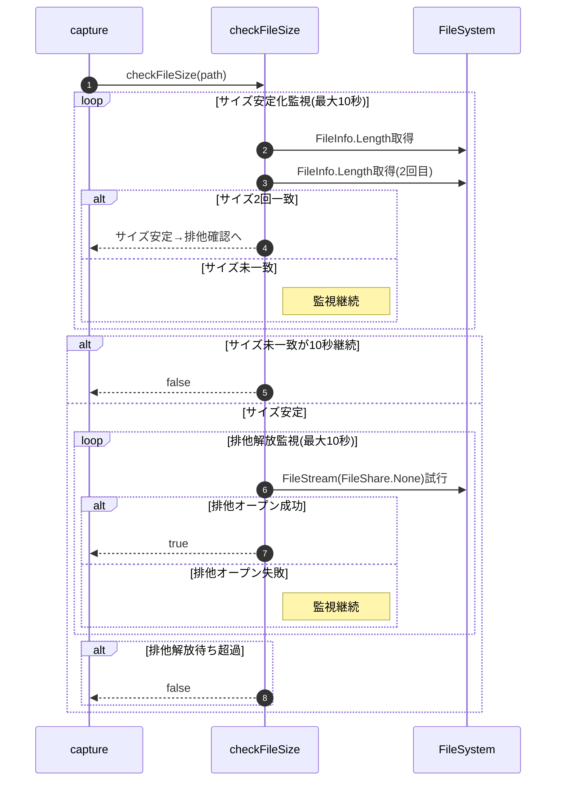

#### 8-2-15. SetCamPosTarget

| 項目 | 内容 |
|------|------|
| シグネチャ | private void SetCamPosTarget(List<UnitInfo> lstTgtUnit, double dist, double wallH, double camH) |
| 概要 | Gap計測・調整前に、指定されたCabinetリストに対してカメラの目標位置・姿勢を再設定する。 |

| 引数 | 型 | 説明 |
|-------|----|------|
| lstTgtUnit | List<UnitInfo> | 目標位置を設定するCabinetリスト |
| dist | double | 撮影距離[mm] |
| wallH | double | 壁高さ[mm] |
| camH | double | カメラ高さ[mm] |

| 返り値 | 型 | 説明 |
|--------|----|------|
| なし | void | － |

| 手順No. | 処理内容 | 詳細 |
|---------|----------|------|
| 1 | Cabinet座標再計算 | SetCabinetPosで各Cabinetの3D座標を再計算する |
| 2 | 相対姿勢補正 | CalcRelativePositionでpan/tilt/x/yを算出し、MoveCabinetPosで姿勢補正を適用 |
| 3 | 姿勢・中心補正 | MoveCabinetPosSelectedCenterで中心を光学中心に合わせる |
| 4 | 角度再計算 | CalcCpAngleで各Cabinetの補正点角度を再計算する |

| 区分 | 条件 | NG時挙動 |
|------|------|----------|
| 実行前提 | lstTgtUnit, dist, wallH, camHが有効値であること | 例外通知して処理中断 |
| Cabinet情報 | CabinetPosが初期化済みであること | Null参照/配列参照例外で中断 |

| 呼出し先 | 役割 | 同期/非同期 |
|----------|------|--------------|
| SetCabinetPos | Cabinet座標再計算 | 同期 |
| CalcRelativePosition | 相対姿勢補正値算出 | 同期 |
| MoveCabinetPos | 姿勢補正適用 | 同期 |
| MoveCabinetPosSelectedCenter | 中心補正 | 同期 |
| CalcCpAngle | 補正点角度再計算 | 同期 |

| 条件 | 挙動 |
|------|------|
| 正常系 | 全手順を順次実行し、Cabinetリストに目標位置・姿勢を反映する |
| 異常系 | 例外時は呼出元へ通知し、以降の処理を中断する |

| ケース | 捕捉方法 | 通知/伝播 | 後処理 |
|--------|----------|-----------|--------|
| Cabinet情報不正 | Null参照/範囲外例外 | 呼出元へ通知 | 安全停止 |
| 計算失敗 | 下位例外 | 呼出元へ通知 | 設定復帰 |

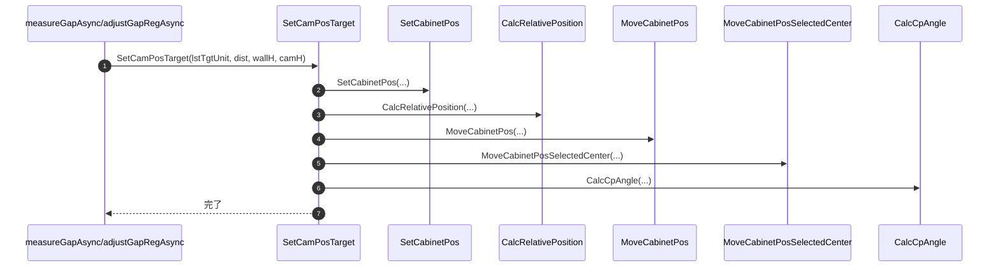
