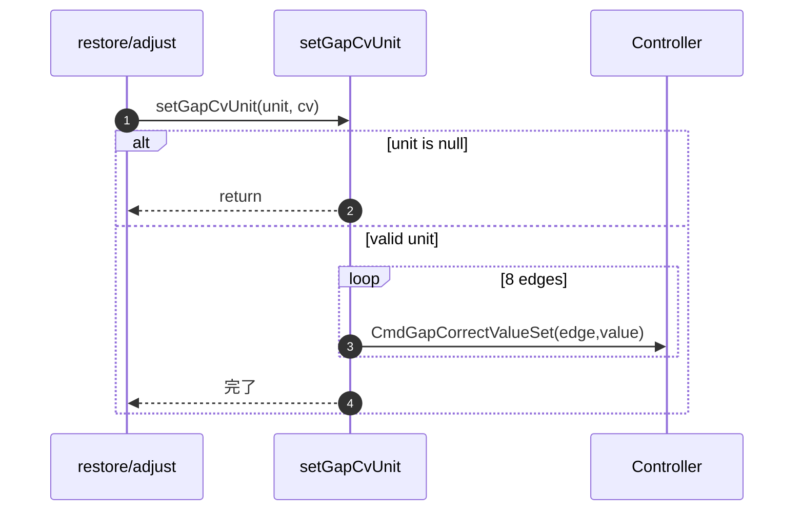
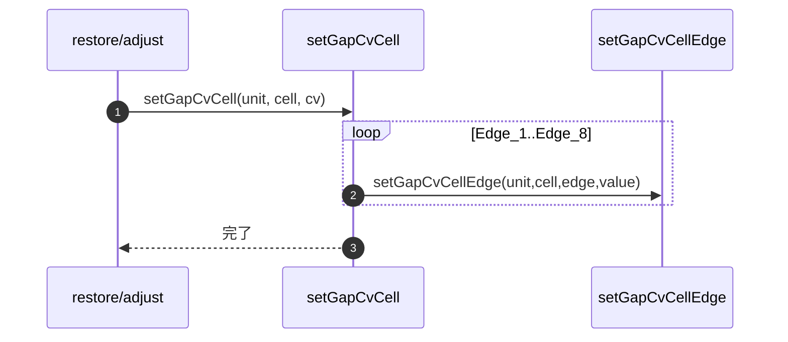
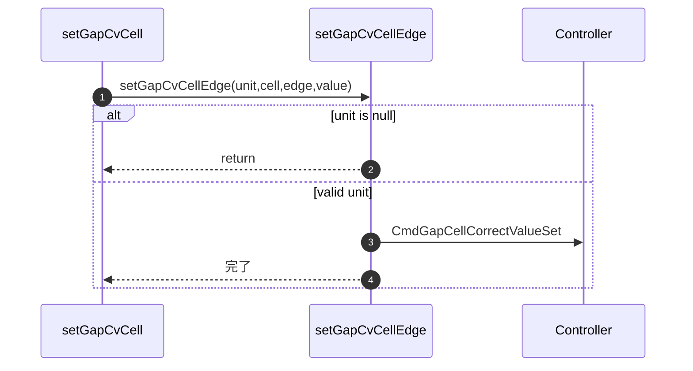
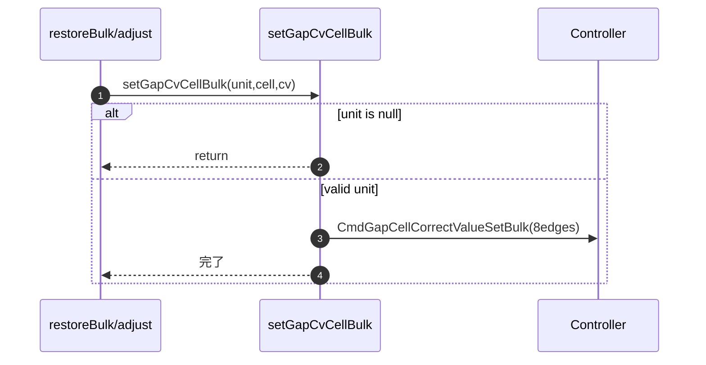
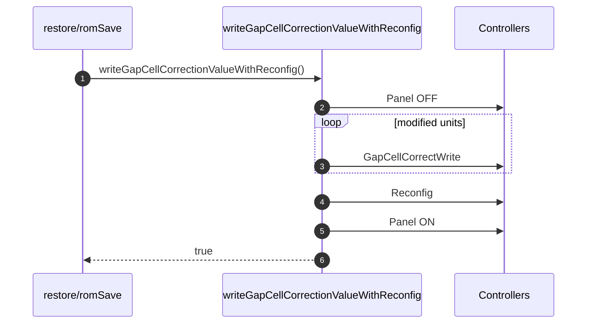
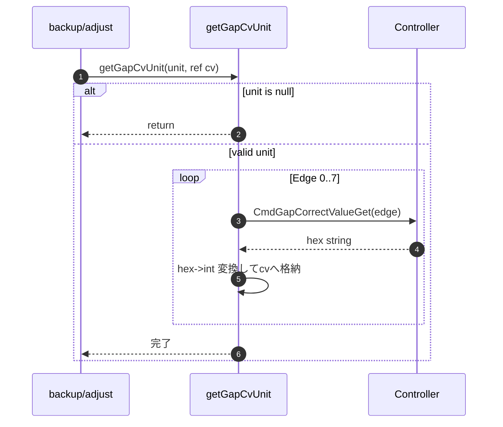
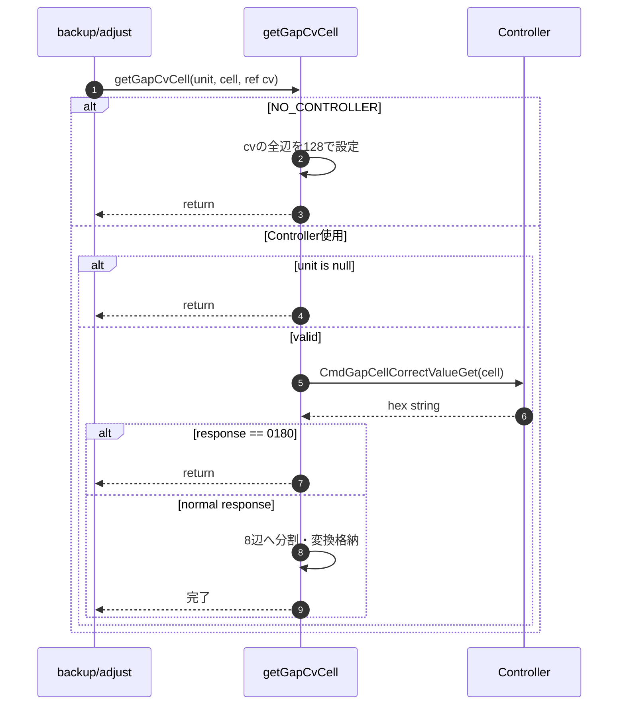
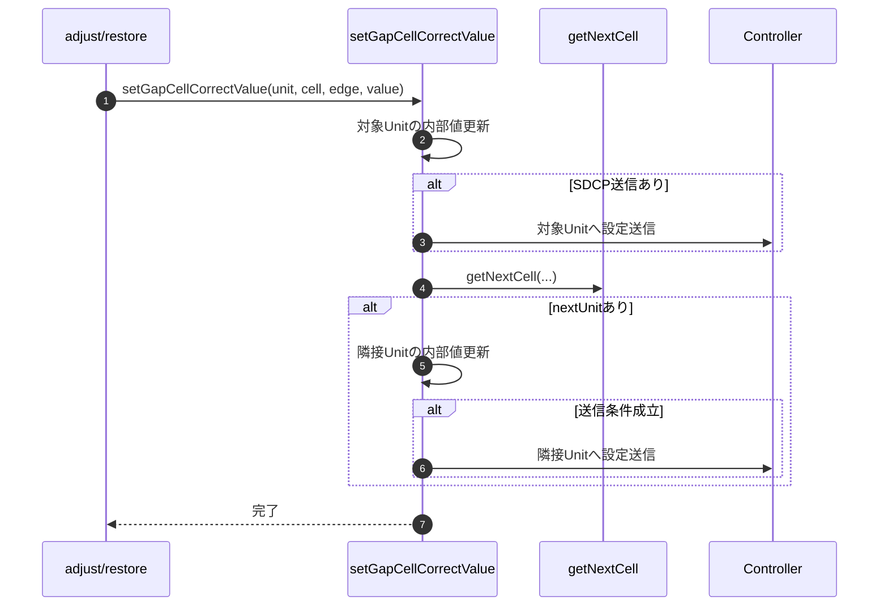
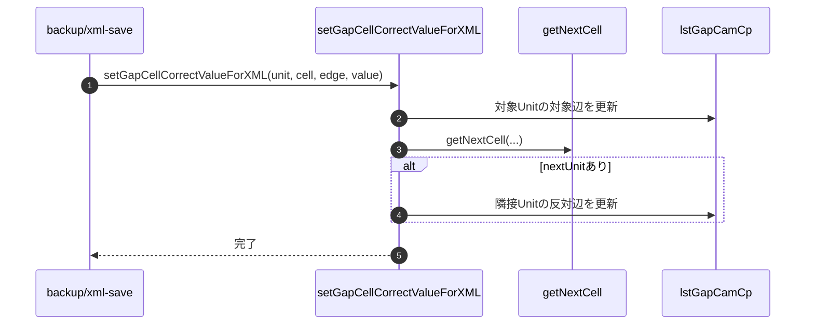

### 8-3. 設定・データ書込みメソッド

#### 8-3-1. setGapCvUnit

| 項目 | 内容 |
|------|------|
| シグネチャ | `private void setGapCvUnit(UnitInfo unit, GapCellCorrectValue cv)` |
| 概要 | Cabinet単位の補正値をSDCPで設定する |

引数

| No. | 引数名 | 型 | 必須 | 説明 |
|-----|--------|----|------|------|
| 1 | unit | UnitInfo | Y | 対象Cabinet |
| 2 | cv | GapCellCorrectValue | Y | 8辺補正値 |

返り値: なし（void）

処理概要（詳細）

| 手順No. | 処理内容 | 詳細 |
|---------|----------|------|
| 1 | 入力検証 | `unit == null` の場合は無処理で終了する。 |
| 2 | コマンド雛形作成 | `CmdGapCorrectValueSet` を複製し、対象Unitアドレスを設定する。 |
| 3 | 8辺値設定 | TopLeft〜RightBottom の各辺を `cmd[8]`（辺種別）と `cmd[20]`（値）へ順次設定する。 |
| 4 | SDCP送信 | 各辺ごとに `sendSdcpCommand(..., wait=100, ip)` を実行する。 |

入力条件・前提条件

| 区分 | 条件 | NG時挙動 |
|------|------|----------|
| 対象Unit | `unit` が有効で `ControllerID/PortNo/UnitNo` を保持していること | null時は即return |
| 通信環境 | 対象ControllerへSDCP送信可能であること | 送信例外を呼出元へ送出 |

主要呼出し先

| 呼出し先 | 役割 | 同期/非同期 |
|----------|------|--------------|
| `sendSdcpCommand` | Cabinet補正値の辺別設定 | 同期 |

例外時仕様

| ケース | 捕捉方法 | 通知/伝播 | 後処理 |
|--------|----------|-----------|--------|
| SDCP送信失敗 | 下位処理 `Exception` | 呼出元へ再送出 | 途中辺まで反映の可能性あり |

シーケンス図

#### 8-3-2. setGapCvCell

| 項目 | 内容 |
|------|------|
| シグネチャ | `private void setGapCvCell(UnitInfo unit, int cell, GapCellCorrectValue cv)` |
| 概要 | Cell単位の補正値を辺ごとに設定する |

引数

| No. | 引数名 | 型 | 必須 | 説明 |
|-----|--------|----|------|------|
| 1 | unit | UnitInfo | Y | 対象Cabinet |
| 2 | cell | int | Y | Cell番号（1ベース） |
| 3 | cv | GapCellCorrectValue | Y | 8辺補正値 |

返り値: なし（void）

処理概要（詳細）

| 手順No. | 処理内容 | 詳細 |
|---------|----------|------|
| 1 | 辺展開 | `GapCellCorrectValue` の8辺値をEdge_1〜Edge_8へ展開する。 |
| 2 | 辺別設定呼出し | 各辺ごとに `setGapCvCellEdge(unit, cell, edge, value)` を呼び出す。 |

入力条件・前提条件

| 区分 | 条件 | NG時挙動 |
|------|------|----------|
| 対象Cell | `cell` が1ベースの有効範囲であること | 下位処理結果に依存（不正値送信の可能性） |
| 対象Unit | `unit` が有効であること | 下位 `setGapCvCellEdge` 側でreturn |

主要呼出し先

| 呼出し先 | 役割 | 同期/非同期 |
|----------|------|--------------|
| `setGapCvCellEdge` | Cell辺単位の補正値設定 | 同期 |

例外時仕様

| ケース | 捕捉方法 | 通知/伝播 | 後処理 |
|--------|----------|-----------|--------|
| 辺別設定失敗 | 下位処理 `Exception` | 呼出元へ再送出 | 一部辺のみ反映の可能性あり |

シーケンス図

#### 8-3-3. setGapCvCellEdge

| 項目 | 内容 |
|------|------|
| シグネチャ | `private void setGapCvCellEdge(UnitInfo unit, int cell, EdgePosition targetEdge, int value)` |
| 概要 | Cellの指定辺へ補正値を設定する |

引数

| No. | 引数名 | 型 | 必須 | 説明 |
|-----|--------|----|------|------|
| 1 | unit | UnitInfo | Y | 対象Cabinet |
| 2 | cell | int | Y | Cell番号 |
| 3 | targetEdge | EdgePosition | Y | 対象辺 |
| 4 | value | int | Y | 補正値 |

返り値: なし（void）

処理概要（詳細）

| 手順No. | 処理内容 | 詳細 |
|---------|----------|------|
| 1 | 入力検証 | `unit == null` の場合はreturnする。 |
| 2 | コマンド生成 | `CmdGapCellCorrectValueSet` を複製し、Unitアドレス・Cell・Edge・Valueを設定する。 |
| 3 | SDCP送信 | `sendSdcpCommand(cmd, 100, ip)` を実行する。 |

入力条件・前提条件

| 区分 | 条件 | NG時挙動 |
|------|------|----------|
| 対象Unit | `unit` が有効であること | null時は無処理終了 |
| 値範囲 | `value` がbyteへ変換可能範囲であること | キャスト値で送信（仕様外値は機器依存） |

主要呼出し先

| 呼出し先 | 役割 | 同期/非同期 |
|----------|------|--------------|
| `sendSdcpCommand` | Cell/Edge単位補正値設定 | 同期 |

例外時仕様

| ケース | 捕捉方法 | 通知/伝播 | 後処理 |
|--------|----------|-----------|--------|
| SDCP送信失敗 | 下位処理 `Exception` | 呼出元へ再送出 | 呼出元で失敗処理 |

シーケンス図

#### 8-3-4. setGapCvCellBulk

| 項目 | 内容 |
|------|------|
| シグネチャ | `private void setGapCvCellBulk(UnitInfo unit, int cell, GapCellCorrectValue cv)` |
| 概要 | Cell補正値を一括コマンドで設定する |

引数

| No. | 引数名 | 型 | 必須 | 説明 |
|-----|--------|----|------|------|
| 1 | unit | UnitInfo | Y | 対象Cabinet |
| 2 | cell | int | Y | Cell番号 |
| 3 | cv | GapCellCorrectValue | Y | 8辺補正値 |

返り値: なし（void）

処理概要（詳細）

| 手順No. | 処理内容 | 詳細 |
|---------|----------|------|
| 1 | 入力検証 | `unit == null` の場合はreturnする。 |
| 2 | Bulkコマンド生成 | `CmdGapCellCorrectValueSetBulk` へCell、Unitアドレス、8辺値を格納する。 |
| 3 | 一括送信 | `sendSdcpCommand(...,100,ip)` を1回送信し、8辺を一括反映する。 |

入力条件・前提条件

| 区分 | 条件 | NG時挙動 |
|------|------|----------|
| 対象Unit | `unit` が有効であること | null時は無処理終了 |
| Bulk対応 | 対象FWがBulkコマンドを受理すること | 送信失敗は例外送出 |

主要呼出し先

| 呼出し先 | 役割 | 同期/非同期 |
|----------|------|--------------|
| `sendSdcpCommand` | Cell補正値一括反映 | 同期 |

例外時仕様

| ケース | 捕捉方法 | 通知/伝播 | 後処理 |
|--------|----------|-----------|--------|
| Bulk送信失敗 | 下位処理 `Exception` | 呼出元へ再送出 | 呼出元で失敗処理 |

シーケンス図

#### 8-3-5. writeGapCellCorrectionValueWithReconfig

| 項目 | 内容 |
|------|------|
| シグネチャ | `private bool writeGapCellCorrectionValueWithReconfig()` |
| 概要 | Write/Reconfig/Panel制御を標準手順で実行する |

引数: なし

返り値

| No. | 項目名 | 型 | 説明 |
|-----|--------|----|------|
| 1 | result | bool | true: 正常終了 |

処理概要（詳細）

| 手順No. | 処理内容 | 詳細 |
|---------|----------|------|
| 1 | Step設定 | `4 + lstModifiedUnits.Count` を進捗総Stepへ設定する。 |
| 2 | Panel OFF | 全Controllerへ `CmdUnitPowerOff` を送信し、待機する。 |
| 3 | Write | 変更対象Unitごとに `CmdGapCellCorrectWrite` を送信する。 |
| 4 | Reconfig | 対象Controllerを有効化して `sendReconfig()` を実行する。 |
| 5 | Panel ON | 全Controllerへ `CmdUnitPowerOn` を送信し、進捗を完了させる。 |
| 6 | 戻り値返却 | 正常終了時 `true` を返す。 |

入力条件・前提条件

| 区分 | 条件 | NG時挙動 |
|------|------|----------|
| 対象一覧 | `lstModifiedUnits` が更新済みであること | Write対象不足により反映漏れの可能性 |
| 通信環境 | Power/Write/Reconfigコマンド実行が可能であること | 例外送出で上位失敗 |

主要状態更新

| 状態変数 | 更新内容 | 更新タイミング |
|----------|----------|----------------|
| `winProgress` | Stepカウント・メッセージ更新 | 各処理段階 |
| Controller.Target | Reconfig送信対象をtrue化 | Reconfig直前 |

主要呼出し先

| 呼出し先 | 役割 | 同期/非同期 |
|----------|------|--------------|
| `sendSdcpCommand` | Panel OFF/ON、Unit Write送信 | 同期 |
| `sendReconfig` | 設定確定反映 | 同期 |

例外時仕様

| ケース | 捕捉方法 | 通知/伝播 | 後処理 |
|--------|----------|-----------|--------|
| Power/Write/Reconfig失敗 | 下位処理 `Exception` | 呼出元へ再送出 | 呼出元でエラー通知 |

シーケンス図

#### 8-3-6. getGapCvUnit

| 項目 | 内容 |
|------|------|
| シグネチャ | `private void getGapCvUnit(UnitInfo unit, ref GapCellCorrectValue cv)` |
| 概要 | Cabinet単位の補正値（8辺）をSDCPで取得する |

引数

| No. | 引数名 | 型 | 必須 | 説明 |
|-----|--------|----|------|------|
| 1 | unit | UnitInfo | Y | 対象Cabinet |
| 2 | cv | ref GapCellCorrectValue | Y | 取得値格納先（参照渡し） |

返り値: なし（void）

処理概要（詳細）

| 手順No. | 処理内容 | 詳細 |
|---------|----------|------|
| 1 | 出力初期化 | `cv = new GapCellCorrectValue()` で初期化する。 |
| 2 | 入力検証 | `unit == null` の場合は無処理で終了する。 |
| 3 | コマンド雛形作成 | `CmdGapCorrectValueGet` を複製し、対象Unitアドレスを設定する。 |
| 4 | 8辺順次取得 | `cmd[8]` を 0..7 に切替え、`sendSdcpCommand` の応答hex文字列を数値へ変換して `cv` の各辺へ格納する。 |

入力条件・前提条件

| 区分 | 条件 | NG時挙動 |
|------|------|----------|
| 対象Unit | `unit` が有効で `ControllerID/PortNo/UnitNo` を保持していること | null時return |
| 通信環境 | 対象ControllerへSDCP GET送信が可能であること | 送信例外を呼出元へ送出 |
| 応答形式 | 応答文字列が16進数変換可能であること | 変換例外を呼出元へ送出 |

主要呼出し先

| 呼出し先 | 役割 | 同期/非同期 |
|----------|------|--------------|
| `sendSdcpCommand` | Cabinet補正値の辺別取得 | 同期 |
| `Convert.ToInt32(...,16)` | 16進応答の数値化 | 同期 |

例外時仕様

| ケース | 捕捉方法 | 通知/伝播 | 後処理 |
|--------|----------|-----------|--------|
| SDCP取得失敗 | 下位処理 `Exception` | 呼出元へ再送出 | 取得途中の値で中断 |
| 応答変換失敗 | `Convert.ToInt32` 例外 | 呼出元へ再送出 | 取得中断 |

シーケンス図

#### 8-3-7. getGapCvCell

| 項目 | 内容 |
|------|------|
| シグネチャ | `private void getGapCvCell(UnitInfo unit, int cell, ref GapCellCorrectValue cv)` |
| 概要 | Cell単位の補正値（8辺）をSDCPで取得する |

引数

| No. | 引数名 | 型 | 必須 | 説明 |
|-----|--------|----|------|------|
| 1 | unit | UnitInfo | Y | 対象Cabinet |
| 2 | cell | int | Y | Cell番号（1ベース） |
| 3 | cv | ref GapCellCorrectValue | Y | 取得値格納先（参照渡し） |

返り値: なし（void）

処理概要（詳細）

| 手順No. | 処理内容 | 詳細 |
|---------|----------|------|
| 1 | 出力初期化 | `cv = new GapCellCorrectValue()` を設定する。 |
| 2 | 条件分岐 | `NO_CONTROLLER` 時は全辺128を設定して終了する。 |
| 3 | 入力検証 | 通常系では `unit == null` の場合は終了する。 |
| 4 | コマンド送信 | `CmdGapCellCorrectValueGet` にUnitアドレスと `cell` を設定して送信する。 |
| 5 | 特殊応答判定 | 応答が `"0180"` の場合は既定値のまま終了する。 |
| 6 | 8辺展開 | 応答16進文字列を2桁ずつ分割し、TopLeft〜BottomRightへ格納する。 |
| 7 | 変換失敗対応 | 文字列分割/変換失敗時は `catch` で無処理returnする。 |

入力条件・前提条件

| 区分 | 条件 | NG時挙動 |
|------|------|----------|
| 対象Unit | `unit` が有効であること（通常系） | null時return |
| 対象Cell | `cell` が機器仕様上の有効範囲であること | 応答異常または変換失敗 |
| 通信環境 | SDCP GET送信が可能であること | 例外送出 |

条件分岐仕様

| 条件 | 挙動 |
|------|------|
| `NO_CONTROLLER` | 各辺を128で固定設定する。 |
| 応答 `"0180"` | 実値展開を行わず終了する。 |

主要呼出し先

| 呼出し先 | 役割 | 同期/非同期 |
|----------|------|--------------|
| `sendSdcpCommand` | Cell補正値取得 | 同期 |
| `Convert.ToInt32(...,16)` | 16進応答の数値化 | 同期 |

例外時仕様

| ケース | 捕捉方法 | 通知/伝播 | 後処理 |
|--------|----------|-----------|--------|
| SDCP取得失敗 | 下位処理 `Exception` | 呼出元へ再送出 | 取得中断 |
| 文字列変換失敗 | `catch` で吸収 | 例外非送出 | 既定値のままreturn |

シーケンス図

#### 8-3-8. setGapCellCorrectValue

| 項目 | 内容 |
|------|------|
| シグネチャ | `private void setGapCellCorrectValue(UnitInfo unit, CellNum CellNo, EdgePosition targetEdge, int value)` |
| 概要 | Cell境界補正値を対象Unitと隣接Unitへ反映し、必要に応じSDCP送信と変更Unit管理を行う |

引数

| No. | 引数名 | 型 | 必須 | 説明 |
|-----|--------|----|------|------|
| 1 | unit | UnitInfo | Y | 補正対象の基準Cabinet |
| 2 | CellNo | CellNum | Y | 対象Cell番号 |
| 3 | targetEdge | EdgePosition | Y | 設定対象の辺 |
| 4 | value | int | Y | 反映する補正値 |

返り値: なし（void）

処理概要（詳細）

| 手順No. | 処理内容 | 詳細 |
|---------|----------|------|
| 1 | 入力検証 | `unit == null` の場合はreturnする。 |
| 2 | 対象Unit反映 | 対象Cell/Edgeへ `value` を設定し、`BulkSetCorrectValue` 無効時はSDCP送信する。 |
| 3 | 内部配列更新 | `lstGapCamCp` の対象Unit側 `AryCvCell` を更新し、`lstModifiedUnits` へ追加する。 |
| 4 | 隣接側解決 | `getNextCell` で隣接Unit/Cell/Edgeを取得する。 |
| 5 | 隣接Unit反映 | 隣接側へ同値を反映し、条件に応じSDCP送信、`lstGapCamCp` と `lstModifiedUnits` を更新する。 |

入力条件・前提条件

| 区分 | 条件 | NG時挙動 |
|------|------|----------|
| 対象Unit | `unit` が有効であること | null時は無処理終了 |
| 補正値 | `value` が機器仕様範囲内であること | 下位処理または後続Writeで異常の可能性 |
| 内部配列 | `lstGapCamCp` が対象Cabinet情報を保持していること | 対象値更新漏れの可能性 |

主要状態更新

| 状態変数 | 更新内容 | 更新タイミング |
|----------|----------|----------------|
| `lstGapCamCp` | 対象/隣接Cell補正値 | 手順3,5 |
| `lstModifiedUnits` | Write対象Cabinet一覧 | 手順3,5 |

条件分岐仕様

| 条件 | 挙動 |
|------|------|
| `NO_CONTROLLER` | SDCP送信を行わず内部状態更新のみ実施する。 |
| `BulkSetCorrectValue` | 隣接Unitが `lstGapCamCp` に含まれない場合のみSDCP送信する。 |
| `nextUnit == null` | 隣接反映を行わず対象Unitのみで終了する。 |

主要呼出し先

| 呼出し先 | 役割 | 同期/非同期 |
|----------|------|--------------|
| `getNextCell` | 隣接Unit/Cell/Edgeの解決 | 同期 |
| `sendSdcpCommand` | Gap Cell補正値設定コマンド送信 | 同期 |
| `SDCPClass.CmdGapCellCorrectValueSet` | 設定コマンド雛形 | 同期 |

例外時仕様

| ケース | 捕捉方法 | 通知/伝播 | 後処理 |
|--------|----------|-----------|--------|
| SDCP送信失敗 | 下位 `Exception` | 呼出元へ再送出 | 当該補正反映を中断 |
| 隣接Unitなし | `nextUnit == null` 判定 | 例外なし | 対象Unitのみ更新して終了 |

シーケンス図

#### 8-3-9. setGapCellCorrectValueForXML

| 項目 | 内容 |
|------|------|
| シグネチャ | `private void setGapCellCorrectValueForXML(UnitInfo unit, CellNum CellNo, EdgePosition targetEdge, int value)` |
| 概要 | XML出力用に、SDCP送信なしで `lstGapCamCp` の対象/隣接Cell補正値を更新する |

引数

| No. | 引数名 | 型 | 必須 | 説明 |
|-----|--------|----|------|------|
| 1 | unit | UnitInfo | Y | 補正対象の基準Cabinet |
| 2 | CellNo | CellNum | Y | 対象Cell番号 |
| 3 | targetEdge | EdgePosition | Y | 設定対象の辺 |
| 4 | value | int | Y | XML出力用に保持する補正値 |

返り値: なし（void）

処理概要（詳細）

| 手順No. | 処理内容 | 詳細 |
|---------|----------|------|
| 1 | 入力検証 | `unit == null` の場合はreturnする。 |
| 2 | 対象Unit更新 | `lstGapCamCp` の対象Unit・対象Cell・対象Edgeへ `value` を格納する。 |
| 3 | 隣接側解決 | `getNextCell` で隣接Unit/Cell/Edgeを取得する。 |
| 4 | 隣接Unit更新 | 隣接Unitが存在する場合、反対側Edgeへ同値を格納する。 |
| 5 | 終了 | SDCP送信は行わず、メモリ上のXML出力対象データのみ更新して終了する。 |

入力条件・前提条件

| 区分 | 条件 | NG時挙動 |
|------|------|----------|
| 対象Unit | `unit` が有効であること | null時は無処理終了 |
| 内部配列 | `lstGapCamCp` がXML出力対象を保持していること | 対象更新漏れの可能性 |

主要状態更新

| 状態変数 | 更新内容 | 更新タイミング |
|----------|----------|----------------|
| `lstGapCamCp` | 対象/隣接CellのXML出力用補正値 | 手順2,4 |

条件分岐仕様

| 条件 | 挙動 |
|------|------|
| `nextUnit == null` | 隣接側更新を行わず対象Unitのみ更新する。 |
| 対象Unit未検出 | 一致要素がない場合は該当更新をスキップする。 |

主要呼出し先

| 呼出し先 | 役割 | 同期/非同期 |
|----------|------|--------------|
| `getNextCell` | 隣接Unit/Cell/Edgeの解決 | 同期 |
| `lstGapCamCp` | XML出力対象データ更新先 | 同期 |

例外時仕様

| ケース | 捕捉方法 | 通知/伝播 | 後処理 |
|--------|----------|-----------|--------|
| 隣接Unitなし | `nextUnit == null` 判定 | 例外なし | 対象Unitのみ更新して終了 |
| 対象未存在 | ループ未一致 | 例外なし | 該当要素のみ未更新で終了 |

シーケンス図

