### 8-4. 補助計算・補正演算メソッド

#### 8-4-1. getCv

| 項目 | 内容 |
|------|------|
| シグネチャ | `private int getCv(GapCamCorrectionValue cv, GapCamCp cp)` |
| 概要 | 対象位置の現在補正値を取得する |

引数: `cv`, `cp`  
返り値: 補正レジスタ値（int）

処理概要（詳細）

| 手順No. | 処理内容 | 詳細 |
|---------|----------|------|
| 1 | 対象種別判定 | `cp.CellNo == NA` ならUnit値、そうでなければCell値を参照対象にする。 |
| 2 | 位置対応値取得 | `cp.Pos`（TopLeft等）に対応する補正値を `cv.CvUnit` または `cv.AryCvCell` から取得する。 |
| 3 | 元レジスタ保存 | 取得値を `cp.RegOrg` に格納する。 |
| 4 | 値返却 | 取得レジスタ値を戻り値として返す。 |

条件分岐仕様

| 条件 | 挙動 |
|------|------|
| `No_CabinetCorrectionValue` | Unit参照時は固定値128を返す。 |
| `CorrectTargetEdge` | Left/Bottom系ポジションも取得対象に含める。 |

主要呼出し先

| 呼出し先 | 役割 | 同期/非同期 |
|----------|------|--------------|
| なし（内部プロパティ参照のみ） | `GapCamCorrectionValue` / `GapCamCp` から対象値を選択取得 | 同期 |

例外時仕様

| ケース | 捕捉方法 | 通知/伝播 | 後処理 |
|--------|----------|-----------|--------|
| 想定外Pos | 該当分岐なし | 既定値0のまま返却 | 呼出元で後続計算 |

シーケンス図

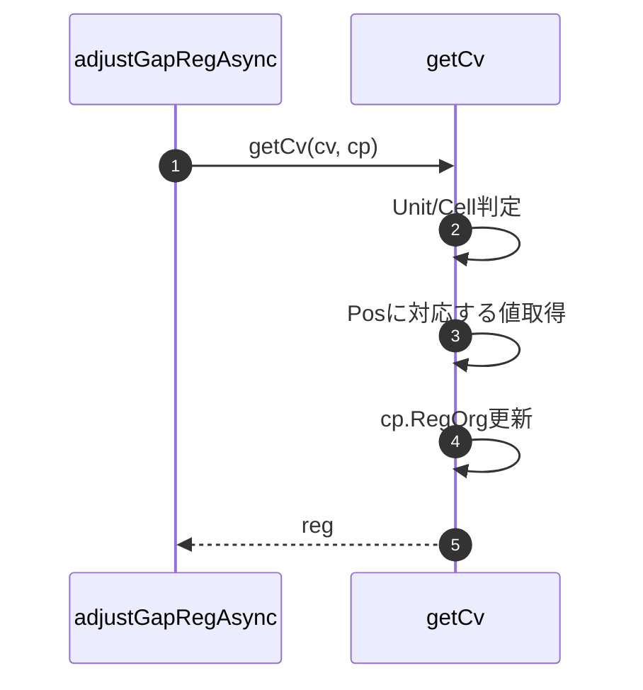
```mermaid
sequenceDiagram
    autonumber
    participant ADJ as adjustGapRegAsync
    participant M as getCv

    ADJ->>M: getCv(cv, cp)
    M->>M: Unit/Cell判定
    M->>M: Posに対応する値取得
    M->>M: cp.RegOrg更新
    M-->>ADJ: reg
```

#### 8-4-2. calcNewRegUnit

| 項目 | 内容 |
|------|------|
| シグネチャ | `private int calcNewRegUnit(int curReg, double gapGain)` |
| 概要 | Cabinet補正値を計算する（現状は未実装） |

引数: `curReg`, `gapGain`  
返り値: 新補正値（現状0）

処理概要（詳細）

| 手順No. | 処理内容 | 詳細 |
|---------|----------|------|
| 1 | 入力受領 | 現在値 `curReg` と計測ゲイン `gapGain` を受け取る。 |
| 2 | 戻り値返却 | 現行実装では常に `0` を返す。 |

主要呼出し先

| 呼出し先 | 役割 | 同期/非同期 |
|----------|------|--------------|
| なし | 現行実装は計算ロジック未実装（定数返却のみ） | 同期 |

実装状態

| 項目 | 内容 |
|------|------|
| 実装状況 | TODO（計算ロジック未実装） |
| 影響 | Unit補正は実質無効。Cell補正中心で運用される。 |

シーケンス図

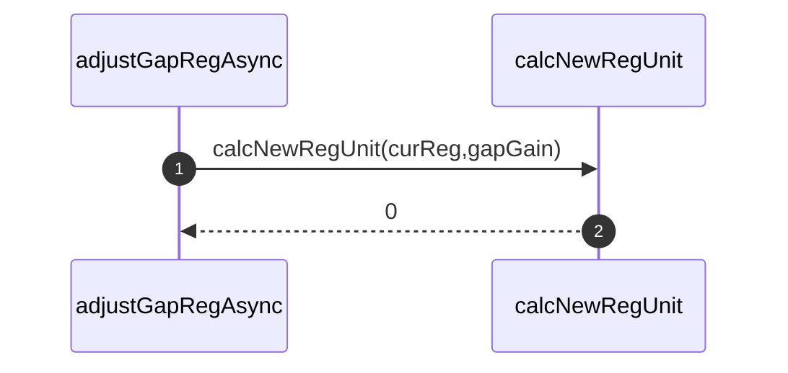
```mermaid
sequenceDiagram
    autonumber
    participant ADJ as adjustGapRegAsync
    participant M as calcNewRegUnit

    ADJ->>M: calcNewRegUnit(curReg,gapGain)
    M-->>ADJ: 0
```

#### 8-4-3. calcNewRegCell

| 項目 | 内容 |
|------|------|
| シグネチャ | `private int calcNewRegCell(int curReg, double gapGain)` |
| 概要 | Cell補正値をゲイン換算で計算し範囲制限する |

引数: `curReg`, `gapGain`  
返り値: 新補正値（int）

処理概要（詳細）

| 手順No. | 処理内容 | 詳細 |
|---------|----------|------|
| 1 | 係数計算 | 仕様ゲイン範囲(75.0%-124.8%)から係数 `k=(1.248-0.75)/255` を算出する。 |
| 2 | 現在ゲイン変換 | `curReg` を `curGain = 1 + k*(curReg-128)` へ変換する。 |
| 3 | 目標ゲイン計算 | `newGain = curGain * (1.0 / gapGain)` で補正後ゲインを求める。 |
| 4 | レジスタ逆変換 | `newReg = ((newGain-1)/k)+128` を四捨五入して算出する。 |
| 5 | 範囲クランプ | `correctValue_Min`〜`correctValue_Max` の範囲へ丸める。 |
| 6 | 値返却 | 新規レジスタ値を返す。 |

入力条件・前提条件

| 区分 | 条件 | NG時挙動 |
|------|------|----------|
| `gapGain` | 0以外であること | 0付近は計算値発散（呼出元で実質回避が前提） |
| レジスタ範囲 | `curReg` が整数値であること | 演算後クランプで補正 |

主要呼出し先

| 呼出し先 | 役割 | 同期/非同期 |
|----------|------|--------------|
| `Math`（四則演算/丸め） | ゲイン-レジスタ相互変換と四捨五入相当計算 | 同期 |
| `correctValue_Min` / `correctValue_Max` | 補正値の上下限クランプ | 同期 |

例外時仕様

| ケース | 捕捉方法 | 通知/伝播 | 後処理 |
|--------|----------|-----------|--------|
| 非数値演算 | 浮動小数演算結果 | 例外は通常発生しない | クランプ後返却 |

シーケンス図

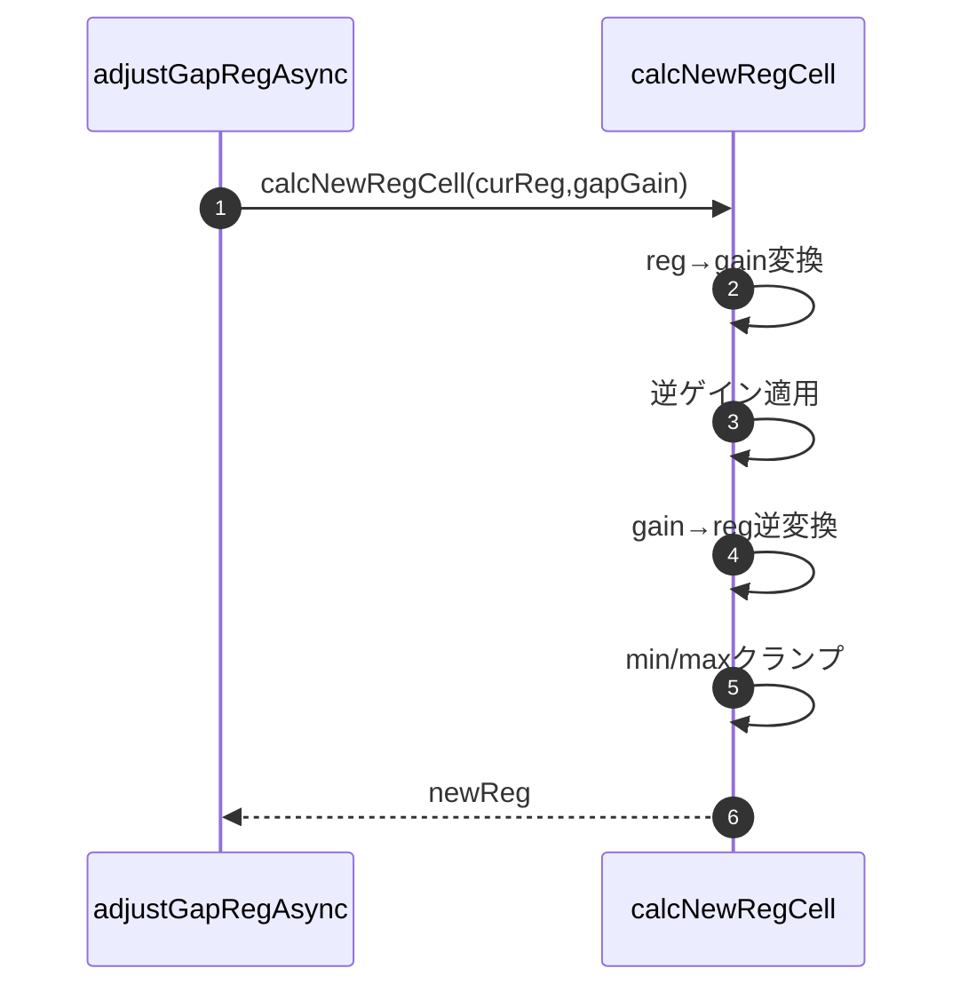
```mermaid
sequenceDiagram
    autonumber
    participant ADJ as adjustGapRegAsync
    participant M as calcNewRegCell

    ADJ->>M: calcNewRegCell(curReg,gapGain)
    M->>M: reg→gain変換
    M->>M: 逆ゲイン適用
    M->>M: gain→reg逆変換
    M->>M: min/maxクランプ
    M-->>ADJ: newReg
```

#### 8-4-4. setGapCorrectValue

| 項目 | 内容 |
|------|------|
| シグネチャ | `private void setGapCorrectValue(UnitInfo unit, CorrectPosition pos, int value)` |
| 概要 | Cabinet境界の補正値を設定する |

引数: `unit`, `pos`, `value`  
返り値: なし（void）

処理概要（詳細）

| 手順No. | 処理内容 | 詳細 |
|---------|----------|------|
| 1 | 入力検証 | `unit == null` の場合はreturnする。 |
| 2 | 対象Unit反映 | `CmdGapCorrectValueSet` を生成し、`pos` 対応辺へ `value` を設定して送信する。 |
| 3 | 隣接Unit探索 | `pos` から隣接方向を算出し、隣接Unitを取得する。 |
| 4 | 隣接Unit反映 | 反対側辺番号へ同一値を設定し、Gap両側の整合を取る。 |

入力条件・前提条件

| 区分 | 条件 | NG時挙動 |
|------|------|----------|
| 対象Unit | `unit` が有効であること | null時return |
| 隣接Unit | 配列範囲内に隣接Unitが存在すること | 取得失敗時は対象Unitのみ反映 |

条件分岐仕様

| 条件 | 挙動 |
|------|------|
| `CorrectTargetEdge` | 8方向ポジションを明示対応し、隣接辺のマッピングを切替える。 |
| `Coverity` | null判定と座標参照順を安全側へ変更する。 |

主要呼出し先

| 呼出し先 | 役割 | 同期/非同期 |
|----------|------|--------------|
| `sendSdcpCommand` | 対象Unit/隣接UnitへGap補正値コマンドを送信 | 同期 |
| `SDCPClass.CmdGapCorrectValueSet` | Gap補正値設定コマンド雛形の生成元 | 同期 |
| `dicController` | Unitに対応するControllerの送信先IP解決 | 同期 |
| `aryUnitUf` | 隣接Unit探索（反対辺への同値反映先決定） | 同期 |

例外時仕様

| ケース | 捕捉方法 | 通知/伝播 | 後処理 |
|--------|----------|-----------|--------|
| 隣接参照失敗 | `try-catch` で配列参照 | 例外を握りつぶしてreturn | 片側のみ設定 |
| SDCP送信失敗 | 下位処理 `Exception` | 呼出元へ再送出 | 呼出元で失敗処理 |

シーケンス図

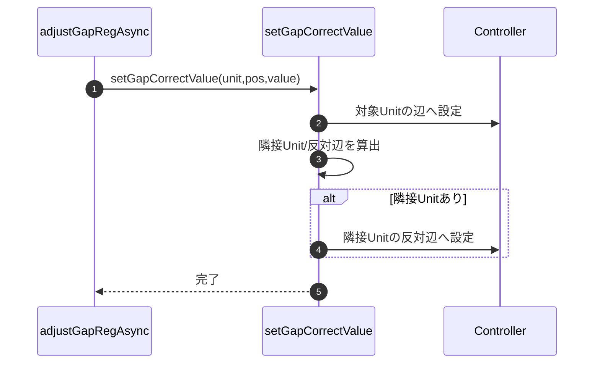
```mermaid
sequenceDiagram
    autonumber
    participant ADJ as adjustGapRegAsync
    participant M as setGapCorrectValue
    participant SDCP as Controller

    ADJ->>M: setGapCorrectValue(unit,pos,value)
    M->>SDCP: 対象Unitの辺へ設定
    M->>M: 隣接Unit/反対辺を算出
    alt 隣接Unitあり
        M->>SDCP: 隣接Unitの反対辺へ設定
    end
    M-->>ADJ: 完了
```

#### 8-4-5. storeGapCp

| 項目 | 内容 |
|------|------|
| シグネチャ | `private void storeGapCp(List<UnitInfo> lstTgtUnit, string measPath)` |
| 概要 | Top/Rightトリミング領域を補正点群へ再構成し、後段ゲイン推定用の `lstGapCamCp` を確定する |

引数

| No. | 引数名 | 型 | 必須 | 説明 |
|-----|--------|----|------|------|
| 1 | lstTgtUnit | List<UnitInfo> | Y | 補正対象Unitの矩形集合 |
| 2 | measPath | string | Y | Top/Rightトリミング画像の保存先ベースパス |

返り値: なし（void）

処理概要（詳細）

| 手順No. | 処理内容 | 詳細 |
|---------|----------|------|
| 1 | 解析バッファ初期化 | `CaptureTilt` / `RotateRect` 条件に応じ、Top/Rightのトリミング領域バッファ（`Area` または `RotatedRect`）を `TrimAreaNum` 本分確保する。 |
| 2 | Top画像群読込 | `n=0..TrimAreaNum-1` で `measPath + fn_Top + n` を読み、`getTrimmingAreaGap(file, TopLeft, lstTgtUnit, out ...)` で領域抽出する。進捗文言とログを更新する。 |
| 3 | Right画像群読込 | `n=0..TrimAreaNum-1` で `measPath + fn_Right + n` を読み、`getTrimmingAreaGap(file, RightTop, lstTgtUnit, out ...)` を実行する。 |
| 4 | 対象矩形算出 | `lstTgtUnit` から `StartUnitX/Y` と `EndUnitX/Y` を求め、対象幅 `LenX/LenY` を決定する。 |
| 5 | エッジ補正可否判定 | `CorrectTargetEdge` 時は `checkWallEdge` で壁端状態（Top/Bottom/Left/Right）を取得し、`MultiController` 時は module単位の補正有効フラグへ変換する。 |
| 6 | Cabinetループ開始 | 対象Cabinetごとに `GapCamCorrectionValue` を生成し、`searchUnit` で `Unit` を結び付ける。 |
| 7 | 水平方向補正点生成 | TopLeft/TopRightそれぞれについて、module行列を走査し `GapCamCp(Direction=Horizontally)` を構築する。最上段/最下段の補正可否は `topEdge`/`bottomEdge`（または module有効フラグ）で分岐する。 |
| 8 | 垂直方向補正点生成 | RightTop/RightBottomそれぞれについて、module行列を走査し `GapCamCp(Direction=Vertically)` を構築する。最左/最右境界は `leftEdge`/`rightEdge`（または module有効フラグ）で分岐する。 |
| 9 | 補正点群蓄積 | Cabinet単位で構築した `gapCv` を `lstGapCamCp` へ追加する。 |
| 10 | デバッグ可視化（任意） | `MultiControllerTest && TempFile` 時は `topPattern.jpg/rightPattern.jpg` に補正点情報を書き込み、配置妥当性を可視化する。 |

入力条件・前提条件

| 区分 | 条件 | NG時挙動 |
|------|------|----------|
| 入力画像 | `measPath` 配下に `fn_Top*` / `fn_Right*` が存在し、`TrimAreaNum` 分そろっていること | 下位例外で処理中断 |
| 対象選択 | `lstTgtUnit` が矩形選択（連続したUnit領域）を満たすこと | インデックス不整合または補正点欠落 |
| 事前状態 | 呼出元で `lstGapCamCp` が初期化済みであること | 旧データ混在の可能性 |
| モジュール設定 | `m_ModuleXNum/m_ModuleYNum`（非CaptureTilt時は `m_ModuleCountX/m_ModuleCountY`）が設定済みであること | Cell対応付け不整合 |

主要状態更新

| 状態変数 | 更新内容 | 更新タイミング |
|----------|----------|----------------|
| `lstGapCamCp` | Cabinet単位の `GapCamCorrectionValue` を追加 | 手順9 |
| `gapCv.lstCellCp` | Top/Right由来の `GapCamCp` 群を登録 | 手順7-8 |
| `winProgress` | Top/Right画像ロード進捗とメッセージ更新 | 手順2-3 |

条件分岐仕様

| 条件 | 挙動 |
|------|------|
| `CaptureTilt` | 2次元インデックス配列ベースでTop/Right領域を参照し、module単位補正点を構築する。無効時は1次元リストをY/Xソートして行単位に再配置する。 |
| `RotateRect` | `GapCamCp.CamArea` 型を `RotatedRect[]` に切替える。無効時は `Area[]` を使用する。 |
| `CorrectTargetEdge` | 壁端に接する外周補正の追加/スキップを制御する。 |
| `MultiController` | 上下左右のmodule補正有効フラグを用いて、外周境界での参照インデックスと補正点生成を切替える。 |
| `MultiControllerTest` + `TempFile` | 補正点座標を画像へ描画してデバッグ出力する。 |

主要呼出し先

| 呼出し先 | 役割 | 同期/非同期 |
|----------|------|--------------|
| `getTrimmingAreaGap` | 画像からトリミング領域抽出 | 同期 |
| `checkWallEdge` | 補正対象エッジ可否判定 | 同期 |
| `searchUnit` | 座標から対象Unit解決 | 同期 |
| `winProgress.ShowMessage/PutForward1Step` | UI進捗表示 | 同期 |

例外時仕様（中断含む）

| ケース | 捕捉方法 | 通知/伝播 | 後処理 |
|--------|----------|-----------|--------|
| 画像読込失敗 | `getTrimmingAreaGap` 下位例外 | 呼出元へ再送出 | 以降の補正点生成を中断 |
| 領域抽出失敗 | `getTrimmingAreaGap` 下位例外 | 呼出元へ再送出 | `lstGapCamCp` は途中状態の可能性 |
| 想定外インデックス | 条件分岐/前提不一致での下位例外 | 呼出元へ再送出 | 後続 `calcGapPos` へ進まない |

シーケンス図

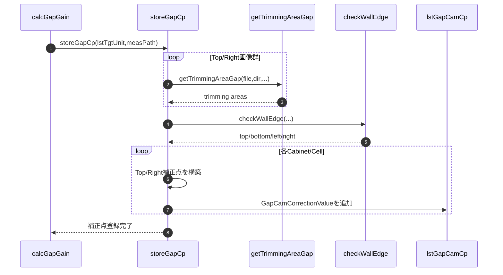
```mermaid
sequenceDiagram
    autonumber
    participant G as calcGapGain
    participant S as storeGapCp
    participant IMG as getTrimmingAreaGap
    participant E as checkWallEdge
    participant BUF as lstGapCamCp

    G->>S: storeGapCp(lstTgtUnit,measPath)
    loop Top/Right画像群
        S->>IMG: getTrimmingAreaGap(file,dir,...)
        IMG-->>S: trimming areas
    end
    S->>E: checkWallEdge(...)
    E-->>S: top/bottom/left/right
    loop 各Cabinet/Cell
        S->>S: Top/Right補正点を構築
        S->>BUF: GapCamCorrectionValueを追加
    end
    S-->>G: 補正点登録完了
```

#### 8-4-6. calcMoireCheckArea

| 項目 | 内容 |
|------|------|
| シグネチャ | `unsafe void calcMoireCheckArea(string moireArea, string black, out List<Area> lstArea)` |
| 概要 | モアレ判定対象画像と黒画像の差分から、モアレ評価用の8領域を抽出する |

引数

| No. | 引数名 | 型 | 必須 | 説明 |
|-----|--------|----|------|------|
| 1 | moireArea | string | Y | モアレ領域抽出用の対象画像パス |
| 2 | black | string | Y | 黒画像パス（差分基準） |
| 3 | lstArea(out) | List<Area> | Y | 抽出されたモアレ評価領域8点（出力） |

返り値: なし（void）

処理概要（詳細）

| 手順No. | 処理内容 | 詳細 |
|---------|----------|------|
| 1 | 入力画像読込 | `LoadMatBinary` で `moireArea` と `black` のMATを読込む。 |
| 2 | 差分画像生成 | `moire - black` を画素単位で計算し、負値は0へクリップする。 |
| 3 | 8bit化・2値化 | 差分を8bitへ変換し、`Threshold(Otsu)` で2値化する。 |
| 4 | 形態学処理 | `MorphologyEx(Close)` を適用し、領域の欠けや分断を抑える。 |
| 5 | ブロブ抽出 | `CvBlobs` で連結領域を抽出し、`calcArea` 基準の面積範囲でフィルタする。 |
| 6 | 最低数チェック | 抽出領域が8未満の場合は異常として例外送出する。 |
| 7 | 中心近傍8領域選別 | 画像中心からの距離が近い順に8領域を選び、`lstArea` として返す。 |

入力条件・前提条件

| 区分 | 条件 | NG時挙動 |
|------|------|----------|
| 入力画像 | `moireArea` / `black` のMATが読込可能であること | 画像読込例外で中断 |
| 領域抽出 | 有効ブロブが8個以上得られること | 例外送出（Large Tile表示確認を促す） |
| 画像寸法 | 2画像の寸法が一致していること | 差分計算時に異常終了の可能性 |

条件分岐仕様

| 条件 | 挙動 |
|------|------|
| `Coverity` | `using` を使ったリソース解放パスで処理する。 |
| `TempFile` | 中間の2値画像/クロージング画像を一時保存する。 |

主要呼出し先

| 呼出し先 | 役割 | 同期/非同期 |
|----------|------|--------------|
| `LoadMatBinary` | MAT画像読込 | 同期 |
| `Cv2.Threshold` | Otsu二値化 | 同期 |
| `Cv2.MorphologyEx` | 閉処理（Close） | 同期 |
| `CvBlobs` | 連結領域抽出 | 同期 |
| `calcArea` | 代表面積算出（面積フィルタ基準） | 同期 |

例外時仕様

| ケース | 捕捉方法 | 通知/伝播 | 後処理 |
|--------|----------|-----------|--------|
| 画像読込失敗 | `LoadMatBinary` 例外 | 呼出元へ再送出 | 処理中断 |
| 領域不足（<8） | 件数判定 | `Exception` 送出 | モアレ判定処理を中断 |

シーケンス図

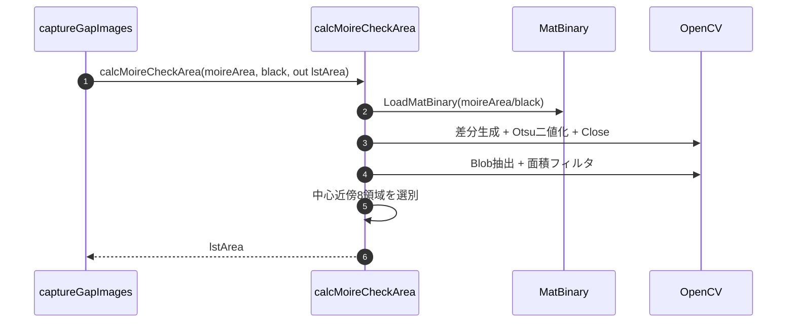
```mermaid
sequenceDiagram
    autonumber
    participant CAP as captureGapImages
    participant AREA as calcMoireCheckArea
    participant IMG as MatBinary
    participant CV as OpenCV

    CAP->>AREA: calcMoireCheckArea(moireArea, black, out lstArea)
    AREA->>IMG: LoadMatBinary(moireArea/black)
    AREA->>CV: 差分生成 + Otsu二値化 + Close
    AREA->>CV: Blob抽出 + 面積フィルタ
    AREA->>AREA: 中心近傍8領域を選別
    AREA-->>CAP: lstArea
```

#### 8-4-7. checkMoire

| 項目 | 内容 |
|------|------|
| シグネチャ | `unsafe private void checkMoire(string moireCheck, List<Area> lstArea)` |
| 概要 | 指定領域ごとにDFTベースのモアレ指数を算出し、しきい値判定する |

引数

| No. | 引数名 | 型 | 必須 | 説明 |
|-----|--------|----|------|------|
| 1 | moireCheck | string | Y | モアレ評価対象画像パス |
| 2 | lstArea | List<Area> | Y | 評価対象のROI領域リスト |

返り値: なし（void）

処理概要（詳細）

| 手順No. | 処理内容 | 詳細 |
|---------|----------|------|
| 1 | 判定条件準備 | `moireThreshold = Settings.Ins.GapCam.MoireSpec` を取得し、結果配列を準備する。 |
| 2 | 判定画像読込 | `LoadMatBinary(moireCheck)` で評価対象画像を読込む。 |
| 3 | ROIサイズ最適化 | 各 `Area` について正方ROIを作成し、`Dft.GetOptimalSize` でDFT最適サイズへ調整する。 |
| 4 | ROI正規化 | ROIの平均輝度で正規化し、行/列方向のシェーディング補正を適用する。 |
| 5 | 周波数解析 | `Dft` でスペクトラム画像を生成し、低周波中心成分を除外して指標値（標準偏差/平均）を算出する。 |
| 6 | 領域別指標蓄積 | 各ROIのモアレ指標を `moireValue[n]` へ格納する。 |
| 7 | 総合判定 | 全領域平均を `moire` とし、`moire > moireThreshold` なら例外送出する。 |

入力条件・前提条件

| 区分 | 条件 | NG時挙動 |
|------|------|----------|
| 判定画像 | `moireCheck` のMATが読込可能であること | 読込例外で中断 |
| 領域リスト | `lstArea` が空でないこと | 平均計算不正/判定不能 |
| ROIサイズ | DFT最適サイズが1以上で算出可能であること | 例外送出（表示状態確認を促す） |

条件分岐仕様

| 条件 | 挙動 |
|------|------|
| `Coverity` | `using` ベースで中間Matの解放パスを分岐する。 |
| `TempFile` | ROIログ画像（原画像/補正後/DFT）を一時保存する。 |

主要呼出し先

| 呼出し先 | 役割 | 同期/非同期 |
|----------|------|--------------|
| `LoadMatBinary` | 判定画像読込 | 同期 |
| `Dft.GetOptimalSize` | DFT可能サイズ算出 | 同期 |
| `Dft.TransForm` / `GetSpectrumImage` | 周波数スペクトラム生成 | 同期 |
| `Cv2.MeanStdDev` | 指標値算出（平均・標準偏差） | 同期 |

例外時仕様

| ケース | 捕捉方法 | 通知/伝播 | 後処理 |
|--------|----------|-----------|--------|
| 最適サイズ算出不能 | `size == 1` 判定 | `Exception` 送出 | モアレ判定を中断 |
| モアレ過大 | `moire > moireThreshold` | `Exception` 送出 | 上位で計測失敗として扱う |
| 画像読込失敗 | `LoadMatBinary` 例外 | 呼出元へ再送出 | 処理中断 |

シーケンス図

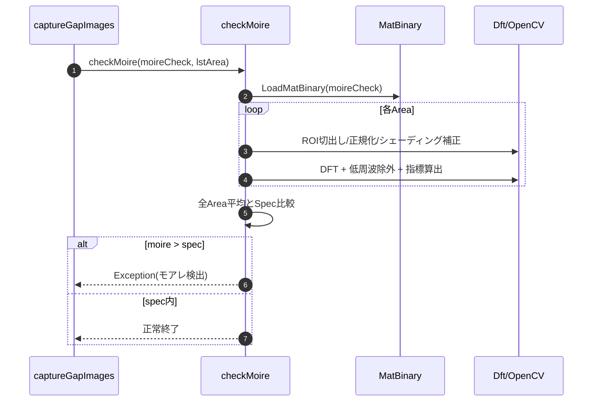
```mermaid
sequenceDiagram
    autonumber
    participant CAP as captureGapImages
    participant CHK as checkMoire
    participant IMG as MatBinary
    participant DFT as Dft/OpenCV

    CAP->>CHK: checkMoire(moireCheck, lstArea)
    CHK->>IMG: LoadMatBinary(moireCheck)
    loop 各Area
        CHK->>DFT: ROI切出し/正規化/シェーディング補正
        CHK->>DFT: DFT + 低周波除外 + 指標算出
    end
    CHK->>CHK: 全Area平均とSpec比較
    alt moire > spec
        CHK-->>CAP: Exception(モアレ検出)
    else spec内
        CHK-->>CAP: 正常終了
    end
```

#### 8-4-8. calcGapGain

| 項目 | 内容 |
|------|------|
| シグネチャ | `unsafe private void calcGapGain(List<UnitInfo> lstTgtUnit, string measPath)` |
| 概要 | GapPos/フラット白スイング画像を用いて補正点ごとのコントラスト特性を回帰し、最終補正ゲインを `lstGapCamCp` へ反映する |

引数

| No. | 引数名 | 型 | 必須 | 説明 |
|-----|--------|----|------|------|
| 1 | lstTgtUnit | List<UnitInfo> | Y | 補正対象 Unit 一覧（`storeGapCp` の補正点生成に使用） |
| 2 | measPath | string | Y | Gap関連画像/結果CSVの入出力ディレクトリ |

返り値: なし（void）

処理概要（詳細）

| 手順No. | 処理内容 | 詳細 |
|---------|----------|------|
| 1 | 前処理実行判定 | `m_GapStatus` が `Before` または `Measure` の場合のみ、対象領域生成・補正点構築・GapPos再計算を実施する。 |
| 2 | 対象領域マスク生成 | `makeTargetArea` を呼び出し、黒画像差分から解析対象マスクを生成する（`Reflection`/`MultiController` で分岐）。 |
| 3 | 補正点構築 | `storeGapCp(lstTgtUnit, measPath)` を実行し、`lstGapCamCp`（Unit/Cell補正点集合）を構築する。 |
| 4 | GapPos平均化 | `GapPos*.matbin(x)` を `CaptureNum` 枚ロードして平均化し、`matAvg` を作成する。 |
| 5 | GapPos更新 | `fn_Flat` を読込んで `calcGapPos(matAvg, flat, measPath)` を実行し、`m_MatGapPos` を更新する。 |
| 6 | レベル一覧抽出 | ステータス別ファイル群（`GapBefore_*` / `GapResult_*` / `GapMeasure_*`）から信号レベルを重複排除して昇順化する。 |
| 7 | レベル別点ゲイン算出 | 各レベルで `_fn_FlatWhite` を設定し、`calcCpGainRaw(measPath)` を呼び出して各補正点の `GapGain/Slope/Offset` を更新する。 |
| 8 | 回帰入力系列作成 | `lstGapCamCp` を走査し、補正点ごとに `GapSwing` を作成して `GapMeas(level, slope, offset, gapGain)` を追加する。 |
| 9 | 一次回帰 | 各 `GapSwing` の `Meas` から `Point2f(x=RatioLevel, y=GapGain)` を作成し `Cv2.FitLine(DistanceTypes.L1)` を実行する。戻り値 `line` から `a = line.Vy / line.Vx`、`b = -line.Vy / line.Vx * line.X1 + line.Y1` を算出し、`currentSigLevel = pow(m_MeasureLevel / 1023, 2.2)` を求める。続いて `TargetSigLevel = (Settings.Ins.GapCam.TargetGain - b) / a`、`CurrentContrast = a * currentSigLevel + b`、`Gain = currentSigLevel / TargetSigLevel` を計算して `GapSwing` へ格納する。 |
| 10 | 近傍再回帰 | ターゲット信号レベル±10% に入る点が3点超ある場合、近傍点のみで再回帰して推定値を更新する。 |
| 11 | 結果ファイル名決定 | `m_GapStatus` と `m_AdjustCount`、`NoEncript` に応じて `GapBefore`/`GapMeasure`/`GapAdjust(_n)` の拡張子（`.csv`/`.csvx`）を決定する。 |
| 12 | 結果出力 | `GapSwing` 一覧を1行ずつ書き出す。`NO_CAP` 時はヘッダ2行（SignalLevel/RatioLevel）も出力する。 |
| 13 | 復号確認出力（任意） | 暗号化出力時は確認用に `.csvx` を読込んで復号し、拡張子なしファイルへ平文を書き戻す。 |
| 14 | 最終ゲイン反映 | `listGapSwing[idx].Gain` を `lstGapCamCp` の Unit/Cell 各 `cp.GapGain` へ順次反映する。 |

入力条件・前提条件

| 区分 | 条件 | NG時挙動 |
|------|------|----------|
| 入力画像群 | `GapPos`、`fn_Flat`、レベル別 `GapBefore/Result/Measure` 画像が揃っていること | `LoadMatBinary`/`Directory.GetFiles` 例外で中断 |
| 補正点前提 | `lstTgtUnit` が補正対象の配置条件を満たすこと | `storeGapCp` 下位処理で中断 |
| 回帰設定 | `Settings.Ins.GapCam.TargetGain`、`m_MeasureLevel`、`CaptureNum` が妥当であること | 推定ゲインが不安定または異常値 |
| 出力先 | `measPath` に書込み権限があること | CSV/CSVX 書込み例外で中断 |

主要状態更新

| 状態変数 | 更新内容 | 更新タイミング |
|----------|----------|----------------|
| `lstGapCamCp` | 補正点群生成後、最終的に各 `cp.GapGain` を更新 | 手順3,14 |
| `_fn_FlatWhite` | レベルごとの解析対象ファイル名へ切替え | 手順7 |
| `m_MatGapPos` | GapPos2値化画像を更新 | 手順5 |
| `GapBefore/Measure/Adjust(.csv/.csvx)` | 回帰結果を保存 | 手順12 |
| `winProgress` | GapPos処理のメッセージ・進捗を更新 | 手順5 前後 |

条件分岐仕様

| 条件 | 挙動 |
|------|------|
| `m_GapStatus == Before or Measure` | 前処理（`makeTargetArea`/`storeGapCp`/`calcGapPos`）を実行する。`Result` 時はスキップ。 |
| `Reflection` | `makeTargetArea` 呼出し時の黒画像指定を `_0` 付きに切替える。 |
| `MultiController` | `makeTargetArea` を Top/Right の2回呼び出し、方向別マスクを生成する。 |
| `NoEncript` | 入力拡張子を `.matbin`、出力を `.csv` とする。未定義時は `.matbinx` / `.csvx` を使用。 |
| `CorrectTargetEdge` | `GapSwing` へ積む代表座標の採用条件（TopLeft/RightTop/BottomLeft/LeftTop）を拡張する。 |
| `RotateRect` | `GapSwing` 生成時の座標取得に `Center` を使用（未定義時は `CenterPos`）。 |
| `NO_CAP` | 出力ファイル先頭にヘッダ行（SignalLevel/RatioLevel）を追加する。 |

主要呼出し先

| 呼出し先 | 役割 | 同期/非同期 |
|----------|------|--------------|
| `makeTargetArea` | 解析対象マスク生成 | 同期 |
| `storeGapCp` | 補正点群構築 | 同期 |
| `calcGapPos` | GapPos平均画像から補正点位置更新 | 同期 |
| `calcCpGainRaw` | レベル単位の点ゲイン計算 | 同期 |
| `Cv2.FitLine` | スイング系列の線形回帰 | 同期 |
| `Encrypt` / `Decrypt` | `.csvx` 暗号化出力と確認復号 | 同期 |

例外時仕様（中断含む）

| ケース | 捕捉方法 | 通知/伝播 | 後処理 |
|--------|----------|-----------|--------|
| 画像読込失敗 | `LoadMatBinary` 系例外 | 呼出元へ再送出 | 解析中断 |
| 領域/補正点生成失敗 | `makeTargetArea` / `storeGapCp` / `calcGapPos` 下位例外 | 呼出元へ再送出 | 補正点未確定で中断 |
| 回帰失敗 | `Cv2.FitLine` 下位例外 | 呼出元へ再送出 | 当該解析を中断 |
| 出力ファイル失敗 | CSV書込み/暗号化例外 | 呼出元へ再送出 | 解析結果未保存 |

シーケンス図

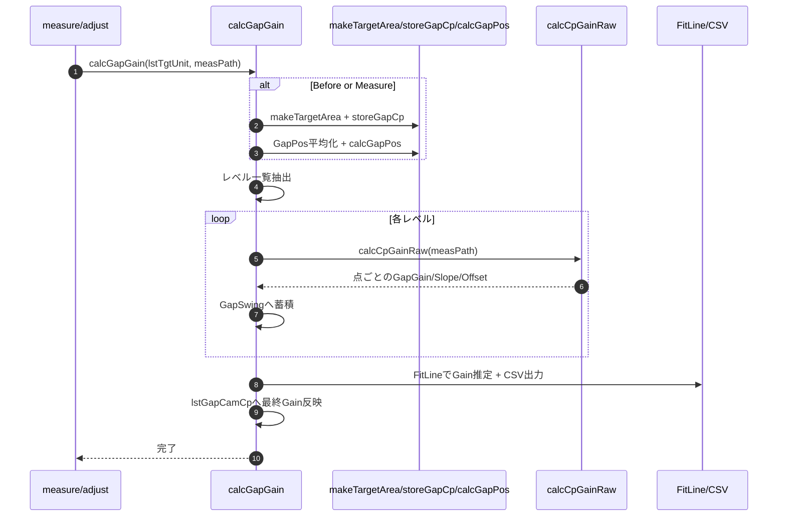
```mermaid
sequenceDiagram
    autonumber
    participant M as measure/adjust
    participant G as calcGapGain
    participant A as makeTargetArea/storeGapCp/calcGapPos
    participant C as calcCpGainRaw
    participant F as FitLine/CSV

    M->>G: calcGapGain(lstTgtUnit, measPath)
    alt Before or Measure
        G->>A: makeTargetArea + storeGapCp
        G->>A: GapPos平均化 + calcGapPos
    end
    G->>G: レベル一覧抽出
    loop 各レベル
        G->>C: calcCpGainRaw(measPath)
        C-->>G: 点ごとのGapGain/Slope/Offset
        G->>G: GapSwingへ蓄積
    end
    G->>F: FitLineでGain推定 + CSV出力
    G->>G: lstGapCamCpへ最終Gain反映
    G-->>M: 完了
```

#### 8-4-9. makeTargetArea

| 項目 | 内容 |
|------|------|
| シグネチャ | `unsafe private void makeTargetArea(string file, string black, ExpandType type)` / `unsafe private void makeTargetArea(string file, string black)` |
| 概要 | 対象エリア画像と黒画像から有効マスクを生成し、過飽和（サチリ）を検出する |

引数

| No. | 引数名 | 型 | 必須 | 説明 |
|-----|--------|----|------|------|
| 1 | file | string | Y | 対象エリア画像（MAT）のベースパス |
| 2 | black | string | Y | 黒画像（MAT）のベースパス |
| 3 | type | ExpandType | N | MultiController時の対象種別（Top/Right） |

返り値: なし（void）

処理概要（詳細）

| 手順No. | 処理内容 | 詳細 |
|---------|----------|------|
| 1 | 進捗更新 | `winProgress` とログへ「Calc Target area」を出力する。 |
| 2 | 入力画像読込 | `LoadMatBinary` で `file` と `black` を読込む（`black.matbin` 不在時は `_0` をフォールバック）。 |
| 3 | 差分画像生成 | `file - black` を画素単位で計算し、負値は0へクリップした16bit差分画像を作成する。 |
| 4 | 2値化前処理 | 差分を8bit化し、`Threshold(Otsu)` で2値化して候補領域を抽出する。 |
| 5 | 領域抽出 | `CvBlobs` で連結領域を抽出し、`GapTrimmingAreaMin` 以上でフィルタする。 |
| 6 | 対象マスク生成 | 最大Blob輪郭を描画→FloodFill→反転→分離し、`m_MatMask` または `m_MatMaskTop/Right` を更新する。 |
| 7 | サチリチェック | マスク適用画像を作成し、高輝度2値化（0.9*255）後のBlob有無で過飽和を判定する。 |
| 8 | 結果判定 | サチリBlobが存在する場合は例外送出、なければ正常終了する。 |

入力条件・前提条件

| 区分 | 条件 | NG時挙動 |
|------|------|----------|
| 入力画像 | `file` と `black` のMATが読込可能であること | 例外送出で中断 |
| 画像整合 | 2画像の寸法が一致していること | 差分処理で異常終了の可能性 |
| 領域抽出 | 有効Blobが検出できること | 下位処理で例外またはマスク不正 |
| 輝度条件 | 過飽和が発生していないこと | 例外送出（Wall画像設定確認） |

主要状態更新

| 状態変数 | 更新内容 | 更新タイミング |
|----------|----------|----------------|
| `m_MatMask` | 単一系の対象マスクを更新 | 手順6 |
| `m_MatMaskTop` / `m_MatMaskRight` | 複数コントローラ系のTop/Rightマスクを更新 | 手順6 |
| `winProgress` | 対象領域計算の進捗を更新 | 手順1 |

条件分岐仕様

| 条件 | 挙動 |
|------|------|
| `MultiController` | `type` に応じて Top/Right の別マスクへ保存する。 |
| `Coverity` | `using` ベースの解放経路で一時Mat管理を行う。 |
| `TempFile` | 中間画像（MeasArea/Bin/TargetArea/SaturationCheck）を保存する。 |
| `MultiControllerTest` | 実測差分の代わりに `Temp\topWindow.jpg/rightWindow.jpg` を使用する。 |

主要呼出し先

| 呼出し先 | 役割 | 同期/非同期 |
|----------|------|--------------|
| `LoadMatBinary` | MAT画像読込 | 同期 |
| `Cv2.Threshold` | Otsu二値化/高輝度二値化 | 同期 |
| `CvBlobs` | 連結領域抽出・最大Blob取得 | 同期 |
| `Cv2.BitwiseNot` | マスク反転生成 | 同期 |

例外時仕様（中断含む）

| ケース | 捕捉方法 | 通知/伝播 | 後処理 |
|--------|----------|-----------|--------|
| 入力読込失敗 | `try-catch`（`LoadMatBinary`） | `Exception(ex.Message)` を再送出 | 途中Matを解放 |
| マスク生成失敗 | Blob/輪郭処理の下位例外 | 呼出元へ再送出 | 処理中断 |
| 過飽和検出 | `maxBlob != null` 判定 | `Exception` 送出 | 補正処理を中断 |

シーケンス図

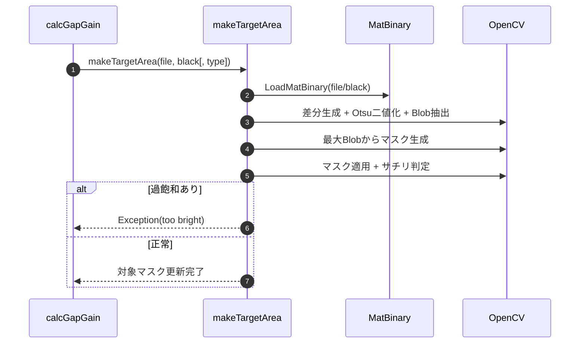
```mermaid
sequenceDiagram
    autonumber
    participant G as calcGapGain
    participant T as makeTargetArea
    participant IMG as MatBinary
    participant CV as OpenCV

    G->>T: makeTargetArea(file, black[, type])
    T->>IMG: LoadMatBinary(file/black)
    T->>CV: 差分生成 + Otsu二値化 + Blob抽出
    T->>CV: 最大Blobからマスク生成
    T->>CV: マスク適用 + サチリ判定
    alt 過飽和あり
        T-->>G: Exception(too bright)
    else 正常
        T-->>G: 対象マスク更新完了
    end
```

#### 8-4-10. getTrimmingAreaGap

| 項目 | 内容 |
|------|------|
| シグネチャ | `unsafe private void getTrimmingAreaGap(string file, CorrectPosition pos, List<UnitInfo> lstTgtUnit, out RotatedRect[,] lstArea)` / `unsafe private void getTrimmingAreaGap(string file, CorrectPosition pos, List<UnitInfo> lstTgtUnit, out Area[,] lstArea)` / `unsafe private void getTrimmingAreaGap(string file, CorrectPosition pos, List<UnitInfo> lstTgtUnit, out List<Area> lstArea)` |
| 概要 | タイル表示画像をマスク・2値化・Blob解析して、補正点生成用トリミング領域群を抽出する |

引数

| No. | 引数名 | 型 | 必須 | 説明 |
|-----|--------|----|------|------|
| 1 | file | string | Y | 解析対象画像（MAT）のベースパス |
| 2 | pos | CorrectPosition | Y | 解析方向（Top系/Right系） |
| 3 | lstTgtUnit | List<UnitInfo> | Y | 対象Unit一覧（タイル期待数算出に使用） |
| 4 | lstArea(out) | `RotatedRect[,]` / `Area[,]` / `List<Area>` | Y | 抽出されたトリミング領域（条件コンパイルで型が切替） |

返り値: なし（void）

処理概要（詳細）

| 手順No. | 処理内容 | 詳細 |
|---------|----------|------|
| 1 | 画像読込 | `LoadMatBinary` で `file` を読み、入力画素（16bit）を取得する。 |
| 2 | 半タイル画像読込（任意） | `MultiController` かつ半タイル有効時は `file + "_Half"` を読み込み、後段の差分加算に使用する。 |
| 3 | 黒差分準備（任意） | `Reflection` 時は `fn_BlackFile + "_0"` を読込んで反射成分除去用バッファを準備する。 |
| 4 | マスク適用画像生成 | `m_MatMask`（または `m_MatMaskTop/Right`）で有効画素を選別し、必要に応じて `Trim - Black (+Half-Black)` を計算する。 |
| 5 | 8bit化・2値化 | 16bit画像を8bitへ変換し、`Threshold(Otsu)` で2値化する。 |
| 6 | 形態学処理 | マスクコピー後に `MorphologyEx(Close)` を実施し、タイル領域の欠損を補完する。 |
| 7 | Blob抽出・ノイズ除去 | `CvBlobs` で連結領域を抽出し、平均面積ベースで小領域を除去する。 |
| 8 | タイル配列化 | `getTilePosition`（MultiController）または期待タイル数計算（非CaptureTilt）で、必要数・並びを確定する。 |
| 9 | 出力領域生成 | `RotateRect` 時は輪郭から `MinAreaRect` を生成、非RotateRect時は `blob.Rect` から `Area` を生成して `lstArea` へ格納する。 |
| 10 | 後処理 | 一時 `Mat` / マスクを解放し、必要時は `TempFile` へ中間画像を保存する。 |

入力条件・前提条件

| 区分 | 条件 | NG時挙動 |
|------|------|----------|
| 入力画像 | `file` のMATが存在し読込可能であること | 下位例外を再送出して中断 |
| マスク状態 | `m_MatMask`（または `m_MatMaskTop/Right`）が事前に生成済みであること | 抽出結果不正または例外 |
| 対象選択 | `lstTgtUnit` が対象範囲を正しく表していること | 期待タイル数不一致で例外 |
| 画像品質 | タイルが十分に点灯し、ノイズより面積優位であること | Blob不足例外で中断 |

主要状態更新

| 状態変数 | 更新内容 | 更新タイミング |
|----------|----------|----------------|
| `lstArea(out)` | 方向別トリミング領域を格納 | 手順9 |
| `_mask`（ローカル） | 使用方向に応じたマスクへ差替え | 手順4 |
| `gray/binary/closing`（ローカル） | 2値化・形態学処理結果を保持 | 手順5-6 |

条件分岐仕様

| 条件 | 挙動 |
|------|------|
| `CaptureTilt` | 2次元配列（`Area[,]`/`RotatedRect[,]`）を返す。無効時は `List<Area>` を返す。 |
| `RotateRect` | Blob外接矩形ではなく輪郭ベースの最小回転矩形を算出する。 |
| `MultiController` | `m_MatMaskTop/Right` と `m_topTileNum*`/`m_rightTileNum*` を使って方向別に配列化する。 |
| `CorrectTargetEdge` | 壁端補正時の有効インデックス範囲（start/end x,y）を調整する。 |
| `Reflection` | `black` 差分を用いた輝度補正で反射成分を低減する。 |
| `MultiControllerTest` | 実画像の代わりに `Temp\topTile.jpg/rightTile.jpg` を入力として使う。 |
| `TempFile` | Gray/Binary/Select などの中間画像を保存する。 |
| `Coverity` | `using` 管理と例外経路リーク対策を有効化する。 |

主要呼出し先

| 呼出し先 | 役割 | 同期/非同期 |
|----------|------|--------------|
| `LoadMatBinary` | MAT画像読込 | 同期 |
| `Cv2.Threshold` | Otsu二値化 | 同期 |
| `Cv2.MorphologyEx` | クロージング処理 | 同期 |
| `CvBlobs` | Blob抽出・面積フィルタ | 同期 |
| `getTilePosition` | タイル位置の列/行ソート | 同期 |
| `checkWallEdge` | 壁端情報判定（CorrectTargetEdge時） | 同期 |

例外時仕様（中断含む）

| ケース | 捕捉方法 | 通知/伝播 | 後処理 |
|--------|----------|-----------|--------|
| 入力画像読込失敗 | `LoadMatBinary` 下位例外 | 呼出元へ再送出 | 一時Mat解放後に中断 |
| タイル不足 | `blobs.Count < spec` または `getTilePosition` 例外 | `Exception` 送出 | 補正点生成フローを中断 |
| タイル並び替え失敗 | 上下探索で候補なし | `Exception("Failed to sort tiles...")` | 処理中断 |
| マスク/閾値異常 | 下位OpenCV例外 | 呼出元へ再送出 | 中間結果は破棄 |

シーケンス図

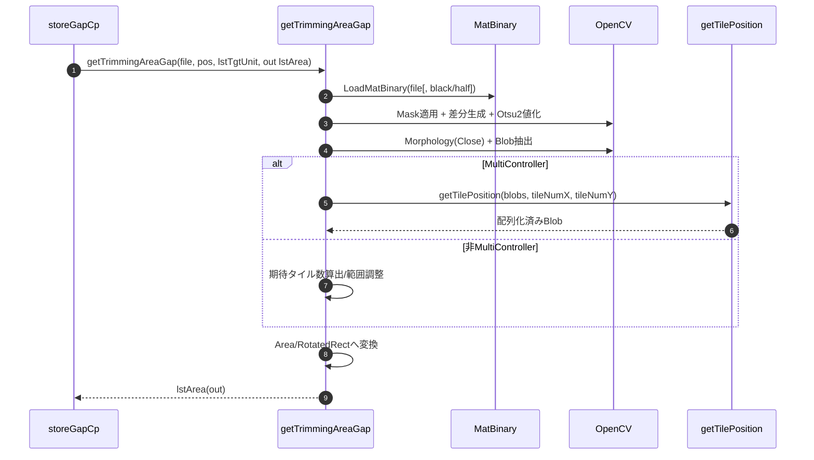
```mermaid
sequenceDiagram
    autonumber
    participant S as storeGapCp
    participant T as getTrimmingAreaGap
    participant IMG as MatBinary
    participant CV as OpenCV
    participant TP as getTilePosition

    S->>T: getTrimmingAreaGap(file, pos, lstTgtUnit, out lstArea)
    T->>IMG: LoadMatBinary(file[, black/half])
    T->>CV: Mask適用 + 差分生成 + Otsu2値化
    T->>CV: Morphology(Close) + Blob抽出
    alt MultiController
        T->>TP: getTilePosition(blobs, tileNumX, tileNumY)
        TP-->>T: 配列化済みBlob
    else 非MultiController
        T->>T: 期待タイル数算出/範囲調整
    end
    T->>T: Area/RotatedRectへ変換
    T-->>S: lstArea(out)
```

#### 8-4-11. getTilePosition

| 項目 | 内容 |
|------|------|
| シグネチャ | `void getTilePosition(CvBlobs blobs, int hNum, int vNum, out CvBlob[,] aryBlob)` |
| 概要 | Blob集合を列方向に再配置し、各列をY座標順に整列したタイル配列 `aryBlob[hNum,vNum]` を生成する |

引数

| No. | 引数名 | 型 | 必須 | 説明 |
|-----|--------|----|------|------|
| 1 | blobs | CvBlobs | Y | 入力Blob集合（タイル候補） |
| 2 | hNum | int | Y | 想定タイル列数 |
| 3 | vNum | int | Y | 想定タイル行数 |
| 4 | aryBlob(out) | CvBlob[,] | Y | 列×行に整列済みタイル配列 |

返り値: なし（void）

処理概要（詳細）

| 手順No. | 処理内容 | 詳細 |
|---------|----------|------|
| 1 | 入力妥当性確認 | `ShowPattern_CamPos` 時は `blobs == null` を即時例外とする。 |
| 2 | 出力配列確保 | `aryBlob = new CvBlob[hNum, vNum]` を初期化する。 |
| 3 | 必要個数チェック | `blobs.Count < hNum * vNum` の場合、個数不一致例外を送出する。 |
| 4 | 面積上位の候補抽出 | `LargestBlob()` を `hNum*vNum` 回取得し、`listBlobs` へ移してノイズ成分を除外する。 |
| 5 | 再チェック | 抽出後 `listBlobs.Count != hNum * vNum` の場合、個数不一致例外を送出する。 |
| 6 | 列起点決定 | 各列ごとに、残候補から最小X重心Blobを選び列の起点（index=0）として登録する。 |
| 7 | 上下探索で列補完 | 起点から上方向（-45〜-135°）/下方向（45〜135°）の最近傍Blobを探索し、距離が短い側を順次採用する。 |
| 8 | 単行列の特例処理 | `vNum == 1` の場合は探索を省略し、起点をそのまま `aryBlob[x,0]` へ格納する。 |
| 9 | 列内Yソート | 列分の候補が揃ったら `Centroid.Y` 昇順で並び替え、`aryBlob[x,*]` に確定する。 |
| 10 | 全列完了 | `hNum` 列の処理完了後、呼出元へ整列配列を返す。 |

入力条件・前提条件

| 区分 | 条件 | NG時挙動 |
|------|------|----------|
| 入力集合 | `blobs` が有効な連結領域集合であること | `No tiles found` 例外（条件付き） |
| 期待個数 | タイル候補が `hNum*vNum` 以上あること | 個数不一致例外で中断 |
| 幾何条件 | 列内で上下方向最近傍探索が成立する配置であること | 列ソート失敗例外で中断 |

主要状態更新

| 状態変数 | 更新内容 | 更新タイミング |
|----------|----------|----------------|
| `aryBlob` | 列・行整列済みの最終タイル配列を構築 | 手順2,9 |
| `listBlobs` | 候補タイルの作業集合を保持し、採用ごとに削除 | 手順4,6-7 |
| `u_ref` / `d_ref` | 上下探索の基準重心を更新 | 手順7 |

条件分岐仕様

| 条件 | 挙動 |
|------|------|
| `ShowPattern_CamPos` | `blobs == null` のとき早期例外（`No tiles found.`）を有効化する。 |
| `vNum == 1` | 上下探索を実施せず、列起点Blobを直接結果へ格納する。 |
| `uBlob/dBlob` 取得結果 | 双方未検出は失敗例外、片側のみ/両側検出時は距離比較で採用側を決定する。 |

主要呼出し先

| 呼出し先 | 役割 | 同期/非同期 |
|----------|------|--------------|
| `blobs.LargestBlob` | 面積上位Blobの順次取得 | 同期 |
| `blobs.Remove` | 採用済みBlobの除外 | 同期 |
| `Math.Asin` / `Math.Sqrt` | 方向判定角度・距離計算 | 同期 |
| `OrderBy(blob => blob.Centroid.Y)` | 列内Y座標ソート | 同期 |

例外時仕様（中断含む）

| ケース | 捕捉方法 | 通知/伝播 | 後処理 |
|--------|----------|-----------|--------|
| Blob未入力 | `blobs == null`（条件付き） | `Exception("No tiles found.")` | 処理中断 |
| 個数不足 | `blobs.Count < hNum*vNum` / 抽出後不一致 | `Exception("The number of found tiles is not correct...")` | 処理中断 |
| 列探索失敗 | 上下探索で候補が得られない | `Exception("Failed to sort tiles. (Column=...)")` | 処理中断 |

シーケンス図

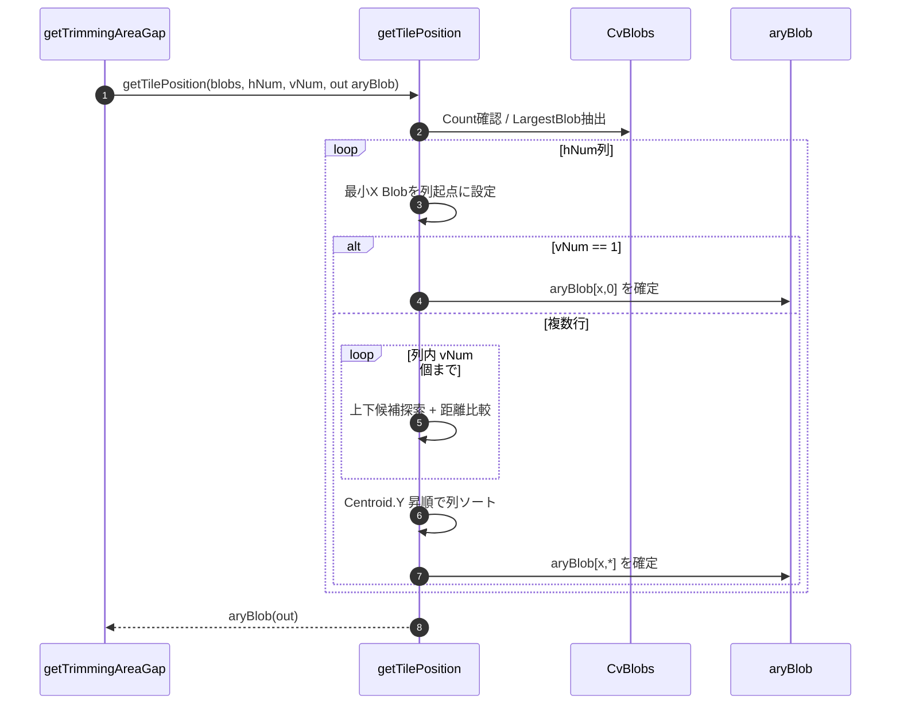
```mermaid
sequenceDiagram
    autonumber
    participant T as getTrimmingAreaGap
    participant P as getTilePosition
    participant B as CvBlobs
    participant A as aryBlob

    T->>P: getTilePosition(blobs, hNum, vNum, out aryBlob)
    P->>B: Count確認 / LargestBlob抽出
    loop hNum列
        P->>P: 最小X Blobを列起点に設定
        alt vNum == 1
            P->>A: aryBlob[x,0] を確定
        else 複数行
            loop 列内 vNum 個まで
                P->>P: 上下候補探索 + 距離比較
            end
            P->>P: Centroid.Y 昇順で列ソート
            P->>A: aryBlob[x,*] を確定
        end
    end
    P-->>T: aryBlob(out)
```

#### 8-4-12. getTilePos

| 項目 | 内容 |
|------|------|
| シグネチャ | `void getTilePos(CvBlobs blobs, int[] tileNum, out CvBlob[][] aryBlob)` |
| 概要 | 列ごとに必要タイル数が異なる条件で、Blob集合を列単位に整列してジャグ配列 `aryBlob` に格納する |

引数

| No. | 引数名 | 型 | 必須 | 説明 |
|-----|--------|----|------|------|
| 1 | blobs | CvBlobs | Y | 入力Blob集合（タイル候補） |
| 2 | tileNum | int[] | Y | 各列の期待タイル数配列 |
| 3 | aryBlob(out) | CvBlob[][] | Y | 列ごとの可変長タイル配列 |

返り値: なし（void）

処理概要（詳細）

| 手順No. | 処理内容 | 詳細 |
|---------|----------|------|
| 1 | 出力配列初期化 | `tileNum.Length` 列のジャグ配列を確保し、各列に `tileNum[i]` 要素を割り当てる。 |
| 2 | 入力妥当性確認 | `blobs == null` の場合は `No tiles found.` 例外を送出する。 |
| 3 | 必要総数算出 | `tileNum` の総和 `num` を計算し、必要Blob総数を決定する。 |
| 4 | 個数チェック | `blobs.Count < num` の場合、個数不一致例外を送出する。 |
| 5 | 候補抽出 | `LargestBlob()` を `num` 回取得して `listBlobs` に退避し、採用済みを `blobs.Remove` で除外する。 |
| 6 | 再チェック | `listBlobs.Count != num` の場合、個数不一致例外を送出する。 |
| 7 | 列起点選定 | 各列 `x` ごとに、残候補の最小X重心Blobを起点として `aryClmBlob[0]` に登録する。 |
| 8 | 上下探索で列充填 | 起点から上方向/下方向の最近傍Blobを角度条件（上:-45〜-135°、下:45〜135°）で探索し、距離が短い側を順次採用する。 |
| 9 | 列内Yソート | 列長 `tileNum[x]` 分が揃ったら `Centroid.Y` 昇順でソートし、`aryBlob[x]` に確定する。 |
| 10 | 全列完了 | 全列の整列完了後、呼出元へ `aryBlob` を返す。 |

入力条件・前提条件

| 区分 | 条件 | NG時挙動 |
|------|------|----------|
| 入力集合 | `blobs` が有効なBlob集合であること | `No tiles found.` 例外で中断 |
| 列定義 | `tileNum` が列ごとの期待数を正しく保持していること | 総数不整合または列探索失敗 |
| 期待個数 | 候補Blobが `sum(tileNum)` 以上存在すること | 個数不一致例外で中断 |

主要状態更新

| 状態変数 | 更新内容 | 更新タイミング |
|----------|----------|----------------|
| `aryBlob` | 列ごとの整列済みタイル配列を構築 | 手順1,9 |
| `listBlobs` | 作業中の候補集合を保持し、採用に応じて削除 | 手順5,7-8 |
| `u_ref` / `d_ref` | 上下探索の基準重心を更新 | 手順8 |

条件分岐仕様

| 条件 | 挙動 |
|------|------|
| `uBlob.index == -1 && dBlob.index == -1` | 列探索失敗として `Fail to sort blob. (H=x)` を送出する。 |
| `dBlob.index == -1 || uBlob.dist <= dBlob.dist` | 上側候補を採用し、`u_ref` を更新する。 |
| `uBlob.index == -1 || uBlob.dist > dBlob.dist` | 下側候補を採用し、`d_ref` を更新する。 |
| `index == tileNum[x]` | 当該列の探索を終了し、Yソート後に次列へ進む。 |

主要呼出し先

| 呼出し先 | 役割 | 同期/非同期 |
|----------|------|--------------|
| `blobs.LargestBlob` | 面積上位Blob抽出 | 同期 |
| `blobs.Remove` | 採用済みBlobの除外 | 同期 |
| `Math.Sqrt` / `Math.Asin` | 方向角・距離計算 | 同期 |
| `OrderBy(blob => blob.Centroid.Y)` | 列内のY順ソート | 同期 |

例外時仕様（中断含む）

| ケース | 捕捉方法 | 通知/伝播 | 後処理 |
|--------|----------|-----------|--------|
| 入力Blobなし | `blobs == null` | `Exception("No tiles found.")` | 処理中断 |
| 個数不足/不一致 | `blobs.Count < num` または `listBlobs.Count != num` | `Exception("The number of found tiles is not correct...")` | 処理中断 |
| 列探索失敗 | 上下候補が見つからない | `Exception("Fail to sort blob. (H=...)")` | 処理中断 |

シーケンス図

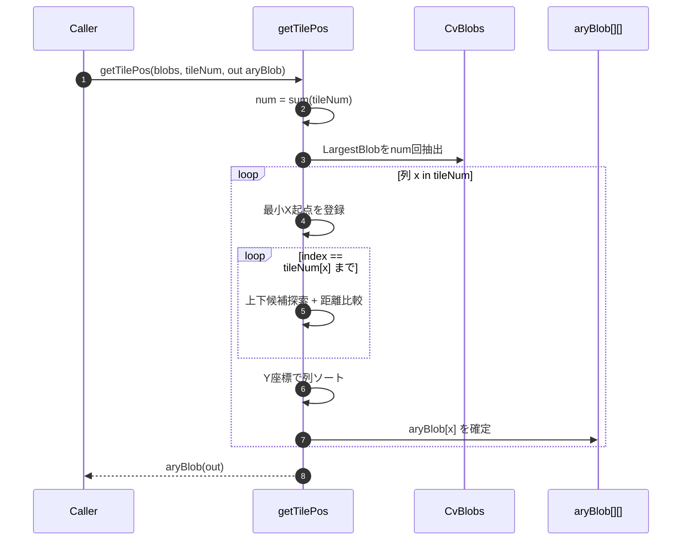
```mermaid
sequenceDiagram
    autonumber
    participant C as Caller
    participant P as getTilePos
    participant B as CvBlobs
    participant A as aryBlob[][]

    C->>P: getTilePos(blobs, tileNum, out aryBlob)
    P->>P: num = sum(tileNum)
    P->>B: LargestBlobをnum回抽出
    loop 列 x in tileNum
        P->>P: 最小X起点を登録
        loop index == tileNum[x] まで
            P->>P: 上下候補探索 + 距離比較
        end
        P->>P: Y座標で列ソート
        P->>A: aryBlob[x] を確定
    end
    P-->>C: aryBlob(out)
```

#### 8-4-13. calcGapPos

| 項目 | 内容 |
|------|------|
| シグネチャ | `unsafe private void calcGapPos(Mat mat, Mat flat, string measPath)` |
| 概要 | Gap位置計測用の平均画像にシェーディング補正とマスク処理を施し、補正点位置の推定に使用する2値化GapPos画像 `m_MatGapPos` を生成する |

引数

| No. | 引数名 | 型 | 必須 | 説明 |
|-----|--------|----|------|------|
| 1 | mat | Mat | Y | GapPos平均化済みの16bit浮動小数点画像 |
| 2 | flat | Mat | Y | シェーディング補正基準のフラット画像 |
| 3 | measPath | string | Y | マスクファイル（fn_MaskFile）の参照先パス |

返り値: なし（void）

処理概要（詳細）

| 手順No. | 処理内容 | 詳細 |
|---------|----------|------|
| 1 | 早期終了 | `MultiControllerTest` 時は処理を行わず即時 `return` する。 |
| 2 | マスク画像取得 | `MultiController` 時は `m_MatMaskTop` と `m_MatMaskRight` を `BitwiseOr` 合成。その他は `m_MatMask.Clone()` を使用する。 |
| 3 | フラット平均算出 | マスク有効画素内の `flat`（`Reflection` 時は `flat - black`）輝度総和を計算し、画素数で除算して平均 `avg` を求める。 |
| 4 | シェーディング補正 | 有効画素ごとに `gain = avg / flat[x,y]` を乗算して輝度を正規化し、16bit補正済み画像 `_mat` を生成する（`Reflection` 時は `mat - black` 差分に対して補正）。 |
| 5 | 8bit変換 | `_mat` を `1/16` スケールで 8bit グレー画像 `gray` へ変換する。 |
| 6 | マスク適用 | `gray` にマスクをコピーして `maskedGray` を生成し、マスク領域のみ有効化する。 |
| 7 | 面積妥当性チェック | `maskedGray` をOtsu2値化して最大BlobサイズとマスクBlobサイズを比較し、差が10px超の場合は検出エラーを送出する（`CaptureTilt` 時スキップ）。 |
| 8 | GapPos2値化 | `ImageScale_x5` 時は `maskedGray` を5倍に拡大してからOtsu2値化し、`m_MatGapPos` へ格納する。無効時は直接Otsu2値化して格納する。 |
| 9 | 後処理 | 一時 `Mat`（`gray`/`maskedGray`/`_mat`/`mask`）を解放する。 |

入力条件・前提条件

| 区分 | 条件 | NG時挙動 |
|------|------|----------|
| マスク画像 | `m_MatMask`（または `m_MatMaskTop/Right`）が有効であること | マスク適用時に異常終了 |
| フラット画像 | `flat` が `mat` と同サイズの有効な画像であること | シェーディング補正が正しく動作しない |
| GapPos検出 | ハッチパターン点灯時に有効なGap領域が写っていること | 面積チェック例外で中断 |

主要状態更新

| 状態変数 | 更新内容 | 更新タイミング |
|----------|----------|----------------|
| `m_MatGapPos` | 2値化GapPos画像を更新（旧オブジェクトを解放してから差替え） | 手順8 |

条件分岐仕様

| 条件 | 挙動 |
|------|------|
| `MultiControllerTest` | 処理全体をスキップして即時 `return`。 |
| `MultiController` | マスクを `BitwiseOr(Top, Right)` で合成する。 |
| `Reflection` | フラット・入力両方から黒画像を差し引いてシェーディング補正する。 |
| `CaptureTilt` | 面積妥当性チェック（手順7）をスキップする。 |
| `ImageScale_x5` | `maskedGray` を5倍に拡大してから2値化し、高解像度GapPos画像を生成する。 |
| `Coverity` | `using` スコープで中間Mat の例外時リークを防止する。 |
| `TempFile` | 中間画像（GapPos原画像/補正済み/マスク/GapPos2値）を保存する。 |

主要呼出し先

| 呼出し先 | 役割 | 同期/非同期 |
|----------|------|--------------|
| `LoadMatBinary` | 黒画像読込（Reflection時） | 同期 |
| `Cv2.BitwiseOr` | Top/Rightマスク合成（MultiController時） | 同期 |
| `Cv2.Resize` | GapPos画像の5倍拡大（ImageScale_x5時） | 同期 |
| `CvBlobs` | マスク/GapPos Blobサイズ取得（面積チェック用） | 同期 |
| `Mat.Threshold(Otsu)` | GapPos最終2値化 | 同期 |

例外時仕様（中断含む）

| ケース | 捕捉方法 | 通知/伝播 | 後処理 |
|--------|----------|-----------|--------|
| GapPos検出領域が小さい | `|maskWidth - gapPosWidth| > 10 || |maskHeight - gapPosHeight| > 10` 判定 | `Exception("The detected Gap area size is too small...")` 送出 | `m_MatGapPos` は未更新のまま |
| 黒画像読込失敗 | `LoadMatBinary` 下位例外（Reflection時） | 呼出元へ再送出 | 処理中断 |

シーケンス図

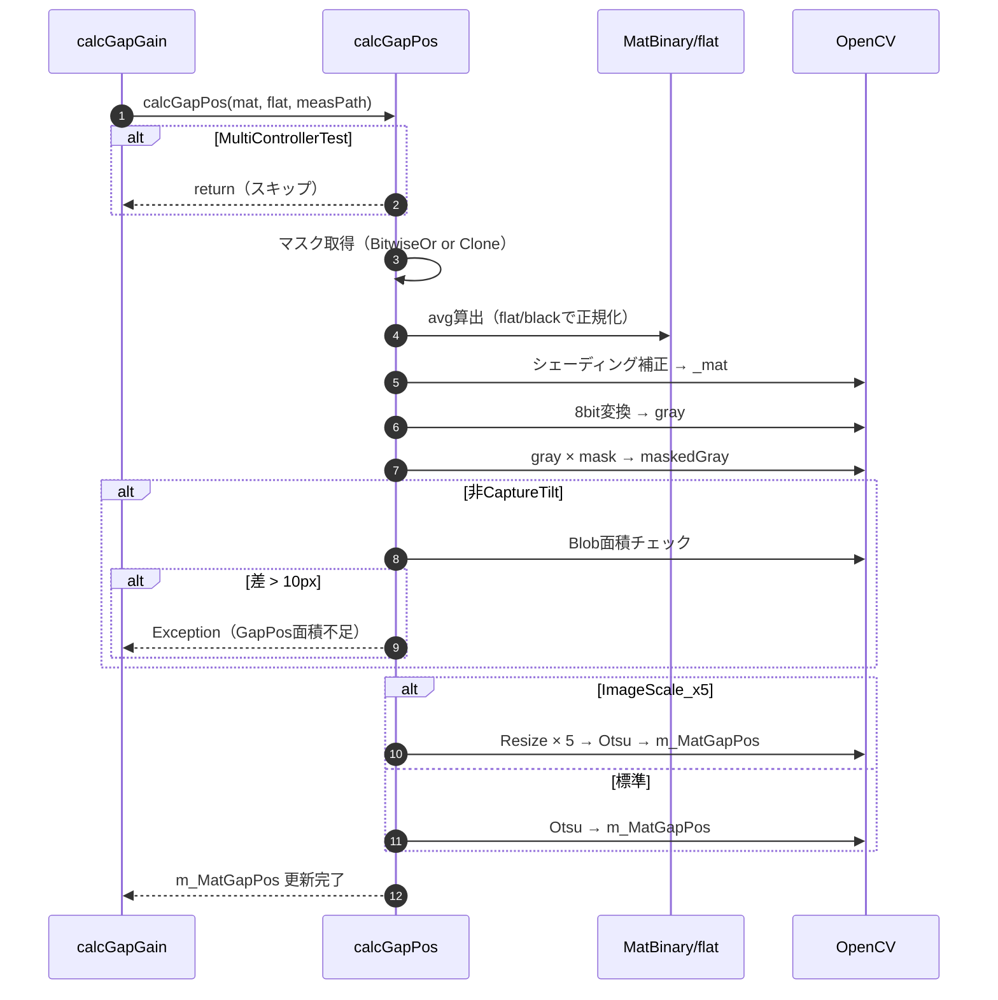
```mermaid
sequenceDiagram
    autonumber
    participant G as calcGapGain
    participant P as calcGapPos
    participant IMG as MatBinary/flat
    participant CV as OpenCV

    G->>P: calcGapPos(mat, flat, measPath)
    alt MultiControllerTest
        P-->>G: return（スキップ）
    end
    P->>P: マスク取得（BitwiseOr or Clone）
    P->>IMG: avg算出（flat/blackで正規化）
    P->>CV: シェーディング補正 → _mat
    P->>CV: 8bit変換 → gray
    P->>CV: gray × mask → maskedGray
    alt 非CaptureTilt
        P->>CV: Blob面積チェック
        alt 差 > 10px
            P-->>G: Exception（GapPos面積不足）
        end
    end
    alt ImageScale_x5
        P->>CV: Resize × 5 → Otsu → m_MatGapPos
    else 標準
        P->>CV: Otsu → m_MatGapPos
    end
    P-->>G: m_MatGapPos 更新完了
```

#### 8-4-14. calcCpGainRaw

| 項目 | 内容 |
|------|------|
| シグネチャ | `unsafe private void calcCpGainRaw(string measPath)` |
| 概要 | 指定信号レベルのフラット白画像を平均化・黒差分処理し、`lstGapCamCp` の全補正点に対してゲイン計算（`calcGapGain`）を実行する |

引数

| No. | 引数名 | 型 | 必須 | 説明 |
|-----|--------|----|------|------|
| 1 | measPath | string | Y | フラット白画像・黒画像の保存先パス（ファイル名に信号レベルを含む） |

返り値: なし（void）

処理概要（詳細）

| 手順No. | 処理内容 | 詳細 |
|---------|----------|------|
| 1 | 進捗更新 | `winProgress` に「Load Gap image」メッセージを表示し、ログへ出力する。 |
| 2 | フラット白画像平均化 | `measPath + _fn_FlatWhite + "_" + n` を `CaptureNum` 枚読込み、32bit 浮動小数点形式で総和したうえで `CaptureNum` で除算して平均画像 `matAvg` を生成する。 |
| 3 | 黒画像平均化（任意） | `Reflection` 時は `measPath + _fn_FlatWhite + "_Black_" + n` を `CaptureNum` 枚読込み、同様に平均画像 `matBlack` を生成する。 |
| 4 | 黒差分適用（任意） | `Reflection` 時は `matAvg` 各画素から `matBlack` を差し引き（負値は0クリップ）、反射成分を除去する。 |
| 5 | 進捗更新 | `winProgress.PutForward1Step()` で進捗を1ステップ進め、「Calc Gap gain」メッセージを表示する。 |
| 6 | 信号レベル解析 | `_fn_FlatWhite` のファイル名を `_` で分割し、整数部分を `sigLevel` として取得する。 |
| 7 | 補正点ゲイン計算 | `lstGapCamCp` 内の全 `GapCamCp` に対して `calcGapGain(matAvg, cp, sigLevel)` を呼出し、コントラスト/輝度を算出する。 |
| 8 | 後処理 | `matAvg`（および `matBlack`）を解放し、`GC.Collect()` を実行する。 |

入力条件・前提条件

| 区分 | 条件 | NG時挙動 |
|------|------|----------|
| 入力画像 | `measPath + _fn_FlatWhite + "_" + n` が `CaptureNum` 枚存在すること | `LoadMatBinary` 例外で中断 |
| 黒画像（任意） | `Reflection` 時は `_Black_n` ファイルが `CaptureNum` 枚存在すること | `LoadMatBinary` 例外で中断 |
| 補正点状態 | `lstGapCamCp` が `storeGapCp` により初期化済みであること | ゲイン計算が行われない |
| GapPos画像 | `m_MatGapPos` が `calcGapPos` により生成済みであること | `calcGapGain` 内部で異常 |

主要状態更新

| 状態変数 | 更新内容 | 更新タイミング |
|----------|----------|----------------|
| `lstGapCamCp[*].lstCellCp[*].GapSwing` | 各補正点の入力レベル別ゲインを蓄積 | 手順7 |
| `winProgress` | ロード/計算それぞれのメッセージと進捗を更新 | 手順1,5 |

条件分岐仕様

| 条件 | 挙動 |
|------|------|
| `Reflection` | 黒画像平均化と `matAvg - matBlack` 差分処理を実施する。無効時は `matAvg` をそのまま使用する。 |
| `Coverity` | `using` ブロックで加算用の一時 `Mat` のリークを防止する。 |
| `TempFile` | 平均化フラット/黒画像・差分結果の中間JPEG、および特定補正点のCSVデータを保存する。 |

主要呼出し先

| 呼出し先 | 役割 | 同期/非同期 |
|----------|------|--------------|
| `LoadMatBinary` | フラット白/黒画像の読込 | 同期 |
| `calcGapGain` | 補正点ごとのゲイン計算 | 同期 |
| `winProgress.ShowMessage/PutForward1Step` | UI進捗表示 | 同期 |

例外時仕様（中断含む）

| ケース | 捕捉方法 | 通知/伝播 | 後処理 |
|--------|----------|-----------|--------|
| 画像読込失敗 | `LoadMatBinary` 下位例外 | 呼出元へ再送出 | 一時Matが未解放の可能性（Coverity時は `using` で保護） |
| ゲイン計算失敗 | `calcGapGain` 下位例外 | 呼出元へ再送出 | 残補正点の処理は中断 |

シーケンス図

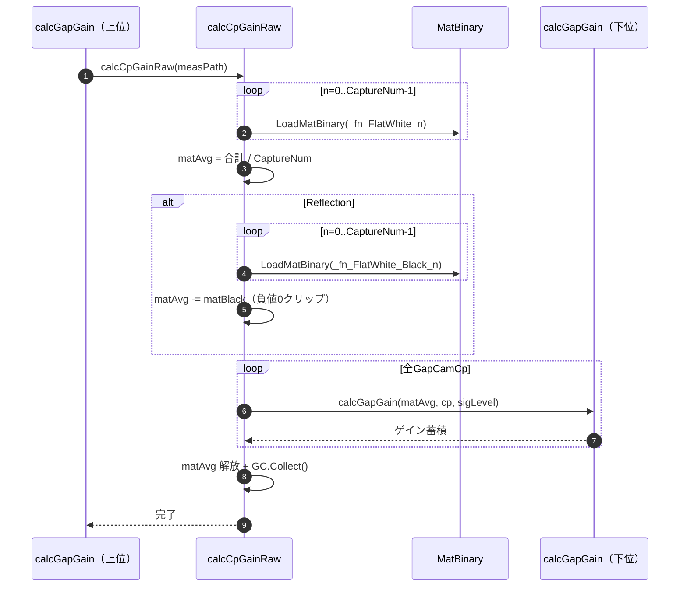
```mermaid
sequenceDiagram
    autonumber
    participant G as calcGapGain（上位）
    participant R as calcCpGainRaw
    participant IMG as MatBinary
    participant CG as calcGapGain（下位）

    G->>R: calcCpGainRaw(measPath)
    loop n=0..CaptureNum-1
        R->>IMG: LoadMatBinary(_fn_FlatWhite_n)
    end
    R->>R: matAvg = 合計 / CaptureNum
    alt Reflection
        loop n=0..CaptureNum-1
            R->>IMG: LoadMatBinary(_fn_FlatWhite_Black_n)
        end
        R->>R: matAvg -= matBlack（負値0クリップ）
    end
    loop 全GapCamCp
        R->>CG: calcGapGain(matAvg, cp, sigLevel)
        CG-->>R: ゲイン蓄積
    end
    R->>R: matAvg 解放 + GC.Collect()
    R-->>G: 完了
```

#### 8-4-15. calcGapGain（補正点単位）

| 項目 | 内容 |
|------|------|
| シグネチャ | `unsafe private void calcGapGain(Mat mat, GapCamCp cp, int sigLevel, bool debug = false)` |
| 概要 | 1補正点の複数トリム領域から Gap 輝度・周辺輝度・コントラストを算出し、端点外挿で `cp.GapGain/Slope/Offset` を更新する |

引数

| No. | 引数名 | 型 | 必須 | 説明 |
|-----|--------|----|------|------|
| 1 | mat | Mat | Y | `calcCpGainRaw` で生成した平均化済みフラット画像（32FC1） |
| 2 | cp | GapCamCp | Y | 補正対象の1点情報（`CamArea`/`Pos`/`Direction` を保持） |
| 3 | sigLevel | int | Y | 解析中の信号レベル（デバッグ出力ラベルに使用） |
| 4 | debug | bool | N | `TempFile` 有効時に中間CSVを出力するかのフラグ |

返り値: なし（void）

処理概要（詳細）

| 手順No. | 処理内容 | 詳細 |
|---------|----------|------|
| 1 | 作業配列初期化 | `gapContrast[]`、`gapBright[]`、`aroundBright[]`（要素数=`TrimAreaNum`）を初期化する。 |
| 2 | トリム領域切出し | 各 `n` について `cp.CamArea[n]` の矩形を取得し、`mat` から `flat` を切り出す（`RotateRect` 時は `BoundingRect` を使用）。 |
| 3 | Gapマスク生成 | `m_MatGapPos` の同領域を取り出し、背景マスクとの AND で `maskGap` を作成する。 |
| 4 | Gap輝度算出 | `target`（必要に応じ拡大）に対し `MeanStdDev(..., maskGap)` を実行し、Gap輝度 `gap` を求める。 |
| 5 | 周辺マスク生成 | Gap領域を膨張→反転して `maskAround` を作成し、`MeanStdDev(..., maskAround)` で周辺輝度 `around` を求める。 |
| 6 | 指標蓄積 | `gapContrast[n] = gap/around`、`gapBright[n]`、`aroundBright[n]` を保存する。 |
| 7 | 代表輝度設定 | `cp.Pos` に応じて先頭または末尾トリム値を `cp.Gap` と `cp.Around` に設定する。 |
| 8 | 直線近似 | `gapContrast[]` と位置配列から `Point2f(x, y=gapContrast[n])` を `TrimAreaNum` 点生成する。Top系（`TopLeft/TopRight/BottomLeft/BottomRight`）は `x=TrimAreaTopPos[n]`、Right系（`RightTop/RightBottom/LeftTop/LeftBottom`）は `x=TrimAreaRightPos[n]` を使い、`Cv2.FitLine(DistanceTypes.L1, 0, 0.01, 0.01)` の戻り値 `line` から `a = line.Vy / line.Vx`、`b = -line.Vy / line.Vx * line.X1 + line.Y1` を算出する。 |
| 9 | 端点外挿 | 手順8で得た直線 `y = a*x + b` に対し、Top系は Left側（`TopLeft`/`BottomLeft`）で `cp.GapGain = a*0 + b`、Right側（`TopRight`/`BottomRight`）で `cp.GapGain = a*(modDx - 1) + b` を採用する。Right系は Top側（`RightTop`/`LeftTop`）で `cp.GapGain = a*0 + b`、Bottom側（`RightBottom`/`LeftBottom`）で `cp.GapGain = a*(modDy - 1) + b` を採用し、モジュール端の推定コントラストを補正ゲイン値として確定する。 |
| 10 | 係数反映 | 手順8で得た近似係数を `cp.Slope = a`、`cp.Offset = b` として保持する。これらはレベルスイング集約時に `GapMeas(level, slope, offset, gapGain)` の入力として `listGapSwing` へ格納され、後段の `calcGapGain(List<UnitInfo>, string)` で `TargetSigLevel`・`CurrentContrast`・最終 `Gain` を算出する基礎データとして再利用される。 |

入力条件・前提条件

| 区分 | 条件 | NG時挙動 |
|------|------|----------|
| 画像入力 | `mat` が有効で、`cp.CamArea[]` が画像範囲内に収まること | 切出し時に下位例外 |
| GapPos | `m_MatGapPos` が生成済みであること | マスク生成で異常 |
| 幾何情報 | `TrimAreaNum`、`TrimAreaTopPos/RightPos`、`modDx/modDy` が設定済みであること | 近似・外挿結果が不正 |

主要状態更新

| 状態変数 | 更新内容 | 更新タイミング |
|----------|----------|----------------|
| `cp.Gap` | 代表トリム領域の Gap 輝度 | 手順7 |
| `cp.Around` | 代表トリム領域の周辺輝度 | 手順7 |
| `cp.GapGain` | 端点外挿した補正ゲイン | 手順9 |
| `cp.Slope` / `cp.Offset` | 近似直線係数 | 手順10 |

条件分岐仕様

| 条件 | 挙動 |
|------|------|
| `ImageScale_x5` | 切出し画像を5倍へ拡大して `m_MatGapPos`（5倍座標）と整合させて計算する。 |
| `RotateRect` | 回転矩形頂点から `matMaskRotate` を生成し、Gap/周辺マスクを有効領域内に制限する。 |
| `Coverity` | `using` スコープで `invGap`/`localGapDilate` など一時 `Mat` の解放漏れを抑止する。 |
| `CorrectTargetEdge` | `cp.Pos` 判定対象を拡張し、Bottom/Left 側端点の `GapGain` 外挿条件を有効化する。 |
| `TempFile && debug` | `flat.csv`、`GapBright.csv`、`AroundBright.csv`、`GapContrast.csv` 等の中間CSVを出力する。 |

主要呼出し先

| 呼出し先 | 役割 | 同期/非同期 |
|----------|------|--------------|
| `Cv2.Resize` | `ImageScale_x5` 時の切出し画像拡大 | 同期 |
| `Cv2.BitwiseAnd/BitwiseNot/Dilate` | Gap/周辺マスク生成 | 同期 |
| `Cv2.MeanStdDev` | Gap輝度・周辺輝度の統計算出 | 同期 |
| `Cv2.FitLine` | トリム列のコントラスト直線近似 | 同期 |

例外時仕様（中断含む）

| ケース | 捕捉方法 | 通知/伝播 | 後処理 |
|--------|----------|-----------|--------|
| 切出し範囲不正 | `mat[startY,endY,startX,endX]` 等の下位例外 | 呼出元へ再送出 | 当該補正点で中断 |
| マスク演算失敗 | OpenCV演算の下位例外 | 呼出元へ再送出 | 当該レベル処理を中断 |
| 近似不能 | 点群異常（`FitLine` 下位例外） | 呼出元へ再送出 | `cp` 更新は未完了 |

シーケンス図

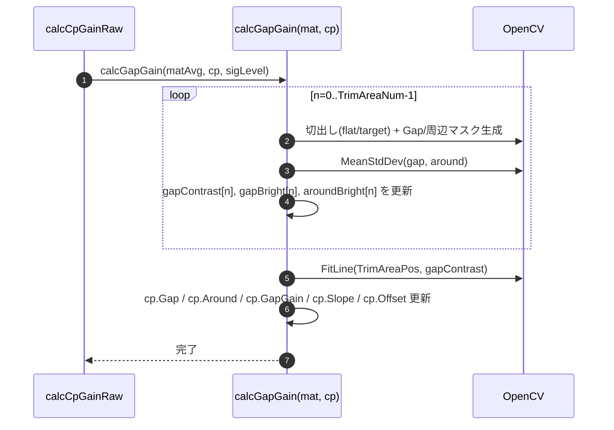
```mermaid
sequenceDiagram
    autonumber
    participant R as calcCpGainRaw
    participant C as calcGapGain(mat, cp)
    participant CV as OpenCV

    R->>C: calcGapGain(matAvg, cp, sigLevel)
    loop n=0..TrimAreaNum-1
        C->>CV: 切出し(flat/target) + Gap/周辺マスク生成
        C->>CV: MeanStdDev(gap, around)
        C->>C: gapContrast[n], gapBright[n], aroundBright[n] を更新
    end
    C->>CV: FitLine(TrimAreaPos, gapContrast)
    C->>C: cp.Gap / cp.Around / cp.GapGain / cp.Slope / cp.Offset 更新
    C-->>R: 完了
```

---

#### 8-4-16. checkWallEdge

| 項目 | 内容 |
|------|------|
| シグネチャ | `void checkWallEdge(List<UnitInfo> lstTgtUnit, out bool topEdge, out bool bottomEdge, out bool leftEdge, out bool rightEdge)` |
| 概要 | 選択Cabinet群の外周について、物理的な壁端または欠損端かどうかを上下左右別に判定する |

引数

| No. | 引数名 | 型 | 必須 | 説明 |
|-----|--------|----|------|------|
| 1 | lstTgtUnit | List<UnitInfo> | Y | 壁端判定対象のCabinet集合 |
| 2 | topEdge(out) | bool | Y | 上辺が壁端/欠損端かの出力 |
| 3 | bottomEdge(out) | bool | Y | 下辺が壁端/欠損端かの出力 |
| 4 | leftEdge(out) | bool | Y | 左辺が壁端/欠損端かの出力 |
| 5 | rightEdge(out) | bool | Y | 右辺が壁端/欠損端かの出力 |

返り値: なし（void）

処理概要（詳細）

| 手順No. | 処理内容 | 詳細 |
|---------|----------|------|
| 1 | 選択範囲算出 | `lstTgtUnit` の `X/Y` 最小最大から選択領域の矩形範囲を取得する。 |
| 2 | インデックス変換 | 内部配列参照用に `startX/startY/endX/endY` を1ベースから0ベースへ変換する。 |
| 3 | 左右端判定 | 左隣・右隣列を走査し、配列端到達または `null` Cabinet があれば該当辺を `true` とする。 |
| 4 | 上下端判定 | 上隣・下隣行を走査し、配列端到達または `null` Cabinet があれば該当辺を `true` とする。 |
| 5 | 結果返却 | 4方向の壁端判定結果を `out` 引数へ設定して返す。 |

入力条件・前提条件

| 区分 | 条件 | NG時挙動 |
|------|------|----------|
| 対象集合 | `lstTgtUnit` が空でなく、矩形選択に相当する座標集合であること | 最小最大算出不正または配列参照例外 |
| 配置情報 | `allocInfo.lstUnits` がCabinet配置で初期化済みであること | 下位配列参照例外 |

条件分岐仕様

| 条件 | 挙動 |
|------|------|
| 左端が配列境界 | `leftEdge = true` とする。 |
| 左隣列に `null` が存在 | 物理欠損端とみなし `leftEdge = true` とする。 |
| 右端/上端/下端も同様 | 各辺で境界到達または `null` 検出時に該当 `*Edge = true` とする。 |

主要呼出し先

| 呼出し先 | 役割 | 同期/非同期 |
|----------|------|--------------|
| `allocInfo.lstUnits` | 隣接Cabinet存在判定 | 同期 |

例外時仕様

| ケース | 捕捉方法 | 通知/伝播 | 後処理 |
|--------|----------|-----------|--------|
| 範囲外入力 | 下位配列参照例外 | 呼出元へ再送出 | 壁端判定中断 |
| 欠損Cabinet検出 | `null` 判定 | 例外なし | 当該辺を壁端扱い |

シーケンス図

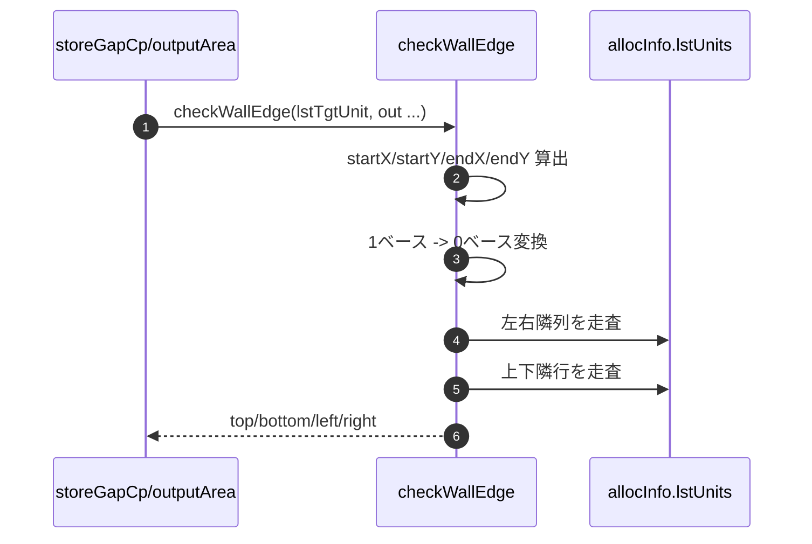
```mermaid
sequenceDiagram
    autonumber
    participant CALLER as storeGapCp/outputArea
    participant M as checkWallEdge
    participant ALLOC as allocInfo.lstUnits

    CALLER->>M: checkWallEdge(lstTgtUnit, out ...)
    M->>M: startX/startY/endX/endY 算出
    M->>M: 1ベース -> 0ベース変換
    M->>ALLOC: 左右隣列を走査
    M->>ALLOC: 上下隣行を走査
    M-->>CALLER: top/bottom/left/right
```

#### 8-4-17. outputGapCamTargetArea_EdgeExpand

| 項目 | 内容 |
|------|------|
| シグネチャ | `private void outputGapCamTargetArea_EdgeExpand(List<UnitInfo> lstTgtUnit, ExpandType type, bool white = false)` |
| 概要 | 対象Cabinet領域を上下左右へ拡張判定し、Controller別ウィンドウ信号を出力する |

引数

| No. | 引数名 | 型 | 必須 | 説明 |
|-----|--------|----|------|------|
| 1 | lstTgtUnit | List<UnitInfo> | Y | パターン表示対象のCabinet集合 |
| 2 | type | ExpandType | Y | Top/Right/Both の拡張種別 |
| 3 | white | bool | N | 白表示で出力するかどうか |

返り値: なし（void）

処理概要（詳細）

| 手順No. | 処理内容 | 詳細 |
|---------|----------|------|
| 1 | 対象領域集約 | `lstTgtUnit` からController単位の `WindowSigInfo` を作成する。 |
| 2 | 外周隣接判定 | 上下左右それぞれで隣接Cabinetの有無を判定し、拡張可否フラグ（`m_Expand*`）を更新する。 |
| 3 | 拡張領域反映 | 拡張可能な辺について隣接Cabinet側のウィンドウ矩形を取り込み、必要時は半タイルフラグを更新する。 |
| 4 | タイル数更新 | `type` に応じて `m_topTileNumX/Y` または `m_rightTileNumX/Y` を再計算する。 |
| 5 | 信号出力 | `outputIntSigWindowByController`（通常）またはデバッグ描画（`NO_CONTROLLER`/`TempFile`）で表示を反映する。 |
| 6 | 対象Controller設定 | 対象に含まれたControllerの `Target=true` を設定する。 |

入力条件・前提条件

| 区分 | 条件 | NG時挙動 |
|------|------|----------|
| 対象集合 | `lstTgtUnit` が矩形選択として整列していること | 隣接計算不整合または表示範囲不正 |
| 配置情報 | `allocInfo.lstUnits`、`cabiDx/cabiDy`、`modDx/modDy` が設定済みであること | 範囲計算またはタイル数更新で異常 |
| 通信環境 | `NO_CONTROLLER` 無効時はController出力が可能であること | SDCP出力例外 |

主要状態更新

| 状態変数 | 更新内容 | 更新タイミング |
|----------|----------|----------------|
| `m_ExpandTop/Bottom/Left/Right` | 外周拡張有無 | 手順2 |
| `m_bottomHalfTile` / `m_rightHalfTile` | 半タイル撮影要否 | 手順3 |
| `m_topTileNumX/Y` / `m_rightTileNumX/Y` | 解析用タイル数 | 手順4 |
| `Controller.Target` | Reconfig対象フラグ | 手順6 |

条件分岐仕様

| 条件 | 挙動 |
|------|------|
| `type == ExpandType.Top` | 上下方向中心の拡張とTopタイル数更新を行う。 |
| `type == ExpandType.Right` | 左右方向中心の拡張とRightタイル数更新を行う。 |
| `type == ExpandType.Both` | 上下左右すべての拡張判定を行う。 |
| `NO_CONTROLLER` | 実出力を行わず、デバッグ描画や内部状態更新のみ実施する。 |
| `white == true` | 白信号レベルでウィンドウ出力する。 |

主要呼出し先

| 呼出し先 | 役割 | 同期/非同期 |
|----------|------|--------------|
| `allocInfo.lstUnits` | 隣接Cabinet探索 | 同期 |
| `outputIntSigFlat` | 前回表示クリア | 同期 |
| `outputIntSigWindowByController` | Controller別ウィンドウ出力 | 同期 |
| `dicController` | 出力先Controller解決 | 同期 |

例外時仕様

| ケース | 捕捉方法 | 通知/伝播 | 後処理 |
|--------|----------|-----------|--------|
| 対象外参照 | 隣接探索時のnull判定 | 例外なし | 当該辺の拡張を行わない |
| SDCP出力失敗 | 下位 `Exception` | 呼出元へ再送出 | 位置合わせ処理側で失敗通知 |

シーケンス図

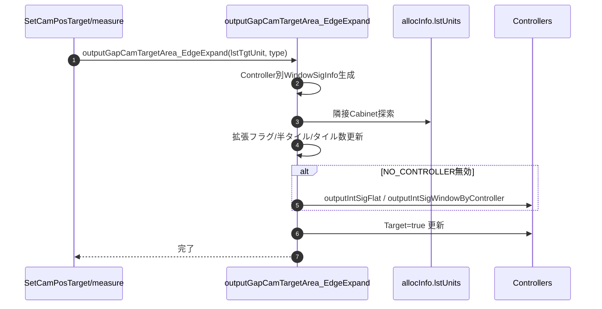
```mermaid
sequenceDiagram
    autonumber
    participant CALLER as SetCamPosTarget/measure
    participant M as outputGapCamTargetArea_EdgeExpand
    participant ALLOC as allocInfo.lstUnits
    participant CTRL as Controllers

    CALLER->>M: outputGapCamTargetArea_EdgeExpand(lstTgtUnit, type)
    M->>M: Controller別WindowSigInfo生成
    M->>ALLOC: 隣接Cabinet探索
    M->>M: 拡張フラグ/半タイル/タイル数更新
    alt NO_CONTROLLER無効
        M->>CTRL: outputIntSigFlat / outputIntSigWindowByController
    end
    M->>CTRL: Target=true 更新
    M-->>CALLER: 完了
```

#### 8-4-18. calcArea

| 項目 | 内容 |
|------|------|
| シグネチャ | `private double calcArea(CvBlobs blobs)` |
| 概要 | トリミング領域ブロブ群から代表面積を算出し、面積フィルタ基準値を返す |

引数

| No. | 引数名 | 型 | 必須 | 説明 |
|-----|--------|----|------|------|
| 1 | blobs | CvBlobs | Y | 2値化後に抽出された連結領域群 |

返り値: 代表面積（double）

処理概要（詳細）

| 手順No. | 処理内容 | 詳細 |
|---------|----------|------|
| 1 | 面積フィルタ | `blobs.FilterByArea(GapTrimmingAreaMin, TrimmingAreaMax)` を適用する。 |
| 2 | 件数判定 | 有効ブロブが0件の場合は `0` を返す。 |
| 3 | 面積収集/整列 | 各ブロブ面積を配列化し昇順ソートする。 |
| 4 | 中央上位帯平均 | `55%`〜`80%` 区間の面積平均を算出し代表値とする。 |
| 5 | 値返却 | `Coverity` 分岐では0除算を回避し、代表面積を返す。 |

入力条件・前提条件

| 区分 | 条件 | NG時挙動 |
|------|------|----------|
| ブロブ群 | `blobs` が初期化済みであること | 下位例外または面積0 |
| 面積閾値 | `GapTrimmingAreaMin` と `TrimmingAreaMax` が妥当であること | フィルタ結果が空となり0返却 |

条件分岐仕様

| 条件 | 挙動 |
|------|------|
| フィルタ後 `blobs.Count < 1` | `0` を返して終了する。 |
| `Coverity` | `count > 0` を確認して0除算を回避する。 |
| フィルタ後に十分な候補あり | 中央上位帯平均を代表面積として返す。 |

主要呼出し先

| 呼出し先 | 役割 | 同期/非同期 |
|----------|------|--------------|
| `CvBlobs.FilterByArea` | 外れ値ブロブ除去 | 同期 |
| `List<double>.Sort` | 面積の昇順整列 | 同期 |

例外時仕様

| ケース | 捕捉方法 | 通知/伝播 | 後処理 |
|--------|----------|-----------|--------|
| 面積候補不足 | `count == 0` 判定 | 例外なし | `0` を返却 |
| ブロブ入力不正 | 下位例外 | 呼出元へ再送出 | 呼出元で抽出処理中断 |

シーケンス図

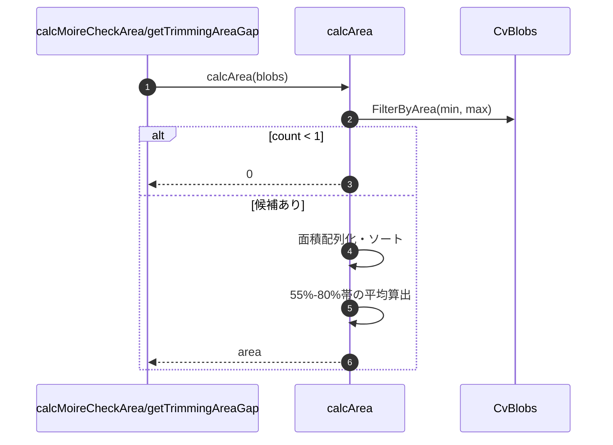
```mermaid
sequenceDiagram
    autonumber
    participant CALLER as calcMoireCheckArea/getTrimmingAreaGap
    participant M as calcArea
    participant B as CvBlobs

    CALLER->>M: calcArea(blobs)
    M->>B: FilterByArea(min, max)
    alt count < 1
        M-->>CALLER: 0
    else 候補あり
        M->>M: 面積配列化・ソート
        M->>M: 55%-80%帯の平均算出
        M-->>CALLER: area
    end
```

#### 8-4-19. dispGapResult

| 項目 | 内容 |
|------|------|
| シグネチャ | `async private void dispGapResult(bool error = false)` |
| 概要 | Gap計測・調整結果を集計してUIへ表示する。エラー時は Before/Result/Measure 全判定欄を NG（赤）に設定する。 |

引数

| No. | 引数名 | 型 | 必須 | 説明 |
|-----|--------|----|------|------|
| 1 | error | bool | N | エラー強制フラグ（既定 false） |

返り値: なし（void）

処理概要（詳細）

| 手順No. | 処理内容 | 詳細 |
|---------|----------|------|
| 1 | エラー時即時設定 | `error == true` 時は Before/Result/Measure の判定テキストを `"NG"` へ更新して return する。 |
| 2 | コントラスト配列初期化 | `m_GapContrast` / `m_WarningCorrectValue` を Cabinet×Module×Position で確保し NaN / true で初期化する。 |
| 3 | 補正点集計 | `lstGapCamCp` の全補正点を走査し、GapGain から TargetGain を引いた差分を格納して Max/Min/Ave/σを算出する。 |
| 4 | NG判定 | `AdjustSpec` 超過補正点を NG としてリストアップする。 |
| 5 | 画面更新 | `m_GapStatus` に応じて Before/Result/Measure の各統計テキストと OK/NG 判定欄を Dispatcher 経由で更新する。 |
| 6 | 結果画像保存 | `makeResultImage()` でビットマップを生成し BMP・MatBinary で保存後、UI 画像コントロールへ反映する。 |

入力条件・前提条件

| 区分 | 条件 | NG時挙動 |
|------|------|----------|
| 補正点データ | `lstGapCamCp` が設定済みであること | 集計結果が空 / ゼロ除算 |
| Cabinet構成 | `m_CabinetXNum` / `m_CabinetYNum` が正しく設定済みであること | 配列確保失敗 |

条件分岐仕様

| 条件 | 挙動 |
|------|------|
| `error == true` | Before/Result/Measure を一括 NG 設定して即 return する。 |
| `m_GapStatus == Before` | Before 欄へ統計値・OK/NG を反映する。 |
| `m_GapStatus == Result` | Result 欄へ統計値・NG リスト・OK/NG を反映する。 |
| `m_GapStatus == Measure` | Measure 欄へ統計値・OK/NG を反映する。 |

主要呼出し先

| 呼出し先 | 役割 | 同期/非同期 |
|----------|------|--------------|
| `btnGapCamMeasStart_Click`（8-1-7） | 計測失敗時の結果反映 | 非同期 |
| `btnGapCamAdjStart_Click`（8-1-8） | 調整失敗時の結果反映 | 非同期 |
| `btnGapCamRomStart_Click`（8-1-9） | ROM書込み失敗時の結果反映 | 非同期 |
| `measureGapAsync`（8-2-1） | 計測完了後の結果表示 | 非同期 |
| `adjustGapRegAsync`（8-2-2） | 調整完了後の結果表示 | 非同期 |
| `makeResultImage` | 結果ビットマップを生成する | 同期 |
| `SaveMatBinary` | 結果画像をMatBinaryとして保存する | 同期 |

例外時仕様

| ケース | 捕捉方法 | 通知/伝播 | 後処理 |
|--------|----------|-----------|--------|
| 下位処理失敗 | 下位例外または戻り値異常 | 呼出元へ通知 | 安全停止または設定復帰 |

シーケンス図

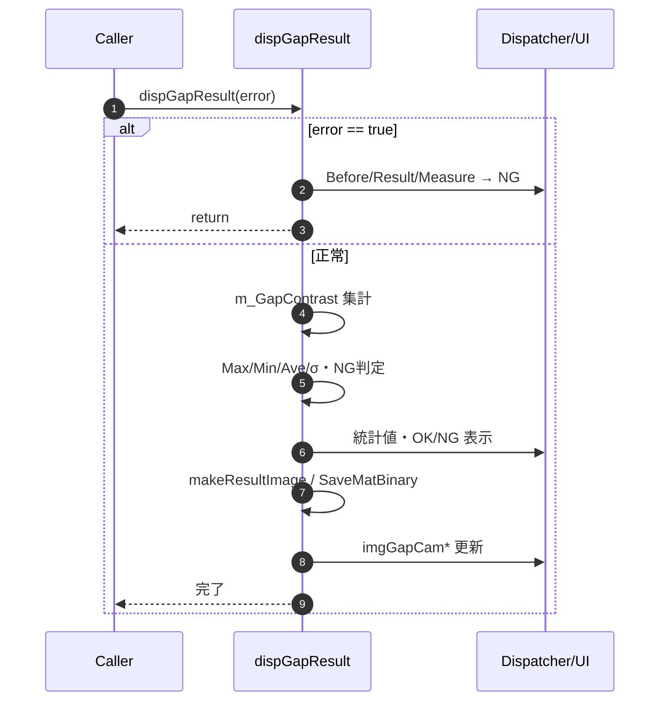
```mermaid
sequenceDiagram
    autonumber
    participant CALLER as Caller
    participant M as dispGapResult
    participant UI as Dispatcher/UI

    CALLER->>M: dispGapResult(error)
    alt error == true
        M->>UI: Before/Result/Measure → NG
        M-->>CALLER: return
    else 正常
        M->>M: m_GapContrast 集計
        M->>M: Max/Min/Ave/σ・NG判定
        M->>UI: 統計値・OK/NG 表示
        M->>M: makeResultImage / SaveMatBinary
        M->>UI: imgGapCam* 更新
        M-->>CALLER: 完了
    end
```

#### 8-4-20. clearGapResult

| 項目 | 内容 |
|------|------|
| シグネチャ | `async private void clearGapResult(DispType type)` |
| 概要 | 指定した表示タイプのGap計測結果表示（判定欄・統計テキスト・画像）を初期化する。 |

引数

| No. | 引数名 | 型 | 必須 | 説明 |
|-----|--------|----|------|------|
| 1 | type | DispType | Y | クリア対象の表示タイプ（Before / Result / Measure） |

返り値: なし（void）

処理概要（詳細）

| 手順No. | 処理内容 | 詳細 |
|---------|----------|------|
| 1 | 判定欄クリア | `type` に応じた判定テキストボックスを空白・グレーへ Dispatcher 経由で更新する。 |
| 2 | 統計欄クリア | Max/Min/PP/3σ/Ave および NG リスト（Result のみ）を空白へ更新する。 |
| 3 | 画像クリア | `clearResultImage()` でグレーキャンバスを生成し、対象 `imgGapCam*` コントロールへ反映する。 |

入力条件・前提条件

| 区分 | 条件 | NG時挙動 |
|------|------|----------|
| UI | Dispatcher が利用可能であること | 更新失敗 |
| type | 有効な DispType 値であること | いずれの分岐にも入らず画像のみクリア |

条件分岐仕様

| 条件 | 挙動 |
|------|------|
| `type == Before` | Before 判定欄・統計欄をクリアし Before 画像をグレーに戻す。 |
| `type == Result` | Result 判定欄・統計欄（NG リスト含む）をクリアし Result 画像をグレーに戻す。 |
| `type == Measure` | Measure 判定欄・統計欄をクリアし Measure 画像をグレーに戻す。 |

主要呼出し先

| 呼出し先 | 役割 | 同期/非同期 |
|----------|------|--------------|
| `btnGapCamMeasStart_Click`（8-1-7） | 計測開始前の表示初期化 | 非同期 |
| `btnGapCamAdjStart_Click`（8-1-8） | 調整開始前の表示初期化 | 非同期 |
| `measureGapAsync`（8-2-1） | 計測状態リセット時の表示初期化 | 非同期 |
| `clearResultImage` | グレーキャンバスを生成する | 同期 |

例外時仕様

| ケース | 捕捉方法 | 通知/伝播 | 後処理 |
|--------|----------|-----------|--------|
| Dispatcher 失敗 | 下位例外 | 呼出元へ伝播 | UI 未更新のまま継続 |

シーケンス図

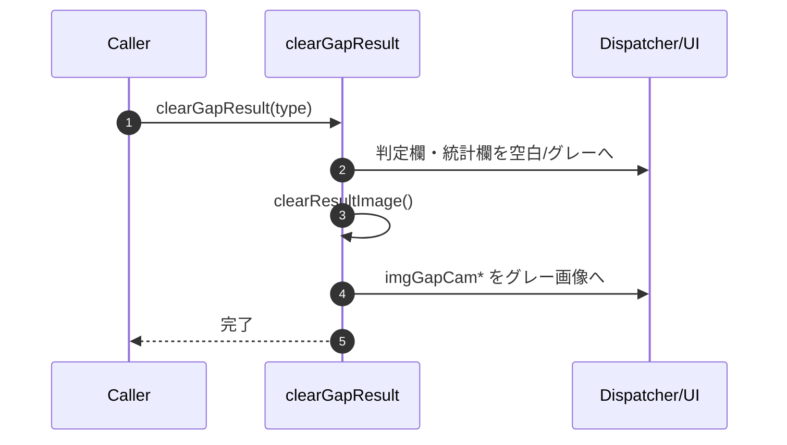
```mermaid
sequenceDiagram
    autonumber
    participant CALLER as Caller
    participant M as clearGapResult
    participant UI as Dispatcher/UI

    CALLER->>M: clearGapResult(type)
    M->>UI: 判定欄・統計欄を空白/グレーへ
    M->>M: clearResultImage()
    M->>UI: imgGapCam* をグレー画像へ
    M-->>CALLER: 完了
```

#### 8-4-21. initialGapCameraMeasurementProcessSec

| 項目 | 内容 |
|------|------|
| シグネチャ | `private int initialGapCameraMeasurementProcessSec(int cabinetCount)` |
| 概要 | 計測処理の各ステップ推定秒数を算出して `m_AryProcessSec` へ格納し、合計値を返す。 |

引数

| No. | 引数名 | 型 | 必須 | 説明 |
|-----|--------|----|------|------|
| 1 | cabinetCount | int | Y | 対象Cabinet数 |

返り値: int（合計推定秒数）

処理概要（詳細）

| 手順No. | 処理内容 | 詳細 |
|---------|----------|------|
| 1 | ステップ0（初期設定） | `GAP_INITIAL_SETTINGS_SEC` + `USER_SETTING_SEC` + `ADJUST_SETTING_SEC` を算出する。 |
| 2 | ステップ1（AF） | `AUTO_FOCUS_SEC` を算出する。 |
| 3 | ステップ2（姿勢取得） | `STORE_CAMERA_POSITION_SEC` を算出する。 |
| 4 | ステップ3（撮影） | Black/Flat/White/TargetArea/MoireArea/MoireCheck/TopBottom/LeftRight/Gap の各撮影定数を合算する。 |
| 5 | ステップ4（解析） | TopBottom/LeftRight/Gap 読込と cabinet 数による GapGain 計算時間を合算する。 |
| 6 | ステップ5（復帰） | `STORE_CAMERA_POSITION_SEC` + `ADJUST_SETTING_SEC` + `USER_SETTING_SEC` を算出する。 |
| 7 | 格納・返却 | `m_AryProcessSec[6]` へ格納してログ出力し合計を返す。 |

入力条件・前提条件

| 区分 | 条件 | NG時挙動 |
|------|------|----------|
| `cabinetCount` | 1 以上の正整数であること | ステップ4の乗算値がゼロになる |

条件分岐仕様

| 条件 | 挙動 |
|------|------|
| 正常系 | 定数群から 6 ステップ合計秒数を算出して返す。 |

主要呼出し先

| 呼出し先 | 役割 | 同期/非同期 |
|----------|------|--------------|
| `btnGapCamMeasStart_Click`（8-1-7） | 進捗タイマ開始前の推定秒数算出 | 同期 |
| 計測定数群 | 各撮影・処理ステップの定数参照 | 同期 |

例外時仕様

| ケース | 捕捉方法 | 通知/伝播 | 後処理 |
|--------|----------|-----------|--------|
| 演算オーバーフロー | 下位例外 | 呼出元へ伝播 | タイマ未起動 |

シーケンス図

```mermaid
sequenceDiagram
    autonumber
    participant CALLER as btnGapCamMeasStart_Click
    participant M as initialGapCameraMeasurementProcessSec

    CALLER->>M: initialGapCameraMeasurementProcessSec(cabinetCount)
    M->>M: 6ステップ推定秒数算出
    M->>M: m_AryProcessSec 格納
    M-->>CALLER: processSec
```

#### 8-4-22. initialGapCameraAdjustmentProcessSec

| 項目 | 内容 |
|------|------|
| シグネチャ | `private int initialGapCameraAdjustmentProcessSec(int count)` |
| 概要 | 調整処理の各ステップ推定秒数を算出して `m_AryProcessSec` へ格納し、合計値を返す。 |

引数

| No. | 引数名 | 型 | 必須 | 説明 |
|-----|--------|----|------|------|
| 1 | count | int | Y | 対象Cabinet数 |

返り値: int（合計推定秒数）

処理概要（詳細）

| 手順No. | 処理内容 | 詳細 |
|---------|----------|------|
| 1 | ステップ0〜4 | 計測処理と同様の定数から初期〜解析までを算出する。 |
| 2 | ステップ5（補正設定） | `m_EvaluateAdjustmentResult` フラグに応じて、評価撮影あり/なしの2通りで算出する。 |
| 3 | ステップ6（全白撮影） | `m_EvaluateAdjustmentResult == true` の場合のみ `GAP_CAPTURE_WHITE_IMAGE_SEC + STORE_CAMERA_POSITION_SEC` を追加する。 |
| 4 | ステップ7（復帰） | `ADJUST_SETTING_SEC + USER_SETTING_SEC` を算出する。 |
| 5 | 格納・返却 | `m_AryProcessSec[8]` へ格納してログ出力し合計を返す。 |

入力条件・前提条件

| 区分 | 条件 | NG時挙動 |
|------|------|----------|
| `count` | 1 以上の正整数であること | ステップ4/5 の乗算値がゼロになる |
| `moduleCount` | 有効な Module 数が設定済みであること | ステップ5 の乗算値が不正になる |

条件分岐仕様

| 条件 | 挙動 |
|------|------|
| `m_EvaluateAdjustmentResult == true` | 評価用撮影・解析時間をステップ5/6 へ追加する。 |
| `m_EvaluateAdjustmentResult == false` | 一括補正設定時間のみをステップ5 とし、ステップ6 は 0 にする。 |

主要呼出し先

| 呼出し先 | 役割 | 同期/非同期 |
|----------|------|--------------|
| `btnGapCamAdjStart_Click`（8-1-8） | 進捗タイマ開始前の推定秒数算出 | 同期 |
| 調整定数群 | 各ステップの定数参照 | 同期 |

例外時仕様

| ケース | 捕捉方法 | 通知/伝播 | 後処理 |
|--------|----------|-----------|--------|
| 演算オーバーフロー | 下位例外 | 呼出元へ伝播 | タイマ未起動 |

シーケンス図

```mermaid
sequenceDiagram
    autonumber
    participant CALLER as btnGapCamAdjStart_Click
    participant M as initialGapCameraAdjustmentProcessSec

    CALLER->>M: initialGapCameraAdjustmentProcessSec(count)
    M->>M: 8ステップ推定秒数算出
    M->>M: m_AryProcessSec 格納
    M-->>CALLER: processSec
```

#### 8-4-23. initialGapCameraROMWriteProcessSec

| 項目 | 内容 |
|------|------|
| シグネチャ | `private int initialGapCameraROMWriteProcessSec()` |
| 概要 | ROM書込み処理の各ステップ推定秒数を算出して `m_AryProcessSec` へ格納し、合計値を返す。 |

引数

引数: なし

返り値: int（合計推定秒数）

処理概要（詳細）

| 手順No. | 処理内容 | 詳細 |
|---------|----------|------|
| 1 | ステップ定義 | `GAP_WRITE_PANEL_OFF` / `GAP_WRITE_THREAD_SLEEP` / `GAP_WRITE_WRITE_CORRECTION_VALUE` / `GAP_WRITE_THREAD_SLEEP` / `UNIT_RECONFIG_SEC` / `GAP_WRITE_PANEL_ON` の 6 ステップを定義する。 |
| 2 | 格納・返却 | `m_AryProcessSec[6]` へ格納してログ出力し合計を返す。 |

入力条件・前提条件

| 区分 | 条件 | NG時挙動 |
|------|------|----------|
| 定数 | ROM書込み定数群が正しく定義されていること | 誤った推定時間を返す |

条件分岐仕様

| 条件 | 挙動 |
|------|------|
| 正常系 | 固定 6 ステップの合計秒数を返す。 |

主要呼出し先

| 呼出し先 | 役割 | 同期/非同期 |
|----------|------|--------------|
| `btnGapCamAdjStart_Click`（8-1-8） | Auto_WriteData 時のROM書込み進捗見積りに使用 | 同期 |
| ROM書込み定数群 | 各ステップの定数参照 | 同期 |

例外時仕様

| ケース | 捕捉方法 | 通知/伝播 | 後処理 |
|--------|----------|-----------|--------|
| 演算オーバーフロー | 下位例外 | 呼出元へ伝播 | タイマ未起動 |

シーケンス図

```mermaid
sequenceDiagram
    autonumber
    participant CALLER as btnGapCamAdjStart_Click
    participant M as initialGapCameraROMWriteProcessSec

    CALLER->>M: initialGapCameraROMWriteProcessSec()
    M->>M: 6ステップ定義 / m_AryProcessSec 格納
    M-->>CALLER: processSec
```
