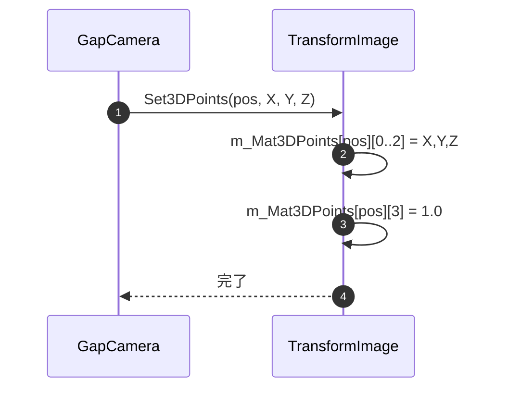
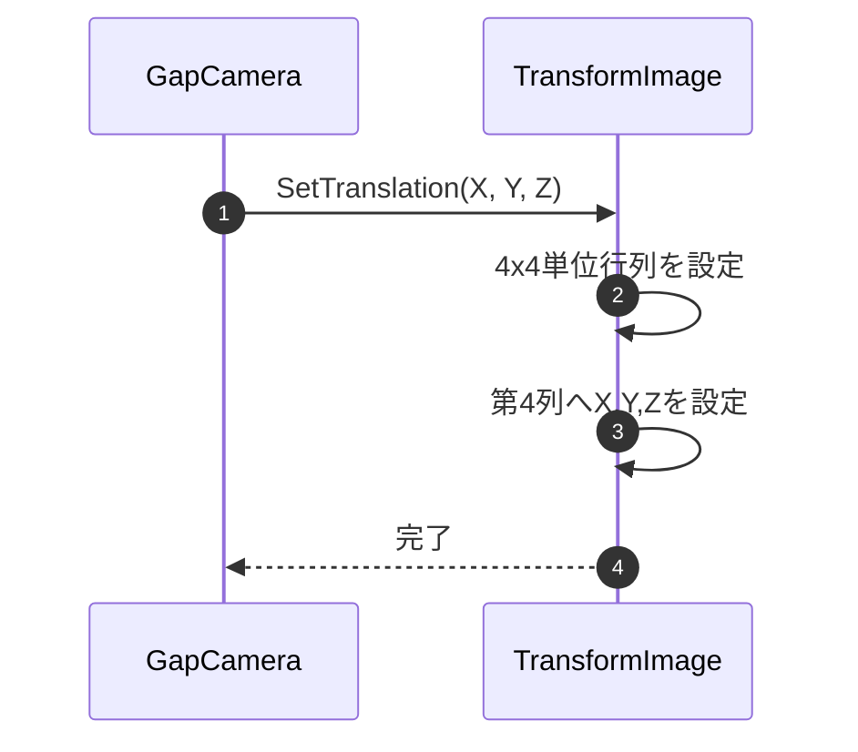
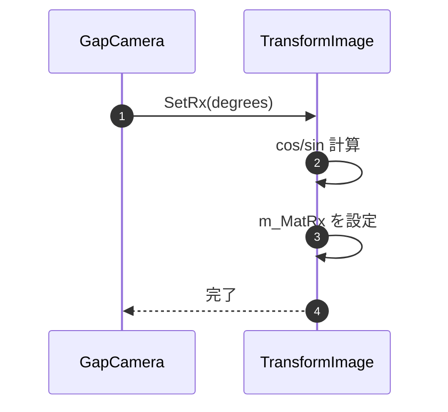
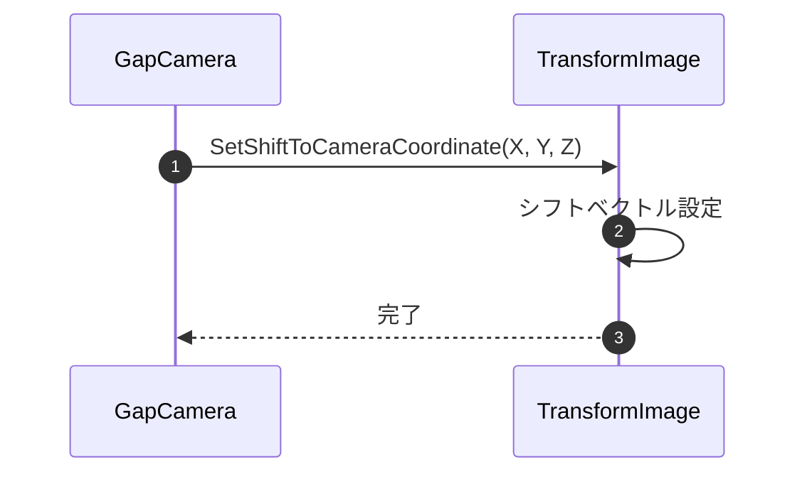
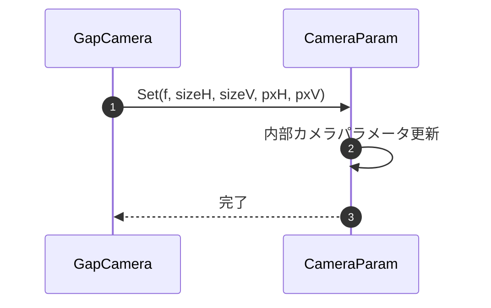
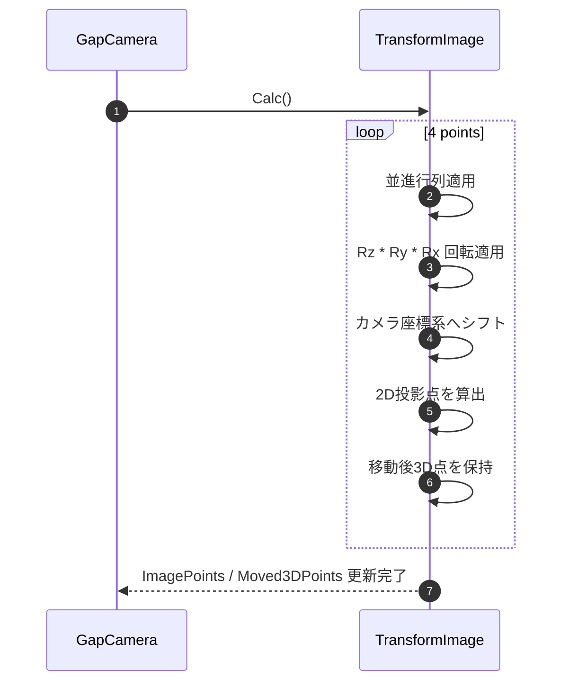
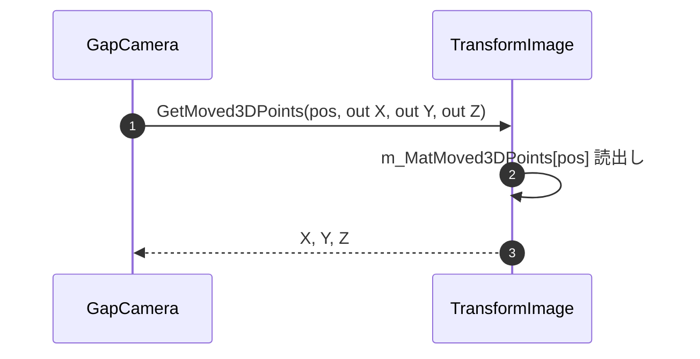
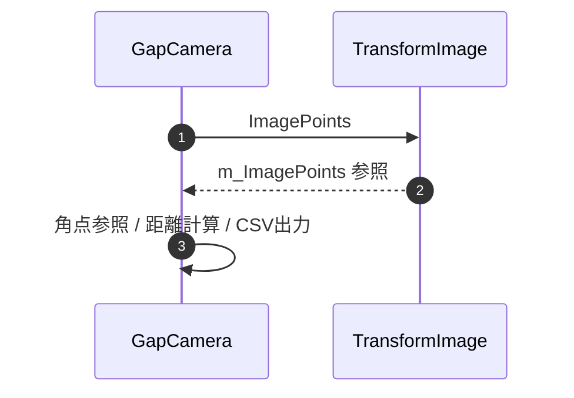

<!-- NiceDiffStart -->
## 差分サマリ（モデル分類）

| 区分 | 対象モデル |
|------|------------|
| 既存ファイル基準 | Chiron/Cancun |
| ColorAlignmentSoftware_Nice基準 | Verona/Capri |

### 参照ソース（Verona/Capri）
- ..\\ColorAlignmentSoftware_Nice\\CAS\\Functions\\GapCamera.cs
- ..\\ColorAlignmentSoftware_Nice\\CAS\\Functions\\TransformImage.cs
- ..\\ColorAlignmentSoftware_Nice\\CAS\\Functions\\EstimateCameraPos.cs
- ..\\ColorAlignmentSoftware_Nice\\CAS\\SDCPClass.cs

### このファイルの差分要点
- 姿勢計算差分: 計算メソッドは共通、呼出条件(距離・モデル)が追加。
- 例外差分: camera position不適合時の停止条件を追記。

### 更新時の注意
- 既存記述を維持したまま、上記差分観点を各章の手順・IF・例外仕様へ反映する。
- モデル表記は Chiron/Cancun と Verona/Capri を分離して記載する。
<!-- NiceDiffEnd -->

### 8-5-2. 位置・姿勢計算補助

#### 8-5-2-1. Set3DPoints

| 項目 | 内容 |
|------|------|
| シグネチャ | `public void Set3DPoints(int pos, float X, float Y, float Z)` |
| 概要 | 投影対象となる3D座標を同次座標系の4点配列へ設定する |

引数

| No. | 引数名 | 型 | 必須 | 説明 |
|-----|--------|----|------|------|
| 1 | pos | int | Y | 設定対象点のインデックス（0-3） |
| 2 | X | float | Y | 3D点のX座標 |
| 3 | Y | float | Y | 3D点のY座標 |
| 4 | Z | float | Y | 3D点のZ座標 |

返り値: なし（void）

処理概要（詳細）

| 手順No. | 処理内容 | 詳細 |
|---------|----------|------|
| 1 | 対象点選択 | `m_Mat3DPoints[pos]` を設定対象として選択する。 |
| 2 | 座標格納 | 行0-2へ `X/Y/Z` を設定する。 |
| 3 | 同次座標化 | 行3へ `1.0f` を設定し、4x1同次座標ベクトルとして保持する。 |

入力条件・前提条件

| 区分 | 条件 | NG時挙動 |
|------|------|----------|
| 点インデックス | `pos` が 0-3 の範囲内であること | 配列参照例外 |
| 座標値 | `X/Y/Z` が計算可能な実数であること | 後続投影結果が不正 |

条件分岐仕様

| 条件 | 挙動 |
|------|------|
| 条件分岐なし | 指定インデックスの4x1行列へ固定位置で代入する。 |

主要呼出し先

| 呼出し先 | 役割 | 同期/非同期 |
|----------|------|--------------|
| `Mat.Set` | 3D点成分の代入 | 同期 |

例外時仕様

| ケース | 捕捉方法 | 通知/伝播 | 後処理 |
|--------|----------|-----------|--------|
| `pos` 範囲外 | 下位配列参照例外 | 呼出元へ再送出 | 当該点設定中断 |

シーケンス図

#### 8-5-2-2. SetTranslation

| 項目 | 内容 |
|------|------|
| シグネチャ | `public void SetTranslation(float X, float Y, float Z)` |
| 概要 | 3D点へ適用する並進行列を設定する |

引数

| No. | 引数名 | 型 | 必須 | 説明 |
|-----|--------|----|------|------|
| 1 | X | float | Y | 並進X量 |
| 2 | Y | float | Y | 並進Y量 |
| 3 | Z | float | Y | 並進Z量 |

返り値: なし（void）

処理概要（詳細）

| 手順No. | 処理内容 | 詳細 |
|---------|----------|------|
| 1 | 単位行列化 | `m_MatTranslation` を4x4単位行列形に設定する。 |
| 2 | 並進成分設定 | 第4列へ `X/Y/Z` を格納する。 |

入力条件・前提条件

| 区分 | 条件 | NG時挙動 |
|------|------|----------|
| 並進量 | `X/Y/Z` が計算可能な実数であること | 後続投影結果が不正 |

条件分岐仕様

| 条件 | 挙動 |
|------|------|
| 条件分岐なし | 常に4x4並進行列を再構築する。 |

主要呼出し先

| 呼出し先 | 役割 | 同期/非同期 |
|----------|------|--------------|
| `Mat.Set` | 並進行列要素の代入 | 同期 |

例外時仕様

| ケース | 捕捉方法 | 通知/伝播 | 後処理 |
|--------|----------|-----------|--------|
| 行列代入失敗 | 下位例外 | 呼出元へ再送出 | 行列設定中断 |

シーケンス図

#### 8-5-2-3. SetRx

| 項目 | 内容 |
|------|------|
| シグネチャ | `public void SetRx(double degrees)` |
| 概要 | X軸回転行列を設定する |

引数

| No. | 引数名 | 型 | 必須 | 説明 |
|-----|--------|----|------|------|
| 1 | degrees | double | Y | X軸回転角度（度） |

返り値: なし（void）

処理概要（詳細）

| 手順No. | 処理内容 | 詳細 |
|---------|----------|------|
| 1 | 角度変換 | `degrees / 180 * PI` でラジアン換算する。 |
| 2 | 行列構築 | `cos/sin` を用いて `m_MatRx` の回転成分を設定する。 |
| 3 | 同次成分設定 | 最終行・列を同次変換用値へ設定する。 |

入力条件・前提条件

| 区分 | 条件 | NG時挙動 |
|------|------|----------|
| 角度 | `degrees` が計算可能な実数であること | 後続投影結果が不正 |

条件分岐仕様

| 条件 | 挙動 |
|------|------|
| 条件分岐なし | 常にX軸回転行列を再計算する。 |

主要呼出し先

| 呼出し先 | 役割 | 同期/非同期 |
|----------|------|--------------|
| `Math.Cos` / `Math.Sin` | 回転成分算出 | 同期 |
| `Mat.Set` | 回転行列要素の代入 | 同期 |

例外時仕様

| ケース | 捕捉方法 | 通知/伝播 | 後処理 |
|--------|----------|-----------|--------|
| 行列代入失敗 | 下位例外 | 呼出元へ再送出 | 行列設定中断 |

シーケンス図

#### 8-5-2-4. SetRy

| 項目 | 内容 |
|------|------|
| シグネチャ | `public void SetRy(double degrees)` |
| 概要 | Y軸回転行列を設定する |

引数

| No. | 引数名 | 型 | 必須 | 説明 |
|-----|--------|----|------|------|
| 1 | degrees | double | Y | Y軸回転角度（度） |

返り値: なし（void）

処理概要（詳細）

| 手順No. | 処理内容 | 詳細 |
|---------|----------|------|
| 1 | 角度変換 | `degrees / 180 * PI` でラジアン換算する。 |
| 2 | 行列構築 | `cos/sin` を用いて `m_MatRy` の回転成分を設定する。 |
| 3 | 同次成分設定 | 最終行・列を同次変換用値へ設定する。 |

入力条件・前提条件

| 区分 | 条件 | NG時挙動 |
|------|------|----------|
| 角度 | `degrees` が計算可能な実数であること | 後続投影結果が不正 |

条件分岐仕様

| 条件 | 挙動 |
|------|------|
| 条件分岐なし | 常にY軸回転行列を再計算する。 |

主要呼出し先

| 呼出し先 | 役割 | 同期/非同期 |
|----------|------|--------------|
| `Math.Cos` / `Math.Sin` | 回転成分算出 | 同期 |
| `Mat.Set` | 回転行列要素の代入 | 同期 |

例外時仕様

| ケース | 捕捉方法 | 通知/伝播 | 後処理 |
|--------|----------|-----------|--------|
| 行列代入失敗 | 下位例外 | 呼出元へ再送出 | 行列設定中断 |

シーケンス図

#### 8-5-2-5. SetRz

| 項目 | 内容 |
|------|------|
| シグネチャ | `public void SetRz(double degrees)` |
| 概要 | Z軸回転行列を設定する |

引数

| No. | 引数名 | 型 | 必須 | 説明 |
|-----|--------|----|------|------|
| 1 | degrees | double | Y | Z軸回転角度（度） |

返り値: なし（void）

処理概要（詳細）

| 手順No. | 処理内容 | 詳細 |
|---------|----------|------|
| 1 | 角度変換 | `degrees / 180 * PI` でラジアン換算する。 |
| 2 | 行列構築 | `cos/sin` を用いて `m_MatRz` の回転成分を設定する。 |
| 3 | 同次成分設定 | 最終行・列を同次変換用値へ設定する。 |

入力条件・前提条件

| 区分 | 条件 | NG時挙動 |
|------|------|----------|
| 角度 | `degrees` が計算可能な実数であること | 後続投影結果が不正 |

条件分岐仕様

| 条件 | 挙動 |
|------|------|
| 条件分岐なし | 常にZ軸回転行列を再計算する。 |

主要呼出し先

| 呼出し先 | 役割 | 同期/非同期 |
|----------|------|--------------|
| `Math.Cos` / `Math.Sin` | 回転成分算出 | 同期 |
| `Mat.Set` | 回転行列要素の代入 | 同期 |

例外時仕様

| ケース | 捕捉方法 | 通知/伝播 | 後処理 |
|--------|----------|-----------|--------|
| 行列代入失敗 | 下位例外 | 呼出元へ再送出 | 行列設定中断 |

シーケンス図

#### 8-5-2-6. SetShiftToCameraCoordinate

| 項目 | 内容 |
|------|------|
| シグネチャ | `public void SetShiftToCameraCoordinate(float X, float Y, float Z)` |
| 概要 | ワールド座標からカメラ座標へのシフト量を設定する |

引数

| No. | 引数名 | 型 | 必須 | 説明 |
|-----|--------|----|------|------|
| 1 | X | float | Y | カメラ座標系へのXシフト量 |
| 2 | Y | float | Y | カメラ座標系へのYシフト量 |
| 3 | Z | float | Y | カメラ座標系へのZシフト量 |

返り値: なし（void）

処理概要（詳細）

| 手順No. | 処理内容 | 詳細 |
|---------|----------|------|
| 1 | シフト量設定 | `m_MatShiftToCameraCoordinate` の各成分へ `X/Y/Z` を設定する。 |

入力条件・前提条件

| 区分 | 条件 | NG時挙動 |
|------|------|----------|
| シフト量 | `X/Y/Z` が計算可能な実数であること | 後続投影結果が不正 |

条件分岐仕様

| 条件 | 挙動 |
|------|------|
| 条件分岐なし | 常に3x1シフトベクトルを上書きする。 |

主要呼出し先

| 呼出し先 | 役割 | 同期/非同期 |
|----------|------|--------------|
| `Mat.Set` | シフトベクトル要素の代入 | 同期 |

例外時仕様

| ケース | 捕捉方法 | 通知/伝播 | 後処理 |
|--------|----------|-----------|--------|
| 行列代入失敗 | 下位例外 | 呼出元へ再送出 | 設定中断 |

シーケンス図

#### 8-5-2-7. CameraParam.Set

| 項目 | 内容 |
|------|------|
| シグネチャ | `public void Set(double f, double SensorSizeH, double SensorSizeV, int SensorPxH, int SensorPxV)` |
| 概要 | 投影計算で使用するカメラ内部パラメータを更新する |

引数

| No. | 引数名 | 型 | 必須 | 説明 |
|-----|--------|----|------|------|
| 1 | f | double | Y | 焦点距離 |
| 2 | SensorSizeH | double | Y | センサ横幅 |
| 3 | SensorSizeV | double | Y | センサ縦幅 |
| 4 | SensorPxH | int | Y | センサ横画素数 |
| 5 | SensorPxV | int | Y | センサ縦画素数 |

返り値: なし（void）

処理概要（詳細）

| 手順No. | 処理内容 | 詳細 |
|---------|----------|------|
| 1 | 焦点距離設定 | `m_f` を更新する。 |
| 2 | センササイズ設定 | `m_SensorSizeH`、`m_SensorSizeV` を更新する。 |
| 3 | センサ画素数設定 | `m_SensorPxH`、`m_SensorPxV` を更新する。 |

入力条件・前提条件

| 区分 | 条件 | NG時挙動 |
|------|------|----------|
| 光学パラメータ | `f`、センササイズが正値であること | 後続投影結果が不正 |
| 画素数 | `SensorPxH/V` が正整数であること | 後続投影結果が不正 |

条件分岐仕様

| 条件 | 挙動 |
|------|------|
| 条件分岐なし | 受領した値で内部パラメータを単純更新する。 |

主要呼出し先

| 呼出し先 | 役割 | 同期/非同期 |
|----------|------|--------------|
| なし | 内部メンバ更新のみ | 同期 |

例外時仕様

| ケース | 捕捉方法 | 通知/伝播 | 後処理 |
|--------|----------|-----------|--------|
| 想定外値入力 | 明示チェックなし | 例外なし | 後続投影結果へ影響 |

シーケンス図

#### 8-5-2-8. Calc

| 項目 | 内容 |
|------|------|
| シグネチャ | `public void Calc()` |
| 概要 | 登録済み3D点へ並進・回転・カメラ座標シフトを適用し、2D投影点と移動後3D点を算出する |

引数: なし

返り値: なし（void）

処理概要（詳細）

| 手順No. | 処理内容 | 詳細 |
|---------|----------|------|
| 1 | 4点ループ開始 | `n=0..3` の各3D点について投影処理を実行する。 |
| 2 | 並進・回転適用 | `m_MatTranslation * m_Mat3DPoints[n]` の後、`Rz * (Ry * (Rx * ...))` を適用する。 |
| 3 | カメラ座標変換 | 4次元結果を3次元へ落とし、`m_MatShiftToCameraCoordinate` を加算する。 |
| 4 | 2D投影算出 | カメラパラメータを用いて `m_ImagePoints[n]` の `X/Y` を算出する。 |
| 5 | 移動後3D点保持 | `m_MatMoved3DPoints[n]` へ変換後 `X/Y/Z` を格納する。 |
| 6 | 一時Mat解放 | ループ内の一時 `Mat` を `Dispose` する。 |

入力条件・前提条件

| 区分 | 条件 | NG時挙動 |
|------|------|----------|
| 入力点 | 4点すべてに `Set3DPoints` 済みであること | 投影結果が未定義 |
| 変換行列 | `SetTranslation`、`SetRx/Ry/Rz`、`SetShiftToCameraCoordinate` 済みであること | 投影結果が不正 |
| カメラパラメータ | `CameraParameter.Set` で実機相当値が設定済みであること | 2D投影点が不正 |

主要状態更新

| 状態変数 | 更新内容 | 更新タイミング |
|----------|----------|----------------|
| `m_ImagePoints` | 投影後2D座標4点 | 手順4 |
| `m_MatMoved3DPoints` | カメラ座標系の3D点 | 手順5 |

条件分岐仕様

| 条件 | 挙動 |
|------|------|
| 条件分岐なし | 4点すべてへ同一の行列変換と投影計算を適用する。 |

主要呼出し先

| 呼出し先 | 役割 | 同期/非同期 |
|----------|------|--------------|
| `Mat` の乗算 | 並進・回転変換 | 同期 |
| `Point2f` | 投影後2D座標の保持 | 同期 |
| `Dispose` | 一時行列解放 | 同期 |

例外時仕様

| ケース | 捕捉方法 | 通知/伝播 | 後処理 |
|--------|----------|-----------|--------|
| 行列演算失敗 | 下位例外 | 呼出元へ再送出 | 当該投影計算中断 |
| Z成分不正 | 明示チェックなし | 例外なし | 投影座標が不正値化する可能性 |

シーケンス図

#### 8-5-2-9. GetMoved3DPoints

| 項目 | 内容 |
|------|------|
| シグネチャ | `public void GetMoved3DPoints(int pos, out float X, out float Y, out float Z)` |
| 概要 | `Calc()` で更新済みの移動後3D点を取得する |

引数

| No. | 引数名 | 型 | 必須 | 説明 |
|-----|--------|----|------|------|
| 1 | pos | int | Y | 取得対象点のインデックス（0-3） |
| 2 | X(out) | float | Y | 取得後X座標 |
| 3 | Y(out) | float | Y | 取得後Y座標 |
| 4 | Z(out) | float | Y | 取得後Z座標 |

返り値: なし（void）

処理概要（詳細）

| 手順No. | 処理内容 | 詳細 |
|---------|----------|------|
| 1 | 初期化 | `X=Y=Z=0` を設定する。 |
| 2 | 対象点読出し | `m_MatMoved3DPoints[pos]` の各要素を取得する。 |
| 3 | out返却 | 読み出した `X/Y/Z` を `out` 引数へ返す。 |

入力条件・前提条件

| 区分 | 条件 | NG時挙動 |
|------|------|----------|
| 点インデックス | `pos` が 0-3 の範囲内であること | 配列参照例外 |
| 事前計算 | `Calc()` 実行済みであること | 初期値または古い値を返す可能性 |

条件分岐仕様

| 条件 | 挙動 |
|------|------|
| 条件分岐なし | 指定点の3成分をそのまま返す。 |

主要呼出し先

| 呼出し先 | 役割 | 同期/非同期 |
|----------|------|--------------|
| `Mat.At<float>` | 移動後3D点成分の読出し | 同期 |

例外時仕様

| ケース | 捕捉方法 | 通知/伝播 | 後処理 |
|--------|----------|-----------|--------|
| `pos` 範囲外 | 下位配列参照例外 | 呼出元へ再送出 | 取得中断 |

シーケンス図

#### 8-5-2-10. ImagePoints

| 項目 | 内容 |
|------|------|
| シグネチャ | `public Point2f[] ImagePoints { get; }` |
| 概要 | `Calc()` または `Calc2()` で算出した4点分の2D投影座標を返す参照プロパティ |

引数: なし

返り値

| 項目 | 型 | 説明 |
|------|----|------|
| ImagePoints | Point2f[] | 左上、右上、右下、左下の順で保持された投影後2D座標配列 |

処理概要（詳細）

| 手順No. | 処理内容 | 詳細 |
|---------|----------|------|
| 1 | 内部配列参照返却 | `m_ImagePoints` の参照をそのまま返す。 |
| 2 | 呼出元利用 | GapCamera 側では目標枠設定、辺長算出、CSV出力、撮像範囲判定に利用する。 |

入力条件・前提条件

| 区分 | 条件 | NG時挙動 |
|------|------|----------|
| 事前計算 | `Calc()` または `Calc2()` 実行後であること | 未初期化要素または古い値を参照する可能性 |
| 配列前提 | 4点分の投影結果を扱うこと | 添字前提の呼出元処理が破綻する |

条件分岐仕様

| 条件 | 挙動 |
|------|------|
| 条件分岐なし | 常に内部配列の参照を返す。 |

主要呼出し先

| 呼出し先 | 役割 | 同期/非同期 |
|----------|------|--------------|
| なし | 内部配列参照返却のみ | 同期 |

例外時仕様

| ケース | 捕捉方法 | 通知/伝播 | 後処理 |
|--------|----------|-----------|--------|
| 明示例外なし | 該当なし | なし | 呼出元が返却値を評価 |

シーケンス図

