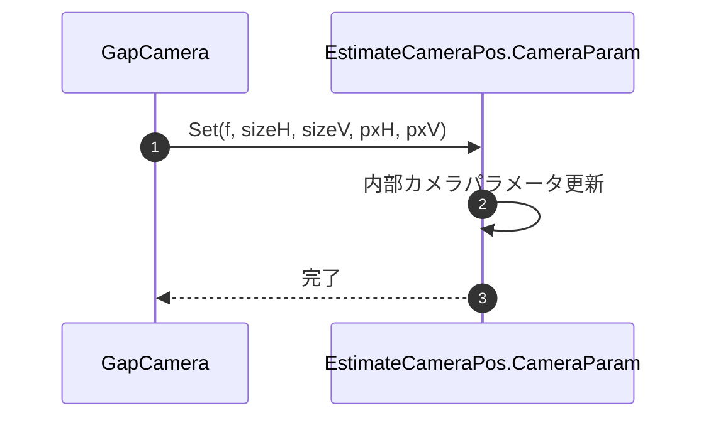
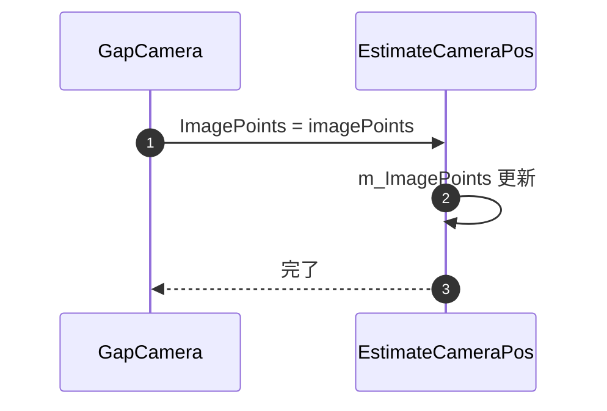
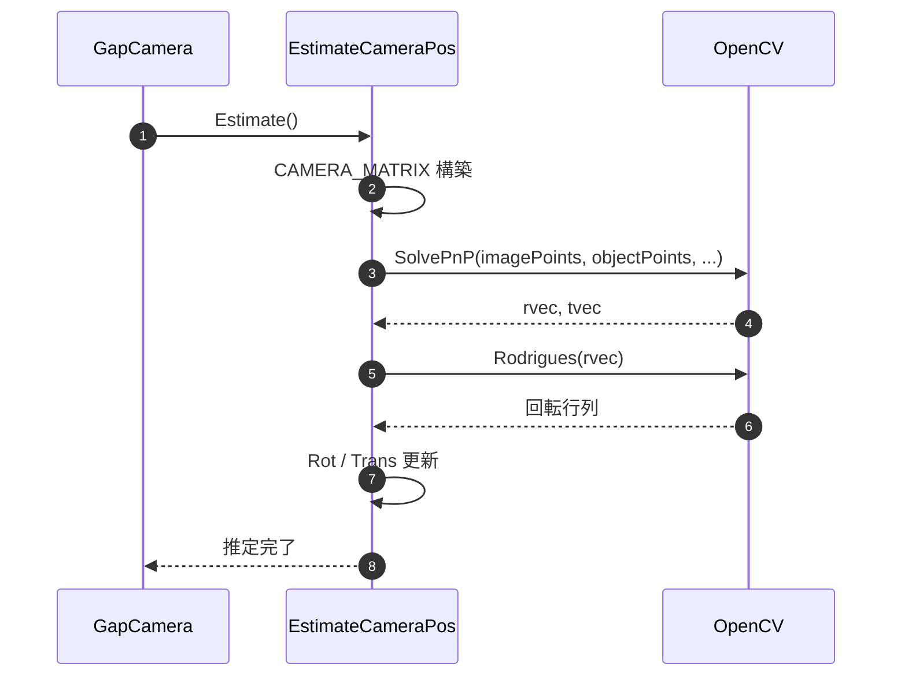
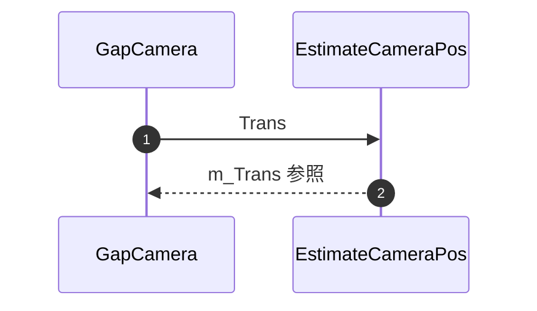

<!-- NiceDiffStart -->
## 差分サマリ（モデル分類）

| 区分 | 対象モデル |
|------|------------|
| 既存ファイル基準 | Chiron/Cancun |
| ColorAlignmentSoftware_Nice基準 | Verona/Capri |

### 参照ソース（Verona/Capri）
- ..\\ColorAlignmentSoftware_Nice\\CAS\\Functions\\GapCamera.cs
- ..\\ColorAlignmentSoftware_Nice\\CAS\\Functions\\TransformImage.cs
- ..\\ColorAlignmentSoftware_Nice\\CAS\\Functions\\EstimateCameraPos.cs
- ..\\ColorAlignmentSoftware_Nice\\CAS\\SDCPClass.cs

### このファイルの差分要点
- 連携メンバ差分: 定義差は小さいため、利用条件差(モデル/距離)を注記。
- 参照差分: 呼出文脈は8-1/8-2と整合させる。

### 更新時の注意
- 既存記述を維持したまま、上記差分観点を各章の手順・IF・例外仕様へ反映する。
- モデル表記は Chiron/Cancun と Verona/Capri を分離して記載する。
<!-- NiceDiffEnd -->

### 8-6. EstimateCameraPos連携メンバ

#### 8-6-1. CameraParameter.Set

| 項目 | 内容 |
|------|------|
| シグネチャ | `public void Set(double f, double SensorSizeH, double SensorSizeV, int SensorPxH, int SensorPxV)` |
| 概要 | 姿勢推定で使用する内部カメラパラメータを更新する |

引数

| No. | 引数名 | 型 | 必須 | 説明 |
|-----|--------|----|------|------|
| 1 | f | double | Y | 焦点距離 |
| 2 | SensorSizeH | double | Y | センサ横幅 |
| 3 | SensorSizeV | double | Y | センサ縦幅 |
| 4 | SensorPxH | int | Y | センサ横画素数 |
| 5 | SensorPxV | int | Y | センサ縦画素数 |

返り値: なし（void）

処理概要（詳細）

| 手順No. | 処理内容 | 詳細 |
|---------|----------|------|
| 1 | 焦点距離設定 | `m_f` を更新する。 |
| 2 | センササイズ設定 | `m_SensorSizeH`、`m_SensorSizeV` を更新する。 |
| 3 | 画素数設定 | `m_SensorPxH`、`m_SensorPxV` を更新する。 |

入力条件・前提条件

| 区分 | 条件 | NG時挙動 |
|------|------|----------|
| 光学パラメータ | `f`、センササイズが正値であること | `Estimate()` 結果が不正 |
| 画素数 | `SensorPxH/V` が正整数であること | カメラ行列が不正 |

条件分岐仕様

| 条件 | 挙動 |
|------|------|
| 条件分岐なし | 受領値で内部パラメータを単純更新する。 |

主要呼出し先

| 呼出し先 | 役割 | 同期/非同期 |
|----------|------|--------------|
| なし | 内部メンバ更新のみ | 同期 |

例外時仕様

| ケース | 捕捉方法 | 通知/伝播 | 後処理 |
|--------|----------|-----------|--------|
| 想定外値入力 | 明示チェックなし | 例外なし | 後続 `Estimate()` の結果へ影響 |

シーケンス図

#### 8-6-2. ImagePoints

| 項目 | 内容 |
|------|------|
| シグネチャ | `public Point2f[] ImagePoints { set; }` |
| 概要 | SolvePnP 入力となる画像上2D点列を設定する |

引数

| No. | 引数名 | 型 | 必須 | 説明 |
|-----|--------|----|------|------|
| 1 | value | Point2f[] | Y | 検出済み画像座標列 |

返り値: なし（set アクセサ）

処理概要（詳細）

| 手順No. | 処理内容 | 詳細 |
|---------|----------|------|
| 1 | 配列保持 | 入力配列参照を `m_ImagePoints` に保持する。 |
| 2 | 後続推定連携 | `Estimate()` で `Mat` 化して SolvePnP へ渡される。 |

入力条件・前提条件

| 区分 | 条件 | NG時挙動 |
|------|------|----------|
| 点数整合 | `ObjectPoints` と同数であること | SolvePnP が失敗する可能性 |
| 座標品質 | 誤検出が少ない2D座標列であること | 推定姿勢が不安定 |

条件分岐仕様

| 条件 | 挙動 |
|------|------|
| 条件分岐なし | 受け取った配列参照を上書き保持する。 |

主要呼出し先

| 呼出し先 | 役割 | 同期/非同期 |
|----------|------|--------------|
| なし | メンバ参照代入のみ | 同期 |

例外時仕様

| ケース | 捕捉方法 | 通知/伝播 | 後処理 |
|--------|----------|-----------|--------|
| null 設定 | 明示チェックなし | 例外なし | 後続 `Estimate()` で失敗する可能性 |

シーケンス図

#### 8-6-3. ObjectPoints

| 項目 | 内容 |
|------|------|
| シグネチャ | `public Point3f[] ObjectPoints { set; }` |
| 概要 | SolvePnP 入力となるワールド座標系3D点列を設定する |

引数

| No. | 引数名 | 型 | 必須 | 説明 |
|-----|--------|----|------|------|
| 1 | value | Point3f[] | Y | 対応する3D座標列 |

返り値: なし（set アクセサ）

処理概要（詳細）

| 手順No. | 処理内容 | 詳細 |
|---------|----------|------|
| 1 | 配列保持 | 入力配列参照を `m_ObjectPoints` に保持する。 |
| 2 | 後続推定連携 | `Estimate()` で `Mat` 化して SolvePnP へ渡される。 |

入力条件・前提条件

| 区分 | 条件 | NG時挙動 |
|------|------|----------|
| 点数整合 | `ImagePoints` と同数であること | SolvePnP が失敗する可能性 |
| 座標系整合 | 2D点列と同じ対応順であること | 推定姿勢が誤る |

条件分岐仕様

| 条件 | 挙動 |
|------|------|
| 条件分岐なし | 受け取った配列参照を上書き保持する。 |

主要呼出し先

| 呼出し先 | 役割 | 同期/非同期 |
|----------|------|--------------|
| なし | メンバ参照代入のみ | 同期 |

例外時仕様

| ケース | 捕捉方法 | 通知/伝播 | 後処理 |
|--------|----------|-----------|--------|
| null 設定 | 明示チェックなし | 例外なし | 後続 `Estimate()` で失敗する可能性 |

シーケンス図

#### 8-6-4. Estimate

| 項目 | 内容 |
|------|------|
| シグネチャ | `public void Estimate()` |
| 概要 | 2D/3D対応点とカメラパラメータから SolvePnP で回転・並進を推定する |

引数: なし

返り値: なし（void）

処理概要（詳細）

| 手順No. | 処理内容 | 詳細 |
|---------|----------|------|
| 1 | 入力 `Mat` 構築 | 歪係数、回転ベクトル、並進ベクトル、2D/3D点 `Mat` を using で生成する。 |
| 2 | カメラ行列生成 | 焦点距離とセンサ寸法から `CAMERA_MATRIX` を構築する。 |
| 3 | PnP解法実行 | `Cv2.SolvePnP(..., SolvePnPFlags.Iterative)` で姿勢を推定する。 |
| 4 | 回転角変換 | `rvec` を `Marshal.Copy` で `m_Rot` に取り込み、ラジアンから度へ変換する。 |
| 5 | 並進取得 | `Cv2.Rodrigues` で回転行列化し、逆行列と `tvec` から `m_Trans` を算出する。 |
| 6 | 後始末 | 生成した `Mat` を `Dispose` または using により解放する。 |

入力条件・前提条件

| 区分 | 条件 | NG時挙動 |
|------|------|----------|
| 2D点列 | `ImagePoints` 設定済みで、十分な対応点数があること | SolvePnP 失敗 |
| 3D点列 | `ObjectPoints` 設定済みで、2D点と順序整合すること | 推定結果が不正 |
| カメラ条件 | `CameraParameter.Set` 済みであること | カメラ行列が不正 |

主要状態更新

| 状態変数 | 更新内容 | 更新タイミング |
|----------|----------|----------------|
| `m_Rot` | 推定回転角（度）3要素 | 手順4 |
| `m_Trans` | 推定並進量3要素 | 手順5 |

条件分岐仕様

| 条件 | 挙動 |
|------|------|
| 解法選択 | 常に `SolvePnPFlags.Iterative` を使用する。 |
| 失敗時分岐 | 明示的な戻り値判定は行わず、下位例外または結果値に依存する。 |

主要呼出し先

| 呼出し先 | 役割 | 同期/非同期 |
|----------|------|--------------|
| `Cv2.SolvePnP` | 姿勢推定を実行する | 同期 |
| `Cv2.Rodrigues` | 回転ベクトルから回転行列へ変換 | 同期 |
| `Marshal.Copy` | `Mat` から配列へ値転送 | 同期 |

例外時仕様

| ケース | 捕捉方法 | 通知/伝播 | 後処理 |
|--------|----------|-----------|--------|
| SolvePnP 失敗 | 下位例外または不正値 | 呼出元へ再送出または結果値反映 | using により一時リソース解放 |
| 入力未設定 | 下位 `Mat` 生成/呼出し例外 | 呼出元へ再送出 | 推定中断 |

シーケンス図

#### 8-6-5. Rot

| 項目 | 内容 |
|------|------|
| シグネチャ | `public double[] Rot { get; }` |
| 概要 | `Estimate()` で算出した回転角配列を返す |

引数: なし

返り値

| 項目 | 型 | 説明 |
|------|----|------|
| Rot | double[] | X/Y/Z 軸回りの回転角（度） |

処理概要（詳細）

| 手順No. | 処理内容 | 詳細 |
|---------|----------|------|
| 1 | 内部配列参照返却 | `m_Rot` の参照をそのまま返す。 |
| 2 | 呼出元利用 | GapCamera 側で Pan/Tilt/Roll 算出に利用する。 |

入力条件・前提条件

| 区分 | 条件 | NG時挙動 |
|------|------|----------|
| 事前推定 | `Estimate()` 実行済みであること | `null` または古い値参照の可能性 |

条件分岐仕様

| 条件 | 挙動 |
|------|------|
| 条件分岐なし | 常に内部配列参照を返す。 |

主要呼出し先

| 呼出し先 | 役割 | 同期/非同期 |
|----------|------|--------------|
| なし | 内部配列参照返却のみ | 同期 |

例外時仕様

| ケース | 捕捉方法 | 通知/伝播 | 後処理 |
|--------|----------|-----------|--------|
| 明示例外なし | 該当なし | なし | 呼出元が返却値を評価 |

シーケンス図

#### 8-6-6. Trans

| 項目 | 内容 |
|------|------|
| シグネチャ | `public double[] Trans { get; }` |
| 概要 | `Estimate()` で算出した並進量配列を返す |

引数: なし

返り値

| 項目 | 型 | 説明 |
|------|----|------|
| Trans | double[] | X/Y/Z 方向の推定並進量 |

処理概要（詳細）

| 手順No. | 処理内容 | 詳細 |
|---------|----------|------|
| 1 | 内部配列参照返却 | `m_Trans` の参照をそのまま返す。 |
| 2 | 呼出元利用 | GapCamera 側で Tx/Ty/Tz 算出に利用する。 |

入力条件・前提条件

| 区分 | 条件 | NG時挙動 |
|------|------|----------|
| 事前推定 | `Estimate()` 実行済みであること | `null` または古い値参照の可能性 |

条件分岐仕様

| 条件 | 挙動 |
|------|------|
| 条件分岐なし | 常に内部配列参照を返す。 |

主要呼出し先

| 呼出し先 | 役割 | 同期/非同期 |
|----------|------|--------------|
| なし | 内部配列参照返却のみ | 同期 |

例外時仕様

| ケース | 捕捉方法 | 通知/伝播 | 後処理 |
|--------|----------|-----------|--------|
| 明示例外なし | 該当なし | なし | 呼出元が返却値を評価 |

シーケンス図

