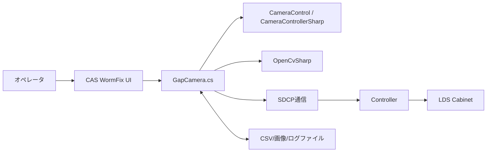
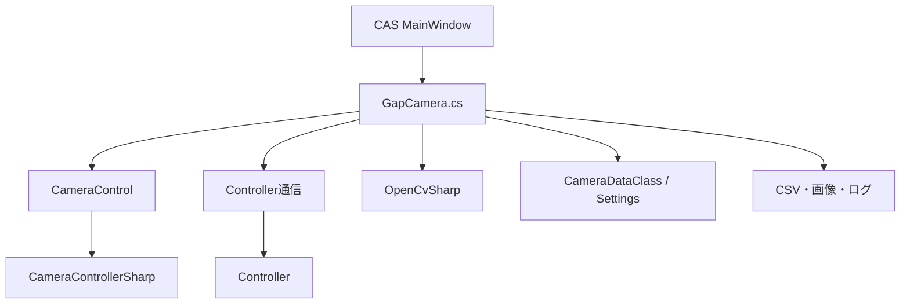
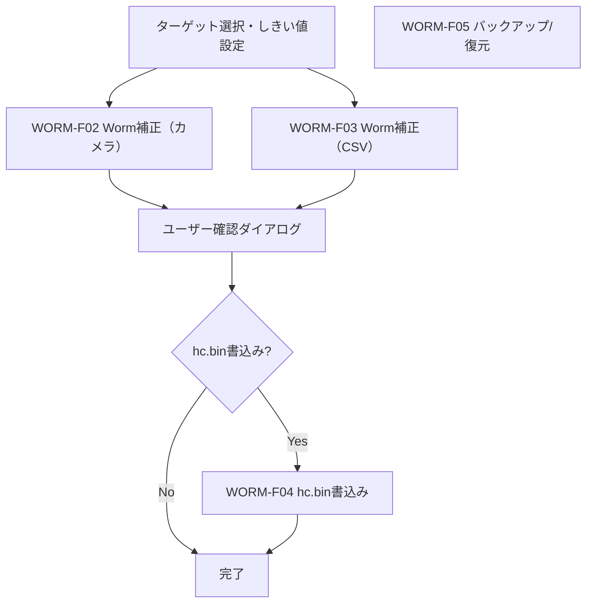
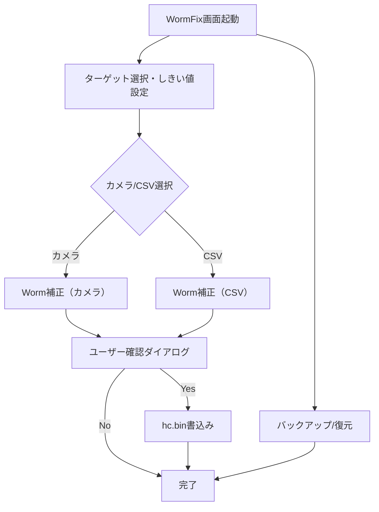

---
# 基本設計書

| 項目 | 内容 |
|------|------|
| プロジェクト名 | ColorAlignmentSoftware |
| システム名 | CAS WormFix |
| 作成日 | 2026/04/27 |
| 作成者 | システム分析チーム |
| バージョン | 1.0 |
| 関連文書 | 要件定義書：docs/02-03.WormFix/WormFix_要件定義書.md |

---

## 1. システム概要書

### 1-1. システム全体像

#### システム概要

WormFix機能はCAS内のワーム現象補正専用機能であり、対象Cabinetの選択、カメラまたはCSVによるターゲット指定、しきい値設定、補正実行、ユーザー確認によるhc.bin書込み、専用CSV/バックアップ/復元を提供する。

本機能は `CAS/Functions/GapCamera.cs` のbtnWormCamAdjStart_Clickを中心に実装され、以下の外部・内部要素と連携する。

- カメラ制御：CameraControl / CameraControllerSharp
- 画像解析：OpenCvSharp
- 設備制御：ControllerへのSDCPコマンド送信
- 設定・永続化：Settings、CSV、測定画像ファイル

#### システム構成図

#### 構成要素一覧

| 構成要素 | 種別 | 役割 | 備考 |
|----------|------|------|------|
| GapCamera.cs | CAS機能モジュール | Worm補正/CSV/カメラ/書込み/復元の制御本体 | MainWindow partial class |
| CameraControl | 外部ライブラリ | カメラ接続・撮影・AF・ライブビュー制御 | CameraControllerSharp経由 |
| OpenCvSharp | 外部ライブラリ | 画像トリミング、領域抽出、解析処理 | Worm検出アルゴリズムで利用 |
| Controller（SDCP） | 外部システム | 補正値の設定・書込み・再構成 | sendSdcpCommand / sendReconfig |
| Settings.Ins.WormFix | 設定ストア | しきい値、カメラ/CSV選択、待機時間など管理 | 機種別設定あり |
| WormFix CSV | ファイル | 補正用ターゲット/色/しきい値データ | WormFix専用形式 |

#### ソリューション方針

| 項目 | 内容 |
|------|------|
| UI駆動方針 | ボタンイベントから非同期処理（Task.Run）を起動し、長時間処理をUI非ブロッキング化する |
| 安全制御方針 | 実行中は `tcMain.IsEnabled=false` で操作を抑止し、競合操作を防止する |
| 進捗管理方針 | `WindowProgress` により残時間・ステップ・メッセージを表示する |
| 装置反映方針 | hc.bin書込みはユーザー確認後にのみ実施 |
| 復旧方針 | 例外時は ThroughMode解除・ユーザー設定復帰・メッセージ表示を必須とする |

---

### 1-2. アプリケーションマップ

#### アプリケーション一覧

| No. | アプリケーション名 | 区分 | 主な役割 | 利用者・利用部門 | 備考 |
|-----|--------------------|------|----------|------------------|------|
| 1 | CAS（WormFix） | 業務アプリ機能 | Worm補正のターゲット指定・補正・書込み操作 | オペレータ | 本設計対象 |
| 2 | CameraControl | 共通ライブラリ | カメラの撮影/AF設定 | CAS内部利用 | DLL参照 |
| 3 | Controller | 外部制御機器 | 補正値の反映・再構成 | CAS内部利用 | SDCP通信 |

#### アプリケーション間関係

| 連携元 | 連携先 | 連携概要 | 主なデータ | 連携方式 |
|--------|--------|----------|------------|----------|
| WormFix | CameraControl | 撮影条件適用、AF、撮影実行 | ShootCondition, AfAreaSetting, 画像 | メソッド呼び出し |
| WormFix | Controller | hc.bin書込み、電源制御 | SDCPコマンド、補正値 | TCP/SDCP |
| WormFix | ファイルシステム | CSV/画像/ログ保存・復元 | WormFix CSV, 画像, ログ | ファイルI/O |

---

## 1-3. アプリケーション機能一覧

| アプリケーション名 | 機能ID | 機能名 | 機能概要 | 利用者 | 優先度 | 備考 |
|--------------------|--------|--------|----------|--------|--------|------|
| CAS WormFix | WORM-F01 | ターゲット選択・しきい値設定 | WormFix専用UIでターゲット・しきい値・カメラ/CSV選択 | オペレータ | 高 | btnWormCamAdjStart_Click |
| CAS WormFix | WORM-F02 | Worm補正（カメラ） | カメラ画像取得・Worm検出・補正値計算 | オペレータ | 高 | detectWormAsync |
| CAS WormFix | WORM-F03 | Worm補正（CSV） | CSVからターゲット/色/しきい値を反映し補正 | オペレータ | 高 | WormAdjustWithCsv |
| CAS WormFix | WORM-F04 | hc.bin書込み | ユーザー確認後にControllerへ書込み | オペレータ | 高 | SaveExecLog, SDCP |
| CAS WormFix | WORM-F05 | バックアップ/復元 | WormFix専用CSV/画像/ログの保存・復元 | オペレータ | 中 | ファイルI/O |

---

## 2. アプリケーション詳細

### 2-1. 機能関連図

---

### 2-2. 各機能仕様

#### 2-2-1. 機能名：ターゲット選択・しきい値設定機能

| 項目 | 内容 |
|------|------|
| 機能ID | WORM-F01 |
| 機能名 | ターゲット選択・しきい値設定機能 |
| 機能概要 | WormFix専用UIでターゲット（対象ユニット）、しきい値（R/G/B）、カメラ/CSV選択を行う |
| 利用者 | オペレータ |
| 起動契機 | WormFixタブのUI操作（ターゲット選択、しきい値入力、カメラ/CSV切替） |
| 入力 | 選択ユニット、しきい値（R/G/B）、カメラ/CSV選択状態 |
| 出力 | UI状態、内部変数更新、ログ |
| 関連機能 | WORM-F02, WORM-F03 |
| 前提条件 | 対象Cabinetが選択済みで矩形であること |
| 事後条件 | UI状態が反映され、次の補正処理が可能 |
| 備考 | btnWormCamAdjStart_Clickの前段 |

#### 2-2-2. 機能名：Worm補正（カメラ）機能

| 項目 | 内容 |
|------|------|
| 機能ID | WORM-F02 |
| 機能名 | Worm補正（カメラ）機能 |
| 機能概要 | カメラ画像取得・Worm検出・補正値計算・進捗表示・例外復帰・ログ記録を行う |
| 利用者 | オペレータ |
| 起動契機 | btnWormCamAdjStart_Click（カメラ選択時） |
| 入力 | 選択ユニット、しきい値（R/G/B）、カメラパラメータ |
| 出力 | Worm検出結果、補正値、進捗ダイアログ、ログ、エラーダイアログ |
| 関連機能 | WORM-F01, WORM-F04 |
| 前提条件 | バックアップデータ存在、しきい値正常、ユニット選択・矩形チェック済み |
| 事後条件 | Worm検出・補正値計算後、ユーザー確認へ遷移 |
| 備考 | detectWormAsync, 進捗・例外・UI復帰・ログ管理含む |

#### 2-2-3. 機能名：Worm補正（CSV）機能

| 項目 | 内容 |
|------|------|
| 機能ID | WORM-F03 |
| 機能名 | Worm補正（CSV）機能 |
| 機能概要 | CSVからターゲット/色/しきい値を反映し補正を実行する |
| 利用者 | オペレータ |
| 起動契機 | btnWormCamAdjStart_Click（CSV選択時） |
| 入力 | CSVファイルパス、選択ユニット、しきい値 |
| 出力 | Worm補正結果、ログ、エラーダイアログ |
| 関連機能 | WORM-F01, WORM-F04 |
| 前提条件 | バックアップデータ存在、CSVファイル正常、ユニット選択済み |
| 事後条件 | Worm補正値計算後、ユーザー確認へ遷移 |
| 備考 | WormAdjustWithCsv |

#### 2-2-4. 機能名：hc.bin書込み機能

| 項目 | 内容 |
|------|------|
| 機能ID | WORM-F04 |
| 機能名 | hc.bin書込み機能 |
| 機能概要 | Worm補正値をユーザー確認後にControllerへ書き込み、ログ・進捗・エラー管理を行う |
| 利用者 | オペレータ |
| 起動契機 | Worm補正後のユーザー確認ダイアログで「Yes」選択時 |
| 入力 | Worm補正値、選択ユニット、CSVファイルパス |
| 出力 | 書込み結果、ログ、進捗、エラーダイアログ |
| 関連機能 | WORM-F02, WORM-F03 |
| 前提条件 | Worm補正値計算済み、ユーザー確認完了 |
| 事後条件 | 書込み完了後、UI復帰・ログ記録 |
| 備考 | SaveExecLog, SDCP、btnWormCamAdjStart_Click内で分岐 |

#### 2-2-5. 機能名：バックアップ/復元機能

| 項目 | 内容 |
|------|------|
| 機能ID | WORM-F05 |
| 機能名 | バックアップ/復元機能 |
| 機能概要 | WormFix専用CSV/画像/ログの保存・復元を行う |
| 利用者 | オペレータ |
| 起動契機 | 専用UI操作（バックアップ/復元ボタン等） |
| 入力 | CSVファイルパス、画像ファイル、ログファイル |
| 出力 | 保存/復元結果、ログ、エラーダイアログ |
| 関連機能 | WORM-F01, WORM-F03 |
| 前提条件 | ファイルパス指定、対象データ存在 |
| 事後条件 | 保存/復元完了後、UI復帰・ログ記録 |
| 備考 | ファイルI/O、btnWormCamAdjStart_Clickからは直接呼ばれない |

---

### 2-3. 画面仕様

#### 2-3-1. WormFix画面

| 項目 | 内容 |
|------|------|
| 画面ID | WORM-S01 |
| 画面名 | WormFix補正画面 |
| 概要 | Worm補正のターゲット選択・しきい値設定・カメラ/CSV切替・補正実行・進捗・結果確認・書込み・バックアップ/復元を一画面で提供 |
| 主なUI部品 | ターゲット選択リスト、しきい値入力欄、カメラ/CSV切替ボタン、補正実行ボタン、進捗ダイアログ、確認ダイアログ、バックアップ/復元ボタン |
| 入力 | ユーザー操作（選択・入力・ボタン押下） |
| 出力 | 進捗・結果・エラー・ログ |
| 備考 | MainWindow.xaml, btnWormCamAdjStart_Click, WindowProgress |

---

### 2-4. 連携仕様

| 連携元 | 連携先 | 連携内容 | 主なデータ | 連携方式 |
|--------|--------|----------|------------|----------|
| WormFix画面 | CameraControl | 撮影条件適用・AF・撮影実行 | ShootCondition, AfAreaSetting, 画像 | メソッド呼び出し |
| WormFix画面 | Controller | hc.bin書込み・電源制御 | SDCPコマンド、補正値 | TCP/SDCP |
| WormFix画面 | ファイルシステム | CSV/画像/ログ保存・復元 | WormFix CSV, 画像, ログ | ファイルI/O |

---

### 2-5. 画面遷移図

---

### 2-6. 入出力項目一覧

| 項目 | 種別 | 入力/出力 | 概要 | 備考 |
|------|------|-----------|------|------|
| 選択ユニット | 内部変数 | 入力 | Worm補正対象のユニット矩形 | UIで選択 |
| しきい値（R/G/B） | 内部変数 | 入力 | Worm検出用しきい値 | UIで入力 |
| カメラ/CSV選択 | 内部変数 | 入力 | 補正モード選択 | UIで切替 |
| CSVファイルパス | ファイル | 入力 | Worm補正用CSV | CSV選択時のみ |
| Worm補正値 | 内部変数 | 出力 | 検出・計算された補正値 | カメラ/CSV共通 |
| 進捗・結果 | UI | 出力 | 進捗ダイアログ・結果メッセージ | WindowProgress |
| エラー | UI | 出力 | エラーダイアログ | 例外時 |
| ログ | ファイル | 出力 | 実行・エラー・操作ログ | SaveExecLog |
| hc.bin | ファイル | 出力 | Controller書込み用バイナリ | 書込み時 |
| バックアップCSV | ファイル | 入出力 | 補正値バックアップ・復元 | バックアップ/復元 |
