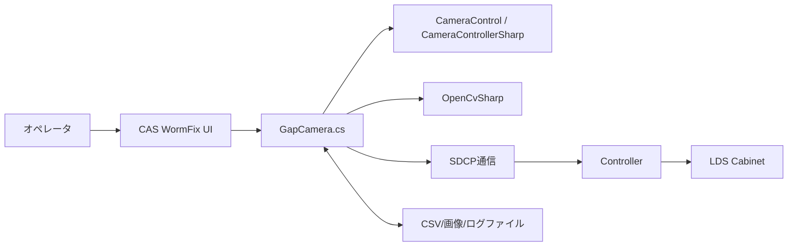
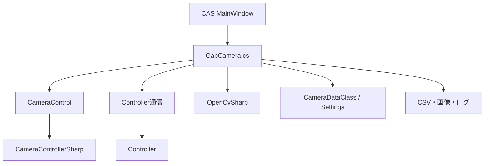
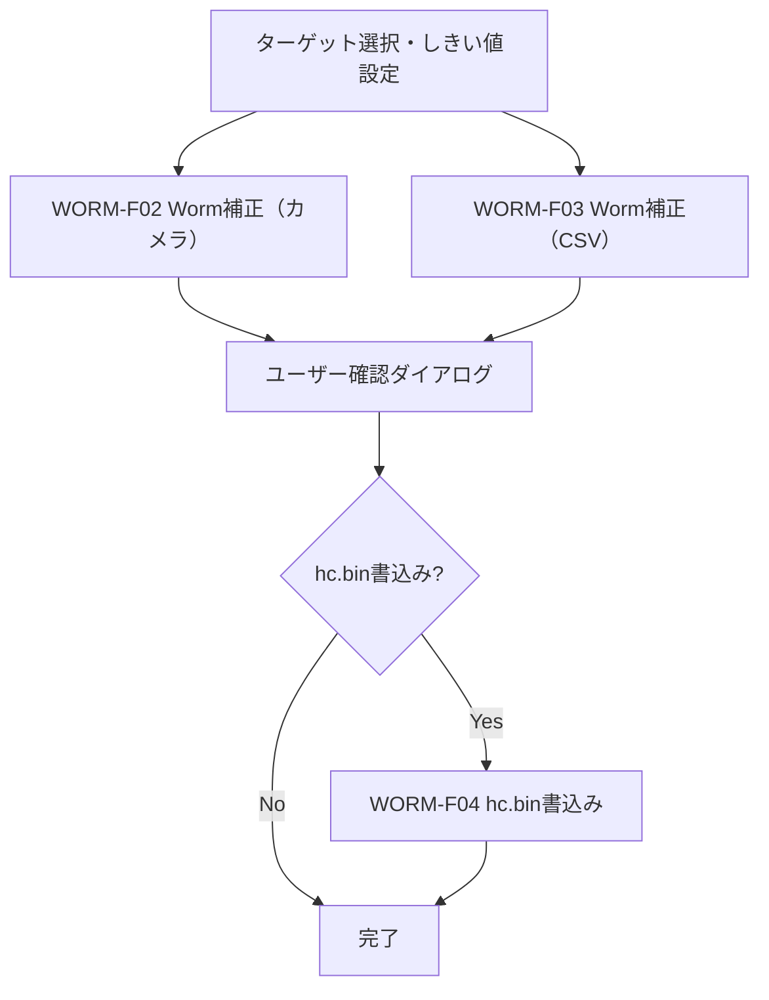
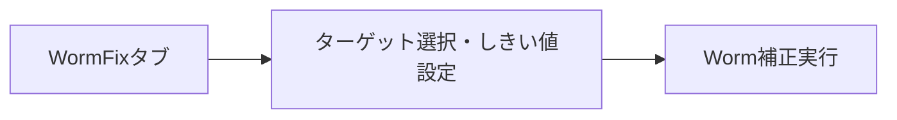
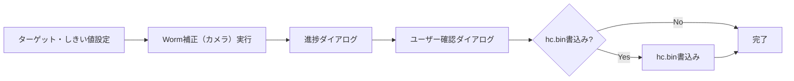
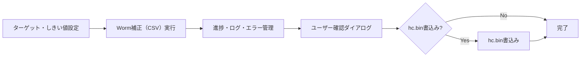
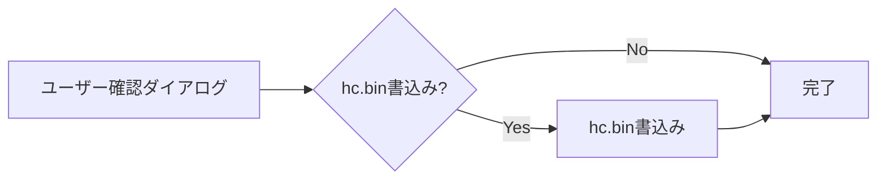

# 基本設計書

| 項目 | 内容 |
|------|------|
| プロジェクト名 | ColorAlignmentSoftware |
| システム名 | CAS WormFix |
| 作成日 | 2026/04/27 |
| 作成者 | システム分析チーム |
| バージョン | 1.0 |
| 関連文書 | 要件定義書：docs/02-03.WormFix/WormFix_要件定義書.md |

---

## 1. システム概要書

### 1-1. システム全体像

#### システム概要
WormFix機能はCAS内のWorm現象補正専用機能であり、対象Cabinetの選択、カメラまたはCSVによるターゲット指定、しきい値設定、補正実行、ユーザー確認によるhc.bin書込み、専用CSVを提供する。
本機能は `CAS/Functions/GapCamera.cs` のbtnWormCamAdjStart_Clickを中心に実装され、以下の外部・内部要素と連携する。

- カメラ制御：CameraControl / CameraControllerSharp
- 画像解析：OpenCvSharp
- 設備制御：ControllerへのSDCPコマンド送信
- 設定・永続化：Settings、CSV、測定画像ファイル

#### システム構成図

#### 構成要素一覧
| 構成要素 | 種別 | 役割 | 備考 |
|----------|------|------|------|
| GapCamera.cs | CAS機能モジュール | Worm補正/CSV/カメラの制御本体 | MainWindow partial class |
| CameraControl | 外部ライブラリ | カメラ接続・撮影・AF・ライブビュー制御 | CameraControllerSharp経由 |
| OpenCvSharp | 外部ライブラリ | 画像トリミング、領域抽出、解析処理 | Worm検出アルゴリズムで利用 |
| Controller（SDCP） | 外部システム | 補正値の設定・書込み・再構成 | sendSdcpCommand / sendReconfig |
| Settings.Ins.WormFix | 設定ストア | しきい値、カメラ/CSV選択、待機時間など管理 | 機種別設定あり |
| WormFix CSV | ファイル | 補正用ターゲット/色 | WormFix専用形式 |

#### ソリューション方針
| 項目 | 内容 |
|------|------|
| UI駆動方針 | ボタンイベントから非同期処理（Task.Run）を起動し、長時間処理をUI非ブロッキング化する |
| 安全制御方針 | 実行中は `tcMain.IsEnabled=false` で操作を抑止し、競合操作を防止する |
| 進捗管理方針 | `WindowProgress` により残時間・ステップ・メッセージを表示する |
| 装置反映方針 | hc.bin書込みはユーザー確認後にのみ実施 |
| 復旧方針 | 例外時は ThroughMode解除・ユーザー設定復帰・メッセージ表示を必須とする |

---

### 1-2. アプリケーションマップ

#### アプリケーション一覧
| No. | アプリケーション名 | 区分 | 主な役割 | 利用者・利用部門 | 備考 |
|-----|--------------------|------|----------|------------------|------|
| 1 | CAS（WormFix） | 業務アプリ機能 | Worm補正のターゲット指定・補正・書込み操作 | オペレータ | 本設計対象 |
| 2 | CameraControl | 共通ライブラリ | カメラの撮影/AF設定 | CAS内部利用 | DLL参照 |
| 3 | Controller | 外部制御機器 | 補正値の反映・再構成 | CAS内部利用 | SDCP通信 |

#### アプリケーション間関係
| 連携元 | 連携先 | 連携概要 | 主なデータ | 連携方式 |
|--------|--------|----------|------------|----------|
| WormFix | CameraControl | 撮影条件適用、AF、撮影実行 | ShootCondition, AfAreaSetting, 画像 | メソッド呼び出し |
| WormFix | Controller | hc.bin書込み、電源制御 | SDCPコマンド、補正値 | TCP/SDCP |
| WormFix | ファイルシステム | CSV/画像/ログ保存・復元 | WormFix CSV, 画像, ログ | ファイルI/O |

---

| アプリケーション名 | 機能ID | 機能名 | 機能概要 | 利用者 | 優先度 | 備考 |
|--------------------|--------|--------|----------|--------|--------|------|
| CAS WormFix | WORM-F01 | ターゲット選択・しきい値設定 | WormFix専用UIでターゲット・しきい値・カメラ/CSV選択 | オペレータ | 高 | btnWormCamAdjStart_Click |
| CAS WormFix | WORM-F02 | Worm補正（カメラ） | カメラ画像取得・Worm検出・補正値計算 | オペレータ | 高 | detectWormAsync |
| CAS WormFix | WORM-F03 | Worm補正（CSV） | CSVからターゲット/色を反映し補正 | オペレータ | 高 | WormAdjustWithCsv |
| CAS WormFix | WORM-F04 | hc.bin書込み | ユーザー確認後にControllerへ書込み | オペレータ | 高 | SaveExecLog, SDCP |

---

## 2. アプリケーション詳細

### 2-1. 機能関連図

#### 補足説明
| 項目 | 内容 |
|------|------|
| 機能間連携の要点 | Worm補正値はユーザー確認後にControllerへ反映。CSV指定・カメラ測定どちらも進捗・例外復帰・ログ管理を徹底。 |
| 前提条件 | 対象Cabinetが選択済みで矩形であること、カメラ/Controllerが接続可能であること。 |
| 制約事項 | 実行中の補正は排他。設定・機種差分は `Settings.Ins.WormFix` に依存。 |

---

### 2-2. 各機能仕様

#### 2-2-1. 機能名：ターゲット選択・しきい値設定機能

##### 2-2-1-1. 機能概要
| 項目 | 内容 |
|------|------|
| 機能ID | WORM-F01 |
| 機能名 | ターゲット選択・しきい値設定機能 |
| 機能概要 | WormFix専用UIでターゲット（対象ユニット）、しきい値（R/G/B）、カメラ/CSV選択を行う |
| 利用者 | オペレータ |
| 起動契機 | WormFixタブのUI操作（ターゲット選択、しきい値入力、カメラ/CSV切替） |
| 入力 | 選択ユニット、しきい値（R/G/B）、カメラ/CSV選択状態 |
| 出力 | UI状態、内部変数更新、ログ |
| 関連機能 | WORM-F02, WORM-F03 |
| 前提条件 | 対象Cabinetが選択済みで矩形であること |
| 事後条件 | UI状態が反映され、次の補正処理が可能 |
| 備考 | btnWormCamAdjStart_Clickの前段 |

##### 2-2-1-2. 画面仕様
| 画面ID | 画面名 | 目的 | 利用者 | 備考 |
|--------|--------|------|--------|------|
| WORM-S01 | WormFix補正画面 | ターゲット選択・しきい値設定・カメラ/CSV切替 | オペレータ | CASメイン画面内タブ |

###### 画面遷移

###### 画面入出力項目一覧
| 項目ID | 項目名 | 区分（入力/表示） | 型 | 必須 | 備考 |
|--------|--------|-------------------|----|------|------|
| WORM-I01 | 選択ユニット | 入力 | UnitInfo[] | 必須 | 矩形要件 |
| WORM-I02 | しきい値R | 入力 | int | 必須 | | 
| WORM-I03 | しきい値G | 入力 | int | 必須 | |
| WORM-I04 | しきい値B | 入力 | int | 必須 | |
| WORM-I05 | カメラ/CSV選択 | 入力 | enum | 必須 | |

##### 2-2-1-3. 関連システムインタフェース仕様
| IF ID | 連携先システム | 方向 | 連携方式 | 概要 | 備考 |
|--------|----------------|------|----------|------|------|
| WORM-IF-01 | UI | 双方向 | イベント | ユーザー操作受付 | |

##### 2-2-1-4. 入出力処理仕様
| 区分 | 項目名 | 説明 | 型 | 必須 | 備考 |
|------|--------|------|----|------|------|
| 入力 | 選択ユニット | 補正対象 | UnitInfo[] | 必須 | |
| 入力 | しきい値R/G/B | Worm検出用しきい値 | int | 必須 | |
| 入力 | カメラ/CSV選択 | 補正モード | enum | 必須 | |
| 出力 | UI状態 | 入力値反映 | - | 必須 | |
| 出力 | ログ | 操作記録 | text | 任意 | |

---

#### 2-2-2. 機能名：Worm補正（カメラ）機能

##### 2-2-2-1. 機能概要
| 項目 | 内容 |
|------|------|
| 機能ID | WORM-F02 |
| 機能名 | Worm補正（カメラ）機能 |
| 機能概要 | カメラ画像取得・Worm検出・補正値計算・進捗表示・例外復帰・ログ記録を行う |
| 利用者 | オペレータ |
| 起動契機 | btnWormCamAdjStart_Click（カメラ選択時） |
| 入力 | 選択ユニット、しきい値（R/G/B）、カメラパラメータ |
| 出力 | Worm検出結果、補正値、進捗ダイアログ、ログ、エラーダイアログ |
| 関連機能 | WORM-F01, WORM-F04 |
| 前提条件 | しきい値正常、ユニット選択・矩形チェック済み |
| 事後条件 | Worm検出・補正値計算後、ユーザー確認へ遷移 |
| 備考 | detectWormAsync, 進捗・例外・UI復帰・ログ管理含む |

##### 2-2-2-2. 画面仕様
| 画面ID | 画面名 | 目的 | 利用者 | 備考 |
|--------|--------|------|--------|------|
| WORM-S01 | WormFix補正画面 | 補正実行・進捗・結果確認 | オペレータ | CASメイン画面内タブ |
| WORM-S02 | WindowProgress | 進捗・残時間・中断操作 | オペレータ | 計測/補正中表示 |

###### 画面遷移

###### 画面入出力項目一覧
| 項目ID | 項目名 | 区分（入力/表示） | 型 | 必須 | 備考 |
|--------|--------|-------------------|----|------|------|
| WORM-I01 | 選択ユニット | 入力 | UnitInfo[] | 必須 | |
| WORM-I02 | しきい値R | 入力 | int | 必須 | |
| WORM-I03 | しきい値G | 入力 | int | 必須 | |
| WORM-I04 | しきい値B | 入力 | int | 必須 | |
| WORM-O01 | Worm検出結果 | 表示 | object | 必須 | |
| WORM-O02 | 進捗・結果 | 表示 | string | 必須 | |
| WORM-O03 | エラー | 表示 | string | 任意 | |

##### 2-2-2-3. 関連システムインタフェース仕様
| IF ID | 連携先システム | 方向 | 連携方式 | 概要 | 備考 |
|--------|----------------|------|----------|------|------|
| WORM-IF-02 | CameraControl | 双方向 | DLL呼び出し | 撮影条件設定・AF・撮影 | |
| WORM-IF-03 | OpenCvSharp | 双方向 | DLL呼び出し | 画像解析・Worm検出 | |
| WORM-IF-04 | Controller | 双方向 | SDCP | パターン表示/補正系制御 | |

##### 2-2-2-4. 入出力処理仕様
| 区分 | 項目名 | 説明 | 型 | 必須 | 備考 |
|------|--------|------|----|------|------|
| 入力 | 選択ユニット | 補正対象 | UnitInfo[] | 必須 | |
| 入力 | しきい値R/G/B | Worm検出用しきい値 | int | 必須 | |
| 入力 | カメラパラメータ | 撮影条件 | object | 必須 | |
| 出力 | Worm検出結果 | 検出・計算結果 | object | 必須 | |
| 出力 | 進捗・結果 | 進捗・結果メッセージ | string | 必須 | |
| 出力 | エラー | エラーメッセージ | string | 任意 | |
| 出力 | ログ | 実行・エラー・操作ログ | text | 任意 | |

#### 2-2-3. 機能名：Worm補正（CSV）機能

##### 2-2-3-1. 機能概要
| 項目 | 内容 |
|------|------|
| 機能ID | WORM-F03 |
| 機能名 | Worm補正（CSV）機能 |
| 機能概要 | CSVからターゲット/色を反映し補正を実行する |
| 利用者 | オペレータ |
| 起動契機 | btnWormCamAdjStart_Click（CSV選択時） |
| 入力 | CSVファイルパス、選択ユニット、しきい値 |
| 出力 | Worm補正結果、ログ、エラーダイアログ |
| 関連機能 | WORM-F01, WORM-F04 |
| 前提条件 | CSVファイル正常、ユニット選択済み |
| 事後条件 | Worm補正値計算後、ユーザー確認へ遷移 |
| 備考 | WormAdjustWithCsv |

##### 2-2-3-2. 画面仕様
| 画面ID | 画面名 | 目的 | 利用者 | 備考 |
|--------|--------|------|--------|------|
| WORM-S01 | WormFix補正画面 | CSV指定で補正実行・進捗・結果確認 | オペレータ | CASメイン画面内タブ |

###### 画面遷移

###### 画面入出力項目一覧
| 項目ID | 項目名 | 区分（入力/表示） | 型 | 必須 | 備考 |
|--------|--------|-------------------|----|------|------|
| WORM-I01 | 選択ユニット | 入力 | UnitInfo[] | 必須 | |
| WORM-I02 | しきい値R | 入力 | int | 必須 | |
| WORM-I03 | しきい値G | 入力 | int | 必須 | |
| WORM-I04 | しきい値B | 入力 | int | 必須 | |
| WORM-I06 | CSVファイルパス | 入力 | string | 必須 | |
| WORM-O01 | Worm補正結果 | 表示 | object | 必須 | |
| WORM-O02 | 進捗・結果 | 表示 | string | 必須 | |
| WORM-O03 | エラー | 表示 | string | 任意 | |

##### 2-2-3-3. 関連システムインタフェース仕様
| IF ID | 連携先システム | 方向 | 連携方式 | 概要 | 備考 |
|--------|----------------|------|----------|------|------|
| WORM-IF-05 | ファイルシステム | 送受信 | CSV I/O | 補正値読込 | |
| WORM-IF-04 | Controller | 双方向 | SDCP | パターン表示/補正系制御 | |

##### 2-2-3-4. 入出力処理仕様
| 区分 | 項目名 | 説明 | 型 | 必須 | 備考 |
|------|--------|------|----|------|------|
| 入力 | 選択ユニット | 補正対象 | UnitInfo[] | 必須 | |
| 入力 | しきい値R/G/B | Worm検出用しきい値 | int | 必須 | |
| 入力 | CSVファイルパス | CSV指定 | string | 必須 | |
| 出力 | Worm補正結果 | 検出・計算結果 | object | 必須 | |
| 出力 | 進捗・結果 | 進捗・結果メッセージ | string | 必須 | |
| 出力 | エラー | エラーメッセージ | string | 任意 | |
| 出力 | ログ | 実行・エラー・操作ログ | text | 任意 | |

---

#### 2-2-4. 機能名：hc.bin書込み機能

##### 2-2-4-1. 機能概要
| 項目 | 内容 |
|------|------|
| 機能ID | WORM-F04 |
| 機能名 | hc.bin書込み機能 |
| 機能概要 | Worm補正値をユーザー確認後にControllerへ書き込み、ログ・進捗・エラー管理を行う |
| 利用者 | オペレータ |
| 起動契機 | Worm補正後のユーザー確認ダイアログで「Yes」選択時 |
| 入力 | Worm補正値、選択ユニット、CSVファイルパス |
| 出力 | 書込み結果、ログ、進捗、エラーダイアログ |
| 関連機能 | WORM-F02, WORM-F03 |
| 前提条件 | Worm補正値計算済み、ユーザー確認完了 |
| 事後条件 | 書込み完了後、UI復帰・ログ記録 |
| 備考 | SaveExecLog, SDCP、btnWormCamAdjStart_Click内で分岐 |

##### 2-2-4-2. 画面仕様
| 画面ID | 画面名 | 目的 | 利用者 | 備考 |
|--------|--------|------|--------|------|
| WORM-S02 | WindowProgress | 書込み進捗表示 | オペレータ | 書込み中表示 |

###### 画面遷移

###### 画面入出力項目一覧
| 項目ID | 項目名 | 区分（入力/表示） | 型 | 必須 | 備考 |
|--------|--------|-------------------|----|------|------|
| WORM-I01 | 選択ユニット | 入力 | UnitInfo[] | 必須 | |
| WORM-O04 | 書込み進捗 | 表示 | string | 必須 | |
| WORM-O05 | 書込み結果 | 表示 | bool | 必須 | |
| WORM-O03 | エラー | 表示 | string | 任意 | |

##### 2-2-4-3. 関連システムインタフェース仕様
| IF ID | 連携先システム | 方向 | 連携方式 | 概要 | 備考 |
|--------|----------------|------|----------|------|------|
| WORM-IF-04 | Controller | 送信 | SDCP | 補正値設定/書込み/Panel制御/Reconfig | |

##### 2-2-4-4. 入出力処理仕様
| 区分 | 項目名 | 説明 | 型 | 必須 | 備考 |
|------|--------|------|----|------|------|
| 入力 | Worm補正値 | 書込み対象 | object | 必須 | |
| 入力 | 選択ユニット | 書込み対象 | UnitInfo[] | 必須 | |
| 入力 | CSVファイルパス | CSV指定 | string | 任意 | |
| 出力 | 書込み結果 | 成否情報 | bool | 必須 | |
| 出力 | 進捗・結果 | 進捗・結果メッセージ | string | 必須 | |
| 出力 | エラー | エラーメッセージ | string | 任意 | |
| 出力 | ログ | 実行・エラー・操作ログ | text | 任意 | |

---
### 2-3. データベース仕様

#### データ概要

本機能はRDBを使用せず、ファイルベースでデータを管理する。

| データ名 | 概要 | 保持期間 | 更新主体 | 備考 |
|----------|------|----------|----------|------|
| WormFix CSV | Worm補正用ターゲット・色の保存 | 運用保管期間 | オペレータ操作 | CSV |
| 測定画像ファイル | Worm補正時撮影画像 | 測定フォルダ世代管理 | 補正処理 | RAW等 |
| 実行ログ | 処理履歴・進捗ログ | 世代管理ポリシーに従う | Worm補正・書込み処理 | `SaveExecLog` |
| hc.bin | 補正値書込み用バイナリ | 運用保管期間 | 書込み処理 | Controllerへ転送 |

#### ERD

対象外（RDB未使用）

#### テーブル仕様

対象外

#### カラム仕様

対象外

#### CRUD一覧

| 機能ID | 機能名 | ファイル名 | Create | Read | Update | Delete |
|--------|--------|------------|--------|------|--------|--------|
| WORM-F01 | ターゲット選択・しきい値設定 | WormFix CSV | ○ | ○ | ○ | - |
| WORM-F02 | Worm補正（カメラ） | 測定画像ファイル | ○ | ○ | - | - |
| WORM-F03 | Worm補正（CSV） | WormFix CSV | - | ○ | - | - |
| WORM-F04 | hc.bin書込み | hc.bin | ○ | - | - | - |
| WORM-F04 | 実行ログ | 実行ログ | ○ | ○ | - | - |

---
### 2-4. メッセージ・コード仕様

#### メッセージ一覧

| メッセージID | 区分 | メッセージ内容 | 表示条件 | 対応方針 | 備考 |
|--------------|------|----------------|----------|----------|------|
| WORM-MSG-001 | 情報 | Worm補正（カメラ）完了 | 補正成功 | 完了通知 | ダイアログ表示 |
| WORM-MSG-002 | エラー | Worm補正（カメラ）失敗 | 補正失敗 | エラー通知 | 結果表示更新 |
| WORM-MSG-003 | 情報 | Worm補正（CSV）完了 | 補正成功 | 完了通知 | 条件付き書込み確認 |
| WORM-MSG-004 | エラー | Worm補正（CSV）失敗 | 補正失敗 | エラー通知 | - |
| WORM-MSG-005 | 情報 | hc.bin書込み完了 | 書込み成功 | 完了通知 | - |
| WORM-MSG-006 | エラー | hc.bin書込み失敗 | 書込み失敗 | エラー通知 | - |
| WORM-MSG-007 | 情報 | WormFix CSV読込完了 | CSV正常読込 | 完了通知 | - |
| WORM-MSG-008 | エラー | WormFix CSV読込失敗 | CSV読込失敗 | エラー通知 | - |

#### コード一覧

| コード種別 | コード値 | コード名称 | 説明 | 備考 |
|------------|----------|------------|------|------|
| WormFixStatus | Before | 補正前 | 補正前表示状態 | enum |
| WormFixStatus | Result | 補正後 | 補正結果表示状態 | enum |
| WormFixStatus | Measure | 計測のみ | 計測結果表示状態 | enum |
| WormFixMode | Camera | カメラモード | カメラ画像による補正 | enum |
| WormFixMode | CSV | CSVモード | CSV指定による補正 | enum |

### 2-5. 機能/データ配置仕様

#### 配置方針

| 項目 | 内容 |
|------|------|
| 機能配置方針 | UIイベント・業務制御は `GapCamera.cs`、カメラ制御は外部ライブラリ、装置制御はSDCP通信に分離 |
| データ配置方針 | 設定はSettings、実行結果はファイル（CSV/画像/ログ/hc.bin）で保持 |
| 配置上の制約 | 実機接続とファイル権限に依存。条件付きコンパイルの分岐差分あり |

#### 機能配置一覧

| 機能ID | 機能名 | 配置先 | 理由 | 備考 |
|--------|--------|--------|------|------|
| WORM-F01 | ターゲット選択・しきい値設定 | CAS/Functions/GapCamera.cs | UI連携と補正前処理を一体化 | タイマ駆動 |
| WORM-F02 | Worm補正（カメラ） | CAS/Functions/GapCamera.cs | 画像取得・解析・進捗管理の統合 | 非同期処理 |
| WORM-F03 | Worm補正（CSV） | CAS/Functions/GapCamera.cs | CSV読込・補正アルゴリズム統合 | - |
| WORM-F04 | hc.bin書込み | CAS/Functions/GapCamera.cs | 書込み手順を一元管理 | Reconfig含む |

#### データ配置一覧

| データ名 | 配置先 | 保存形式 | バックアップ方針 | 備考 |
|----------|--------|----------|------------------|------|
| WormFix CSV | 測定フォルダ | CSVファイル | 手動バックアップ機能提供 | WormFix専用形式 |
| 測定画像 | 測定フォルダ | 画像ファイル | 世代管理 | WormFix_yyyyMMddHHmm |
| 実行ログ | 測定フォルダ | テキスト | 世代管理 | SaveExecLog |
| 運用設定 | CAS設定 | 設定ファイル | 設定管理で保全 | Settings.Ins.WormFix |
| hc.bin | 測定フォルダ | バイナリ | 書込み時に自動生成 | Controllerへ転送 |

---

## 3. 付録

### 3-1. 用語集

| 用語 | 説明 |
|------|------|
| Worm現象 | ある画素を点灯すると、それと回路接続された画素が、ライン上に点灯する不良現象 |
| Worm補正 | U/Fデータを用いて、Worm現象が生じる画素が点灯しないようにする処理 |
| ROM書込み | 補正値を装置側へ確定反映する処理（hc.bin） |
| WormFix CSV | Worm補正用ターゲット・色を保持するCSVファイル |
| SDCP | Controller制御に使用する通信コマンド体系 |

---

### 3-2. 改版履歴

| バージョン | 日付 | 作成者 | 変更内容 |
|------------|------|--------|----------|
| 1.0 | 2026/04/27 | システム分析チーム | 初版（WormFix機能設計） |
| 1.1 | 2026/04/28 | システム分析チーム | 2-3, 2-4, 2-5, 3章追加・粒度統一 |

