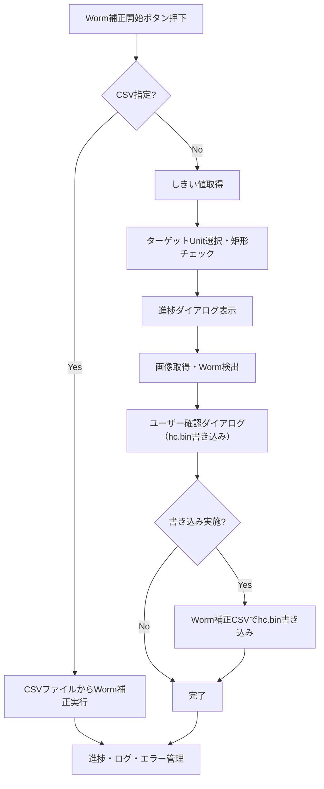
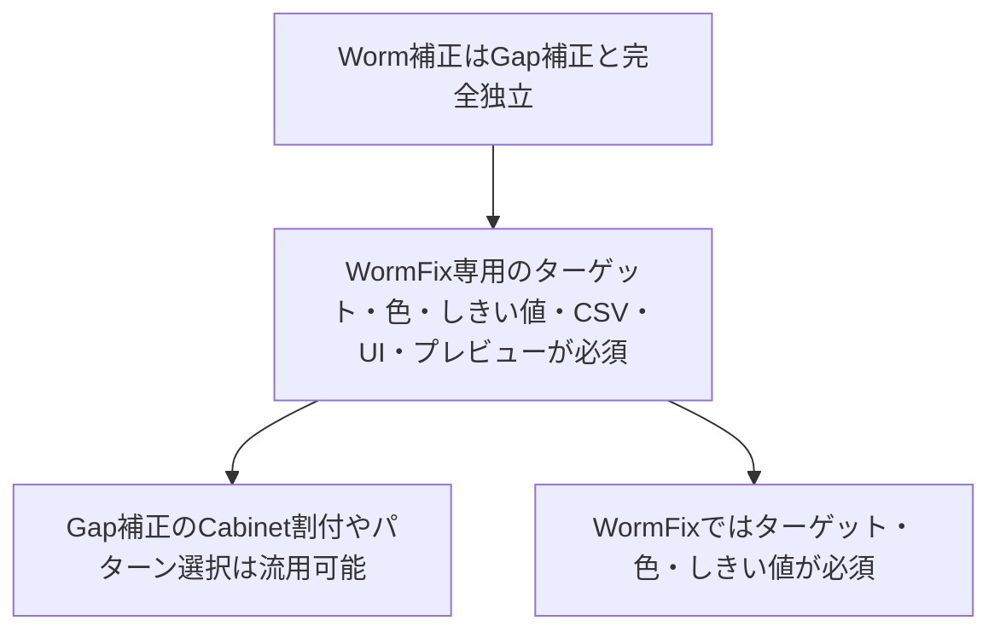

# WormFix 要件定義書

| 項目 | 内容 |
|------|------|
| プロジェクト名 | ColorAlignmentSoftware（WormFix） |
| 作成日 | 2026/04/27 |
| 作成者 | システム分析チーム |
| バージョン | 1.0 |

---

## 1. ビジネス要件

### 1-1. To-Be業務プロセス概要
WormFixは、LEDパネルの「Worm」現象（ある画素が点灯すると、それに回路上接続された画素がライン状に点灯する現象）を現場で迅速に補正するための専用機能です。Gap補正とは完全に独立した専用ロジック・専用UI・専用パラメータで動作します。

### 1-2. 業務内容・業務特性（ルール、制約）
| 業務名 | 業務内容 | ルール・制約 |
|--------|----------|-------------|
| Wormカメラ補正 | 内蔵パターンを表示したWallをカメラ測定によりWorm位置を判別し、該当する画素のU/F補正データに書き込みを行う | Cabinet/Unit選択必須、CSV指定時は座標軸書き込みのみ |
| Worm位置合わせ | WormFix専用UIでカメラ位置合わせを実施し測定可能状態を作る | 対象Cabinetは選択済みかつ矩形であること |

---

### 1-3. 組織構成、要員、設備
#### 組織構成
- CASアプリ開発担当
- 画像解析・補正ロジック担当
- 設備評価（カメラ/Controller）担当

#### 要員スキル・規模
- C#（WPF、非同期処理）
- 画像解析（OpenCvSharp）
- カメラ制御（CameraControl/CameraControllerSharp）
- Controller通信（SDCPコマンド運用）

#### 必要設備
- Windows PC（CAS実行環境）
- Sony Alphaカメラ（例: ILCE-6400）
- 対応レンズ
- Controller接続ネットワーク
- LDS実機（Cabinet）

---

### 1-4. 業務KPIとその目標値（WormFix専用KPI例）
| KPI | 現状値 | 目標値 | 達成期限 |
|-----|--------|--------|---------|
| Worm補正後の色ムラ | - | 目視でワーム現象が消失 | 運用開始時 |
| Worm補正実行成功率 | - | 99.0%以上 | 運用開始時 |
| Worm補正の処理時間 | - | 10分以内 | 運用開始時 4K2Kサイズ |

---

### 1-5. 概要業務フロー（WormFix専用・実装ベース詳細）

#### 詳細ポイント
- ボタン押下時、まずUI排他制御・進捗ウィンドウ表示・ログ記録を行う。
- Cabinet/Unit選択の妥当性を検証し、異常時はエラーダイアログ・UI復帰・タブ切替を必ず行う。
- カメラ測定時はしきい値取得・ターゲットUnit選択・矩形チェック・進捗表示・画像取得・Worm検出を非同期で実行。
- CSV指定時は即補正実行し、進捗・ログ・エラー管理へ。
- Worm検出後はユーザー確認ダイアログを表示し、書き込み選択時のみCSVから再度補正実行。
- 進捗推定時間の計算・表示を必ず行う。
- 例外発生時は必ずUI・ボタン状態・進捗ウィンドウを復帰・クローズする。
- 補正完了後は「Write Data」ボタン等の有効化・メッセージ表示を行う。

---

### 1-7. ビジネス制約
| 制約種別 | 内容 |
|----------|------|
| スケジュール | 導入現場の作業時間短縮を重視し、10分以内で補正完了することを目標とする |
| コスト | 既存CAS基盤・既存カメラ制御ライブラリを前提に追加開発を最小化 |
| 技術・運用 | カメラ機種（例: ILCE-6400）、LEDモデル、Controller構成に依存。対象Cabinetは必ず矩形選択・事前選択必須。 |
| その他 | WormFix専用のCSV形式を採用し、Gap補正とは完全独立運用とする |

### 1-8. その他の業務要件
- 作業中断（Abort）時に安全に復帰できること（例外発生時はUI・ボタン状態・進捗ウィンドウを必ず復帰・クローズ）
- エラー時は作業者が対処可能な日本語メッセージをダイアログで表示すること
- 設定値（撮影条件、補正回数、しきい値等）は運用現場で変更可能であること
- カメラ/Controller/LEDモデルの組み合わせによる制約・注意事項はマニュアルに明記すること
- 進捗推定時間の計算・表示を必ず行うこと

## 2. WormFix固有の要件（GapCamera_要件定義書との差分のみ記載）

| 項目 | 内容 |
|------|------|
| 機能概要 | WormFix（カメラ測定またはCSV指定）によるWorm位置判別・色補正の実行（Gap補正ロジック・UIとは完全独立） |
| 入力 | ・カメラ測定閾値（R/G/B） ・カメラ/CSV選択状態 ・WormFix専用の対象ユニット選択状態 |
| 主な処理フロー | 1. WormFix専用ログ記録 2. CSV指定時はCSVから補正実行（進捗・排他・例外復帰含む） 3. カメラ測定時は閾値取得・ユニット選択チェック・画像取得・Worm検出（進捗・排他・例外復帰含む） 4. Worm検出後、ユーザーにhc.bin書き込み確認ダイアログ表示 5. 書き込み選択時はCSVから再度補正実行 6. 完了時はUI復帰・メッセージ表示・ボタン有効化 |
| エラー処理 | ・CSVファイル/閾値異常時はエラーダイアログ表示・処理中断 ・例外発生時はエラーダイアログ表示・UI復帰・進捗ウィンドウ復帰 |
| UI連携 | ・WormFix専用進捗ダイアログ・ステータス表示更新 ・ボタンの有効/無効制御 |
| ログ | WormFix専用の処理開始・終了・エラー・ユーザー選択内容をExecLogに記録 |
| ユニーク要素 | ・WormFix専用のカメラ測定/CSV切替 ・Worm検出後のユーザー確認によるhc.bin書き込み制御 ・WormFix専用の閾値入力UI・進捗表示 |

---

## 3. 制約・特記事項

