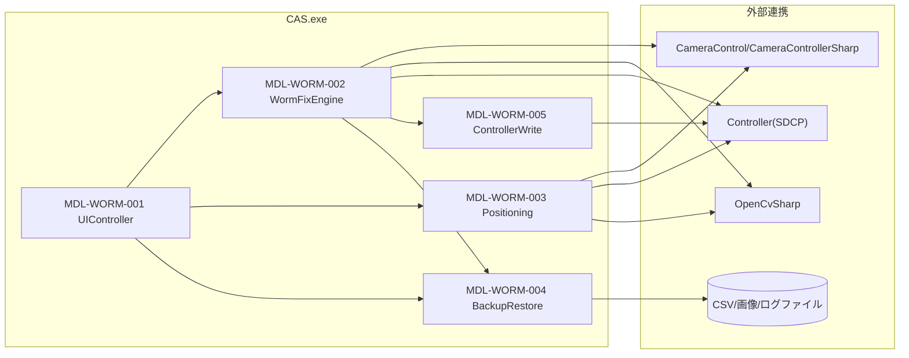

# 2. モジュール配置図（モジュールの物理配置設計）

## 2-1. 物理配置図

## 2-2. 配置一覧

| 配置区分 | 配置先パス/ノード | 配置モジュール | 配置理由 |
|----------|-------------------|----------------|----------|
| 実行モジュール | CAS/Functions/GapCamera.cs | MDL-WORM-001〜005 | Worm補正・画像取得・検出・バックアップ等を単一機能ファイルに集約しているため |
| 外部カメラ連携 | CameraControl.dll | Positioning/WormFixEngine | 撮影・AF・ライブビューのため |
| 外部制御連携 | Controller (SDCP) | ControllerWrite/BackupRestore | 補正値設定・Write/Reconfigのため |
| ファイル永続化 | 測定フォルダ/任意CSVパス | WormFixEngine/BackupRestore | 測定結果・補正値の保存/読込のため |
