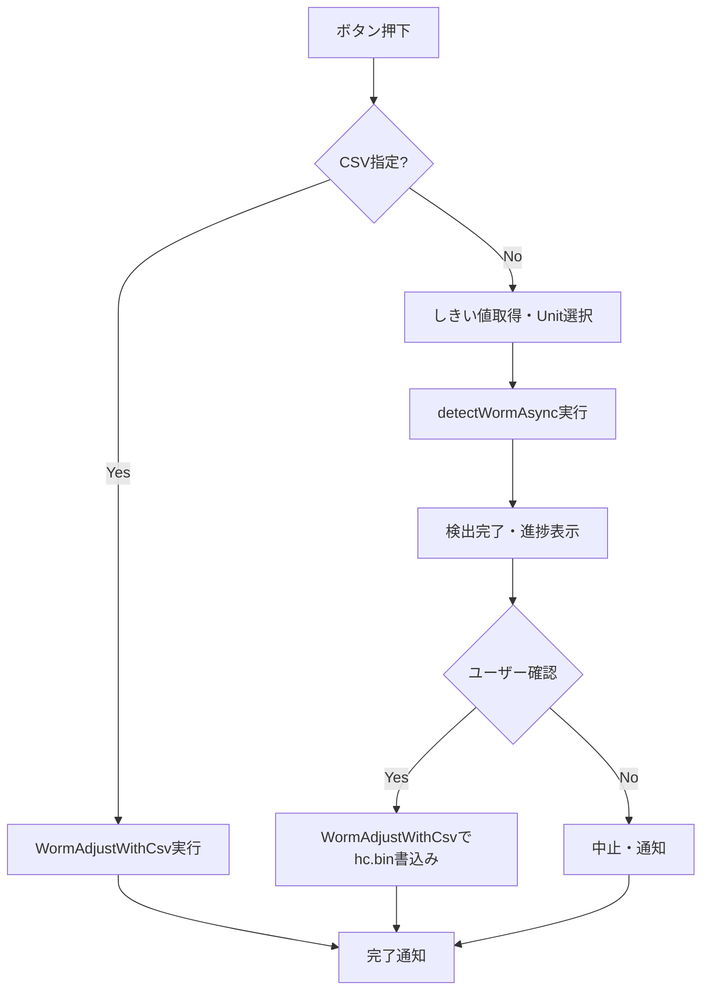

# 4. モジュール仕様（詳細）

WormFixシステムの各モジュールの詳細仕様を記載します。

---

（この章はWormFix実装に基づき、測定/補正の区別を撤廃した一体型設計に整理しています）

## 4-1. MDL-WORM-001: WormFixUIController

### 4-1-1. 基本情報
| 項目 | 内容 |
|------|------|
| モジュールID | MDL-WORM-001 |
| モジュール名 | WormFixUIController |
| 分類 | 画面/ビジネスロジック |
| 呼出元 | オペレータUI操作 |
| 呼出先 | MDL-WORM-002〜005 |
| トランザクション | 無 |
| 再実行性 | 可（処理完了/エラー後に再実行可能） |

### 4-1-2. btnWormCamAdjStart_Click処理フロー

### 4-1-3. btnWormCamAdjStart_Click処理手順
| 手順No. | 処理内容 | 入力 | 出力 | 操作対象 | 備考 |
|---------|----------|------|------|----------|------|
| 1 | Cabinet/Unit選択・しきい値取得 | UI入力 | 検証結果 | 画面UI | 入力不備時はエラー表示 |
| 2 | CSV指定時はWormAdjustWithCsv実行 | CSVパス | 書込結果 | ファイル |  |
| 3 | カメラ測定時はdetectWormAsync実行 | 画像・しきい値 | 検出結果 | 画像処理 |  |
| 4 | 検出後ユーザー確認ダイアログ | - | 書込可否 | ダイアログ | Yesでhc.bin書込み、Noで中止 |
| 5 | 結果通知・後処理 | 実行結果 | 通知・状態復帰 | UI/設定 | 完了/失敗通知、表示復帰等 |
