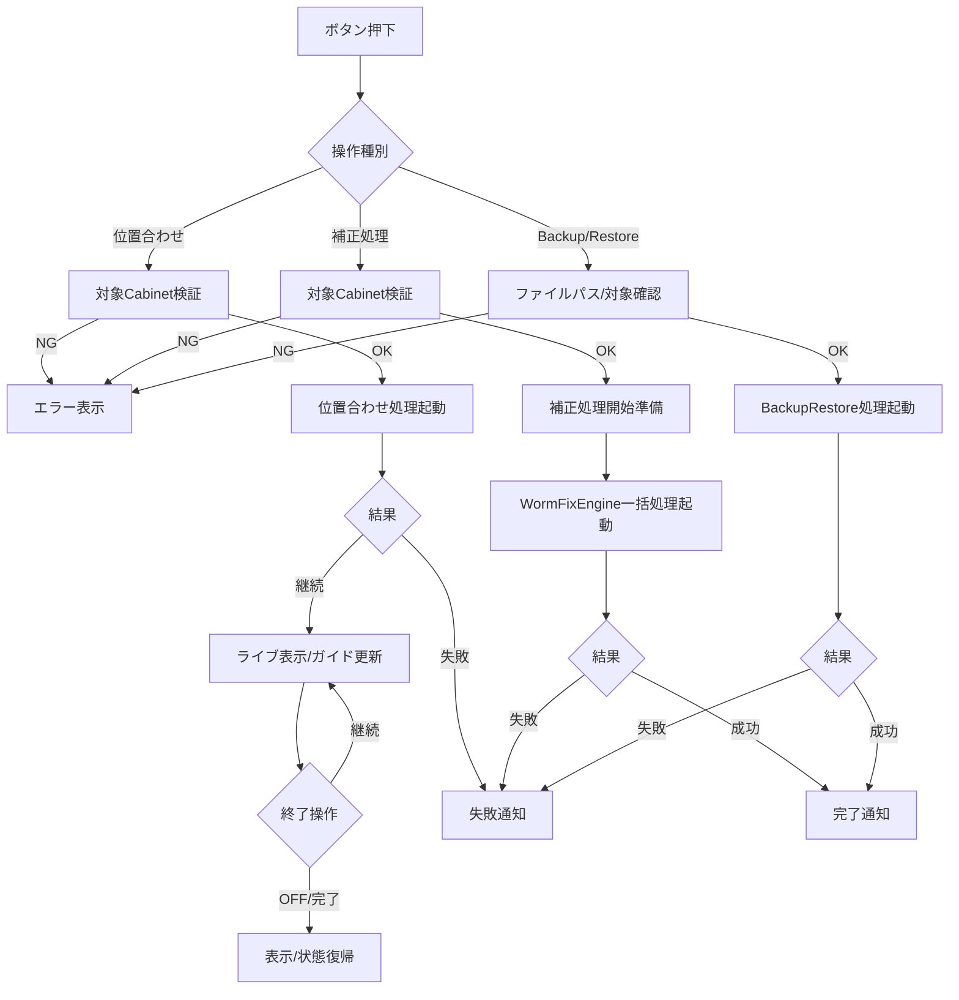

# 4. モジュール仕様（詳細）

WormFixシステムの各モジュールの詳細仕様を記載します。

---

（この章はWormFix実装に基づき、測定/補正の区別を撤廃した一体型設計に整理しています）

## 4-1. MDL-WORM-001: WormFixUIController

### 4-1-1. 基本情報
| 項目 | 内容 |
|------|------|
| モジュールID | MDL-WORM-001 |
| モジュール名 | WormFixUIController |
| 分類 | 画面/ビジネスロジック |
| 呼出元 | オペレータUI操作 |
| 呼出先 | MDL-WORM-002〜005 |
| トランザクション | 無 |
| 再実行性 | 可（処理完了/エラー後に再実行可能） |

### 4-1-2. 処理フロー

### 4-1-3. 処理手順
| 手順No. | 処理内容 | 入力 | 出力 | 操作対象 | 備考 |
|---------|----------|------|------|----------|------|
| 1 | 操作種別判定 | 押下ボタン/トグル種別 | 処理分岐 | WormFixタブUI | 位置合わせ、補正処理、Backup/Restoreを判定 |
| 2 | 対象Cabinet/入力値チェック | Cabinet選択状態、ファイルパス等 | 実行可否 | 画面選択配列、入力UI | `CheckSelectedUnits`、入力不備時はエラー表示 |
| 3 | 位置合わせ開始/更新 | 対象Cabinet、表示設定 | ライブ表示、ガイド状態 | `tbtnWormFixSetPos`、画像UI | 位置合わせ時のみ。ON/OFFとタイマ更新を制御 |
| 4 | 補正処理開始準備 | 対象Cabinet | Progress UI、画面操作禁止 | `WindowProgress`、`tcMain.IsEnabled` | 補正処理開始時に進捗表示と排他制御を設定 |
| 5 | WormFixEngine一括処理起動 | 対象Cabinet | 補正値計算・画像取得・検出・書込み | WormFixEngine | `btnWormCamAdjStart_Click`, `detectWormAsync`, `WormAdjustWithCsv` をTask.Runで起動 |
| 6 | Backup/Restore処理起動 | path、対象種別 | 保存/復元結果 | WormBackupRestoreService | path確認後に対象処理を起動 |
| 7 | 後処理 | 実行結果 | 通知・状態復帰 | UI/設定 | 完了/失敗通知、ThroughMode解除、表示復帰等 |
