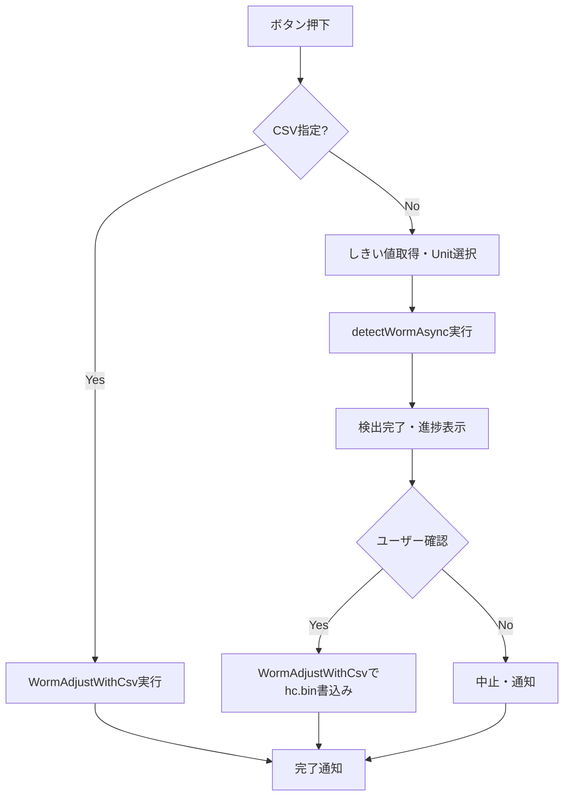
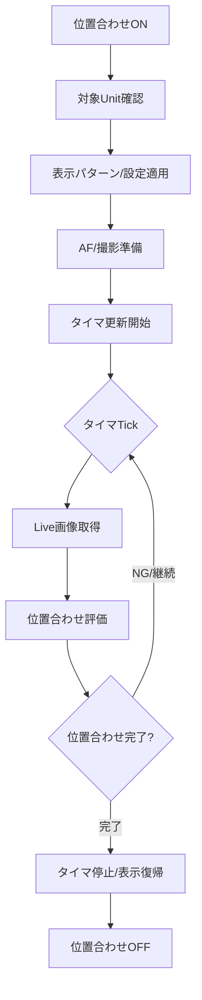

# 4. モジュール仕様（詳細）

WormFixシステムの各モジュールの詳細仕様を記載します。

---

（この章はWormFix実装に基づき、測定/補正の区別を撤廃した一体型設計に整理しています）

## 4-1. MDL-WORM-001: WormFixUIController

### 4-1-1. 基本情報
| 項目 | 内容 |
|------|------|
| モジュールID | MDL-WORM-001 |
| モジュール名 | WormFixUIController |
| 分類 | 画面/ビジネスロジック |
| 呼出元 | オペレータUI操作 |
| 呼出先 | MDL-WORM-002〜005 |
| トランザクション | 無 |
| 再実行性 | 可（処理完了/エラー後に再実行可能） |

### 4-1-2. btnWormCamAdjStart_Click処理フロー

### 4-1-3. btnWormCamAdjStart_Click処理手順
| 手順No. | 処理内容 | 入力 | 出力 | 操作対象 | 備考 |
|---------|----------|------|------|----------|------|
| 1 | Cabinet/Unit選択・しきい値取得 | UI入力 | 検証結果 | 画面UI | 入力不備時はエラー表示 |
| 2 | CSV指定時はWormAdjustWithCsv実行 | CSVパス | 書込結果 | ファイル |  |
| 3 | カメラ測定時はdetectWormAsync実行 | 画像・しきい値 | 検出結果 | 画像処理 |  |
| 4 | 検出後ユーザー確認ダイアログ | - | 書込可否 | ダイアログ | Yesでhc.bin書込み、Noで中止 |
| 5 | 結果通知・後処理 | 実行結果 | 通知・状態復帰 | UI/設定 | 完了/失敗通知、表示復帰等 |

### 4-1-4. 操作対象仕様（画面、テーブル、ファイル）
| 対象種別 | 対象名 | 操作内容 | 操作タイミング | 主キー/識別子 | 備考 |
|----------|--------|----------|----------------|---------------|------|
| 画面 | WormFixタブ | ボタン操作/結果表示 | ユーザー操作時 | コントロール名 | 測定/補正/書込み/CSV指定 |
| 画面 | `btnWormCamAdjStart` | クリック | Worm補正開始 | Button | 非同期処理 |
| 画面 | WindowProgress | 表示/更新/Close | 補正・書込み中 | ウィンドウインスタンス | 進捗・中断操作含む |
| 画面 | ファイルダイアログ | CSV/画像/バイナリ選択 | CSV指定/書込み時 | ダイアログインスタンス | path確定用 |
| ファイル | WormFix CSV | 読込/書込 | CSV指定時 | path | 補正値保存/復元 |
| ファイル | 測定画像 | 出力 | 実行中 | 日時フォルダ | 画像保存 |
| ファイル | hc.bin | 書込 | 書込み時 | path | 補正値書込み |

### 4-1-5. インタフェース仕様（引数・返り値）
| 項目 | 内容 |
|------|------|
| インタフェース名 | WormFix系イベントハンドラ群 |
| 概要 | Worm補正・CSV指定・書込み等のUIイベントを業務処理へ中継する |
| シグネチャ | `private async void btnWormCamAdjStart_Click(object sender, RoutedEventArgs e)` ほか |
| 呼出条件 | WormFixタブのボタン操作 |

引数一覧
| No. | 引数名 | 型 | 必須 | 説明 | バリデーション |
|-----|--------|----|------|------|----------------|
| 1 | sender | object | Y | イベント送信元 | null許容 |
| 2 | e | RoutedEventArgs/EventArgs | Y | イベント情報 | 操作元イベント型と整合 |

返り値一覧
| No. | 項目名 | 型 | 説明 | 備考 |
|-----|--------|----|------|------|
| 1 | なし | void | UIイベント処理 | 非同期イベントを含む。例外は内部catch |

### 4-1-6. 例外処理仕様
| No. | 例外/エラー条件 | 検知方法 | 対応内容 | ユーザー通知 | ログ出力 | リトライ/継続可否 |
|-----|------------------|----------|----------|--------------|----------|------------------|
| 1 | 入力値不正 | 入力値検証 | 処理中断/タブ復帰 | エラーダイアログ | 任意ログ | 可 |
| 2 | CSV/画像読込失敗 | ファイルI/O例外 | 処理中断 | エラーダイアログ | 任意ログ | 可 |
| 3 | 補正処理失敗 | 画像解析例外 | 処理中断 | エラーダイアログ | 任意ログ | 可 |
| 4 | 書込み失敗 | 書込み例外 | 処理中断 | エラーダイアログ | 任意ログ | 可 |
| 5 | ユーザー中断 | Abort例外 | 中断として終了 | Abort表示 | 任意ログ | 可 |

### 4-1-7. ログ仕様
| ログ種別 | 出力条件 | 出力項目 | 保持期間 | マスキング方針 |
|----------|----------|----------|----------|----------------|
| 実行ログ | 補正・書込み開始/終了/主要ステップ | 時刻、処理名、進捗 | 測定フォルダ世代管理 | 個人情報なし |

## 4-2. MDL-WORM-002: WormFixPositioning

### 4-2-1. 基本情報
| 項目 | 内容 |
|------|------|
| モジュールID | MDL-WORM-002 |
| モジュール名 | WormFixPositioning |
| 分類 | ビジネスロジック |
| 呼出元 | UIController |
| 呼出先 | CameraControl, Controller, 画像表示 |
| トランザクション | 無 |
| 再実行性 | 可（位置合わせの再開始可能） |

### 4-2-2. 処理フロー

### 4-2-3. 処理手順
| 手順No. | 処理内容 | 入力 | 出力 | 操作対象 | 備考 |
|---------|----------|------|------|----------|------|
| 1 | 測定レベル設定 | モデル名 | m_MeasureLevel | Settings | モデル分岐 |
| 2 | 撮影条件選択 | カメラ名 | m_ShootCondition | Settings | カメラ分岐 |
| 3 | 対象抽出 | Unit選択 | `lstTgtUnits` | 画面配列 | 矩形チェックあり |
| 4 | ThroughMode/表示制御 | targetUnits | 表示状態 | Controller | ... |
| 5 | タイマ駆動補正 | live画像 | 位置補正ガイド | UI画像 | ... |

### 4-2-4. 操作対象仕様（画面、テーブル、ファイル）
| 対象種別 | 対象名 | 操作内容 | 操作タイミング | 主キー/識別子 | 備考 |
|----------|--------|----------|----------------|---------------|------|
| 画面 | `btnWormFixSetPos` | ON/OFF切替 | ユーザー操作 | ToggleState | 実行中はタイマ連動 |
| 画面 | `imgWormFixCameraView` | ライブ表示更新 | タイマTick | ImageControl | 位置合わせ用 |
| 外部IF | Controller | パターン/画質設定 | 位置合わせ開始時 | ControllerID | 複数Controller対応 |

### 4-2-5. インタフェース仕様（引数・返り値）
| 項目 | 内容 |
|------|------|
| インタフェース名 | 位置合わせ処理 |
| 概要 | 位置合わせ開始・更新・停止を制御 |
| シグネチャ | `private void btnWormFixSetPos_Click(object sender, RoutedEventArgs e)` |
| 呼出条件 | トグルON/OFF、タイマ更新 |

引数一覧
| No. | 引数名 | 型 | 必須 | 説明 | バリデーション |
|-----|--------|----|------|------|----------------|
| 1 | sender | object | Y | トリガUI | - |
| 2 | e | RoutedEventArgs | Y | イベント情報 | - |

返り値一覧
| No. | 項目名 | 型 | 説明 | 備考 |
|-----|--------|----|------|------|
| 1 | なし | void | UI制御のみ | 例外は通知 |

### 4-2-6. 例外処理仕様
| No. | 例外/エラー条件 | 検知方法 | 対応内容 | ユーザー通知 | ログ出力 | リトライ/継続可否 |
|-----|------------------|----------|----------|--------------|----------|------------------|
| 1 | 設定値不正 | Parse失敗 | 位置合わせ停止 | エラーダイアログ | 任意 | 可 |
| 2 | 位置合わせ中例外 | try-catch | ThroughMode解除・設定復帰 | エラーダイアログ | 任意 | 可 |

### 4-2-7. ログ仕様
| ログ種別 | 出力条件 | 出力項目 | 保持期間 | マスキング方針 |
|----------|----------|----------|----------|----------------|
| 実行ログ | ON/OFF、主要設定適用時 | モデル、設定値、処理状態 | 測定フォルダ世代管理 | 機密値除外 |

## 4-3. MDL-WORM-003: WormMeasurementEngine

### 4-3-1. 基本情報
| 項目 | 内容 |
|------|------|
| モジュールID | MDL-WORM-003 |
| モジュール名 | WormMeasurementEngine |
| 分類 | ビジネスロジック |
| 呼出元 | WormFixUIController（btnWormCamAdjStart_Click）|
| 呼出先 | WormAdjustWithCsv, detectWormAsync, WindowProgress, ControllerWriteService |
| トランザクション | 無 |
| 再実行性 | 可（UI/進捗復帰後に再実行可能）|

### 4-3-2. 処理フロー

### 4-3-3. 処理手順
| 手順No. | 処理内容 | 入力 | 出力 | 操作対象 | 備考 |
|---------|----------|------|------|----------|------|
| 1 | Cabinet/Unit選択・しきい値取得 | UI入力 | 検証結果 | 画面UI | 入力不備時はエラー表示 |
| 2 | CSV指定時はWormAdjustWithCsv実行 | CSVパス | 書込結果 | ファイル | CSV指定時のみ |
| 3 | カメラ測定時はdetectWormAsync実行 | 画像・しきい値 | 検出結果 | 画像処理 | カメラ選択時のみ。詳細は下記参照 |

#### detectWormAsync 詳細処理フロー
1. 対象Cabinet/Unit情報から測定範囲・分割数・物理パラメータを決定
2. OpenCvSharp DLL存在確認、信号レベル・カメラパラメータ設定
3. ユーザー設定保存、調整用設定投入、AF実行・カメラ位置保存
4. 黒・ウインドウ・白・赤・緑・青・ハッチ等の各種パターン画像を順次撮影し、RAW→Mat変換・バイナリ保存
5. ワーム撮影用に暗条件で黒・タイルドット画像を分割ごとに撮影
6. カラーマトリクス計算、モジュールコーナー・ピクセル座標・ワームエリア算出
7. 撮影画像・黒画像・フラット画像を用いて色ごとにシェーディング補正・色域変換
8. しきい値で二値化→ノイズ除去→輪郭抽出→小領域除去
9. ワームエリアごとにROI抽出・マスク適用し、輪郭の面積比でワーム判定
10. 判定結果をWormInfoリストに格納し、disablePixel.csvへ出力
11. 検出結果を可視化画像（result.bmp等）として保存
12. 撮影後はカメラ設定・ユーザー設定を復帰、ログ世代管理

主な内部処理：
- 画像取得（CaptureImage, loadArwFile, SaveMatBinary）
- 幾何補正・色域変換（Cv2.Transform, カラーマトリクス）
- 二値化・ノイズ除去（Cv2.Threshold, Cv2.GaussianBlur, Cv2.FindContours）
- ワーム判定（ROI抽出、面積比判定、WormInfo生成）
- 結果出力（CSV, BMP）
- 進捗表示・例外処理・リソース解放
| 4 | 検出後ユーザー確認ダイアログ | - | 書込可否 | ダイアログ | Yesでhc.bin書込み、Noで中止 |
| 5 | 結果通知・後処理 | 実行結果 | 通知・状態復帰 | UI/設定 | 完了/失敗通知、表示復帰等 |

### 4-3-4. 操作対象仕様（画面、テーブル、ファイル）
| 対象種別 | 対象名 | 操作内容 | 操作タイミング | 主キー/識別子 | 備考 |
|----------|--------|----------|----------------|---------------|------|
| 画面 | WormFixタブ | ボタン操作/結果表示 | ユーザー操作時 | コントロール名 | 測定/補正/書込み/CSV指定 |
| 画面 | `btnWormCamAdjStart` | クリック | Worm補正開始 | Button | 非同期処理 |
| 画面 | WindowProgress | 表示/更新/Close | 補正・書込み中 | ウィンドウインスタンス | 進捗・中断操作含む |
| 画面 | ファイルダイアログ | CSV/画像/バイナリ選択 | CSV指定/書込み時 | ダイアログインスタンス | path確定用 |
| ファイル | WormFix CSV | 読込/書込 | CSV指定時 | path | 補正値保存/復元 |
| ファイル | 測定画像 | 出力 | 実行中 | 日時フォルダ | 画像保存 |
| ファイル | hc.bin | 書込 | 書込み時 | path | 補正値書込み |

### 4-3-5. インタフェース仕様（引数・返り値）
| 項目 | 内容 |
|------|------|
| インタフェース名 | WormFix系イベントハンドラ群（btnWormCamAdjStart_Click, WormAdjustWithCsv, detectWormAsync ほか）|
| 概要 | Worm補正・CSV指定・書込み等のUIイベントを業務処理へ中継する |
| シグネチャ | `private async void btnWormCamAdjStart_Click(object sender, RoutedEventArgs e)` ほか |
| 呼出条件 | WormFixタブのボタン操作 |

引数一覧
| No. | 引数名 | 型 | 必須 | 説明 | バリデーション |
|-----|--------|----|------|------|----------------|
| 1 | sender | object | Y | イベント送信元 | null許容 |
| 2 | e | RoutedEventArgs/EventArgs | Y | イベント情報 | 操作元イベント型と整合 |

返り値一覧
| No. | 項目名 | 型 | 説明 | 備考 |
|-----|--------|----|------|------|
| 1 | なし | void | UIイベント処理 | 非同期イベントを含む。例外は内部catch |

### 4-3-6. 例外処理仕様
| No. | 例外/エラー条件 | 検知方法 | 対応内容 | ユーザー通知 | ログ出力 | リトライ/継続可否 |
|-----|------------------|----------|----------|--------------|----------|------------------|
| 1 | 入力値不正 | 入力値検証 | 処理中断/タブ復帰 | エラーダイアログ | 任意ログ | 可 |
| 2 | CSV/画像読込失敗 | ファイルI/O例外 | 処理中断 | エラーダイアログ | 任意ログ | 可 |
| 3 | 補正処理失敗 | 画像解析例外 | 処理中断 | エラーダイアログ | 任意ログ | 可 |
| 4 | 書込み失敗 | 書込み例外 | 処理中断 | エラーダイアログ | 任意ログ | 可 |
| 5 | ユーザー中断 | Abort例外 | 中断として終了 | Abort表示 | 任意ログ | 可 |

### 4-3-7. ログ仕様
| ログ種別 | 出力条件 | 出力項目 | 保持期間 | マスキング方針 |
|----------|----------|----------|----------|----------------|
| 実行ログ | 補正・書込み開始/終了/主要ステップ | 時刻、処理名、進捗 | 測定フォルダ世代管理 | 個人情報なし |

