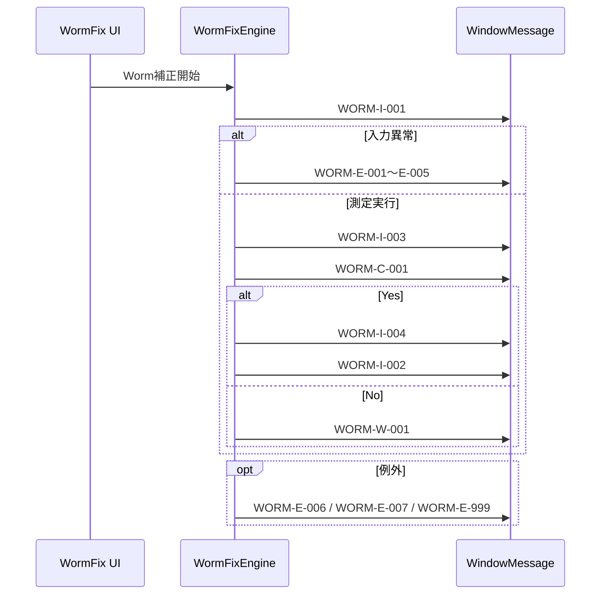

## 6. メッセージ仕様

### 6-1. メッセージ一覧

| メッセージ名称           | メッセージID | 種別     | 表示メッセージ                                                        | 内容説明                                 | 対応アクション |
|-------------------------|--------------|----------|-----------------------------------------------------------------------|------------------------------------------|----------------|
| 補正開始                | WORM-I-001   | 情報     | Start Worm Adjust.                                                    | 補正処理開始時にログ記録                 | OK             |
| バックアップデータなし   | WORM-E-001   | 異常通知 | There is not the module data file.                                    | Cabinet/Unitバックアップデータ未検出      | 再実行         |
| しきい値異常            | WORM-E-002   | 異常通知 | Threshold value is wrong.                                             | しきい値（R/G/B）入力異常                | 再入力         |
| Wormフォルダ未検出      | WORM-E-003   | 異常通知 | Cannot find Worm folder.                                              | 測定用フォルダが存在しない               | 再実行         |
| ユニット選択異常        | WORM-E-004   | 異常通知 | (Exception内容)                                                       | Unit選択・矩形性チェック失敗             | 再選択         |
| カメラ位置セット異常    | WORM-E-005   | 異常通知 | (Exception内容)                                                       | カメラ位置セット失敗                     | 再実行         |
| 測定処理異常            | WORM-E-006   | 異常通知 | (Exception内容)                                                       | 測定処理例外                             | 再実行         |
| 補正処理完了            | WORM-I-002   | 情報     | Fix Worm Complete.                                                    | 補正処理正常終了                         | OK             |
| 測定完了                | WORM-I-003   | 情報     | Detect Worm Complete!                                                 | 測定正常終了                             | OK             |
| hc.bin書込み確認        | WORM-C-001   | 確認     | Detect Worm Complete!\r\nDo you want to continue write hc.bin for fix worm? | 測定後のユーザー確認                     | Yes/No         |
| hc.bin書込み成功        | WORM-I-004   | 情報     | Write hc.bin.                                                         | hc.bin書込み成功                         | OK             |
| hc.bin書込み中止        | WORM-W-001   | 警告     | Abort to write hc.bin.                                                | ユーザーが書込みを中止                   | 再実行         |
| 補正処理失敗            | WORM-E-007   | 異常通知 | Failed in Fix Worm.                                                   | 補正処理失敗                             | 再実行         |
| その他例外              | WORM-E-999   | 異常通知 | (Exception内容)                                                       | その他の例外                             | 再実行         |

### 6-2. メッセージ運用ルール

| 項目         | ルール                                   |
|--------------|------------------------------------------|
| ID採番       | `WORM-{I/W/E/C}-連番`                    |
| 多言語対応   | 無（英語メッセージ固定）                 |
| 表示経路     | `WindowMessage` / `ShowMessageWindow`    |
| 例外内容     | 実際のException.Messageをそのまま表示     |
| 確認ダイアログ | Yes/No選択肢でユーザーに書込み可否を確認 |

### 6-3. メッセージ遷移と発火条件

| フェーズ | 主メッセージID | 発火条件 | 次アクション |
|----------|----------------|----------|--------------|
| 処理開始 | WORM-I-001 | Worm補正開始ボタン押下 | 入力検証へ進む |
| 入力異常 | WORM-E-001〜E-005 | CSV不在、しきい値不正、Unit選択不正など | 再入力または再実行 |
| 測定異常 | WORM-E-006 | detectWormAsync 実行時例外 | 測定を中断し復帰 |
| 測定完了 | WORM-I-003 | 測定処理が正常完了 | WORM-C-001 へ遷移 |
| 書込み確認 | WORM-C-001 | 測定完了後のユーザー確認 | Yesで書込み、Noで中止 |
| 書込み成功 | WORM-I-004 | `hc.bin` 書込み成功 | 完了通知 |
| 書込み中止 | WORM-W-001 | 確認ダイアログで No | UI復帰 |
| 補正完了 | WORM-I-002 | 補正処理正常終了 | 処理終了 |
| 補正失敗 | WORM-E-007/E-999 | 補正またはその他例外 | 再実行 |

### 6-4. メッセージ表示シーケンス

