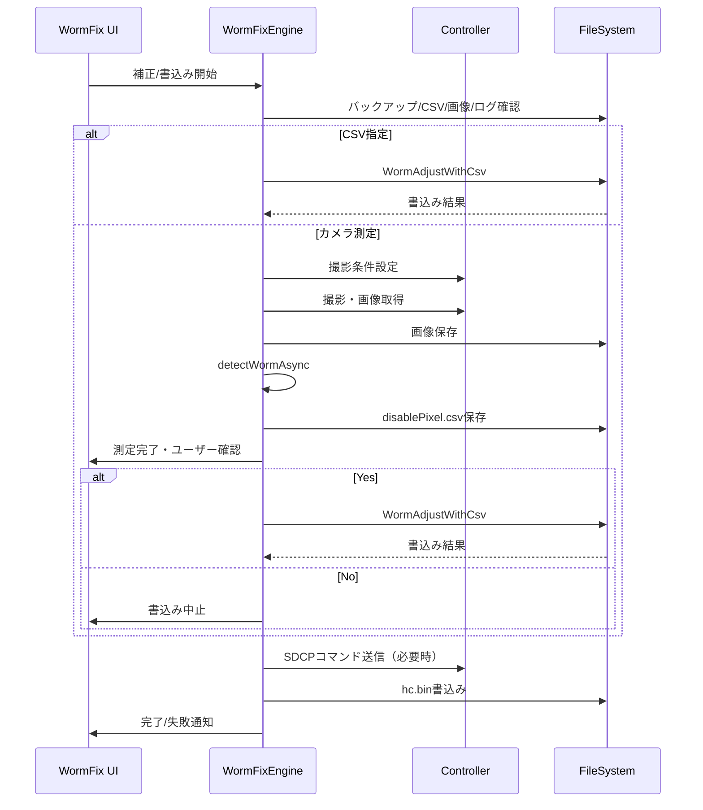
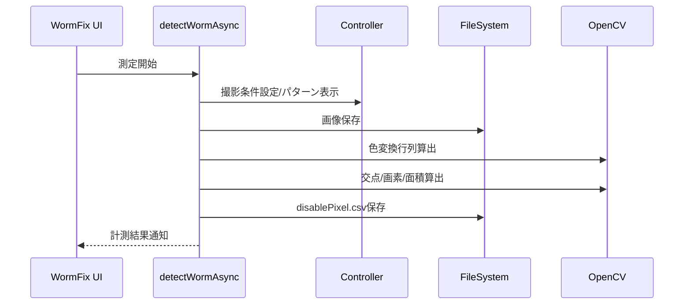
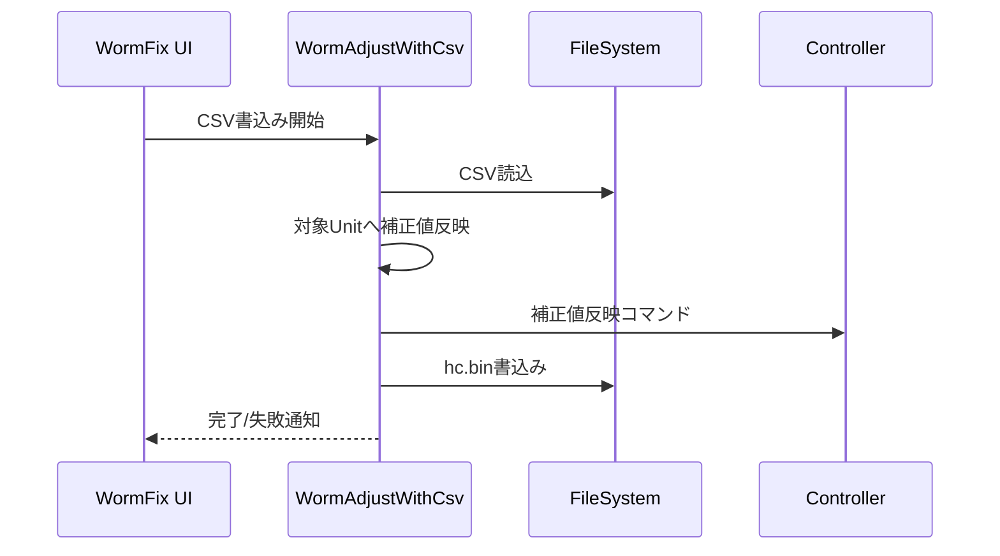

## 7. 関連システムインタフェース仕様

### 7-1. インタフェース一覧

| IF ID        | I/O   | インタフェースシステム名 | インタフェースファイル名/コマンド | インタフェースタイミング         | インタフェース方法 | インタフェースエラー処理方法      | インタフェース処理のリラン定義 | インタフェース処理のロギングインタフェース |
|--------------|-------|------------------------|----------------------------------|-------------------------------|--------------------|-------------------------------|-------------------------------|------------------------------------------|
| IF-WORM-001  | OUT   | AlphaCameraController  | CamCont.xml                      | 撮影設定/撮影時                | ファイル連携        | 例外捕捉・ShowMessageWindow   | オペレータ再実行              | SaveExecLog, saveLog                     |
| IF-WORM-002  | OUT   | Controller             | SDCPコマンド                     | 補正/書込み/表示時             | TCP送信             | 例外捕捉・ShowMessageWindow   | オペレータ再実行              | SaveExecLog, saveLog                     |
| IF-WORM-003  | IN/OUT| ファイルシステム        | CSV/画像/ログ/hc.bin             | 補正・測定・書込み・保存時      | ファイルI/O         | 例外捕捉・ShowMessageWindow   | パス修正後再実行              | SaveExecLog, saveLog                     |
| IF-WORM-004  | OUT   | ファイルシステム        | hc.bin                            | 書込み確定時                    | ファイルI/O         | 例外捕捉・ShowMessageWindow   | オペレータ再実行              | SaveExecLog, saveLog                     |
| IF-WORM-005  | OUT   | ファイルシステム        | 計測画像                          | 測定実行時                      | ファイルI/O         | 例外捕捉・ShowMessageWindow   | オペレータ再実行              | SaveExecLog, saveLog                     |
| IF-WORM-006  | OUT   | ファイルシステム        | ExecLog/Log                       | 処理開始〜終了                  | ファイルI/O         | 例外捕捉・ShowMessageWindow   | オペレータ再実行              | SaveExecLog, saveLog                     |

### 7-2. インタフェースデータ項目定義

| IF ID       | データ項目名           | データ項目の説明                | データ項目の位置 | 書式      | 必須 | エラー時の代替値 | 備考                       |
|-------------|-----------------------|---------------------------------|------------------|-----------|------|------------------|----------------------------|
| IF-WORM-001 | CamCont.xml           | AlphaCameraController連携設定    | XMLファイル      | UTF-8 XML | Y    | なし             | 保存先、AF条件等           |
| IF-WORM-002 | SDCPコマンド          | 内蔵パターン、ThroughMode制御等  | byte配列         | binary    | Y    | なし             | CmdUnitPowerOn等           |
| IF-WORM-003 | disablePixel.csv      | Worm検出結果CSV                | CSVファイル      | CSV       | Y    | なし             | 計測結果保存               |
| IF-WORM-004 | hc.bin                | 補正値バイナリ                  | バイナリファイル | binary    | Y    | なし             | 書込み/再実行時に利用      |
| IF-WORM-005 | 計測画像              | 撮影画像                        | 画像ファイル     | PNG/JPEG  | Y    | なし             | 測定時保存                 |
| IF-WORM-006 | ExecLog/Log           | 実行ログ                        | テキスト         | UTF-8     | N    | なし             | SaveExecLog, saveLog       |

### 7-3. インタフェース処理シーケンス

#### 7-3-1. Worm補正・書込み処理シーケンス

#### 7-3-2. Worm測定処理シーケンス

#### 7-3-3. CSV書込み処理シーケンス

