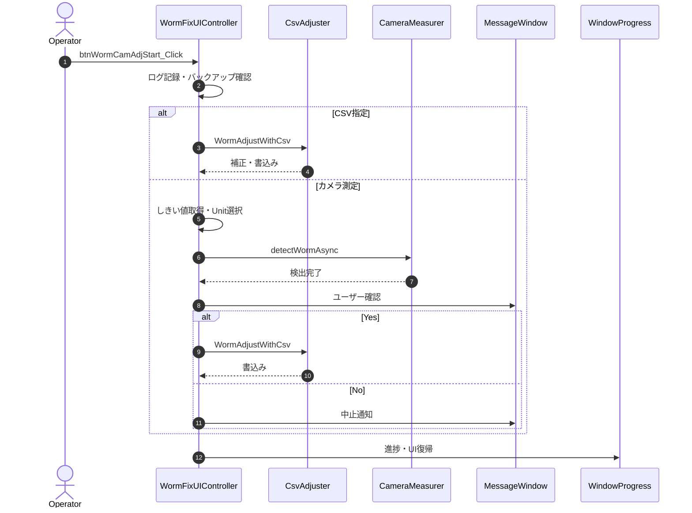

# 08-1. UIイベント・制御メソッド

---

## 8-1-1. btnWormCamAdjStart_Click

| 項目 | 内容 |
|------|------|
| シグネチャ | `private async void btnWormCamAdjStart_Click(object sender, RoutedEventArgs e)` |
| 概要 | WormFix補正開始ボタン押下時の処理（カメラ測定またはCSV指定でWorm位置判別・色補正） |
| 引数 | sender, e |
| 返り値 | なし（void） |

### 処理概要
1. ログ記録（開始・選択状態）
2. Cabinet/Unit全体のバックアップデータ存在確認（なければエラー表示・中断）
3. CSV指定時は WormAdjustWithCsv を実行
4. カメラ測定時は：
   - しきい値（R/G/B）取得・バリデーション
   - Unit選択・矩形性チェック
   - 測定用フォルダ作成
   - 必要に応じてカメラ位置セット
   - 進捗ウィンドウ表示
   - detectWormAsync を非同期実行
   - 測定後、ユーザーに hc.bin 書き込み確認ダイアログ表示
   - Yes選択時は WormAdjustWithCsv で書き込み、No選択時は中止
5. 完了・異常時は進捗/状態復帰・ログ記録

### 主要呼出し先
| 呼出し先 | 役割 | 同期/非同期 |
|----------|------|--------------|
| SaveExecLog | ログ記録 | 同期 |
| checkDataFile | バックアップデータ確認 | 同期 |
| ShowMessageWindow | 異常通知 | 同期 |
| WormAdjustWithCsv | CSV補正・書込み | 同期 |
| actionButton | UI制御 | 同期 |
| CheckSelectedUnits | Unit選択・検証 | 同期 |
| setUserSettingSetPos | ユーザー設定保存 | 同期 |
| SetThroughMode | カメラ位置セット | 同期 |
| detectWormAsync | Worm検出 | 非同期（Task.Run） |
| releaseButton | UI復帰 | 同期 |
| playSound | 効果音再生 | 同期 |
| showMessageWindow | ユーザー確認 | 同期 |

### 入力条件
| 区分 | 条件 | NG時挙動 |
|------|------|----------|
| バックアップ | Cabinet/Unit全体のデータ存在 | エラー通知・中断 |
| しきい値 | R/G/B値が整数 | エラー通知・中断 |
| ユニット選択 | 有効なユニットが選択・矩形 | エラー通知・中断 |

### 条件分岐
- CSV指定時は WormAdjustWithCsv 実行
- カメラ測定時は detectWormAsync 実行
- 測定後、ユーザー確認でYesなら書き込み、Noなら中止

### 例外時
| ケース | 捕捉方法 | 通知 | 後処理 |
|--------|----------|------|--------|
| バックアップ・しきい値・Unit選択・カメラ位置・測定異常 | Exception | CAS Error!ダイアログ | UI復帰・エラー表示 |

### シーケンス図

