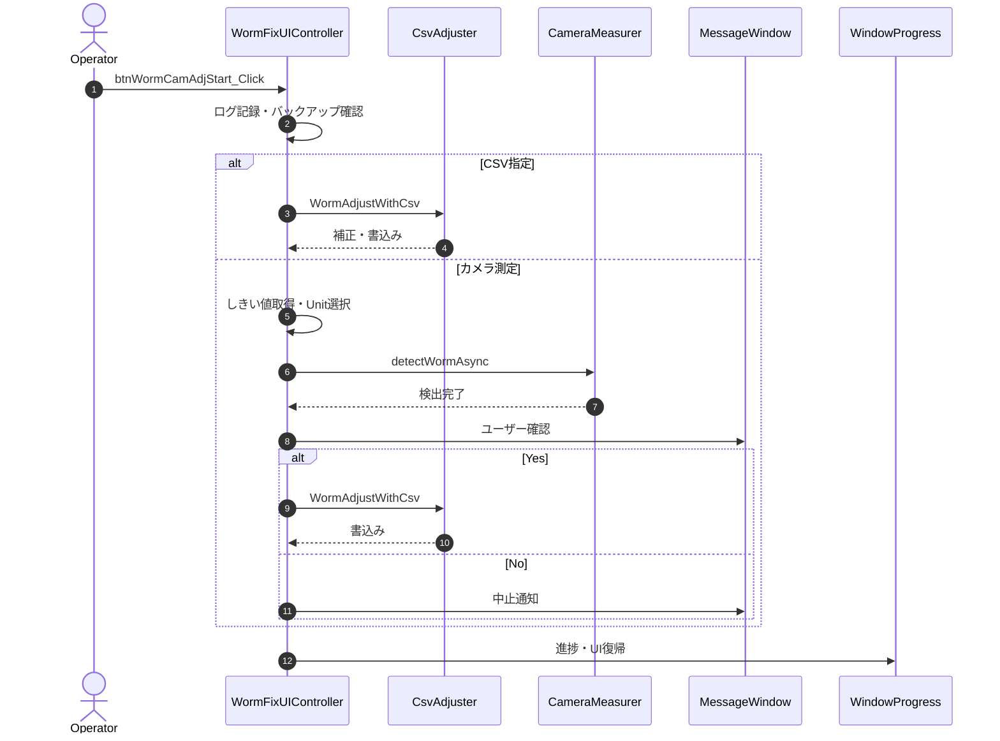

### 8-1. UIイベント・制御メソッド

---

#### 8-1-1. btnWormCamAdjStart_Click

| 項目 | 内容 |
|------|------|
| シグネチャ | `private async void btnWormCamAdjStart_Click(object sender, RoutedEventArgs e)` |
| 概要 | WormFix補正開始ボタン押下時の処理（カメラ測定またはCSV指定でWorm位置判別・色補正） |

引数

| No. | 引数名 | 型 | 必須 | 説明 |
|-----|--------|----|------|------|
| 1 | sender | object | Y | 送信元コントロール |
| 2 | e | RoutedEventArgs | Y | クリックイベント引数 |

返り値: なし（void）

処理概要（詳細）

| 手順No. | 処理内容 | 詳細 |
|---------|----------|------|
| 1 | ログ記録 | 開始ログと選択状態ログを出力する。 |
| 2 | 事前検証 | Cabinet/Unit 全体のバックアップデータ存在を確認し、不足時はエラー通知して中断する。 |
| 3 | CSV分岐 | CSV 指定時は `WormAdjustWithCsv` を実行して補正・書込みを行う。 |
| 4 | カメラ測定分岐 | しきい値検証、Unit選択矩形チェック、測定フォルダ作成、必要時カメラ位置セット、進捗表示を実施する。 |
| 5 | 非同期検出 | `detectWormAsync` を `Task.Run` で実行する。 |
| 6 | 書込み確認 | 検出後に `hc.bin` 書込み確認ダイアログを表示し、Yes時のみ `WormAdjustWithCsv` で反映する。 |
| 7 | 後処理 | 完了/異常に応じて進捗と UI を復帰し、終了ログを出力する。 |

主要呼出し先
| 呼出し先 | 役割 | 同期/非同期 |
|----------|------|--------------|
| SaveExecLog | ログ記録 | 同期 |
| checkDataFile | バックアップデータ確認 | 同期 |
| ShowMessageWindow | 異常通知 | 同期 |
| WormAdjustWithCsv | CSV補正・書込み | 同期 |
| actionButton | UI制御 | 同期 |
| CheckSelectedUnits | Unit選択・検証 | 同期 |
| setUserSettingSetPos | ユーザー設定保存 | 同期 |
| SetThroughMode | カメラ位置セット | 同期 |
| detectWormAsync | Worm検出 | 非同期（Task.Run） |
| releaseButton | UI復帰 | 同期 |
| playSound | 効果音再生 | 同期 |
| showMessageWindow | ユーザー確認 | 同期 |

入力条件・前提条件
| 区分 | 条件 | NG時挙動 |
|------|------|----------|
| バックアップ | Cabinet/Unit全体のデータ存在 | エラー通知・中断 |
| しきい値 | R/G/B値が整数 | エラー通知・中断 |
| ユニット選択 | 有効なユニットが選択・矩形 | エラー通知・中断 |

条件分岐仕様

| 条件 | 挙動 |
|------|------|
| CSV指定時 | `WormAdjustWithCsv` を実行する。 |
| カメラ測定時 | `detectWormAsync` を実行する。 |
| 書込み確認 = Yes | `WormAdjustWithCsv` により書込みを実行する。 |
| 書込み確認 = No | 書込みを中止して後処理へ進む。 |

例外時仕様
| ケース | 捕捉方法 | 通知/伝播 | 後処理 |
|--------|----------|-----------|--------|
| バックアップ不整合 | 事前検証の戻り値/Exception | エラーダイアログ通知 | 処理中断・UI復帰 |
| しきい値不正 | パース/範囲判定 | エラーダイアログ通知 | 処理中断・UI復帰 |
| Unit選択不正 | 選択/矩形判定 | エラーダイアログ通知 | 処理中断・UI復帰 |
| カメラ位置/測定異常 | 下位処理Exception | エラーダイアログ通知 | 進捗クローズ・UI復帰 |

シーケンス図

