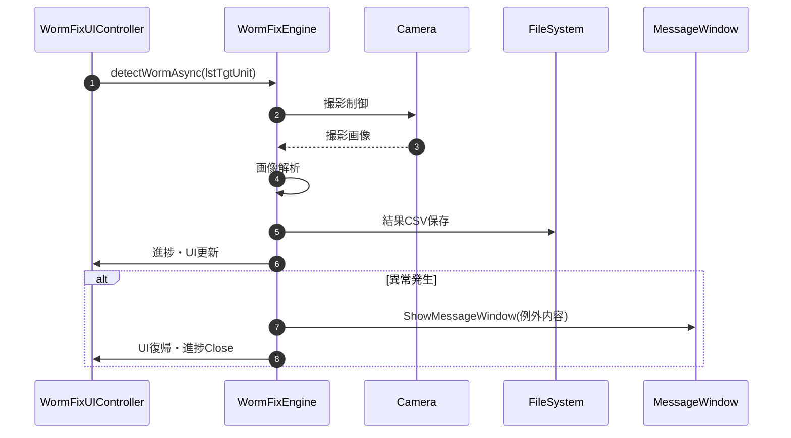
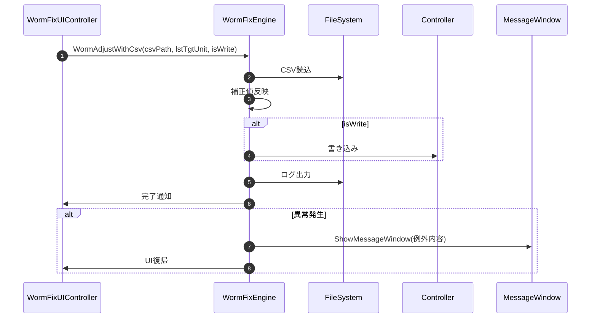

# 08-2. 業務処理メソッド

### 8-2. 業務処理メソッド

#### 8-2-1. detectWormAsync

| 項目 | 内容 |
|------|------|
| シグネチャ | `unsafe private void detectWormAsync(List<UnitInfo> lstTgtUnit)` |
| 概要 | WormFixカメラ測定の主処理（撮影・解析・結果保存）を実行する |

引数

| No. | 引数名 | 型 | 必須 | 説明 |
|-----|--------|----|------|------|
| 1 | lstTgtUnit | List<UnitInfo> | Y | 測定対象ユニット一覧 |

返り値: なし（void）

処理概要（詳細）

| 手順No. | 処理分類 | 処理内容 | 詳細 |
|---------|----------|----------|------|
| 1 | 共通 | 測定状態・進捗初期化（WindowProgress, saveLog等） | 必要な変数・進捗ウィンドウ(WindowProgress)を初期化。ログ出力開始。 |
| 2 | 共通 | 対象範囲算出・ログ出力 | `lstTgtUnit`からX/Y最小・最大を算出し、測定範囲をログ出力。 |
| 3 | 共通 | OpenCvSharp DLL存在確認（CheckOpenCvSharpDll） | 解析ライブラリの存在をCheckOpenCvSharpDllで検証。異常時はShowMessageWindowで通知・中断。 |
| 4 | 共通 | 測定条件決定 | しきい値（R/G/B）、カメラ設定、パス等を取得・設定。 |
| 5 | 撮影 | Flat画像の撮影（CaptureImage, SaveMatBinary, loadArwFile, checkFileSize等） | 撮影条件設定→パターン出力→待機→撮影→ARW保存→Mat変換→バイナリ保存。進捗・ログ・ファイル存在/サイズチェック・例外時リトライ含む。 |
| 6 | 撮影 | Black画像の撮影（CaptureImage, SaveMatBinary, loadArwFile, checkFileSize等） | 撮影条件設定→パターン出力→待機→撮影→ARW保存→Mat変換→バイナリ保存。進捗・ログ・ファイル存在/サイズチェック・例外時リトライ含む。 |
| 7 | 撮影 | Tile画像の撮影（CaptureImage, SaveMatBinary, loadArwFile, checkFileSize等） | タイル分ループでパターン出力→待機→撮影→ARW保存→Mat変換→バイナリ保存。進捗・ログ・ファイル存在/サイズチェック・例外時リトライ含む。 |
| 8 | 画像処理 | 画像解析前処理（CalcColorMatrix等） | Flat/Black画像をOpenCVで読み込み、色域変換・正規化。カラーマトリクス算出。 |
| 9 | 画像処理 | モジュールコーナー・ピクセル座標検出（DetectCrossPoint, DetectPixelPoint） | DetectCrossPoint/DetectPixelPointで各モジュールのコーナー・ピクセル座標を検出。進捗・ログ出力。 |
| 10 | 画像処理 | Wormエリア算出（CalcWormArea） | CalcWormAreaで各タイル・各色のWorm領域座標を算出。進捗・ログ出力。 |
| 11 | 画像処理 | 各タイル画像の解析（詳細） | 各タイル領域ごとに、Flat/Black補正後の画像を色域変換・正規化します。しきい値（R/G/B）を用いて二値化処理を行い、Worm検出に不要なノイズを除去します。ノイズ除去にはガウシアンフィルタ等を適用し、微小な誤検出を抑制します。二値化画像から輪郭抽出（OpenCVのfindContours等）を行い、面積が小さい領域（ノイズ）は除去します。残った領域がWorm候補となり、各タイルごとに抽出結果を記録します。 |
| 11 | 画像処理 | 各タイル画像の解析 | Flat/Black補正・色域変換・正規化・二値化・ノイズ除去・輪郭抽出・面積フィルタ・候補記録 |
| 12 | 画像処理 | Worm領域ごとの判定 | ROI抽出・面積比算出・しきい値判定・結果記録 |
| 12 | 画像処理 | Worm領域ごとの判定（詳細・コードレベル） | 各タイル領域ごとに、Worm候補領域（輪郭）をROIとして抽出し、必要に応じてタイル外の領域をマスクで除外します（`Cv2.BitwiseAnd`等）。各Worm領域の面積（`Cv2.ContourArea`）をタイル全体の面積で割り、面積比を算出します。$面積比 = \frac{Worm領域面積}{タイル面積}$面積比が設定しきい値（例：0.05など）を超える場合、その領域を「Worm有」と判定します。判定結果（有無・面積比・座標・輪郭情報）は`listDetectedWorm`に登録します。複数領域がある場合は全て記録または最大面積のみ記録など、仕様に応じて処理します。面積比が極端に小さい場合（ノイズ）、または極端に大きい場合（誤検出）は警告ログを出力。ROI抽出やマスク処理で例外が発生した場合は、エラーハンドリングし、進捗ウィンドウやログに記録します。判定結果は、disablePixel.csvや各種ログ画像（Worms_XX_YY.bmp等）の生成、UI表示に利用されます。 |
| 13 | 共通 | 結果ファイル出力 | listDetectedWormをdisablePixel.csvに出力。各種ログ画像（Target_XX_YY.bmp, Worms_XX_YY.bmp, result.bmp等）も保存。 |
| 14 | 共通 | 進捗・UI更新 | 進捗ウィンドウ・ログ・UI状態を更新。 |
| 15 | 共通 | カメラ・ユーザー設定復帰（setUserSetting等） | 測定前のカメラ位置取得・設定復帰。ユーザー設定をsetUserSettingで復元。 |
| 16 | 共通 | エラー処理（ShowMessageWindow等） | 各段階で例外発生時はShowMessageWindowで通知し、進捗ウィンドウClose・UI復帰。 |
| 11 | 結果ファイル出力 | listDetectedWormをdisablePixel.csvに出力。各種ログ画像（Target_XX_YY.bmp, Worms_XX_YY.bmp, result.bmp等）も保存。 |
| 12 | 進捗・UI更新 | 進捗ウィンドウ・ログ・UI状態を更新。 |
| 13 | カメラ・ユーザー設定復帰 | 測定前のカメラ位置取得・設定復帰。ユーザー設定をsetUserSettingで復元。 |
| 14 | エラー処理 | 各段階で例外発生時はShowMessageWindowで通知し、進捗ウィンドウClose・UI復帰。 |

【コード例（抜粋）】
```csharp
foreach (var contour in contours) {
    double area = Cv2.ContourArea(contour);
    double ratio = area / tileArea;
    if (ratio > threshold) {
        // Worm有
        listDetectedWorm.Add(...);
    }
}
```

##### 補足: 撮影処理と画像処理の分類
【撮影処理】
- Flat/Black/Tile画像: カメラ撮影→ARWファイル→Mat変換→バイナリ保存
- 撮影条件（F値・シャッター等）はSettingsやm_ShootConditionから取得し、ログにも記録
- 各撮影ごとにwinProgressで進捗表示・ステップ進行
- ファイル保存後は存在・サイズチェックを必ず実施し、異常時は例外throw
- 撮影失敗時は最大2回までリトライ（catch→Thread.Sleep→再実行）
- テスト用コード（ワーム画像生成・省略）は本番では無効

【画像処理】
- Flat/Black画像の色域変換・正規化・カラーマトリクス算出
- DetectCrossPoint/DetectPixelPointでコーナー・ピクセル座標検出
- CalcWormAreaでWorm領域座標算出
- 各tile画像を色域変換・正規化・flat/black補正・しきい値二値化・ノイズ除去・輪郭抽出
- 各Worm領域ごとにROI抽出・マスク適用・輪郭面積比判定
- 判定結果をlistDetectedWormへ登録
- 結果: disablePixel.csv, result.bmp, Worms_XX_YY.bmp, Target_XX_YY.bmp等を保存

##### 補足: 進捗・状態遷移
- 各主要処理ごとにwinProgress.ShowMessage/PutForward1Stepで進捗表示
- 例外発生時はShowMessageWindowで通知し、UI復帰・進捗ウィンドウClose

入力条件・前提条件

| 区分 | 条件 | NG時挙動 |
|------|------|----------|
| 対象一覧 | `lstTgtUnit` が有効で対象矩形が成立していること | 例外発生時はShowMessageWindowで通知・中断 |
| 実行環境 | OpenCvSharp DLL、カメラ、コントローラ通信が利用可能であること | 例外発生時はShowMessageWindowで通知・中断 |
| しきい値 | R/G/B値が整数で有効範囲 | 例外発生時はShowMessageWindowで通知・中断 |

主要状態更新

| 状態変数 | 更新内容 | 更新タイミング |
|----------|----------|----------------|
| `m_wormThreshold_R/G/B` | しきい値設定 | 測定条件決定時 |
| `m_CamMeasPath` | 測定画像保存パス | 撮影処理時 |
| `m_lstUserSetting` | 退避設定の一時保持/復帰後null化 | 設定退避時/復帰完了時 |

主要呼出し先

| 呼出し先 | 役割 | 同期/非同期 |
|----------|------|--------------|
| `CheckOpenCvSharpDll` | 解析ライブラリ事前検証 | 同期 |
| `captureWormImages` | 撮影処理 | 同期 |
| `analyzeWormImage` | 画像解析 | 同期 |
| `saveMeasuredData` | 測定結果保存 | 同期 |
| `ShowMessageWindow` | 異常通知 | 同期 |
| `WindowProgress` | 進捗表示 | 同期 |

##### 例外時仕様

| ケース | 捕捉方法 | 通知 | 後処理 |
|--------|----------|------|--------|
| ユニット選択不正 | Exception | ShowMessageWindow | UI復帰・進捗ウィンドウClose |
| しきい値異常 | Exception | ShowMessageWindow | UI復帰・進捗ウィンドウClose |
| 撮影/解析/保存異常 | Exception | ShowMessageWindow | UI復帰・進捗ウィンドウClose |
| ファイル/通信異常 | Exception | ShowMessageWindow | UI復帰・進捗ウィンドウClose |

##### シーケンス図


---

#### 8-2-2. WormAdjustWithCsv

| 項目 | 内容 |
|------|------|
| シグネチャ | `private void WormAdjustWithCsv(string csvPath, List<UnitInfo> lstTgtUnit, bool isWrite)` |
| 概要 | 指定CSVを用いてWorm補正値を反映・書き込みする業務処理 |

引数

| No. | 引数名 | 型 | 必須 | 説明 |
|-----|--------|----|------|------|
| 1 | csvPath | string | Y | 補正値CSVファイルパス |
| 2 | lstTgtUnit | List<UnitInfo> | Y | 対象ユニット一覧 |
| 3 | isWrite | bool | Y | 書き込み実行フラグ |

返り値: なし（void）

処理概要（詳細）

| 手順No. | 処理内容 | 詳細 |
|---------|----------|------|
| 1 | CSVファイル読込 | 指定パスから補正値CSVを読込む |
| 2 | 補正値反映 | CSV内容を各ユニットへ反映 |
| 3 | 書き込み実行 | isWrite=trueの場合はコントローラへ書き込み |
| 4 | 結果・ログ出力 | 実行結果・ログを保存・通知 |

入力条件・前提条件

| 区分 | 条件 | NG時挙動 |
|------|------|----------|
| CSVファイル | 指定パスにCSVが存在し、書式が正しい | 例外発生時はShowMessageWindowで通知・中断 |
| ユニット一覧 | 有効なユニットが選択されている | 例外発生時はShowMessageWindowで通知・中断 |

主要呼出し先

| 呼出し先 | 役割 | 同期/非同期 |
|----------|------|--------------|
| `readCorrectionCsv` | CSV読込 | 同期 |
| `applyCorrectionValue` | 補正値反映 | 同期 |
| `writeCorrectionToController` | 書き込み | 同期 |
| `saveLog` | ログ出力 | 同期 |
| `ShowMessageWindow` | 異常通知 | 同期 |

##### 例外時仕様

| ケース | 捕捉方法 | 通知 | 後処理 |
|--------|----------|------|--------|
| CSVファイル異常 | Exception | ShowMessageWindow | UI復帰 |
| 書式不正 | Exception | ShowMessageWindow | UI復帰 |
| 書き込み異常 | Exception | ShowMessageWindow | UI復帰 |

##### シーケンス図

