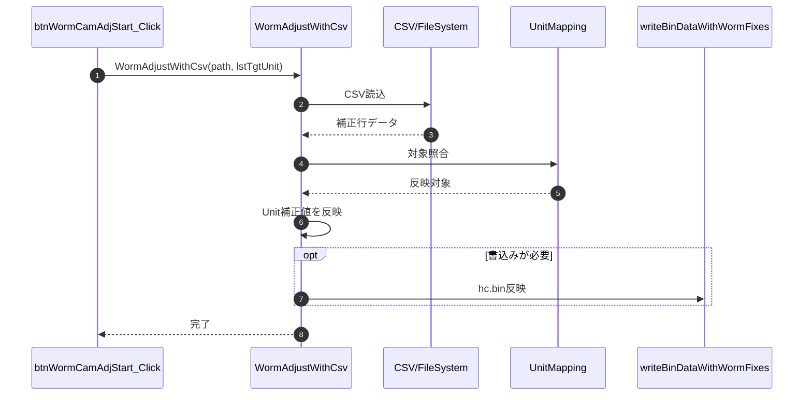
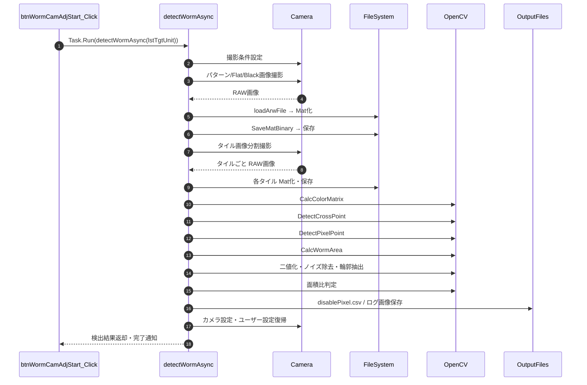

### 8-2. 業務処理メソッド

本章は WormFix 専用実装リポジトリを正本として記載している。

- 正本リポジトリ: `..\\ColorAlignmentSoftware_WormFix`
- 主要実装ファイル: `..\\ColorAlignmentSoftware_WormFix\\CAS\\Functions\\GapCamera.cs`

| メソッド | ソースコード参照（外部リポジトリ） | 概要 |
|------|------|------|
| `WormAdjustWithCsv` | `..\\ColorAlignmentSoftware_WormFix\\CAS\\Functions\\GapCamera.cs:2803` | CSV で与えた補正値に基づき Unit の Worm 補正量を反映する。 |
| `detectWormAsync` | `..\\ColorAlignmentSoftware_WormFix\\CAS\\Functions\\GapCamera.cs:15147` | 画像読込から交点検出・画素位置推定・面積算出までの Worm 検出パイプラインを実行する。 |

#### 8-2-1. WormAdjustWithCsv

| 項目 | 内容 |
|------|------|
| シグネチャ | `public void WormAdjustWithCsv(string path, List<UnitInfo> lstTgtUnit)` |
| 概要 | 指定 CSV から Unit 別補正情報を読み込み、補正対象 Unit に反映する。 |

引数

| No. | 引数名 | 型 | 必須 | 説明 |
|-----|--------|----|------|------|
| 1 | path | string | Y | 入力 CSV ファイルパス |
| 2 | lstTgtUnit | List<UnitInfo> | Y | 補正対象 Unit リスト |

返り値: なし（void）

処理概要（詳細）

| 手順No. | 処理内容 | 詳細 |
|---------|----------|------|
| 1 | 入力検証 | `path` と `lstTgtUnit` を確認し、読み込み不可時は例外または処理中断。 |
| 2 | CSV 読込 | CSV を走査し、対象 Unit を特定するキー情報（Cabinet/Unit 位置）と補正値を取得。 |
| 3 | 対象照合 | `lstTgtUnit` の Unit 情報と CSV 行を照合し、一致データを選別。 |
| 4 | 値反映 | 対象 Unit の Worm 補正関連パラメータへ CSV 値を格納。 |
| 5 | 結果確定 | 反映済みデータを保持し、呼出元以降の補正処理で使用可能にする。 |

入力条件・前提条件

| 区分 | 条件 | NG時挙動 |
|------|------|----------|
| CSVファイル | `path` が存在し、WormFix 用CSVフォーマットで読込可能であること | 例外通知して処理中断 |
| 対象一覧 | `lstTgtUnit` が空でなく、対象 Unit を一意に解決できること | 例外通知して処理中断 |
| 実行環境 | 補正値反映先（メモリ/書込み対象）が初期化済みであること | 呼出元へ失敗を返却 |

主要状態更新

| 状態変数 | 更新内容 | 更新タイミング |
|----------|----------|----------------|
| Worm補正対象リスト | CSV 行と対象 Unit の対応結果を保持 | 手順3 |
| Unit補正値 | CSV の補正値を各 Unit へ反映 | 手順4 |
| 実行ログ | 反映件数・失敗件数を記録 | 手順5 |

条件分岐仕様

| 条件 | 挙動 |
|------|------|
| CSV未指定/不存在 | エラー通知して終了する |
| 対象 Unit 未一致行あり | 不一致行をログ化し、処理継続可否を判定する |
| 全対象反映成功 | 正常終了し後続書込み処理へ進む |

主要呼出し先

| 呼出し先 | 役割 | 同期/非同期 |
|----------|------|--------------|
| CSV読込処理 | Worm補正CSVを解析して行データを取得する | 同期 |
| 対象照合処理 | CSV行と `lstTgtUnit` の Unit を照合する | 同期 |
| `writeBinDataWithWormFixes`（必要時） | 反映済み補正値を `hc.bin` へ書込む | 同期 |
| `SaveExecLog` / `saveLog` | 実行結果を記録する | 同期 |

例外時仕様

| ケース | 捕捉方法 | 通知/伝播 | 後処理 |
|--------|----------|-----------|--------|
| CSV読込失敗 | ファイルI/O例外 | 呼出元へ通知 | 反映処理を中断 |
| CSVフォーマット不正 | パース例外 | 呼出元へ通知 | 対象反映を中断 |
| 補正値反映失敗 | 下位処理例外 | 呼出元へ通知 | 安全停止 |

シーケンス図

#### 8-2-2. detectWormAsync

| 項目 | 内容 |
|------|------|
| シグネチャ | `unsafe private void detectWormAsync(List<UnitInfo> lstTgtUnit)` |
| 概要 | Worm 検出に必要な全撮影・画像処理パイプラインを実行し、交点・画素位置・面積情報を算出して検出結果を保存する。 |

引数

| No. | 引数名 | 型 | 必須 | 説明 |
|-----|--------|----|------|------|
| 1 | lstTgtUnit | List<UnitInfo> | Y | Worm 検出対象 Unit リスト |

返り値: なし（void）

処理概要（詳細）

| 手順No. | 処理分類 | 処理内容 | 詳細 |
|---------|----------|----------|------|
| 1 | 前処理 | 測定条件決定・初期化 | 対象 Cabinet/Unit 範囲を決定し、OpenCvSharp DLL 確認、信号レベル・カメラパラメータ、保存パスを取得。 |
| 2 | 撮影 | 白・赤・緑・青・ハッチ等パターン画像撮影 | 各パターンを順次出力・撮影し、RAW→Mat 変換・バイナリ保存。進捗・ログ・ファイル検証・例外リトライを含む。 |
| 3 | 撮影 | 黒・フラット基準画像撮影 | Flat/Black 標準画像を撮影・保存し、色域変換・正規化の基準データとして保持。同様に ARW→Mat→バイナリ保存、ファイル検証、ログ出力を実施。 |
| 4 | 撮影 | 分割タイル画像撮影 | タイル分割計画：対象 Cabinet/Unit 測定範囲から分割数（X 方向分割数 `divX`、Y 方向分割数 `divY`）を決定、各タイルの物理座標を計算。ワーム検出用撮影ループ**：`for (y=0; y<divY; y++) { for (x=0; x<divX; x++) { ... } }` で各タイルについて以下を実行：黒画像撮影→タイルドット画像撮影→ |
| 5 | 画像処理 | 色変換行列算出 | `CalcColorMatrix` を実行し、Flat/Black 画像から RGB→LED 変換係数を作成。 |
| 6 | 画像処理 | 交点検出 | `DetectCrossPoint` で基準格子の交点候補を抽出し、各モジュールコーナーを確定。 |
| 7 | 画像処理 | 画素点推定 | `DetectPixelPoint` で交点結果をもとに補正対象画素位置を推定。 |
| 8 | 画像処理 | Worm 領域面積算出 | `CalcWormArea` で各タイル領域の Worm 座標を算出。 |
| 9 | 画像処理 | 二値化・ノイズ除去・輪郭抽出 | 各タイル画像を色域変換・正規化・シェーディング補正し、しきい値二値化・ガウシアン除去・輪郭抽出・小領域除去を実行。 |
| 10 | 画像処理 | Worm 面積比判定 | タイルごとに `CalcWormArea` で得た4頂点から ROI を切り出し、ROI 内有効画素数を母数として面積比を算出。二値化後マスク画像の白画素数を Worm 画素数として集計し、`面積比 = Worm画素数 / ROI有効画素数` を計算。面積比を判定しきい値（R/G/B 条件または設定値）と比較して、超過領域を Worm と確定する。確定結果は Cabinet/Unit/Tile 座標・面積比・判定フラグを含む `WormInfo` としてリスト登録する。 |
| 11 | 出力 | 検出結果ファイル出力 | `disablePixel.csv`、ログ画像（`result.bmp` 等）を保存。 |
| 12 | 後処理 | カメラ・設定復帰・ログ確定 | 撮影前のカメラ位置・ユーザー設定を復帰、最終ログ出力・進捗クローズ。 |

入力条件・前提条件

| 区分 | 条件 | NG時挙動 |
|------|------|----------|
| 対象一覧 | `lstTgtUnit` が有効で、対象矩形が成立していること | 例外通知して中断 |
| 実行環境 | OpenCvSharp DLL、カメラ、Controller 通信、画像保存先が利用可能であること | 例外通知して中断 |
| 撮影条件 | しきい値（R/G/B）、カメラ制御設定、保存パスが事前に取得・設定済みであること | 例外通知して中断 |

主要状態更新

| 状態変数 | 更新内容 | 更新タイミング |
|----------|----------|----------------|
| 測定パス | 撮影画像の保存先フォルダを初期化 | 手順1 |
| 撮影済み画像 | Flat/Black/パターン/タイル画像の Mat データを順次保持 | 手順2～4 |
| 解析用行列 | 色変換・補正式行列を保持 | 手順5 |
| 交点情報 | モジュール交点とマスクを保持 | 手順6 |
| 画素座標情報 | 補正対象画素位置を保持 | 手順7 |
| Worm面積情報 | タイル別面積算出結果を保持 | 手順8 |
| 検出結果一覧 | Worm判定結果（WormInfo リスト）を更新 | 手順10 |
| ログ・ファイル | disablePixel.csv、ログ画像を保存確定 | 手順11 |

条件分岐仕様

| 条件 | 挙動 |
|------|------|
| 撮影失敗 | リトライ可能なら再試行、失敗回数超過で異常終了 |
| 撮影成功・画像処理へ進行 | 色変換・交点・画素・面積の各処理を順次実行 |
| 色変換行列算出失敗 | 異常として処理終了 |
| 交点検出失敗 | 異常として処理終了 |
| 画素点推定失敗 | 異常として処理終了 |
| 面積算出失敗 | 異常として処理終了 |
| 全処理成功 | 検出結果を保存し、正常終了して呼出元へ通知 |

主要呼出し先

| 呼出し先 | 役割 | 同期/非同期 |
|----------|------|--------------|
| `CaptureImage` | カメラシャッタ実行と画像取得 | 同期 |
| `loadArwFile` | RAW 画像ファイルを Mat へ変換 | 同期 |
| `SaveMatBinary` | 処理用 Mat をバイナリ保存 | 同期 |
| `checkFileSize` | 撮影結果ファイルの妥当性検証 | 同期 |
| `CalcColorMatrix` | 色変換行列を算出 | 同期 |
| `DetectCrossPoint` | 基準交点を検出 | 同期 |
| `DetectPixelPoint` | 画素位置を推定 | 同期 |
| `CalcWormArea` | Worm 領域面積を算出 | 同期 |
| `WindowProgress` / `ShowMessage` | 進捗表示・通知 | 同期 |
| `SaveExecLog` / `saveLog` | 実行ログ記録 | 同期 |
| `ShowMessageWindow` | 異常通知ダイアログ | 同期 |

例外時仕様

| ケース | 捕捉方法 | 通知/伝播 | 後処理 |
|--------|----------|-----------|--------|
| 入力値不正 | 引数検証で検出 | 呼出元へ通知 | 異常終了 |
| 撮影失敗 | 下位例外・ファイル検証失敗 | 呼出元へ通知、リトライ可能なら再試行 | 異常終了 |
| 画像読込失敗 | loadArwFile 戻り値・例外 | 呼出元へ通知 | 異常終了 |
| 画像処理失敗 | DetectCrossPoint 等の戻り値・例外 | 呼出元へ通知 | 中断 |
| 下位処理失敗 | 下位例外または戻り値異常 | 呼出元へ通知 | 安全停止・設定復帰 |

シーケンス図

