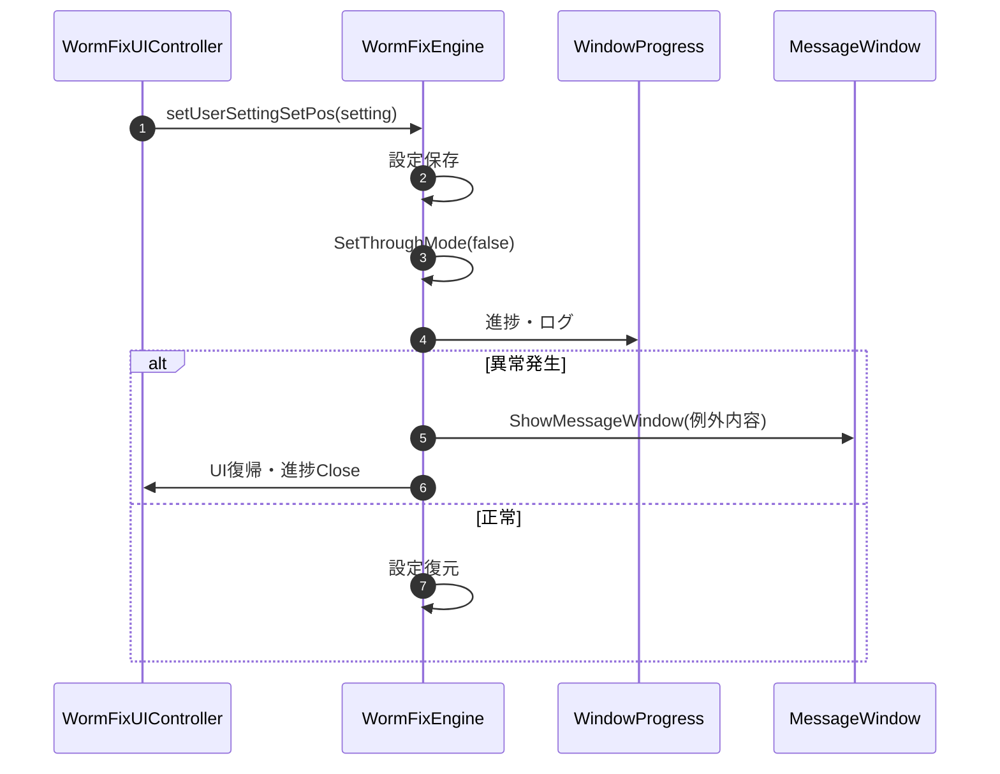
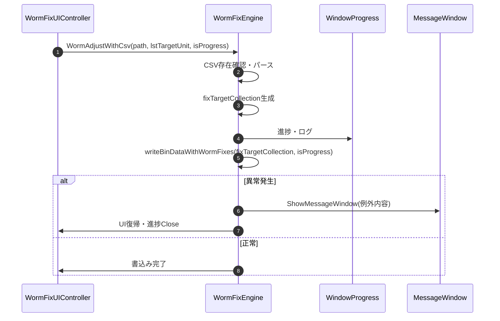

### 8-3. 設定・データ書込みメソッド

---

#### 8-3-1. setUserSettingSetPos

| 項目 | 内容 |
|------|------|
| シグネチャ | `private void setUserSettingSetPos(UserSetting setting)` |
| 概要 | 測定・補正前後のユーザー設定を保存・復元し、カメラ位置セットも行う |

引数
| No. | 引数名 | 型 | 必須 | 説明 |
|-----|--------|----|------|------|
| 1 | setting | UserSetting | Y | 保存・復元するユーザー設定 |

返り値: なし（void）

処理概要（詳細）
| 手順No. | 処理内容 | 詳細 |
|---------|----------|------|
| 1 | 設定保存 | 測定前に現状の設定を退避（setUserSettingSetPos）|
| 2 | ThroughMode設定 | 測定前にSetThroughMode(false)でカメラ位置セット |
| 3 | 設定復元 | 測定後に退避設定を復元（setUserSetting）|
| 4 | ログ・進捗 | saveLog/DoEvents/WindowProgressで進捗・ログ管理 |

入力条件・前提条件
| 区分 | 条件 | NG時挙動 |
|------|------|----------|
| 設定値 | `setting` が保存・復元可能なユーザー設定であること | 例外通知して処理中断 |
| 実行前提 | ThroughMode 切替と進捗更新に必要な UI/内部状態が初期化済みであること | UI復帰後に処理中断 |

条件分岐仕様
| 条件 | 挙動 |
|------|------|
| 設定保存成功 | ThroughMode 設定と後続処理へ進む |
| 設定保存/復元失敗 | 例外時仕様に従って通知し、UI復帰して終了する |

主要呼出し先
| 呼出し先 | 役割 | 同期/非同期 |
|----------|------|--------------|
| setUserSettingSetPos | 設定保存 | 同期 |
| SetThroughMode | ThroughMode設定 | 同期 |
| setUserSetting | 設定復元 | 同期 |
| saveLog | ログ出力 | 同期 |
| DoEvents | UI更新 | 同期 |
| WindowProgress | 進捗表示 | 同期 |
| ShowMessageWindow | 異常通知 | 同期 |

例外時仕様
| ケース | 捕捉方法 | 通知 | 後処理 |
|--------|----------|------|--------|
| 設定保存・復元異常 | Exception | ShowMessageWindow | UI復帰・進捗ウィンドウClose |

シーケンス図

---

#### 8-3-2. WormAdjustWithCsv

| 項目 | 内容 |
|------|------|
| シグネチャ | `public void WormAdjustWithCsv(string path, List<UnitInfo> lstTargetUnit, bool isProgress)` |
| 概要 | 指定CSVファイルの内容に基づき、Worm補正値をコントローラへ適用する |

引数
| No. | 引数名 | 型 | 必須 | 説明 |
|-----|--------|----|------|------|
| 1 | path | string | Y | 補正値CSVファイルパス |
| 2 | lstTargetUnit | List<UnitInfo> | Y | 書込み対象ユニット一覧 |
| 3 | isProgress | bool | Y | 進捗表示有無 |

返り値: なし（void）

処理概要（詳細）
| 手順No. | 処理内容 | 詳細 |
|---------|----------|------|
| 1 | CSVファイル存在確認 | 指定パスのCSV存在チェック、なければエラー通知 |
| 2 | CSV読込・パース | 1行目ヘッダスキップ、各行をパースしWormInfo生成 |
| 3 | 対象ユニット抽出 | lstTargetUnitとCSV内容を突合し、fixTargetCollection生成 |
| 4 | ログ出力 | ExecLog有効時は詳細ログ出力 |
| 5 | コントローラ書込み | writeBinDataWithWormFixes(fixTargetCollection, isProgress)呼出し |
| 6 | 例外時通知 | 例外発生時はShowMessageWindowで通知 |

入力条件・前提条件
| 区分 | 条件 | NG時挙動 |
|------|------|----------|
| CSVパス | `path` が存在し、WormFix 専用 CSV 形式で読込可能であること | エラー通知して処理中断 |
| 対象ユニット | `lstTargetUnit` が書込み対象として解決可能であること | エラー通知して処理中断 |
| 実行前提 | Controller 書込みに必要な通信状態とログ出力先が利用可能であること | 処理中断 |

条件分岐仕様
| 条件 | 挙動 |
|------|------|
| `isProgress=true` | 進捗更新を伴って書込み処理を実行する |
| `isProgress=false` | 進捗表示を抑止して書込み処理を実行する |
| CSV読込/パース失敗 | 例外時仕様に従って通知し終了する |

主要呼出し先
| 呼出し先 | 役割 | 同期/非同期 |
|----------|------|--------------|
| writeBinDataWithWormFixes | コントローラへの補正値書込み | 同期 |
| ShowMessageWindow | 異常通知 | 同期 |
| SaveExecLog | ログ出力 | 同期 |

例外時仕様
| ケース | 捕捉方法 | 通知 | 後処理 |
|--------|----------|------|--------|
| CSV読込・パース異常 | Exception | ShowMessageWindow | 進捗ウィンドウClose |
| コントローラ書込み異常 | Exception | ShowMessageWindow | 進捗ウィンドウClose |

シーケンス図

