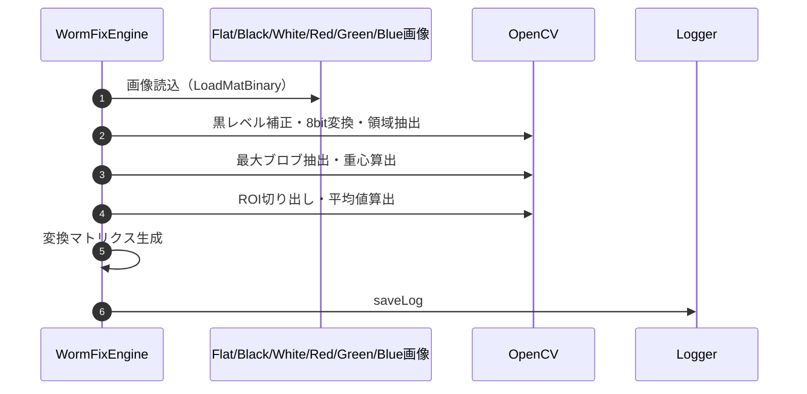
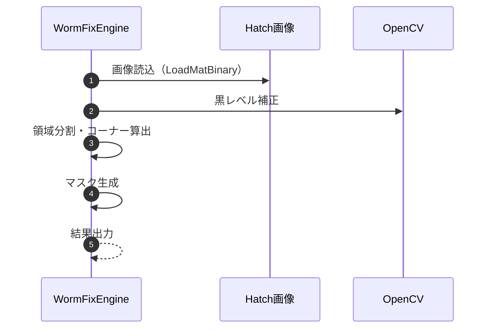
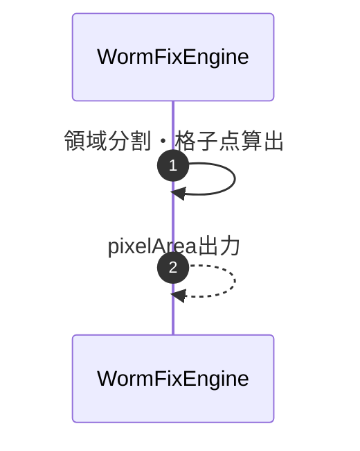
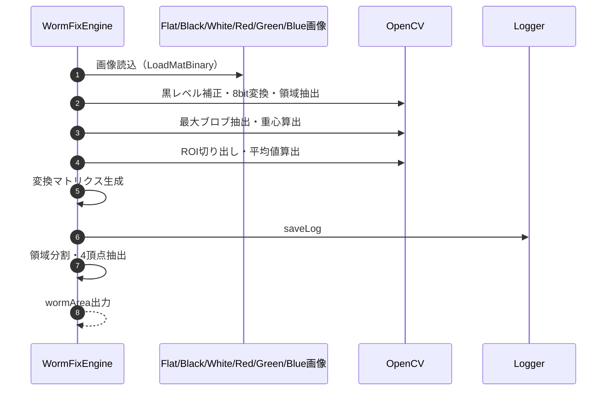

### 8-4. 補助計算・補正演算メソッド

本章は WormFix 専用実装リポジトリを正本として記載している。

- 正本リポジトリ: `..\\ColorAlignmentSoftware_WormFix`

| メソッド | ソースコード参照（外部リポジトリ） |
|------|------|
| `CalcColorMatrix` | `..\\ColorAlignmentSoftware_WormFix\\CAS\\Functions\\GapCamera.cs:18334` |
| `DetectCrossPoint` | `..\\ColorAlignmentSoftware_WormFix\\CAS\\Functions\\GapCamera.cs:16650` |
| `DetectPixelPoint` | `..\\ColorAlignmentSoftware_WormFix\\CAS\\Functions\\GapCamera.cs:17548` |
| `CalcWormArea` | `..\\ColorAlignmentSoftware_WormFix\\CAS\\Functions\\GapCamera.cs:17874` |
| `detectWormAsync`（関連） | `..\\ColorAlignmentSoftware_WormFix\\CAS\\Functions\\GapCamera.cs:15147` |
| `WormAdjustWithCsv`（関連） | `..\\ColorAlignmentSoftware_WormFix\\CAS\\Functions\\GapCamera.cs:2803` |

---

#### 8-4-1. CalcColorMatrix

| 項目 | 内容 |
|------|------|
| シグネチャ | `unsafe bool CalcColorMatrix()` |
| 概要 | Flat/Black/White/Red/Green/Blue画像からカメラRGB→LED RGB変換マトリクスを算出する |

引数: なし

返り値: 成功時true／失敗時例外

処理概要（詳細）

| 手順No. | 処理内容 | 詳細 |
|---------|----------|------|
| 1 | 画像読込 | Flat/Black/White/Red/Green/Blue画像をバイナリからMat型で読込 |
| 2 | 黒レベル補正 | 各画像からBlack画像を減算 |
| 3 | 8bit変換 | White画像を8bit化し二値化（Otsu法）で領域抽出 |
| 4 | 最大ブロブ抽出 | 最大領域の重心座標(cx,cy)を算出 |
| 5 | ROI切り出し | White/Red/Green/Blue画像を中心200x200で切り出し |
| 6 | 平均値算出 | 各ROIのRGB平均値を算出 |
| 7 | 変換マトリクス生成 | **7-1. カメラRGB値行列構築**：手順6で取得した4色（White/Red/Green/Blue）のRGB平均値から3x3行列 `matCamera` を構築（各行が各色のRGB値）。**7-2. LED理想RGB値行列構築**：各LED色の理想発光値（例：Red=(255,0,0), Green=(0,255,0), Blue=(0,0,255)）から3x3行列 `matLed` を構築。**7-3. 逆行列計算**：`matCamera.Inv()` でカメラRGB値行列の逆行列を計算。**7-4. 変換行列算出**：`m_matColorConvert = matLed * matCamera.Inv()` で「カメラRGB → LED RGB」への変換行列（3x3）を算出。**7-5. 検証・保持**：算出した変換行列の値が妥当か（逆行列が存在するか等）確認し、`m_matColorConvert` に保持。 |
| 8 | ログ出力 | 変換マトリクス内容をログ出力 |

主要呼出し先

| 呼出し先 | 役割 | 同期/非同期 |
|----------|------|--------------|
| LoadMatBinary | 画像読込 | 同期 |
| Cv2.FindContours, Cv2.Mean | 領域抽出・平均 | 同期 |
| saveLog | ログ出力 | 同期 |

シーケンス図


#### 変換マトリクス生成の詳細

1. **目的**  
カメラで取得したRGB値を、LEDの発光RGB値に正確に変換するための3x3行列（変換マトリクス）を算出します。  
このマトリクスは、カメラとLEDの色空間の違いを補正し、測定値をLED制御値へ正確にマッピングする役割を持ちます。

2. **算出手順（主な流れ）**
- Flat/Black/White/Red/Green/Blue画像から、各色のROI（中心200x200領域）のRGB平均値を取得します。
- 取得したカメラRGB値（観測値）と、理想的なLED RGB値（基準値）を対応付けます。
- これらの対応点から、最小二乗法などで「カメラRGB→LED RGB」への変換行列（3x3）を計算します。
- 計算結果はOpenCvSharpの`Mat`型（`m_matColorConvert`）として保持され、以降の画像処理や補正演算で利用されます。

3. **実装例（抜粋・イメージ）**
```csharp
// カメラで観測した各色のRGB平均値
float[,] cameraRGB = new float[3, 3] { { Rc, Gc, Bc }, { ... }, ... };
// LEDの理想的な発光値
float[,] ledRGB = new float[3, 3] { { Rl, Gl, Bl }, { ... }, ... };

// 変換マトリクスを計算（OpenCVの関数や独自計算）
Mat matCamera = new Mat(3, 3, MatType.CV_32F, cameraRGB);
Mat matLed = new Mat(3, 3, MatType.CV_32F, ledRGB);
m_matColorConvert = matLed * matCamera.Inv(); // カメラ→LED変換
```
- 実際には、各色のサンプル数や外れ値除去など、より厳密な処理が入る場合もあります。

4. **利用箇所**
- 算出した`m_matColorConvert`は、以降の画像補正やLED制御値算出時に、カメラRGB値をLED RGB値へ変換するために使用されます。

このように、変換マトリクス生成は「カメラRGB→LED RGB」の色空間変換の要となる重要な処理です。

---

#### 8-4-2. DetectCrossPoint

| 項目 | 内容 |
|------|------|
| シグネチャ | `unsafe bool DetectCrossPoint(int moduleCountX, int moduleCountY, out OpenCvSharp.Size imageSize, out Point2f[][,][] moduleCorner, out Mat[] matMask)` |
| 概要 | Hatch画像から各モジュールのコーナー座標・マスク画像を検出する |

引数

| No. | 引数名 | 型 | 必須 | 説明 |
|-----|--------|----|------|------|
| 1 | moduleCountX | int | Y | モジュール横方向個数 |
| 2 | moduleCountY | int | Y | モジュール縦方向個数 |
| 3 | imageSize(out) | OpenCvSharp.Size | Y | 画像サイズ出力 |
| 4 | moduleCorner(out) | Point2f[][,][] | Y | 各モジュール4頂点座標出力 |
| 5 | matMask(out) | Mat[] | Y | 各モジュールマスク画像出力 |

返り値: 成功時true／失敗時例外

処理概要（詳細）

| 手順No. | 処理内容 | 詳細 |
|---------|----------|------|
| 1 | 画像読込 | Hatch画像をバイナリからMat型で読込 |
| 2 | 黒レベル補正 | Hatch画像からBlack画像を減算 |
| 3 | 領域分割 | 各モジュール領域ごとにコーナー座標(Point2f[4])を算出 |
| 4 | マスク生成 | モジュールごとにマスク画像を生成 |
| 5 | 結果出力 | コーナー座標・マスクをout引数で返却 |

主要呼出し先

| 呼出し先 | 役割 | 同期/非同期 |
|----------|------|--------------|
| LoadMatBinary | 画像読込 | 同期 |

シーケンス図


#### 領域分割の詳細

1. **目的**  
撮影画像（Hatch画像）から、各モジュール領域ごとにコーナー座標（Point2f[4]：左上・右上・左下・右下）を正確に検出し、後続の格子分割や補正演算の基準となる「領域枠」を決定します。

2. **主な処理手順**
- Hatch画像から黒レベル補正を行い、差分画像を生成
- 差分画像を2値化し、モジュール領域（タイル）を抽出
- モルフォロジー処理（クロージング）でノイズ除去・領域補正
- ブロブ解析（CvBlobs）で各タイル領域を検出
- 各タイル領域の外接矩形や重心から、4隅のコーナー座標を算出
- 検出したコーナー座標を`moduleCorner`配列に格納

3. **実装イメージ（抜粋）**
```csharp
// 差分画像の2値化
Cv2.Threshold(matTileMask, matBin, 0, 255, ThresholdTypes.Otsu);
// クロージングでノイズ除去
Mat kernel = Cv2.GetStructuringElement(MorphShapes.Rect, new Size(5, 5));
Cv2.MorphologyEx(matBin, matClose, MorphTypes.Close, kernel);
// ブロブ解析で領域抽出
CvBlobs blobs = new CvBlobs(matClose);
// 各領域の外接矩形や重心からコーナー座標を計算
foreach (var blob in blobs)
{
    // blob.BoundingBoxやblob.Centroidなどを利用してコーナーを算出
    // moduleCorner[x, y][0..3] = {左上, 右上, 左下, 右下}
}
```
- 実際には、領域の面積や形状の異常値除去、格子状の配置推定、外れ値補正なども行われます。

4. **ポイント**
- 領域分割の精度が後続の格子点算出や補正演算の精度に直結するため、ノイズ除去や外れ値補正が重要です。
- コーナー座標は、以降のピクセル格子分割やWorm領域算出の基準点として利用されます。

このように、領域分割は「画像→モジュール単位の枠取り→コーナー座標抽出」という一連の流れで実装されています。

---

#### 8-4-3. DetectPixelPoint

| 項目 | 内容 |
|------|------|
| シグネチャ | `bool DetectPixelPoint(int moduleCountX, int moduleCountY, Point2f[][,][] moduleCorner, OpenCvSharp.Size imageSize, out OpenCvSharp.Point2f[][,][,][] pixelArea)` |
| 概要 | 各モジュールコーナーから内部ピクセル格子座標を算出する |

引数

| No. | 引数名 | 型 | 必須 | 説明 |
|-----|--------|----|------|------|
| 1 | moduleCountX | int | Y | モジュール横方向個数 |
| 2 | moduleCountY | int | Y | モジュール縦方向個数 |
| 3 | moduleCorner | Point2f[][,][] | Y | 各モジュール4頂点座標 |
| 4 | imageSize | OpenCvSharp.Size | Y | 入力画像サイズ |
| 5 | pixelArea(out) | OpenCvSharp.Point2f[][,][,][] | Y | 格子点座標出力 |

返り値: 成功時true／失敗時例外

処理概要（詳細）

| 手順No. | 処理内容 | 詳細 |
|---------|----------|------|
| 1 | モジュール処理初期化 | 各モジュールごとに処理ループを開始。DetectCrossPointで取得した4隅コーナー座標（左上、右上、左下、右下）を変数に確保。格子分割数（divX, divY）と補間計算用のカウンタを初期化。 |
| 2a | Y方向補間ループ開始 | `for (int y = 0; y <= divY; y++)` でY方向（縦）の格子点を生成するループを開始。ループカウンタ `y` は 0 から divY までの整数値。 |
| 2b | Y方向での線形補間 | 正規化係数 `ty = (float)y / divY` を計算。左エッジ：コーナー[0]と[3]を `ty` で補間して左端の点を算出。右エッジ：コーナー[1]と[2]を `ty` で補間して右端の点を算出。 |
| 2c | X方向補間ループ開始 | `for (int x = 0; x <= divX; x++)` でX方向（横）の格子点を生成するループを開始。ループカウンタ `x` は 0 から divX までの整数値。 |
| 2d | X方向での線形補間 | 正規化係数 `tx = (float)x / divX` を計算。2bで求めた左端と右端の点を `tx` で補間し、内部の各格子点座標を算出。 |
| 2e | 格子点をpixelArea格納 | 算出した格子点座標 `(px, py)` を `pixelArea[moduleX, moduleY, x, y]` へ格納。全ての格子分割ポイント（(divX+1)×(divY+1)個）をループで順次処理・格納。 |
| 3 | 結果出力 | 全モジュール・全格子点の座標が格納された `pixelArea` 配列を out 引数で呼出元へ返却。 |

シーケンス図


#### 領域分割・格子点算出の詳細

1. **目的**  
各モジュール領域（コーナー座標）をもとに、内部を格子状に細分化し、各格子点の座標（pixelArea）を高精度に算出します。これにより、各タイルやピクセル単位での補正・演算が可能となります。

2. **主な処理手順**
- 領域分割：  
DetectCrossPointで得られた各モジュールの4隅コーナー座標（Point2f[4]）を基準に、各モジュール領域を格子状に分割するための基準枠とします。
- 格子点算出：  
各モジュールごとに、コーナー座標を使って格子分割数（例：16x16など）に応じて内部を補間計算します。4隅の座標から、縦横それぞれ等間隔で補間し、各格子点の座標をpixelArea配列に格納します。

3. **実装イメージ（抜粋）**
```csharp
// 4隅コーナーから格子点を補間
for (int y = 0; y < divY; y++)
{
    float ty = (float)y / (divY - 1);
    Point2f left = Interpolate(corner[0], corner[3], ty);
    Point2f right = Interpolate(corner[1], corner[2], ty);
    for (int x = 0; x < divX; x++)
    {
        float tx = (float)x / (divX - 1);
        pixelArea[moduleX, moduleY][x, y] = Interpolate(left, right, tx);
    }
}
```
- Interpolateは2点間の線形補間関数です。
- 実際には、コーナー座標の微調整や外れ値補正も行われます。

4. **ポイント**
- 格子点の精度が、後続のタイル分割や補正演算の精度に直結します。
- コーナー座標の外れ値やノイズの影響を受けやすいため、補間前にコーナーの再計算や補正も実施されます。

このように、8-4-3では「コーナー座標→格子点補間→pixelArea格納」という流れで、画像上の各ピクセル領域を高精度に分割・算出しています。

---

#### 8-4-4. CalcWormArea

| 項目 | 内容 |
|------|------|
| シグネチャ | `bool CalcWormArea(int moduleCountX, int moduleCountY, int moduleDivNumX, int moduleDivNumY, OpenCvSharp.Point2f[][,][,][] pixelArea, OpenCvSharp.Size logImageSize, out Point2f[][,][,][] wormArea)` |
| 概要 | ピクセル格子座標からWorm領域（各タイルの4頂点座標）を算出する |

引数

| No. | 引数名 | 型 | 必須 | 説明 |
|-----|--------|----|------|------|
| 1 | moduleCountX | int | Y | モジュール横方向個数 |
| 2 | moduleCountY | int | Y | モジュール縦方向個数 |
| 3 | moduleDivNumX | int | Y | モジュール内横分割数 |
| 4 | moduleDivNumY | int | Y | モジュール内縦分割数 |
| 5 | pixelArea | OpenCvSharp.Point2f[][,][,][] | Y | 格子点座標入力 |
| 6 | logImageSize | OpenCvSharp.Size | Y | ログ画像サイズ |
| 7 | wormArea(out) | Point2f[][,][,][] | Y | Worm領域4頂点座標出力 |

返り値: 成功時true／失敗時例外

処理概要（詳細）

| 手順No. | 処理内容 | 詳細 |
|---------|----------|------|
| 1 | 領域分割 | 各モジュール・各タイルごとに格子点インデックスを計算 |
| 2 | 4頂点算出 | 各タイルの4頂点座標(Point2f[4])をpixelAreaから抽出しwormAreaに格納 |
| 3 | 結果出力 | wormAreaをout引数で返却 |

シーケンス図


#### 領域分割・4頂点算出の詳細

1. **目的**  
DetectPixelPointで得られた格子点（pixelArea）をもとに、各タイル（小領域）の4頂点座標（Point2f[4]）を抽出し、各タイルごとの領域（wormArea）を定義します。これにより、各タイル単位での補正・演算が可能となります。

2. **主な処理手順**
- 領域分割：  
各モジュール領域を、指定された分割数（moduleDivNumX, moduleDivNumY）で格子状に分割します。
- 4頂点算出：  
各タイル（格子の1セル）について、pixelAreaから4隅の座標（左上・右上・左下・右下）を抽出し、wormArea[moduleX, moduleY, tileX, tileY][0..3]に格納します。

3. **実装イメージ（抜粋）**
```csharp
for (int moduleX = 0; moduleX < moduleCountX; moduleX++)
{
    for (int moduleY = 0; moduleY < moduleCountY; moduleY++)
    {
        for (int tileX = 0; tileX < moduleDivNumX; tileX++)
        {
            for (int tileY = 0; tileY < moduleDivNumY; tileY++)
            {
                // 4頂点をpixelAreaから抽出
                wormArea[moduleX, moduleY, tileX, tileY][0] = pixelArea[moduleX, moduleY][tileX, tileY];
                wormArea[moduleX, moduleY, tileX, tileY][1] = pixelArea[moduleX, moduleY][tileX + 1, tileY];
                wormArea[moduleX, moduleY, tileX, tileY][2] = pixelArea[moduleX, moduleY][tileX + 1, tileY + 1];
                wormArea[moduleX, moduleY, tileX, tileY][3] = pixelArea[moduleX, moduleY][tileX, tileY + 1];
            }
        }
    }
}
```
- 各タイルの4頂点は、格子点配列からインデックスをずらして取得します。
- 各タイルの4頂点は、格子点配列からインデックスをずらして取得します。具体的には、タイル(tileX, tileY)に対して以下の4頂点インデックスを指定します：
    - [0] 左上：pixelArea[tileX, tileY]
    - [1] 右上：pixelArea[tileX + 1, tileY]
    - [2] 右下：pixelArea[tileX + 1, tileY + 1]
    - [3] 左下：pixelArea[tileX, tileY + 1]
- **+1を使う理由**：インデックスに+1を加えることで、隣接するタイル同士が辺を共有します。例えば、タイル(tileX, tileY)の右辺（tileX+1）は、隣接するタイル(tileX+1, tileY)の左辺と同じ格子線となり、エリアの重複や隙間を防ぎながら、タイル同士を隙間なく配置できます。
- 実際には、端部や外れ値補正などの追加処理も行われます。

4. **ポイント**
- wormAreaの4頂点情報は、各タイル単位での補正・演算・描画など、後続処理の基礎データとなります。
- 領域分割数や格子点の精度が、タイル領域の正確さに直結します。

このように、8-4-4では「格子点→タイル分割→4頂点抽出→wormArea格納」という流れで、画像上の各タイル領域を高精度に定義しています。
