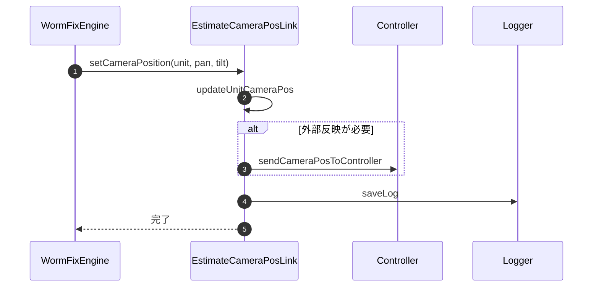

### 8-6. EstimateCameraPos連携メンバ

---

#### 8-6-1. setCameraPosition

| 項目 | 内容 |
|------|------|
| シグネチャ | `private void setCameraPosition(UnitInfo unit, double pan, double tilt)` |
| 概要 | カメラのパン・チルト角度を設定する連携メソッド |

引数
| No. | 引数名 | 型 | 必須 | 説明 |
|-----|--------|----|------|------|
| 1 | unit | UnitInfo | Y | 対象ユニット |
| 2 | pan | double | Y | パン角度 |
| 3 | tilt | double | Y | チルト角度 |

返り値: なし（void）

処理概要（詳細）
| 手順No. | 処理内容 | 詳細 |
|---------|----------|------|
| 1 | パラメータ設定 | ユニットにパン・チルト値を設定 |
| 2 | コントローラ連携 | 必要に応じてコントローラへ反映 |
| 3 | 結果通知 | 設定結果をログ・UIへ通知 |

入力条件・前提条件
| 区分 | 条件 | NG時挙動 |
|------|------|----------|
| 対象ユニット | `unit` がカメラ姿勢設定対象として有効であること | 例外通知して処理中断 |
| 角度値 | `pan` / `tilt` が実機反映可能な角度範囲であること | 例外通知または補正失敗 |

条件分岐仕様
| 条件 | 挙動 |
|------|------|
| コントローラ反映が必要 | 姿勢設定後にコントローラへ反映する |
| ローカル設定のみで完結 | 内部状態更新と通知のみ行う |

主要呼出し先
| 呼出し先 | 役割 | 同期/非同期 |
|----------|------|--------------|
| updateUnitCameraPos | パラメータ設定 | 同期 |
| sendCameraPosToController | コントローラ連携 | 同期 |
| saveLog | ログ出力 | 同期 |
| ShowMessageWindow | 異常通知 | 同期 |

例外時仕様
| ケース | 捕捉方法 | 通知 | 後処理 |
|--------|----------|------|--------|
| 姿勢値設定失敗 | Exception | ShowMessageWindow | 状態更新を中止して呼出元へ復帰 |
| コントローラ反映失敗 | Exception | ShowMessageWindow | ローカル状態のみ保持し、外部反映を中断 |

シーケンス図

