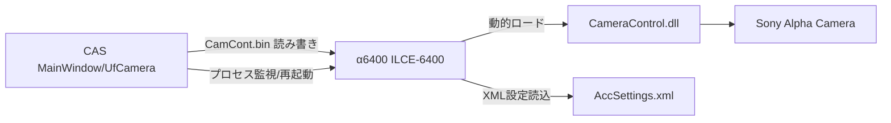
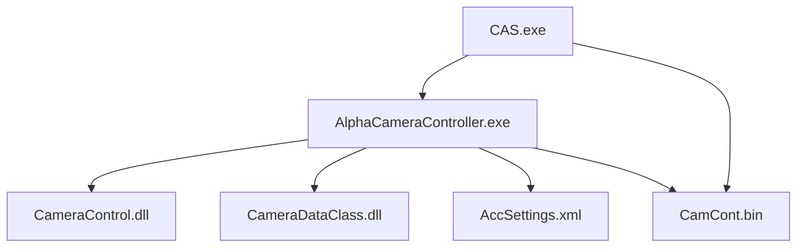
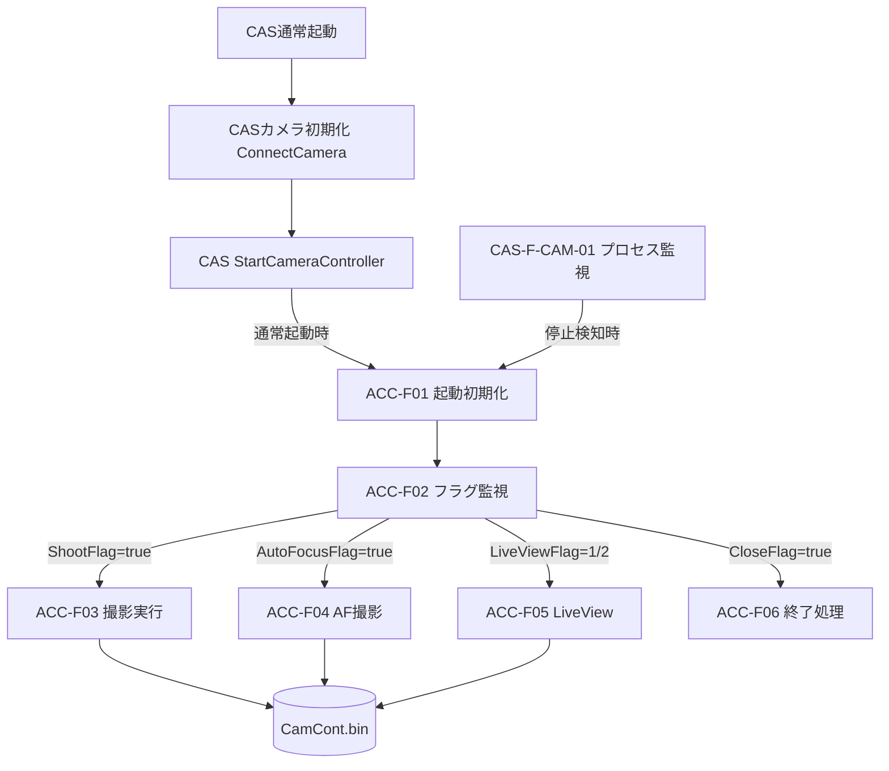
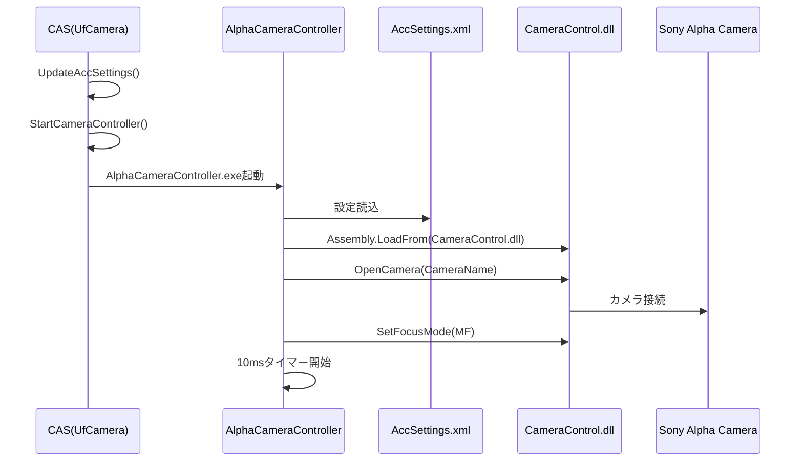
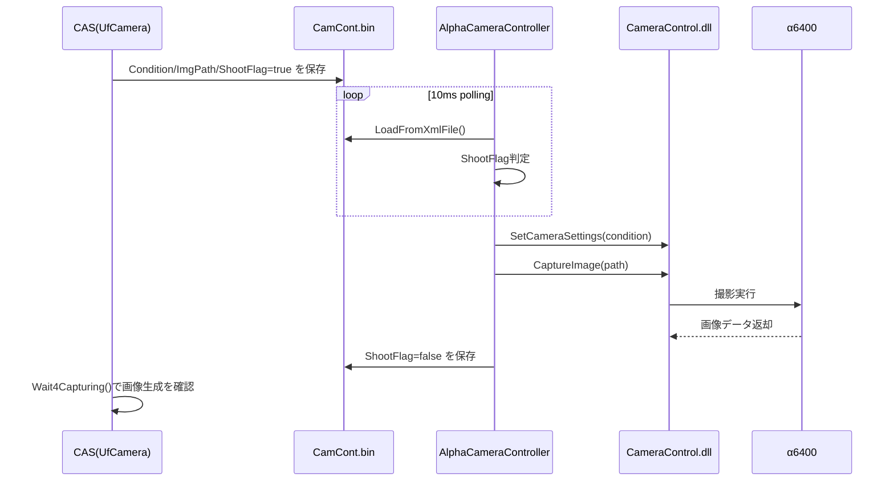
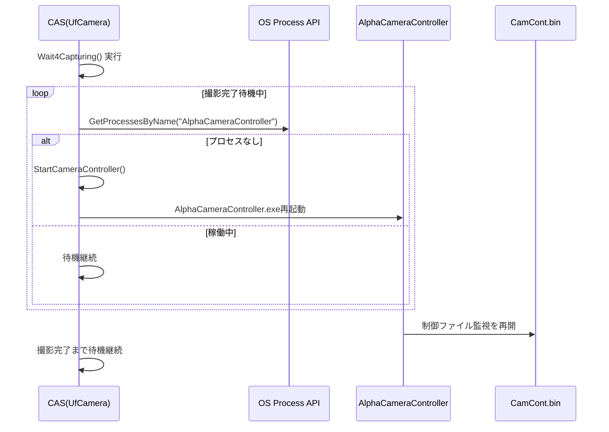
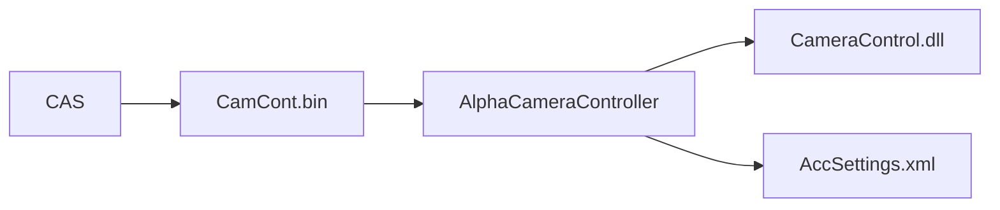
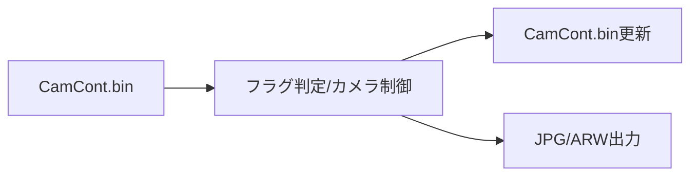

# 基本設計書

| 項目 | 内容 |
|------|------|
| プロジェクト名 | ColorAlignmentSoftware |
| システム名 | AlphaCameraController |
| 作成日 | 2026年4月14日 |
| 作成者 | システム分析チーム |
| バージョン | 1.0 |
| 関連文書 | 要件定義書：docs/AlphaCameraController_要件定義書.md |

---

## 1. システム概要書

### 1-1. システム全体像

#### システム概要

AlphaCameraControllerは、CAS本体からの撮影指示を制御ファイル経由で受け取り、α64000 ILCE-6400 に対して撮影・オートフォーカス・ライブビュー実行を行うバックグラウンドアプリケーションである。

本アプリはタスクトレイ常駐型であり、起動後は10ms周期ポーリングで制御ファイルを監視する。CAS側はプロセス状態を監視し、AlphaCameraController停止時に再起動する。

#### システム構成図

#### 構成要素一覧

| No. | 構成要素 | 種別 | 役割 | 備考 |
|-----|----------|------|------|------|
| 1 | AlphaCameraController.exe | WPFアプリ | カメラ制御実行、制御ファイル監視 | タスクトレイ常駐 |
| 2 | NotifyIconWrapper | コンポーネント | タスクトレイUI、タイマー処理、フラグ処理 | Exitメニュー提供 |
| 3 | CameraControl.dll | 外部DLL | カメラ接続、設定、撮影、AF、LiveView | 実体制御レイヤ |
| 4 | CameraDataClass.dll | 共通ライブラリ | CameraControlDataのシリアライズ/デシリアライズ | XMLファイル形式 |
| 5 | AccSettings.xml | 設定ファイル | カメラ名、制御ファイルパス等の保持 | 起動時読込 |
| 6 | CamCont.bin | 制御ファイル | CAS⇔AlphaCameraControllerの制御データ共有 | XML形式データ |

#### ソリューション方針

| 項目 | 内容 |
|------|------|
| アーキテクチャ | .NET Framework 4.5.1 + WPF + タスクトレイ常駐 |
| 連携方式 | ファイルベース連携（CamCont.binをXMLとして読み書き） |
| 制御方式 | ポーリング方式（10ms）で各フラグを監視 |
| 障害復旧 | CAS側でプロセス監視し、停止時に再起動 |
| 拡張方針 | 撮影機能拡張はCameraControlDataの項目追加で対応 |

---

### 1-2. アプリケーションマップ

#### アプリケーションマップ

#### アプリケーション一覧

| No. | アプリケーション名 | 区分 | 主な役割 | 利用者・利用部門 | 備考 |
|-----|--------------------|------|----------|------------------|------|
| 1 | CAS | 業務アプリ | 計測処理、撮影要求生成、再起動監視 | 製造・評価担当 | 親アプリ |
| 2 | AlphaCameraController | 制御アプリ | カメラ制御実行、撮影処理 | CAS内部利用 | 常駐実行 |
| 3 | CameraControl | ライブラリ | カメラAPIの抽象化 | システム内部 | DLL動的ロード |

#### アプリケーション間関係

| 連携元 | 連携先 | 連携概要 | 主なデータ | 連携方式 |
|--------|--------|----------|------------|----------|
| CAS | AlphaCameraController | 撮影制御指示 | ShootFlag, ImgPath, Condition, AutoFocusFlag, LiveViewFlag, CloseFlag | ファイルI/O |
| AlphaCameraController | CAS | 処理完了通知（フラグ更新） | ShootFlag=false, AutoFocusFlag=false, LiveViewFlag=0 | ファイルI/O |
| CAS | AlphaCameraController | 停止検知時に起動 | プロセス名判定 | OSプロセスAPI |

---

### 1-3. アプリケーション機能一覧

| アプリケーション名 | 機能ID | 機能名 | 機能概要 | 利用者 | 優先度 | 備考 |
|--------------------|--------|--------|----------|--------|--------|------|
| AlphaCameraController | ACC-F01 | 起動初期化 | 設定読込、DLLロード、カメラ接続、MF設定 | CAS | 高 | 起動失敗時はエラー表示 |
| AlphaCameraController | ACC-F02 | フラグ監視 | 制御ファイルを10ms周期で監視 | CAS | 高 | タイマー処理 |
| AlphaCameraController | ACC-F03 | 撮影実行 | ShootFlagを契機に設定適用と撮影実行 | CAS | 高 | 実行後フラグクリア |
| AlphaCameraController | ACC-F04 | オートフォーカス撮影 | AutoFocusFlagを契機にAF→撮影 | CAS | 高 | AFエリア設定を反映 |
| AlphaCameraController | ACC-F05 | ライブビュー撮影 | LiveViewFlag=1/2で単発/連続LiveView | CAS | 中 | 条件差分時のみ再設定 |
| AlphaCameraController | ACC-F06 | 終了処理 | CloseFlagまたはExit操作で終了 | CAS/保守者 | 高 | カメラクローズ実行 |
| CAS | CAS-F-CAM-01 | 子プロセス監視・再起動 | AlphaCameraController停止時の再起動 | CAS | 高 | 待機中ループで実行 |

---

## 2. アプリケーション詳細

### 2-1. 機能関連図

#### 対象アプリケーション

AlphaCameraController（関連：CASのカメラ制御呼び出し部）

#### 機能関連図

#### 補足説明

| 項目 | 内容 |
|------|------|
| 機能間連携の要点 | CAS通常起動時にACCを起動し、運用中はCASが制御ファイルを書込み、ACCがフラグ処理後に同一ファイルを更新する |
| 前提条件 | CameraControl.dllとAccSettings.xmlが配置済みであること |
| 制約事項 | 排他制御はファイルリトライに依存し、厳密ロック制御は行わない。停止時はCAS監視経由で再起動する |

#### シーケンス図

##### 起動シーケンス（CAS起動時）

##### 撮影シーケンス（ShootFlag）

##### 異常復旧シーケンス（ACC停止時再起動）

---

### 2-2. 各機能仕様

#### 2-2-1. 機能名：起動初期化

##### 2-2-1-1. 機能概要

| 項目 | 内容 |
|------|------|
| 機能ID | ACC-F01 |
| 機能名 | 起動初期化 |
| 機能概要 | 起動時に設定を読込み、カメラ制御DLLをロードしてカメラ接続を確立する |
| 利用者 | CAS（自動起動） |
| 起動契機 | EXE起動（CASからの起動を含む） |
| 入力 | AccSettings.xml |
| 出力 | カメラ接続済み状態、タイマー起動 |
| 関連機能 | ACC-F02, CAS-F-CAM-01 |
| 前提条件 | CameraControl.dllが存在し、対象カメラが接続されている |
| 事後条件 | 監視タイマーが動作し制御受付可能 |
| 備考 | 例外時はメッセージ表示して終了 |

##### 2-2-1-2. 画面仕様

###### 画面一覧

| 画面ID | 画面名 | 目的 | 利用者 | 備考 |
|--------|--------|------|--------|------|
| ACC-S01 | タスクトレイメニュー | 常駐状態の終了操作 | 保守者 | Exitのみ |

###### 画面遷移

常駐アプリのため画面遷移なし（対象外）

###### 画面共通ルール

| 項目 | 内容 |
|------|------|
| 共通レイアウト | メイン画面なし。タスクトレイアイコンのみ表示 |
| 操作ルール | 右クリックメニューのExitで終了 |
| 権限制御 | OS実行ユーザー権限に準拠 |
| エラー表示方針 | MessageBoxでエラー表示後に終了 |

###### 画面レイアウト

対象外（タスクトレイコンテキストメニューのみ）

###### 画面入出力項目一覧

| 項目ID | 項目名 | 区分（入力/表示） | 型 | 桁数 | 必須 | 初期値 | バリデーション | 備考 |
|--------|--------|-------------------|----|------|------|--------|----------------|------|
| ACC-S01-01 | Exit | 入力 | MenuItem | - | はい | - | なし | 終了処理実行 |

###### 画面アクション詳細

| アクション名 | 契機 | 処理内容 | 正常時 | 異常時 |
|--------------|------|----------|--------|--------|
| Exit選択 | メニュークリック | cc.CloseCamera実行後にアプリ終了 | プロセス終了 | 例外はMessageBox表示 |

##### 2-2-1-3. 帳票仕様

対象外（帳票なし）

##### 2-2-1-4. EUCファイル（Downloadable File）仕様

対象外（ダウンロードファイルなし）

##### 2-2-1-5. 関連システムインタフェース仕様

###### インタフェース一覧

| IF ID | 連携先システム | 方向 | 連携方式 | 概要 | 頻度 | 備考 |
|-------|----------------|------|----------|------|------|------|
| IF-ACC-01 | CAS | 受信 | ファイルI/O | 制御指示を取得 | 10ms毎 | CamCont.bin |
| IF-ACC-02 | CameraControl.dll | 双方向 | DLL呼出 | カメラ接続・撮影実行 | 要求時 | 動的ロード |
| IF-ACC-03 | AccSettings.xml | 受信 | XML読込 | 起動設定取得 | 起動時 | 設定不備はエラー |

###### 関連システム関連図

###### インタフェース項目仕様

| 項目名 | 説明 | 型 | 桁数 | 必須 | 変換ルール | 備考 |
|--------|------|----|------|------|------------|------|
| Condition.ImageSize | 画像サイズ設定 | int | - | 任意 | そのまま使用 | 既定値1 |
| Condition.FNumber | F値 | string | 可変 | 任意 | そのまま使用 | 例 F22 |
| Condition.Shutter | シャッター速度 | string | 可変 | 任意 | そのまま使用 | 例 0.5 |
| Condition.ISO | ISO値 | string | 可変 | 任意 | そのまま使用 | 例 200 |
| Condition.WB | ホワイトバランス | string | 可変 | 任意 | そのまま使用 | 例 6500K |
| Condition.CompressionType | 圧縮種別 | uint | - | 任意 | そのまま使用 | 16=RAW, 3=JPG |
| ImgPath | 保存先パス | string | 可変 | 条件付き必須 | そのまま使用 | ShootFlag時必須 |
| ShootFlag | 撮影指示 | bool | 1 | 必須 | 実行後falseへ更新 | |
| AutoFocusFlag | AF指示 | bool | 1 | 必須 | 実行後falseへ更新 | |
| LiveViewFlag | LiveView指示 | int | - | 必須 | 0/1/2を解釈 | 0:Off 1:Single 2:Continuous |
| CloseFlag | 終了指示 | bool | 1 | 必須 | true検知で終了 | |

###### 処理内容

| 項目 | 内容 |
|------|------|
| 起動契機 | タイマーTick（10ms周期） |
| 処理タイミング | 制御ファイル存在時に読み込み |
| リトライ方針 | CameraControlData.Load/Save内部で最大10回リトライ |
| 異常時対応 | MessageBox表示後アプリ終了（ACC側）、CAS側で再起動 |

##### 2-2-1-6. 入出力処理仕様

###### 処理概要

| 項目 | 内容 |
|------|------|
| 処理名 | 制御フラグポーリング処理 |
| 処理種別 | オンライン |
| 処理概要 | 制御ファイルを周期監視して指示種別ごとにカメラ処理を実行 |
| 実行契機 | DispatcherTimer.Tick |
| 実行タイミング | 10ms間隔 |

###### 入出力項目一覧

| 区分 | 項目名 | 説明 | 型 | 桁数 | 必須 | 備考 |
|------|--------|------|----|------|------|------|
| 入力 | CamCont.bin | 制御データ | XML | - | 条件付き | ファイル存在時 |
| 出力 | CamCont.bin | フラグ更新結果 | XML | - | 条件付き | 実行後に更新 |
| 出力 | 画像ファイル | 撮影成果物 | JPG/ARW | - | 条件付き | ImgPath配下 |

###### データ処理内容

1. CamCont.binを読み込み、CloseFlag/ShootFlag/AutoFocusFlag/LiveViewFlagを判定する。
2. 該当フラグの処理（設定反映、撮影、AF、LiveView）をCameraControl.dllに委譲する。
3. 完了したフラグを更新し、CamCont.binへ保存する。

###### IPO図

---

### 2-3. データベース仕様

#### データ概要

| データ名 | 概要 | 保持期間 | 更新主体 | 備考 |
|----------|------|----------|----------|------|
| CamCont.bin | 制御命令・撮影条件共有データ | 実行中/運用中 | CAS/ACC | XMLシリアライズ |
| AccSettings.xml | アプリ設定データ | 恒久 | CAS（更新）/ACC（参照） | カメラ名・パス |

#### ERD

対象外（RDB未使用）

#### テーブル仕様

対象外（RDB未使用）

#### カラム仕様

対象外（RDB未使用）

#### CRUD一覧

| 機能ID | 機能名 | テーブル名 | Create | Read | Update | Delete |
|--------|--------|------------|--------|------|--------|--------|
| ACC-F02 | フラグ監視 | CamCont.bin | ○ | ○ | ○ | × |
| ACC-F01 | 起動初期化 | AccSettings.xml | × | ○ | × | × |

---

### 2-4. メッセージ・コード仕様

#### メッセージ一覧

| メッセージID | 区分 | メッセージ内容 | 表示条件 | 対応方針 | 備考 |
|--------------|------|----------------|----------|----------|------|
| MSG-ACC-001 | エラー | Alpha Camera Controller Error! | 起動時/処理時の例外発生 | MessageBox表示後終了 | ex.Messageを本文表示 |
| MSG-ACC-002 | エラー | （可変）例外メッセージ文字列 | 起動時/処理時の例外発生 | MessageBox表示後終了 | タイトルは「Alpha Camera Controller Error!」 |

#### コード一覧

| コード種別 | コード値 | コード名称 | 説明 | 備考 |
|------------|----------|------------|------|------|
| LiveViewFlag | 0 | Off | ライブビュー停止 | |
| LiveViewFlag | 1 | Single | 単発ライブビュー取得 | 処理後0へ戻す |
| LiveViewFlag | 2 | Continuous | 連続ライブビュー | 明示停止まで継続 |
| CompressionType | 16 | RAW | ARW保存 | |
| CompressionType | 3 | JPEG | JPG保存 | |

---

### 2-5. 機能/データ配置仕様

#### 配置方針

| 項目 | 内容 |
|------|------|
| 機能配置方針 | カメラ制御機能はAlphaCameraControllerへ集約し、CASは指示発行と監視に専念 |
| データ配置方針 | 指示データはCamCont.bin、設定はAccSettings.xmlに分離 |
| 配置上の制約 | AlphaCameraController.exeおよび関連DLLはCAS\Components配下に配置 |

#### 機能配置一覧

| 機能ID | 機能名 | 配置先 | 理由 | 備考 |
|--------|--------|--------|------|------|
| ACC-F01 | 起動初期化 | AlphaCameraController.exe | カメラ依存処理の局所化 | |
| ACC-F02 | フラグ監視 | AlphaCameraController.exe | 低遅延なポーリング制御 | 10ms固定 |
| ACC-F03 | 撮影実行 | AlphaCameraController.exe | カメラ実行責務を分離 | |
| ACC-F04 | AF撮影 | AlphaCameraController.exe | AF制御を一元化 | |
| ACC-F05 | LiveView | AlphaCameraController.exe | 連続撮影の責務分離 | |
| CAS-F-CAM-01 | 子プロセス監視・再起動 | CAS.exe | 親プロセスによる復旧制御 | |

#### データ配置一覧

| データ名 | 配置先 | 保存形式 | バックアップ方針 | 備考 |
|----------|--------|----------|------------------|------|
| CamCont.bin | 一時フォルダ（AccSettingsで指定） | XML | 原則バックアップ対象外 | 共有制御データ |
| AccSettings.xml | CAS\Components | XML | 設定変更時に運用バックアップ | 構成設定 |
| 撮影画像 | 指定ImgPath | JPG/ARW | 運用要件に従う | CAS側が利用 |

---

## 3. 付録

### 3-1. 用語集

| 用語 | 説明 |
|------|------|
| CAS | Color Alignment Software本体。撮影指示発行と監視を担当 |
| ACC | AlphaCameraController。カメラ制御アプリ |
| CamCont.bin | CASとACC間の制御共有ファイル（XML形式） |
| ShootCondition | 撮影条件（F値、シャッター、ISO等）を保持するデータ構造 |
| LiveViewFlag | ライブビュー実行モードを示すフラグ（0/1/2） |
| 自己復旧 | CASがACC停止を検知し再起動する仕組み |

---

### 3-2. 改版履歴

| バージョン | 日付 | 作成者 | 変更内容 |
|------------|------|--------|----------|
| 1.0 | 2026年4月14日 | システム分析チーム | 初版 |
