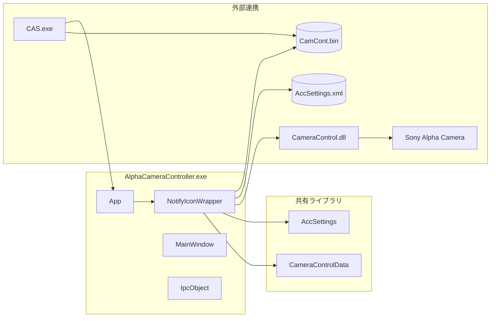
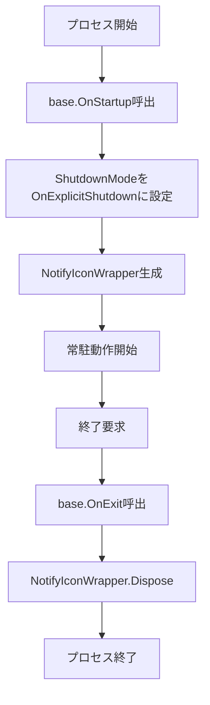
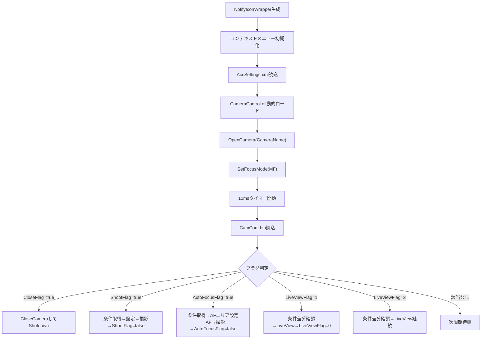
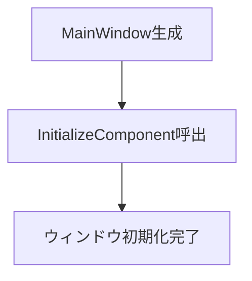
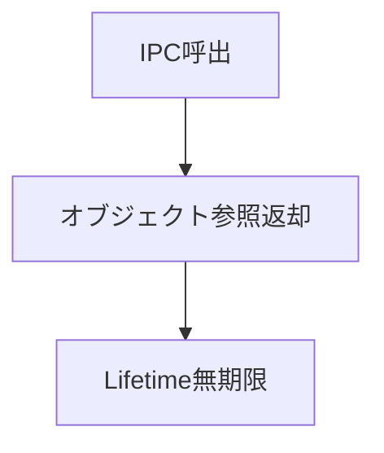
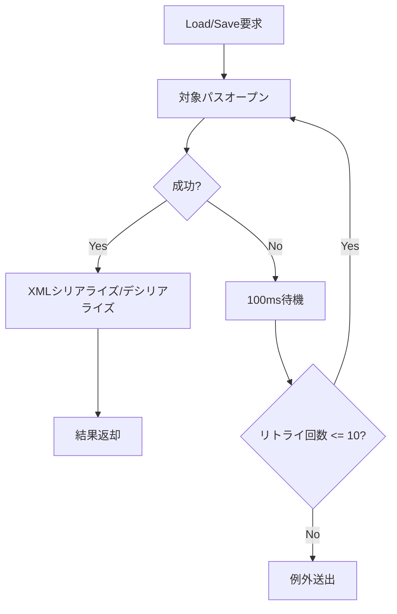
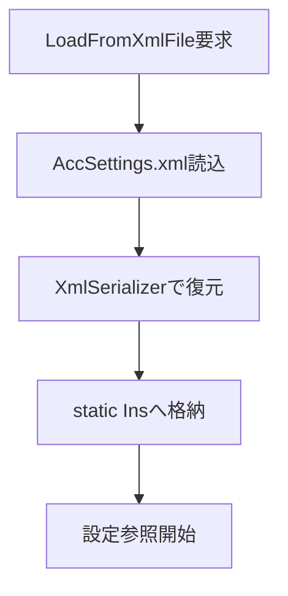
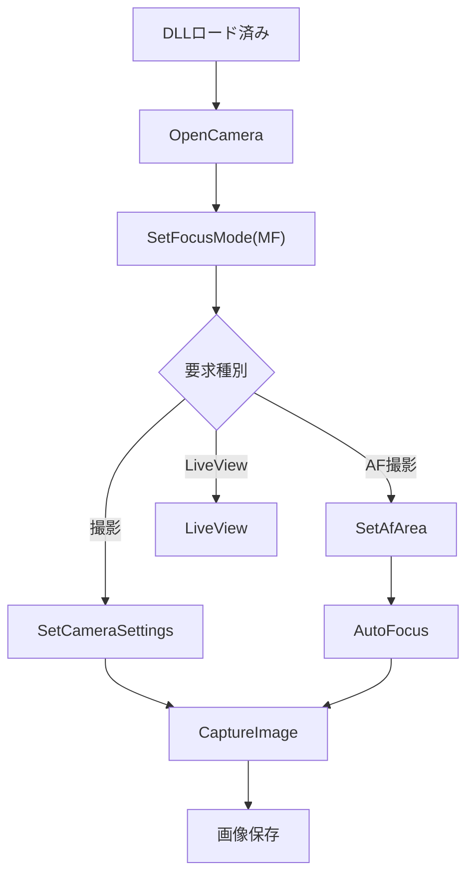
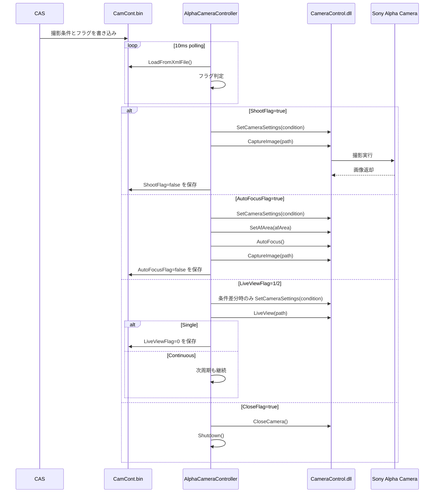

# AlphaCameraController 詳細設計書

| 項目 | 内容 |
|------|------|
| プロジェクト名 | ColorAlignmentSoftware |
| システム名 | AlphaCameraController |
| ドキュメント名 | 詳細設計書 |
| 作成日 | 2026/04/15 |
| 作成者 | システム分析チーム |
| バージョン | 0.1 |
| 関連資料 | AlphaCameraController_要件定義書.md, AlphaCameraController_基本設計書.md |

---

## 1. モジュール一覧

### 1-1. モジュール一覧表

| No. | モジュールID | モジュール名 | 分類 | 主責務 | 配置先 | 備考 |
|-----|--------------|--------------|------|--------|--------|------|
| 1 | MDL-001 | App | 画面基盤 | アプリケーション起動・終了時のライフサイクル制御 | AlphaCameraController/App.xaml.cs | NotifyIconWrapperの生成と破棄 |
| 2 | MDL-002 | NotifyIconWrapper | ビジネスロジック | 起動初期化、タスクトレイ常駐、制御ファイル監視、カメラ制御呼出 | AlphaCameraController/NotifyIconWrapper.cs | 本アプリの中核モジュール |
| 3 | MDL-003 | MainWindow | 画面 | WPFメインウィンドウ定義 | AlphaCameraController/MainWindow.xaml, MainWindow.xaml.cs | 現行運用では未使用 |
| 4 | MDL-004 | IpcObject | IF | IPC用DTO定義 | AlphaCameraController/IpcClass.cs | 現行運用では未使用、ファイル連携に移行済み |
| 5 | MDL-005 | CameraControlData | データアクセス | 制御ファイルCamCont.binの読込・保存、撮影条件保持 | CameraDataClass/CameraDataClass.cs | XMLシリアライズ、最大10回リトライ |
| 6 | MDL-006 | AccSettings | データアクセス | 起動設定AccSettings.xmlの読込・保持 | CameraDataClass/CameraDataClass.cs | カメラ名、制御ファイルパスを保持 |
| 7 | MDL-007 | CameraControl | 外部IF | CameraControllerSharpを利用したα6400制御 | CameraControl/CameraControl.cs | DLLを動的ロードして呼出 |

### 1-2. モジュール命名規約

| 項目 | 規約 |
|------|------|
| 命名方針 | C#クラス名はPascalCase、イベントハンドラはcontrolName_eventName、設定/DTOは名詞形 |
| ID採番規則 | MDL-001 から連番 |
| 分類コード | SCR:画面, BIZ:ビジネスロジック, DAL:データアクセス, IF:外部IF |

---

## 2. モジュール配置図（モジュールの物理配置設計）

### 2-1. 物理配置図

### 2-2. 配置一覧

| 配置区分 | 配置先パス/ノード | 配置モジュール | 配置理由 |
|----------|-------------------|----------------|----------|
| 実行モジュール | AlphaCameraController | App, NotifyIconWrapper, MainWindow, IpcObject | WPF常駐アプリとして単独実行するため |
| 共通ライブラリ | CameraDataClass | CameraControlData, AccSettings | CASと制御データ定義を共有するため |
| 外部制御ライブラリ | CameraControl | CameraControl | カメラ固有制御を分離し、差し替え容易性を確保するため |
| 設定/制御ファイル | AlphaCameraController実行フォルダおよびCAS指定パス | AccSettings.xml, CamCont.bin | 起動設定とCAS連携データを外部化するため |

---

## 3. モジュール仕様オーバービュー

### 3-1. モジュール分類別サマリ

| 分類 | 対象モジュール | 処理概要 | 主なインタフェース |
|------|----------------|----------|--------------------|
| 画面基盤 | App, MainWindow | WPFアプリ起動、常駐コンポーネント生成 | OnStartup, OnExit |
| ビジネスロジック | NotifyIconWrapper | 起動初期化、10msポーリング、フラグ別カメラ制御 | timer_Tick, toolStripMenuItem_Exit_Click |
| データアクセス | CameraControlData, AccSettings | XMLファイル読込/保存、設定値保持 | LoadFromXmlFile, SaveToXmlFile |
| 外部IF | CameraControl | カメラ接続、設定変更、撮影、AF、LiveView | OpenCamera, SetFocusMode, SetCameraSettings, AutoFocus, LiveView, CaptureImage |
| IF予備 | IpcObject | 将来のIPC連携用DTO | CloseFlag, ShootFlag, Path ほか |

### 3-2. モジュール別オーバービュー

| モジュールID | モジュール名 | 分類 | 処理概要 | インタフェース名 | 引数 | 返り値 |
|--------------|--------------|------|----------|------------------|------|--------|
| MDL-001 | App | 画面基盤 | 起動時にNotifyIconWrapperを生成し、終了時にDisposeする | OnStartup | StartupEventArgs | なし |
| MDL-002 | NotifyIconWrapper | ビジネスロジック | 制御ファイルを監視し、カメラ制御DLLを呼び出す | timer_Tick | object, EventArgs | なし |
| MDL-005 | CameraControlData | データアクセス | CamCont.binのXML読込/保存 | LoadFromXmlFile | path, out CameraControlData | bool |
| MDL-006 | AccSettings | データアクセス | AccSettings.xmlの読込/保持 | LoadFromXmlFile | path | bool |
| MDL-007 | CameraControl | 外部IF | α6400の接続、設定、撮影制御 | OpenCamera | string name | なし |

---

## 4. モジュール仕様（詳細）

### 4-1. MDL-001: App

#### 4-1-1. 基本情報

| 項目 | 内容 |
|------|------|
| モジュールID | MDL-001 |
| モジュール名 | App |
| 分類 | 画面基盤 |
| 呼出元 | OS、WPFランタイム |
| 呼出先 | NotifyIconWrapper |
| トランザクション | 無 |
| 再実行性 | 可。プロセス再起動により再初期化可能 |

#### 4-1-2. 処理フロー

#### 4-1-3. 処理手順

| 手順No. | 処理内容 | 入力 | 出力 | 操作対象 | 備考 |
|---------|----------|------|------|----------|------|
| 1 | アプリ起動イベント受信 | StartupEventArgs | 起動コンテキスト | WPFランタイム | OnStartupで実施 |
| 2 | 明示終了モード設定 | なし | ShutdownMode | Application | ウィンドウクローズでは終了しない |
| 3 | 常駐コンポーネント生成 | なし | NotifyIconWrapperインスタンス | NotifyIconWrapper | 実処理の起点 |
| 4 | アプリ終了イベント受信 | ExitEventArgs | 終了コンテキスト | WPFランタイム | OnExitで実施 |
| 5 | 常駐コンポーネント破棄 | notifyIcon | リソース解放 | NotifyIconWrapper | タスクトレイリソースを解放 |

#### 4-1-4. 操作対象仕様（画面、テーブル、ファイル）

| 対象種別 | 対象名 | 操作内容 | 操作タイミング | 主キー/識別子 | 備考 |
|----------|--------|----------|----------------|---------------|------|
| 画面 | WPF Application | 起動/終了制御 | プロセス開始/終了時 | Application.Current | 常駐専用 |

#### 4-1-5. インタフェース仕様（引数・返り値）

| 項目 | 内容 |
|------|------|
| インタフェース名 | OnStartup(e: StartupEventArgs), OnExit(e: ExitEventArgs) |
| 概要 | WPFアプリライフサイクルを管理する |
| シグネチャ | protected override void OnStartup(StartupEventArgs e) / protected override void OnExit(ExitEventArgs e) |
| 呼出条件 | WPFランタイムにより自動実行 |

引数一覧

| No. | 引数名 | 型 | 必須 | 説明 | バリデーション |
|-----|--------|----|------|------|----------------|
| 1 | e | StartupEventArgs / ExitEventArgs | Y | 起動/終了イベント情報 | WPF標準 |

返り値一覧

| No. | 項目名 | 型 | 説明 | 備考 |
|-----|--------|----|------|------|
| 1 | なし | - | 戻り値なし | 例外時は上位に伝播 |

#### 4-1-6. 例外処理仕様

| No. | 例外/エラー条件 | 検知方法 | 対応内容 | ユーザー通知 | ログ出力 | リトライ/継続可否 |
|-----|------------------|----------|----------|--------------|----------|------------------|
| 1 | NotifyIconWrapper生成失敗 | 例外伝播 | 起動失敗としてプロセス終了 | NotifyIconWrapper側でMessageBox表示 | なし | 不可 |

#### 4-1-7. ログ仕様

| ログ種別 | 出力条件 | 出力項目 | 保持期間 | マスキング方針 |
|----------|----------|----------|----------|----------------|
| 該当なし | 専用ログ実装なし | - | - | - |

### 4-2. MDL-002: NotifyIconWrapper

#### 4-2-1. 基本情報

| 項目 | 内容 |
|------|------|
| モジュールID | MDL-002 |
| モジュール名 | NotifyIconWrapper |
| 分類 | ビジネスロジック |
| 呼出元 | App、DispatcherTimer、タスクトレイメニュー |
| 呼出先 | AccSettings, CameraControlData, CameraControl.dll, Application |
| トランザクション | 無 |
| 再実行性 | 可。CASがプロセス再起動することで初期化から再実行 |

#### 4-2-2. 処理フロー

#### 4-2-3. 処理手順

| 手順No. | 処理内容 | 入力 | 出力 | 操作対象 | 備考 |
|---------|----------|------|------|----------|------|
| 1 | タスクトレイアイコン・Exitメニュー初期化 | 埋込リソース | 常駐UI | NotifyIcon | コンストラクタで実施 |
| 2 | アプリ配置パス取得 | 実行中Assembly | appliPath | 実行フォルダ | DLL/設定ファイル読込に使用 |
| 3 | AccSettings.xml読込 | appliPath + AccSettings.xml | 設定値 | AccSettings.Ins | CameraName, CameraControlFileを参照 |
| 4 | CameraControl.dll動的ロード | appliPath + CameraControl.dll | ccインスタンス | Reflection | 型名CAS.CameraControlを取得 |
| 5 | カメラ接続とMF初期化 | CameraName | 接続済み状態 | Sony Alpha Camera | OpenCamera後にSetFocusMode("MF") |
| 6 | 10msタイマー起動 | なし | 周期監視開始 | DispatcherTimer | 同期的に1スレッドで処理 |
| 7 | CloseFlag確認 | CamCont.bin | 終了要否 | CameraControlData | trueで即終了 |
| 8 | ShootFlag確認 | CamCont.bin | 撮影要否 | CameraControlData | trueで通常撮影 |
| 9 | AutoFocusFlag確認 | CamCont.bin | AF撮影要否 | CameraControlData | trueでAF後撮影 |
| 10 | LiveViewFlag確認 | CamCont.bin | ライブビュー要否 | CameraControlData | 1=単発, 2=連続 |
| 11 | 実行済フラグ更新 | flag値 | CamCont.bin更新 | CameraControlData | SaveToXmlFileで保存 |
| 12 | Exitメニュー処理 | メニュークリック | プロセス終了 | Application | CloseCamera後にShutdown |

#### 4-2-4. 操作対象仕様（画面、テーブル、ファイル）

| 対象種別 | 対象名 | 操作内容 | 操作タイミング | 主キー/識別子 | 備考 |
|----------|--------|----------|----------------|---------------|------|
| 画面 | タスクトレイアイコン | 表示、右クリックメニュー表示 | 起動時 | notifyIcon1 | 常時表示 |
| 画面 | Exitメニュー | 終了操作 | ユーザー操作時 | toolStripMenuItem_Exit | 保守用操作 |
| ファイル | AccSettings.xml | 読込 | 起動時 | 実行フォルダ配下 | XML形式 |
| ファイル | CamCont.bin | 読込/更新 | 10ms毎、処理完了時 | AccSettings.Ins.CameraControlFile | 実体はXMLシリアライズ |
| 外部装置 | Sony Alpha Camera | 接続/切断/撮影/AF/LiveView | 起動時、各フラグ検知時 | CameraName | CameraControl.dll経由 |

#### 4-2-5. インタフェース仕様（引数・返り値）

| 項目 | 内容 |
|------|------|
| インタフェース名 | NotifyIconWrapper(), timer_Tick(sender, e), toolStripMenuItem_Exit_Click(sender, e) |
| 概要 | 初期化、定周期監視、明示終了を担当する |
| シグネチャ | public NotifyIconWrapper() / private void timer_Tick(object sender, EventArgs e) / private void toolStripMenuItem_Exit_Click(object sender, EventArgs e) |
| 呼出条件 | アプリ起動時、10msタイマー、Exitメニュー選択時 |

引数一覧

| No. | 引数名 | 型 | 必須 | 説明 | バリデーション |
|-----|--------|----|------|------|----------------|
| 1 | sender | object | Y | イベント送信元 | イベント標準 |
| 2 | e | EventArgs | Y | イベント情報 | イベント標準 |

返り値一覧

| No. | 項目名 | 型 | 説明 | 備考 |
|-----|--------|----|------|------|
| 1 | なし | - | 戻り値なし | 処理結果はCamCont.bin更新または副作用で反映 |

補助メソッド一覧

| メソッド名 | 概要 | 主な入出力 |
|------------|------|------------|
| CheckCloseFlag | CloseFlag取得 | CamCont.bin → bool |
| CheckShootFlag | ShootFlag取得 | CamCont.bin → bool |
| CheckAutoFocusFlag | AutoFocusFlag取得 | CamCont.bin → bool |
| CheckLiveViewFlag | LiveViewFlag取得 | CamCont.bin → int |
| GetCondition | 撮影条件と保存先取得 | CamCont.bin → ImgPath, ShootCondition |
| GetAfAreaSetting | AFエリア設定取得 | CamCont.bin → AfAreaSetting |
| SetShootFlag | ShootFlag更新 | bool → CamCont.bin |
| SetAutoFocusFlag | AutoFocusFlag更新 | bool → CamCont.bin |
| SetLiveViewFlag | LiveViewFlag更新 | int → CamCont.bin |

#### 4-2-6. 例外処理仕様

| No. | 例外/エラー条件 | 検知方法 | 対応内容 | ユーザー通知 | ログ出力 | リトライ/継続可否 |
|-----|------------------|----------|----------|--------------|----------|------------------|
| 1 | CameraControl.dll読込失敗 | Assembly.LoadFrom例外 | MessageBox表示後、初期化中断 | タイトル: Alpha Camera Controller Error! | なし | 不可 |
| 2 | カメラ接続失敗 | OpenCamera例外 | MessageBox表示後、初期化中断 | 例外メッセージ表示 | なし | 不可 |
| 3 | タイマー処理中例外 | try-catch | MessageBox表示後、Application.Current.Shutdown() | 例外メッセージ表示 | なし | 不可 |
| 4 | フラグクリア保存失敗 | SetShootFlag/SetAutoFocusFlag/SetLiveViewFlag例外 | catchで握り潰し、次周期で再評価 | 通知なし | なし | 条件付き可 |
| 5 | 制御ファイル未存在 | File.Exists=false | 処理スキップ | 通知なし | なし | 可 |

#### 4-2-7. ログ仕様

| ログ種別 | 出力条件 | 出力項目 | 保持期間 | マスキング方針 |
|----------|----------|----------|----------|----------------|
| 該当なし | 専用ログ実装なし | - | - | - |

### 4-3. MDL-003: MainWindow

#### 4-3-1. 基本情報

| 項目 | 内容 |
|------|------|
| モジュールID | MDL-003 |
| モジュール名 | MainWindow |
| 分類 | 画面 |
| 呼出元 | WPFランタイム |
| 呼出先 | InitializeComponent |
| トランザクション | 無 |
| 再実行性 | 可 |

#### 4-3-2. 処理フロー

#### 4-3-3. 処理手順

| 手順No. | 処理内容 | 入力 | 出力 | 操作対象 | 備考 |
|---------|----------|------|------|----------|------|
| 1 | コンストラクタ実行 | なし | Window初期化 | MainWindow.xaml | 現行運用では画面表示なし |

#### 4-3-4. 操作対象仕様（画面、テーブル、ファイル）

| 対象種別 | 対象名 | 操作内容 | 操作タイミング | 主キー/識別子 | 備考 |
|----------|--------|----------|----------------|---------------|------|
| 画面 | MainWindow | 初期化のみ | Window生成時 | MainWindow | 実運用では未使用 |

#### 4-3-5. インタフェース仕様（引数・返り値）

| 項目 | 内容 |
|------|------|
| インタフェース名 | MainWindow() |
| 概要 | WPFウィンドウを初期化する |
| シグネチャ | public MainWindow() |
| 呼出条件 | Window生成時 |

引数一覧

| No. | 引数名 | 型 | 必須 | 説明 | バリデーション |
|-----|--------|----|------|------|----------------|
| 1 | なし | - | - | - | - |

返り値一覧

| No. | 項目名 | 型 | 説明 | 備考 |
|-----|--------|----|------|------|
| 1 | なし | - | 戻り値なし | |

#### 4-3-6. 例外処理仕様

| No. | 例外/エラー条件 | 検知方法 | 対応内容 | ユーザー通知 | ログ出力 | リトライ/継続可否 |
|-----|------------------|----------|----------|--------------|----------|------------------|
| 1 | XAML初期化失敗 | 例外伝播 | 起動失敗 | WPF標準例外 | なし | 不可 |

#### 4-3-7. ログ仕様

| ログ種別 | 出力条件 | 出力項目 | 保持期間 | マスキング方針 |
|----------|----------|----------|----------|----------------|
| 該当なし | 専用ログ実装なし | - | - | - |

### 4-4. MDL-004: IpcObject

#### 4-4-1. 基本情報

| 項目 | 内容 |
|------|------|
| モジュールID | MDL-004 |
| モジュール名 | IpcObject |
| 分類 | IF |
| 呼出元 | 未使用 |
| 呼出先 | なし |
| トランザクション | 無 |
| 再実行性 | 可 |

#### 4-4-2. 処理フロー

#### 4-4-3. 処理手順

| 手順No. | 処理内容 | 入力 | 出力 | 操作対象 | 備考 |
|---------|----------|------|------|----------|------|
| 1 | IPC共有データ保持 | フラグ/条件 | DTO状態 | IpcObject | 現行運用では未使用 |
| 2 | ライフタイム無期限化 | なし | null返却 | Remoting | InitializeLifetimeService |

#### 4-4-4. 操作対象仕様（画面、テーブル、ファイル）

| 対象種別 | 対象名 | 操作内容 | 操作タイミング | 主キー/識別子 | 備考 |
|----------|--------|----------|----------------|---------------|------|
| 外部IF | .NET Remoting IPC | DTO受け渡し | 将来利用時 | IpcObject | 現在はファイル制御へ移行済み |

#### 4-4-5. インタフェース仕様（引数・返り値）

| 項目 | 内容 |
|------|------|
| インタフェース名 | InitializeLifetimeService() |
| 概要 | MarshalByRefObjectの寿命管理を無期限化する |
| シグネチャ | public override object InitializeLifetimeService() |
| 呼出条件 | Remotingランタイムから呼出 |

引数一覧

| No. | 引数名 | 型 | 必須 | 説明 | バリデーション |
|-----|--------|----|------|------|----------------|
| 1 | なし | - | - | - | - |

返り値一覧

| No. | 項目名 | 型 | 説明 | 備考 |
|-----|--------|----|------|------|
| 1 | null | object | 無期限ライフタイム指定 | Remoting仕様 |

#### 4-4-6. 例外処理仕様

| No. | 例外/エラー条件 | 検知方法 | 対応内容 | ユーザー通知 | ログ出力 | リトライ/継続可否 |
|-----|------------------|----------|----------|--------------|----------|------------------|
| 1 | 該当なし | - | なし | なし | なし | 可 |

#### 4-4-7. ログ仕様

| ログ種別 | 出力条件 | 出力項目 | 保持期間 | マスキング方針 |
|----------|----------|----------|----------|----------------|
| 該当なし | 専用ログ実装なし | - | - | - |

### 4-5. MDL-005: CameraControlData

#### 4-5-1. 基本情報

| 項目 | 内容 |
|------|------|
| モジュールID | MDL-005 |
| モジュール名 | CameraControlData |
| 分類 | データアクセス |
| 呼出元 | NotifyIconWrapper, CAS |
| 呼出先 | ファイルシステム、XmlSerializer |
| トランザクション | 無 |
| 再実行性 | 可。最大10回リトライを内包 |

#### 4-5-2. 処理フロー

#### 4-5-3. 処理手順

| 手順No. | 処理内容 | 入力 | 出力 | 操作対象 | 備考 |
|---------|----------|------|------|----------|------|
| 1 | CamCont.binオープン | path | StreamReader/XmlWriter | ファイルシステム | UTF-8(BOMなし) |
| 2 | XML逆シリアライズ | XML本文 | CameraControlData | XmlSerializer | LoadFromXmlFile |
| 3 | XMLシリアライズ | CameraControlData | XML本文 | XmlSerializer | SaveToXmlFile |
| 4 | リトライ判定 | 例外 | 再試行/例外送出 | 内部カウンタ | 最大10回 |
| 5 | 100ms待機 | リトライ対象 | 次回試行 | Thread.Sleep | ファイル競合緩和 |

#### 4-5-4. 操作対象仕様（画面、テーブル、ファイル）

| 対象種別 | 対象名 | 操作内容 | 操作タイミング | 主キー/識別子 | 備考 |
|----------|--------|----------|----------------|---------------|------|
| ファイル | CamCont.bin | 読込/更新 | CAS/ACCの制御時 | パス文字列 | 拡張子binだがXML形式 |

#### 4-5-5. インタフェース仕様（引数・返り値）

| 項目 | 内容 |
|------|------|
| インタフェース名 | LoadFromXmlFile, SaveToXmlFile |
| 概要 | 制御ファイルの読込・保存を行う |
| シグネチャ | public static bool LoadFromXmlFile(string path, out CameraControlData data) / public static bool SaveToXmlFile(string path, CameraControlData data) |
| 呼出条件 | 制御ファイル読込/更新時 |

引数一覧

| No. | 引数名 | 型 | 必須 | 説明 | バリデーション |
|-----|--------|----|------|------|----------------|
| 1 | path | string | Y | 制御ファイルフルパス | ファイルアクセス可能であること |
| 2 | data | out CameraControlData / CameraControlData | Y | 制御データ本体 | XMLシリアライズ可能であること |

返り値一覧

| No. | 項目名 | 型 | 説明 | 備考 |
|-----|--------|----|------|------|
| 1 | result | bool | 正常時true | 失敗時は例外送出 |

制御データ項目一覧

| No. | 項目名 | 型 | 説明 | 備考 |
|-----|--------|----|------|------|
| 1 | Condition | ShootCondition | 撮影条件 | ImageSize, FNumber, Shutter, ISO, WB, CompressionTypeを保持 |
| 2 | ImgPath | string | 画像保存先パス | 拡張子なしパスをCASが指定 |
| 3 | ShootFlag | bool | 通常撮影指示 | 実行後falseへ更新 |
| 4 | CloseFlag | bool | 終了指示 | trueでACC終了 |
| 5 | AutoFocusFlag | bool | AF撮影指示 | 実行後falseへ更新 |
| 6 | AfArea | AfAreaSetting | AFエリア設定 | focusAreaType, focusAreaX, focusAreaY |
| 7 | LiveViewFlag | int | ライブビュー指示 | 0=Off, 1=Single, 2=Continuous |

#### 4-5-6. 例外処理仕様

| No. | 例外/エラー条件 | 検知方法 | 対応内容 | ユーザー通知 | ログ出力 | リトライ/継続可否 |
|-----|------------------|----------|----------|--------------|----------|------------------|
| 1 | ファイル占有/読込失敗 | 例外捕捉 | 100ms待機して再試行 | なし | なし | 可(最大10回) |
| 2 | XML破損 | 例外捕捉 | 最大回数到達後に例外送出 | 呼出元に依存 | なし | 不可 |
| 3 | 保存失敗 | 例外捕捉 | 100ms待機して再試行 | なし | なし | 可(最大10回) |

#### 4-5-7. ログ仕様

| ログ種別 | 出力条件 | 出力項目 | 保持期間 | マスキング方針 |
|----------|----------|----------|----------|----------------|
| 該当なし | 専用ログ実装なし | - | - | - |

### 4-6. MDL-006: AccSettings

#### 4-6-1. 基本情報

| 項目 | 内容 |
|------|------|
| モジュールID | MDL-006 |
| モジュール名 | AccSettings |
| 分類 | データアクセス |
| 呼出元 | NotifyIconWrapper |
| 呼出先 | ファイルシステム、XmlSerializer |
| トランザクション | 無 |
| 再実行性 | 可 |

#### 4-6-2. 処理フロー

#### 4-6-3. 処理手順

| 手順No. | 処理内容 | 入力 | 出力 | 操作対象 | 備考 |
|---------|----------|------|------|----------|------|
| 1 | 設定ファイルオープン | path | StreamReader | ファイルシステム | UTF-8(BOMなし) |
| 2 | XML逆シリアライズ | XML本文 | AccSettings | XmlSerializer | static Insに格納 |
| 3 | エラー情報保持 | 例外 | ErrorMessage | AccSettings | falseを返す |

#### 4-6-4. 操作対象仕様（画面、テーブル、ファイル）

| 対象種別 | 対象名 | 操作内容 | 操作タイミング | 主キー/識別子 | 備考 |
|----------|--------|----------|----------------|---------------|------|
| ファイル | AccSettings.xml | 読込 | 起動時 | 実行フォルダ配下 | XML形式 |

#### 4-6-5. インタフェース仕様（引数・返り値）

| 項目 | 内容 |
|------|------|
| インタフェース名 | LoadFromXmlFile(path) |
| 概要 | 起動設定を読み込み、共有インスタンスに反映する |
| シグネチャ | public static bool LoadFromXmlFile(string path) |
| 呼出条件 | NotifyIconWrapper初期化時 |

引数一覧

| No. | 引数名 | 型 | 必須 | 説明 | バリデーション |
|-----|--------|----|------|------|----------------|
| 1 | path | string | Y | 設定ファイルフルパス | アクセス可能であること |

返り値一覧

| No. | 項目名 | 型 | 説明 | 備考 |
|-----|--------|----|------|------|
| 1 | result | bool | 読込成否 | false時はErrorMessageを参照 |

主要設定項目一覧

| No. | 項目名 | 型 | 説明 | 備考 |
|-----|--------|----|------|------|
| 1 | Common.CameraName | string | 接続対象カメラ名 | CameraControl.OpenCameraに引き渡す |
| 2 | Common.CameraWait | int | カメラ待機時間 | NotifyIconWrapperでは未使用、拡張余地 |
| 3 | CameraControlFile | string | CamCont.binの配置パス | CASと共有 |

#### 4-6-6. 例外処理仕様

| No. | 例外/エラー条件 | 検知方法 | 対応内容 | ユーザー通知 | ログ出力 | リトライ/継続可否 |
|-----|------------------|----------|----------|--------------|----------|------------------|
| 1 | 設定ファイル未存在/読込失敗 | 例外捕捉 | ErrorMessageに保存しfalse返却 | 呼出元で処理 | なし | 不可 |
| 2 | XML不正 | 例外捕捉 | ErrorMessageに保存しfalse返却 | 呼出元で処理 | なし | 不可 |

#### 4-6-7. ログ仕様

| ログ種別 | 出力条件 | 出力項目 | 保持期間 | マスキング方針 |
|----------|----------|----------|----------|----------------|
| 該当なし | 専用ログ実装なし | - | - | - |

### 4-7. MDL-007: CameraControl

#### 4-7-1. 基本情報

| 項目 | 内容 |
|------|------|
| モジュールID | MDL-007 |
| モジュール名 | CameraControl |
| 分類 | 外部IF |
| 呼出元 | NotifyIconWrapper |
| 呼出先 | CameraControllerSharp, Sony Alpha Camera, ファイルシステム |
| トランザクション | 無 |
| 再実行性 | 条件付き可。内部で一部再試行を実施 |

#### 4-7-2. 処理フロー

#### 4-7-3. 処理手順

| 手順No. | 処理内容 | 入力 | 出力 | 操作対象 | 備考 |
|---------|----------|------|------|----------|------|
| 1 | デバイス一覧取得 | なし | 接続候補一覧 | CameraControllerSharp | EnumerateDevices |
| 2 | カメラ名一致確認 | CameraName | 接続対象index | CameraControllerSharp | 不一致時は例外 |
| 3 | カメラ接続 | index | 接続状態 | Sony Alpha Camera | 失敗時は1秒後再試行1回 |
| 4 | パラメータ設定 | ShootCondition | カメラ設定反映 | Sony Alpha Camera | 絞り、シャッター、ISO、WB、画像サイズ、圧縮形式 |
| 5 | AFエリア設定 | AfAreaSetting | AF領域反映 | Sony Alpha Camera | AF撮影時のみ |
| 6 | オートフォーカス | なし | AF結果 | Sony Alpha Camera | bool返却 |
| 7 | 撮影/ライブビュー | ImgPath | 画像データ | Sony Alpha Camera | GetImage/LiveView取得 |
| 8 | ファイル保存 | 画像データ | jpg/arw | ファイルシステム | saveImageで保存 |
| 9 | カメラ切断 | なし | 切断状態 | Sony Alpha Camera | 終了時 |

#### 4-7-4. 操作対象仕様（画面、テーブル、ファイル）

| 対象種別 | 対象名 | 操作内容 | 操作タイミング | 主キー/識別子 | 備考 |
|----------|--------|----------|----------------|---------------|------|
| 外部IF | Sony Alpha Camera | 接続、設定、撮影、AF、切断 | 起動時、撮影時、終了時 | CameraName | 実機依存 |
| ファイル | 画像ファイル | 出力 | 撮影/LiveView実行後 | ImgPath | jpg/arwを生成 |

#### 4-7-5. インタフェース仕様（引数・返り値）

| 項目 | 内容 |
|------|------|
| インタフェース名 | OpenCamera, CloseCamera, SetCameraSettings, SetAfArea, AutoFocus, CaptureImage, LiveView |
| 概要 | α6400制御を抽象化したDLL公開メソッド群 |
| シグネチャ | OpenCamera(string), CloseCamera(), SetCameraSettings(ShootCondition): bool, SetAfArea(AfAreaSetting): bool, AutoFocus(): bool, CaptureImage(string), LiveView(string) |
| 呼出条件 | NotifyIconWrapperの各処理分岐から呼出 |

引数一覧

| No. | 引数名 | 型 | 必須 | 説明 | バリデーション |
|-----|--------|----|------|------|----------------|
| 1 | name | string | Y | 接続対象カメラ名 | EnumerateDevices結果に存在すること |
| 2 | condition | ShootCondition | Y | 撮影設定 | 値体系がカメラ対応範囲内であること |
| 3 | afArea | AfAreaSetting | N | AFエリア設定 | focusAreaTypeごとの座標範囲に入ること |
| 4 | path | string | Y | 保存先パス | 書込可能であること |

返り値一覧

| No. | 項目名 | 型 | 説明 | 備考 |
|-----|--------|----|------|------|
| 1 | result | bool | 設定/AFの成否 | 失敗時は例外またはfalse |

#### 4-7-6. 例外処理仕様

| No. | 例外/エラー条件 | 検知方法 | 対応内容 | ユーザー通知 | ログ出力 | リトライ/継続可否 |
|-----|------------------|----------|----------|--------------|----------|------------------|
| 1 | カメラ列挙失敗 | 戻り値判定 | 例外送出 | 呼出元でMessageBox表示 | なし | 不可 |
| 2 | 指定カメラ未検出 | 一覧走査 | 例外送出 | 呼出元でMessageBox表示 | なし | 不可 |
| 3 | カメラ接続失敗 | ConnectDevice戻り値 | 1秒後に1回再試行、それでも失敗なら例外送出 | 呼出元でMessageBox表示 | なし | 条件付き可(1回) |
| 4 | 撮影失敗 | GetImage戻り値 | 2秒後に1回再撮影、それでも失敗なら例外送出 | 呼出元でMessageBox表示 | なし | 条件付き可(1回) |
| 5 | 切断失敗 | DisconnectDevice戻り値 | 例外送出 | 呼出元で処理 | なし | 不可 |

#### 4-7-7. ログ仕様

| ログ種別 | 出力条件 | 出力項目 | 保持期間 | マスキング方針 |
|----------|----------|----------|----------|----------------|
| 該当なし | 専用ログ実装なし | - | - | - |

---

## 5. コード仕様

### 5-1. コード一覧

| コード名称 | コード値 | 内容説明 | 利用箇所 | 備考 |
|------------|----------|----------|----------|------|
| フォーカスモード | MF | 手動フォーカス | NotifyIconWrapper初期化 | 起動時に設定 |
| フォーカスモード | AF_S | シングルAF | CameraControl外部制御 | 配列定義のみ |
| フォーカスモード | close_up | 接写AF | CameraControl外部制御 | 配列定義のみ |
| フォーカスモード | AF_C | コンティニュアスAF | CameraControl外部制御 | 配列定義のみ |
| フォーカスモード | AF_A | 自動AF | CameraControl外部制御 | 配列定義のみ |
| フォーカスモード | DMF | ダイレクトマニュアルフォーカス | CameraControl外部制御 | 配列定義のみ |
| フォーカスモード | MF_R | MF補助 | CameraControl外部制御 | 配列定義のみ |
| フォーカスモード | AF_D | 被写体追従AF | CameraControl外部制御 | 配列定義のみ |
| フォーカスモード | PF | プログラムフォーカス | CameraControl外部制御 | 配列定義のみ |
| LiveViewFlag | 0 | Off | NotifyIconWrapper, CameraControlData | 処理なし |
| LiveViewFlag | 1 | Single | NotifyIconWrapper | 実行後0へ戻す |
| LiveViewFlag | 2 | Continuous | NotifyIconWrapper | 継続撮影 |
| CompressionType | 16 | RAW | CAS/CameraControlData | 基本設計書記載値 |
| CompressionType | 3 | JPG | CAS/CameraControlData | 基本設計書記載値 |

### 5-2. コード定義ルール

| 項目 | ルール |
|------|--------|
| コード値体系 | 外部DLL仕様値および制御フラグ整数値をそのまま利用 |
| 重複禁止範囲 | 同一コード名称内 |
| 廃止時の扱い | 互換性維持のため未使用値も残置可 |

---

## 6. メッセージ仕様

### 6-1. メッセージ一覧

| メッセージ名称 | メッセージID | 種別 | 表示メッセージ | 内容説明 | 対応アクション |
|----------------|--------------|------|----------------|----------|----------------|
| 初期化/処理例外 | MSG-ACC-E-001 | 異常通知 | Alpha Camera Controller Error! | 例外発生時のMessageBoxタイトル | OK押下後終了 |
| 例外本文 | MSG-ACC-E-002 | 異常通知 | ex.Message | 実例外メッセージを本文表示 | OK押下後終了 |

### 6-2. メッセージ運用ルール

| 項目 | ルール |
|------|--------|
| ID採番 | MSG-ACC-{I/Q/W/E}-連番 |
| 多言語対応 | 無。英語固定メッセージを使用 |
| プレースホルダ | 例外本文はex.Messageをそのまま表示 |

---

## 7. 関連システムインタフェース仕様

### 7-1. インタフェース一覧

| IF ID | I/O | インタフェースシステム名 | インタフェースファイル名 | インタフェースタイミング | インタフェース方法 | インタフェースエラー処理方法 | インタフェース処理のリラン定義 | インタフェース処理のロギングインタフェース |
|------|-----|--------------------------|--------------------------|--------------------------|--------------------|------------------------------|--------------------------------|------------------------------------------|
| IF-001 | IN/OUT | CAS | CamCont.bin | 10ms毎ポーリング、処理完了時 | XMLファイルI/O | CameraControlDataで最大10回リトライ、上位で例外終了 | 次周期再評価、読込/保存は最大10回再試行 | なし |
| IF-002 | IN | 設定ファイル | AccSettings.xml | 起動時 | XMLファイルI/O | false返却、呼出元で初期化失敗扱い | なし | なし |
| IF-003 | OUT | CameraControl.dll | CAS.CameraControl | 起動時、撮影時、AF時、LiveView時、終了時 | Reflection + DLL呼出 | 例外送出、NotifyIconWrapperでMessageBox表示後終了 | OpenCameraは1回再試行、CaptureImageは1回再撮影 | なし |
| IF-004 | OUT | Sony Alpha Camera | 実機 | DLL呼出の都度 | USB/カメラAPI | DLL側で例外化 | DLL仕様に依存 | なし |

### 7-2. インタフェースデータ項目定義

| IF ID | データ項目名 | データ項目の説明 | データ項目の位置 | 書式 | 必須 | エラー時の代替値 | 備考 |
|------|--------------|------------------|------------------|------|------|------------------|------|
| IF-001 | Condition.ImageSize | 画像サイズ設定 | CamCont.bin/Condition | int | N | 既定値1 | CameraControlへ引渡し |
| IF-001 | Condition.FNumber | F値 | CamCont.bin/Condition | string | N | 空文字 | 例: F22 |
| IF-001 | Condition.Shutter | シャッター速度 | CamCont.bin/Condition | string | N | 空文字 | 例: 0.5" |
| IF-001 | Condition.ISO | ISO感度 | CamCont.bin/Condition | string | N | 空文字 | 例: 200 |
| IF-001 | Condition.WB | ホワイトバランス | CamCont.bin/Condition | string | N | 空文字 | 例: 6500K |
| IF-001 | Condition.CompressionType | 圧縮形式 | CamCont.bin/Condition | uint | N | 16 | 16=RAW, 3=JPG |
| IF-001 | ImgPath | 保存先パス | CamCont.bin | string | 条件付きY | 空文字 | Shoot/LiveView時に使用 |
| IF-001 | ShootFlag | 通常撮影要求 | CamCont.bin | bool | Y | false | 完了後false |
| IF-001 | AutoFocusFlag | AF撮影要求 | CamCont.bin | bool | Y | false | 完了後false |
| IF-001 | AfArea.focusAreaType | AFエリア種別 | CamCont.bin/AfArea | string | N | Center | Wide, Zone, Center, FlexibleSpotS/M/L |
| IF-001 | AfArea.focusAreaX | AFエリアX座標 | CamCont.bin/AfArea | ushort | N | 320 | 種別ごとに許容範囲あり |
| IF-001 | AfArea.focusAreaY | AFエリアY座標 | CamCont.bin/AfArea | ushort | N | 210 | 種別ごとに許容範囲あり |
| IF-001 | LiveViewFlag | ライブビュー要求 | CamCont.bin | int | Y | 0 | 0=Off,1=Single,2=Continuous |
| IF-001 | CloseFlag | 終了要求 | CamCont.bin | bool | Y | false | trueでACC終了 |
| IF-002 | Common.CameraName | 接続対象カメラ名 | AccSettings.xml/Common | string | Y | なし | OpenCameraに渡す |
| IF-002 | CameraControlFile | 制御ファイルパス | AccSettings.xml | string | Y | なし | CamCont.binフルパス |
| IF-002 | Common.CameraWait | 待機時間設定 | AccSettings.xml/Common | int | N | 0 | 現行ACCでは未使用 |

### 7-3. インタフェース処理シーケンス

## 8. メソッド仕様

各クラスの公開・主要非公開メソッドを記述する。引数・返り値の型はC#表記とする。

---

### 10-1. App クラス（MDL-001）

#### `OnStartup(StartupEventArgs e)`

| 項目 | 内容 |
|------|------|
| シグネチャ | `protected override void OnStartup(StartupEventArgs e)` |
| 概要 | WPF起動イベントを受け取り、ShutdownModeを明示終了に設定してNotifyIconWrapperを生成する |
| 呼出タイミング | WPFランタイムがアプリ起動時に自動呼出 |
| 事前条件 | Application起動済み |

引数

| No. | 引数名 | 型 | 必須 | 説明 |
|-----|--------|----|------|------|
| 1 | e | `StartupEventArgs` | Y | アプリ起動時のイベントデータ |

返り値: なし（void）

処理概要

| 手順 | 内容 |
|------|------|
| 1 | `base.OnStartup(e)` を呼出 |
| 2 | `ShutdownMode = ShutdownMode.OnExplicitShutdown` に設定（ウィンドウ閉鎖で終了しないようにする） |
| 3 | `notifyIcon = new NotifyIconWrapper()` を生成 |

例外: NotifyIconWrapper コンストラクタ内の例外はそのまま伝播する。

---

#### `OnExit(ExitEventArgs e)`

| 項目 | 内容 |
|------|------|
| シグネチャ | `protected override void OnExit(ExitEventArgs e)` |
| 概要 | WPF終了イベントを受け取り、NotifyIconWrapper を破棄する |
| 呼出タイミング | `Application.Current.Shutdown()` 実行後にWPFランタイムが自動呼出 |
| 事前条件 | OnStartup が正常完了していること |

引数

| No. | 引数名 | 型 | 必須 | 説明 |
|-----|--------|----|------|------|
| 1 | e | `ExitEventArgs` | Y | 終了イベントデータ |

返り値: なし（void）

処理概要

| 手順 | 内容 |
|------|------|
| 1 | `base.OnExit(e)` を呼出 |
| 2 | `notifyIcon.Dispose()` でタスクトレイリソースを解放 |

---

### 10-2. NotifyIconWrapper クラス（MDL-002）

#### `NotifyIconWrapper()` ―― メインコンストラクタ

| 項目 | 内容 |
|------|------|
| シグネチャ | `public NotifyIconWrapper()` |
| 概要 | タスクトレイアイコン初期化・AccSettings.xml読込・CameraControl.dll動的ロード・カメラ接続・タイマー起動を一括実施する |
| 呼出タイミング | App.OnStartup から生成 |
| 事前条件 | AccSettings.xml と CameraControl.dll が実行フォルダに存在すること |

引数: なし

返り値: なし（コンストラクタ）

処理概要

| 手順 | 内容 |
|------|------|
| 1 | `InitializeComponent()` でデザイナ生成リソースを初期化 |
| 2 | Exitメニューのイベントハンドラ `toolStripMenuItem_Exit_Click` を登録 |
| 3 | 実行中Assemblyからアプリ配置パス `appliPath` を取得 |
| 4 | `AccSettings.LoadFromXmlFile(appliPath + "\\AccSettings.xml")` でカメラ名・制御ファイルパスを読込 |
| 5 | `Assembly.LoadFrom(appliPath + "\\CameraControl.dll")` で DLL を動的ロード、`CAS.CameraControl` 型を取得 |
| 6 | `cc.OpenCamera(AccSettings.Ins.Common.CameraName)` でカメラ接続 |
| 7 | `cc.SetFocusMode("MF")` でマニュアルフォーカスに初期化 |
| 8 | `DispatcherTimer` を 10ms 間隔で生成・起動、`timer_Tick` を登録 |

例外条件

| 条件 | 対応 |
|------|------|
| DLL読込失敗、OpenCamera失敗 など | `catch(Exception ex)` で MessageBox表示後、`return`（タイマー起動なし） |

---

#### `NotifyIconWrapper(IContainer container)` ―― デザイナ用コンストラクタ

| 項目 | 内容 |
|------|------|
| シグネチャ | `public NotifyIconWrapper(IContainer container)` |
| 概要 | Visual Studio デザイナが使用する。コンテナへ自身を追加して `InitializeComponent()` を呼出すのみ |
| 呼出タイミング | デザイン時自動生成コードから呼出 |

引数

| No. | 引数名 | 型 | 必須 | 説明 |
|-----|--------|----|------|------|
| 1 | container | `IContainer` | Y | デザイナ管理コンテナ |

返り値: なし（コンストラクタ）

---

#### `toolStripMenuItem_Exit_Click(object sender, EventArgs e)` ―― Exitメニュー選択

| 項目 | 内容 |
|------|------|
| シグネチャ | `private void toolStripMenuItem_Exit_Click(object sender, EventArgs e)` |
| 概要 | タスクトレイ右クリックメニューの「終了」が選択されたとき、カメラを切断してアプリを終了する |
| 呼出タイミング | ユーザ操作（Exitメニュークリック） |

引数

| No. | 引数名 | 型 | 必須 | 説明 |
|-----|--------|----|------|------|
| 1 | sender | `object` | Y | イベント送信元コントロール |
| 2 | e | `EventArgs` | Y | イベントデータ |

返り値: なし（void）

処理概要

| 手順 | 内容 |
|------|------|
| 1 | `cc.CloseCamera()` でカメラ切断 |
| 2 | `Application.Current.Shutdown()` でプロセス終了 |

---

#### `timer_Tick(object sender, EventArgs e)` ―― 定周期監視

| 項目 | 内容 |
|------|------|
| シグネチャ | `private void timer_Tick(object sender, EventArgs e)` |
| 概要 | 10ms毎に CamCont.bin を読み込み、CloseFlag / ShootFlag / AutoFocusFlag / LiveViewFlag の状態に応じてカメラ制御を行う。処理期間中はタイマーを停止する |
| 呼出タイミング | DispatcherTimer（10ms周期） |

引数

| No. | 引数名 | 型 | 必須 | 説明 |
|-----|--------|----|------|------|
| 1 | sender | `object` | Y | タイマーオブジェクト |
| 2 | e | `EventArgs` | Y | イベントデータ |

返り値: なし（void）

処理概要

| 手順 | フラグ条件 | 内容 |
|------|-----------|------|
| 1 | 常時 | `timer.Stop()` でタイマー一時停止 |
| 2 | CloseFlag = true | `cc.CloseCamera()` → `Application.Current.Shutdown()` |
| 3 | ShootFlag = true | `GetCondition` → `cc.SetCameraSettings` → `cc.CaptureImage` → `SetShootFlag(false)` |
| 4 | AutoFocusFlag = true | `GetCondition` → `cc.SetCameraSettings` → `GetAfAreaSetting` → `cc.SetAfArea` → `cc.AutoFocus` → `cc.CaptureImage` → `SetAutoFocusFlag(false)` |
| 5 | LiveViewFlag = 1 | `GetCondition` → 条件差分時に `cc.SetCameraSettings` → `cc.LiveView` → `SetLiveViewFlag(0)` |
| 6 | LiveViewFlag = 2 | `GetCondition` → 条件差分時に `cc.SetCameraSettings` → `cc.LiveView`（フラグ更新なし） |
| 7 | 常時（終端） | `timer.Start()` でタイマー再開 |

例外条件

| 条件 | 対応 |
|------|------|
| 処理中の任意の例外 | `catch(Exception ex)` で MessageBox表示後、`Application.Current.Shutdown()` |
| `SetShootFlag` / `SetAutoFocusFlag` / `SetLiveViewFlag` の保存失敗 | 内側 `catch{}` で握り潰し、次周期で再評価 |

---

#### `CheckCloseFlag()` — CloseFlag読取

| 項目 | 内容 |
|------|------|
| シグネチャ | `private bool CheckCloseFlag()` |
| 概要 | CamCont.bin が存在する場合に読み込み、CloseFlag 値を返す |

引数: なし

返り値

| 型 | 説明 |
|----|------|
| `bool` | CloseFlag の値。ファイル未存在時は false |

---

#### `CheckShootFlag()` — ShootFlag読取

| 項目 | 内容 |
|------|------|
| シグネチャ | `private bool CheckShootFlag()` |
| 概要 | CamCont.bin が存在する場合に読み込み、ShootFlag 値を返す |

引数: なし

返り値

| 型 | 説明 |
|----|------|
| `bool` | ShootFlag の値。ファイル未存在時は false |

---

#### `CheckAutoFocusFlag()` — AutoFocusFlag読取

| 項目 | 内容 |
|------|------|
| シグネチャ | `private bool CheckAutoFocusFlag()` |
| 概要 | CamCont.bin が存在する場合に読み込み、AutoFocusFlag 値を返す |

引数: なし

返り値

| 型 | 説明 |
|----|------|
| `bool` | AutoFocusFlag の値。ファイル未存在時は false |

---

#### `CheckLiveViewFlag()` — LiveViewFlag読取

| 項目 | 内容 |
|------|------|
| シグネチャ | `private int CheckLiveViewFlag()` |
| 概要 | CamCont.bin が存在する場合に読み込み、LiveViewFlag 値を返す（0=Off, 1=Single, 2=Continuous） |

引数: なし

返り値

| 型 | 説明 |
|----|------|
| `int` | LiveViewFlag の値。ファイル未存在時は 0 |

---

#### `GetCondition(out string path, out ShootCondition condition)` — 撮影条件取得

| 項目 | 内容 |
|------|------|
| シグネチャ | `private void GetCondition(out string path, out ShootCondition condition)` |
| 概要 | CamCont.bin を読み込み、撮影条件と保存先パスを out パラメータで返す |

引数

| No. | 引数名 | 型 | 必須 | 説明 |
|-----|--------|----|------|------|
| 1 | path | `out string` | Y | 画像保存先パス（拡張子なし）。ファイル未存在時は空文字 |
| 2 | condition | `out ShootCondition` | Y | 撮影条件。ファイル未存在時はデフォルト値 |

返り値: なし（void）

---

#### `GetAfAreaSetting(out AfAreaSetting afArea)` — AFエリア設定取得

| 項目 | 内容 |
|------|------|
| シグネチャ | `private void GetAfAreaSetting(out AfAreaSetting afArea)` |
| 概要 | CamCont.bin を読み込み、AFエリア設定を out パラメータで返す |

引数

| No. | 引数名 | 型 | 必須 | 説明 |
|-----|--------|----|------|------|
| 1 | afArea | `out AfAreaSetting` | Y | AFエリア設定。ファイル未存在時はデフォルト値（Center） |

返り値: なし（void）

---

#### `SetShootFlag(bool flag)` — ShootFlag更新

| 項目 | 内容 |
|------|------|
| シグネチャ | `private void SetShootFlag(bool flag)` |
| 概要 | CamCont.bin を読み込み、ShootFlag を指定値に書き換えて保存する。ファイル未存在時は何もしない |

引数

| No. | 引数名 | 型 | 必須 | 説明 |
|-----|--------|----|------|------|
| 1 | flag | `bool` | Y | 書き込む値（通常は false） |

返り値: なし（void）

---

#### `SetAutoFocusFlag(bool flag)` — AutoFocusFlag更新

| 項目 | 内容 |
|------|------|
| シグネチャ | `private void SetAutoFocusFlag(bool flag)` |
| 概要 | CamCont.bin を読み込み、AutoFocusFlag を指定値に書き換えて保存する。ファイル未存在時は何もしない |

引数

| No. | 引数名 | 型 | 必須 | 説明 |
|-----|--------|----|------|------|
| 1 | flag | `bool` | Y | 書き込む値（通常は false） |

返り値: なし（void）

---

#### `SetLiveViewFlag(int flag)` — LiveViewFlag更新

| 項目 | 内容 |
|------|------|
| シグネチャ | `private void SetLiveViewFlag(int flag)` |
| 概要 | CamCont.bin を読み込み、LiveViewFlag を指定値に書き換えて保存する。ファイル未存在時は何もしない |

引数

| No. | 引数名 | 型 | 必須 | 説明 |
|-----|--------|----|------|------|
| 1 | flag | `int` | Y | 書き込む値（0=Off, 1=Single, 2=Continuous） |

返り値: なし（void）

---

### 10-3. IpcObject クラス（MDL-004）

#### `InitializeLifetimeService()`

| 項目 | 内容 |
|------|------|
| シグネチャ | `public override object InitializeLifetimeService()` |
| 概要 | .NET Remoting のライフタイム管理を無効化し、オブジェクトをプロセス生存期間中ずっと保持する |
| 呼出タイミング | Remoting ランタイムが自動呼出 |

引数: なし

返り値

| 型 | 説明 |
|----|------|
| `object` | `null` を返すことで無期限ライフタイムを指定 |

---

### 10-4. CameraControlData クラス（MDL-005）

#### `CameraControlData()` ―― デフォルトコンストラクタ

| 項目 | 内容 |
|------|------|
| シグネチャ | `public CameraControlData()` |
| 概要 | メンバを既定値で初期化する。`comment`, `Condition`, `AfArea` のサブオブジェクトを生成し、`LiveViewFlag = 0` を設定 |

引数: なし  
返り値: なし（コンストラクタ）

---

#### `CameraControlData(ShootCondition condition)` ―― 条件指定コンストラクタ

| 項目 | 内容 |
|------|------|
| シグネチャ | `public CameraControlData(ShootCondition condition)` |
| 概要 | 撮影条件を指定して初期化する |

引数

| No. | 引数名 | 型 | 必須 | 説明 |
|-----|--------|----|------|------|
| 1 | condition | `ShootCondition` | Y | 設定する撮影条件 |

返り値: なし（コンストラクタ）

---

#### `CameraControlData(ShootCondition condition, AfAreaSetting afArea)` ―― 条件＋AFエリア指定コンストラクタ

| 項目 | 内容 |
|------|------|
| シグネチャ | `public CameraControlData(ShootCondition condition, AfAreaSetting afArea)` |
| 概要 | 撮影条件と AFエリア設定を指定して初期化する |

引数

| No. | 引数名 | 型 | 必須 | 説明 |
|-----|--------|----|------|------|
| 1 | condition | `ShootCondition` | Y | 設定する撮影条件 |
| 2 | afArea | `AfAreaSetting` | Y | 設定する AFエリア |

返り値: なし（コンストラクタ）

---

#### `LoadFromXmlFile(string path, out CameraControlData data)`

| 項目 | 内容 |
|------|------|
| シグネチャ | `public static bool LoadFromXmlFile(string path, out CameraControlData data)` |
| 概要 | 指定パスの XML ファイルを読み込み、CameraControlData に逆シリアライズする。ファイル占有などで失敗した場合は 100ms 待機してリトライする（最大 10 回） |
| 事前条件 | path が読込可能なパスであること |

引数

| No. | 引数名 | 型 | 必須 | 説明 |
|-----|--------|----|------|------|
| 1 | path | `string` | Y | CamCont.bin のフルパス |
| 2 | data | `out CameraControlData` | Y | 読込結果を受け取る変数 |

返り値

| 型 | 説明 |
|----|------|
| `bool` | 成功時 true。10回超えると例外送出 |

例外条件

| 条件 | 対応 |
|------|------|
| リトライ回数 > 10 かつ依然失敗 | `Exception` を送出 |

---

#### `SaveToXmlFile(string path, CameraControlData data)`

| 項目 | 内容 |
|------|------|
| シグネチャ | `public static bool SaveToXmlFile(string path, CameraControlData data)` |
| 概要 | CameraControlData を XML にシリアライズして指定パスに保存する。失敗時は 100ms 待機してリトライ（最大 10 回） |
| 事前条件 | path が書込可能であること |

引数

| No. | 引数名 | 型 | 必須 | 説明 |
|-----|--------|----|------|------|
| 1 | path | `string` | Y | 保存先フルパス |
| 2 | data | `CameraControlData` | Y | 保存するデータ |

返り値

| 型 | 説明 |
|----|------|
| `bool` | 成功時 true。10回超えると例外送出 |

例外条件

| 条件 | 対応 |
|------|------|
| リトライ回数 > 10 かつ依然失敗 | `Exception` を送出 |

---

### 10-5. AccSettings クラス（MDL-006）

#### `LoadFromXmlFile(string path)`

| 項目 | 内容 |
|------|------|
| シグネチャ | `public static bool LoadFromXmlFile(string path)` |
| 概要 | 指定パスの AccSettings.xml を読み込み、`AccSettings.Ins` 静的インスタンスに反映する |
| 事前条件 | path が読込可能であること |

引数

| No. | 引数名 | 型 | 必須 | 説明 |
|-----|--------|----|------|------|
| 1 | path | `string` | Y | AccSettings.xml のフルパス |

返り値

| 型 | 説明 |
|----|------|
| `bool` | 成功時 true、失敗時 false（`ErrorMessage` に例外内容を格納） |

例外条件

| 条件 | 対応 |
|------|------|
| ファイル未存在、XML不正など | `ErrorMessage` に保存して false 返却。例外は外部に送出しない |

---

#### `SaveToXmlFile()` ―― パスなし版

| 項目 | 内容 |
|------|------|
| シグネチャ | `public static bool SaveToXmlFile()` |
| 概要 | `GetSettingPath()` が返す既定パス（`Components\AccSettings.xml`）に `AccSettings.Ins` の内容を XML 保存する |

引数: なし

返り値

| 型 | 説明 |
|----|------|
| `bool` | 成功時 true、失敗時 false（`ErrorMessage` に例外内容を格納） |

---

#### `SaveToXmlFile(string path)` ―― パス指定版

| 項目 | 内容 |
|------|------|
| シグネチャ | `public static bool SaveToXmlFile(string path)` |
| 概要 | 指定パスに `AccSettings.Ins` の内容を XML 保存する |

引数

| No. | 引数名 | 型 | 必須 | 説明 |
|-----|--------|----|------|------|
| 1 | path | `string` | Y | 保存先フルパス |

返り値

| 型 | 説明 |
|----|------|
| `bool` | 成功時 true、失敗時 false（`ErrorMessage` に例外内容を格納） |

---

### 10-6. CameraControl クラス（MDL-007）

#### `OpenCamera(string name)`

| 項目 | 内容 |
|------|------|
| シグネチャ | `public unsafe void OpenCamera(string name)` |
| 概要 | 接続可能なカメラデバイスを列挙し、指定名と一致するカメラに接続する。失敗時は 1 秒待機後に 1 回再試行する |
| 事前条件 | CCameraController が初期化可能な環境であること |

引数

| No. | 引数名 | 型 | 必須 | 説明 |
|-----|--------|----|------|------|
| 1 | name | `string` | Y | AccSettings.xml に設定されたカメラ名 |

返り値: なし（void）

処理概要

| 手順 | 内容 |
|------|------|
| 1 | `m_Camera.EnumerateDevices()` でデバイス数を取得。0 件なら例外 |
| 2 | `m_Camera.GetDeviceName()` をループして name と一致する index を確認 |
| 3 | 不一致（index >= num）なら例外 |
| 4 | `m_Camera.ConnectDevice(index)` で接続。失敗時は 1000ms 後に再試行、再失敗で例外 |
| 5 | `IsCameraOpened = true` を設定 |

例外条件

| 条件 | メッセージ |
|------|-----------|
| デバイス列挙失敗 | "Failed to get the number of camera connections." |
| デバイス名取得失敗 | "Failed to get the camera name." |
| 指定カメラ未検出 | "The specified camera ({name}) was not found." |
| 接続失敗（再試行後） | "Failed to connect with the camera." |

---

#### `CloseCamera()`

| 項目 | 内容 |
|------|------|
| シグネチャ | `public unsafe void CloseCamera()` |
| 概要 | カメラが接続中であれば切断し、`IsCameraOpened = false` に設定する |

引数: なし  
返り値: なし（void）

例外条件

| 条件 | メッセージ |
|------|-----------|
| 切断失敗 | "Failed to disconnect the camera." |

---

#### `SetCameraSettings(ShootCondition condition)`

| 項目 | 内容 |
|------|------|
| シグネチャ | `public unsafe bool SetCameraSettings(ShootCondition condition)` |
| 概要 | 撮影条件（絞り・シャッタースピード・ISO・WB・画像サイズ・圧縮形式）を順番にカメラへ設定する。絞りとシャッタースピードは現在値から目標値まで段階的に変更する |
| 事前条件 | カメラ接続済み（`IsCameraOpened = true`） |

引数

| No. | 引数名 | 型 | 必須 | 説明 |
|-----|--------|----|------|------|
| 1 | condition | `ShootCondition` | Y | 設定する撮影条件 |

返り値

| 型 | 説明 |
|----|------|
| `bool` | 成功時 true |

処理概要（設定順序）

| 順番 | 設定項目 | 補足 |
|------|----------|------|
| 1 | 画像サイズ（ダミー固定値 2） | 段階変更の基準ショットのため先頭で設定 |
| 2 | 圧縮形式（ダミー固定値 2） | 同上 |
| 3 | 絞り（FNumber） | `getFnumberOrder` で現在値から目標値まで段階変更。10ステップごとに中間撮影 |
| 4 | シャッタースピード（Shutter） | `getShutterOrder` で段階変更 |
| 5 | ISO感度 | 直値設定 |
| 6 | ホワイトバランス | 直値設定 |
| 7 | 画像サイズ（実値） | condition.ImageSize |
| 8 | 圧縮形式（実値） | condition.CompressionType |

例外条件

| 条件 | メッセージ |
|------|-----------|
| 各設定 API 失敗 | "Failed to set the {設定名}." |
| 現在 / 目標 F値 または シャッタースピードが定義リスト外 | "The current/target {項目} is wrong. [{値}]" |

---

#### `SetFocusMode(string mode)`

| 項目 | 内容 |
|------|------|
| シグネチャ | `public unsafe bool SetFocusMode(string mode)` |
| 概要 | 指定文字列のフォーカスモードをカメラに設定する |

引数

| No. | 引数名 | 型 | 必須 | 説明 |
|-----|--------|----|------|------|
| 1 | mode | `string` | Y | フォーカスモード文字列（"MF", "AF_S" 等） |

返り値

| 型 | 説明 |
|----|------|
| `bool` | 成功時 true |

例外条件

| 条件 | メッセージ |
|------|-----------|
| 設定失敗 | "Failed to set the focus mode." |

---

#### `CaptureImage(string path)`

| 項目 | 内容 |
|------|------|
| シグネチャ | `public unsafe void CaptureImage(string path)` |
| 概要 | カメラから画像データを取得してファイルに保存する。失敗時は 2 秒待機後に 1 回再撮影する |
| 事前条件 | カメラ接続済み、SetCameraSettings 適用済み |

引数

| No. | 引数名 | 型 | 必須 | 説明 |
|-----|--------|----|------|------|
| 1 | path | `string` | Y | 保存先パス（拡張子なし）。saveImage が .jpg または .arw を付加 |

返り値: なし（void）

処理概要

| 手順 | 内容 |
|------|------|
| 1 | `m_Camera.GetImage()` で画像バイト列を取得 |
| 2 | 失敗時は 2000ms 後に再試行。再失敗で例外 |
| 3 | アンマネージバッファをマネージ配列へ `Marshal.Copy` |
| 4 | アンマネージメモリを `Marshal.FreeCoTaskMem` で解放 |
| 5 | `saveImage(image_data, path)` でファイル保存 |

例外条件

| 条件 | メッセージ |
|------|-----------|
| 撮影失敗（再試行後） | "Shooting failed." |

---

#### `LiveView(string savePath)`

| 項目 | 内容 |
|------|------|
| シグネチャ | `public unsafe void LiveView(string savePath)` |
| 概要 | ライブ画像を取得して JPEG ファイルとして保存する。取得失敗時はサイレントに無処理で返る |
| 事前条件 | カメラ接続済み、SetCameraSettings 適用済み |

引数

| No. | 引数名 | 型 | 必須 | 説明 |
|-----|--------|----|------|------|
| 1 | savePath | `string` | Y | 保存先パス（拡張子なし）。"{savePath}.jpg" として保存 |

返り値: なし（void）

処理概要

| 手順 | 内容 |
|------|------|
| 1 | `m_Camera.GetLiveImage()` でライブ画像バイト列を取得 |
| 2 | 失敗時は return（例外は送出しない） |
| 3 | バイト列の先頭 8 バイトからオフセット・サイズを読取 |
| 4 | `FileStream` で `{savePath}.jpg` に書込 |
| 5 | 書込例外は catch で握り潰す |

---

#### `AutoFocus()`

| 項目 | 内容 |
|------|------|
| シグネチャ | `public bool AutoFocus()` |
| 概要 | フォーカスモードを AF_S に切替え、AF を最大 10 回試行する。成功後 MF に戻す |
| 事前条件 | カメラ接続済み |

引数: なし

返り値

| 型 | 説明 |
|----|------|
| `bool` | 成功時 true |

処理概要

| 手順 | 内容 |
|------|------|
| 1 | `SetFocusMode("AF_S")` — 失敗で例外 |
| 2 | 1000ms 待機 |
| 3 | `m_Camera.AutoFocusSingle()` を最大 10 回試行（成功で break、各試行間 1000ms 待機） |
| 4 | 10 回失敗で例外 |
| 5 | 1000ms 待機後、`SetFocusMode("MF")` — 失敗で例外 |
| 6 | 1000ms 待機後、true を返す |

例外条件

| 条件 | メッセージ |
|------|-----------|
| AF_S 設定失敗 | "Failed to set the focus mode to AF_S." |
| AF 10回失敗 | "Failed to execute AF_S." |
| MF 戻し失敗 | "Failed to set the focus mode to MF." |

---

#### `SetAfArea(AfAreaSetting afArea)`

| 項目 | 内容 |
|------|------|
| シグネチャ | `public unsafe bool SetAfArea(AfAreaSetting afArea)` |
| 概要 | AFエリア種別を設定する。FlexibleSpot 系の場合はさらに座標を設定し、座標が許容範囲外なら例外を送出する |
| 事前条件 | カメラ接続済み |

引数

| No. | 引数名 | 型 | 必須 | 説明 |
|-----|--------|----|------|------|
| 1 | afArea | `AfAreaSetting` | Y | AFエリア設定（focusAreaType, focusAreaX, focusAreaY） |

返り値

| 型 | 説明 |
|----|------|
| `bool` | 成功時 true |

処理概要

| 手順 | 内容 |
|------|------|
| 1 | `focusAreaType` を検証（Wide / Zone / Center / FlexibleSpotS / M / L のみ許可） |
| 2 | `m_Camera.SetFocusArea()` でエリア種別を設定 |
| 3 | FlexibleSpot 系でない場合は終了 |
| 4 | FlexibleSpot 各種の X/Y 最小・最大値テーブルと比較して範囲外なら例外 |
| 5 | `m_Camera.SetAfAreaPosition(focusAreaX, focusAreaY)` で座標を設定 |

例外条件

| 条件 | メッセージ |
|------|-----------|
| 未知の focusAreaType | "The target AF area type is wrong." |
| エリア種別設定失敗 | "Failed to set the AF area type." |
| 座標が範囲外 | "The target AF area is out of settable range. x:{min}-{max}, y:{min}-{max}" |
| 座標設定失敗 | "Failed to set the AF area." |

---

## 9. 変更履歴

| 版数 | 日付 | 変更者 | 変更内容 |
|------|------|--------|----------|
| 0.1 | 2026/04/15 | システム分析チーム | 新規作成 |

---

## 10. 記入ガイド（運用時に削除可）

- 現行実装では専用ログ出力機能は未実装のため、異常通知はMessageBox中心である。
- MainWindowおよびIpcObjectはプロジェクトに含まれるが、現行運用フローでは実質未使用である。
- CamCont.binは拡張子binを使用しているが、実体はXMLシリアライズデータである。
- CameraControl.dllはReflectionで動的ロードしているため、配置漏れは起動時致命エラーとなる。

---
