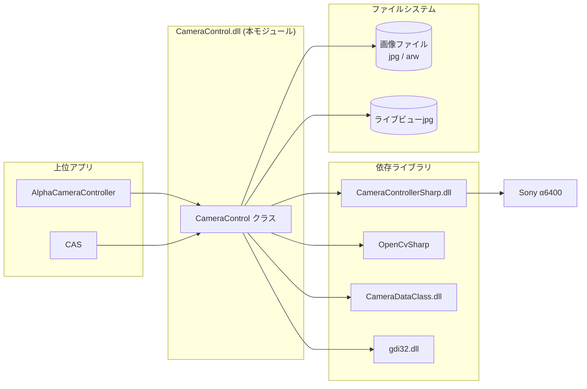
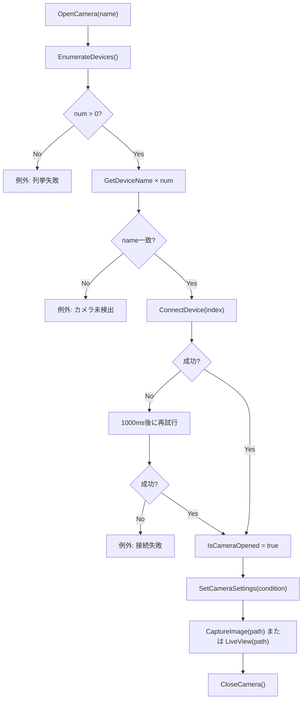
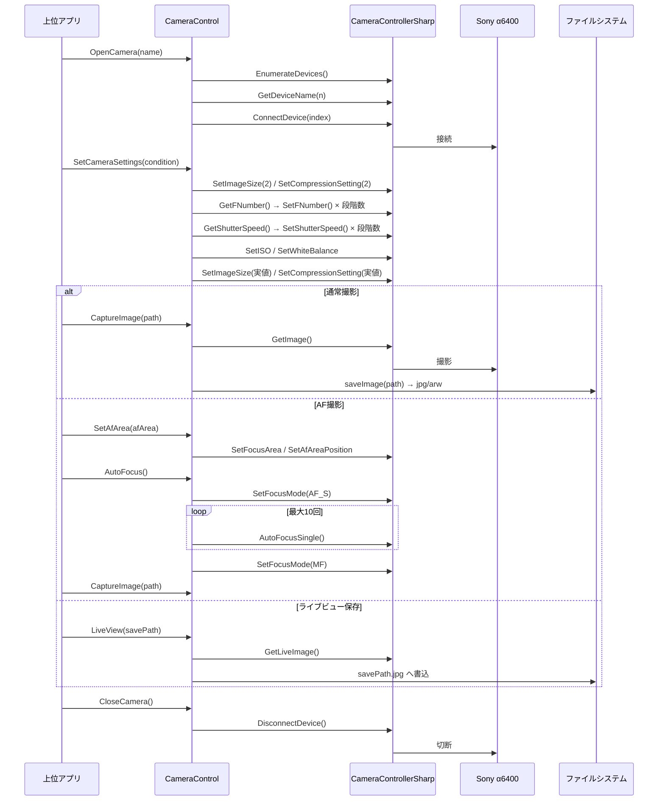

# CameraControl 詳細設計書

| 項目 | 内容 |
|------|------|
| プロジェクト名 | ColorAlignmentSoftware |
| システム名 | CameraControl |
| ドキュメント名 | 詳細設計書 |
| 作成日 | 2026/04/15 |
| 作成者 | システム分析チーム |
| バージョン | 0.1 |
| 関連資料 | CameraControl_要件定義書.md, CameraControl_基本設計書.md |

---

## 1. モジュール一覧

### 1-1. モジュール一覧表

| No. | モジュールID | モジュール名 | 分類 | 主責務 | 配置先 | 備考 |
|-----|--------------|--------------|------|--------|--------|------|
| 1 | MDL-CC-001 | CameraControl | 外部IF | Sony Alpha系カメラの接続・設定・撮影・AF・ライブビュー制御 | CameraControl/CameraControl.cs | CameraControllerSharpのラッパー。unsafeコードを含む |

### 1-2. モジュール命名規約

| 項目 | 規約 |
|------|------|
| 命名方針 | C#クラス名はPascalCase、メソッド名はPascalCase（動詞＋目的語形式）、フィールドはcamelCase |
| ID採番規則 | MDL-CC-001 から連番 |
| 分類コード | IF:外部IF |

---

## 2. モジュール配置図（モジュールの物理配置設計）

### 2-1. 物理配置図

### 2-2. 配置一覧

| 配置区分 | 配置先パス/ノード | 配置モジュール | 配置理由 |
|----------|-------------------|----------------|----------|
| 本体ライブラリ | CameraControl/ | CameraControl クラス | 上位アプリから動的ロードされるDLL |
| 外部SDK | 実行フォルダ | CameraControllerSharp.dll | カメラデバイス制御本体（CameraController.lib 静的リンク済み） |
| 画像解析ライブラリ | 実行フォルダ | OpenCvSharp.dll | ライブビュー画像解析（マーカー検出） |
| 共通データ定義 | 実行フォルダ | CameraDataClass.dll | ShootCondition/AfAreaSetting/MarkerPosition の型定義 |
| 出力先 | 上位アプリ指定パス | 画像ファイル (jpg/arw/ライブビューjpg) | 上位アプリが撮影結果を参照するため外部パスに出力 |

---

## 3. モジュール仕様オーバービュー

### 3-1. モジュール分類別サマリ

| 分類 | 対象モジュール | 処理概要 | 主なインタフェース |
|------|----------------|----------|--------------------|
| 外部IF | CameraControl | CameraControllerSharp SDKを抽象化し、接続・設定・撮影・AF・ライブビューの各機能を公開メソッドとして提供する | OpenCamera, CloseCamera, SetCameraSettings, SetFocusMode, CaptureImage, LiveView, AutoFocus, SetAfArea, GetLiveViewImage |

### 3-2. モジュール別オーバービュー

| モジュールID | モジュール名 | 分類 | 処理概要 | インタフェース名 | 引数 | 返り値 |
|--------------|--------------|------|----------|------------------|------|--------|
| MDL-CC-001 | CameraControl | 外部IF | カメラ接続・切断・撮影・設定変更・AF・ライブビュー制御 | OpenCamera | string name | なし（例外）|
| MDL-CC-001 | CameraControl | 外部IF | 〃 | CloseCamera | なし | なし（例外）|
| MDL-CC-001 | CameraControl | 外部IF | 〃 | SetCameraSettings | ShootCondition | bool |
| MDL-CC-001 | CameraControl | 外部IF | 〃 | SetFocusMode | string mode | bool |
| MDL-CC-001 | CameraControl | 外部IF | 〃 | CaptureImage | string path | なし（例外）|
| MDL-CC-001 | CameraControl | 外部IF | 〃 | LiveView | string savePath | なし |
| MDL-CC-001 | CameraControl | 外部IF | 〃 | AutoFocus | なし | bool |
| MDL-CC-001 | CameraControl | 外部IF | 〃 | SetAfArea | AfAreaSetting | bool |
| MDL-CC-001 | CameraControl | 外部IF | 〃 | GetLiveViewImage (×2オーバーロード) | int thresh [, int area / out List\<CvBlob\>] | ImageSource |

---

## 4. モジュール仕様（詳細）

### 4-1. MDL-CC-001: CameraControl

#### 4-1-1. 基本情報

| 項目 | 内容 |
|------|------|
| モジュールID | MDL-CC-001 |
| モジュール名 | CameraControl |
| 分類 | 外部IF |
| 呼出元 | AlphaCameraController（Reflectionで動的ロード）、CAS |
| 呼出先 | CameraControllerSharp (CCameraController)、OpenCvSharp、gdi32.dll、ファイルシステム |
| トランザクション | 無 |
| 再実行性 | 条件付き可（OpenCamera: 1回再試行、CaptureImage: 1回再撮影、AutoFocus: 最大10回試行） |

**公開フィールド一覧**

| フィールド名 | 型 | 初期値 | 説明 |
|--------------|----|--------|------|
| IsCameraOpened | bool | false | カメラ接続中フラグ。OpenCamera成功でtrue、CloseCamera後にfalse |
| appliPath | string | null | ライブラリ配置パス（現行実装では参照されていない） |

#### 4-1-2. 処理フロー（接続〜撮影の主フロー）

#### 4-1-3. 処理手順（SetCameraSettings の設定順序）

| 手順No. | 処理内容 | 入力 | 出力 | 操作対象 | 備考 |
|---------|----------|------|------|----------|------|
| 1 | 画像サイズをダミー値(2)に設定 | 固定値 2 | カメラ設定 | m_Camera.SetImageSize | 中間撮影の前提条件として先行設定 |
| 2 | 圧縮形式をダミー値(2)に設定 | 固定値 2 | カメラ設定 | m_Camera.SetCompressionSetting | 同上 |
| 3 | 現在のF値取得 | なし | 現在F値文字列 | m_Camera.GetFNumber | getFnumberOrderの入力値 |
| 4 | F値を目標値まで段階変更 | 現在F値→目標F値 | カメラ設定 | m_Camera.SetFNumber | 10ステップごとに中間撮影を実施して安定化 |
| 5 | 現在のシャッタースピード取得 | なし | 現在SS文字列 | m_Camera.GetShutterSpeed | getShutterOrderの入力値 |
| 6 | シャッタースピードを目標値まで段階変更 | 現在SS→目標SS | カメラ設定 | m_Camera.SetShutterSpeed | "または"形式表記の正規化あり |
| 7 | ISO感度を直値設定 | condition.ISO | カメラ設定 | m_Camera.SetISO | 段階変更なし |
| 8 | ホワイトバランスを直値設定 | condition.WB | カメラ設定 | m_Camera.SetWhiteBalance | 段階変更なし |
| 9 | 画像サイズを実値に設定 | condition.ImageSize | カメラ設定 | m_Camera.SetImageSize | ダミー設定を正値で上書き |
| 10 | 圧縮形式を実値に設定 | condition.CompressionType | カメラ設定 | m_Camera.SetCompressionSetting | ダミー設定を正値で上書き |

#### 4-1-4. 操作対象仕様（画面、テーブル、ファイル）

| 対象種別 | 対象名 | 操作内容 | 操作タイミング | 主キー/識別子 | 備考 |
|----------|--------|----------|----------------|---------------|------|
| 外部IF | Sony Alpha Camera | 接続/切断/設定/撮影/AF/ライブビュー | 各メソッド呼出時 | デバイスインデックス | CameraControllerSharp経由 |
| ファイル | 画像ファイル (jpg/arw) | 出力 | CaptureImage実行時 | ImgPath | 拡張子はカメラ圧縮設定から自動決定 |
| ファイル | ライブビューjpg | 出力 | LiveView実行時 | savePath + ".jpg" | JPEG固定 |

#### 4-1-5. インタフェース仕様（引数・返り値）

**公開メソッド一覧**

| No. | メソッド名 | シグネチャ | 機能ID |
|-----|------------|-----------|--------|
| 1 | OpenCamera | `public unsafe void OpenCamera(string name)` | CC-F01 |
| 2 | CloseCamera | `public unsafe void CloseCamera()` | CC-F02 |
| 3 | CaptureImage | `public unsafe void CaptureImage(string path)` | CC-F03 |
| 4 | SetCameraSettings | `public unsafe bool SetCameraSettings(ShootCondition condition)` | CC-F04 |
| 5 | SetFocusMode | `public unsafe bool SetFocusMode(string mode)` | CC-F05 |
| 6 | AutoFocus | `public bool AutoFocus()` | CC-F06 |
| 7 | SetAfArea | `public unsafe bool SetAfArea(AfAreaSetting afArea)` | CC-F07 |
| 8 | GetLiveViewImage (マーカー位置版) | `public unsafe ImageSource GetLiveViewImage(int thresh, int area, out MarkerPosition marker)` | CC-F08 |
| 9 | GetLiveViewImage (ブロブリスト版) | `public unsafe ImageSource GetLiveViewImage(int thresh, out List<CvBlob> lstMarkers)` | CC-F08 |
| 10 | LiveView | `public unsafe void LiveView(string savePath)` | CC-F09 |

#### 4-1-6. 例外処理仕様

| No. | 例外/エラー条件 | 検知方法 | 対応内容 | ユーザー通知 | ログ出力 | リトライ/継続可否 |
|-----|------------------|----------|----------|--------------|----------|------------------|
| 1 | デバイス列挙失敗（EnumerateDevices=0） | 戻り値判定 | 例外送出 | 呼出元でMessageBox表示 | なし | 不可 |
| 2 | デバイス名取得失敗 | 戻り値判定 | 例外送出 | 呼出元でMessageBox表示 | なし | 不可 |
| 3 | 指定カメラ名が見つからない | listインデックス超過 | 例外送出 | 呼出元でMessageBox表示 | なし | 不可 |
| 4 | カメラ接続失敗（ConnectDevice）| 戻り値判定 | 1000ms後に1回再試行、再失敗で例外送出 | 呼出元でMessageBox表示 | なし | 条件付き可（1回）|
| 5 | カメラ切断失敗（DisconnectDevice）| 戻り値判定 | 例外送出 | 呼出元で処理 | なし | 不可 |
| 6 | 撮影失敗（GetImage）| 戻り値判定 | 2000ms後に1回再撮影、再失敗で例外送出 | 呼出元でMessageBox表示 | なし | 条件付き可（1回）|
| 7 | 各カメラ設定API失敗 | 戻り値判定 | 即座に例外送出 | 呼出元で処理 | なし | 不可 |
| 8 | F値・SS が定義値リスト外 | 線形探索で not found | 例外送出（値を含むメッセージ） | 呼出元で処理 | なし | 不可 |
| 9 | AF_S設定失敗 / AF10回連続失敗 / MF復帰失敗 | 戻り値判定・ループ終了 | 例外送出 | 呼出元で処理 | なし | 条件付き可（AF: 最大10回）|
| 10 | AFエリア種別不正 | 値検証 | 例外送出 | 呼出元で処理 | なし | 不可 |
| 11 | AFエリア座標範囲外 | 境界値比較 | 例外送出（許容範囲をメッセージに含む） | 呼出元で処理 | なし | 不可 |
| 12 | ライブビュー取得失敗（GetLiveImage）| 戻り値判定・例外捕捉 | サイレントに return または null返却 | 通知なし | なし | 不可（スキップ）|
| 13 | ライブビューjpg書込失敗 | 例外捕捉 | catch で握り潰し（ファイル書込エラーを無視）| 通知なし | なし | 不可（スキップ）|
| 14 | 画像圧縮形式が不明値 | 0x02/0x03/0x04/0x10以外 | 例外送出 | 呼出元で処理 | なし | 不可 |

#### 4-1-7. ログ仕様

| ログ種別 | 出力条件 | 出力項目 | 保持期間 | マスキング方針 |
|----------|----------|----------|----------|----------------|
| 該当なし | 専用ログ実装なし。エラーは例外として上位へ伝播 | - | - | - |

---

## 5. コード仕様

### 5-1. コード一覧

**F値定義リスト**（getFnumberOrder で使用。この順序で段階変更する）

| No. | コード値 | 備考 |
|-----|----------|------|
| 1 | F2.8 | 最小値（最開放）|
| 2 | F3.2 | |
| 3 | F3.5 | |
| 4 | F4.0 | |
| 5 | F4.5 | |
| 6 | F5.0 | |
| 7 | F5.6 | |
| 8 | F6.3 | |
| 9 | F7.1 | |
| 10 | F8.0 | |
| 11 | F9.0 | |
| 12 | F10 | |
| 13 | F11 | |
| 14 | F13 | |
| 15 | F14 | |
| 16 | F16 | |
| 17 | F18 | |
| 18 | F20 | |
| 19 | F22 | 最大値（最絞り）|

**シャッタースピード定義リスト**（getShutterOrder で使用）

| No. | コード値 | No. | コード値 | No. | コード値 |
|-----|----------|-----|----------|-----|----------|
| 1 | 1/8000 | 21 | 1/80 | 41 | 1.6" |
| 2 | 1/6400 | 22 | 1/60 | 42 | 2" |
| 3 | 1/5000 | 23 | 1/50 | 43 | 2.5" |
| 4 | 1/4000 | 24 | 1/40 | 44 | 3.2" |
| 5 | 1/3200 | 25 | 1/30 | 45 | 4" |
| 6 | 1/2500 | 26 | 1/25 | 46 | 5" |
| 7 | 1/2000 | 27 | 1/20 | 47 | 6" |
| 8 | 1/1600 | 28 | 1/15 | 48 | 8" |
| 9 | 1/1250 | 29 | 1/13 | 49 | 10" |
| 10 | 1/1000 | 30 | 1/10 | 50 | 13" |
| 11 | 1/800 | 31 | 1/8 | 51 | 15" |
| 12 | 1/640 | 32 | 1/6 | 52 | 20" |
| 13 | 1/500 | 33 | 1/5 | 53 | 25" |
| 14 | 1/400 | 34 | 1/4 | 54 | 30" |
| 15 | 1/320 | 35 | 1/3 | 55 | BULB |
| 16 | 1/250 | 36 | 0.4" | | |
| 17 | 1/200 | 37 | 0.5" | | |
| 18 | 1/160 | 38 | 0.6" | | |
| 19 | 1/125 | 39 | 0.8" | | |
| 20 | 1/100 | 40 | 1" | | |

> 備考: getShutterOrder ではカメラ取得値・目標値が秒表記（"/"を含まない場合）に自動的に `"` を付加して正規化する。

**ISO感度定義リスト**（getISOOrder で定義。現行の SetCameraSettings では直値設定のため未使用）

| No. | コード値 | No. | コード値 | No. | コード値 |
|-----|----------|-----|----------|-----|----------|
| 1 | AUTO | 13 | 640 | 25 | 10000 |
| 2 | 50 | 14 | 800 | 26 | 12800 |
| 3 | 64 | 15 | 1000 | 27 | 16000 |
| 4 | 80 | 16 | 1250 | 28 | 20000 |
| 5 | 100 | 17 | 1600 | 29 | 25600 |
| 6 | 125 | 18 | 2000 | 30 | 32000 |
| 7 | 160 | 19 | 2500 | 31 | 40000 |
| 8 | 200 | 20 | 3200 | 32 | 51200 |
| 9 | 250 | 21 | 4000 | 33 | 64000 |
| 10 | 320 | 22 | 5000 | 34 | 80000 |
| 11 | 400 | 23 | 6400 | 35 | 102400 |
| 12 | 500 | 24 | 8000 | | |

**圧縮形式コード**

| コード名称 | ShootCondition.CompressionType | SDK CompressionSetting 戻り値 | saveImage 拡張子 | 備考 |
|------------|-------------------------------|------------------------------|-----------------|------|
| RAW | 16（0x10）| 0x10 | .arw | 既定値 |
| JPG (FINE) | 3 | 0x03 | .jpg | |
| JPG (STD) | 2 | 0x02 | .jpg | |
| JPG (XFINE) | 4 | 0x04 | .jpg | |

**フォーカスモードコード**

| コード値 | 説明 | CameraControl での利用 |
|----------|------|------------------------|
| MF | マニュアルフォーカス | OpenCamera後の初期化（上位アプリから）、AutoFocus後に復帰設定 |
| AF_S | シングルAF | AutoFocus実行前に設定 |
| close_up | 接写AF | getShutterOrder配列定義のみ（呼出元次第）|
| AF_C | コンティニュアスAF | 配列定義のみ |
| AF_A | 自動AF | 配列定義のみ |
| DMF | ダイレクトMF | 配列定義のみ |
| MF_R | MF補助 | 配列定義のみ |
| AF_D | 被写体追従AF | 配列定義のみ |
| PF | プログラムフォーカス | 配列定義のみ |

**AFエリア種別コード**

| コード値 | 説明 | X 許容範囲 | Y 許容範囲 |
|----------|------|-----------|-----------|
| Wide | 全画面AF | 座標設定なし | 座標設定なし |
| Zone | ゾーンAF | 座標設定なし | 座標設定なし |
| Center | 中央AF | 座標設定なし | 座標設定なし |
| FlexibleSpotS | フレキシブルスポット(小) | 65〜574 | 53〜374 |
| FlexibleSpotM | フレキシブルスポット(中) | 79〜560 | 63〜364 |
| FlexibleSpotL | フレキシブルスポット(大) | 94〜545 | 73〜354 |

### 5-2. コード定義ルール

| 項目 | ルール |
|------|--------|
| コード値体系 | CameraControllerSharp SDK仕様および ShootCondition のフィールド定義値に準拠 |
| 重複禁止範囲 | 同一コード名称内 |
| 廃止時の扱い | 互換性維持のため未使用値も残置可 |

---

## 6. メッセージ仕様

### 6-1. メッセージ一覧

| メッセージID | 種別 | メッセージ文字列 | 発生箇所 | 対応アクション |
|--------------|------|-----------------|----------|----------------|
| MSG-CC-E-001 | 異常通知 | Failed to get the number of camera connections. | OpenCamera | 呼出元で表示・終了 |
| MSG-CC-E-002 | 異常通知 | Failed to get the camera name. | OpenCamera | 呼出元で表示・終了 |
| MSG-CC-E-003 | 異常通知 | The specified camera ({name}) was not found. | OpenCamera | 呼出元で表示・終了 |
| MSG-CC-E-004 | 異常通知 | Failed to connect with the camera. | OpenCamera | 呼出元で表示・終了 |
| MSG-CC-E-005 | 異常通知 | Failed to disconnect the camera. | CloseCamera | 呼出元で処理 |
| MSG-CC-E-006 | 異常通知 | Failed to set the image size. | SetCameraSettings | 呼出元で表示・終了 |
| MSG-CC-E-007 | 異常通知 | Failed to set the image compression format. | SetCameraSettings | 呼出元で表示・終了 |
| MSG-CC-E-008 | 異常通知 | Failed to get the F-number. | SetCameraSettings | 呼出元で表示・終了 |
| MSG-CC-E-009 | 異常通知 | The current F-number is wrong. [{value}] | SetCameraSettings (getFnumberOrder) | 呼出元で表示・終了 |
| MSG-CC-E-010 | 異常通知 | The target F-number is wrong. [{value}] | SetCameraSettings (getFnumberOrder) | 呼出元で表示・終了 |
| MSG-CC-E-011 | 異常通知 | Failed to set the F-number. | SetCameraSettings | 呼出元で表示・終了 |
| MSG-CC-E-012 | 異常通知 | Failed to get the Shutter speed. | SetCameraSettings | 呼出元で表示・終了 |
| MSG-CC-E-013 | 異常通知 | The current Shutter speed is wrong. [{value}] | SetCameraSettings (getShutterOrder) | 呼出元で表示・終了 |
| MSG-CC-E-014 | 異常通知 | The target Shutter speed is wrong. [{value}] | SetCameraSettings (getShutterOrder) | 呼出元で表示・終了 |
| MSG-CC-E-015 | 異常通知 | Failed to set the Shutter speed. | SetCameraSettings | 呼出元で表示・終了 |
| MSG-CC-E-016 | 異常通知 | Failed to set the ISO sensitivity. | SetCameraSettings | 呼出元で表示・終了 |
| MSG-CC-E-017 | 異常通知 | Failed to set the white balance. | SetCameraSettings | 呼出元で表示・終了 |
| MSG-CC-E-018 | 異常通知 | Shooting failed. | CaptureImage | 呼出元で表示・終了 |
| MSG-CC-E-019 | 異常通知 | Failed to get the image compression format. | saveImage | 呼出元で表示・終了 |
| MSG-CC-E-020 | 異常通知 | The image compression format is wrong. | saveImage | 呼出元で表示・終了 |
| MSG-CC-E-021 | 異常通知 | Failed to set the focus mode. | SetFocusMode | 呼出元で表示・終了 |
| MSG-CC-E-022 | 異常通知 | Failed to set the focus mode to AF_S. | AutoFocus | 呼出元で処理 |
| MSG-CC-E-023 | 異常通知 | Failed to execute AF_S. | AutoFocus | 呼出元で処理 |
| MSG-CC-E-024 | 異常通知 | Failed to set the focus mode to MF. | AutoFocus | 呼出元で処理 |
| MSG-CC-E-025 | 異常通知 | The target AF area type is wrong. | SetAfArea | 呼出元で処理 |
| MSG-CC-E-026 | 異常通知 | Failed to set the AF area type. | SetAfArea | 呼出元で処理 |
| MSG-CC-E-027 | 異常通知 | The target AF area is out of settable range. x:{min}-{max}, y:{min}-{max} | SetAfArea | 呼出元で処理 |
| MSG-CC-E-028 | 異常通知 | Failed to set the AF area. | SetAfArea | 呼出元で処理 |

### 6-2. メッセージ運用ルール

| 項目 | ルール |
|------|--------|
| ID採番 | MSG-CC-E-連番（現行はすべて異常通知）|
| 多言語対応 | 無。英語固定 |
| プレースホルダ | {name}=カメラ名文字列, {value}=不正コード値文字列, {min}/{max}=数値 |
| 通知先 | すべて Exception として上位アプリへ送出し、上位側で MessageBox 表示 |

---

## 7. 関連システムインタフェース仕様

### 7-1. インタフェース一覧

| IF ID | I/O | インタフェースシステム名 | インタフェースファイル名 | インタフェースタイミング | インタフェース方法 | インタフェースエラー処理方法 | インタフェース処理のリラン定義 | インタフェース処理のロギングインタフェース |
|------|-----|--------------------------|--------------------------|--------------------------|--------------------|------------------------------|--------------------------------|------------------------------------------|
| IF-CC-001 | OUT | CameraControllerSharp | CCameraController (DLL) | 各メソッド呼出時 | DLL P/Invoke (C++/CLI) | 戻り値 false または例外 → 例外として上位へ伝播 | OpenCamera: 1回再試行、AutoFocus: 最大10回、CaptureImage: 1回再撮影 | なし |
| IF-CC-002 | IN/OUT | OpenCvSharp | OpenCvSharp.dll | GetLiveViewImage呼出時 | NuGetライブラリ呼出 | 解析失敗時は null 返却または空リスト | なし | なし |
| IF-CC-003 | OUT | Windows GDI | gdi32.dll | GetLiveViewImage呼出後 | P/Invoke | 失敗時は特に処理なし | なし | なし |
| IF-CC-004 | OUT | ファイルシステム | 上位アプリ指定パス | CaptureImage/LiveView実行後 | BinaryWriter / FileStream | 書込例外: CaptureImageは上位へ伝播、LiveViewはcatchで握り潰し | なし | なし |

### 7-2. インタフェースデータ項目定義

**IF-CC-001: CameraControllerSharp API 主要メソッド**

| IF ID | メソッド名 | 引数 | 返り値型 | 説明 |
|------|------------|------|----------|------|
| IF-CC-001 | EnumerateDevices() | なし | int | 接続可能デバイス数 |
| IF-CC-001 | GetDeviceName(uint n, char* p, uint len) | インデックス, バッファ | bool | デバイス名を char バッファに書込 |
| IF-CC-001 | ConnectDevice(uint index) | デバイスインデックス | bool | 指定インデックスのカメラへ接続 |
| IF-CC-001 | DisconnectDevice() | なし | bool | 接続中カメラを切断 |
| IF-CC-001 | GetImage(byte** pData, uint* size, bool transfer) | バッファポインタ, サイズポインタ, 転送フラグ | bool | 静止画像データ取得 |
| IF-CC-001 | SetImageSize(ImageSizeValue size) | 画像サイズ列挙値 | bool | 画像サイズ設定 |
| IF-CC-001 | SetCompressionSetting(CompressionSetting s) | 圧縮形式列挙値 | bool | 圧縮形式設定 |
| IF-CC-001 | GetCompressionSetting(uint* pCom) | 結果バッファ | bool | 現在の圧縮形式取得 |
| IF-CC-001 | GetFNumber(sbyte* pStr, uint len) | バッファポインタ, サイズ | bool | 現在のF値（ASCII文字列）取得 |
| IF-CC-001 | SetFNumber(sbyte* pStr) | F値文字列 | bool | F値設定 |
| IF-CC-001 | GetShutterSpeed(sbyte* pStr, uint len) | バッファポインタ, サイズ | bool | 現在のシャッタースピード取得 |
| IF-CC-001 | SetShutterSpeed(sbyte* pStr) | SS文字列 | bool | シャッタースピード設定 |
| IF-CC-001 | SetISO(sbyte* pStr) | ISO値文字列 | bool | ISO感度設定 |
| IF-CC-001 | SetWhiteBalance(sbyte* pStr) | WB値文字列 | bool | ホワイトバランス設定 |
| IF-CC-001 | SetFocusMode(sbyte* pStr) | フォーカスモード文字列 | bool | フォーカスモード設定 |
| IF-CC-001 | AutoFocusSingle() | なし | bool | AF-S実行 |
| IF-CC-001 | SetFocusArea(sbyte* pStr) | AFエリア種別文字列 | bool | AFエリア種別設定 |
| IF-CC-001 | SetAfAreaPosition(ushort x, ushort y) | X座標, Y座標 | bool | FlexibleSpotのAFエリア座標設定 |
| IF-CC-001 | GetLiveImage(byte** pData, uint* size) | バッファポインタ, サイズポインタ | bool | ライブビュー画像データ取得 |

### 7-3. インタフェース処理シーケンス

---

## 8. メソッド仕様

### 8-1. OpenCamera(string name)

| 項目 | 内容 |
|------|------|
| シグネチャ | `public unsafe void OpenCamera(string name)` |
| 概要 | 接続可能なカメラデバイスを列挙し、指定名と一致するデバイスに接続する。接続失敗時は 1000ms 後に 1 回再試行する |
| 機能ID | CC-F01 |
| 事前条件 | CameraControllerSharp.dll が実行環境に存在すること |

引数

| No. | 引数名 | 型 | 必須 | 説明 | バリデーション |
|-----|--------|----|------|------|----------------|
| 1 | name | `string` | Y | 接続対象カメラのデバイス名 | EnumerateDevices 列挙結果に存在すること |

返り値: なし（void）

処理概要

| 手順 | 内容 |
|------|------|
| 1 | `m_Camera = new CCameraController()` で SDKインスタンス生成 |
| 2 | `m_Camera.EnumerateDevices()` でデバイス数取得。0件なら MSG-CC-E-001 を例外送出 |
| 3 | `m_Camera.GetDeviceName(n, p, len)` をループしてデバイス名リスト構築 |
| 4 | name と一致するインデックスを線形探索。不一致なら MSG-CC-E-003 を例外送出 |
| 5 | `m_Camera.ConnectDevice(index)` で接続。失敗時は 1000ms 後に再試行。再失敗で MSG-CC-E-004 を例外送出 |
| 6 | `IsCameraOpened = true` を設定 |

---

### 8-2. CloseCamera()

| 項目 | 内容 |
|------|------|
| シグネチャ | `public unsafe void CloseCamera()` |
| 概要 | カメラが接続中（IsCameraOpened = true）の場合のみ切断処理を行い、IsCameraOpened を false に設定する |
| 機能ID | CC-F02 |
| 事前条件 | なし（IsCameraOpened = false の場合は何もしない）|

引数: なし  
返り値: なし（void）

処理概要

| 手順 | 内容 |
|------|------|
| 1 | `IsCameraOpened == true` のみ処理 |
| 2 | `m_Camera.DisconnectDevice()` で切断。失敗時は MSG-CC-E-005 を例外送出 |
| 3 | `IsCameraOpened = false` を設定 |

---

### 8-3. SetCameraSettings(ShootCondition condition)

| 項目 | 内容 |
|------|------|
| シグネチャ | `public unsafe bool SetCameraSettings(ShootCondition condition)` |
| 概要 | 撮影条件（F値・シャッタースピード・ISO・WB・画像サイズ・圧縮形式）をカメラへ反映する。F値とシャッタースピードは現在値から目標値まで段階的に変更し、10ステップごとに中間撮影を挟む |
| 機能ID | CC-F04 |
| 事前条件 | カメラ接続済み（IsCameraOpened = true）|

引数

| No. | 引数名 | 型 | 必須 | 説明 | バリデーション |
|-----|--------|----|------|------|----------------|
| 1 | condition | `ShootCondition` | Y | 設定する撮影条件 | 各値がカメラ対応範囲内であること |

返り値

| 型 | 説明 |
|----|------|
| `bool` | 成功時 true（失敗時は例外送出） |

設定順序（処理手順は 4-1-3 を参照）

| 設定項目 | API | 段階変更 |
|----------|-----|---------|
| 画像サイズ（ダミー=2） | SetImageSize | 不要 |
| 圧縮形式（ダミー=2） | SetCompressionSetting | 不要 |
| F値（FNumber） | GetFNumber → SetFNumber × N | あり（10ステップごとに中間撮影）|
| シャッタースピード（Shutter） | GetShutterSpeed → SetShutterSpeed × N | あり |
| ISO感度 | SetISO | なし |
| ホワイトバランス | SetWhiteBalance | なし |
| 画像サイズ（実値） | SetImageSize | なし |
| 圧縮形式（実値） | SetCompressionSetting | なし |

---

### 8-4. SetFocusMode(string mode)

| 項目 | 内容 |
|------|------|
| シグネチャ | `public unsafe bool SetFocusMode(string mode)` |
| 概要 | 指定文字列のフォーカスモードをカメラへ設定する |
| 機能ID | CC-F05 |
| 事前条件 | カメラ接続済み |

引数

| No. | 引数名 | 型 | 必須 | 説明 | バリデーション |
|-----|--------|----|------|------|----------------|
| 1 | mode | `string` | Y | フォーカスモード文字列（「フォーカスモードコード」を参照）| SDK定義値であること |

返り値

| 型 | 説明 |
|----|------|
| `bool` | 成功時 true（失敗時は MSG-CC-E-021 を例外送出）|

---

### 8-5. CaptureImage(string path)

| 項目 | 内容 |
|------|------|
| シグネチャ | `public unsafe void CaptureImage(string path)` |
| 概要 | カメラから静止画像データを取得して path に保存する。取得失敗時は 2000ms 後に 1 回再撮影する。圧縮形式を自動判定して拡張子（.jpg または .arw）を付加する |
| 機能ID | CC-F03 |
| 事前条件 | カメラ接続済み、SetCameraSettings 適用済み |

引数

| No. | 引数名 | 型 | 必須 | 説明 | バリデーション |
|-----|--------|----|------|------|----------------|
| 1 | path | `string` | Y | 保存先パス（拡張子なし）| 書込可能であること |

返り値: なし（void）

処理概要

| 手順 | 内容 |
|------|------|
| 1 | `m_Camera.GetImage(pData, size, true)` で画像バッファ取得。失敗時は 2000ms 後に再試行、再失敗で MSG-CC-E-018 |
| 2 | `Marshal.Copy(ptr, image_data, 0, size)` でマネージ配列へコピー |
| 3 | `Marshal.FreeCoTaskMem(ptr)` でアンマネージメモリ解放 |
| 4 | `saveImage(image_data, path)` で圧縮形式判定・ファイル保存 |

---

### 8-6. LiveView(string savePath)

| 項目 | 内容 |
|------|------|
| シグネチャ | `public unsafe void LiveView(string savePath)` |
| 概要 | ライブ画像を取得して `{savePath}.jpg` に保存する。取得失敗および書込失敗はいずれもサイレントに無処理で返る（例外を外部に送出しない）|
| 機能ID | CC-F09 |
| 事前条件 | カメラ接続済み |

引数

| No. | 引数名 | 型 | 必須 | 説明 | バリデーション |
|-----|--------|----|------|------|----------------|
| 1 | savePath | `string` | Y | 保存先パス（拡張子なし）。".jpg" が付加される | 書込可能であること（失敗時はスキップ）|

返り値: なし（void）

処理概要

| 手順 | 内容 |
|------|------|
| 1 | `m_Camera.GetLiveImage(pData, size)` でライブ画像取得。失敗時は return |
| 2 | バッファ先頭 8 バイトから offset(4bytes) と size(4bytes) を読取 |
| 3 | `FileStream` で `{savePath}.jpg` へオフセット位置から size バイトを書込 |
| 4 | 書込例外は catch{} で握り潰す |

---

### 8-7. AutoFocus()

| 項目 | 内容 |
|------|------|
| シグネチャ | `public bool AutoFocus()` |
| 概要 | フォーカスモードを AF_S に切り替えてオートフォーカスを実行し（最大10回リトライ）、完了後 MF に復帰する |
| 機能ID | CC-F06 |
| 事前条件 | カメラ接続済み |

引数: なし

返り値

| 型 | 説明 |
|----|------|
| `bool` | 成功時 true（失敗時は各ステップで例外送出）|

処理概要

| 手順 | 内容 |
|------|------|
| 1 | `SetFocusMode("AF_S")` — 失敗時 MSG-CC-E-022 |
| 2 | 1000ms 待機 |
| 3 | `m_Camera.AutoFocusSingle()` を最大10回試行（成功で break、各試行間 1000ms 待機）|
| 4 | 10回失敗時 MSG-CC-E-023 |
| 5 | 1000ms 待機後、`SetFocusMode("MF")` — 失敗時 MSG-CC-E-024 |
| 6 | 1000ms 待機後、true を返す |

---

### 8-8. SetAfArea(AfAreaSetting afArea)

| 項目 | 内容 |
|------|------|
| シグネチャ | `public unsafe bool SetAfArea(AfAreaSetting afArea)` |
| 概要 | AFエリア種別 (`focusAreaType`) を設定する。FlexibleSpot 系の場合はさらに座標を設定する。種別不正・座標範囲外は例外を送出する |
| 機能ID | CC-F07 |
| 事前条件 | カメラ接続済み |

引数

| No. | 引数名 | 型 | 必須 | 説明 | バリデーション |
|-----|--------|----|------|------|----------------|
| 1 | afArea | `AfAreaSetting` | Y | AFエリア設定（種別・座標）| focusAreaType が「AFエリア種別コード」に存在すること。FlexibleSpot の場合は座標が許容範囲内であること |

返り値

| 型 | 説明 |
|----|------|
| `bool` | 成功時 true（失敗時は例外送出）|

処理概要

| 手順 | 内容 |
|------|------|
| 1 | focusAreaType が定義値（Wide/Zone/Center/FlexibleSpotS/M/L）以外なら MSG-CC-E-025 |
| 2 | `m_Camera.SetFocusArea(focusAreaType)` — 失敗時 MSG-CC-E-026 |
| 3 | Wide/Zone/Center の場合はここで return true |
| 4 | FlexibleSpot 各種の X/Y 境界値テーブルで座標を検証。範囲外なら MSG-CC-E-027 |
| 5 | `m_Camera.SetAfAreaPosition(focusAreaX, focusAreaY)` — 失敗時 MSG-CC-E-028 |

---

### 8-9. GetLiveViewImage(int thresh, int area, out MarkerPosition marker)

| 項目 | 内容 |
|------|------|
| シグネチャ | `public unsafe ImageSource GetLiveViewImage(int thresh, int area, out MarkerPosition marker)` |
| 概要 | ライブ画像を取得して Bitmap に変換し、OpenCvSharp で二値化・ブロブ抽出・マーカー検出を行い、UI 表示用 ImageSource とマーカー位置を返す。失敗時は null を返す |
| 機能ID | CC-F08 |
| 事前条件 | カメラ接続済み |

引数

| No. | 引数名 | 型 | 必須 | 説明 | バリデーション |
|-----|--------|----|------|------|----------------|
| 1 | thresh | `int` | Y | 二値化しきい値（0〜255）| 正の整数 |
| 2 | area | `int` | Y | フィルタ対象ブロブ面積（0=フィルタなし）| 0以上 |
| 3 | marker | `out MarkerPosition` | Y | 検出されたマーカーの4コーナー座標 | - |

返り値

| 型 | 説明 |
|----|------|
| `ImageSource` | UI 表示用 WPF ImageSource。マーカー外枠と重心座標を描画済み。取得失敗時は null |

処理概要

| 手順 | 内容 |
|------|------|
| 1 | `m_Camera.GetLiveImage()` で取得失敗時は null を返す |
| 2 | バッファから Bitmap へ変換 |
| 3 | `searchMaker(bmp, thresh, area, out lstBlob)` でブロブ抽出 |
| 4 | ブロブに黄色矩形と重心座標テキストを描画 |
| 5 | `calcDistance(...)` で4コーナー分類とマーカー位置算出 |
| 6 | `bmp.GetHbitmap()` → `CreateBitmapSourceFromHBitmap` → `DeleteObject(hbitmap)` で ImageSource 生成 |

---

### 8-10. GetLiveViewImage(int thresh, out List\<CvBlob\> lstMarkers)

| 項目 | 内容 |
|------|------|
| シグネチャ | `public unsafe ImageSource GetLiveViewImage(int thresh, out List<CvBlob> lstMarkers)` |
| 概要 | ライブ画像を取得してブロブ抽出を行い、UI 表示用 ImageSource とブロブリストを返す。面積フィルタなし（area=0）で動作する。失敗時は null とを返す |
| 機能ID | CC-F08 |
| 事前条件 | カメラ接続済み |

引数

| No. | 引数名 | 型 | 必須 | 説明 | バリデーション |
|-----|--------|----|------|------|----------------|
| 1 | thresh | `int` | Y | 二値化しきい値（0〜255）| 正の整数 |
| 2 | lstMarkers | `out List<CvBlob>` | Y | 検出されたブロブのリスト | - |

返り値

| 型 | 説明 |
|----|------|
| `ImageSource` | UI 表示用 WPF ImageSource。8-9 版と同様のマーカー描画あり。取得失敗時は null |

---

### 8-11. （プライベート）getFnumberOrder(string current, string target)

| 項目 | 内容 |
|------|------|
| シグネチャ | `string[] getFnumberOrder(string current, string target)` |
| 概要 | F値の段階変更順序を返す。current から target まで F値定義リスト上の中間ステップを配列で返す。同値の場合は null を返す |

引数

| No. | 引数名 | 型 | 必須 | 説明 |
|-----|--------|----|------|------|
| 1 | current | `string` | Y | 現在の F値文字列 |
| 2 | target | `string` | Y | 目標の F値文字列 |

返り値

| 型 | 説明 |
|----|------|
| `string[]` | current の次から target までの F値順序列。同値時は null |

---

### 8-12. （プライベート）getShutterOrder(string current, string target)

| 項目 | 内容 |
|------|------|
| シグネチャ | `string[] getShutterOrder(string current, string target)` |
| 概要 | シャッタースピードの段階変更順序を返す。入力値が "/" も `"` も含まない場合は秒表記として `"` を付加して正規化してから照合する |

引数

| No. | 引数名 | 型 | 必須 | 説明 |
|-----|--------|----|------|------|
| 1 | current | `string` | Y | 現在のシャッタースピード文字列 |
| 2 | target | `string` | Y | 目標のシャッタースピード文字列 |

返り値

| 型 | 説明 |
|----|------|
| `string[]` | 段階変更順序列。同値時は null |

---

### 8-13. （プライベート）getISOOrder(string current, string target)

| 項目 | 内容 |
|------|------|
| シグネチャ | `string[] getISOOrder(string current, string target)` |
| 概要 | ISO感度の段階変更順序を返す。現行の SetCameraSettings では ISO は直値設定のため本メソッドは未使用（将来拡張用）|

引数・返り値は getFnumberOrder と同構造（IS感度定義リストを使用）。

---

### 8-14. （プライベート）saveImage(byte[] image_data, string path)

| 項目 | 内容 |
|------|------|
| シグネチャ | `private unsafe bool saveImage(byte[] image_data, string path)` |
| 概要 | image_data をファイルに保存する。カメラの現在圧縮設定（GetCompressionSetting）を読み取り、拡張子（.jpg または .arw）を自動決定する |

引数

| No. | 引数名 | 型 | 必須 | 説明 |
|-----|--------|----|------|------|
| 1 | image_data | `byte[]` | Y | 保存する画像バイト列 |
| 2 | path | `string` | Y | 保存先パス（拡張子なし）|

返り値

| 型 | 説明 |
|----|------|
| `bool` | 成功時 true |

拡張子判定表

| GetCompressionSetting 戻り値 | 拡張子 |
|-----------------------------|--------|
| 0x02 (STD), 0x03 (FINE), 0x04 (XFINE) | .jpg |
| 0x10 (RAW) | .arw |
| それ以外 | MSG-CC-E-020 を例外送出 |

---

### 8-15. （プライベート）searchMaker(Bitmap bmp, int thresh, int area, out List\<CvBlob\> lstBlob)

| 項目 | 内容 |
|------|------|
| シグネチャ | `private void searchMaker(Bitmap bmp, int thresh, int area, out List<CvBlob> lstBlob)` |
| 概要 | Bitmap を二値化してブロブ抽出し、アスペクト比が 0.5〜1.5（正方形に近い）ものをマーカー候補として返す |

引数

| No. | 引数名 | 型 | 必須 | 説明 |
|-----|--------|----|------|------|
| 1 | bmp | `Bitmap` | Y | ライブビュー画像 |
| 2 | thresh | `int` | Y | 二値化しきい値 |
| 3 | area | `int` | Y | 面積フィルタ（0=フィルタなし、>0の場合は±20%範囲）|
| 4 | lstBlob | `out List<CvBlob>` | Y | 検出されたブロブリスト |

返り値: なし（void）

---

### 8-16. （プライベート）calcDistance(...)

| 項目 | 内容 |
|------|------|
| シグネチャ | `private void calcDistance(List<CvBlob> lstBlob, Bitmap bmp, out double top, out double bottom, out double right, out double left, out MarkerPosition marker)` |
| 概要 | ブロブリストから4コーナー（左上・右上・左下・右下）を分類し、各辺の画素距離とマーカー座標を返す。ブロブ数が 4 でない場合はすべての out 値を 0 / 空で返す |

引数

| No. | 引数名 | 型 | 必須 | 説明 |
|-----|--------|----|------|------|
| 1 | lstBlob | `List<CvBlob>` | Y | 4ブロブのリスト |
| 2 | bmp | `Bitmap` | Y | 画像参照（幅・高さを使用）|
| 3 | top | `out double` | Y | 上辺（TopLeft–TopRight）の画素距離 |
| 4 | bottom | `out double` | Y | 下辺の画素距離 |
| 5 | right | `out double` | Y | 右辺の画素距離 |
| 6 | left | `out double` | Y | 左辺の画素距離 |
| 7 | marker | `out MarkerPosition` | Y | 4コーナーの座標（Coordinate 型）|

返り値: なし（void）

---

## 9. 変更履歴

| 版数 | 日付 | 変更者 | 変更内容 |
|------|------|--------|----------|
| 0.1 | 2026/04/15 | システム分析チーム | 新規作成 |

---

## 10. 記入ガイド（運用時に削除可）

- CameraControl.dll は AlphaCameraController から Reflection で動的ロードされる。配置漏れはロード時の致命エラーとなる。
- SetCameraSettings の F値・シャッター段階変更は、カメラの機械的動作安定化を目的とした実装である。10ステップごとの中間撮影も同様の意図による。
- GetLiveViewImage はUI表示専用。ライブビュー画像のファイル保存は LiveView メソッドを使用すること。
- saveImage の拡張子判定はカメラ側の実際の設定値（GetCompressionSetting）を参照するため、SetCameraSettings 後の CompressionType と一致しない場合がある点に留意。
- getISOOrder は定義されているが SetCameraSettings では ISO を直値設定しており現状は未呼出。ISO段階変更が必要になった場合は既存メソッドを活用可能。
