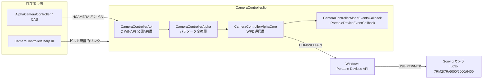
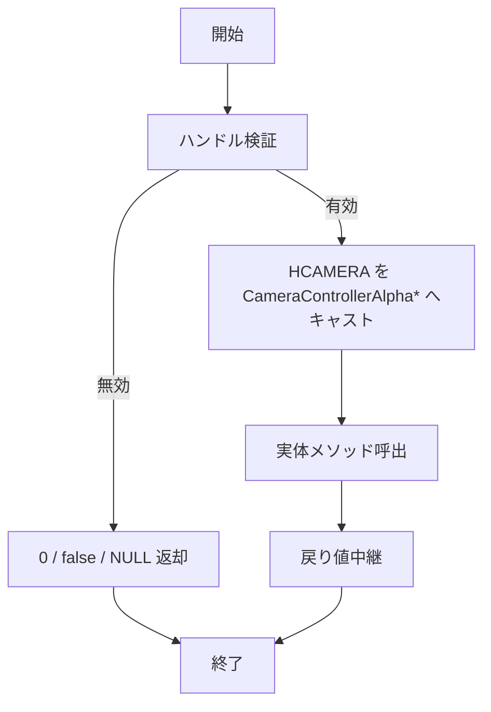
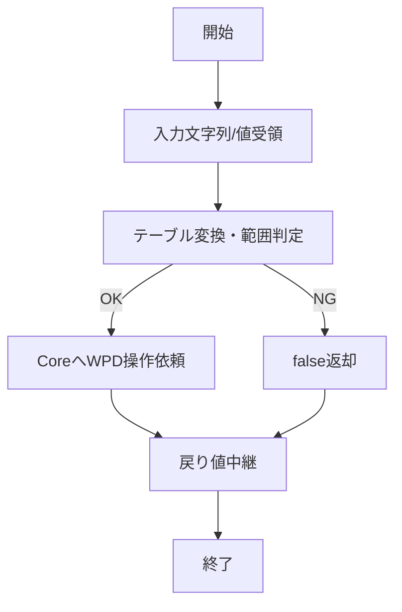
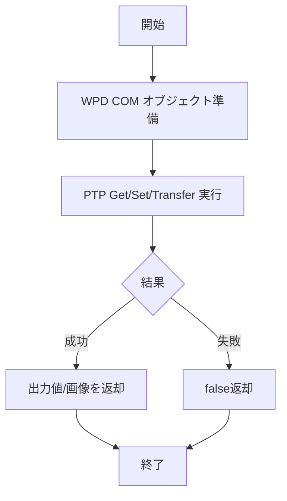
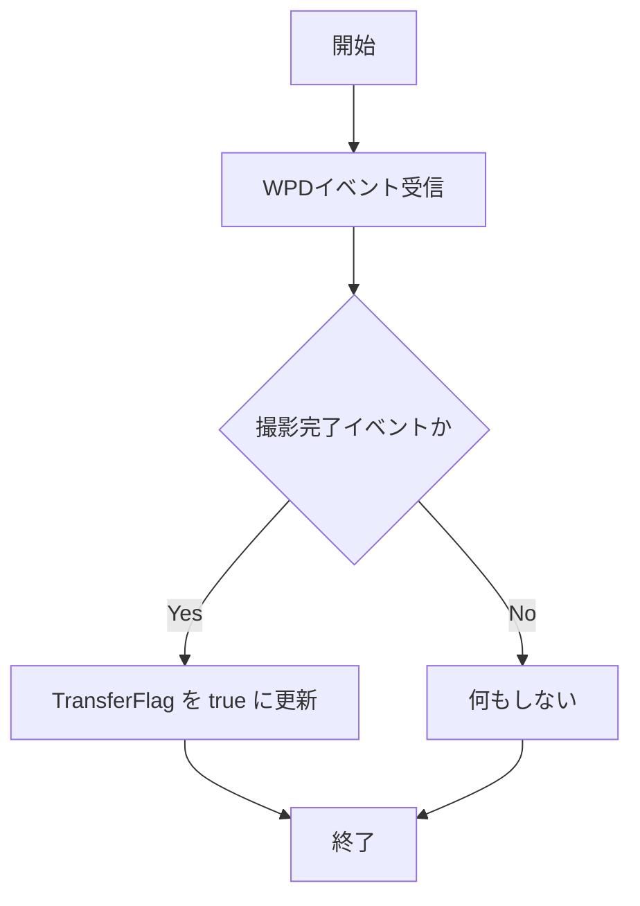
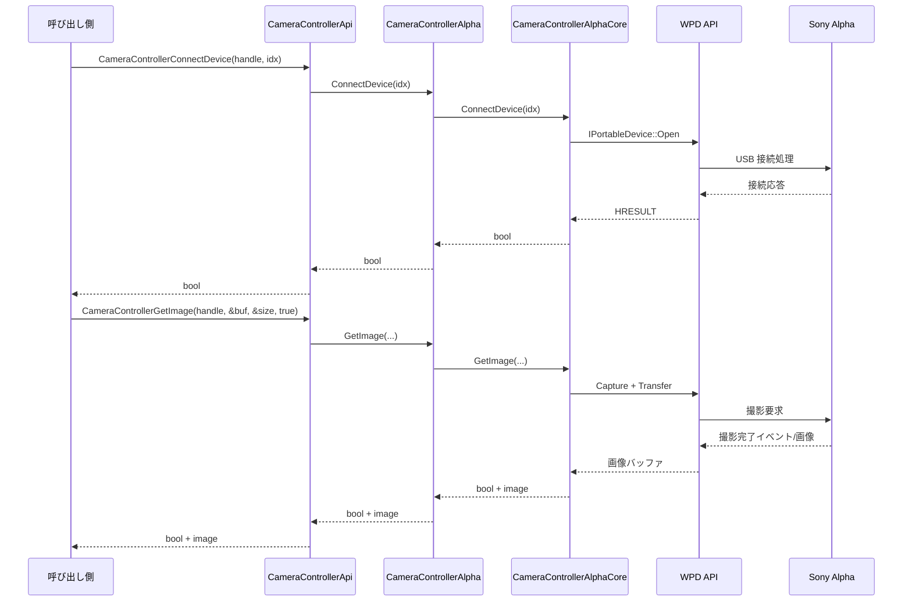

# CameraController.lib 詳細設計書

| 項目 | 内容 |
|------|------|
| プロジェクト名 | ColorAlignmentSoftware |
| システム名 | CameraController.lib |
| ドキュメント名 | 詳細設計書 |
| 作成日 | 2026/04/16 |
| 作成者 | システム分析チーム |
| バージョン | 0.1 |
| 関連資料 | CameraControllerLib_要件定義書.md, CameraControllerLib_基本設計書.md |

---

## 1. モジュール一覧

### 1-1. モジュール一覧表

| No. | モジュールID | モジュール名 | 分類 | 主責務 | 配置先 | 備考 |
|-----|--------------|--------------|------|--------|--------|------|
| 1 | MDL-CCLIB-001 | CameraControllerApi | IF | C WINAPI 公開 API を提供し、HCAMERA ハンドル経由で処理を委譲する | CameraControllerApi.hpp / CameraControllerApi.cpp | 外部公開窓口 |
| 2 | MDL-CCLIB-002 | CameraControllerAlpha | ビジネスロジック | 文字列パラメータと PTP 値の変換、モデル別制約反映、処理オーケストレーション | CameraControllerAlpha.h / CameraControllerAlpha.cpp | 中核制御層 |
| 3 | MDL-CCLIB-003 | CameraControllerAlphaCore | データアクセス | WPD/COM API を用いたデバイス列挙・接続・プロパティ操作・画像転送 | CameraControllerAlphaCore.h / CameraControllerAlphaCore.cpp | OS API 直接層 |
| 4 | MDL-CCLIB-004 | CameraControllerAlphaEventsCallback | IF | IPortableDeviceEventCallback を実装し、撮影完了イベントを受信する | CameraControllerAlphaEventsCallback.h / CameraControllerAlphaEventsCallback.cpp | 非同期イベント受信 |
| 5 | MDL-CCLIB-005 | ParameterTable / ParameterModelTable | ビジネスロジック | F値/SS/ISO/WB/Focus 等の変換テーブルとモデル別許容範囲定義を提供 | CameraControllerAlphaParameterTable.h / CameraControllerAlphaParameterModelTable.h | テーブル駆動 |

### 1-2. モジュール命名規約

| 項目 | 規約 |
|------|------|
| 命名方針 | クラスは PascalCase、公開 C API は CameraController + 動詞 + 対象、内部テーブルは XxxTable |
| ID採番規則 | MDL-CCLIB-001 から連番 |
| 分類コード | BIZ:ビジネスロジック, DAL:データアクセス, IF:外部IF |

---

## 2. モジュール配置図（モジュールの物理配置設計）

### 2-1. 物理配置図

### 2-2. 配置一覧

| 配置区分 | 配置先 | 配置モジュール | 配置理由 |
|----------|--------|----------------|----------|
| ネイティブ静的ライブラリ | CameraController.lib | CameraControllerApi, CameraControllerAlpha, CameraControllerAlphaCore, CameraControllerAlphaEventsCallback | ネイティブC++コードとして静的リンクのため |
| ヘッダー | include/ | CameraControllerApi.hpp, CameraController.h, CameraControllerAlpha.h, CameraControllerAlphaCore.h | 呼び出し側へのAPIインタフェース定義提供 |
| パラメータテーブル | include/ | CameraControllerAlphaParameterTable.h, CameraControllerAlphaParameterModelTable.h | 変換テーブル・モデル別パラメータ定義 |

---

## 3. モジュール仕様オーバービュー

### 3-1. モジュール分類別サマリ

| 分類 | 対象モジュール | 処理概要 | 主なインタフェース |
|------|----------------|----------|--------------------|
| IF | CameraControllerApi | __stdcall C API を公開し HCAMERA ハンドル経由で Alpha へ委譲 | CreateCameraControllerInstance, CameraControllerGetImage 等 |
| ビジネスロジック | CameraControllerAlpha | 文字列パラメータ変換・モデル別制約反映・処理オーケストレーション | ConnectDevice, GetImage, ChangeFNumber 等 |
| データアクセス | CameraControllerAlphaCore | WPD COM API 経由のデバイス列挙・接続・プロパティ操作・画像転送 | EnumerateDevices, GetImage, GetPropertyValue 等 |
| IF | CameraControllerAlphaEventsCallback | IPortableDeviceEventCallback 実装による撮影完了イベント受信 | OnEvent |
| ビジネスロジック | ParameterTable / ParameterModelTable | F値/SS/ISO/WB/Focus 変換テーブルとモデル別許容範囲定義 | テーブル参照（ヘッダーオンリー） |

### 3-2. モジュール別オーバービュー

| モジュールID | モジュール名 | 分類 | 処理概要 | インタフェース名（代表） | 返り値 |
|--------------|--------------|------|----------|-----------------------------|--------|
| MDL-CCLIB-001 | CameraControllerApi | IF | C WINAPI ラッパー。HCAMERA で Alpha インスタンスを管理 | CameraControllerGetImage | bool |
| MDL-CCLIB-002 | CameraControllerAlpha | ビジネスロジック | 文字列⇔PTP変換、モデル別制約判定、Core委譲 | GetImage / ConnectDevice | bool |
| MDL-CCLIB-003 | CameraControllerAlphaCore | データアクセス | WPD/COM 操作、PTP Get/Set/Transfer | GetImage / ConnectDevice | bool |
| MDL-CCLIB-004 | CameraControllerAlphaEventsCallback | IF | 撮影完了イベント受信・通知 | OnEvent | HRESULT |
| MDL-CCLIB-005 | ParameterTable / ParameterModelTable | ビジネスロジック | テーブル駆動の変換・範囲定義 | （ヘッダー参照） | - |

---

## 4. モジュール仕様（詳細）

### 4-1. MDL-CCLIB-001: CameraControllerApi

#### 4-1-1. 基本情報

| 項目 | 内容 |
|------|------|
| モジュールID | MDL-CCLIB-001 |
| モジュール名 | CameraControllerApi |
| 分類 | IF |
| 呼出元 | CameraControllerSharp.dll / ネイティブアプリ |
| 呼出先 | CameraControllerAlpha |
| トランザクション | 無 |
| 再実行性 | 可 |

#### 4-1-2. 処理フロー

#### 4-1-3. 処理手順

| 手順No. | 処理内容 | 入力 | 出力 | 操作対象 | 備考 |
|---------|----------|------|------|----------|------|
| 1 | ハンドル検証 | HCAMERA | 検証結果 | 引数 | NULL チェック |
| 2 | HCAMERA キャスト | void* ハンドル | CameraControllerAlpha* | HCAMERA | static_cast |
| 3 | 結果返却 | 実体戻り値 | C API 戻り値 | 呼び出し元 | 変換最小化 |

#### 4-1-4. 操作対象仕様（画面、テーブル、ファイル）

| 対象種別 | 対象名 | 操作内容 | 操作タイミング | 主キー/識別子 | 備考 |
|----------|--------|----------|----------------|---------------|------|
| 外部IF | CameraControllerAlpha | メソッド呼出 | API 受信時 | HCAMERA | キャストして利用 |
| メモリ | HCAMERA | 生成/破棄/参照 | Create/Release/各 API | ポインタ値 | void* 管理 |

#### 4-1-5. インタフェース仕様（引数・返り値）

| 項目 | 内容 |
|------|------|
| インタフェース名 | CameraControllerApi 公開関数群 |
| 概要 | C 呼び出し互換のネイティブ API 提供 |
| シグネチャ | 代表: bool CameraControllerGetImage(HCAMERA handle, unsigned char** image_data, UINT* image_size, bool is_wait) |
| 呼出条件 | CreateCameraControllerInstance 実行済み |

引数一覧（代表）

| No. | 引数名 | 型 | 必須 | 説明 | バリデーション |
|-----|--------|----|------|------|----------------|
| 1 | handle | HCAMERA | Y | 制御インスタンス | NULL でないこと |
| 2 | image_data | unsigned char** | 条件付きY | 画像バッファ出力先 | NULL でないこと |
| 3 | image_size | UINT* | 条件付きY | 画像サイズ出力先 | NULL でないこと |
| 4 | value | const char* / enum / int | 条件付きY | 各種設定値 | テーブル定義内 |

返り値一覧

| No. | 項目名 | 型 | 説明 | 備考 |
|-----|--------|----|------|------|
| 1 | result | bool | true:成功 / false:失敗 | 操作系 API |
| 2 | count | int | 列挙台数 | EnumerateDevices |
| 3 | handle | HCAMERA | 生成されたハンドル | Create API |

#### 4-1-6. 例外処理仕様

| No. | 例外/エラー条件 | 検知方法 | 対応内容 | ユーザー通知 | ログ出力 | リトライ/継続可否 |
|-----|------------------|----------|----------|--------------|----------|------------------|
| 1 | handle が NULL | 引数検証 | false または 0 を返却 | 呼び出し側で通知 | なし | 可 |
| 2 | 実体生成失敗 | new(nothrow) 結果 | NULL ハンドル返却 | 呼び出し側で通知 | なし | 可 |
| 3 | 実体処理失敗 | 下位戻り値 | false 返却 | 呼び出し側で通知 | なし | 可 |

#### 4-1-7. ログ仕様

| ログ種別 | 出力条件 | 出力項目 | 保持期間 | マスキング方針 |
|----------|----------|----------|----------|----------------|
| 該当なし | 専用ログなし | - | - | - |

### 4-2. MDL-CCLIB-002: CameraControllerAlpha

#### 4-2-1. 基本情報

| 項目 | 内容 |
|------|------|
| モジュールID | MDL-CCLIB-002 |
| モジュール名 | CameraControllerAlpha |
| 分類 | ビジネスロジック |
| 呼出元 | CameraControllerApi |
| 呼出先 | CameraControllerAlphaCore, ParameterTable |
| トランザクション | 無 |
| 再実行性 | 条件付き可（上位再実行） |

#### 4-2-2. 処理フロー

#### 4-2-3. 処理手順

| 手順No. | 処理内容 | 入力 | 出力 | 操作対象 | 備考 |
|---------|----------|------|------|----------|------|
| 1 | モデル判別と初期化 | device_name | ParameterSetCamera | ModelTable | Connect 時に実施 |
| 2 | 文字列変換 | F/SS/ISO/WB/Focus 文字列 | PTP コマンド値 | ParameterTable | 一致しない場合失敗 |
| 3 | Core呼出 | コマンド値 | bool/値 | CameraControllerAlphaCore | PTP 操作実行 |

#### 4-2-4. 操作対象仕様（画面、テーブル、ファイル）

| 対象種別 | 対象名 | 操作内容 | 操作タイミング | 主キー/識別子 | 備考 |
|----------|--------|----------|----------------|---------------|------|
| テーブル | ParameterTable | 文字列<->値変換 | Set/Get 各 API | パラメータ文字列 | F値、SS、ISO 等 |
| テーブル | ParameterModelTable | モデル別制約取得 | ConnectDevice | モデル名 | ILCE 系定義 |
| 外部IF | CameraControllerAlphaCore | カメラ操作委譲 | 各 API | メソッド名 | 実通信層 |

#### 4-2-5. インタフェース仕様（引数・返り値）

| 項目 | 内容 |
|------|------|
| インタフェース名 | CameraControllerAlpha 公開メソッド群 |
| 概要 | 変換・制約判定付きカメラ制御 API |
| シグネチャ | 代表: bool SetShutterSpeed(const char* shutter_speed) |
| 呼出条件 | ConnectDevice 成功済み（操作系） |

引数一覧（代表）

| No. | 引数名 | 型 | 必須 | 説明 | バリデーション |
|-----|--------|----|------|------|----------------|
| 1 | device_idx | int | 条件付きY | 接続対象 index | 列挙範囲内 |
| 2 | device_name | const wchar_t* | 条件付きY | 接続対象名 | 空文字不可 |
| 3 | value_str | const char* | 条件付きY | 設定値文字列 | テーブル一致 |
| 4 | step | int | 条件付きY | 相対ステップ | モデル制約内 |

返り値一覧

| No. | 項目名 | 型 | 説明 | 備考 |
|-----|--------|----|------|------|
| 1 | result | bool | 成功可否 | true/false |
| 2 | out_value | char* / UINT | 取得値 | Get 系で使用 |

#### 4-2-6. 例外処理仕様

| No. | 例外/エラー条件 | 検知方法 | 対応内容 | ユーザー通知 | ログ出力 | リトライ/継続可否 |
|-----|------------------|----------|----------|--------------|----------|------------------|
| 1 | 文字列変換不可 | テーブル検索失敗 | false 返却 | 呼び出し側で通知 | なし | 値修正後可 |
| 2 | モデル制約外の設定値 | 範囲判定 | 補正または false | 呼び出し側で通知 | なし | 条件付き可 |
| 3 | Core通信失敗 | 下位戻り値 | false 返却 | 呼び出し側で通知 | なし | 可 |

#### 4-2-7. ログ仕様

| ログ種別 | 出力条件 | 出力項目 | 保持期間 | マスキング方針 |
|----------|----------|----------|----------|----------------|
| 該当なし | 専用ログなし | - | - | - |

### 4-3. MDL-CCLIB-003: CameraControllerAlphaCore

#### 4-3-1. 基本情報

| 項目 | 内容 |
|------|------|
| モジュールID | MDL-CCLIB-003 |
| モジュール名 | CameraControllerAlphaCore |
| 分類 | データアクセス |
| 呼出元 | CameraControllerAlpha |
| 呼出先 | WPD API, Sony Alpha Camera |
| トランザクション | 無 |
| 再実行性 | 条件付き可（通信状態依存） |

#### 4-3-2. 処理フロー

#### 4-3-3. 処理手順

| 手順No. | 処理内容 | 入力 | 出力 | 操作対象 | 備考 |
|---------|----------|------|------|----------|------|
| 1 | デバイス列挙 | なし | デバイス一覧 | IPortableDeviceManager | USB 接続確認 |
| 2 | 接続/切断 | device_id | 接続状態 | IPortableDevice | Open/Close |
| 3 | プロパティ操作 | prop code/value | bool/取得値 | PTP プロパティ | Get/Set |
| 4 | 画像転送 | capture/live 指示 | バッファ+サイズ | Object Transfer | イベント連動 |

#### 4-3-4. 操作対象仕様（画面、テーブル、ファイル）

| 対象種別 | 対象名 | 操作内容 | 操作タイミング | 主キー/識別子 | 備考 |
|----------|--------|----------|----------------|---------------|------|
| 外部IF | WPD API | COM メソッド呼出 | 各操作時 | device id / prop code | OS API |
| デバイス | Sony Alpha Camera | PTP 通信 | 接続中 | USB デバイス | 実機依存 |
| メモリ | 画像バッファ | 確保/転送/返却 | GetImage/GetLiveImage | BYTE* | 解放責務は呼び出し側 |

#### 4-3-5. インタフェース仕様（引数・返り値）

| 項目 | 内容 |
|------|------|
| インタフェース名 | CameraControllerAlphaCore 公開メソッド |
| 概要 | WPD/PTP 通信の実行 |
| シグネチャ | 代表: bool GetImage(unsigned char** image_data, UINT* image_size, bool is_wait) |
| 呼出条件 | ConnectDevice 成功済み |

引数一覧（代表）

| No. | 引数名 | 型 | 必須 | 説明 | バリデーション |
|-----|--------|----|------|------|----------------|
| 1 | image_data | unsigned char** | 条件付きY | バッファ出力先 | null でないこと |
| 2 | image_size | UINT* | 条件付きY | サイズ出力先 | null でないこと |
| 3 | property_code | UINT16/UINT32 | 条件付きY | PTP プロパティ識別子 | 定義済みコード |

返り値一覧

| No. | 項目名 | 型 | 説明 | 備考 |
|-----|--------|----|------|------|
| 1 | result | bool | 成功可否 | 通信失敗で false |
| 2 | value | 各種 | 取得値 | Get 系 |

#### 4-3-6. 例外処理仕様

| No. | 例外/エラー条件 | 検知方法 | 対応内容 | ユーザー通知 | ログ出力 | リトライ/継続可否 |
|-----|------------------|----------|----------|--------------|----------|------------------|
| 1 | WPD COM 初期化失敗 | HRESULT 判定 | false 返却 | 呼び出し側で通知 | なし | 可 |
| 2 | デバイス通信失敗 | API 戻り値判定 | false 返却 | 呼び出し側で通知 | なし | 条件付き可 |
| 3 | 画像転送タイムアウト | 待機時間超過 | false 返却 | 呼び出し側で通知 | なし | 可 |

#### 4-3-7. ログ仕様

| ログ種別 | 出力条件 | 出力項目 | 保持期間 | マスキング方針 |
|----------|----------|----------|----------|----------------|
| 該当なし | 専用ログなし | - | - | - |

### 4-4. MDL-CCLIB-004: CameraControllerAlphaEventsCallback

#### 4-4-1. 基本情報

| 項目 | 内容 |
|------|------|
| モジュールID | MDL-CCLIB-004 |
| モジュール名 | CameraControllerAlphaEventsCallback |
| 分類 | IF |
| 呼出元 | WPD イベント通知 |
| 呼出先 | CameraControllerAlphaCore |
| トランザクション | 無 |
| 再実行性 | 可 |

#### 4-4-2. 処理フロー

#### 4-4-3. 処理手順

| 手順No. | 処理内容 | 入力 | 出力 | 操作対象 | 備考 |
|---------|----------|------|------|----------|------|
| 1 | イベント受信 | IPortableDeviceValues | イベント種別 | WPD callback | COM 呼出 |
| 2 | 種別判定 | event id | TransferFlag | Core 状態 | 撮影完了のみ反映 |
| 3 | 戻り値返却 | 判定結果 | HRESULT | WPD | S_OK 基本 |

#### 4-4-4. 操作対象仕様（画面、テーブル、ファイル）

| 対象種別 | 対象名 | 操作内容 | 操作タイミング | 主キー/識別子 | 備考 |
|----------|--------|----------|----------------|---------------|------|
| 外部IF | WPD Event | コールバック受信 | 撮影完了時 | event id | 非同期 |
| メモリ | TransferFlag | true/false 更新 | OnEvent | フラグ変数 | Core 待機解除 |

#### 4-4-5. インタフェース仕様（引数・返り値）

| 項目 | 内容 |
|------|------|
| インタフェース名 | OnEvent(IPortableDeviceValues*) |
| 概要 | 撮影完了通知を受け取り転送待機を解除 |
| シグネチャ | HRESULT OnEvent(IPortableDeviceValues* pValues) |
| 呼出条件 | カメラ接続後、イベント購読中 |

引数一覧

| No. | 引数名 | 型 | 必須 | 説明 | バリデーション |
|-----|--------|----|------|------|----------------|
| 1 | pValues | IPortableDeviceValues* | Y | イベントパラメータ | null でないこと |

返り値一覧

| No. | 項目名 | 型 | 説明 | 備考 |
|-----|--------|----|------|------|
| 1 | hr | HRESULT | 処理結果 | S_OK を返却 |

#### 4-4-6. 例外処理仕様

| No. | 例外/エラー条件 | 検知方法 | 対応内容 | ユーザー通知 | ログ出力 | リトライ/継続可否 |
|-----|------------------|----------|----------|--------------|----------|------------------|
| 1 | pValues が不正 | null 判定 | S_OK で無視 | なし | なし | 可 |
| 2 | 未対応イベント | event id 判定 | 何もしない | なし | なし | 可 |

#### 4-4-7. ログ仕様

| ログ種別 | 出力条件 | 出力項目 | 保持期間 | マスキング方針 |
|----------|----------|----------|----------|----------------|
| 該当なし | 専用ログなし | - | - | - |

---

## 5. コード仕様

### 5-1. コード一覧

| コード名称 | コード値 | 内容説明 | 利用箇所 | 備考 |
|------------|----------|----------|----------|------|
| CompressionSetting.ECO | 0x01 | JPEG ECO | SetCompressionSetting | 低圧縮 |
| CompressionSetting.STD | 0x02 | JPEG 標準 | SetCompressionSetting | |
| CompressionSetting.FINE | 0x03 | JPEG 高画質 | SetCompressionSetting | |
| CompressionSetting.XFINE | 0x04 | JPEG 最高画質 | SetCompressionSetting | |
| CompressionSetting.RAW | 0x10 | RAW | SetCompressionSetting | |
| CompressionSetting.RAW_JPG | 0x13 | RAW+JPG | SetCompressionSetting | |
| CompressionSetting.RAWC | 0x20 | 圧縮RAW | SetCompressionSetting | |
| CompressionSetting.RAWC_JPG | 0x23 | 圧縮RAW+JPG | SetCompressionSetting | |
| ButtonStatus.Up | 0x0001 | ボタン解放状態 | SetAfMfHold | |
| ButtonStatus.Down | 0x0002 | ボタン押下状態 | SetAfMfHold | |
| ImageSize.S/M/L | 実装定義値 | 画像サイズ設定 | SetImageSize | モデル依存で解像度反映 |

### 5-2. コード定義ルール

| 項目 | ルール |
|------|--------|
| コード値体系 | PTP プロパティ値に準拠した 16進定義を使用 |
| 重複禁止範囲 | 同一 enum / 同一テーブル内で重複禁止 |
| 廃止時の扱い | 後方互換維持のため削除せず非推奨化で運用 |

---

## 6. メッセージ仕様

### 6-1. メッセージ一覧

| メッセージ名称 | メッセージID | 種別 | 表示メッセージ | 内容説明 | 対応アクション |
|----------------|--------------|------|----------------|----------|----------------|
| 該当なし | - | - | - | 本ライブラリは UI 文言を直接表示しない | 呼び出し側で戻り値を解釈して表示 |

### 6-2. メッセージ運用ルール

| 項目 | ルール |
|------|--------|
| ID採番 | 本ライブラリでは管理しない |
| 多言語対応 | 呼び出し側ポリシーに従う |
| プレースホルダ | 呼び出し側で定義 |

---

## 7. 関連システムインタフェース仕様

### 7-1. インタフェース一覧

| IF ID | I/O | インタフェースシステム名 | インタフェースファイル名 | インタフェースタイミング | インタフェース方法 | インタフェースエラー処理方法 | インタフェース処理のリラン定義 | インタフェース処理のロギングインタフェース |
|------|-----|--------------------------|--------------------------|--------------------------|--------------------|------------------------------|--------------------------------|------------------------------------------|
| IF-CCLIB-001 | IN | 呼び出し側アプリ | CameraControllerApi.hpp | API 呼出都度 | C WINAPI 関数呼出 | bool/0/NULL 返却 | 呼び出し側で再実行 | 本ライブラリ専用ログなし |
| IF-CCLIB-002 | OUT | Windows Portable Devices API | PortableDevice.h / PortableDeviceApi.lib | 接続/設定/撮影の都度 | COM API 呼出 | false 返却 | 呼び出し側で再実行 | 本ライブラリ専用ログなし |
| IF-CCLIB-003 | OUT | Sony Alpha Camera | USB PTP/MTP | WPD API 実行時 | USB 通信 | false 返却 | 呼び出し側で再実行 | 本ライブラリ専用ログなし |

### 7-2. インタフェースデータ項目定義

| IF ID | データ項目名 | データ項目の説明 | データ項目の位置 | 書式 | 必須 | エラー時の代替値 | 備考 |
|------|--------------|------------------|------------------|------|------|------------------|------|
| IF-CCLIB-001 | handle | インスタンス識別ハンドル | API 引数/戻り値 | HCAMERA(void*) | Y | NULL | Create/Release で管理 |
| IF-CCLIB-001 | image_data | 画像バッファ出力先 | CameraControllerGetImage | unsigned char** | Y | null | 呼び出し側で解放 |
| IF-CCLIB-001 | width/height/image_size | 画像サイズ情報出力先 | CameraControllerGetImageSize | unsigned int* | Y | 0 | image_size = width * height * 3 |
| IF-CCLIB-001 | value_str | 設定値文字列 | SetFNumber など | const char* | 条件付きY | なし | テーブル一致が必要 |
| IF-CCLIB-002 | property_code | PTP プロパティ識別子 | WPD Set/Get 呼出 | UINT16/UINT32 | Y | なし | 内部定数 |
| IF-CCLIB-003 | object_data | 画像オブジェクト | カメラ->ライブラリ | binary | 条件付きY | なし | JPEG/RAW |

### 7-3. インタフェース処理シーケンス

---

## 8. メソッド仕様
各メソッドを、他詳細設計書と同様に小見出し単位で記載する。

---

### 8-1. 公開C API（CameraControllerApi.hpp）

#### 8-1-1. CreateCameraControllerInstance

| 項目 | 内容 |
|------|------|
| シグネチャ | HCAMERA WINAPI CreateCameraControllerInstance() |
| 概要 | CameraControllerAlpha インスタンスを生成し不透明ハンドルを返却する |
| 事前条件 | なし |

引数: なし

返り値

| 型 | 説明 |
|----|------|
| HCAMERA | 生成成功時は有効ハンドル、失敗時は NULL |

処理概要

| 手順 | 内容 |
|------|------|
| 1 | new(std::nothrow) で CameraControllerAlpha を生成 |
| 2 | 生成結果を HCAMERA として返却 |

---

#### 8-1-2. ReleaseCameraControllerInstance

| 項目 | 内容 |
|------|------|
| シグネチャ | void WINAPI ReleaseCameraControllerInstance(HCAMERA* handle) |
| 概要 | 指定ハンドルが保持するインスタンスを破棄する |
| 事前条件 | handle が有効ポインタであること |

引数

| No. | 引数名 | 型 | 必須 | 説明 |
|-----|--------|----|------|------|
| 1 | handle | HCAMERA* | Y | 解放対象のハンドルポインタ |

返り値: なし（void）

処理概要

| 手順 | 内容 |
|------|------|
| 1 | delete *handle を実行 |
| 2 | 関数終了（実装上は *handle = NULL の代入なし） |

---

#### 8-1-3. CameraControllerEnumerateDevices

| 項目 | 内容 |
|------|------|
| シグネチャ | int WINAPI CameraControllerEnumerateDevices(HCAMERA handle) |
| 概要 | 接続可能デバイス台数を返却する |
| 事前条件 | handle が有効であること |

引数

| No. | 引数名 | 型 | 必須 | 説明 |
|-----|--------|----|------|------|
| 1 | handle | HCAMERA | Y | 操作対象インスタンス |

返り値

| 型 | 説明 |
|----|------|
| int | 列挙された接続可能デバイス数 |

処理概要

| 手順 | 内容 |
|------|------|
| 1 | handle から CameraController 実体へキャスト |
| 2 | EnumerateDevices を呼び出して結果を返却 |

---

#### 8-1-4. CameraControllerGetDeviceName

| 項目 | 内容 |
|------|------|
| シグネチャ | bool WINAPI CameraControllerGetDeviceName(HCAMERA handle, unsigned int device_idx, wchar_t* device_name_buf, unsigned int buf_size) |
| 概要 | 指定デバイス番号のフレンドリ名を取得する |
| 事前条件 | handle が有効で、device_idx が列挙範囲内 |

引数

| No. | 引数名 | 型 | 必須 | 説明 |
|-----|--------|----|------|------|
| 1 | handle | HCAMERA | Y | 操作対象インスタンス |
| 2 | device_idx | unsigned int | Y | 取得対象デバイス番号 |
| 3 | device_name_buf | wchar_t* | Y | デバイス名出力バッファ |
| 4 | buf_size | unsigned int | Y | 出力バッファ長 |

返り値

| 型 | 説明 |
|----|------|
| bool | true: 取得成功, false: 取得失敗 |

処理概要

| 手順 | 内容 |
|------|------|
| 1 | GetDeviceName を実体へ委譲 |
| 2 | 結果をそのまま返却 |

---

#### 8-1-5. CameraControllerConnectDevice（index）

| 項目 | 内容 |
|------|------|
| シグネチャ | bool WINAPI CameraControllerConnectDevice(HCAMERA handle, unsigned int device_idx) |
| 概要 | デバイス番号指定で接続処理を実行する |
| 事前条件 | handle が有効で、device_idx が列挙範囲内 |

引数

| No. | 引数名 | 型 | 必須 | 説明 |
|-----|--------|----|------|------|
| 1 | handle | HCAMERA | Y | 操作対象インスタンス |
| 2 | device_idx | unsigned int | Y | 接続対象デバイス番号 |

返り値

| 型 | 説明 |
|----|------|
| bool | true: 接続成功, false: 接続失敗 |

処理概要

| 手順 | 内容 |
|------|------|
| 1 | ConnectDevice(device_idx) を実体へ委譲 |
| 2 | 接続結果を返却 |

---

#### 8-1-6. CameraControllerConnectDeviceByName

| 項目 | 内容 |
|------|------|
| シグネチャ | bool WINAPI CameraControllerConnectDeviceByName(HCAMERA handle, wchar_t* device_name) |
| 概要 | デバイス名指定で接続処理を実行する |
| 事前条件 | handle が有効で、device_name が有効文字列 |

引数

| No. | 引数名 | 型 | 必須 | 説明 |
|-----|--------|----|------|------|
| 1 | handle | HCAMERA | Y | 操作対象インスタンス |
| 2 | device_name | wchar_t* | Y | 接続対象デバイス名 |

返り値

| 型 | 説明 |
|----|------|
| bool | true: 接続成功, false: 接続失敗 |

処理概要

| 手順 | 内容 |
|------|------|
| 1 | ConnectDevice(device_name) を実体へ委譲 |
| 2 | 接続結果を返却 |

---

#### 8-1-7. CameraControllerDisconnectDevice

| 項目 | 内容 |
|------|------|
| シグネチャ | bool WINAPI CameraControllerDisconnectDevice(HCAMERA handle) |
| 概要 | 接続中デバイスの切断を行う |
| 事前条件 | handle が有効で接続済み |

引数

| No. | 引数名 | 型 | 必須 | 説明 |
|-----|--------|----|------|------|
| 1 | handle | HCAMERA | Y | 操作対象インスタンス |

返り値

| 型 | 説明 |
|----|------|
| bool | true: 切断成功, false: 切断失敗 |

処理概要

| 手順 | 内容 |
|------|------|
| 1 | DisconnectDevice を実体へ委譲 |
| 2 | 結果を返却 |

---

#### 8-1-8. CameraControllerGetImageSize

| 項目 | 内容 |
|------|------|
| シグネチャ | bool WINAPI CameraControllerGetImageSize(HCAMERA handle, unsigned int* width, unsigned int* height, unsigned int* image_size) |
| 概要 | 画像の幅・高さを取得し、必要に応じてバイト数を算出する |
| 事前条件 | handle が有効で接続済み |

引数

| No. | 引数名 | 型 | 必須 | 説明 |
|-----|--------|----|------|------|
| 1 | handle | HCAMERA | Y | 操作対象インスタンス |
| 2 | width | unsigned int* | Y | 幅の出力先 |
| 3 | height | unsigned int* | Y | 高さの出力先 |
| 4 | image_size | unsigned int* | N | 画像サイズ（byte）出力先 |

返り値

| 型 | 説明 |
|----|------|
| bool | true: 取得成功, false: 取得失敗 |

処理概要

| 手順 | 内容 |
|------|------|
| 1 | GetImageSize(*width, *height) を実体へ委譲 |
| 2 | image_size が null でなければ width*height*3 を設定 |
| 3 | 結果を返却 |

---

#### 8-1-9. CameraControllerGetImage

| 項目 | 内容 |
|------|------|
| シグネチャ | bool WINAPI CameraControllerGetImage(HCAMERA handle, unsigned char** image_data) |
| 概要 | 静止画を取得し画像バッファを返却する |
| 事前条件 | handle が有効で接続済み |

引数

| No. | 引数名 | 型 | 必須 | 説明 |
|-----|--------|----|------|------|
| 1 | handle | HCAMERA | Y | 操作対象インスタンス |
| 2 | image_data | unsigned char** | Y | 画像バッファ出力先 |

返り値

| 型 | 説明 |
|----|------|
| bool | true: 取得成功, false: 取得失敗 |

処理概要

| 手順 | 内容 |
|------|------|
| 1 | GetImage(image_data, NULL) を実体へ委譲 |
| 2 | 結果を返却 |

---

#### 8-1-10. CameraControllerGetFNumber

| 項目 | 内容 |
|------|------|
| シグネチャ | bool WINAPI CameraControllerGetFNumber(HCAMERA handle, char* name_buf, unsigned int buf_size) |
| 概要 | 現在F値を文字列で取得する |
| 事前条件 | handle が有効で接続済み |

引数

| No. | 引数名 | 型 | 必須 | 説明 |
|-----|--------|----|------|------|
| 1 | handle | HCAMERA | Y | 操作対象インスタンス |
| 2 | name_buf | char* | Y | F値文字列の出力先 |
| 3 | buf_size | unsigned int | Y | 出力バッファ長 |

返り値

| 型 | 説明 |
|----|------|
| bool | true: 取得成功, false: 取得失敗 |

処理概要

| 手順 | 内容 |
|------|------|
| 1 | GetFNumber を実体へ委譲 |
| 2 | 結果を返却 |

---

#### 8-1-11. CameraControllerGetShutterSpeed

| 項目 | 内容 |
|------|------|
| シグネチャ | bool WINAPI CameraControllerGetShutterSpeed(HCAMERA handle, char* name_buf, unsigned int buf_size) |
| 概要 | 現在シャッタースピードを文字列で取得する |
| 事前条件 | handle が有効で接続済み |

引数

| No. | 引数名 | 型 | 必須 | 説明 |
|-----|--------|----|------|------|
| 1 | handle | HCAMERA | Y | 操作対象インスタンス |
| 2 | name_buf | char* | Y | SS文字列の出力先 |
| 3 | buf_size | unsigned int | Y | 出力バッファ長 |

返り値

| 型 | 説明 |
|----|------|
| bool | true: 取得成功, false: 取得失敗 |

処理概要

| 手順 | 内容 |
|------|------|
| 1 | GetShutterSpeed を実体へ委譲 |
| 2 | 結果を返却 |

---

#### 8-1-12. CameraControllerGetISO

| 項目 | 内容 |
|------|------|
| シグネチャ | bool WINAPI CameraControllerGetISO(HCAMERA handle, char* name_buf, unsigned int buf_size) |
| 概要 | 現在ISOを文字列で取得する |
| 事前条件 | handle が有効で接続済み |

引数

| No. | 引数名 | 型 | 必須 | 説明 |
|-----|--------|----|------|------|
| 1 | handle | HCAMERA | Y | 操作対象インスタンス |
| 2 | name_buf | char* | Y | ISO文字列の出力先 |
| 3 | buf_size | unsigned int | Y | 出力バッファ長 |

返り値

| 型 | 説明 |
|----|------|
| bool | true: 取得成功, false: 取得失敗 |

処理概要

| 手順 | 内容 |
|------|------|
| 1 | GetISO を実体へ委譲 |
| 2 | 結果を返却 |

---

#### 8-1-13. CameraControllerGetWhiteBalance

| 項目 | 内容 |
|------|------|
| シグネチャ | bool WINAPI CameraControllerGetWhiteBalance(HCAMERA handle, char* name_buf, unsigned int buf_size) |
| 概要 | 現在ホワイトバランスを文字列で取得する |
| 事前条件 | handle が有効で接続済み |

引数

| No. | 引数名 | 型 | 必須 | 説明 |
|-----|--------|----|------|------|
| 1 | handle | HCAMERA | Y | 操作対象インスタンス |
| 2 | name_buf | char* | Y | WB文字列の出力先 |
| 3 | buf_size | unsigned int | Y | 出力バッファ長 |

返り値

| 型 | 説明 |
|----|------|
| bool | true: 取得成功, false: 取得失敗 |

処理概要

| 手順 | 内容 |
|------|------|
| 1 | GetWhiteBalance を実体へ委譲 |
| 2 | 結果を返却 |

---

#### 8-1-14. CameraControllerChangeFNumber

| 項目 | 内容 |
|------|------|
| シグネチャ | bool WINAPI CameraControllerChangeFNumber(HCAMERA handle, char control_step) |
| 概要 | F値を相対ステップで変更する |
| 事前条件 | handle が有効で接続済み |

引数

| No. | 引数名 | 型 | 必須 | 説明 |
|-----|--------|----|------|------|
| 1 | handle | HCAMERA | Y | 操作対象インスタンス |
| 2 | control_step | char | Y | 変更ステップ量（正:増、負:減） |

返り値

| 型 | 説明 |
|----|------|
| bool | true: 変更成功, false: 変更失敗 |

処理概要

| 手順 | 内容 |
|------|------|
| 1 | ChangeFNumber を実体へ委譲 |
| 2 | 結果を返却 |

---

#### 8-1-15. CameraControllerSetFNumber

| 項目 | 内容 |
|------|------|
| シグネチャ | bool WINAPI CameraControllerSetFNumber(HCAMERA handle, char* name_buf) |
| 概要 | F値を文字列指定で設定する |
| 事前条件 | handle が有効で接続済み |

引数

| No. | 引数名 | 型 | 必須 | 説明 |
|-----|--------|----|------|------|
| 1 | handle | HCAMERA | Y | 操作対象インスタンス |
| 2 | name_buf | char* | Y | 設定するF値文字列 |

返り値

| 型 | 説明 |
|----|------|
| bool | true: 設定成功, false: 設定失敗 |

処理概要

| 手順 | 内容 |
|------|------|
| 1 | SetFNumber を実体へ委譲 |
| 2 | 結果を返却 |

---

#### 8-1-16. CameraControllerChangeShutterSpeed

| 項目 | 内容 |
|------|------|
| シグネチャ | bool WINAPI CameraControllerChangeShutterSpeed(HCAMERA handle, char control_step) |
| 概要 | シャッタースピードを相対ステップで変更する |
| 事前条件 | handle が有効で接続済み |

引数

| No. | 引数名 | 型 | 必須 | 説明 |
|-----|--------|----|------|------|
| 1 | handle | HCAMERA | Y | 操作対象インスタンス |
| 2 | control_step | char | Y | 変更ステップ量（正:増、負:減） |

返り値

| 型 | 説明 |
|----|------|
| bool | true: 変更成功, false: 変更失敗 |

処理概要

| 手順 | 内容 |
|------|------|
| 1 | ChangeShutterSpeed を実体へ委譲 |
| 2 | 結果を返却 |

---

#### 8-1-17. CameraControllerSetShutterSpeed

| 項目 | 内容 |
|------|------|
| シグネチャ | bool WINAPI CameraControllerSetShutterSpeed(HCAMERA handle, char* name_buf) |
| 概要 | シャッタースピードを文字列指定で設定する |
| 事前条件 | handle が有効で接続済み |

引数

| No. | 引数名 | 型 | 必須 | 説明 |
|-----|--------|----|------|------|
| 1 | handle | HCAMERA | Y | 操作対象インスタンス |
| 2 | name_buf | char* | Y | 設定するSS文字列 |

返り値

| 型 | 説明 |
|----|------|
| bool | true: 設定成功, false: 設定失敗 |

処理概要

| 手順 | 内容 |
|------|------|
| 1 | SetShutterSpeed を実体へ委譲 |
| 2 | 結果を返却 |

---

#### 8-1-18. CameraControllerChangeISO

| 項目 | 内容 |
|------|------|
| シグネチャ | bool WINAPI CameraControllerChangeISO(HCAMERA handle, char control_step) |
| 概要 | ISOを相対ステップで変更する |
| 事前条件 | handle が有効で接続済み |

引数

| No. | 引数名 | 型 | 必須 | 説明 |
|-----|--------|----|------|------|
| 1 | handle | HCAMERA | Y | 操作対象インスタンス |
| 2 | control_step | char | Y | 変更ステップ量（正:増、負:減） |

返り値

| 型 | 説明 |
|----|------|
| bool | true: 変更成功, false: 変更失敗 |

処理概要

| 手順 | 内容 |
|------|------|
| 1 | ChangeISO を実体へ委譲 |
| 2 | 結果を返却 |

---

#### 8-1-19. CameraControllerSetISO

| 項目 | 内容 |
|------|------|
| シグネチャ | bool WINAPI CameraControllerSetISO(HCAMERA handle, char* name_buf) |
| 概要 | ISOを文字列指定で設定する |
| 事前条件 | handle が有効で接続済み |

引数

| No. | 引数名 | 型 | 必須 | 説明 |
|-----|--------|----|------|------|
| 1 | handle | HCAMERA | Y | 操作対象インスタンス |
| 2 | name_buf | char* | Y | 設定するISO文字列 |

返り値

| 型 | 説明 |
|----|------|
| bool | true: 設定成功, false: 設定失敗 |

処理概要

| 手順 | 内容 |
|------|------|
| 1 | SetISO を実体へ委譲 |
| 2 | 結果を返却 |

---

#### 8-1-20. CameraControllerChangeWhiteBalance

| 項目 | 内容 |
|------|------|
| シグネチャ | bool WINAPI CameraControllerChangeWhiteBalance(HCAMERA handle, char control_step) |
| 概要 | ホワイトバランスを相対ステップで変更する |
| 事前条件 | handle が有効で接続済み |

引数

| No. | 引数名 | 型 | 必須 | 説明 |
|-----|--------|----|------|------|
| 1 | handle | HCAMERA | Y | 操作対象インスタンス |
| 2 | control_step | char | Y | 変更ステップ量（正:増、負:減） |

返り値

| 型 | 説明 |
|----|------|
| bool | true: 変更成功, false: 変更失敗 |

処理概要

| 手順 | 内容 |
|------|------|
| 1 | ChangeWhiteBalance を実体へ委譲 |
| 2 | 結果を返却 |

---

#### 8-1-21. CameraControllerSetWhiteBalance

| 項目 | 内容 |
|------|------|
| シグネチャ | bool WINAPI CameraControllerSetWhiteBalance(HCAMERA handle, char* name_buf) |
| 概要 | ホワイトバランスを文字列指定で設定する |
| 事前条件 | handle が有効で接続済み |

引数

| No. | 引数名 | 型 | 必須 | 説明 |
|-----|--------|----|------|------|
| 1 | handle | HCAMERA | Y | 操作対象インスタンス |
| 2 | name_buf | char* | Y | 設定するWB文字列 |

返り値

| 型 | 説明 |
|----|------|
| bool | true: 設定成功, false: 設定失敗 |

処理概要

| 手順 | 内容 |
|------|------|
| 1 | SetWhiteBalance を実体へ委譲 |
| 2 | 結果を返却 |

---

### 8-2. C++ クラスAPI（CameraController / CameraControllerAlpha）

#### 8-2-1. EnumerateDevices

| 項目 | 内容 |
|------|------|
| シグネチャ | int EnumerateDevices() |
| 概要 | 接続可能なデバイス台数を列挙する |
| 事前条件 | なし |

引数: なし

返り値

| 型 | 説明 |
|----|------|
| int | 列挙されたデバイス台数 |

処理概要

| 手順 | 内容 |
|------|------|
| 1 | Core.EnumerateDevices を呼び出す |
| 2 | 結果を返却 |

---

#### 8-2-2. GetDeviceName

| 項目 | 内容 |
|------|------|
| シグネチャ | bool GetDeviceName(unsigned int device_idx, wchar_t* device_name, unsigned int device_name_length) |
| 概要 | 指定デバイス番号の名称を取得する |
| 事前条件 | device_idx が範囲内 |

引数

| No. | 引数名 | 型 | 必須 | 説明 |
|-----|--------|----|------|------|
| 1 | device_idx | unsigned int | Y | 取得対象デバイス番号 |
| 2 | device_name | wchar_t* | Y | デバイス名出力先 |
| 3 | device_name_length | unsigned int | Y | 出力バッファ長 |

返り値

| 型 | 説明 |
|----|------|
| bool | true: 取得成功, false: 取得失敗 |

処理概要

| 手順 | 内容 |
|------|------|
| 1 | Core.GetDeviceName を呼び出す |
| 2 | 結果を返却 |

---

#### 8-2-3. ConnectDevice（index）

| 項目 | 内容 |
|------|------|
| シグネチャ | bool ConnectDevice(unsigned int device_idx) |
| 概要 | index 指定で接続し、モデル判別と初期設定を実施する |
| 事前条件 | EnumerateDevices 実行済み |

引数

| No. | 引数名 | 型 | 必須 | 説明 |
|-----|--------|----|------|------|
| 1 | device_idx | unsigned int | Y | 接続対象デバイス番号 |

返り値

| 型 | 説明 |
|----|------|
| bool | true: 接続成功, false: 接続失敗 |

処理概要

| 手順 | 内容 |
|------|------|
| 1 | デバイス名取得とモデル判別 |
| 2 | Core.ConnectDevice を実行 |
| 3 | 画像サイズ・WB等の初期設定 |
| 4 | SS/ISO 範囲補正 |

---

#### 8-2-4. ConnectDevice（name）

| 項目 | 内容 |
|------|------|
| シグネチャ | bool ConnectDevice(wchar_t* device_name) |
| 概要 | デバイス名一致のデバイスを探索して接続する |
| 事前条件 | device_name が有効文字列 |

引数

| No. | 引数名 | 型 | 必須 | 説明 |
|-----|--------|----|------|------|
| 1 | device_name | wchar_t* | Y | 接続対象デバイス名 |

返り値

| 型 | 説明 |
|----|------|
| bool | true: 接続成功, false: 接続失敗 |

処理概要

| 手順 | 内容 |
|------|------|
| 1 | デバイス一覧から一致名を探索 |
| 2 | 見つかった index で ConnectDevice(index) を実行 |

---

#### 8-2-5. DisconnectDevice

| 項目 | 内容 |
|------|------|
| シグネチャ | bool DisconnectDevice() |
| 概要 | 接続中デバイスを切断する |
| 事前条件 | 接続済み |

引数: なし

返り値

| 型 | 説明 |
|----|------|
| bool | true: 切断成功, false: 切断失敗 |

処理概要

| 手順 | 内容 |
|------|------|
| 1 | Core.DisconnectDevice を呼び出す |
| 2 | 結果を返却 |

---

#### 8-2-6. GetImage

| 項目 | 内容 |
|------|------|
| シグネチャ | bool GetImage(unsigned char** image_data, unsigned int* image_data_size, bool is_wait = true) |
| 概要 | 静止画を取得する。待機取得時は内部で再試行を行う |
| 事前条件 | 接続済み |

引数

| No. | 引数名 | 型 | 必須 | 説明 |
|-----|--------|----|------|------|
| 1 | image_data | unsigned char** | Y | 画像バッファ出力先 |
| 2 | image_data_size | unsigned int* | N | 画像サイズ出力先 |
| 3 | is_wait | bool | N | 完了待機あり/なし |

返り値

| 型 | 説明 |
|----|------|
| bool | true: 取得成功, false: 取得失敗 |

処理概要

| 手順 | 内容 |
|------|------|
| 1 | is_wait=false は Core.GetImage を1回実行 |
| 2 | is_wait=true は最大試行回数まで再取得 |
| 3 | 成否を返却 |

---

#### 8-2-7. GetLiveImage

| 項目 | 内容 |
|------|------|
| シグネチャ | bool GetLiveImage(unsigned char** image_data, unsigned int* image_data_size) |
| 概要 | ライブビュー画像を取得する |
| 事前条件 | 接続済み |

引数

| No. | 引数名 | 型 | 必須 | 説明 |
|-----|--------|----|------|------|
| 1 | image_data | unsigned char** | Y | ライブビュー画像出力先 |
| 2 | image_data_size | unsigned int* | N | 画像サイズ出力先 |

返り値

| 型 | 説明 |
|----|------|
| bool | true: 取得成功, false: 取得失敗 |

処理概要

| 手順 | 内容 |
|------|------|
| 1 | Core.GetLiveImage を実行 |
| 2 | 結果を返却 |

---

#### 8-2-8. SetImageSize

| 項目 | 内容 |
|------|------|
| シグネチャ | bool SetImageSize(ImageSizeValue image_size) |
| 概要 | S/M/L 指定をコマンド値へ変換して設定する |
| 事前条件 | 接続済み |

引数

| No. | 引数名 | 型 | 必須 | 説明 |
|-----|--------|----|------|------|
| 1 | image_size | ImageSizeValue | Y | 設定する画像サイズ種別 |

返り値

| 型 | 説明 |
|----|------|
| bool | true: 設定成功, false: 設定失敗 |

処理概要

| 手順 | 内容 |
|------|------|
| 1 | enum 値を PTP 値へ変換 |
| 2 | Core.SetImageSize を実行 |
| 3 | Core.SetImageAspectRatio(3:2) を実行 |

---

#### 8-2-9. GetImageSize

| 項目 | 内容 |
|------|------|
| シグネチャ | bool GetImageSize(unsigned int& width, unsigned int& height) |
| 概要 | 現在画像サイズをモデルテーブルに基づいて返却する |
| 事前条件 | 接続済み |

引数

| No. | 引数名 | 型 | 必須 | 説明 |
|-----|--------|----|------|------|
| 1 | width | unsigned int& | Y | 幅の出力参照 |
| 2 | height | unsigned int& | Y | 高さの出力参照 |

返り値

| 型 | 説明 |
|----|------|
| bool | true: 取得成功, false: 取得失敗 |

処理概要

| 手順 | 内容 |
|------|------|
| 1 | Core.GetImageSize でコマンド値取得 |
| 2 | モデルテーブルから width/height を決定 |
| 3 | 結果を返却 |

---

#### 8-2-10. SetCompressionSetting

| 項目 | 内容 |
|------|------|
| シグネチャ | bool SetCompressionSetting(CompressionSetting com) |
| 概要 | 圧縮形式を設定する |
| 事前条件 | 接続済み |

引数

| No. | 引数名 | 型 | 必須 | 説明 |
|-----|--------|----|------|------|
| 1 | com | CompressionSetting | Y | 設定する圧縮形式 |

返り値

| 型 | 説明 |
|----|------|
| bool | true: 設定成功, false: 設定失敗 |

処理概要

| 手順 | 内容 |
|------|------|
| 1 | enum 値を PTP 値へ変換 |
| 2 | Core.SetCompressionSetting を実行 |

---

#### 8-2-11. GetCompressionSetting

| 項目 | 内容 |
|------|------|
| シグネチャ | bool GetCompressionSetting(unsigned int& com) |
| 概要 | 現在の圧縮形式を取得する |
| 事前条件 | 接続済み |

引数

| No. | 引数名 | 型 | 必須 | 説明 |
|-----|--------|----|------|------|
| 1 | com | unsigned int& | Y | 圧縮形式の出力参照 |

返り値

| 型 | 説明 |
|----|------|
| bool | true: 取得成功, false: 取得失敗 |

処理概要

| 手順 | 内容 |
|------|------|
| 1 | Core.GetCompressionSetting を実行 |
| 2 | enum 値へ正規化して返却 |

---

#### 8-2-12. GetFNumber

| 項目 | 内容 |
|------|------|
| シグネチャ | bool GetFNumber(char* name_buf, unsigned int buf_size) |
| 概要 | F値を文字列で取得する |
| 事前条件 | 接続済み |

引数

| No. | 引数名 | 型 | 必須 | 説明 |
|-----|--------|----|------|------|
| 1 | name_buf | char* | Y | F値文字列の出力先 |
| 2 | buf_size | unsigned int | Y | 出力バッファ長 |

返り値

| 型 | 説明 |
|----|------|
| bool | true: 取得成功, false: 取得失敗 |

処理概要

| 手順 | 内容 |
|------|------|
| 1 | Core.GetFNumber でコマンド値取得 |
| 2 | 変換テーブルで文字列化 |

---

#### 8-2-13. SetFNumber

| 項目 | 内容 |
|------|------|
| シグネチャ | bool SetFNumber(char* name_buf) |
| 概要 | F値を文字列指定で設定する |
| 事前条件 | 接続済み |

引数

| No. | 引数名 | 型 | 必須 | 説明 |
|-----|--------|----|------|------|
| 1 | name_buf | char* | Y | 設定するF値文字列 |

返り値

| 型 | 説明 |
|----|------|
| bool | true: 設定成功, false: 設定失敗 |

処理概要

| 手順 | 内容 |
|------|------|
| 1 | 文字列をコマンド値へ変換 |
| 2 | Core.SetFNumber を実行 |

---

#### 8-2-14. ChangeFNumber

| 項目 | 内容 |
|------|------|
| シグネチャ | bool ChangeFNumber(char control_step) |
| 概要 | F値を相対ステップ変更する |
| 事前条件 | 接続済み |

引数

| No. | 引数名 | 型 | 必須 | 説明 |
|-----|--------|----|------|------|
| 1 | control_step | char | Y | 変更ステップ量（正:増、負:減） |

返り値

| 型 | 説明 |
|----|------|
| bool | true: 変更成功, false: 変更失敗 |

処理概要

| 手順 | 内容 |
|------|------|
| 1 | 変更前F値を取得 |
| 2 | Core.ChangeFNumber を実行 |
| 3 | 変更後F値を取得し差分を判定 |

---

#### 8-2-15. GetShutterSpeed

| 項目 | 内容 |
|------|------|
| シグネチャ | bool GetShutterSpeed(char* name_buf, unsigned int buf_size) |
| 概要 | シャッタースピードを文字列取得する |
| 事前条件 | 接続済み |

引数

| No. | 引数名 | 型 | 必須 | 説明 |
|-----|--------|----|------|------|
| 1 | name_buf | char* | Y | SS文字列出力先 |
| 2 | buf_size | unsigned int | Y | 出力バッファ長 |

返り値

| 型 | 説明 |
|----|------|
| bool | true: 取得成功, false: 取得失敗 |

処理概要

| 手順 | 内容 |
|------|------|
| 1 | Core.GetShutterSpeed でコマンド値取得 |
| 2 | 変換テーブルで文字列化 |

---

#### 8-2-16. SetShutterSpeed

| 項目 | 内容 |
|------|------|
| シグネチャ | bool SetShutterSpeed(char* name_buf) |
| 概要 | シャッタースピードを文字列指定で設定する |
| 事前条件 | 接続済み |

引数

| No. | 引数名 | 型 | 必須 | 説明 |
|-----|--------|----|------|------|
| 1 | name_buf | char* | Y | 設定するSS文字列 |

返り値

| 型 | 説明 |
|----|------|
| bool | true: 設定成功, false: 設定失敗 |

処理概要

| 手順 | 内容 |
|------|------|
| 1 | 文字列をコマンド値へ変換 |
| 2 | Core.SetShutterSpeed を実行 |

---

#### 8-2-17. ChangeShutterSpeed

| 項目 | 内容 |
|------|------|
| シグネチャ | bool ChangeShutterSpeed(char control_step) |
| 概要 | シャッタースピードを相対ステップ変更する |
| 事前条件 | 接続済み |

引数

| No. | 引数名 | 型 | 必須 | 説明 |
|-----|--------|----|------|------|
| 1 | control_step | char | Y | 変更ステップ量（正:増、負:減） |

返り値

| 型 | 説明 |
|----|------|
| bool | true: 変更成功, false: 変更失敗 |

処理概要

| 手順 | 内容 |
|------|------|
| 1 | 現在SSとモデル許容範囲を取得 |
| 2 | 範囲内でのみ Core.ChangeShutterSpeed 実行 |

---

#### 8-2-18. GetISO

| 項目 | 内容 |
|------|------|
| シグネチャ | bool GetISO(char* name_buf, unsigned int buf_size) |
| 概要 | ISOを文字列取得する |
| 事前条件 | 接続済み |

引数

| No. | 引数名 | 型 | 必須 | 説明 |
|-----|--------|----|------|------|
| 1 | name_buf | char* | Y | ISO文字列出力先 |
| 2 | buf_size | unsigned int | Y | 出力バッファ長 |

返り値

| 型 | 説明 |
|----|------|
| bool | true: 取得成功, false: 取得失敗 |

処理概要

| 手順 | 内容 |
|------|------|
| 1 | Core.GetISOSensitivity でコマンド値取得 |
| 2 | 変換テーブルで文字列化 |

---

#### 8-2-19. SetISO

| 項目 | 内容 |
|------|------|
| シグネチャ | bool SetISO(char* name_buf) |
| 概要 | ISOを文字列指定で設定する |
| 事前条件 | 接続済み |

引数

| No. | 引数名 | 型 | 必須 | 説明 |
|-----|--------|----|------|------|
| 1 | name_buf | char* | Y | 設定するISO文字列 |

返り値

| 型 | 説明 |
|----|------|
| bool | true: 設定成功, false: 設定失敗 |

処理概要

| 手順 | 内容 |
|------|------|
| 1 | 文字列をコマンド値へ変換 |
| 2 | Core.SetISOSensitivity を実行 |

---

#### 8-2-20. ChangeISO

| 項目 | 内容 |
|------|------|
| シグネチャ | bool ChangeISO(char control_step) |
| 概要 | ISOを相対ステップ変更する |
| 事前条件 | 接続済み |

引数

| No. | 引数名 | 型 | 必須 | 説明 |
|-----|--------|----|------|------|
| 1 | control_step | char | Y | 変更ステップ量（正:増、負:減） |

返り値

| 型 | 説明 |
|----|------|
| bool | true: 変更成功, false: 変更失敗 |

処理概要

| 手順 | 内容 |
|------|------|
| 1 | 現在ISOとモデル許容範囲を取得 |
| 2 | 範囲内でのみ Core.ChangeISOSensitivity 実行 |

---

#### 8-2-21. GetWhiteBalance

| 項目 | 内容 |
|------|------|
| シグネチャ | bool GetWhiteBalance(char* name_buf, unsigned int buf_size) |
| 概要 | WB（色温度）を文字列取得する |
| 事前条件 | 接続済み |

引数

| No. | 引数名 | 型 | 必須 | 説明 |
|-----|--------|----|------|------|
| 1 | name_buf | char* | Y | WB文字列出力先 |
| 2 | buf_size | unsigned int | Y | 出力バッファ長 |

返り値

| 型 | 説明 |
|----|------|
| bool | true: 取得成功, false: 取得失敗 |

処理概要

| 手順 | 内容 |
|------|------|
| 1 | Core.GetColorTemperature で値を取得 |
| 2 | 変換テーブルで文字列化 |

---

#### 8-2-22. SetWhiteBalance

| 項目 | 内容 |
|------|------|
| シグネチャ | bool SetWhiteBalance(char* name_buf) |
| 概要 | WBを文字列指定で設定する |
| 事前条件 | 接続済み |

引数

| No. | 引数名 | 型 | 必須 | 説明 |
|-----|--------|----|------|------|
| 1 | name_buf | char* | Y | 設定するWB文字列 |

返り値

| 型 | 説明 |
|----|------|
| bool | true: 設定成功, false: 設定失敗 |

処理概要

| 手順 | 内容 |
|------|------|
| 1 | 文字列を色温度値へ変換 |
| 2 | Core.SetColorTemperature を実行 |

---

#### 8-2-23. ChangeWhiteBalance

| 項目 | 内容 |
|------|------|
| シグネチャ | bool ChangeWhiteBalance(char control_step) |
| 概要 | 色温度を相対ステップ変更する |
| 事前条件 | 接続済み |

引数

| No. | 引数名 | 型 | 必須 | 説明 |
|-----|--------|----|------|------|
| 1 | control_step | char | Y | 変更ステップ量（正:増、負:減） |

返り値

| 型 | 説明 |
|----|------|
| bool | true: 変更成功, false: 変更失敗 |

処理概要

| 手順 | 内容 |
|------|------|
| 1 | 現在色温度と許容範囲を取得 |
| 2 | 100K 単位で Core.SetColorTemperature 実行 |

---

#### 8-2-24. GetFocusMode

| 項目 | 内容 |
|------|------|
| シグネチャ | bool GetFocusMode(char* name_buf, unsigned int buf_size) |
| 概要 | フォーカスモードを文字列取得する |
| 事前条件 | 接続済み |

引数

| No. | 引数名 | 型 | 必須 | 説明 |
|-----|--------|----|------|------|
| 1 | name_buf | char* | Y | モード文字列出力先 |
| 2 | buf_size | unsigned int | Y | 出力バッファ長 |

返り値

| 型 | 説明 |
|----|------|
| bool | true: 取得成功, false: 取得失敗 |

処理概要

| 手順 | 内容 |
|------|------|
| 1 | Core.GetFocusMode でコマンド値取得 |
| 2 | 変換テーブルで文字列化 |

---

#### 8-2-25. SetFocusMode

| 項目 | 内容 |
|------|------|
| シグネチャ | bool SetFocusMode(char* name_buf) |
| 概要 | フォーカスモードを文字列指定で設定する |
| 事前条件 | 接続済み |

引数

| No. | 引数名 | 型 | 必須 | 説明 |
|-----|--------|----|------|------|
| 1 | name_buf | char* | Y | 設定するモード文字列 |

返り値

| 型 | 説明 |
|----|------|
| bool | true: 設定成功, false: 設定失敗 |

処理概要

| 手順 | 内容 |
|------|------|
| 1 | 文字列をコマンド値へ変換 |
| 2 | Core.SetFocusMode を実行 |

---

#### 8-2-26. SetAfMfHold

| 項目 | 内容 |
|------|------|
| シグネチャ | bool SetAfMfHold(ButtonStatus status) |
| 概要 | AF/MFホールドのボタン状態を設定する |
| 事前条件 | 接続済み |

引数

| No. | 引数名 | 型 | 必須 | 説明 |
|-----|--------|----|------|------|
| 1 | status | ButtonStatus | Y | ボタン状態（Up/Down） |

返り値

| 型 | 説明 |
|----|------|
| bool | true: 設定成功, false: 設定失敗 |

処理概要

| 手順 | 内容 |
|------|------|
| 1 | ButtonStatus を UINT16 に変換 |
| 2 | Core.SetAfMfHold を実行 |

---

#### 8-2-27. ChangeNearFar

| 項目 | 内容 |
|------|------|
| シグネチャ | bool ChangeNearFar(char control_step) |
| 概要 | MF ニア/ファー方向を相対制御する |
| 事前条件 | 接続済み |

引数

| No. | 引数名 | 型 | 必須 | 説明 |
|-----|--------|----|------|------|
| 1 | control_step | char | Y | ニア/ファー方向の変更量 |

返り値

| 型 | 説明 |
|----|------|
| bool | true: 制御成功, false: 制御失敗 |

処理概要

| 手順 | 内容 |
|------|------|
| 1 | Core.ChangeNearFar を実行 |
| 2 | 結果を返却 |

---

#### 8-2-28. AutoFocusSingle

| 項目 | 内容 |
|------|------|
| シグネチャ | bool AutoFocusSingle() |
| 概要 | 単発オートフォーカスを実行する |
| 事前条件 | 接続済み |

引数: なし

返り値

| 型 | 説明 |
|----|------|
| bool | true: 実行成功, false: 実行失敗 |

処理概要

| 手順 | 内容 |
|------|------|
| 1 | Core.AutoFocusSingle を実行 |
| 2 | 結果を返却 |

---

#### 8-2-29. GetFocusArea

| 項目 | 内容 |
|------|------|
| シグネチャ | bool GetFocusArea(char* name_buf, unsigned int buf_size) |
| 概要 | フォーカスエリア種別を文字列取得する |
| 事前条件 | 接続済み |

引数

| No. | 引数名 | 型 | 必須 | 説明 |
|-----|--------|----|------|------|
| 1 | name_buf | char* | Y | エリア種別文字列出力先 |
| 2 | buf_size | unsigned int | Y | 出力バッファ長 |

返り値

| 型 | 説明 |
|----|------|
| bool | true: 取得成功, false: 取得失敗 |

処理概要

| 手順 | 内容 |
|------|------|
| 1 | Core.GetFocusArea でコマンド値取得 |
| 2 | 変換テーブルで文字列化 |

---

#### 8-2-30. SetFocusArea

| 項目 | 内容 |
|------|------|
| シグネチャ | bool SetFocusArea(char* name_buf) |
| 概要 | フォーカスエリア種別を文字列指定で設定する |
| 事前条件 | 接続済み |

引数

| No. | 引数名 | 型 | 必須 | 説明 |
|-----|--------|----|------|------|
| 1 | name_buf | char* | Y | 設定するエリア種別文字列 |

返り値

| 型 | 説明 |
|----|------|
| bool | true: 設定成功, false: 設定失敗 |

処理概要

| 手順 | 内容 |
|------|------|
| 1 | 文字列をコマンド値へ変換 |
| 2 | Core.SetFocusArea を実行 |

---

#### 8-2-31. GetAfAreaPosition

| 項目 | 内容 |
|------|------|
| シグネチャ | bool GetAfAreaPosition(unsigned short* x, unsigned short* y) |
| 概要 | AFエリア座標を取得する |
| 事前条件 | 接続済み |

引数

| No. | 引数名 | 型 | 必須 | 説明 |
|-----|--------|----|------|------|
| 1 | x | unsigned short* | Y | X座標出力先 |
| 2 | y | unsigned short* | Y | Y座標出力先 |

返り値

| 型 | 説明 |
|----|------|
| bool | true: 取得成功, false: 取得失敗 |

処理概要

| 手順 | 内容 |
|------|------|
| 1 | Core.GetAfAreaPosition で packed 値取得 |
| 2 | 上位16bit を x、下位16bit を y に分解 |

---

#### 8-2-32. SetAfAreaPosition

| 項目 | 内容 |
|------|------|
| シグネチャ | bool SetAfAreaPosition(unsigned short x, unsigned short y) |
| 概要 | AFエリア座標を設定する |
| 事前条件 | 接続済み |

引数

| No. | 引数名 | 型 | 必須 | 説明 |
|-----|--------|----|------|------|
| 1 | x | unsigned short | Y | 設定するX座標 |
| 2 | y | unsigned short | Y | 設定するY座標 |

返り値

| 型 | 説明 |
|----|------|
| bool | true: 設定成功, false: 設定失敗 |

処理概要

| 手順 | 内容 |
|------|------|
| 1 | x と y を packed UINT32 に合成 |
| 2 | Core.SetAfAreaPosition を実行 |

---

### 8-3. 代表処理フロー（参考）

#### 8-3-1. CameraControllerConnectDevice（index指定）

| 手順No. | 処理内容 |
|---------|----------|
| 1 | device_idx からデバイス名を取得 |
| 2 | デバイス名でモデル判別し ParameterSetCamera を適用 |
| 3 | WPD 接続を確立 |
| 4 | 初期設定（ImageSize/AspectRatio/WB/ColorTemperature）を適用 |
| 5 | シャッタースピード・ISO が範囲外なら補正 |
| 6 | 成否を bool 返却 |

#### 8-3-2. CameraControllerGetImage

| 手順No. | 処理内容 |
|---------|----------|
| 1 | C API から CameraControllerAlpha.GetImage(image_data, NULL, true) を呼ぶ |
| 2 | Alpha層で Core 取得を実行（最大試行回数まで再取得） |
| 3 | 成功時に image_data へバッファを返却し true を返す |
## 9. 変更履歴

| 版数 | 日付 | 変更者 | 変更内容 |
|------|------|--------|----------|
| 0.1 | 2026/04/16 | システム分析チーム | 新規作成 |
| 0.2 | 2026/04/16 | システム分析チーム | 基本設計書との厳密一致化（型名・シグネチャ・制御ステップ型） |
| 0.3 | 2026/04/16 | システム分析チーム | 実装ソース突合による厳密一致化（公開C API範囲とC++クラスAPI範囲の分離） |
| 0.4 | 2026/04/16 | システム分析チーム | 8章を全メソッド同粒度へ全面更新（シグネチャ・引数・返り値・処理概要） |
| 0.5 | 2026/04/16 | システム分析チーム | 8章の全メソッドに引数の意味を明記 |
| 0.6 | 2026/04/16 | システム分析チーム | 8章を他詳細設計書と同体裁（メソッド小見出し＋引数表＋返り値表）へ再整形 |
| 0.7 | 2026/04/16 | システム分析チーム | 2-1のmermaid破損を修正、section 2-2〜4-1を補完。8章を正式な小見出し形式へ適用 |

---

## 10. 記入ガイド（運用時に削除可）

- 実装コードと突合して、公開 API 名とシグネチャの最終表記を確定する。
- モデル追加時は ParameterModelTable と接続時分岐の両方を更新する。
- 画像バッファのメモリ管理責務（呼び出し側）を利用設計書にも明記する。
- タイムアウト値は実装定数と本書の両方を同時更新する。
