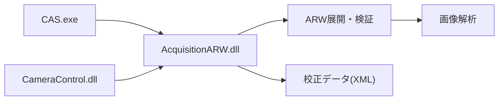
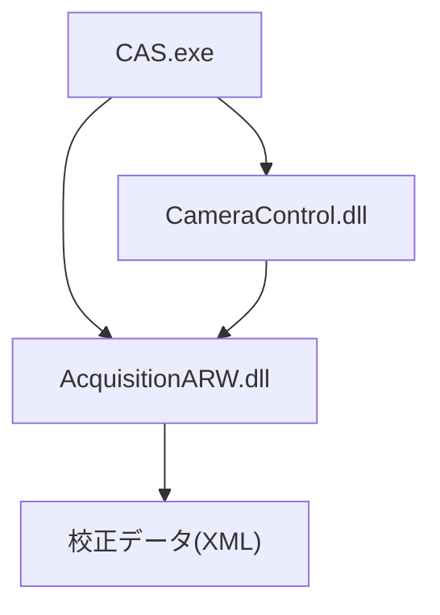
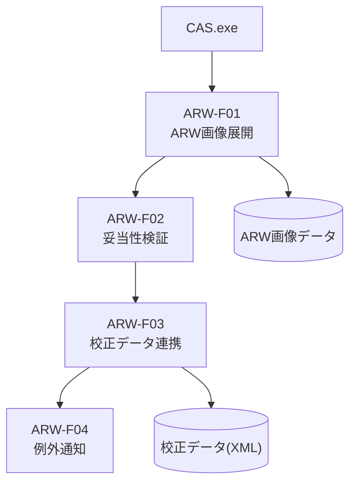
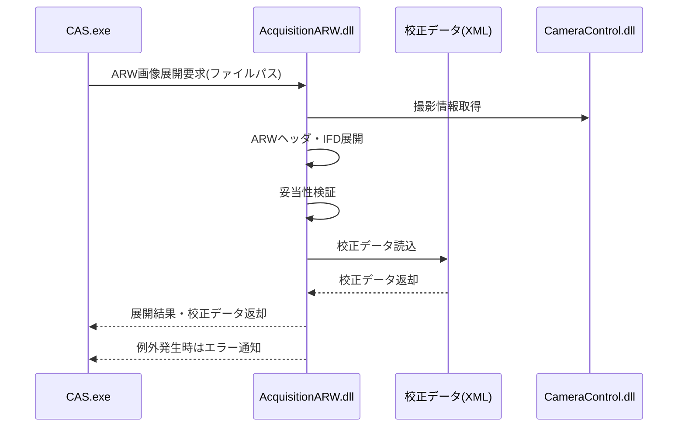

# AcquisitionARW.dll 基本設計書

| 項目 | 内容 |
|------|------|
| プロジェクト名 | AcquisitionARW.dll |
| システム名 | AcquisitionARW.dll |
| 作成日 | 2026年4月27日 |
| 作成者 | （記入） |
| バージョン | 1.0 |
| 関連文書 | 要件定義書：docs/AcquisitionARW_要件定義書.md |

---

## 1. システム概要書

### 1-1. システム全体像

#### システム概要

AcquisitionARW.dllは、CASシステムにおけるSony αシリーズのARW（RAW）画像ファイルの展開・検証・校正データ連携を担うC#/.NET DLLです。

- 画像解析や補正処理の前処理として、ARW画像のヘッダ・IFD展開、カメラ・レンズ・ズームの妥当性検証、LED校正データの自動読込を行う。
- CAS本体からDLLとして呼び出され、CameraControlや校正データ（XML）と連携。

#### システム構成図

#### 構成要素一覧

| No. | 構成要素 | 種別 | 役割 | 備考 |
|-----|----------|------|------|------|
| 1 | AcquisitionARW.dll | DLL | ARW画像展開・検証・校正データ連携 | 本ドキュメントの対象 |
| 2 | CAS.exe | アプリ | 画像解析・補正処理 | 呼び出し元 |
| 3 | CameraControl.dll | DLL | カメラ制御・撮影 | ARW画像生成元 |
| 4 | 校正データ(XML) | ファイル | LED補正値 | ARW展開時に自動読込 |

---

### 1-2. アプリケーションマップ

---

### 1-3. アプリケーション機能一覧

| アプリケーション名 | 機能ID | 機能名 | 機能概要 | 利用者 | 優先度 | 備考 |
|--------------------|--------|--------|----------|--------|--------|------|
| AcquisitionARW.dll | ARW-F01 | ARW画像展開 | ARWファイルのヘッダ・IFD展開 | CAS | 高 | |
| AcquisitionARW.dll | ARW-F02 | 妥当性検証 | カメラ・レンズ・ズーム値の検証 | CAS | 高 | |
| AcquisitionARW.dll | ARW-F03 | 校正データ連携 | LED校正XMLの自動読込 | CAS | 高 | |
| AcquisitionARW.dll | ARW-F04 | 例外通知 | エラー時に詳細メッセージを返却 | CAS | 高 | |

---

## 2. アプリケーション詳細

### 2-1. 機能関連図

#### シーケンス図

---

### 2-2. 各機能仕様

#### 2-2-1. 機能名：ARW画像展開

| 項目 | 内容 |
|------|------|
| 機能ID | ARW-F01 |
| 機能名 | ARW画像展開 |
| 機能概要 | ARWファイルのヘッダ・IFD展開、画像データ抽出 | CAS | 高 | |
| 利用者 | CAS |
| 起動契機 | 画像読込・解析前 |
| 入力 | ARWファイルパス |
| 出力 | 展開結果データ構造体 |
| 関連機能 | ARW-F02, ARW-F03 |
| 前提条件 | Sony α6400/7RM3等のARW形式 |
| 事後条件 | 展開結果が画像解析に利用可能 |
| 備考 | 例外時はエラー通知 |

---

#### 2-2-2. 機能名：妥当性検証

| 項目 | 内容 |
|------|------|
| 機能ID | ARW-F02 |
| 機能名 | 妥当性検証 |
| 機能概要 | カメラ・レンズ・ズーム値の検証 | CAS | 高 | |
| 利用者 | CAS |
| 起動契機 | 画像読込時 |
| 入力 | 展開結果データ構造体 |
| 出力 | 妥当性検証結果（bool/詳細メッセージ） |
| 関連機能 | ARW-F01, ARW-F03 |
| 前提条件 | ARW画像展開済み |
| 事後条件 | 不一致時は例外通知 |
| 備考 | 設定値と一致しない場合は例外 |

---

#### 2-2-3. 機能名：校正データ連携

| 項目 | 内容 |
|------|------|
| 機能ID | ARW-F03 |
| 機能名 | 校正データ連携 |
| 機能概要 | LED校正XMLの自動読込 | CAS | 高 | |
| 利用者 | CAS |
| 起動契機 | 画像読込時（オプション） |
| 入力 | ARWファイルパス、校正XMLパス |
| 出力 | 校正データ構造体 |
| 関連機能 | ARW-F01, ARW-F02 |
| 前提条件 | ARW画像展開済み |
| 事後条件 | 校正データが画像解析に利用可能 |
| 備考 | 校正データがなければ例外 |

---

#### 2-2-4. 機能名：例外通知

| 項目 | 内容 |
|------|------|
| 機能ID | ARW-F04 |
| 機能名 | 例外通知 |
| 機能概要 | エラー時に詳細メッセージを返却 | CAS | 高 | |
| 利用者 | CAS |
| 起動契機 | 各機能例外発生時 |
| 入力 | 例外オブジェクト |
| 出力 | エラーメッセージ |
| 関連機能 | ARW-F01〜F03 |
| 前提条件 | なし |
| 事後条件 | エラー内容が呼び出し元に通知される |
| 備考 | 例外はCASでログ記録 |

---

### 2-3. データ仕様

| データ名 | 概要 | 保持期間 | 更新主体 | 備考 |
|----------|------|----------|----------|------|
| ARW展開結果 | ARW画像のヘッダ・IFD・画像データ | 画像読込時 | AcquisitionARW.dll | 画像解析前処理 |
| 校正データ | LED補正値（XML） | 画像読込時 | AcquisitionARW.dll | 校正データ連携 |

---

### 2-4. メッセージ・コード仕様

| コード種別 | コード値 | コード名称 | 説明 |
|------------|----------|------------|------|
| 例外コード | 1001 | ARW展開失敗 | ARWファイルの読込・展開に失敗 |
| 例外コード | 1002 | 妥当性検証失敗 | カメラ・レンズ・ズーム不一致 |
| 例外コード | 1003 | 校正データ読込失敗 | 校正XMLが存在しない・不正 |

---

### 2-5. 機能/データ配置仕様

| 機能ID | 機能名 | 実装ファイル | 備考 |
|--------|--------|------------|------|
| ARW-F01 | ARW画像展開 | AcquisitionARW/AcquisitionARW.cs | 展開処理本体 |
| ARW-F02 | 妥当性検証 | AcquisitionARW/AcquisitionARW.cs | 展開後に検証 |
| ARW-F03 | 校正データ連携 | AcquisitionARW/AcquisitionARW.cs | XML連携処理 |
| ARW-F04 | 例外通知 | AcquisitionARW/AcquisitionARW.cs | 例外発生時 |

---

## 3. 付録

### 3-1. 用語集

| 用語 | 説明 |
|------|------|
| ARW | Sony αシリーズのRAW画像フォーマット |
| IFD | Image File Directory。TIFF/ARW画像のメタデータ構造 |
| 校正データ | LED補正値など、画像解析前に適用する補正情報（XML形式） |
| CAS | 本システムの主アプリケーション（WPF/.NET） |
| CameraControl.dll | カメラ制御・撮影を担うDLL |
| 例外通知 | エラー発生時に詳細メッセージを返却する仕組み |

---

### 3-2. 改版履歴

| バージョン | 日付 | 作成者 | 変更内容 |
|------------|------|--------|----------|
| 1.0 | 2026年4月27日 | システム分析チーム | 初版 |
