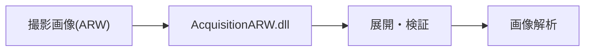

# AcquisitionARW.dll 要件定義書

| 項目 | 内容 |
|------|------|
| プロジェクト名 | AcquisitionARW.dll |
| 作成日 | 2026年4月27日 |
| 作成者 | （記入） |
| バージョン | 1.0 |

---

## 1. ビジネス要件

### 1-1. To-Be業務プロセス概要

- CASシステムでカメラ撮影したARW（RAW）画像を高速・高信頼で展開し、画像解析や補正処理の前処理を自動化する。
- カメラ・レンズ・ズームの妥当性検証や、LED校正データの自動読込も担う。

---

### 1-2. 業務内容、業務特性（ルール、制約）

| 業務名 | 業務内容 | ルール・制約 |
|--------|----------|-------------|
| ARW画像展開 | ARWファイルのヘッダ・IFD展開、画像データ抽出 | Sony α6400/7RM3等のARW形式限定 |
| 妥当性検証 | カメラ・レンズ・ズーム値の検証 | 設定値と一致しない場合は例外送出 |
| 校正データ連携 | LED校正XMLの自動読込 | 校正データがなければ例外 |

---

### 1-3. 組織構成、要員、設備

#### 組織構成

- CAS開発チーム

#### 要員スキル・規模

- C#/.NET、画像処理、ARW仕様理解

#### 必要設備

- Windows PC、Sony αカメラ、ARW画像サンプル

---

### 1-4. 業務KPIとその目標値

| KPI | 現状値 | 目標値 | 達成期限 |
|-----|--------|--------|---------|
| ARW展開処理時間 | - | 1画像あたり2秒以内 | 2026/6 |
| 妥当性検証失敗率 | - | 0% | 2026/6 |

---

### 1-5. 概要業務フロー

---

### 1-6. システム化の対象となる業務

| 対象業務 | 実現手段 | 備考 |
|----------|----------|------|
| ARW画像展開 | AcquisitionARW.dll | CAS本体から呼出 |
| 妥当性検証 | AcquisitionARW.dll | カメラ・レンズ・ズーム |
| 校正データ連携 | AcquisitionARW.dll | LED校正XML |

---

### 1-7. ビジネス制約

| 制約種別 | 内容 |
|----------|------|
| スケジュール | CASリリースに合わせる |
| コスト | 既存資産流用 |
| その他 | Sony αシリーズARW限定 |

---

### 1-8. その他の業務要件

- 例外時はエラーメッセージを上位へ伝播

---

## 2. システム要件（機能要件）

### 2-1. システム全体像

- CAS本体からDLLとして呼び出され、ARW画像の展開・検証・校正データ連携を担う。

---

### 2-2. システム化対象領域（適用範囲）と影響範囲

#### 適用範囲

- ARW画像の展開・妥当性検証・校正データ連携

#### 影響を受ける周辺システム

| システム名 | 影響内容 |
|-----------|---------|
| CAS | 画像解析前処理として利用 |
| CameraControl | ARW画像生成元 |
| LED校正データ | XML連携 |

---

### 2-3. ソリューション方針

- C#/.NET DLLとして実装
- 例外時はエラー伝播
- 校正データはXMLで管理

---

### 2-4. システム機能要件

| No. | 機能名 | 機能概要 | 優先度 |
|-----|--------|----------|--------|
| 1 | ARW画像展開 | ARWファイルのヘッダ・IFD展開 | 高 |
| 2 | 妥当性検証 | カメラ・レンズ・ズーム値の検証 | 高 |
| 3 | 校正データ連携 | LED校正XMLの自動読込 | 高 |
| 4 | 例外通知 | エラー時に詳細メッセージを返却 | 高 |

---

### 2-5. データ要件

| データ名 | 主要項目 | 関連データ | 備考 |
|----------|----------|-----------|------|
| ARW画像 | ヘッダ・IFD・画像データ | - | Sony α6400/7RM3等 |
| 校正データ | XML | - | LED補正用 |

---

### 2-6. 関連システムインタフェース要件

| 連携先システム | インタフェース種別 | データ内容 | 頻度 |
|--------------|-----------------|-----------|------|
| CAS | DLL呼出 | ARW展開結果 | 画像毎 |
| 校正データ | XMLファイル | 補正値 | 必要時 |

---

### 2-7. 要件定義不要機能

| 機能名 | 不要となる理由 |
|--------|--------------|
| JPEG展開 | ARW専用 |
| 動画展開 | 静止画専用 |

---

### 2-8. システム構築の制約

| 制約種別 | 内容 |
|----------|------|
| OS | Windows |
| 言語 | C#/.NET |
| カメラ | Sony α6400/7RM3等 |

---

## 3. システム要件（非機能要件）

### 3-1. 移行要件

| 移行対象 | 移行方法 | タイミング | 依存関係 |
|----------|----------|-----------|---------|
| 校正データ | 既存XML流用 | 本番前 | 既存運用 |

---

### 3-2. 品質要件

| 品質特性 | 要件内容 | 指標・目標値 |
|----------|----------|------------|
| 信頼性 | 展開失敗時は例外通知 | 100%通知 |
| 保守性 | XML・ARW仕様変更に追従 | 1週間以内対応 |
| 正確性 | ARW仕様準拠 | 100%一致 |
| 機能性 | 主要機能網羅 | 100% |
| 生産性 | 画像1枚2秒以内 | 2秒 |
| 操作性 | CASから自動呼出 | 100% |
| 経済性 | 既存DLL流用 | - |

---

### 3-3. 性能要件

| 項目 | 要件内容 | 目標値 |
|------|----------|--------|
| 展開処理時間 | 1画像あたり | 2秒以内 |

---

### 3-4. システムマネジメント要件

| 項目 | 要件内容 |
|------|----------|
| ログ | 例外・エラー時はCASログへ記録 |

---

### 3-5. インフラストラクチャー要件

| 項目 | 要件内容 |
|------|----------|
| PC | Windows端末 |
| ストレージ | ARW画像・XML保存領域 |

---

## 4. 次工程以降への申し送り事項

| No. | 申し送り内容 | 担当者 | 期限 | 備考 |
|-----|------------|--------|------|------|
| 1 | 新カメラ対応時はARW仕様確認 | | | |

---

## 変更履歴

| バージョン | 変更日 | 変更者 | 変更内容 |
|-----------|--------|--------|----------|
| 1.0 | 2026/04/27 | （記入） | 初版作成 |
