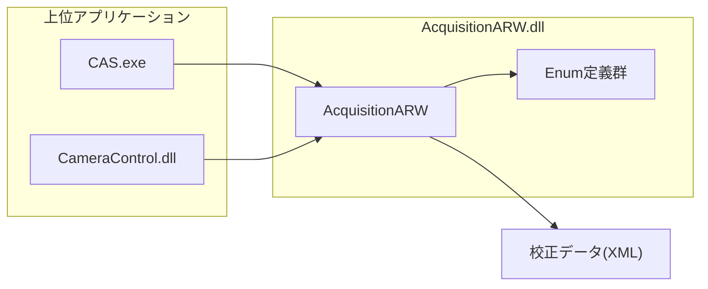
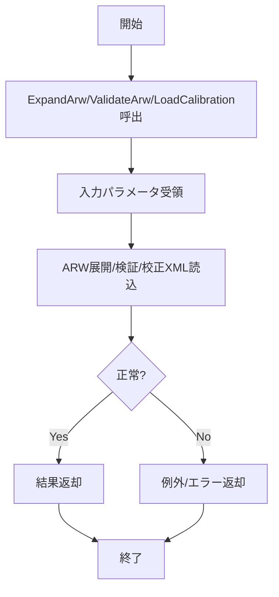
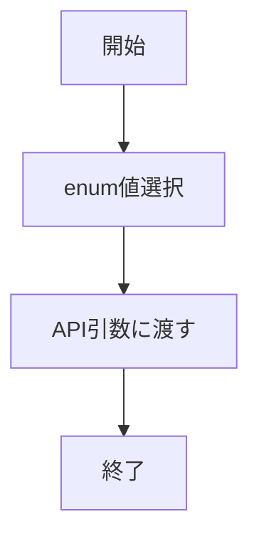
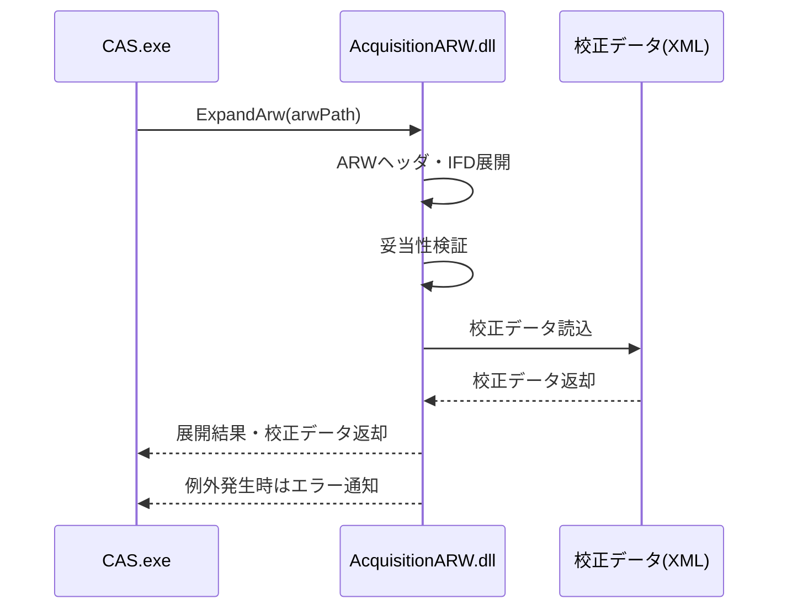
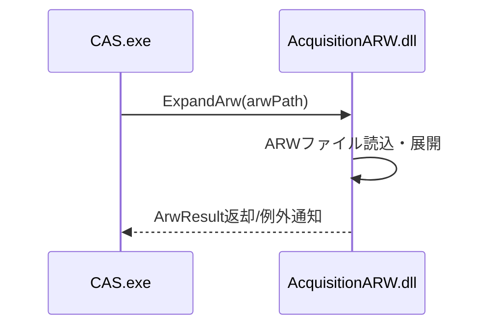
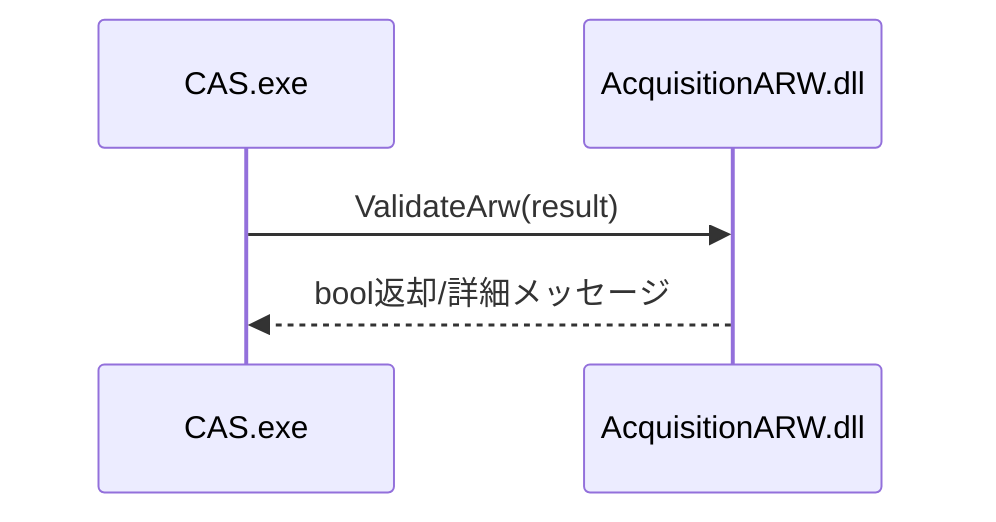
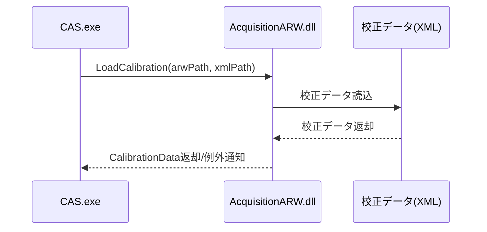

# AcquisitionARW.dll 詳細設計書

| 項目 | 内容 |
|------|------|
| プロジェクト名 | AcquisitionARW.dll |
| システム名 | AcquisitionARW.dll |
| ドキュメント名 | 詳細設計書 |
| 作成日 | 2026/04/27 |
| 作成者 | システム分析チーム |
| バージョン | 1.0 |
| 関連資料 | AcquisitionARW_要件定義書.md, AcquisitionARW_基本設計書.md |

---

## 1. モジュール一覧

### 1-1. モジュール一覧表

| No. | モジュールID | モジュール名 | 分類 | 主責務 | 配置先 | 備考 |
|-----|--------------|--------------|------|--------|--------|------|
| 1 | MDL-ARW-001 | AcquisitionARW | 外部IF | ARW画像展開・検証・校正データ連携API | AcquisitionARW.dll | 本体 |
| 2 | MDL-ARW-002 | Enum定義群 | ビジネスロジック | ARW/カメラ/校正関連の定数群 | AcquisitionARW.dll | |

### 1-2. モジュール命名規約

| 項目 | 規約 |
|------|------|
| 命名方針 | クラス/メソッドはPascalCase、enumは機能名+Type/Status |
| ID採番規則 | MDL-ARW-001 から連番 |
| 分類コード | BIZ:ビジネスロジック, IF:外部IF |

---

## 2. モジュール配置図（モジュールの物理配置設計）

### 2-1. 物理配置図

### 2-2. 配置一覧

| 配置区分 | 配置先パス/ノード | 配置モジュール | 配置理由 |
|----------|-------------------|----------------|----------|
| 実行モジュール | AcquisitionARW.dll | AcquisitionARW, Enum定義群 | CAS/CameraControlから直接参照されるため |
| 校正データ | XMLファイル | 校正値 | ARW展開時に自動読込 |

---

## 3. モジュール仕様オーバービュー

### 3-1. モジュール分類別サマリ

| 分類 | 対象モジュール | 処理概要 | 主なインタフェース |
|------|----------------|----------|--------------------|
| 外部IF | AcquisitionARW | ARW画像展開、妥当性検証、校正データ連携API | ExpandArw, ValidateArw, LoadCalibration |
| ビジネスロジック | Enum定義群 | ARW/カメラ/校正関連の定数 | ArwType, CameraModel, CalibrationType |

### 3-2. モジュール別オーバービュー

| モジュールID | モジュール名 | 分類 | 処理概要 | インタフェース名 | 引数 | 返り値 |
|--------------|--------------|------|----------|------------------|------|--------|
| MDL-ARW-001 | AcquisitionARW | 外部IF | ARW画像展開API | ExpandArw | ファイルパス | 展開結果構造体 |
| MDL-ARW-001 | AcquisitionARW | 外部IF | 妥当性検証API | ValidateArw | 展開結果構造体 | bool/詳細メッセージ |
| MDL-ARW-001 | AcquisitionARW | 外部IF | 校正データ連携API | LoadCalibration | ARWパス, XMLパス | 校正データ構造体 |
| MDL-ARW-002 | Enum定義群 | ビジネスロジック | 定数値の公開 | ArwType, CameraModel, CalibrationType | - | enum |

---

## 4. モジュール仕様（詳細）

### 4-1. MDL-ARW-001: AcquisitionARW

#### 4-1-1. 基本情報

| 項目 | 内容 |
|------|------|
| モジュールID | MDL-ARW-001 |
| モジュール名 | AcquisitionARW |
| 分類 | 外部IF |
| 呼出元 | CAS.exe, CameraControl.dll |
| 呼出先 | 校正データ(XML) |
| トランザクション | 無 |
| 再実行性 | 可（失敗時は例外/エラー返却、上位でリトライ判断） |

#### 4-1-2. 処理フロー

#### 4-1-3. 処理手順

| 手順No. | 処理内容 | 入力 | 出力 | 操作対象 | 備考 |
|---------|----------|------|------|----------|------|
| 1 | メソッド引数受領 | ファイルパス等 | 内部構造体 | AcquisitionARW | |
| 2 | ARW展開/検証/校正XML読込 | メソッド別パラメータ | 結果/例外 | AcquisitionARW, XML | |
| 3 | 結果/例外返却 | 結果/例外 | 上位呼出元 | AcquisitionARW | |

#### 4-1-4. 操作対象仕様

| 対象種別 | 対象名 | 操作内容 | 操作タイミング | 主キー/識別子 | 備考 |
|----------|--------|----------|----------------|---------------|------|
| 外部IF | CAS.exe, CameraControl.dll | メソッド呼出 | 各API呼出時 | メソッド名+引数 | |
| ファイル | ARW画像, 校正データXML | 読込/展開 | 各API呼出時 | ファイルパス | |
| メモリ | 展開結果構造体 | データ受け渡し | ExpandArw等 | | |

#### 4-1-5. インタフェース仕様

| 項目 | 内容 |
|------|------|
| インタフェース名 | AcquisitionARW公開メソッド群 |
| 概要 | ARW展開・検証・校正データ連携API |
| シグネチャ | 代表: ExpandArw(string arwPath): ArwResult |
| 呼出条件 | ARWファイル読込/解析時 |

引数一覧（代表）

| No. | 引数名 | 型 | 必須 | 説明 | バリデーション |
|-----|--------|----|------|------|----------------|
| 1 | arwPath | string | Y | ARWファイルパス | 存在/拡張子チェック |
| 2 | xmlPath | string | 条件付き | 校正データXMLパス | 存在/拡張子チェック |
| 3 | result | out ArwResult | Y | 展開結果構造体 | null不可 |

返り値一覧

| No. | 項目名 | 型 | 説明 | 備考 |
|-----|--------|----|------|------|
| 1 | result | ArwResult | 展開結果 | |
| 2 | isValid | bool | 妥当性検証結果 | |
| 3 | calibration | CalibrationData | 校正データ | |

#### 4-1-6. 例外処理仕様

| No. | 例外/エラー条件 | 検知方法 | 対応内容 | ユーザー通知 | ログ出力 | リトライ/継続可否 |
|-----|------------------|----------|----------|--------------|----------|------------------|
| 1 | ARWファイル不正 | 例外発生 | 例外返却 | 上位で通知 | なし | 可 |
| 2 | 校正XML不正/未存在 | 例外発生 | 例外返却 | 上位で通知 | なし | 可 |
| 3 | 妥当性検証失敗 | 戻り値false | false返却 | 上位で通知 | なし | 可 |

#### 4-1-7. ログ仕様

| ログ種別 | 出力条件 | 出力項目 | 保持期間 | マスキング方針 |
|----------|----------|----------|----------|----------------|
| 該当なし | 専用ログ実装なし。成否/例外は戻り値・例外で上位通知 | - | - | - |

### 4-2. MDL-ARW-002: Enum定義群

#### 4-2-1. 基本情報

| 項目 | 内容 |
|------|------|
| モジュールID | MDL-ARW-002 |
| モジュール名 | Enum定義群 |
| 分類 | ビジネスロジック |
| 呼出元 | AcquisitionARW, CAS.exe |
| 呼出先 | AcquisitionARW API引数 |
| トランザクション | 無 |
| 再実行性 | 常時可 |

#### 4-2-2. 処理フロー

#### 4-2-3. 処理手順

| 手順No. | 処理内容 | 入力 | 出力 | 操作対象 | 備考 |
|---------|----------|------|------|----------|------|
| 1 | 列挙値定義 | enum値 | 型安全な定数 | AcquisitionARW.dll | |
| 2 | APIへ受け渡し | enum値 | API引数値 | AcquisitionARW | |

#### 4-2-4. 操作対象仕様

| 対象種別 | 対象名 | 操作内容 | 操作タイミング | 主キー/識別子 | 備考 |
|----------|--------|----------|----------------|---------------|------|
| 定義体 | ArwType/CameraModel/CalibrationType | 定数参照 | API呼出時 | enumメンバ名 | |

#### 4-2-5. インタフェース仕様

| 項目 | 内容 |
|------|------|
| インタフェース名 | enum定義参照 |
| 概要 | ARW/カメラ/校正値を型安全に指定 |
| シグネチャ | 例: bool ValidateArw(CameraModel model) |
| 呼出条件 | CAS/CameraControlからAcquisitionARW呼出時 |

引数一覧

| No. | 引数名 | 型 | 必須 | 説明 | バリデーション |
|-----|--------|----|------|------|----------------|
| 1 | arwType | ArwType | Y | ARW種別 | 定義済み値のみ |
| 2 | cameraModel | CameraModel | Y | カメラ機種 | 定義済み値のみ |
| 3 | calibrationType | CalibrationType | 条件付き | 校正種別 | 定義済み値のみ |

返り値一覧

| No. | 項目名 | 型 | 説明 | 備考 |
|-----|--------|----|------|------|
| 1 | なし | - | enumは戻り値を持たない | API側でbool等を返却 |

#### 4-2-6. 例外処理仕様

| No. | 例外/エラー条件 | 検知方法 | 対応内容 | ユーザー通知 | ログ出力 | リトライ/継続可否 |
|-----|------------------|----------|----------|--------------|----------|------------------|
| 1 | 定義外値を数値キャストで指定 | API戻り値false | false返却 | 上位で通知 | なし | 可 |

#### 4-2-7. ログ仕様

| ログ種別 | 出力条件 | 出力項目 | 保持期間 | マスキング方針 |
|----------|----------|----------|----------|----------------|
| 該当なし | 専用ログ実装なし | - | - | - |

---

## 5. コード仕様

### 5-1. コード一覧

| コード名称 | コード値 | 内容説明 | 利用箇所 | 備考 |
|------------|----------|----------|----------|------|
| ArwType.SONY_A6400 | 0x01 | Sony α6400用ARW | ExpandArw | |
| ArwType.SONY_7RM3 | 0x02 | Sony α7RM3用ARW | ExpandArw | |
| CalibrationType.LED | 0x10 | LED補正値 | LoadCalibration | |

### 5-2. コード定義ルール

| 項目 | ルール |
|------|--------|
| コード値体系 | ARW種別は16進定義、校正種別は0x10以降 |
| 重複禁止範囲 | 同一enum内で重複禁止 |
| 廃止時の扱い | 後方互換維持のためenum値は削除せず非推奨化で対応 |

---

## 6. メッセージ仕様

### 6-1. メッセージ一覧

| メッセージ名称 | メッセージID | 種別 | 表示メッセージ | 内容説明 | 対応アクション |
|----------------|--------------|------|----------------|----------|----------------|
| ARW展開失敗 | MSG-ARW-001 | 例外 | ARWファイルの展開に失敗しました | ARWファイル不正等 | 上位で例外通知 |
| 校正データ読込失敗 | MSG-ARW-002 | 例外 | 校正データ(XML)の読込に失敗しました | XML不正/未存在 | 上位で例外通知 |
| 妥当性検証失敗 | MSG-ARW-003 | 例外 | ARW画像の妥当性検証に失敗しました | 値不一致等 | 上位で例外通知 |

### 6-2. メッセージ運用ルール

| 項目 | ルール |
|------|--------|
| ID採番 | MSG-ARW-001 から連番 |
| 多言語対応 | 上位アプリ側ポリシーに従う |
| プレースホルダ | 上位アプリ側で定義 |

---

## 7. 関連システムインタフェース仕様

### 7-1. インタフェース一覧

| IF ID | I/O | インタフェースシステム名 | インタフェースファイル名 | インタフェースタイミング | インタフェース方法 | インタフェースエラー処理方法 | インタフェース処理のリラン定義 | インタフェース処理のロギングインタフェース |
|------|-----|--------------------------|--------------------------|--------------------------|--------------------|------------------------------|--------------------------------|------------------------------------------|
| IF-ARW-001 | IN | CAS.exe | AcquisitionARW.dll | API呼出都度 | .NET DLL呼出 | 例外/エラー返却 | 上位で実施 | 本DLLでは専用ログなし |
| IF-ARW-002 | IN | CameraControl.dll | AcquisitionARW.dll | API呼出都度 | .NET DLL呼出 | 例外/エラー返却 | 上位で実施 | 本DLLでは専用ログなし |
| IF-ARW-003 | OUT | 校正データ | XMLファイル | ARW展開時 | ファイル読込 | 例外/エラー返却 | 上位で実施 | 本DLLでは専用ログなし |

### 7-2. インタフェースデータ項目定義

| IF ID | データ項目名 | データ項目の説明 | データ項目の位置 | 書式 | 必須 | エラー時の代替値 | 備考 |
|------|--------------|------------------|------------------|------|------|------------------|------|
| IF-ARW-001 | arwPath | ARWファイルパス | ExpandArw引数 | string | Y | なし | |
| IF-ARW-001 | result | 展開結果構造体 | ExpandArw返り値 | ArwResult | Y | null | |
| IF-ARW-002 | xmlPath | 校正データXMLパス | LoadCalibration引数 | string | 条件付き | なし | |
| IF-ARW-003 | calibration | 校正データ構造体 | LoadCalibration返り値 | CalibrationData | Y | null | |

### 7-3. インタフェース処理シーケンス

---

## 8. メソッド仕様

### 8-1. ExpandArw

| 項目 | 内容 |
|------|------|
| シグネチャ | ArwResult ExpandArw(string arwPath) |
| 概要 | ARWファイルを展開し、ヘッダ・IFD・画像データを抽出する |
| 入力 | arwPath: ARWファイルパス |
| 出力 | ArwResult: 展開結果構造体 |
| 事前条件 | ファイル存在・拡張子チェック |

#### 引数
| No. | 引数名 | 型 | 必須 | 説明 | バリデーション |
|-----|--------|----|------|------|----------------|
| 1 | arwPath | string | Y | ARWファイルパス | 存在/拡張子が.arw |

#### 返り値
| 型 | 説明 |
|----|------|
| ArwResult | ヘッダ・IFD・画像データ等を含む構造体 |

#### ArwResult構造体例
| フィールド | 型 | 説明 |
|----------|----|------|
| Header | object | ARWヘッダ情報 |
| IFD | object | Image File Directory情報 |
| ImageData | byte[] | 展開画像データ |
| CameraModel | string | カメラ機種名 |
| LensInfo | string | レンズ情報 |
| ZoomValue | double | ズーム値 |
| ... | ... | ... |

#### 処理手順
| 手順 | 内容 |
|------|------|
| 1 | arwPathの存在・拡張子チェック（.arw） |
| 2 | ファイルストリームでバイナリ読込 |
| 3 | TIFF/ARW仕様に従いヘッダ・IFDをパース |
| 4 | 画像データ部を抽出しImageDataへ格納 |
| 5 | CameraModel, LensInfo, ZoomValue等を解析 |
| 6 | ArwResult構造体に格納し返却 |
| 7 | 失敗時は例外発生（詳細メッセージ付与） |

#### サブ処理例
- TIFFタグパース
- マルチIFD対応
- エンディアン判定
- 例外発生時のエラーコード付与

#### バリデーション
- ファイル存在・拡張子
- TIFF/ARWヘッダのシグネチャチェック
- データ長・オフセット範囲

#### ユースケース例
1. CAS.exeが撮影画像のARWファイルパスを指定しExpandArwを呼び出す
2. 展開結果をValidateArwやLoadCalibrationに連携

#### シーケンス例

#### 異常系・副作用
- ファイルロック時は例外
- メモリ不足時は例外
- スレッドセーフ（インスタンスごと）

---

### 8-2. ValidateArw

| 項目 | 内容 |
|------|------|
| シグネチャ | bool ValidateArw(ArwResult result) |
| 概要 | 展開結果のカメラ・レンズ・ズーム値等を検証する |
| 入力 | result: 展開結果構造体 |
| 出力 | bool: 妥当性検証結果 |
| 事前条件 | ExpandArw実行済み |

#### 引数
| No. | 引数名 | 型 | 必須 | 説明 | バリデーション |
|-----|--------|----|------|------|----------------|
| 1 | result | ArwResult | Y | 展開結果構造体 | null不可 |

#### 返り値
| 型 | 説明 |
|----|------|
| bool | true: 妥当, false: 不正（詳細は例外/メッセージ） |

#### 処理手順
| 手順 | 内容 |
|------|------|
| 1 | resultのCameraModel, LensInfo, ZoomValue等を取得 |
| 2 | システム設定値（許容範囲）と比較 |
| 3 | 一致すればtrue、不一致ならfalse返却 |
| 4 | 不正時は詳細メッセージを例外/ログ等で通知 |

#### サブ処理例
- 許容カメラ機種・レンズリストの取得
- ズーム値の範囲判定
- 詳細メッセージ生成

#### バリデーション
- nullチェック
- 必須フィールドの有無

#### ユースケース例
1. ExpandArwで得たArwResultをValidateArwに渡す
2. 妥当性OKならtrue、NGならfalse＋詳細通知

#### シーケンス例

#### 異常系・副作用
- 設定値不備時は例外
- スレッドセーフ

---

### 8-3. LoadCalibration

| 項目 | 内容 |
|------|------|
| シグネチャ | CalibrationData LoadCalibration(string arwPath, string xmlPath) |
| 概要 | ARW画像に対応する校正データ(XML)を読込む |
| 入力 | arwPath: ARWファイルパス, xmlPath: 校正データXMLパス |
| 出力 | CalibrationData: 校正データ構造体 |
| 事前条件 | ファイル存在・拡張子チェック |

#### 引数
| No. | 引数名 | 型 | 必須 | 説明 | バリデーション |
|-----|--------|----|------|------|----------------|
| 1 | arwPath | string | Y | ARWファイルパス | 存在/拡張子が.arw |
| 2 | xmlPath | string | Y | 校正データXMLパス | 存在/拡張子が.xml |

#### 返り値
| 型 | 説明 |
|----|------|
| CalibrationData | 校正値・パラメータ等を含む構造体 |

#### CalibrationData構造体例
| フィールド | 型 | 説明 |
|----------|----|------|
| LedGain | double | LED補正値 |
| Offset | double | オフセット値 |
| Valid | bool | 校正データ有効フラグ |
| ... | ... | ... |

#### 処理手順
| 手順 | 内容 |
|------|------|
| 1 | arwPath, xmlPathの存在・拡張子チェック |
| 2 | XMLファイルをストリーム読込 |
| 3 | 必須ノード/属性の有無を検証 |
| 4 | 校正値をパースしCalibrationDataに格納 |
| 5 | 校正値の妥当性チェック（範囲・型） |
| 6 | 構造体を返却、失敗時は例外 |

#### サブ処理例
- XMLスキーマバリデーション
- データ型変換
- 例外発生時のエラーコード付与

#### バリデーション
- ファイル存在・拡張子
- XML必須ノード/属性
- 校正値の範囲・型

#### ユースケース例
1. CAS.exeがARWファイルと校正XMLパスを指定しLoadCalibrationを呼び出す
2. 校正値を画像補正処理に利用

#### シーケンス例

#### 異常系・副作用
- XML不正時は例外
- メモリ不足時は例外
- スレッドセーフ

---

## 9. 変更履歴

| 版数 | 日付 | 変更者 | 変更内容 |
|------|------|--------|----------|
| 1.0 | 2026/04/27 | システム分析チーム | 新規作成 |
