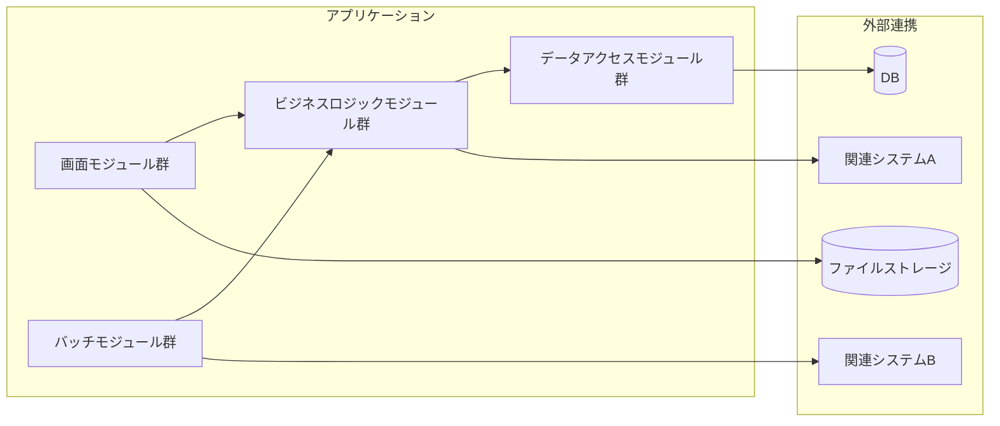
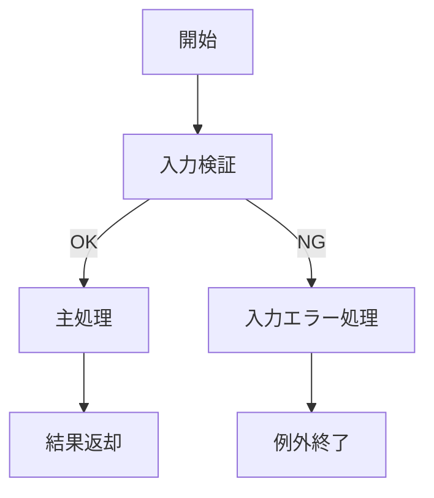
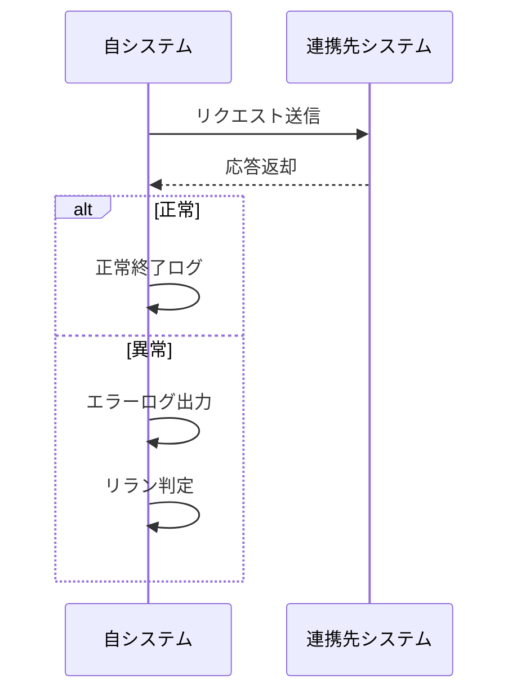

# 詳細設計書テンプレート

| 項目 | 内容 |
|------|------|
| プロジェクト名 | [プロジェクト名] |
| システム名 | [システム名] |
| ドキュメント名 | 詳細設計書 |
| 作成日 | [YYYY/MM/DD] |
| 作成者 | [作成者] |
| バージョン | [版数] |
| 関連資料 | [要件定義書名], [基本設計書名] |

---

## 1. モジュール一覧

### 1-1. モジュール一覧表

| No. | モジュールID | モジュール名 | 分類 | 主責務 | 配置先 | 備考 |
|-----|--------------|--------------|------|--------|--------|------|
| 1 | [MDL-001] | [例: UniformityService] | [画面/バッチ/ビジネスロジック/データアクセス/IF] | [責務] | [プロジェクト/フォルダ/実行形式] | [備考] |

### 1-2. モジュール命名規約

| 項目 | 規約 |
|------|------|
| 命名方針 | [例: PascalCase + 接尾辞 Service/Repository/ViewModel] |
| ID採番規則 | [例: MDL-001 から連番] |
| 分類コード | [SCR:画面, BAT:バッチ, BIZ:ビジネスロジック, DAL:データアクセス, IF:外部IF] |

---

## 2. モジュール配置図（モジュールの物理配置設計）

### 2-1. 物理配置図

### 2-2. 配置一覧

| 配置区分 | 配置先パス/ノード | 配置モジュール | 配置理由 |
|----------|-------------------|----------------|----------|
| 実行モジュール | [例: src/App] | [画面系モジュール] | [理由] |
| ライブラリ | [例: src/Domain] | [業務ロジック] | [理由] |
| インフラ層 | [例: src/Infrastructure] | [Repository/IFクライアント] | [理由] |
| バッチ実行環境 | [例: jobs/] | [夜間バッチ] | [理由] |

---

## 3. モジュール仕様オーバービュー

### 3-1. モジュール分類別サマリ

| 分類 | 対象モジュール | 処理概要 | 主なインタフェース |
|------|----------------|----------|--------------------|
| 画面 | [モジュール名] | [概要] | [画面イベント/呼出先] |
| バッチ | [モジュール名] | [概要] | [起動引数/戻り値/終了コード] |
| ビジネスロジック | [モジュール名] | [概要] | [公開メソッド] |
| データアクセス | [モジュール名] | [概要] | [CRUD/APIアクセス] |
| 外部IF | [モジュール名] | [概要] | [送受信仕様] |

### 3-2. モジュール別オーバービュー

| モジュールID | モジュール名 | 分類 | 処理概要 | インタフェース名 | 引数 | 返り値 |
|--------------|--------------|------|----------|------------------|------|--------|
| [MDL-001] | [モジュール名] | [分類] | [処理概要] | [関数/メソッド名] | [型/必須/説明] | [型/説明] |

---

## 4. モジュール仕様（詳細）

以下をモジュールごとに記載する。

### 4-x. [モジュールID: モジュール名]

#### 4-x-1. 基本情報

| 項目 | 内容 |
|------|------|
| モジュールID | [MDL-xxx] |
| モジュール名 | [名称] |
| 分類 | [画面/バッチ/ビジネスロジック/データアクセス/IF] |
| 呼出元 | [モジュール/画面/ジョブ] |
| 呼出先 | [モジュール/DB/ファイル/外部システム] |
| トランザクション | [有/無, 範囲] |
| 再実行性 | [可/不可, 条件] |

#### 4-x-2. 処理フロー

#### 4-x-3. 処理手順

| 手順No. | 処理内容 | 入力 | 出力 | 操作対象 | 備考 |
|---------|----------|------|------|----------|------|
| 1 | [入力値検証] | [引数] | [検証結果] | [画面/テーブル/ファイル] | [補足] |
| 2 | [主処理] | [業務データ] | [処理結果] | [画面/テーブル/ファイル] | [補足] |
| 3 | [後処理] | [処理結果] | [返却値] | [ログ/通知先] | [補足] |

#### 4-x-4. 操作対象仕様（画面、テーブル、ファイル）

| 対象種別 | 対象名 | 操作内容 | 操作タイミング | 主キー/識別子 | 備考 |
|----------|--------|----------|----------------|---------------|------|
| 画面 | [画面名] | [表示/更新/遷移] | [契機] | [画面ID] | [補足] |
| テーブル | [テーブル名] | [SELECT/INSERT/UPDATE/DELETE] | [契機] | [PK] | [WHERE条件/ロック方針] |
| ファイル | [ファイル名] | [読込/出力/更新/削除] | [契機] | [ファイルキー] | [配置先/文字コード] |

#### 4-x-5. インタフェース仕様（引数・返り値）

| 項目 | 内容 |
|------|------|
| インタフェース名 | [関数/メソッド/API名] |
| 概要 | [処理概要] |
| シグネチャ | [例: Execute(input: InputDto): ResultDto] |
| 呼出条件 | [前提条件] |

引数一覧

| No. | 引数名 | 型 | 必須 | 説明 | バリデーション |
|-----|--------|----|------|------|----------------|
| 1 | [arg1] | [type] | [Y/N] | [説明] | [条件] |

返り値一覧

| No. | 項目名 | 型 | 説明 | 備考 |
|-----|--------|----|------|------|
| 1 | [result] | [type] | [説明] | [備考] |

#### 4-x-6. 例外処理仕様

| No. | 例外/エラー条件 | 検知方法 | 対応内容 | ユーザー通知 | ログ出力 | リトライ/継続可否 |
|-----|------------------|----------|----------|--------------|----------|------------------|
| 1 | [入力不正] | [検証] | [処理中断] | [警告メッセージID] | [WARN] | [不可] |
| 2 | [DB更新失敗] | [例外捕捉] | [ロールバック] | [異常通知メッセージID] | [ERROR] | [条件付き可] |
| 3 | [外部IFタイムアウト] | [応答監視] | [再送/中断] | [確認メッセージID] | [ERROR] | [可(最大N回)] |

#### 4-x-7. ログ仕様

| ログ種別 | 出力条件 | 出力項目 | 保持期間 | マスキング方針 |
|----------|----------|----------|----------|----------------|
| 監査ログ | [更新時] | [ユーザーID, 操作, 対象, 結果] | [xx日] | [個人情報マスク] |
| 実行ログ | [開始/終了/異常] | [トレースID, 処理時間, 終了コード] | [xx日] | [機微情報除外] |

---

## 5. コード仕様

### 5-1. コード一覧

| コード名称 | コード値 | 内容説明 | 利用箇所 | 備考 |
|------------|----------|----------|----------|------|
| [処理状態区分] | [00] | [未処理] | [画面/バッチ/DB] | [任意] |
| [処理状態区分] | [01] | [処理中] | [画面/バッチ/DB] | [任意] |
| [処理状態区分] | [99] | [異常終了] | [画面/バッチ/DB] | [任意] |

### 5-2. コード定義ルール

| 項目 | ルール |
|------|--------|
| コード値体系 | [数値2桁/英数3桁 など] |
| 重複禁止範囲 | [同一コード名称内] |
| 廃止時の扱い | [論理削除/利用停止フラグ] |

---

## 6. メッセージ仕様

### 6-1. メッセージ一覧

| メッセージ名称 | メッセージID | 種別 | 表示メッセージ | 内容説明 | 対応アクション |
|----------------|--------------|------|----------------|----------|----------------|
| [入力チェック警告] | [MSG-W-001] | 警告 | [入力値が不正です。] | [入力不備時に表示] | [再入力] |
| [削除確認] | [MSG-Q-001] | 確認 | [削除してよろしいですか。] | [削除前の確認] | [OK/Cancel] |
| [保存完了] | [MSG-I-001] | 情報 | [保存が完了しました。] | [正常終了時に表示] | [なし] |
| [通信異常] | [MSG-E-001] | 異常通知 | [通信エラーが発生しました。] | [外部連携失敗時に表示] | [再試行/中止] |

### 6-2. メッセージ運用ルール

| 項目 | ルール |
|------|--------|
| ID採番 | [MSG-{I/Q/W/E}-連番] |
| 多言語対応 | [有/無, 対応方針] |
| プレースホルダ | [例: {0}=対象名, {1}=件数] |

---

## 7. 関連システムインタフェース仕様

### 7-1. インタフェース一覧

| IF ID | I/O | インタフェースシステム名 | インタフェースファイル名 | インタフェースタイミング | インタフェース方法 | インタフェースエラー処理方法 | インタフェース処理のリラン定義 | インタフェース処理のロギングインタフェース |
|------|-----|--------------------------|--------------------------|--------------------------|--------------------|------------------------------|--------------------------------|------------------------------------------|
| [IF-001] | [IN/OUT] | [システム名] | [ファイル名/API名] | [都度/日次/イベント] | [API/FTP/共有フォルダ/MQ] | [リトライ/通知/中断] | [再実行条件、最大回数、手順] | [ログ名、出力項目、保持期間] |

### 7-2. インタフェースデータ項目定義

| IF ID | データ項目名 | データ項目の説明 | データ項目の位置 | 書式 | 必須 | エラー時の代替値 | 備考 |
|------|--------------|------------------|------------------|------|------|------------------|------|
| [IF-001] | [item_01] | [説明] | [1-10桁 / JSONキー名] | [文字列(10)/数値(5,2)/日時] | [Y/N] | [null/固定値] | [補足] |

### 7-3. インタフェース処理シーケンス

---

## 8. メソッド仕様

---

## 9. 変更履歴

| 版数 | 日付 | 変更者 | 変更内容 |
|------|------|--------|----------|
| 0.1 | [YYYY/MM/DD] | [氏名] | 新規作成 |

---

## 10. 記入ガイド（運用時に削除可）

- 章 4 はモジュール数分コピーして使用する。
- 例外処理仕様は、検知方法・通知・ログ・リラン可否まで必ず記載する。
- インタフェース仕様は、一覧と項目定義の両方を記載する。
- メッセージ仕様は、画面表示文言と運用上の意味の両方を記載する。
- コード仕様とメッセージ仕様のIDは、実装コード上の定数名と突合可能な命名にする。
