# 基本設計書

| 項目 | 内容 |
|------|------|
| プロジェクト名 | ColorAlignmentSoftware |
| システム名 | CameraControl |
| 作成日 | 2026年4月14日 |
| 作成者 | システム分析チーム |
| バージョン | 1.0 |
| 関連文書 | 要件定義書：docs/CameraControl_要件定義書.md |

---

## 1. システム概要書

### 1-1. システム全体像

#### システム概要

CameraControlは、上位アプリケーション（AlphaCameraController、CAS）から呼び出されるカメラ制御ライブラリである。Sony Alpha系カメラに対して、接続・設定変更・撮影・AF制御・ライブビュー取得を提供する。

アーキテクチャ上は、上位アプリとCameraControllerSharp SDKの間の抽象化レイヤとして機能し、上位側のカメラ依存ロジックを削減する。

#### システム構成図

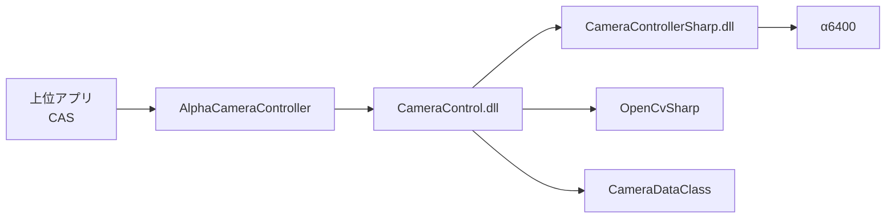

#### 構成要素一覧

| No. | 構成要素 | 種別 | 役割 | 備考 |
|-----|----------|------|------|------|
| 1 | CameraControl.dll | クラスライブラリ | カメラ制御APIの提供 | .NET Framework 4.5.1 |
| 2 | CameraControllerSharp.dll | 外部SDK | カメラデバイス制御本体 | x86依存 |
| 3 | OpenCvSharp.dll | 外部ライブラリ | ライブビュー画像解析 | マーカー検出で利用 |
| 4 | CameraDataClass.dll | 共通ライブラリ | 撮影条件・AF条件データ定義 | ShootCondition/AfAreaSetting |
| 5 | α6400 | ハードウェア | 対象カメラ | 接続対象機器 |

#### ソリューション方針

| 項目 | 内容 |
|------|------|
| 機能分離 | 上位アプリからカメラ制御処理を切り離し、再利用可能ライブラリ化 |
| API設計 | 上位が直接SDKを扱わないよう公開メソッドを提供 |
| エラー方針 | 失敗時は例外で上位へ通知し、上位で復旧判断 |
| 画像処理 | ライブビュー解析はOpenCvSharpに委譲 |
| 実行基盤 | .NET Framework 4.5.1、x86前提 |

---

### 1-2. アプリケーションマップ

#### アプリケーションマップ

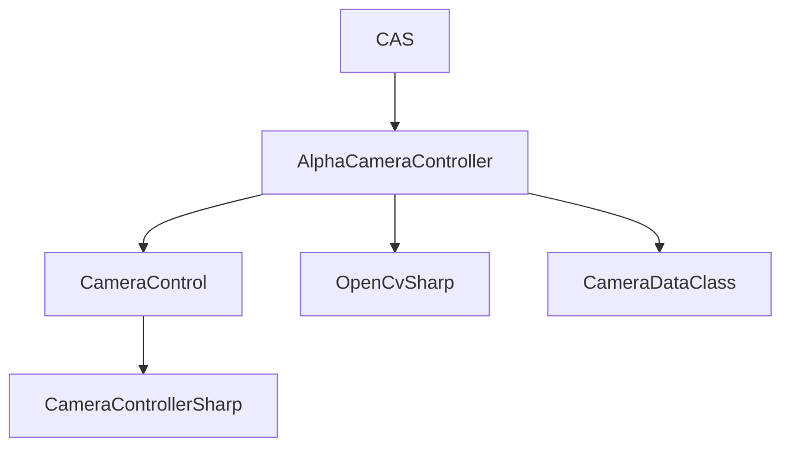

#### アプリケーション一覧

| No. | アプリケーション名 | 区分 | 主な役割 | 利用者・利用部門 | 備考 |
|-----|--------------------|------|----------|------------------|------|
| 1 | CAS | 上位アプリ | 計測業務制御とカメラ利用 | 製造・評価担当 | 調整アプリ |
| 2 | AlphaCameraController | 上位アプリ | 制御ファイル監視と撮影実行統合 | 製造・評価担当 | CameraControlを呼び出し |
| 3 | CameraControl | ライブラリ | カメラ制御機能提供 | 開発者 | 本設計対象 |
| 4 | CameraControllerSharp | SDK | デバイス制御API | システム内部 | CameraControl配下 |

#### アプリケーション間関係

| 連携元 | 連携先 | 連携概要 | 主なデータ | 連携方式 |
|--------|--------|----------|------------|----------|
| CAS | AlphaCameraController | 接続、設定、撮影、AF、LiveViewの実行依頼 | ShootCondition, AfAreaSetting, path | C#メソッド呼び出し |
| AlphaCameraController | CameraControl | 接続、設定、撮影、AF、LiveViewの実行依頼 | ShootCondition, AfAreaSetting, path | C#メソッド呼び出し |
| CameraControl | CameraControllerSharp | 実カメラ制御API呼び出し | 文字列パラメータ、画像バッファ | DLL API呼び出し |

---

### 1-3. アプリケーション機能一覧

| アプリケーション名 | 機能ID | 機能名 | 機能概要 | 利用者 | 優先度 | 備考 |
|--------------------|--------|--------|----------|--------|--------|------|
| CameraControl | CC-F01 | カメラ接続 | 指定名カメラへ接続 | 上位アプリ | 高 | OpenCamera |
| CameraControl | CC-F02 | カメラ切断 | 接続中カメラを切断 | 上位アプリ | 高 | CloseCamera |
| CameraControl | CC-F03 | 撮影 | 画像を取得して保存 | 上位アプリ | 高 | CaptureImage |
| CameraControl | CC-F04 | 撮影設定 | 撮影条件をカメラへ反映 | 上位アプリ | 高 | SetCameraSettings |
| CameraControl | CC-F05 | フォーカスモード設定 | MF/AF等へ切替 | 上位アプリ | 高 | SetFocusMode |
| CameraControl | CC-F06 | オートフォーカス | AF-S実行後MF復帰 | 上位アプリ | 高 | AutoFocus |
| CameraControl | CC-F07 | AFエリア設定 | AFエリア種別・座標設定 | 上位アプリ | 中 | SetAfArea |
| CameraControl | CC-F08 | ライブビュー取得 | ライブ画像取得と解析結果返却 | 上位アプリ | 中 | GetLiveViewImage |
| CameraControl | CC-F09 | ライブビュー保存 | ライブ画像のjpg保存 | 上位アプリ | 中 | LiveView |

---

## 2. アプリケーション詳細

### 2-1. 機能関連図

#### 対象アプリケーション

CameraControl

#### 機能関連図

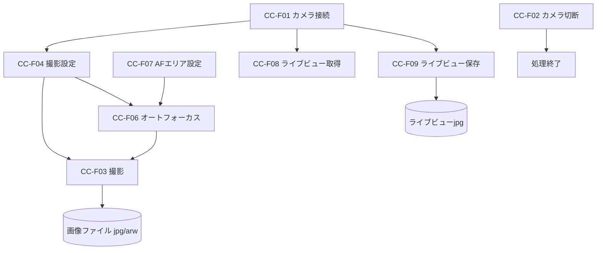

#### 補足説明

| 項目 | 内容 |
|------|------|
| 機能間連携の要点 | 接続後に設定・撮影・AF・ライブビューの各機能を呼び出す |
| 前提条件 | 対応カメラ接続、SDK/DLL配置、x86実行環境 |
| 制約事項 | 1台接続前提、失敗時は例外返却、再試行は一部機能のみ |

#### シーケンス図

##### 接続・設定・撮影シーケンス

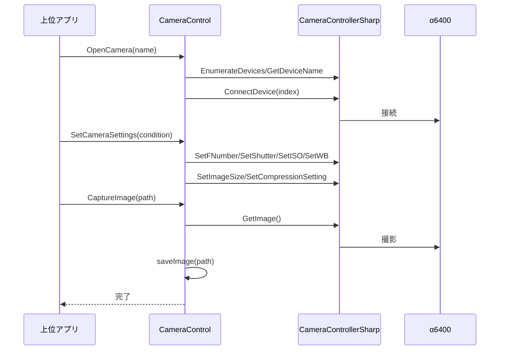

##### オートフォーカスシーケンス

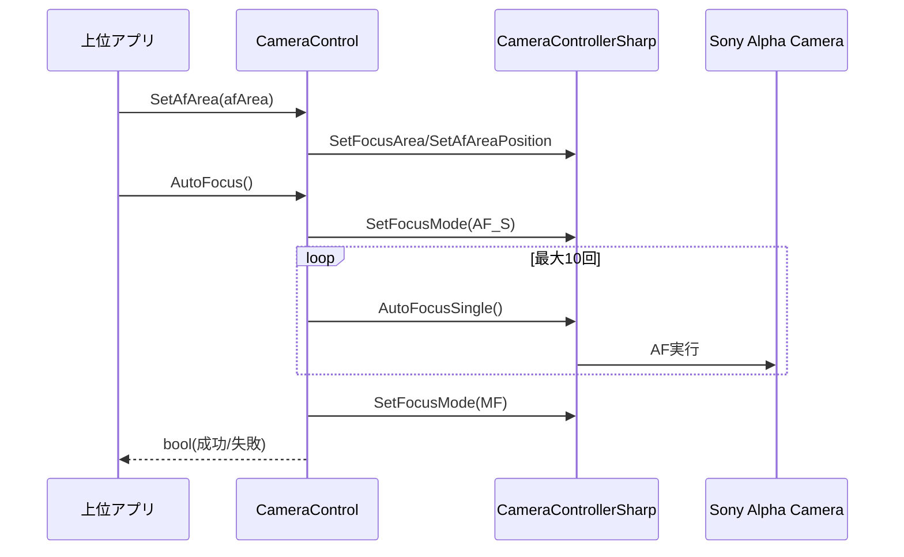

##### ライブビュー取得シーケンス

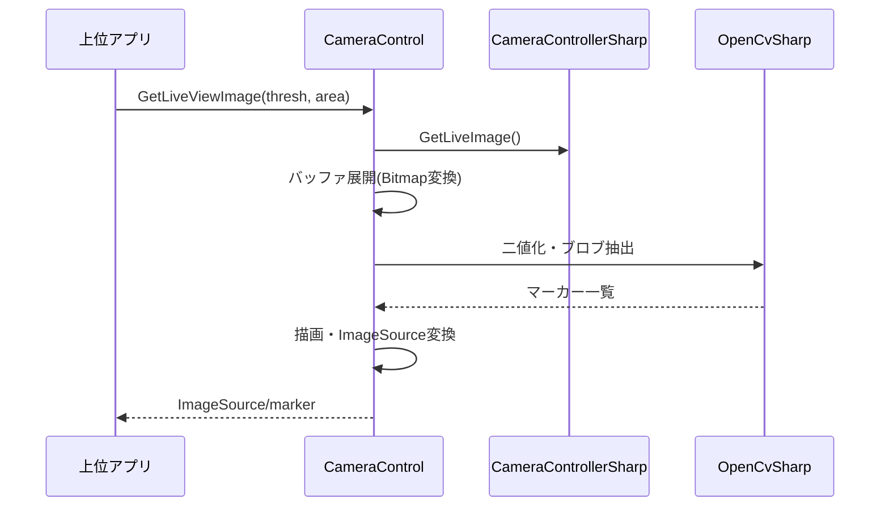

##### ライブビュー保存シーケンス

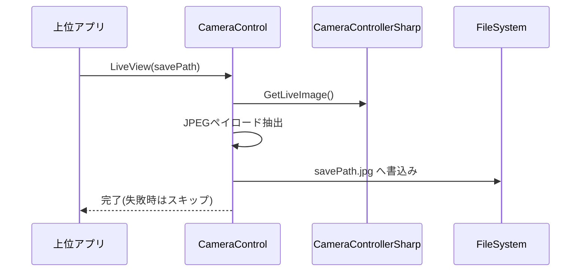

---

### 2-2. 各機能仕様

#### 2-2-1. 機能名：撮影制御（接続・設定・撮影）

##### 2-2-1-1. 機能概要

| 項目 | 内容 |
|------|------|
| 機能ID | CC-F01, CC-F03, CC-F04 |
| 機能名 | 撮影制御 |
| 機能概要 | カメラ接続後に撮影条件を反映し、画像を保存する |
| 利用者 | 上位アプリ（CAS、AlphaCameraController） |
| 起動契機 | 上位アプリからのメソッド呼び出し |
| 入力 | カメラ名、ShootCondition、保存パス |
| 出力 | 画像ファイル（jpg/arw） |
| 関連機能 | CC-F02, CC-F05 |
| 前提条件 | カメラ未接続時は先にOpenCamera実行 |
| 事後条件 | 撮影結果が指定パスに保存される |
| 備考 | 失敗時は例外送出 |

##### 2-2-1-2. 画面仕様

対象外（ライブラリ機能のため画面なし）

##### 2-2-1-3. 帳票仕様

対象外

##### 2-2-1-4. EUCファイル（Downloadable File）仕様

対象外

##### 2-2-1-5. 関連システムインタフェース仕様

###### インタフェース一覧

| IF ID | 連携先システム | 方向 | 連携方式 | 概要 | 頻度 | 備考 |
|-------|----------------|------|----------|------|------|------|
| IF-CC-01 | CAS/AlphaCameraController | 受信 | C#メソッド呼び出し | 接続・設定・撮影要求受付 | 要求時 | 同期呼び出し |
| IF-CC-02 | CameraControllerSharp | 双方向 | DLL API | カメラデバイス操作 | 要求時 | 失敗時false返却 |

###### 関連システム関連図

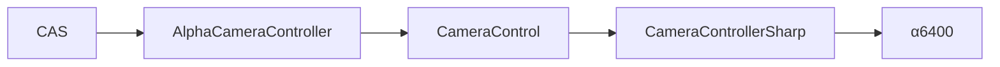

###### インタフェース項目仕様

| 項目名 | 説明 | 型 | 桁数 | 必須 | 変換ルール | 備考 |
|--------|------|----|------|------|------------|------|
| name | 接続対象カメラ名 | string | 可変 | OpenCamera時必須 | 完全一致比較 | 未検出時例外 |
| condition.ImageSize | 画像サイズ | int | - | 任意 | enumへキャスト | |
| condition.FNumber | F値 | string | 可変 | 任意 | ASCII変換 | |
| condition.Shutter | シャッター速度 | string | 可変 | 任意 | ASCII変換 | |
| condition.ISO | ISO感度 | string | 可変 | 任意 | ASCII変換 | |
| condition.WB | ホワイトバランス | string | 可変 | 任意 | ASCII変換 | |
| condition.CompressionType | 圧縮形式 | uint | - | 任意 | enumへキャスト | 16=RAW, 3=JPG |
| path | 保存パス（拡張子除く） | string | 可変 | CaptureImage時必須 | 末尾に拡張子付与 | |

###### 処理内容

| 項目 | 内容 |
|------|------|
| 起動契機 | 上位アプリのメソッド呼び出し |
| 処理タイミング | 同期処理 |
| リトライ方針 | 接続時1回再試行、撮影時1回再試行 |
| 異常時対応 | 例外を上位に送出 |

##### 2-2-1-6. 入出力処理仕様

###### 処理概要

| 項目 | 内容 |
|------|------|
| 処理名 | 撮影実行処理 |
| 処理種別 | オンライン |
| 処理概要 | カメラから画像バッファを取得しファイルへ保存 |
| 実行契機 | CaptureImage呼び出し |
| 実行タイミング | 要求時 |

###### 入出力項目一覧

| 区分 | 項目名 | 説明 | 型 | 桁数 | 必須 | 備考 |
|------|--------|------|----|------|------|------|
| 入力 | path | 保存先ベースパス | string | 可変 | はい | 拡張子は自動付与 |
| 出力 | image_data | 画像バッファ | byte[] | 可変 | はい | SDKから取得 |
| 出力 | path.jpg/path.arw | 保存ファイル | file | - | はい | 圧縮形式で決定 |

###### データ処理内容

1. SDKから画像データを取得する。
2. 圧縮形式を取得し拡張子を判定する。
3. 判定した形式でファイルへ書き込む。

###### IPO図

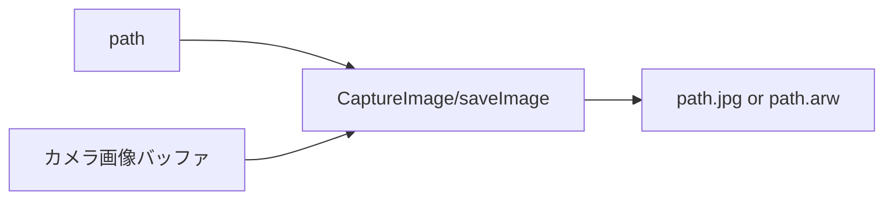

---

#### 2-2-2. 機能名：フォーカス・ライブビュー制御

##### 2-2-2-1. 機能概要

| 項目 | 内容 |
|------|------|
| 機能ID | CC-F05, CC-F06, CC-F07, CC-F08, CC-F09 |
| 機能名 | フォーカス・ライブビュー制御 |
| 機能概要 | フォーカス制御、AFエリア設定、ライブビュー取得・保存を提供 |
| 利用者 | 上位アプリ |
| 起動契機 | 各API呼び出し |
| 入力 | mode、AfAreaSetting、thresh、area、savePath |
| 出力 | bool、ImageSource、マーカー情報、jpgファイル |
| 関連機能 | CC-F01, CC-F02 |
| 前提条件 | カメラ接続済み |
| 事後条件 | 指定操作が反映される |
| 備考 | 一部処理は失敗時null返却 |

##### 2-2-2-2. 画面仕様

対象外（ライブラリ機能のため画面なし）

##### 2-2-2-3. 帳票仕様

対象外

##### 2-2-2-4. EUCファイル（Downloadable File）仕様

対象外

##### 2-2-2-5. 関連システムインタフェース仕様

###### インタフェース一覧

| IF ID | 連携先システム | 方向 | 連携方式 | 概要 | 頻度 | 備考 |
|-------|----------------|------|----------|------|------|------|
| IF-CC-03 | 上位アプリ | 受信 | C#メソッド呼び出し | AF/LiveView実行要求 | 要求時 | |
| IF-CC-04 | OpenCvSharp | 双方向 | ライブラリ呼び出し | マーカー抽出と描画 | 要求時 | GetLiveViewImage系 |

###### 関連システム関連図

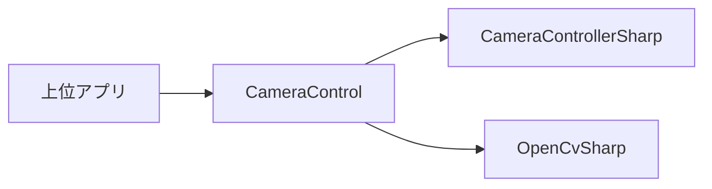

###### インタフェース項目仕様

| 項目名 | 説明 | 型 | 桁数 | 必須 | 変換ルール | 備考 |
|--------|------|----|------|------|------------|------|
| mode | フォーカスモード | string | 可変 | SetFocusMode時必須 | ASCII変換 | 例 MF, AF_S |
| afArea.focusAreaType | AFエリアタイプ | string | 可変 | SetAfArea時必須 | 許可値チェック | Wide/Zone/Center/FlexibleSpot* |
| afArea.focusAreaX/Y | AFエリア座標 | ushort | - | 条件付き必須 | 範囲チェック | FlexibleSpot時のみ |
| thresh | 二値化閾値 | int | - | GetLiveViewImage時必須 | そのまま使用 | |
| area | 面積基準値 | int | - | 任意 | 0時フィルタなし | |
| savePath | ライブビュー保存先 | string | 可変 | LiveView時必須 | .jpg付与 | |

###### 処理内容

| 項目 | 内容 |
|------|------|
| 起動契機 | API呼び出し |
| 処理タイミング | 同期実行 |
| リトライ方針 | AutoFocusは最大10回再試行 |
| 異常時対応 | 例外送出またはnull返却 |

##### 2-2-2-6. 入出力処理仕様

###### 処理概要

| 項目 | 内容 |
|------|------|
| 処理名 | ライブビュー取得処理 |
| 処理種別 | オンライン |
| 処理概要 | ライブ画像を取得し、必要に応じてマーカー検出結果付き画像を返却 |
| 実行契機 | GetLiveViewImage/LiveView呼び出し |
| 実行タイミング | 要求時 |

###### 入出力項目一覧

| 区分 | 項目名 | 説明 | 型 | 桁数 | 必須 | 備考 |
|------|--------|------|----|------|------|------|
| 入力 | thresh | 二値化閾値 | int | - | はい | GetLiveViewImage |
| 入力 | area | 面積閾値 | int | - | いいえ | 0で無効 |
| 出力 | ImageSource | 描画済みライブビュー画像 | ImageSource | - | 条件付き | 取得失敗時null |
| 出力 | lstMarkers/marker | 抽出結果 | List/Custom | - | 条件付き | API差分あり |
| 出力 | savePath.jpg | 保存画像 | file | - | 条件付き | LiveView |

###### データ処理内容

1. SDKからライブ画像を取得する。
2. バッファを画像へ変換し、必要に応じてOpenCVでマーカー抽出する。
3. 表示用ImageSource生成またはjpg保存を行う。

###### IPO図

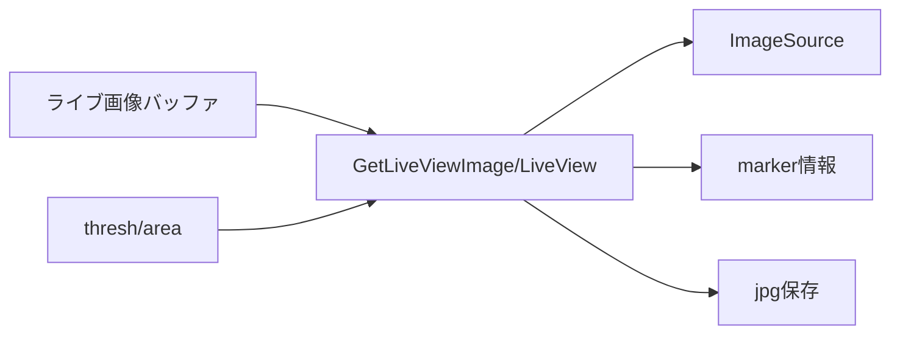

---

### 2-3. データベース仕様

#### データ概要

| データ名 | 概要 | 保持期間 | 更新主体 | 備考 |
|----------|------|----------|----------|------|
| 画像ファイル | 撮影結果（jpg/arw） | 運用方針に依存 | 上位アプリ/CameraControl | ファイル保存 |
| ライブビュー画像 | ライブ取得結果（jpg） | 運用方針に依存 | 上位アプリ/CameraControl | ファイル保存 |
| ShootCondition | 撮影設定データ | 処理時のみ | 上位アプリ | インメモリ |
| AfAreaSetting | AFエリア設定データ | 処理時のみ | 上位アプリ | インメモリ |

#### ERD

対象外（RDB未使用）

#### テーブル仕様

対象外（RDB未使用）

#### カラム仕様

対象外（RDB未使用）

#### CRUD一覧

| 機能ID | 機能名 | テーブル名 | Create | Read | Update | Delete |
|--------|--------|------------|--------|------|--------|--------|
| CC-F03 | 撮影 | 画像ファイル | ○ | × | × | × |
| CC-F09 | ライブビュー保存 | ライブビュー画像 | ○ | × | × | × |

---

### 2-4. メッセージ・コード仕様

#### メッセージ一覧

| メッセージID | 区分 | メッセージ内容 | 表示条件 | 対応方針 | 備考 |
|--------------|------|----------------|----------|----------|------|
| MSG-CC-001 | エラー | Failed to get the number of camera connections. | デバイス列挙失敗 | 例外送出 | OpenCamera |
| MSG-CC-002 | エラー | Failed to get the camera name. | デバイス名取得失敗 | 例外送出 | OpenCamera |
| MSG-CC-003 | エラー | The specified camera (...) was not found. | 指定カメラ未検出 | 例外送出 | OpenCamera |
| MSG-CC-004 | エラー | Failed to connect with the camera. | 接続失敗（再試行後） | 例外送出 | OpenCamera |
| MSG-CC-005 | エラー | Shooting failed. | 撮影失敗（再試行後） | 例外送出 | CaptureImage |
| MSG-CC-006 | エラー | Failed to set the focus mode. | フォーカスモード設定失敗 | 例外送出 | SetFocusMode |
| MSG-CC-007 | エラー | Failed to execute AF_S. | AF実行失敗（リトライ後） | 例外送出 | AutoFocus |
| MSG-CC-008 | エラー | The target AF area is out of settable range. | AF座標範囲外 | 例外送出 | SetAfArea |
| MSG-CC-009 | エラー | The image compression format is wrong. | 未対応圧縮形式 | 例外送出 | saveImage |

#### コード一覧

| コード種別 | コード値 | コード名称 | 説明 | 備考 |
|------------|----------|------------|------|------|
| CompressionType | 0x02 | STD | JPEG保存対象 | |
| CompressionType | 0x03 | FINE | JPEG保存対象 | |
| CompressionType | 0x04 | XFINE | JPEG保存対象 | |
| CompressionType | 0x10 | RAW | ARW保存対象 | |
| AF Area Type | Wide | ワイド | AFエリア種別 | |
| AF Area Type | Zone | ゾーン | AFエリア種別 | |
| AF Area Type | Center | 中央 | AFエリア種別 | |
| AF Area Type | FlexibleSpotS/M/L | 可変スポット | AFエリア種別 | 座標指定あり |

---

### 2-5. 機能/データ配置仕様

#### 配置方針

| 項目 | 内容 |
|------|------|
| 機能配置方針 | カメラ制御ロジックをCameraControl.dllへ集約し上位は業務制御に専念 |
| データ配置方針 | 撮影・ライブビュー結果はファイル出力、制御パラメータはインメモリ |
| 配置上の制約 | x86依存DLLのため実行プロセスをx86で統一 |

#### 機能配置一覧

| 機能ID | 機能名 | 配置先 | 理由 | 備考 |
|--------|--------|--------|------|------|
| CC-F01 | カメラ接続 | CameraControl.dll | SDK依存処理の隠蔽 | |
| CC-F03 | 撮影 | CameraControl.dll | 画像取得・保存の共通化 | |
| CC-F04 | 撮影設定 | CameraControl.dll | 条件設定順序の標準化 | |
| CC-F06 | オートフォーカス | CameraControl.dll | リトライとモード復帰の共通化 | |
| CC-F08 | ライブビュー取得 | CameraControl.dll | OpenCV解析の共通化 | |

#### データ配置一覧

| データ名 | 配置先 | 保存形式 | バックアップ方針 | 備考 |
|----------|--------|----------|------------------|------|
| 撮影画像 | 上位アプリ指定パス | jpg/arw | 上位運用に従う | CameraControlが保存 |
| ライブビュー画像 | 上位アプリ指定パス | jpg | 上位運用に従う | LiveViewで保存 |
| ShootCondition | アプリメモリ | オブジェクト | 不要 | 都度受け渡し |
| AfAreaSetting | アプリメモリ | オブジェクト | 不要 | 都度受け渡し |

---

## 3. 付録

### 3-1. 用語集

| 用語 | 説明 |
|------|------|
| CameraControl | カメラ制御を提供する共通ライブラリ |
| CameraControllerSharp | Sonyカメラ制御SDK |
| ShootCondition | 撮影条件を保持するデータモデル |
| AfAreaSetting | AFエリア種別・座標を保持するデータモデル |
| LiveView | ライブ画像取得機能 |

---

### 3-2. 改版履歴

| バージョン | 日付 | 作成者 | 変更内容 |
|------------|------|--------|----------|
| 1.0 | 2026年4月14日 | システム分析チーム | 初版 |
