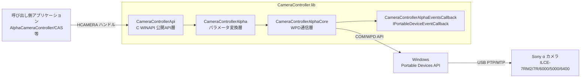
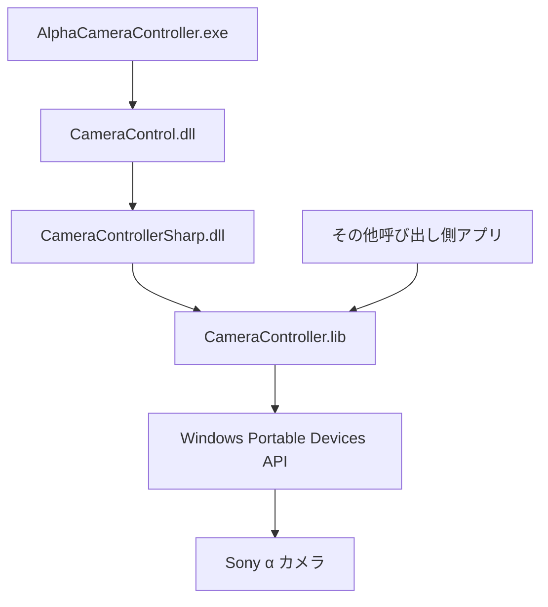
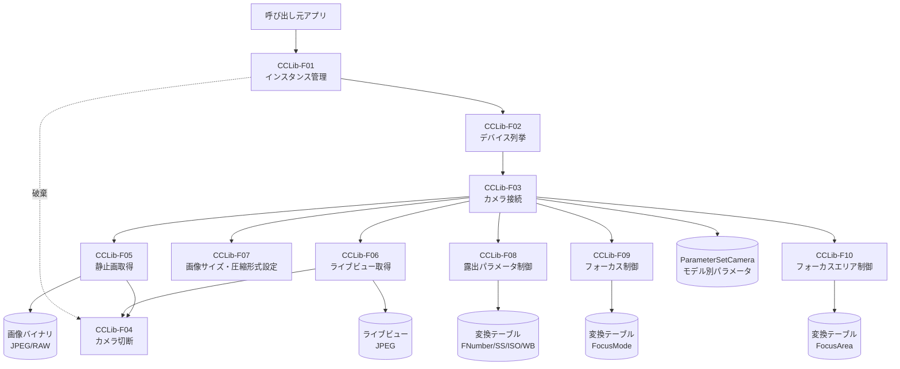
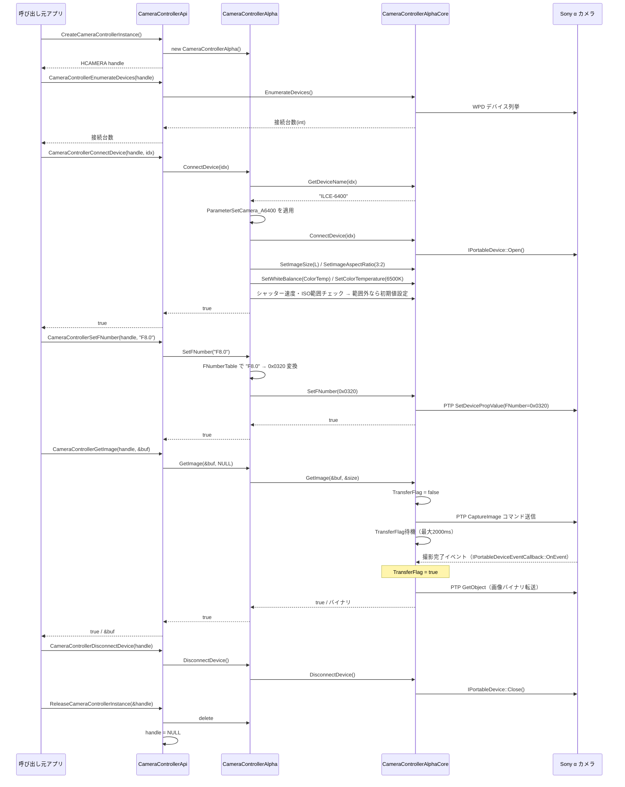
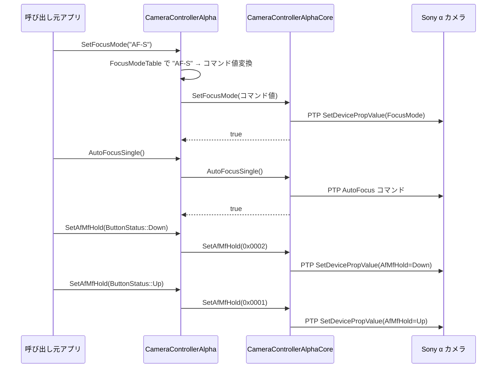
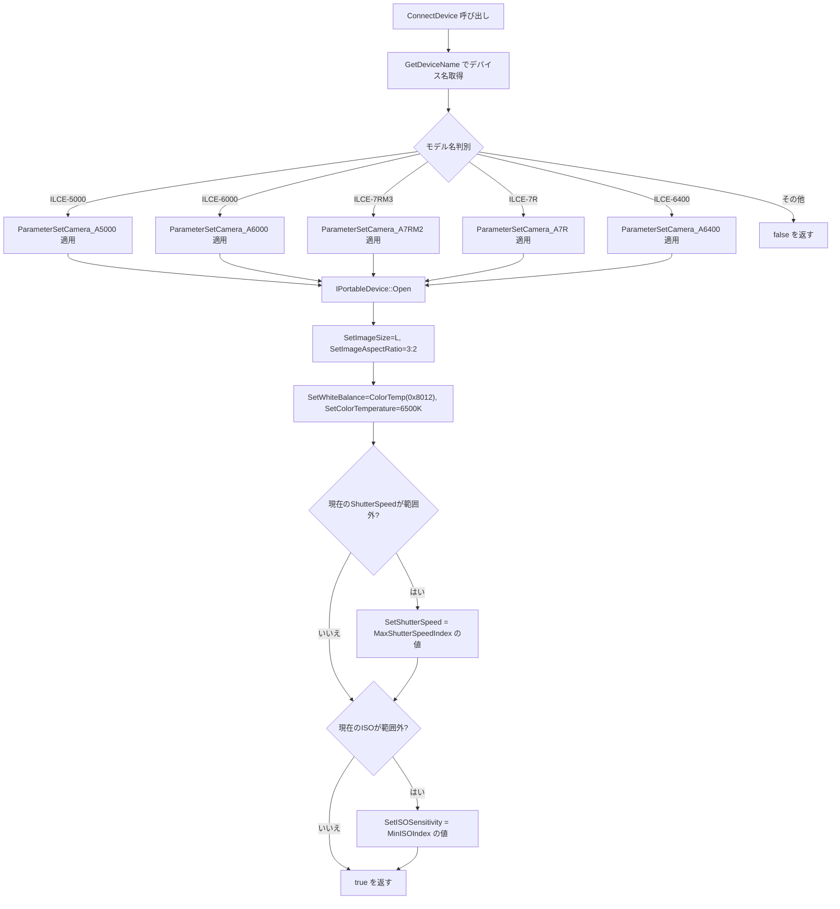

# CameraController.lib 基本設計書

| 項目 | 内容 |
|------|------|
| プロジェクト名 | CameraController.lib |
| システム名 | CameraController.lib |
| 作成日 | 2026年4月15日 |
| 作成者 | （記入） |
| バージョン | 1.0 |
| 関連文書 | 要件定義書：docs/CameraControllerLib_要件定義書.md |

---

## 1. システム概要書

### 1-1. システム全体像

#### システム概要

CameraController.lib は、Sony α（アルファ）シリーズカメラをWindows上からプログラム制御するためのネイティブC++静的ライブラリである。

主な利用形態は CameraControllerSharp.dll のビルド時に本ライブラリを静的リンクしてネイティブ制御処理を取り込む構成であり、必要に応じて公開API経由でネイティブアプリケーションから直接利用することもできる。

Windows Portable Devices（WPD）APIおよびPTP/MTPプロトコルを介してUSB接続カメラを操作し、呼び出し側アプリケーションに対してデバイス列挙・接続管理・撮影実行・各種撮影パラメータ制御・フォーカス制御を文字列ベースの統一インタフェースで提供する。

内部は3層構造で構成される。
- **公開APIレイヤ**（`CameraControllerApi`）：Cスタイル WINAPI 関数群。.NET/Pure-C環境からの利用を可能にする
- **パラメータ変換レイヤ**（`CameraControllerAlpha`）：文字列とPTPコマンド値の相互変換、カメラモデル別パラメータ範囲管理
- **WPD通信レイヤ**（`CameraControllerAlphaCore`）：`IPortableDevice` COMインタフェースを用いた実通信・デバイス操作

接続確立時にデバイス名からカメラモデルを判別し、`ParameterSetCamera` 構造体で管理されたモデル別パラメータ(画像サイズ・シャッター速度範囲・ISO範囲等)を自動適用する。

#### システム構成図

#### 構成要素一覧

| No. | 構成要素 | 種別 | 役割 | 備考 |
|-----|----------|------|------|------|
| 1 | CameraControllerApi | モジュール | C WINAPI 形式の公開関数群 | CameraControllerApi.cpp/.hpp |
| 2 | CameraControllerAlpha | クラス | 文字列⇔PTPコマンド値変換、モデル別パラメータ範囲制御 | CameraControllerAlpha.cpp/.h |
| 3 | CameraControllerAlphaCore | クラス | WPD/PTP通信、デバイス操作、画像転送 | CameraControllerAlphaCore.cpp/.h |
| 4 | CameraControllerAlphaEventsCallback | クラス | 撮影完了イベント受信（IPortableDeviceEventCallback実装） | CameraControllerAlphaEventsCallback.cpp/.h |
| 5 | CameraController | 基底クラス | 純粋仮想インタフェース定義 | CameraController.h |
        D --> E[画像サイズ L とアスペクト比 3対2 を設定]
        E --> F[ホワイトバランスを ColorTemp にし 色温度 6500K を設定]

        G -->|はい| H[シャッター速度を許容最大値へ補正]

| 項目 | 内容 |
        I -->|はい| J[ISO感度を許容最小値へ補正]
| アーキテクチャ | ネイティブC++静的ライブラリ（.lib）/ Visual Studio MSVC ビルド |
| インタフェース | C WINAPI（`__stdcall`）形式の公開API。HCAMERAハンドルで状態管理 |
| 主利用形態 | CameraControllerSharp.dll へのビルド時静的リンク。必要に応じてネイティブアプリからの直接リンクも可能 |
| 通信方式 | WPD（Windows Portable Devices）API 経由のUSB PTP/MTP有線通信 |
| イベント処理 | `IPortableDeviceEventCallback` 実装による撮影完了イベント受信（ポーリング不要） |
| モデル差異吸収 | `ParameterSetCamera` 構造体でモデル別パラメータを管理。接続時にデバイス名からモデル自動判別 |
| パラメータ変換 | 変換テーブル（FNumberTable 等）を `CameraControllerAlphaParameterTable.h` に集約 |
| 拡張方針 | 新モデル追加は `CameraControllerAlphaParameterModelTable.h` への定義追加のみで対応可能 |

---

### 1-2. アプリケーションマップ

#### アプリケーションマップ

#### アプリケーション一覧

| No. | アプリケーション名 | 区分 | 主な役割 | 利用者・利用部門 | 備考 |
|-----|--------------------|------|----------|------------------|------|
| 1 | CameraController.lib | 静的ライブラリ | Sony αカメラ制御の抽象化・API提供 | 呼び出し側アプリ（内部利用） | 本ドキュメントの対象 |
| 2 | CameraControllerSharp.dll | C++/CLI DLL | CameraController.lib を組み込んだ .NET 向け制御ラッパー | CameraControl.dll | 主利用形態 |
| 3 | CameraControl.dll | 呼び出し元ライブラリ | 上位アプリ向けのカメラ制御抽象化レイヤ | AlphaCameraController / CAS | 主利用者 |
| 4 | AlphaCameraController.exe | 呼び出し元アプリ | CAS向けカメラ制御実行 | CASシステム | 主利用者 |
| 5 | Windows Portable Devices API | OS API | カメラとのUSB PTP通信 | CameraController.lib 内部 | OS標準API |

#### アプリケーション間関係

| 連携元 | 連携先 | 連携概要 | 主なデータ | 連携方式 |
|--------|--------|----------|------------|----------|
| CameraControl.dll | CameraControllerSharp.dll | .NET からのカメラ制御要求 | デバイス名、設定値、画像バッファ | DLL 参照 |
| CameraControllerSharp.dll | CameraController.lib | ネイティブ制御処理の呼び出し | 制御パラメータ、画像取得要求 | ビルド時静的リンク |
| 呼び出し側アプリ | CameraController.lib | カメラ制御要求 | HCAMERA ハンドル、パラメータ文字列、画像バッファポインタ | 静的リンク（.lib）+ C WINAPI 関数呼び出し |
| CameraController.lib | WPD API | デバイス操作・画像取得 | IPortableDevice COM オブジェクト、PROPVARIANT 値 | COM インタフェース呼び出し |
| WPD API | Sony α カメラ | PTP コマンド送受信 | PTPプロパティコード、画像JPG/RAWバイナリ | USB 有線（PTP/MTP） |
| Sony α カメラ | CameraControllerAlphaEventsCallback | 撮影完了通知 | IPortableDeviceValues（イベントパラメータ） | COM イベントコールバック |

---

### 1-3. アプリケーション機能一覧

| アプリケーション名 | 機能ID | 機能名 | 機能概要 | 利用者 | 優先度 | 備考 |
|--------------------|--------|--------|----------|--------|--------|------|
| CameraController.lib | CCLib-F01 | インスタンス管理 | CameraControllerAlpha インスタンスのHCAMERAハンドル生成・破棄 | 呼び出し元アプリ | 高 | Create/Release |
| CameraController.lib | CCLib-F02 | デバイス列挙 | USB接続中のSony αカメラ台数取得およびデバイス名取得 | 呼び出し元アプリ | 高 | EnumerateDevices / GetDeviceName |
| CameraController.lib | CCLib-F03 | カメラ接続 | デバイス名からモデル判別・パラメータ適用・初期値設定・接続確立 | 呼び出し元アプリ | 高 | ConnectDevice（index / name） |
| CameraController.lib | CCLib-F04 | カメラ切断 | 接続中カメラの切断処理 | 呼び出し元アプリ | 高 | DisconnectDevice |
| CameraController.lib | CCLib-F05 | 静止画取得 | 撮影実行・画像バイナリ（JPEG/RAW）取得 | 呼び出し元アプリ | 高 | GetImage |
| CameraController.lib | CCLib-F06 | ライブビュー取得 | ライブビュー用JPEGバイナリ取得 | 呼び出し元アプリ | 高 | GetLiveImage |
| CameraController.lib | CCLib-F07 | 画像サイズ・圧縮形式設定 | 画像サイズ（S/M/L）および圧縮形式（ECO〜RAWC+JPG）の取得・設定 | 呼び出し元アプリ | 高 | SetImageSize / SetCompressionSetting |
| CameraController.lib | CCLib-F08 | 露出パラメータ制御 | F値・シャッター速度・ISO感度・ホワイトバランスの取得・設定・ステップ変更 | 呼び出し元アプリ | 高 | Get/Set/Change 各パラメータ |
| CameraController.lib | CCLib-F09 | フォーカス制御 | フォーカスモード取得・設定、AF/MFホールド、ニアファー調整、シングルAF実行 | 呼び出し元アプリ | 高 | FocusMode / SetAfMfHold / ChangeNearFar / AutoFocusSingle |
| CameraController.lib | CCLib-F10 | フォーカスエリア制御 | フォーカスエリア種別の取得・設定、AFエリア座標の取得・設定 | 呼び出し元アプリ | 中 | GetFocusArea / SetFocusArea / GetAfAreaPosition / SetAfAreaPosition |

---

## 2. アプリケーション詳細

### 2-1. 機能関連図

#### 対象アプリケーション

CameraController.lib （全モジュール）

#### 機能関連図

#### 補足説明

| 項目 | 内容 |
|------|------|
| 機能間連携の要点 | ConnectDevice（CCLib-F03）は接続確立に加えてモデル判別・ParameterSetCamera 適用・初期値設定を一括実施するため、他の操作系機能（F05〜F10）は ConnectDevice 完了後にのみ有効となる |
| 前提条件 | CreateCameraControllerInstance（CCLib-F01）でハンドルを取得後、EnumerateDevices（CCLib-F02）を呼び出してデバイスを認識してから ConnectDevice（CCLib-F03）を実行すること |
| 制約事項 | 1ハンドルにつき1カメラ接続のみ。マルチスレッドからの同時呼び出しは未対応 |

#### シーケンス図

##### 基本操作シーケンス（接続〜撮影〜切断）

##### フォーカス制御シーケンス（MF→AF-S への切り替え）

---

### 2-2. 各機能仕様

---

#### 2-2-1. 機能名：インスタンス管理

##### 2-2-1-1. 機能概要

| 項目 | 内容 |
|------|------|
| 機能ID | CCLib-F01 |
| 機能名 | インスタンス管理 |
| 機能概要 | `CameraControllerAlpha` インスタンスを生成し `HCAMERA`（void*）ハンドルとして返す。または既存インスタンスを破棄する |
| 利用者 | 呼び出し元アプリケーション |
| 起動契機 | アプリケーション初期化時（生成）・終了時（破棄） |
| 入力 | なし（生成時）／ HCAMERA* ハンドル（破棄時） |
| 出力 | HCAMERA ハンドル（生成時）／ handle = NULL（破棄時） |
| 関連機能 | CCLib-F02〜F10（ハンドルが前提） |
| 前提条件 | なし |
| 事後条件 | 生成後は有効なHCAMERAハンドルが利用可能。破棄後はハンドルはNULL |
| 備考 | `new(std::nothrow)` によるアロケーション失敗時はNULLを返す |

##### 2-2-1-2. 画面仕様

対象外（ライブラリに画面なし）

##### 2-2-1-3. 帳票仕様

対象外

##### 2-2-1-4. EUCファイル仕様

対象外

##### 2-2-1-5. 関連システムインタフェース仕様

###### インタフェース一覧

| IF ID | 連携先システム | 方向 | 連携方式 | 概要 | 頻度 | 備考 |
|-------|----------------|------|----------|------|------|------|
| IF-CCLib-01 | 呼び出し元アプリ | 双方向 | C WINAPI 関数 | ハンドル生成・返却・破棄 | アプリ初期化/終了時各1回 | |

###### インタフェース項目仕様

| 項目名 | 説明 | 型 | 必須 | 変換ルール | 備考 |
|--------|------|----|------|------------|------|
| HCAMERA（戻り値） | CameraControllerAlpha* を void* にキャストしたハンドル | void* | — | CameraController* → HCAMERA | NULLはアロケーション失敗 |
| handle（破棄引数） | ReleaseCameraControllerInstance に渡すHCAMERA* | HCAMERA* | 必須 | deleteして handle=NULL | |

###### 処理内容

| 項目 | 内容 |
|------|------|
| 起動契機 | 呼び出し元の明示的な関数呼び出し |
| 処理タイミング | 同期実行 |
| リトライ方針 | なし |
| 異常時対応 | アロケーション失敗時はNULLを返す。呼び出し元でNULLチェックすること |

##### 2-2-1-6. 入出力処理仕様

###### 処理概要

| 項目 | 内容 |
|------|------|
| 処理名 | インスタンス生成・破棄 |
| 処理種別 | オンライン |
| 処理概要 | `new(std::nothrow) CameraControllerAlpha()` でインスタンスを生成しHCAMERAとして返す。または `delete` で解放しNULLに設定する |
| 実行契機 | 呼び出し元の明示的な関数呼び出し |
| 実行タイミング | 即時 |

###### 入出力項目一覧

| 区分 | 項目名 | 説明 | 型 | 必須 | 備考 |
|------|--------|------|----|------|------|
| 出力 | HCAMERA | 生成されたインスタンスハンドル | void* | — | NULL = 失敗 |

###### データ処理内容

1. `new(std::nothrow) CameraControllerAlpha()` を呼び出す。
2. 成功時：`CameraController*` を `HCAMERA` にキャストして返す。
3. 失敗時：NULL を返す。
4. 破棄時：`delete *handle` を実行し `handle = NULL` に設定する。

---

#### 2-2-2. 機能名：デバイス列挙

##### 2-2-2-1. 機能概要

| 項目 | 内容 |
|------|------|
| 機能ID | CCLib-F02 |
| 機能名 | デバイス列挙 |
| 機能概要 | USB接続中のSony αカメラ台数を返す。デバイス名（wchar_t）をインデックス指定で取得する |
| 利用者 | 呼び出し元アプリケーション |
| 起動契機 | ConnectDevice 呼び出し前 |
| 入力 | HCAMERA ハンドル（台数取得）、device_idx / 出力バッファ（名前取得） |
| 出力 | 接続台数（int）、デバイス名（wchar_t）|
| 関連機能 | CCLib-F03（ConnectDevice の前提） |
| 前提条件 | CCLib-F01 でHCAMERAハンドルを取得済みであること |
| 事後条件 | 検出されたデバイス情報が内部に保持される |
| 備考 | 0 は接続なし |

##### 2-2-2-2. 画面仕様

対象外

##### 2-2-2-3. 帳票仕様

対象外

##### 2-2-2-4. EUCファイル仕様

対象外

##### 2-2-2-5. 関連システムインタフェース仕様

###### インタフェース一覧

| IF ID | 連携先システム | 方向 | 連携方式 | 概要 | 頻度 | 備考 |
|-------|----------------|------|----------|------|------|------|
| IF-CCLib-02 | WPD API | 送受信 | COM IPortableDeviceManager | USBデバイスの列挙・デバイス名取得 | 接続前に1回 | |

###### インタフェース項目仕様

| 項目名 | 説明 | 型 | 変換ルール | 備考 |
|--------|------|----|------------|------|
| 接続台数（戻り値） | 接続中デバイス数 | int | WPDから取得したカウント値をそのまま返す | |
| device_name（出力） | wchar_t フレンドリ名 | wchar_t* | WPD IPortableDeviceManager::GetDeviceDescription から取得 | バッファサイズは呼び出し元管理 |

##### 2-2-2-6. 入出力処理仕様

###### データ処理内容

1. `IPortableDeviceManager` COM オブジェクトを生成する。
2. `GetDevices` で接続デバイスIDリストを取得し、台数を返す。
3. `GetDeviceName` 呼び出し時は指定インデックスのデバイスIDから `GetDeviceFriendlyName` でwchar_t名称を取得する。

---

#### 2-2-3. 機能名：カメラ接続

##### 2-2-3-1. 機能概要

| 項目 | 内容 |
|------|------|
| 機能ID | CCLib-F03 |
| 機能名 | カメラ接続 |
| 機能概要 | 指定デバイスにWPD接続を確立し、モデル別パラメータを適用後、撮影に必要な初期値（ImageSize/AspectRatio/WhiteBalance/ColorTemperature/ShutterSpeed/ISO）を設定する |
| 利用者 | 呼び出し元アプリケーション |
| 起動契機 | CCLib-F02 によるデバイス認識後、接続要求時 |
| 入力 | HCAMERA ハンドル、device_idx（int）または device_name（wchar_t*） |
| 出力 | bool（true = 接続成功） |
| 関連機能 | CCLib-F02（前提）、CCLib-F05〜F10（後続） |
| 前提条件 | EnumerateDevices で対象デバイスが認識されていること |
| 事後条件 | カメラが接続済み状態となり、ParameterSetCamera に基づく初期値が適用されている |
| 備考 | 未対応モデル名の場合はfalseを返す |

##### 2-2-3-2. 画面仕様

対象外

##### 2-2-3-3. 帳票仕様

対象外

##### 2-2-3-4. EUCファイル仕様

対象外

##### 2-2-3-5. 関連システムインタフェース仕様

###### インタフェース一覧

| IF ID | 連携先システム | 方向 | 連携方式 | 概要 | 頻度 | 備考 |
|-------|----------------|------|----------|------|------|------|
| IF-CCLib-03 | WPD API / Sony α カメラ | 双方向 | COM / USB PTP | WPD Open + 初期パラメータ設定 | 接続確立時 1回 | |

###### 処理内容（接続〜初期値設定フロー）

##### 2-2-3-6. 入出力処理仕様

###### データ処理内容

1. デバイスインデックスまたは名称指定の2オーバーロードを提供する。名称指定の場合はデバイス名を走査して対応インデックスを特定する。
2. `GetDeviceName` でデバイス名（フレンドリ名）を取得し、`wcsncmp` でモデル名を判別する。
3. 対応モデルの `ParameterSetCamera` 構造体を `mParams` にコピーする。
4. `CameraControllerAlphaCore::ConnectDevice` でWPD接続を開き、`CameraControllerAlphaEventsCallback::Register` でイベント登録を行う。
5. 初期値（ImageSize = L、AspectRatio = 3:2、WhiteBalance = ColorTemp モード 0x8012、ColorTemperature = 6500K）を設定する。
6. 現在のShutterSpeed・ISOを取得し、`ParameterSetCamera` の許容範囲外であれば範囲内の安全値に補正する。

---

#### 2-2-4. 機能名：カメラ切断

##### 2-2-4-1. 機能概要

| 項目 | 内容 |
|------|------|
| 機能ID | CCLib-F04 |
| 機能名 | カメラ切断 |
| 機能概要 | 接続中カメラのイベント登録を解除し、WPD接続を切断する |
| 利用者 | 呼び出し元アプリケーション |
| 起動契機 | アプリケーション終了時またはカメラ切断要求時 |
| 入力 | HCAMERA ハンドル |
| 出力 | bool（true = 切断成功） |
| 関連機能 | CCLib-F01（破棄前に呼び出すこと） |
| 前提条件 | CCLib-F03 による接続済み状態 |
| 事後条件 | カメラ未接続状態 |
| 備考 | 未接続状態での呼び出しはfalseを返す |

##### 2-2-4-2〜4. 画面仕様 / 帳票 / EUCファイル

対象外

##### 2-2-4-6. 入出力処理仕様

###### データ処理内容

1. `CameraControllerAlphaEventsCallback::UnRegister` でデバイスイベント購読を解除する。
2. `IPortableDevice::Close` でWPD接続を閉じる。
3. 内部デバイスポインタをNULLにリセットする。

---

#### 2-2-5. 機能名：静止画取得

##### 2-2-5-1. 機能概要

| 項目 | 内容 |
|------|------|
| 機能ID | CCLib-F05 |
| 機能名 | 静止画取得 |
| 機能概要 | カメラにシャッターコマンドを送信し、撮影完了イベント受信後に画像バイナリ（JPEG/RAW）を取得する |
| 利用者 | 呼び出し元アプリケーション |
| 起動契機 | 撮影実行要求時 |
| 入力 | HCAMERA ハンドル、image_data（出力先 unsigned char**）、image_data_size（UINT*）、is_wait（bool, デフォルトtrue） |
| 出力 | bool（true = 取得成功）、image_data へのバイナリポインタ、image_data_size |
| 関連機能 | CCLib-F03（接続済み前提）、CCLib-F07/F08（撮影前にパラメータ設定） |
| 前提条件 | カメラ接続済みで、set した圧縮形式・画像サイズが適用されていること |
| 事後条件 | image_data にJPEG/RAWバイナリが書き込まれる。バッファ解放は呼び出し側の責務 |
| 備考 | is_wait=true 時は最大 DEFAULT_SHUTTER_WAITING_TIME(2000ms) + DEFAULT_IMAGE_TRANSFER_WAITING_TIME(2000ms)×IMAGE_TRANSFER_WAITING_TIME_COEF(5ms) 待機。失敗時は GET_IMAGE_MAX_TRIAL(3) 回リトライ |

##### 2-2-5-2〜4. 画面仕様 / 帳票 / EUCファイル

対象外

##### 2-2-5-5. 関連システムインタフェース仕様

###### インタフェース一覧

| IF ID | 連携先システム | 方向 | 連携方式 | 概要 | 頻度 | 備考 |
|-------|----------------|------|----------|------|------|------|
| IF-CCLib-05a | Sony α カメラ | 送信 | PTP コマンド | シャッター実行コマンド送信 | 撮影1回毎 | |
| IF-CCLib-05b | Sony α カメラ | 受信 | IPortableDeviceEventCallback | 撮影完了イベント受信 → TransferFlag=true | 撮影完了時 | |
| IF-CCLib-05c | Sony α カメラ | 受信 | PTP GetObject | 画像バイナリ転送 | 撮影完了後 | |

###### 処理内容

| 項目 | 内容 |
|------|------|
| 起動契機 | 呼び出し元の GetImage 呼び出し |
| 処理タイミング | 同期（is_wait=true 時：TransferFlag が true になるまで待機） |
| リトライ方針 | 画像取得失敗時は `GET_IMAGE_MAX_TRIAL`(3) 回リトライ |
| 異常時対応 | false を返す。例外は内部で処理しない（呼び出し元で戻り値確認） |

##### 2-2-5-6. 入出力処理仕様

###### データ処理内容

1. `TransferFlag = false` に初期化する。
2. PTP シャッターコマンドをカメラに送信する。
3. `is_wait=true` の場合、`WAITING_UNIT_TIME`(10ms) 間隔でポーリングしながら `TransferFlag` が true になるか最大待機時間を超えるまで待機する。
4. `TransferFlag=true` を受信後、PTP `GetObject` で画像バイナリを `mImageJpeg` に転送する。
5. `GET_IMAGE_MAX_TRIAL` 回失敗した場合は false を返す。

---

#### 2-2-6. 機能名：ライブビュー取得

##### 2-2-6-1. 機能概要

| 項目 | 内容 |
|------|------|
| 機能ID | CCLib-F06 |
| 機能名 | ライブビュー取得 |
| 機能概要 | プレビュー用の低解像度JPEGバイナリをカメラから取得する（撮影保存なし） |
| 利用者 | 呼び出し元アプリケーション |
| 起動契機 | ライブビュー表示要求時（連続呼び出し可） |
| 入力 | HCAMERA ハンドル、image_data（出力先 unsigned char**）、image_data_size（UINT*） |
| 出力 | bool（true = 取得成功）、ライブビューJPEGバイナリ |
| 関連機能 | CCLib-F03（接続済み前提） |
| 前提条件 | カメラ接続済み |
| 事後条件 | image_data にライブビューJPEGバイナリが書き込まれる |
| 備考 | GetImage とは独立したコマンド。連続呼び出し可能 |

##### 2-2-6-2〜4. 画面仕様 / 帳票 / EUCファイル

対象外

##### 2-2-6-6. 入出力処理仕様

###### データ処理内容

1. PTP ライブビュー取得コマンドをカメラに送信する。
2. 返却された画像バイナリを `image_data` が指すポインタへ設定し、`image_data_size` を更新する。

---

#### 2-2-7. 機能名：画像サイズ・圧縮形式設定

##### 2-2-7-1. 機能概要

| 項目 | 内容 |
|------|------|
| 機能ID | CCLib-F07 |
| 機能名 | 画像サイズ・圧縮形式設定 |
| 機能概要 | 画像サイズ（S/M/L）の設定・取得、および圧縮形式（ECO〜RAWC+JPG）の設定・取得を行う |
| 利用者 | 呼び出し元アプリケーション |
| 起動契機 | 撮影前の設定変更時 |
| 入力 | HCAMERA ハンドル、ImageSizeValue（列挙体）または CompressionSetting（列挙体） |
| 出力 | bool / 現在値（unsigned int） |
| 関連機能 | CCLib-F03（接続後に有効）、CCLib-F05（撮影前に設定） |
| 前提条件 | カメラ接続済み |
| 事後条件 | 指定値がカメラに反映される |
| 備考 | GetImageSize は width/height をピクセル単位で返す（モデル別実サイズ） |

##### 2-2-7-2〜4. 画面仕様 / 帳票 / EUCファイル

対象外

##### 2-2-7-5. 関連システムインタフェース仕様

###### コード一覧（ImageSizeValue）

| コード値 | コード名称 | PTPコマンド値 | 説明 |
|----------|------------|-------------|------|
| L (0x01) | Large | 0x01 | 最大解像度 |
| M (0x02) | Medium | 0x02 | 中解像度 |
| S (0x03) | Small | 0x03 | 小解像度 |

###### コード一覧（CompressionSetting）

| コード値 | コード名称 | PTPコマンド値 | 説明 |
|----------|------------|-------------|------|
| ECO | ECO JPEG | 0x01 | 圧縮率高 |
| STD | Standard JPEG | 0x02 | 標準圧縮 |
| FINE | Fine JPEG | 0x03 | 高画質JPEG |
| XFINE | Extra Fine JPEG | 0x04 | 最高画質JPEG |
| RAW | RAW のみ | 0x10 | ARWファイル |
| RAW_JPG | RAW+JPEG | 0x13 | ARW+JPEG同時 |
| RAWC | RAWC のみ | 0x20 | 圧縮RAW |
| RAWC_JPG | RAWC+JPEG | 0x23 | 圧縮RAW+JPEG同時 |

---

#### 2-2-8. 機能名：露出パラメータ制御

##### 2-2-8-1. 機能概要

| 項目 | 内容 |
|------|------|
| 機能ID | CCLib-F08 |
| 機能名 | 露出パラメータ制御 |
| 機能概要 | F値・シャッター速度・ISO感度・ホワイトバランスの取得（文字列）・設定（文字列）・ステップ変更（±int）を行う |
| 利用者 | 呼び出し元アプリケーション |
| 起動契機 | 撮影前パラメータ設定時 |
| 入力 | HCAMERA ハンドル、パラメータ名文字列（char*）または control_step（char） |
| 出力 | bool / パラメータ名文字列（char* name_buf） |
| 関連機能 | CCLib-F03（接続後に有効） |
| 前提条件 | カメラ接続済み |
| 事後条件 | 指定値がカメラに反映される。ステップ変更時はモデル別範囲内でクランプ |
| 備考 | Set系は各テーブルで文字列→コマンド値変換後にPTPコマンド発行。Get系はPTPから取得したコマンド値→文字列変換 |

##### 2-2-8-2〜4. 画面仕様 / 帳票 / EUCファイル

対象外

##### 2-2-8-5. 関連システムインタフェース仕様

###### パラメータ変換テーブル概要

| テーブル名 | 変換対象 | コマンド値型 | 代表的な設定値例 |
|------------|----------|------------|-----------------|
| FNumberTable | F値 | UINT16 | F8.0 → 0x0320 |
| ShutterSpeedTable | シャッター速度 | UINT32 | 1/100 → 0x00010064 |
| ISOTable | ISO感度 | UINT32 | 200 → 0x000000C8 |
| WhiteBalanceTable | ホワイトバランス（色温度K） | UINT16 | 6500K → 6500 |

###### モデル別パラメータ範囲

| モデル | シャッター速度インデックス範囲 | ISO インデックス範囲 | ホワイトバランスインデックス範囲 |
|--------|------------------------------|---------------------|-------------------------------|
| ILCE-7RM2/3 | Min=10, Max=40 | Min=4 (ISO100), Max=20 | Min=25 (5500K), Max=74 (9900K) |
| ILCE-7R | Min=10, Max=40 | Min=4 (ISO100), Max=15 | Min=25 (5500K), Max=74 (9900K) |
| ILCE-6000 | Min=10, Max=40 | Min=4 (ISO100), Max=15 | Min=25 (5500K), Max=74 (9900K) |
| ILCE-5000 | Min=10, Max=40 | Min=4 (ISO100), Max=15 | Min=25 (5500K), Max=74 (9900K) |
| ILCE-6400 | Min=10, Max=40 | Min=4 (ISO100), Max=20 | Min=25 (5500K), Max=74 (9900K) |

##### 2-2-8-6. 入出力処理仕様

###### データ処理内容（Set系）

1. name_buf に渡された文字列を各変換テーブル（FNumberTable 等）で検索し対応コマンド値を取得する。
2. `CameraControllerAlphaCore::SetFNumber`（またはSetShutterSpeed等）を呼び出し、PTP `SetDevicePropValue` コマンドを発行する。

###### データ処理内容（Get系）

1. `CameraControllerAlphaCore::GetFNumber`（またはGetShutterSpeed等）を呼び出し、PTP `GetDevicePropValue` でコマンド値を取得する。
2. 各変換テーブルでコマンド値から文字列名を逆引きし、name_buf に書き込む。

###### データ処理内容（Change系）

1. 現在値をコマンド値で取得し、テーブルインデックスを特定する。
2. control_step 分インデックスを移動し、モデル別 Min/Max インデックスでクランプする。
3. 新インデックスのコマンド値を用いて Set を実行する。

---

#### 2-2-9. 機能名：フォーカス制御

##### 2-2-9-1. 機能概要

| 項目 | 内容 |
|------|------|
| 機能ID | CCLib-F09 |
| 機能名 | フォーカス制御 |
| 機能概要 | フォーカスモードの取得・設定（文字列）、AF/MFホールドボタン操作、マニュアルフォーカスのニアファー調整、シングルオートフォーカス実行を行う |
| 利用者 | 呼び出し元アプリケーション |
| 起動契機 | フォーカス設定変更時、AFトリガー時 |
| 入力 | HCAMERA ハンドル、フォーカスモード文字列（char*）または ButtonStatus（列挙体）または control_step（char） |
| 出力 | bool / フォーカスモード文字列（char* name_buf） |
| 関連機能 | CCLib-F03（接続後に有効）、CCLib-F10（フォーカスエリアと連携） |
| 前提条件 | カメラ接続済み |
| 事後条件 | 指定フォーカスモードがカメラに反映される。ニアファーはMFモード時に有効 |
| 備考 | SetAfMfHold は ButtonStatus::Down → Up の順で呼び出してホールド操作を完結させる |

##### 2-2-9-2〜4. 画面仕様 / 帳票 / EUCファイル

対象外

##### 2-2-9-5. 関連システムインタフェース仕様

###### コード一覧（ButtonStatus）

| コード値 | コード名称 | PTPコマンド値 | 説明 |
|----------|------------|-------------|------|
| Up (0x0001) | ボタン解放 | 0x0001 | AF/MFホールドボタン UP |
| Down (0x0002) | ボタン押下 | 0x0002 | AF/MFホールドボタン DOWN |

###### FocusModeTable（代表値）

| 文字列名 | PTPコマンド値（UINT16） | 説明 |
|----------|------------------------|------|
| MF | (テーブル定義値) | マニュアルフォーカス |
| AF-S | (テーブル定義値) | シングルAF |
| AF-C | (テーブル定義値) | コンティニュアスAF |
| close_up | (テーブル定義値) | クローズアップ向けAF |

##### 2-2-9-6. 入出力処理仕様

###### データ処理内容

1. `GetFocusMode`：`CameraControllerAlphaCore::GetFocusMode` でUINT16コマンド値取得 → `GetFocusModeFromCommandValue` で文字列変換 → name_buf に書き込み。
2. `SetFocusMode`：name_buf → `GetFocusModeCommandValue` でコマンド値変換 → `CameraControllerAlphaCore::SetFocusMode` でPTP発行。
3. `SetAfMfHold`：`ButtonStatus` を UINT16 にキャストし `CameraControllerAlphaCore::SetAfMfHold` でPTP発行。
4. `ChangeNearFar`：control_step を `CameraControllerAlphaCore::ChangeNearFar` に渡し、PTP ニアファースクロールコマンドを発行。
5. `AutoFocusSingle`：`CameraControllerAlphaCore::AutoFocusSingle` でPTP AF実行コマンド発行。

---

#### 2-2-10. 機能名：フォーカスエリア制御

##### 2-2-10-1. 機能概要

| 項目 | 内容 |
|------|------|
| 機能ID | CCLib-F10 |
| 機能名 | フォーカスエリア制御 |
| 機能概要 | AFエリア種別（ワイド/ゾーン/スポット等）の取得・設定、AFエリアのXY座標位置の取得・設定を行う |
| 利用者 | 呼び出し元アプリケーション |
| 起動契機 | フォーカスエリア変更・座標変更要求時 |
| 入力 | HCAMERA ハンドル、エリア種別文字列（char*）または x/y 座標（UINT16） |
| 出力 | bool / エリア種別文字列 / x・y 座標（UINT16） |
| 関連機能 | CCLib-F09（フォーカスモードと組合わせて使用） |
| 前提条件 | カメラ接続済み、対応するフォーカスモードが設定済みであること |
| 事後条件 | 指定エリア種別・座標がカメラに反映される |
| 備考 | AFエリア座標はUINT16のX/Yで指定。UINT32 packed値と相互変換 |

##### 2-2-10-2〜4. 画面仕様 / 帳票 / EUCファイル

対象外

##### 2-2-10-6. 入出力処理仕様

###### データ処理内容

1. `GetFocusArea`：`CameraControllerAlphaCore::GetFocusArea` でUINT16取得 → `GetFocusAreaFromCommandValue` で文字列変換。
2. `SetFocusArea`：文字列 → `GetFocusAreaCommandValue` でコマンド値変換 → `CameraControllerAlphaCore::SetFocusArea` でPTP発行。
3. `GetAfAreaPosition`：`CameraControllerAlphaCore::GetAfAreaPosition` でUINT32 packed値取得 → 上位16bit = X、下位16bit = Y に分解して返す。
4. `SetAfAreaPosition`：X/Y を UINT32 packed値に合成 → `CameraControllerAlphaCore::SetAfAreaPosition` でPTP発行。

---

### 2-3. データベース仕様

#### データ概要

| データ名 | 概要 | 保持期間 | 更新主体 | 備考 |
|----------|------|----------|----------|------|
| FNumberTable | F値⇔PTPコマンド値変換テーブル | コンパイル時（静的配列） | ライブラリ（変更不可） | CameraControllerAlphaParameterTable.h に定義 |
| ShutterSpeedTable | シャッター速度⇔PTPコマンド値変換テーブル | コンパイル時（静的配列） | ライブラリ（変更不可） | 同上 |
| ISOTable | ISO感度⇔PTPコマンド値変換テーブル | コンパイル時（静的配列） | ライブラリ（変更不可） | ISO-AUTO・マルチフレームNR含む |
| WhiteBalanceTable | ホワイトバランス（色温度K）⇔コマンド値テーブル | コンパイル時（静的配列） | ライブラリ（変更不可） | |
| FocusModeTable | フォーカスモード⇔コマンド値テーブル | コンパイル時（静的配列） | ライブラリ（変更不可） | |
| FocusAreaTable | フォーカスエリア⇔コマンド値テーブル | コンパイル時（静的配列） | ライブラリ（変更不可） | |
| ParameterSetCamera | モデル別パラメータ定義（画像サイズ・各種インデックス範囲） | コンパイル時（静的 const 構造体） | ライブラリ（変更不可） | CameraControllerAlphaParameterModelTable.h |
| DeviceProperty | カメラから取得したデバイスプロパティのキャッシュ（内部） | 接続中の実行時メモリ | CameraControllerAlphaCore | SDIExtDevicePropInfo構造体 |
| mImageJpeg | 静止画・ライブビューバイナリキャッシュ（内部） | 直近の撮影結果のみ保持 | CameraControllerAlphaCore | GetImage結果はリンク先ポインタを返す |

#### ERD

対象外（RDB未使用。全データはオンメモリ静的テーブルまたは実行時バッファ）

#### テーブル仕様

対象外

#### CRUD一覧

| 機能ID | 機能名 | データ | Create | Read | Update | Delete |
|--------|--------|--------|--------|------|--------|--------|
| CCLib-F03 | カメラ接続 | ParameterSetCamera（mParams） | ○ | ○ | ○ | × |
| CCLib-F05 | 静止画取得 | mImageJpeg | ○ | ○ | ○ | × |
| CCLib-F06 | ライブビュー取得 | mImageJpeg | ○ | ○ | ○ | × |
| CCLib-F08 | 露出パラメータ制御 | FNumberTable / ShutterSpeedTable / ISOTable / WhiteBalanceTable | × | ○ | × | × |
| CCLib-F09 | フォーカス制御 | FocusModeTable | × | ○ | × | × |
| CCLib-F10 | フォーカスエリア制御 | FocusAreaTable | × | ○ | × | × |

---

### 2-4. メッセージ・コード仕様

#### メッセージ一覧

| メッセージID | 区分 | メッセージ内容 | 表示条件 | 対応方針 | 備考 |
|--------------|------|----------------|----------|----------|------|
| — | — | メッセージ表示機能なし | — | — | 当ライブラリは全エラーを戻り値（bool/int）で通知する。メッセージ表示は呼び出し元の責務 |

#### コード一覧

| コード種別 | コード値 | コード名称 | 説明 |
|------------|----------|------------|------|
| ImageSizeValue | L=0x01 | Large | 最大解像度（モデル別の実ピクセルはParameterSetCamera.Lを参照） |
| ImageSizeValue | M=0x02 | Medium | 中解像度 |
| ImageSizeValue | S=0x03 | Small | 小解像度 |
| CompressionSetting | ECO=0x01 | ECO | 高圧縮JPEG |
| CompressionSetting | STD=0x02 | Standard | 標準JPEG |
| CompressionSetting | FINE=0x03 | Fine | 高画質JPEG |
| CompressionSetting | XFINE=0x04 | Extra Fine | 最高画質JPEG |
| CompressionSetting | RAW=0x10 | RAW only | ARWのみ |
| CompressionSetting | RAW_JPG=0x13 | RAW+JPEG | ARW+JPEGの同時保存 |
| CompressionSetting | RAWC=0x20 | RAWC only | 圧縮RAWのみ |
| CompressionSetting | RAWC_JPG=0x23 | RAWC+JPEG | 圧縮RAW+JPEGの同時保存 |
| ButtonStatus | Up=0x0001 | ボタン解放 | AF/MFホールドボタン解放状態 |
| ButtonStatus | Down=0x0002 | ボタン押下 | AF/MFホールドボタン押下状態 |
| WhiteBalance初期値 | 0x8012 | Color Temperature | 接続時デフォルト設定（色温度モード） |
| ColorTemperature初期値 | 6500 | 6500K | 接続時デフォルト色温度 |
| AspectRatio初期値 | 0x01 | 3:2 | 接続時デフォルトアスペクト比 |

---

### 2-5. 機能/データ配置仕様

#### 配置方針

| 項目 | 内容 |
|------|------|
| 機能配置方針 | 公開API・パラメータ変換・WPD通信の3レイヤに明確に分離し、各レイヤのソースファイルを独立させる |
| データ配置方針 | 変換テーブルとモデル別パラメータはヘッダオンリーの定数配列として`include/`に配置し、すべてのレイヤからインクルード可能にする |
| 配置上の制約 | `include/` 配下のヘッダファイルと `src/` 配下のソースファイルの2ディレクトリ構成を維持する |

#### 機能配置一覧

| 機能ID | 機能名 | 実装ファイル | 備考 |
|--------|--------|------------|------|
| CCLib-F01 | インスタンス管理 | src/CameraControllerApi.cpp | CreateCameraControllerInstance / ReleaseCameraControllerInstance |
| CCLib-F02 | デバイス列挙 | src/CameraControllerAlpha.cpp, src/CameraControllerAlphaCore.cpp | EnumerateDevices / GetDeviceName |
| CCLib-F03 | カメラ接続 | src/CameraControllerAlpha.cpp, src/CameraControllerAlphaCore.cpp | ConnectDevice（モデル判別はAlpha、WPD接続はCore） |
| CCLib-F04 | カメラ切断 | src/CameraControllerAlpha.cpp, src/CameraControllerAlphaCore.cpp | DisconnectDevice |
| CCLib-F05 | 静止画取得 | src/CameraControllerAlpha.cpp, src/CameraControllerAlphaCore.cpp | GetImage（イベント受信はEventsCallback） |
| CCLib-F06 | ライブビュー取得 | src/CameraControllerAlpha.cpp, src/CameraControllerAlphaCore.cpp | GetLiveImage |
| CCLib-F07 | 画像サイズ・圧縮形式設定 | src/CameraControllerAlpha.cpp, src/CameraControllerAlphaCore.cpp | SetImageSize / SetCompressionSetting |
| CCLib-F08 | 露出パラメータ制御 | src/CameraControllerAlpha.cpp, src/CameraControllerAlphaCore.cpp | 変換テーブル利用 |
| CCLib-F09 | フォーカス制御 | src/CameraControllerAlpha.cpp, src/CameraControllerAlphaCore.cpp | FocusMode / AfMfHold / NearFar / AutoFocusSingle |
| CCLib-F10 | フォーカスエリア制御 | src/CameraControllerAlpha.cpp, src/CameraControllerAlphaCore.cpp | FocusArea / AfAreaPosition |
| 公開インタフェース定義 | 全機能 | include/CameraControllerApi.hpp, include/CameraController.h | 外部公開インタフェース |

#### データ配置一覧

| データ名 | 配置先 | 保存形式 | バックアップ方針 | 備考 |
|----------|--------|----------|------------------|------|
| FNumberTable / ShutterSpeedTable / ISOTable / WhiteBalanceTable / FocusModeTable / FocusAreaTable | include/CameraControllerAlphaParameterTable.h | C++ const 静的配列（ヘッダ） | なし（ソース管理対象） | ビルド時に静的リンク |
| ParameterSetCamera（各モデル） | include/CameraControllerAlphaParameterModelTable.h | C++ const 構造体（ヘッダ） | なし（ソース管理対象） | 新モデル追加時にここに追記 |
| mDeviceInfo | 実行時ヒープ（CameraControllerAlphaCore 内部） | DeviceInfo 配列 | 対象外 | EnumerateDevices で確保 |
| mImageJpeg / mAllExtDevicePropInfo | 実行時ヒープ（CameraControllerAlphaCore 内部） | BYTE 配列 | 対象外 | GetImage / ConnectDevice で確保 |
| ビルド成果物（CameraController.lib） | build/Debug/ または build/bin/Debug/ | .lib バイナリ | ビルド再生で復元可能 | 静的ライブラリ本体 |

---

## 3. 付録

### 3-1. 用語集

| 用語 | 説明 |
|------|------|
| WPD API | Windows Portable Devices API。MicrosoftのUSBデバイス制御用COM API。IPortableDevice等からなる |
| PTP | Picture Transfer Protocol。デジタルカメラ向けの画像転送・制御プロトコル |
| MTP | Media Transfer Protocol。PTPの拡張プロトコル。WPDはMTPベースで動作する |
| HCAMERA | `CameraControllerAlpha*` を `void*` にキャストした不透明ハンドル。C APIで状態を受け渡すために使用 |
| WINAPI | `__stdcall` 呼び出し規約マクロ。C互換APIに使用 |
| TransferFlag | 撮影完了イベントを受けてtrueになるフラグ。GetImageの同期待機に使用 |
| ParameterSetCamera | モデル別の画像サイズ・シャッター速度範囲・ISO範囲等をまとめた構造体 |
| FNumberTable等 | パラメータの文字列名⇔PTPコマンド値の変換テーブル（ヘッダオンリー定数配列） |
| IPortableDeviceEventCallback | WPD APIのイベント受信インタフェース。撮影完了通知に使用。CameraControllerAlphaEventsCallbackで実装 |
| DeviceProperty | カメラデバイスの各PTPプロパティを保持するSDIExtDevicePropInfo構造体の集合体 |
| CompressionSetting | 圧縮形式の列挙体（ECO / STD / FINE / XFINE / RAW / RAW_JPG / RAWC / RAWC_JPG） |

---

### 3-2. 改版履歴

| バージョン | 日付 | 作成者 | 変更内容 |
|------------|------|--------|----------|
| 1.0 | 2026年4月15日 | システム分析チーム | 初版 |
