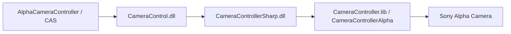
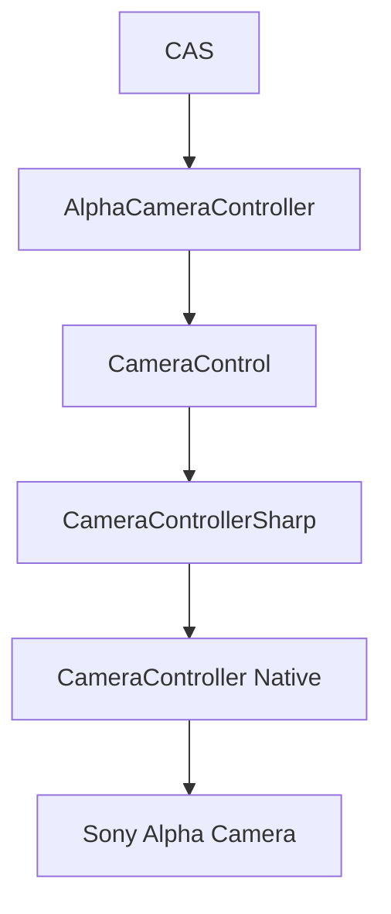
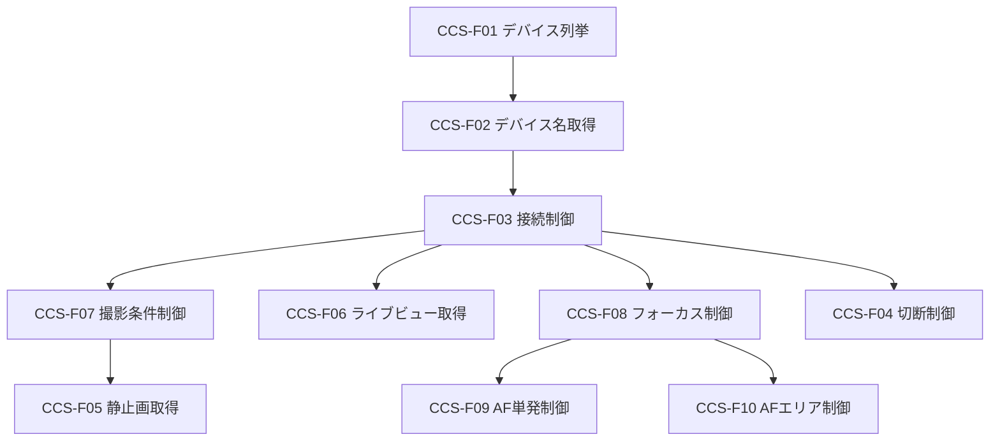
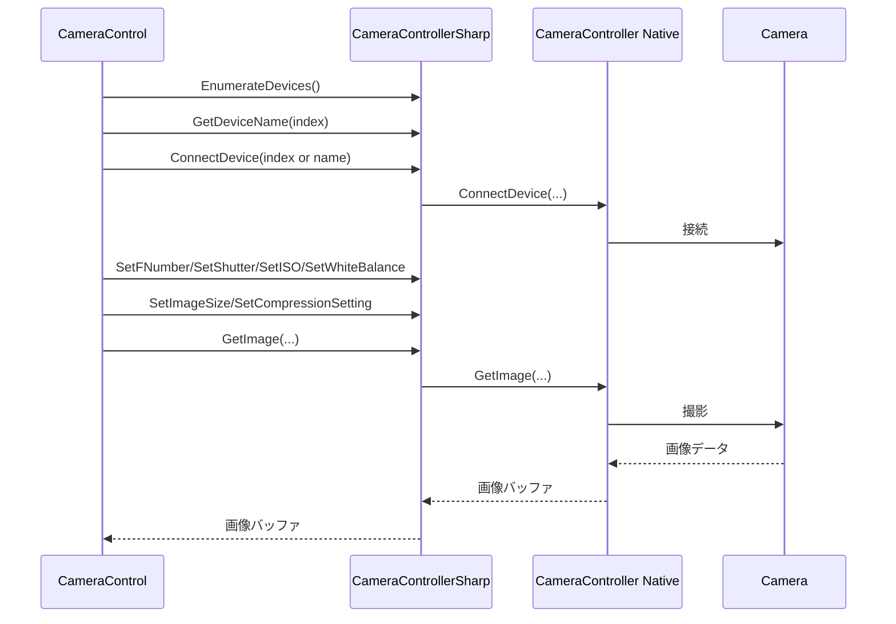
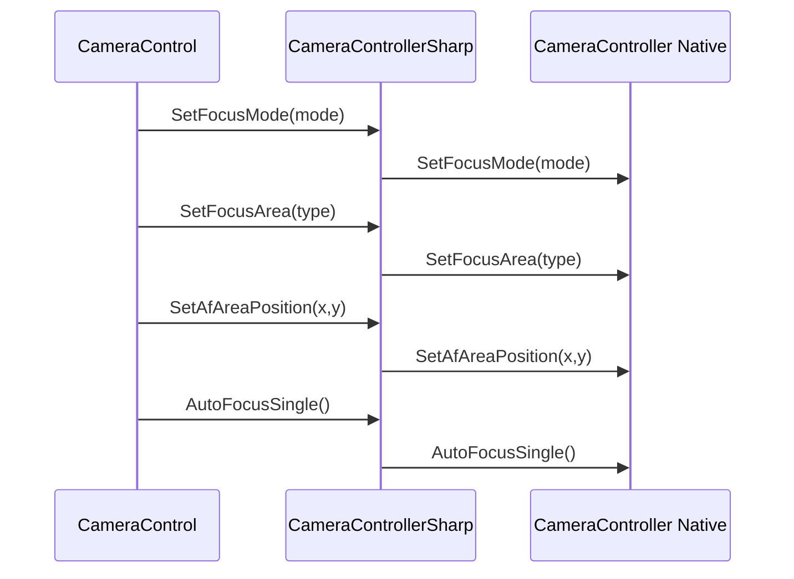
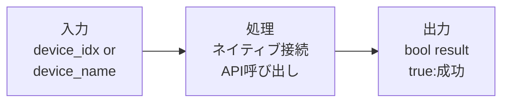
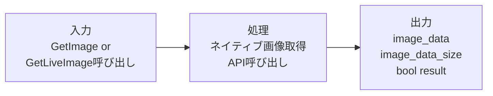
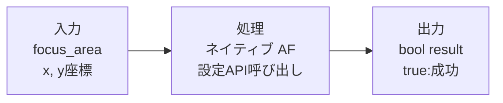

# 基本設計書

| 項目 | 内容 |
|------|------|
| プロジェクト名 | ColorAlignmentSoftware |
| システム名 | CameraControllerSharp.dll |
| 作成日 | 2026年4月15日 |
| 作成者 | システム分析チーム |
| バージョン | 1.0 |
| 関連文書 | 要件定義書：docs/CameraControllerSharp_要件定義書.md |

---

## 1. システム概要書

### 1-1. システム全体像

#### システム概要

CameraControllerSharp.dll は、Sony Alpha カメラ制御ネイティブライブラリ（CameraController.lib / CameraControllerAlpha）を .NET から利用するための C++/CLI ラッパーである。

ビルド時には CameraController.lib を静的リンクし、生成物として CameraControllerSharp.dll にネイティブ制御処理を取り込む。

※ CameraControllerAlpha は CameraControllerSharp.dll の下位で使うネイティブ制御クラス名であり、上位アプリケーション名の AlphaCameraController とは別物である。

上位の CameraControl.dll から呼び出され、カメラ接続、撮影、ライブビュー取得、露出設定、フォーカス設定、AF エリア設定を提供する。

#### システム構成図

#### 構成要素一覧

| No. | 構成要素 | 種別 | 役割 | 備考 |
|-----|----------|------|------|------|
| 1 | CameraControllerSharp.dll | C++/CLI DLL | .NET 向けカメラ制御 API 提供 | CameraController.lib を静的リンクした生成物 |
| 2 | CameraController.lib | ネイティブライブラリ | 実機制御の実処理 | CameraControllerSharp ビルド時に静的リンク |
| 3 | CameraControllerAlpha.h | ヘッダ | ネイティブ API 定義 | ラッパー内部で利用 |
| 4 | CameraControl.dll | C# ライブラリ | 上位アプリ用抽象化レイヤ | CameraControllerSharp を参照 |
| 5 | Sony Alpha Camera | ハードウェア | 画像取得・パラメータ反映 | USB 接続 |

#### ソリューション方針

| 項目 | 内容 |
|------|------|
| ラッパー設計 | CCameraController に API を集約し、ネイティブ呼び出しを透過化 |
| 型設計 | 圧縮形式・画像サイズ・ボタン状態を enum で公開 |
| エラー方針 | 各 API は bool 戻り値で成功/失敗を返却 |
| 資源管理 | デストラクタ/ファイナライザでネイティブインスタンスを破棄 |
| 拡張方針 | 既存メソッド互換維持を優先し、追加機能は後方互換で実施 |

---

### 1-2. アプリケーションマップ

#### アプリケーションマップ

#### アプリケーション一覧

| No. | アプリケーション名 | 区分 | 主な役割 | 利用者・利用部門 | 備考 |
|-----|--------------------|------|----------|------------------|------|
| 1 | CAS | 業務アプリ | 撮影制御要求の起点 | 製造・評価担当 | 上位制御 |
| 2 | AlphaCameraController | 制御アプリ | カメラ操作実行フロー管理 | CAS 内部利用 | 常駐動作 |
| 3 | CameraControl | ライブラリ | 上位向けカメラ制御 API | 開発者 | C#実装 |
| 4 | CameraControllerSharp | ライブラリ | .NET からのネイティブ制御接続 | 開発者 | C++/CLI |
| 5 | CameraController Native | SDK相当 | 実機制御 | システム内部 | CameraController.lib |

#### アプリケーション間関係

| 連携元 | 連携先 | 連携概要 | 主なデータ | 連携方式 |
|--------|--------|----------|------------|----------|
| CameraControl | CameraControllerSharp | 接続/設定/撮影/AF API 呼び出し | デバイス名、設定値、画像バッファ | DLL 呼び出し |
| CameraControllerSharp | CameraController Native | 実機制御命令の委譲 | 制御パラメータ、画像取得要求 | ネイティブ呼び出し |
| CameraController Native | Sony Alpha Camera | カメラ制御実行 | USB 経由制御信号・画像データ | デバイス通信 |

---

### 1-3. アプリケーション機能一覧

| アプリケーション名 | 機能ID | 機能名 | 機能概要 | 利用者 | 優先度 | 備考 |
|--------------------|--------|--------|----------|--------|--------|------|
| CameraControllerSharp | CCS-F01 | デバイス列挙 | 接続可能カメラ数の取得 | CameraControl | 高 | EnumerateDevices |
| CameraControllerSharp | CCS-F02 | デバイス名取得 | 指定 index のデバイス名取得 | CameraControl | 高 | GetDeviceName |
| CameraControllerSharp | CCS-F03 | 接続制御 | デバイス番号/名称で接続 | CameraControl | 高 | ConnectDevice |
| CameraControllerSharp | CCS-F04 | 切断制御 | 接続デバイス切断 | CameraControl | 高 | DisconnectDevice |
| CameraControllerSharp | CCS-F05 | 静止画取得 | 撮影画像バッファ取得 | CameraControl | 高 | GetImage |
| CameraControllerSharp | CCS-F06 | ライブビュー取得 | ライブ画像バッファ取得 | CameraControl | 高 | GetLiveImage |
| CameraControllerSharp | CCS-F07 | 撮影条件制御 | 画像サイズ/圧縮/露出/WB設定 | CameraControl | 高 | Set/Get/Change 系 |
| CameraControllerSharp | CCS-F08 | フォーカス制御 | フォーカスモード・AF/MF制御 | CameraControl | 高 | SetFocusMode等 |
| CameraControllerSharp | CCS-F09 | AF単発制御 | AF 単発実行 | CameraControl | 中 | AutoFocusSingle |
| CameraControllerSharp | CCS-F10 | AFエリア制御 | AFエリア種別・座標制御 | CameraControl | 中 | SetFocusArea等 |

---

## 2. アプリケーション詳細

### 2-1. 機能関連図

#### 対象アプリケーション

CameraControllerSharp.dll

#### 機能関連図

#### 補足説明

| 項目 | 内容 |
|------|------|
| 機能間連携の要点 | 接続完了後に撮影・ライブビュー・設定・AF機能を利用する |
| 前提条件 | 下位ネイティブライブラリとカメラデバイスが利用可能であること |
| 制約事項 | 複数同時接続は想定しない。呼び出し順序は利用側で担保する |

#### シーケンス図

##### 接続から撮影まで

##### フォーカス・AFエリア制御

---

### 2-2. 各機能仕様

#### 2-2-1. 機能名：デバイス管理機能

##### 2-2-1-1. 機能概要

| 項目 | 内容 |
|------|------|
| 機能ID | CCS-F01, CCS-F02, CCS-F03, CCS-F04 |
| 機能名 | デバイス管理機能 |
| 機能概要 | カメラ列挙、デバイス名取得、接続・切断を行う |
| 利用者 | CameraControl |
| 起動契機 | 上位からの API 呼び出し |
| 入力 | device_idx または device_name |
| 出力 | bool（成功/失敗）、デバイス名 |
| 関連機能 | CCS-F05 以降 |
| 前提条件 | カメラが OS から認識されていること |
| 事後条件 | 接続または切断状態が確定する |
| 備考 | 接続後のみ画像取得 API を許容 |

##### 2-2-1-2. 画面仕様

対象外（ライブラリ機能のため画面なし）

##### 2-2-1-3. 帳票仕様

対象外

##### 2-2-1-4. EUCファイル（Downloadable File）仕様

対象外

##### 2-2-1-5. 関連システムインタフェース仕様

###### インタフェース一覧

| IF ID | 連携先システム | 方向 | 連携方式 | 概要 | 頻度 | 備考 |
|-------|----------------|------|----------|------|------|------|
| IF-CCS-01 | CameraControl | 受信 | DLL API | 接続・切断要求受付 | 要求時 | 同期 |
| IF-CCS-02 | CameraController Native | 双方向 | ネイティブ API | デバイス操作実行 | 要求時 | bool 戻り値 |

###### 関連システム関連図

###### インタフェース項目仕様

| 項目名 | 説明 | 型 | 桁数 | 必須 | 変換ルール | 備考 |
|--------|------|----|------|------|------------|------|
| device_idx | 接続対象インデックス | unsigned int | - | 条件付き必須 | そのまま転送 | ConnectDevice(index) |
| device_name | 接続対象デバイス名 | wchar_t* | 可変 | 条件付き必須 | そのまま転送 | ConnectDevice(name) |
| result | 処理結果 | bool | 1 | 必須 | true/false | 失敗時は false |

###### 処理内容

| 項目 | 内容 |
|------|------|
| 起動契機 | 上位 API 呼び出し |
| 処理タイミング | 同期実行 |
| リトライ方針 | 本 DLL では実施しない（上位で実装） |
| 異常時対応 | false 返却 |

##### 2-2-1-6. 入出力処理仕様

###### 処理概要

| 項目 | 内容 |
|------|------|
| 処理名 | デバイス接続処理 |
| 処理種別 | オンライン |
| 処理概要 | デバイス一覧から指定デバイスに接続 |
| 実行契機 | ConnectDevice 呼び出し |
| 実行タイミング | 要求時 |

###### 入出力項目一覧

| 区分 | 項目名 | 説明 | 型 | 桁数 | 必須 | 備考 |
|------|--------|------|----|------|------|------|
| 入力 | device_idx/device_name | 接続対象識別子 | unsigned int / wchar_t* | - | はい | いずれか必須 |
| 出力 | result | 接続可否 | bool | 1 | はい | true:成功 |

###### データ処理内容

1. 入力識別子に応じて下位 API を選択する。
2. ネイティブ接続 API を実行する。
3. 実行結果を bool で返却する。

###### IPO図

---

#### 2-2-2. 機能名：画像取得・設定制御機能

##### 2-2-2-1. 機能概要

| 項目 | 内容 |
|------|------|
| 機能ID | CCS-F05, CCS-F06, CCS-F07 |
| 機能名 | 画像取得・設定制御機能 |
| 機能概要 | 静止画/ライブビュー取得と撮影関連設定の取得・変更を行う |
| 利用者 | CameraControl |
| 起動契機 | 上位からの API 呼び出し |
| 入力 | image_dataポインタ、各設定値 |
| 出力 | 画像バッファ、設定値、bool |
| 関連機能 | CCS-F03 |
| 前提条件 | カメラ接続済み |
| 事後条件 | 画像または設定変更結果が返却される |
| 備考 | バッファ開放は利用側責務 |

##### 2-2-2-2. 画面仕様

対象外

##### 2-2-2-3. 帳票仕様

対象外

##### 2-2-2-4. EUCファイル（Downloadable File）仕様

対象外

##### 2-2-2-5. 関連システムインタフェース仕様

###### インタフェース一覧

| IF ID | 連携先システム | 方向 | 連携方式 | 概要 | 頻度 | 備考 |
|-------|----------------|------|----------|------|------|------|
| IF-CCS-03 | CameraControl | 受信 | DLL API | 撮影・ライブビュー・設定要求 | 要求時 | 同期 |
| IF-CCS-04 | CameraController Native | 双方向 | ネイティブ API | 画像取得・設定反映 | 要求時 | 画像データ返却 |

###### 関連システム関連図

###### インタフェース項目仕様

| 項目名 | 説明 | 型 | 桁数 | 必須 | 変換ルール | 備考 |
|--------|------|----|------|------|------------|------|
| image_data | 画像バッファポインタ | unsigned char** | - | 取得時必須 | そのまま受け渡し | GetImage/GetLiveImage |
| image_data_size | バッファサイズ | unsigned int* | - | 取得時必須 | そのまま受け渡し | バイト数 |
| is_wait | 撮影待機指定 | bool | 1 | GetImage時必須 | そのまま受け渡し | true 運用が基本 |
| image_size | 画像サイズ | ImageSizeValue | - | 設定時必須 | enum を変換 | SetImageSize |
| compression | 圧縮形式 | CompressionSetting | - | 設定時必須 | enum を変換 | SetCompressionSetting |

###### 処理内容

| 項目 | 内容 |
|------|------|
| 起動契機 | 上位 API 呼び出し |
| 処理タイミング | 同期実行 |
| リトライ方針 | 本 DLL では実施しない |
| 異常時対応 | false 返却 |

##### 2-2-2-6. 入出力処理仕様

###### 処理概要

| 項目 | 内容 |
|------|------|
| 処理名 | 画像取得処理 |
| 処理種別 | オンライン |
| 処理概要 | カメラから画像データを取得して上位へ返却 |
| 実行契機 | GetImage / GetLiveImage 呼び出し |
| 実行タイミング | 要求時 |

###### 入出力項目一覧

| 区分 | 項目名 | 説明 | 型 | 桁数 | 必須 | 備考 |
|------|--------|------|----|------|------|------|
| 入力 | is_wait | 撮影待機指定 | bool | 1 | 条件付き必須 | GetImage のみ |
| 出力 | image_data | 画像バッファ | unsigned char** | - | はい | 利用側で解放 |
| 出力 | image_data_size | バッファサイズ | unsigned int* | - | はい | バイト単位 |
| 出力 | result | 成否 | bool | 1 | はい | true:成功 |

###### データ処理内容

1. 下位ネイティブ API へ画像取得要求を中継する。
2. 画像バッファポインタとサイズを受領する。
3. 成否を bool で返却する。

###### IPO図

---

#### 2-2-3. 機能名：フォーカス・AFエリア制御機能

##### 2-2-3-1. 機能概要

| 項目 | 内容 |
|------|------|
| 機能ID | CCS-F08, CCS-F09, CCS-F10 |
| 機能名 | フォーカス・AFエリア制御機能 |
| 機能概要 | フォーカスモード、AF単発、AFエリア種別・座標を制御する |
| 利用者 | CameraControl |
| 起動契機 | 上位からの API 呼び出し |
| 入力 | mode, focus area type, x, y |
| 出力 | bool、状態取得文字列 |
| 関連機能 | CCS-F03 |
| 前提条件 | カメラ接続済み |
| 事後条件 | 指定したフォーカス設定が反映される |
| 備考 | 座標範囲チェックは主に上位側で実施 |

##### 2-2-3-2. 画面仕様

対象外

##### 2-2-3-3. 帳票仕様

対象外

##### 2-2-3-4. EUCファイル（Downloadable File）仕様

対象外

##### 2-2-3-5. 関連システムインタフェース仕様

###### インタフェース一覧

| IF ID | 連携先システム | 方向 | 連携方式 | 概要 | 頻度 | 備考 |
|-------|----------------|------|----------|------|------|------|
| IF-CCS-05 | CameraControl | 受信 | DLL API | フォーカス制御要求 | 要求時 | 同期 |
| IF-CCS-06 | CameraController Native | 双方向 | ネイティブ API | AF 実行・AFエリア制御 | 要求時 | bool 戻り値 |

###### 関連システム関連図

###### インタフェース項目仕様

| 項目名 | 説明 | 型 | 桁数 | 必須 | 変換ルール | 備考 |
|--------|------|----|------|------|------------|------|
| focus_mode | フォーカスモード | char* | 可変 | 条件付き必須 | そのまま受け渡し | SetFocusMode |
| button_status | AF/MFボタン状態 | ButtonStatus | - | 条件付き必須 | enum 変換 | SetAfMfHold |
| focus_area | AFエリア種別 | char* | 可変 | 条件付き必須 | そのまま受け渡し | SetFocusArea |
| x | AFエリアX | unsigned short | - | 条件付き必須 | そのまま受け渡し | SetAfAreaPosition |
| y | AFエリアY | unsigned short | - | 条件付き必須 | そのまま受け渡し | SetAfAreaPosition |

###### 処理内容

| 項目 | 内容 |
|------|------|
| 起動契機 | 上位 API 呼び出し |
| 処理タイミング | 同期実行 |
| リトライ方針 | 本 DLL では実施しない |
| 異常時対応 | false 返却 |

##### 2-2-3-6. 入出力処理仕様

###### 処理概要

| 項目 | 内容 |
|------|------|
| 処理名 | AFエリア設定処理 |
| 処理種別 | オンライン |
| 処理概要 | AFエリア種別・座標を設定する |
| 実行契機 | SetFocusArea / SetAfAreaPosition 呼び出し |
| 実行タイミング | 要求時 |

###### 入出力項目一覧

| 区分 | 項目名 | 説明 | 型 | 桁数 | 必須 | 備考 |
|------|--------|------|----|------|------|------|
| 入力 | focus_area | AFエリア種別 | char* | 可変 | はい | 例: Wide, Center |
| 入力 | x, y | AFエリア座標 | unsigned short | - | 条件付き必須 | FlexibleSpot系で必須 |
| 出力 | result | 成否 | bool | 1 | はい | true:成功 |

###### データ処理内容

1. AFエリア種別をネイティブ API に設定する。
2. 必要時は AF 座標を設定する。
3. 成否を bool で返却する。

###### IPO図

---

### 2-3. データベース仕様

本システムはデータベースを使用しない。

#### データ概要

| データ名 | 概要 | 保持期間 | 更新主体 | 備考 |
|----------|------|----------|----------|------|
| 画像バッファ | 撮影/ライブビュー取得時の一時データ | API 呼び出し中のみ | CameraControllerSharp / 利用側 | メモリ上で扱う |
| デバイス情報 | 列挙時のデバイス名・番号 | 呼び出し中のみ | CameraControllerSharp | 永続化しない |

#### ERD

対象外（DBなし）

#### テーブル仕様

対象外（DBなし）

#### カラム仕様

対象外（DBなし）

#### CRUD一覧

対象外（DBなし）

---

### 2-4. メッセージ・コード仕様

#### メッセージ一覧

| メッセージID | 区分 | メッセージ内容 | 表示条件 | 対応方針 | 備考 |
|--------------|------|----------------|----------|----------|------|
| CCS-MSG-001 | エラー | カメラ接続失敗 | ConnectDevice が false | 上位でリトライ/例外化 | DLL内で表示しない |
| CCS-MSG-002 | エラー | 画像取得失敗 | GetImage/GetLiveImage が false | 上位で再試行判断 | DLL内で表示しない |
| CCS-MSG-003 | エラー | 設定反映失敗 | Set系 API が false | 上位でエラーハンドリング | DLL内で表示しない |

#### コード一覧

| コード種別 | コード値 | コード名称 | 説明 | 備考 |
|------------|----------|------------|------|------|
| CompressionSetting | 0x01 | ECO | 圧縮形式 ECO | enum |
| CompressionSetting | 0x02 | STD | 圧縮形式 STD | enum |
| CompressionSetting | 0x03 | FINE | 圧縮形式 FINE | enum |
| CompressionSetting | 0x04 | XFINE | 圧縮形式 XFINE | enum |
| CompressionSetting | 0x10 | RAW | 圧縮形式 RAW | enum |
| CompressionSetting | 0x13 | RAW_JPG | 圧縮形式 RAW+JPG | enum |
| CompressionSetting | 0x20 | RAWC | 圧縮形式 RAWC | enum |
| CompressionSetting | 0x23 | RAWC_JPG | 圧縮形式 RAWC+JPG | enum |
| ImageSizeValue | 0x01 | L | 画像サイズ L | enum |
| ImageSizeValue | 0x02 | M | 画像サイズ M | enum |
| ImageSizeValue | 0x03 | S | 画像サイズ S | enum |
| ButtonStatus | 0x0001 | Up | AF/MF ボタン状態 Up | enum |
| ButtonStatus | 0x0002 | Down | AF/MF ボタン状態 Down | enum |

---

### 2-5. 機能/データ配置仕様

#### 配置方針

| 項目 | 内容 |
|------|------|
| 機能配置方針 | CameraControllerSharp.dll は CameraControl.dll と同一実行環境に配置し、上位アプリから間接利用する |
| データ配置方針 | 永続データを持たず、画像・状態データはメモリ上で処理する |
| 配置上の制約 | CameraController.lib および依存 DLL の同梱が必要 |

#### 機能配置一覧

| 機能ID | 機能名 | 配置先 | 理由 | 備考 |
|--------|--------|--------|------|------|
| CCS-F01 | デバイス列挙 | CameraControllerSharp.dll | .NET からネイティブ列挙を利用するため | CCameraController |
| CCS-F03 | 接続制御 | CameraControllerSharp.dll | ネイティブ接続 API 抽象化 | index/name 両対応 |
| CCS-F05 | 静止画取得 | CameraControllerSharp.dll | ネイティブ画像取得の中継 | バッファ返却 |
| CCS-F06 | ライブビュー取得 | CameraControllerSharp.dll | ライブビュー中継 | バッファ返却 |
| CCS-F08 | フォーカス制御 | CameraControllerSharp.dll | AF/MF関連操作を集約 | enum 利用 |

#### データ配置一覧

| データ名 | 配置先 | 保存形式 | バックアップ方針 | 備考 |
|----------|--------|----------|------------------|------|
| 画像バッファ | プロセスメモリ | バイナリ | 不要 | API 呼び出し単位で破棄 |
| デバイス名バッファ | プロセスメモリ | wchar_t配列 | 不要 | 列挙処理中のみ |
| 設定文字列バッファ | プロセスメモリ | char配列 | 不要 | Set/Get処理中のみ |

---

## 3. 付録

### 3-1. 用語集

| 用語 | 説明 |
|------|------|
| C++/CLI | .NET とネイティブ C++ を接続する拡張言語 |
| CameraControllerAlpha | 下位ネイティブ制御クラス |
| CCameraController | CameraControllerSharp が公開するラッパークラス |
| AF | オートフォーカス |
| WB | ホワイトバランス |

---

### 3-2. 改版履歴

| バージョン | 日付 | 作成者 | 変更内容 |
|------------|------|--------|----------|
| 1.0 | 2026年4月15日 | システム分析チーム | 初版 |
